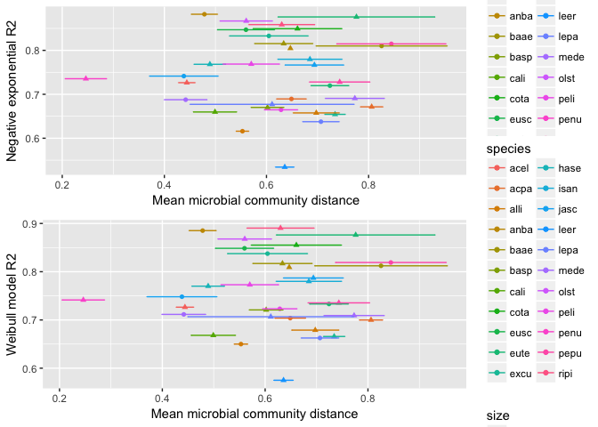

Does chemistry or community better predict mass loss?
================
Marissa Lee
10/23/2017

``` r
#chunk options
knitr::opts_chunk$set(echo = TRUE, message=FALSE, warning=FALSE)

#libraries
devtools::install_github("cornwell-lab-unsw/litterfitter")
library(dplyr)
library(ggplot2)
library(readr)
library(vegan)
library(knitr)
library(litterfitter)
library(magrittr)
library(tidyr)
library(gridExtra)

#fxns
source("code/load_fxns.R")
source("code/curve_fitting_fxns.R")
source("code/distance_fxns.R")
```

### Load microbial community data

``` r
stemSamples<-load_stemSamples() #load stem sample meta data
write.csv(stemSamples, "derived_data/stemSamples.csv")

fung.otu<-load_matotu() #load the fungal OTU table
comm.otu<-add_oomycetes(fung.otu) #add the oomycetes
write.csv(comm.otu, "derived_data/comm_otu.csv")

seqSamples<-load_seqSamples(comm.otu, stemSamples) #create sequence sample meta data table
write.csv(seqSamples, "derived_data/seqSamples.csv")

#plot_sampleEffortCurves(comm.otu)

#load taxon lookup info
taxAndFunguild<-load_TaxAndFunguild(comm.otu)

#load residual signif correlated OTUs from boral Env+LV model
residCor<-load_boralResidCors(taxAndFunguild)
```

### Load wood trait data

``` r
traits.mean<-mergeTraitData()
write.csv(traits.mean, "derived_data/traits_mean.csv")

#missing data
traits.long<-as.data.frame(gather(traits.mean, key=trait, value=value, -(1:3)))
filter(traits.long, is.na(value))
```

    ##   code species_lower  size     trait value
    ## 1 olst          olst small waterperc   NaN
    ## 2 eusc          eusc small         P    NA
    ## 3 eusc          eusc small         K    NA
    ## 4 eusc          eusc small        Ca    NA
    ## 5 eusc          eusc small        Mn    NA
    ## 6 eusc          eusc small        Fe    NA
    ## 7 eusc          eusc small        Zn    NA
    ## 8 eusc          eusc small         N    NA
    ## 9 eusc          eusc small         C    NA

``` r
# ggplot(traits.long, aes(x=species_lower, y=value, color=size)) + 
#   geom_point() + 
#   facet_wrap(~trait, scales="free") +
#   mytheme + theme(axis.text.x = element_text(angle = 90, hjust = 1))

# #the Fe values for large stems are not 0, they are just small values
# subset(traits.long, trait=="Fe") %>%
#   ggplot(aes(x=species_lower, y=value, color=size)) + 
#   geom_point() +
#   facet_wrap(~size, scales="free")
```

### Load mass loss data

``` r
initial_mass <- read_in_initial_mass()
harvest_mass<-LoadHarvestFiles()
mass.data<-bind_rows(initial_mass, harvest_mass)

#look for outliers

# mass.data %>% ggplot(aes(x=time, y=totalSampleDryMass)) + geom_point(alpha=0.6)+theme_bw() 
#looks good

# mass.data %>% ggplot(aes(x=time, y=totalSampleDryMass,col=size)) + geom_point(position="jitter",alpha=0.6)+theme_bw()+scale_y_log10()
# two high values in size==small and harvest 3 are likely real, they have been checked

#mass.data[which(mass.data$totalSampleDryMass==0),]
#no longer any samples with 0 totalSampleDryMass in the dataset

#check for missing data
mass.data %>%
  filter(is.na(totalSampleDryMass)) %>%
  knitr::kable()
```

| unique  | species | size  |  time|  totalSampleDryMass| density | fruiting | insects | drill |  bark\_density|  xylem\_density|  total\_density| notes                                  |
|:--------|:--------|:------|-----:|-------------------:|:--------|:---------|:--------|:------|--------------:|---------------:|---------------:|:---------------------------------------|
| ALLI311 | ALLI    | large |    37|                  NA| NA      |          | NA      | no    |             NA|              NA|              NA| missing from plot -- missing           |
| baae1a  | baae    | small |    37|                  NA| NA      |          | NA      | no    |             NA|              NA|              NA| missing from plot -- missing from plot |

Merge time zero with the other harvests to calculate proportion mass remaining at each time point... Matching failures, all due to missing time 0 data

``` r
#Merge time zero with the other harvests to calculate proportion mass remaining at each time point
mass.data %>%
  filter(time==0) %>%
  rename(timeZeroDensity=density) %>%
  rename(timeZeroMass=totalSampleDryMass) %>%
  select(unique,timeZeroMass,timeZeroDensity)->time_zero

mass.data %>%
  left_join(time_zero,by="unique") %>%
  mutate(pmr=totalSampleDryMass/timeZeroMass) %>%
  mutate(SpeciesCode=tolower(species)) -> plotting_df
  write_csv(plotting_df,"derived_data/plotting_df.csv")
  
  
# here are the matching failures which are currently due to the time zero adjustment for moisture
plotting_df %>%
  filter(is.na(pmr)) %>%
  select(unique, species, size, time, totalSampleDryMass, notes) %>%
  spread(key=time, value=totalSampleDryMass) %>%
  knitr::kable()
```

| unique  | species | size  | notes                                  |   37|
|:--------|:--------|:------|:---------------------------------------|----:|
| ALLI311 | ALLI    | large | missing from plot -- missing           |   NA|
| baae1a  | baae    | small | missing from plot -- missing from plot |   NA|

``` r
#remove NA rows
plotting_df %>%
  filter(!is.na(pmr)) -> plotting_df
```

### Non-linear curve fits of decay trajectories

Using `litterfitter` to apply both negative exponenial and weibull to all species/size classes

``` r
#spdf <- fit_all_curves(plotting_df) #this recalculates all the curve fits, uncomment if the data changes
#write_csv(spdf,"derived_data/mass_loss_parameters.csv")
spdf <- read_csv("derived_data/mass_loss_parameters.csv")
indx<-select(stemSamples, code, species, size)
spdf<-left_join(spdf, indx) #add code

# ggplot(spdf,aes(x=t70,y=w.t70,col=size))+
#   geom_point()+
#   labs(x="Time to 30% mass loss (negative exponential)", 
#        y="Time to 30% mass loss (Weibull)")+
#   geom_abline(slope=1,intercept=0,linetype="dashed")+theme_bw()
```

### Correlation between Code dissimilarities in (a) initial microbial community composition, (b) initial wood traits, and (b) decay trajectory params

``` r
# community composition (bray) vs delta k
pList<-Make_commDistvDist_Fig(distType="bray", valueCol_vec=c("ne.r2", "k","alpha"), 
                              seqSamples, stemSamples, comm.otu, spdf)
p.commVdecay.k<-pList[['k']] + guides(color=FALSE)

# wood trait vs delta k
pList<-Make_woodTraitDistvDist_Fig(valueCol_vec=c("ne.r2","k","alpha"), seqSamples, stemSamples, traits.mean, spdf)
p.traitVdecay.k<-pList[['k']] + guides(color=FALSE)

# wood trait vs community composition (bray)
traits.dist<-Calc_woodTraitDist(traits.mean)
comm.dist<-Calc_commDists(seqSamples, comm.otu, distType="bray")
summ.comm_dist<-SummarizeCommDist_byCodePair(comm.dist)
trait_comm.dist<-MergeCommNWoodTraitdists_byCodePair(traits.dist, summ.comm_dist)
p.commVtrait<-ggplot(trait_comm.dist, aes(x=mean_comm_dist, y=woodTraitDist, color=size)) + geom_point() + 
  guides(color=FALSE) + xlab("Microb comm distance (bray)")

# decay param == k
grid.arrange(p.commVdecay.k, p.traitVdecay.k, p.commVtrait, ncol=2)
```

 Differences between Code initial microbial community composition does not explain differences in decay model fit (r2), rate (k -- shown here), or lagginess (alpha). Wood trait distances tend to have have more explainatory power. Check out code/initialDist\_vs\_decayDist\_btwCode.Rmd for full set of plots.

### Plot presence of key players vs decay param distances between species+size

``` r
source("code/otuIDs_fxns.R")

# summarize the presence of ... in each sample
sapro.df<-Calc_richOTUtype(colNam="Trophic.Mode", grepTerm="Sapro", taxAndFunguild, comm.otu)  
basidio.df<-Calc_richOTUtype(colNam="phylum", grepTerm="Basid", taxAndFunguild, comm.otu)  
path.df<-Calc_richOTUtype(colNam="Trophic.Mode", grepTerm="Patho", taxAndFunguild, comm.otu)  
oomy.df<-Calc_richOTUtype(colNam="kingdom", grepTerm="Protist", taxAndFunguild, comm.otu)  
```

Saprotrophs

``` r
pList<-Plot_richOTUtype(otutype.df=sapro.df, 
                        valueCol_vec=c("ne.r2", "k","alpha"), 
                        otutypeNam="Saprotroph", spdf)
grid.arrange(pList[['ne.r2']] + guides(color=FALSE, shape=FALSE), 
             pList[['k']] + guides(color=FALSE, shape=FALSE), 
             pList[['alpha']] + guides(color=FALSE, shape=FALSE), ncol=2)
```


Basidios

``` r
pList<-Plot_richOTUtype(otutype.df=basidio.df, 
                        valueCol_vec=c("ne.r2", "k","alpha"), 
                        otutypeNam="Basidio", spdf)
grid.arrange(pList[['ne.r2']] + guides(color=FALSE, shape=FALSE), 
             pList[['k']] + guides(color=FALSE, shape=FALSE), 
             pList[['alpha']] + guides(color=FALSE, shape=FALSE), ncol=2)
```


Pathogens

``` r
pList<-Plot_richOTUtype(otutype.df=path.df, 
                        valueCol_vec=c("ne.r2", "k","alpha"), 
                        otutypeNam="Pathogens", spdf)
grid.arrange(pList[['ne.r2']] + guides(color=FALSE, shape=FALSE), 
             pList[['k']] + guides(color=FALSE, shape=FALSE), 
             pList[['alpha']] + guides(color=FALSE, shape=FALSE), ncol=2)
```


Oomycetes

``` r
pList<-Plot_richOTUtype(otutype.df=oomy.df, 
                        valueCol_vec=c("ne.r2", "k","alpha"), 
                        otutypeNam="Oomycete", spdf)
grid.arrange(pList[['ne.r2']] + guides(color=FALSE, shape=FALSE), 
             pList[['k']] + guides(color=FALSE, shape=FALSE), 
             pList[['alpha']] + guides(color=FALSE, shape=FALSE), ncol=2)
```


### Plot frequency of negative/positive taxa 'interactions' vs decay param distances between species+size

### Plot microbial beta diversity WITHIN species+size vs R2 of neg.exponential

need to update this to reflect R2, not AIC

``` r
#calculate pairwise community distances
comm.dist<-Calc_commDists(seqSamples, comm.otu, distType="bray") #2. calc the distances
filter(comm.dist, code1==code2) %>% #3. isolate just the distances within species+size
  select(sampID1, sampID2, code1, size, dist) %>%
  rename("code"="code1") %>% #rename the cols
  group_by(code) %>%
  summarize(mean=mean(dist), #calculate the mean community dist within code classes
            se=sd(dist)/sqrt(length(dist)),
            upper=mean+se,
            lower=mean-se) -> comm.dist.wth

#combine with decay trajectory params
spdf.sub<-select(spdf, code, ne.r2, w.r2)
comm.dist.wth<-left_join(comm.dist.wth, spdf.sub)

#add back the size and species columns
comm.dist.wth$size<-"large"
comm.dist.wth[tolower(comm.dist.wth$code) == comm.dist.wth$code, "size"]<-"small"
comm.dist.wth$species<-tolower(comm.dist.wth$code)

p.ne.r2<-ggplot(comm.dist.wth, aes(x=mean, y=ne.r2, color=species, shape=size)) + 
  geom_point() +
  geom_errorbarh(aes(xmin=lower, xmax=upper)) +
  xlab("Mean microbial community distance") + 
  ylab("Negative exponential R2") 

p.w.r2<-ggplot(comm.dist.wth, aes(x=mean, y=w.r2, color=species, shape=size)) + 
  geom_point() +
  geom_errorbarh(aes(xmin=lower, xmax=upper)) +
  xlab("Mean microbial community distance") + 
  ylab("Weibull model R2") 

#pdf('output/commDist_decayparam_withinCode.pdf', width=8, height=6)
grid.arrange(p.ne.r2, p.w.r2)
```



``` r
#dev.off()
```

Expect to see a positive relationship between R2 and within species+size class microbial community distance. In other words, expect that samples with similar initial microbial communities will have better-fitting decay models. It doesn't look like there is any relationship.

It's kind of nice to see that generally the R2 rank holds between the negative exponential and weibull models.
