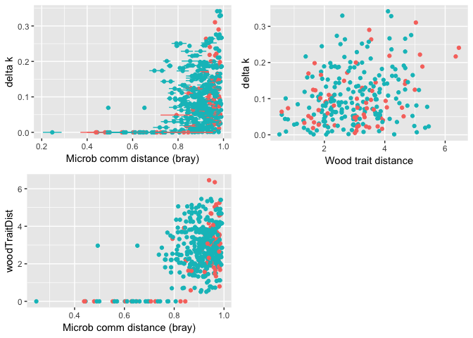
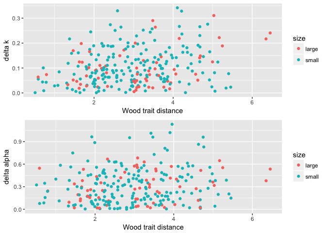
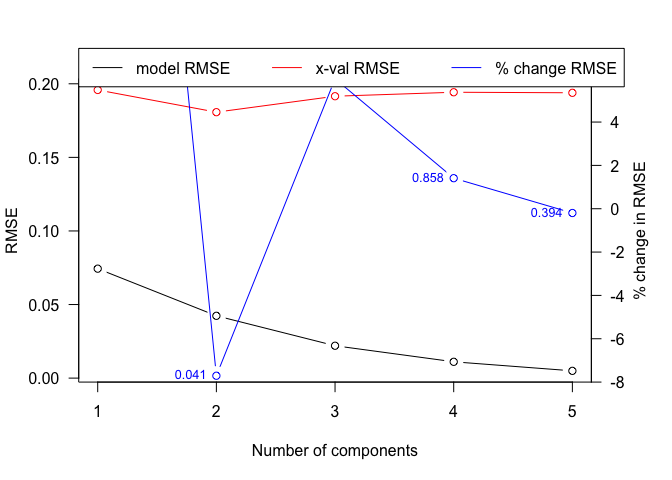
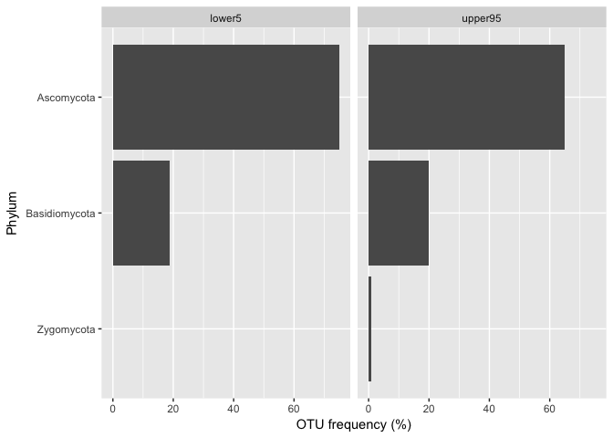
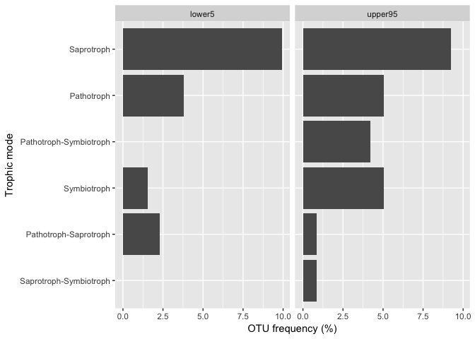
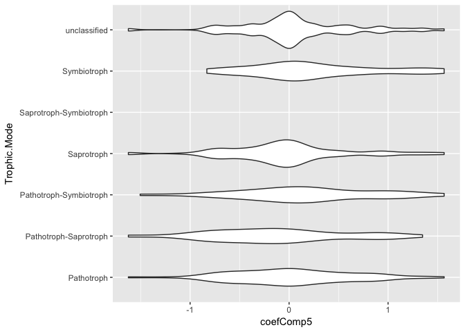

Does chemistry or community better predict mass loss?
================
Marissa Lee
10/23/2017

### Load microbial community data

### Load wood trait data

########################################## 

Wood traits as a predictor
--------------------------

*Hyp:* Stem-specific initial wood traits will predict variation in percent mass loss.

### time7

**less water content and C leads to more mass remaining after 7 months**

    ## 
    ## Call:
    ## lm(formula = curr.time ~ waterperc + C, data = datasets[["time7"]])
    ## 
    ## Residuals:
    ##      Min       1Q   Median       3Q      Max 
    ## -0.23820 -0.05588  0.01033  0.07087  0.19121 
    ## 
    ## Coefficients:
    ##              Estimate Std. Error t value Pr(>|t|)    
    ## (Intercept)  1.962933   0.493400   3.978  0.00022 ***
    ## waterperc   -0.003632   0.001795  -2.023  0.04831 *  
    ## C           -0.018543   0.009354  -1.982  0.05284 .  
    ## ---
    ## Signif. codes:  0 '***' 0.001 '**' 0.01 '*' 0.05 '.' 0.1 ' ' 1
    ## 
    ## Residual standard error: 0.09295 on 51 degrees of freedom
    ## Multiple R-squared:  0.1271, Adjusted R-squared:  0.0929 
    ## F-statistic: 3.714 on 2 and 51 DF,  p-value: 0.0312

### time 13

**larger size stems, less water content, more P and Mn, and less N leads to more mass remaining after 13 months**

    ## 
    ## Call:
    ## lm(formula = curr.time ~ size + waterperc + P + Mn + N, data = datasets[["time13"]])
    ## 
    ## Residuals:
    ##       Min        1Q    Median        3Q       Max 
    ## -0.277899 -0.092108  0.009127  0.079788  0.297114 
    ## 
    ## Coefficients:
    ##               Estimate Std. Error t value Pr(>|t|)    
    ## (Intercept)  1.4304321  0.1740140   8.220  1.2e-10 ***
    ## sizesmall   -0.1720630  0.0458801  -3.750 0.000484 ***
    ## waterperc   -0.0135897  0.0034603  -3.927 0.000280 ***
    ## P            0.0005436  0.0002667   2.038 0.047219 *  
    ## Mn           0.0006215  0.0002790   2.228 0.030735 *  
    ## N           -0.4242546  0.1421344  -2.985 0.004492 ** 
    ## ---
    ## Signif. codes:  0 '***' 0.001 '**' 0.01 '*' 0.05 '.' 0.1 ' ' 1
    ## 
    ## Residual standard error: 0.1415 on 47 degrees of freedom
    ## Multiple R-squared:  0.363,  Adjusted R-squared:  0.2952 
    ## F-statistic: 5.357 on 5 and 47 DF,  p-value: 0.0005615

### time 25

**larger size stems, less water content, more P leads to more mass remaining after 25 months**

    ## 
    ## Call:
    ## lm(formula = curr.time ~ size + waterperc + P, data = datasets[["time25"]])
    ## 
    ## Residuals:
    ##       Min        1Q    Median        3Q       Max 
    ## -0.258325 -0.059630 -0.005782  0.068751  0.261561 
    ## 
    ## Coefficients:
    ##               Estimate Std. Error t value Pr(>|t|)    
    ## (Intercept)  1.1953820  0.1176559  10.160 1.50e-13 ***
    ## sizesmall   -0.0721459  0.0348728  -2.069   0.0440 *  
    ## waterperc   -0.0128901  0.0023561  -5.471 1.59e-06 ***
    ## P            0.0005140  0.0002134   2.408   0.0199 *  
    ## ---
    ## Signif. codes:  0 '***' 0.001 '**' 0.01 '*' 0.05 '.' 0.1 ' ' 1
    ## 
    ## Residual standard error: 0.116 on 48 degrees of freedom
    ## Multiple R-squared:  0.4107, Adjusted R-squared:  0.3738 
    ## F-statistic: 11.15 on 3 and 48 DF,  p-value: 1.139e-05

### time 37

**larger size stems, less water content, more P leads to more mass remaining after 37 months**

    ## 
    ## Call:
    ## lm(formula = curr.time ~ size + waterperc + P + Mn + Zn + N + 
    ##     C, data = datasets[["time37"]])
    ## 
    ## Residuals:
    ##      Min       1Q   Median       3Q      Max 
    ## -0.33992 -0.08112  0.01198  0.08868  0.27249 
    ## 
    ## Coefficients:
    ##               Estimate Std. Error t value Pr(>|t|)    
    ## (Intercept)  0.3343324  0.7751083   0.431  0.66838    
    ## sizesmall   -0.1924388  0.0444506  -4.329 8.78e-05 ***
    ## waterperc   -0.0236176  0.0033363  -7.079 9.89e-09 ***
    ## P            0.0007591  0.0002639   2.877  0.00623 ** 
    ## Mn           0.0006056  0.0003035   1.995  0.05236 .  
    ## Zn          -0.0007677  0.0005331  -1.440  0.15708    
    ## N           -0.2447862  0.1443333  -1.696  0.09712 .  
    ## C            0.0255493  0.0146858   1.740  0.08906 .  
    ## ---
    ## Signif. codes:  0 '***' 0.001 '**' 0.01 '*' 0.05 '.' 0.1 ' ' 1
    ## 
    ## Residual standard error: 0.1324 on 43 degrees of freedom
    ## Multiple R-squared:  0.6233, Adjusted R-squared:  0.562 
    ## F-statistic: 10.16 on 7 and 43 DF,  p-value: 1.968e-07

*Hyp:* Variation in wood traits will lead to differences in decay model fit (r2), rate (k), and lagginess (alpha). Specifically, we expect samples with (a) high waterperc, (b) low density and C, (c) high P, K, Ca, Mn, Fe, Zn, and N, and (d) thicker bark (potential mech: limiting microbial colonization) to have better-fiting decay models (r2), faster decay rates (k), and less lagginess (alpha).

### r2

**greater water content and greater Zn and N leads to better-fitting decay models**

Note: This result changed when I changed waterperc to g water/g wet weight. When waterperc was in terms of g/g dry weight, the best model that greater water content and less C leads to better-fitting decay models

    ## 
    ## Call:
    ## lm(formula = ne.r2 ~ waterperc + barkthick + Ca + Zn + N + C, 
    ##     data = spdf.traits)
    ## 
    ## Residuals:
    ##      Min       1Q   Median       3Q      Max 
    ## -0.11753 -0.02941  0.00184  0.02233  0.12797 
    ## 
    ## Coefficients:
    ##               Estimate Std. Error t value Pr(>|t|)    
    ## (Intercept)  1.278e+00  6.457e-01   1.979   0.0590 .  
    ## waterperc    7.405e-03  1.509e-03   4.906 4.75e-05 ***
    ## barkthick   -3.098e-02  1.587e-02  -1.953   0.0622 .  
    ## Ca          -1.189e-05  6.783e-06  -1.753   0.0919 .  
    ## Zn           1.504e-03  5.664e-04   2.654   0.0136 *  
    ## N            2.092e-01  8.436e-02   2.480   0.0202 *  
    ## C           -1.698e-02  1.291e-02  -1.315   0.2006    
    ## ---
    ## Signif. codes:  0 '***' 0.001 '**' 0.01 '*' 0.05 '.' 0.1 ' ' 1
    ## 
    ## Residual standard error: 0.06306 on 25 degrees of freedom
    ## Multiple R-squared:  0.559,  Adjusted R-squared:  0.4532 
    ## F-statistic: 5.282 on 6 and 25 DF,  p-value: 0.001234

### k

**small size stems, greater water content, thinner bark, less Ca, more Zn, and more N lead to faster decay**

NOTE from Will: Density explains the same part of the variation in decay rates that initial water content does, only less well. (In other words, although, density gets dropped from the best model by the model selection procedure, if we remove initial water from consideration entirely, density is included in the model as the best predictor.)

So my current interpretation is that wood water rentention--related to fiber saturation point and partially captured by the density measurement--has a strong effect on long-term decomposition rates, possibly by maintaining fungal activity further into dry periods. There is also a very likely interaction between this water retention capacity with the fungal community (see results in Setting the Stage paper, Lee et al. in review).

    ## 
    ## Call:
    ## lm(formula = k ~ size + waterperc + barkthick + Ca + Zn + N + 
    ##     C, data = spdf.traits)
    ## 
    ## Residuals:
    ##       Min        1Q    Median        3Q       Max 
    ## -0.092617 -0.034671  0.007271  0.029023  0.123640 
    ## 
    ## Coefficients:
    ##               Estimate Std. Error t value Pr(>|t|)    
    ## (Intercept)  6.021e-01  5.754e-01   1.046 0.305851    
    ## sizesmall    9.050e-02  2.405e-02   3.763 0.000958 ***
    ## waterperc    8.990e-03  1.378e-03   6.524 9.53e-07 ***
    ## barkthick   -3.862e-02  1.406e-02  -2.748 0.011198 *  
    ## Ca          -1.869e-05  5.920e-06  -3.157 0.004263 ** 
    ## Zn           1.811e-03  4.922e-04   3.680 0.001177 ** 
    ## N            2.334e-01  7.674e-02   3.041 0.005628 ** 
    ## C           -1.475e-02  1.135e-02  -1.300 0.206001    
    ## ---
    ## Signif. codes:  0 '***' 0.001 '**' 0.01 '*' 0.05 '.' 0.1 ' ' 1
    ## 
    ## Residual standard error: 0.05446 on 24 degrees of freedom
    ## Multiple R-squared:  0.7486, Adjusted R-squared:  0.6752 
    ## F-statistic: 10.21 on 7 and 24 DF,  p-value: 6.942e-06

### t70

**small stem sizes, less water content, thicker bark, more Ca, less Zn, and less N lead to longer wood "70%"-lives**

Note: This result changed when I changed waterperc to g water/g wet weight. When waterperc was in terms of g/g dry weight, the best model indicated that large size stems, less water content, more Ca, and less Zn lead to longer wood "70%"-lives

    ## 
    ## Call:
    ## lm(formula = t70 ~ size + waterperc + barkthick + Ca + Zn + N, 
    ##     data = spdf.traits)
    ## 
    ## Residuals:
    ##      Min       1Q   Median       3Q      Max 
    ## -0.55548 -0.15857 -0.00642  0.07054  0.58357 
    ## 
    ## Coefficients:
    ##               Estimate Std. Error t value Pr(>|t|)    
    ## (Intercept)  3.799e+00  4.125e-01   9.209 1.65e-09 ***
    ## sizesmall   -6.284e-01  1.314e-01  -4.783 6.54e-05 ***
    ## waterperc   -4.956e-02  7.653e-03  -6.476 8.79e-07 ***
    ## barkthick    1.752e-01  7.308e-02   2.397 0.024301 *  
    ## Ca           1.234e-04  3.203e-05   3.851 0.000725 ***
    ## Zn          -9.272e-03  2.698e-03  -3.436 0.002070 ** 
    ## N           -9.985e-01  4.258e-01  -2.345 0.027272 *  
    ## ---
    ## Signif. codes:  0 '***' 0.001 '**' 0.01 '*' 0.05 '.' 0.1 ' ' 1
    ## 
    ## Residual standard error: 0.3026 on 25 degrees of freedom
    ## Multiple R-squared:  0.735,  Adjusted R-squared:  0.6714 
    ## F-statistic: 11.56 on 6 and 25 DF,  p-value: 3.442e-06

### alpha--- don't interpret yet

########################################## 

Community as a predictor
------------------------

### First, filter community matrix to include only taxa that are present in a least 20% of all the samples. This step removes taxa that may not contribute much to our understanding of the relationship between species’ multivariate abundance and environment.

    ## [1] "Keep 150 of 6128 OTUs"

*Hyp:* Stem-specific initial microbial communitiy compositions will predict variation in percent mass loss, particularly in the early stages of decay.

### time 7, 13, and 25

**none of the community components are significant predictors**

### time 37

**Comp01 is significant; if trim out OTUs that are not present in at least 20% of samples...Comp02 is significant**

    ##             RMSE        R2     Avg.Bias  Max.Bias     Skill delta.RMSE
    ## Comp01 0.1884529 0.1515172  0.033192872 0.2942286  5.557560 -2.8184996
    ## Comp02 0.1749664 0.2407742  0.008951682 0.2788971 18.591259 -7.1564113
    ## Comp03 0.1752001 0.2660234 -0.000556893 0.2185399 18.373655  0.1335602
    ## Comp04 0.1879489 0.2205367  0.003539710 0.2822099  6.062045  7.2766925
    ## Comp05 0.1967444 0.1897768  0.002389760 0.2656368 -2.935780  4.6797384
    ##            p
    ## Comp01 0.391
    ## Comp02 0.041
    ## Comp03 0.484
    ## Comp04 0.981
    ## Comp05 0.934

    ##             RMSE        R2     Avg.Bias  Max.Bias    Skill  delta.RMSE
    ## Comp01 0.1668533 0.2925742 -0.001261747 0.3122426 25.96599 -13.9569840
    ## Comp02 0.1615472 0.3377994 -0.007472631 0.2888952 30.59988  -3.1801339
    ## Comp03 0.1682930 0.3025985 -0.012605013 0.2854822 24.68285   4.1757949
    ## Comp04 0.1708756 0.2921546 -0.014679983 0.2863511 22.35357   1.5345464
    ## Comp05 0.1725708 0.2854071 -0.014202926 0.2902932 20.80528   0.9920909
    ##            p
    ## Comp01 0.044
    ## Comp02 0.235
    ## Comp03 0.940
    ## Comp04 0.825
    ## Comp05 0.922

Investigate the biology underlying time37-associated coefs for Comp02

    ## [1] "Fungi"

By trophic mode 

*Hyp:* Average initial microbial communitiy compositions will predict variation in decay model fit (r2), rate (k), and lagginess (alpha).

### r2, k, t70, (alpha)

**none of the community components are significant predictors**

########################################## 

Community+traits as a predictor
-------------------------------

*Hyp:* After accounting for variation in decay due to wood traits (no models with barkthick or density), stem-specific initial microbial communitiy compositions will predict variation in percent mass loss, particularly in the early stages of decay.

### time 7, 25, 37

**none of the community components are significant predictors**

### time 13

**Comp02 is significant, but if trim out OTUs that are not present in at least 20% of samples then no components are significant**

    ##             RMSE           R2    Avg.Bias  Max.Bias      Skill delta.RMSE
    ## Comp01 0.1684942 7.969996e-03 -0.01227286 0.3008319  -59.80987  26.415927
    ## Comp02 0.1708079 8.029389e-05 -0.01134351 0.3428988  -64.22886   1.373151
    ## Comp03 0.1813353 1.626797e-02 -0.01398033 0.3387630  -85.09640   6.163259
    ## Comp04 0.1861811 2.670958e-03 -0.01869200 0.3402859  -95.12131   2.672318
    ## Comp05 0.2000881 9.511791e-03 -0.01941544 0.3603079 -125.35962   7.469616
    ##            p
    ## Comp01 0.995
    ## Comp02 0.593
    ## Comp03 0.985
    ## Comp04 0.833
    ## Comp05 1.000

    ##             RMSE         R2    Avg.Bias  Max.Bias      Skill delta.RMSE
    ## Comp01 0.1958078 0.09587553 -0.01406066 0.3977193 -115.82077 46.9083971
    ## Comp02 0.1807162 0.02022406 -0.02532412 0.3640608  -83.83481 -7.7073210
    ## Comp03 0.1915530 0.02089810 -0.02731081 0.3899540 -106.54333  5.9965450
    ## Comp04 0.1942539 0.02389339 -0.02709579 0.3915635 -112.40896  1.4100120
    ## Comp05 0.1938709 0.02017169 -0.02696350 0.3920242 -111.57224 -0.1971538
    ##            p
    ## Comp01 1.000
    ## Comp02 0.054
    ## Comp03 0.975
    ## Comp04 0.845
    ## Comp05 0.388

Investigate the biology underlying time13-associated coefs for Comp02

By trophic mode  By phylum 

*Hyp:* After accounting for variation in decay due to wood traits, average initial microbial communitiy compositions will predict variation in decay model fit (r2), rate (k), and lagginess (alpha).

### r2, k, t70, (alpha)

**none of the community components are significant predictors**

########################################## 

Diversity (and diversity of specific clades) as a predictor
-----------------------------------------------------------

**Note that the full community matrix was used for these analyses**

*Hyp:* Greater microbial diversity (richness, Shannon diversity, ... add phylogenetic diversity) will lead to better-fitting decay models (ne.r2), faster decay (k), and less lagginess (alpha) because of the selection effect for fast decayers and complementarity among taxa for decay.
Hyp-Alt: Greater microbial diversity will lead to worse-fitting decay models (ne.r2), slower decay (k), and more lagginess (alpha) because taxa will be allocating more of their resources to combat one another.

### Richness, Shannon's H

**No pattern**

*Hyp:* Greater saprotroph and basidiomycete richness will lead to better-fitting decay models (ne.r2), faster decay (k), and less lagginess (alpha) because the community does not need to wait for the arrival of key decayers to act on the wood substrate.
Hyp-Alt: Greater saprotroph and basidiomycete richness will lead to worse-fitting decay models (ne.r2), slower decay (k), and more lagginess (alpha) because decayers will be allocating more of their resources to combat one another.

### Saprotroph richness, Basidio richness

**No pattern**

*Hyp:* Greater pathogen and oomycete richness will lead to worse-fitting decay models (ne.r2), slower decay (k), and more lagginess (alpha) because the presence of these organisms will inhibit the establishment and activity of decayers.

### Pathogen richness, oomycete richness

**No pattern**

############################################## 

Diversity plus traits as a predictor
------------------------------------

*Hyp:* After accounting for variation in decay due to wood traits, average initial microbial diversity (richness, Shannon diversity, ... add phylogenetic diversity) will predict variation in decay model fit (r2), rate (k), and lagginess (alpha).

### Richness, Shannon's H, Saprotroph richness, Basidio richness, Pathogen richness, Oomycete richness

**No pattern**

############################################## 

Relationship between wood traits and community
----------------------------------------------

*Hyp:* Average initial microbial communitiy compositions will covary with initial wood traits

############################################## 

Extra pieces
------------

1.  *code/testing\_time\_zero.Rmd* -- Including t=0 points to fit decay model affects the liklihood and the model selection criteria, but the curve fits are identical with this formulation. Excluding the t=0 fits has an effect of prefering simpler models, which is the same effect as increasing the penalty for model complexity.

2.  *code/initialDist\_vs\_decayDist\_btwCode.Rmd* -- No apparent relationship between species+size dissimilarities in initial microbial community composition (bray and jaccard) and decay trajectory params

3.  *code/boralOTUpairs\_vs\_decay.Rmd* -- No apparent relationship between frequency of boral-ID'd positively/negatively correlated OTU pairs and decay params

4.  *code/withinInitialDist\_vs\_decayR2.Rmd* -- No apparent relationship between initial microbial diversity WITHIN species+size and decay model R2

5.  *code/unexpectedTaxa.Rmd* -- Mycorrhizal fungi and animal-associated fungi that somehow made it into our OTU table
