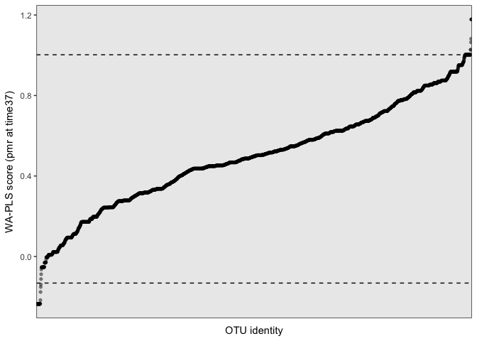
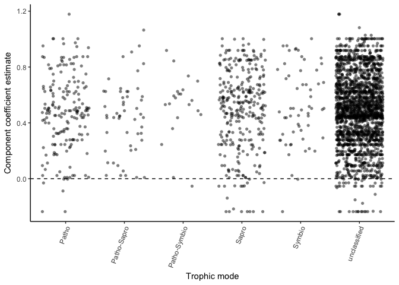
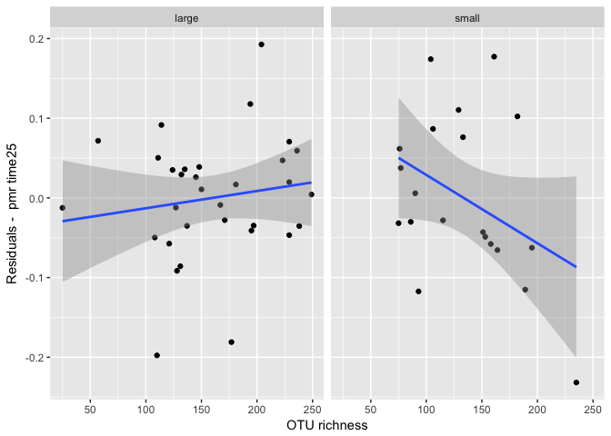

Does chemistry or community better predict mass loss?
================
10/23/2017

### Load microbial community data

### Load wood trait data

### Load percent mass remaining (pmr) data

Plot pmr data 

Calculate decay trajectory fits for each species+size

Compare negative exp. vs weibull by plotting time to 30% mass remaining (t70) for each species+size 

Check for missing stem-level data

    ## # A tibble: 2 x 15
    ## # Groups:   codeStem [2]
    ##   codeStem barkthick      C       Ca density        Fe       K      Mn
    ##      <chr>     <dbl>  <dbl>    <dbl>   <dbl>     <dbl>   <dbl>   <dbl>
    ## 1    acpa2        NA 50.659 3397.019      NA  3859.762 1400.18  38.376
    ## 2    lepa4        NA 48.377 2870.988      NA 14424.700  748.14 246.435
    ## # ... with 7 more variables: N <dbl>, P <dbl>, waterperc <dbl>, Zn <dbl>,
    ## #   species <chr>, size <chr>, code <chr>

    ## # A tibble: 2 x 7
    ## # Groups:   code [2]
    ##    code species  size seq_sampName  drop seq.stem codeStem
    ##   <chr>   <chr> <chr>        <chr> <chr>    <chr>    <chr>
    ## 1  acpa    acpa small        acpa2  acpa        2     <NA>
    ## 2  lepa    lepa small        lepa4  lepa        4     <NA>

    ## # A tibble: 0 x 10
    ## # Groups:   codeStem [0]
    ## # ... with 10 variables: codeStem <chr>, time0 <dbl>, time7 <dbl>,
    ## #   time13 <dbl>, time25 <dbl>, time37 <dbl>, time59 <dbl>, code <chr>,
    ## #   species <chr>, size <chr>

issue \#31 -- There are 2 unique codeStem ids that are found in the trait data (xrf sample names) and the sequence data, but not in the stemSamples data (deployment sample names). These codeStem ids are not found in the percent mass loss data. Because the main goal is to analyze decay responses, I'm going to continue to leave these codeStems out of the stemSamples dataframe. Is it possible that stem id numbers got switched? Something to follow-up on.

Figure 1. Wood species x decay params probably want to use weibull instead? 

    ## quartz_off_screen 
    ##                 2

Figure 2. Time x percent mass remaining by wood species 

    ## quartz_off_screen 
    ##                 2

########################################## 

Wood traits as a predictor
==========================

We expect initial wood traits will explain varitation in species+size decay rate (k and t70), species+size lagginess (alpha), and stem-level percent mass remaining at 7, 13, 25, and 37 months of decay. Specifically, we expect samples with (a) high water percent, (b) low density and total C, (c) high macro and micro nutrients, and (d) thicker bark (potential mech: limiting microbial colonization) to have faster decay and less lagginess.

*Hyp (species+size-level)* Species+size-level initial wood traits will predict variation decay rates and lagginess.
-------------------------------------------------------------------------------------------------------------------

    ## # A tibble: 13 x 4
    ##           term                  k                  t70               ne.r2
    ##  *       <chr>              <chr>                <chr>               <chr>
    ##  1 (Intercept)   1.328 +/- 0.54 *    -3.103 +/- 3.232  1.892 +/- 0.498 ***
    ##  2   sizesmall  0.062 +/- 0.02 ** -0.594 +/- 0.152 ***                <NA>
    ##  3   waterperc 0.005 +/- 0.002 ** -0.048 +/- 0.009 *** 0.005 +/- 0.001 ***
    ##  4   barkthick  -0.022 +/- 0.012      0.18 +/- 0.087 *                <NA>
    ##  5           C -0.023 +/- 0.009 *    0.142 +/- 0.064 *   -0.026 +/- 0.01 *
    ##  6           N 0.179 +/- 0.061 **  -1.374 +/- 0.463 **  0.182 +/- 0.055 **
    ##  7          Ca        0 +/- 0 ***          0 +/- 0 ***                <NA>
    ##  8          Zn     0.001 +/- 0 **  -0.011 +/- 0.003 **        0.001 +/- 0 
    ##  9        <NA>               <NA>                 <NA>                <NA>
    ## 10       Fstat              10.37                10.41                4.51
    ## 11       numdf                  9                    8                   5
    ## 12       dendf                 23                   24                  27
    ## 13   r.squared                0.8                 0.78                0.46

*Hyp (stem-level)* Stem-level initial wood traits will predict variation in percent mass loss at each time step.
----------------------------------------------------------------------------------------------------------------

First, we need to decide what trait data (and samples) to include in this analysis since we don't have full coverage of stem-level trait data. Density and bark thickness were only measured on small sized stems. If there is not be very much within-species variation in these traits that contribute to variation in percent mass loss than we can justify including species-level estimates of these traits in the stem-level model.

Plot the small-sized stem-level measures of density and barkthick 

    ## quartz_off_screen 
    ##                 2

Compare model fits (r2) using stem and species-level data to identify how much information about percent mass remaining is lost by using species-level estimates...For density, it looks like stem-level data improves model fit a tiny bit for early percent mass remaining time points (after 7 and 13 months) but not later time points. For barkthickness, fits are about the same.

    ## $time7
    ## Cox test
    ## 
    ## Model 1: time7 ~ density_stem
    ## Model 2: time7 ~ density_code
    ##                 Estimate Std. Error z value Pr(>|z|)  
    ## fitted(M1) ~ M2  0.68487    0.56767  1.2065  0.22764  
    ## fitted(M2) ~ M1 -0.95311    0.39005 -2.4436  0.01454 *
    ## ---
    ## Signif. codes:  0 '***' 0.001 '**' 0.01 '*' 0.05 '.' 0.1 ' ' 1
    ## 
    ## $time13
    ## Cox test
    ## 
    ## Model 1: time13 ~ density_stem
    ## Model 2: time13 ~ density_code
    ##                 Estimate Std. Error z value Pr(>|z|)
    ## fitted(M1) ~ M2  0.24606    0.39085  0.6295   0.5290
    ## fitted(M2) ~ M1 -0.38016    0.28735 -1.3230   0.1858
    ## 
    ## $time25
    ## Cox test
    ## 
    ## Model 1: time25 ~ density_stem
    ## Model 2: time25 ~ density_code
    ##                 Estimate Std. Error z value Pr(>|z|)
    ## fitted(M1) ~ M2  -0.3566    0.68154 -0.5232   0.6008
    ## fitted(M2) ~ M1  -0.2043    0.69623 -0.2934   0.7692
    ## 
    ## $time37
    ## Cox test
    ## 
    ## Model 1: time37 ~ density_stem
    ## Model 2: time37 ~ density_code
    ##                 Estimate Std. Error z value Pr(>|z|)
    ## fitted(M1) ~ M2 -0.23217    0.59967 -0.3872   0.6986
    ## fitted(M2) ~ M1 -0.18912    0.60408 -0.3131   0.7542
    ## 
    ## $time59
    ## Cox test
    ## 
    ## Model 1: time59 ~ density_stem
    ## Model 2: time59 ~ density_code
    ##                 Estimate Std. Error z value Pr(>|z|)  
    ## fitted(M1) ~ M2  0.55009    0.48034  1.1452  0.25212  
    ## fitted(M2) ~ M1 -0.73549    0.31308 -2.3492  0.01881 *
    ## ---
    ## Signif. codes:  0 '***' 0.001 '**' 0.01 '*' 0.05 '.' 0.1 ' ' 1

    ## $time7
    ## Cox test
    ## 
    ## Model 1: time7 ~ barkthick_stem
    ## Model 2: time7 ~ barkthick_code
    ##                  Estimate Std. Error z value Pr(>|z|)
    ## fitted(M1) ~ M2 -0.137323    0.36348 -0.3778   0.7056
    ## fitted(M2) ~ M1 -0.044232    0.38730 -0.1142   0.9091
    ## 
    ## $time13
    ## Cox test
    ## 
    ## Model 1: time13 ~ barkthick_stem
    ## Model 2: time13 ~ barkthick_code
    ##                 Estimate Std. Error z value Pr(>|z|)  
    ## fitted(M1) ~ M2 -0.32781    0.16294 -2.0118  0.04424 *
    ## fitted(M2) ~ M1  0.23141    0.35594  0.6501  0.51560  
    ## ---
    ## Signif. codes:  0 '***' 0.001 '**' 0.01 '*' 0.05 '.' 0.1 ' ' 1
    ## 
    ## $time25
    ## Cox test
    ## 
    ## Model 1: time25 ~ barkthick_stem
    ## Model 2: time25 ~ barkthick_code
    ##                 Estimate Std. Error z value Pr(>|z|)
    ## fitted(M1) ~ M2 -0.60720    0.38652 -1.5709   0.1162
    ## fitted(M2) ~ M1  0.29202    0.57455  0.5083   0.6113
    ## 
    ## $time37
    ## Cox test
    ## 
    ## Model 1: time37 ~ barkthick_stem
    ## Model 2: time37 ~ barkthick_code
    ##                 Estimate Std. Error z value Pr(>|z|)
    ## fitted(M1) ~ M2 -0.72103    0.83575 -0.8627   0.3883
    ## fitted(M2) ~ M1 -0.27998    0.88766 -0.3154   0.7524
    ## 
    ## $time59
    ## Cox test
    ## 
    ## Model 1: time59 ~ barkthick_stem
    ## Model 2: time59 ~ barkthick_code
    ##                 Estimate Std. Error z value Pr(>|z|)
    ## fitted(M1) ~ M2 -0.96335    0.73903 -1.3035   0.1924
    ## fitted(M2) ~ M1  0.11858    0.86611  0.1369   0.8911

    ##   respvars density_code_r2 density_stem_r2 barkthick_code_r2
    ## 1    time7            0.04            0.08              0.02
    ## 2   time13            0.02            0.04              0.02
    ## 3   time25            0.09            0.09              0.04
    ## 4   time37            0.08            0.07              0.10
    ## 5   time59            0.02            0.05              0.10
    ##   barkthick_stem_r2
    ## 1              0.02
    ## 2              0.00
    ## 3              0.02
    ## 4              0.09
    ## 5              0.07

Stem-level density estimates provide additional information about mass loss beyond code-level density at time7 and time 59. Stem-level bark thickness estimates are not useful (beyond code-level bark thickness) at any time point.

Compile a "stem-level" dataframe with (a) stem-level percent mass remaining values, (b) stem-level traits including waterperc and chemistry along, and (c) small species-level density and bark thickness data.

    ## Start:  AIC=-312.97
    ## curr.pmr ~ size + waterperc + density_smspp + barkthick_smspp + 
    ##     P + K + Ca + Mn + Fe + Zn + N + C
    ## 
    ##                   Df Sum of Sq     RSS     AIC
    ## - barkthick_smspp  1  0.000008 0.11582 -314.96
    ## - C                1  0.000013 0.11583 -314.96
    ## - Zn               1  0.001781 0.11760 -314.13
    ## - Ca               1  0.002549 0.11837 -313.77
    ## - P                1  0.003513 0.11933 -313.33
    ## <none>                         0.11582 -312.97
    ## - waterperc        1  0.004332 0.12015 -312.95
    ## - density_smspp    1  0.004417 0.12023 -312.91
    ## - Mn               1  0.006449 0.12227 -311.99
    ## - K                1  0.008264 0.12408 -311.18
    ## - Fe               1  0.010920 0.12674 -310.01
    ## - N                1  0.011618 0.12744 -309.71
    ## - size             1  0.046370 0.16219 -296.45
    ## 
    ## Step:  AIC=-314.97
    ## curr.pmr ~ size + waterperc + density_smspp + P + K + Ca + Mn + 
    ##     Fe + Zn + N + C
    ## 
    ##                 Df Sum of Sq     RSS     AIC
    ## - C              1  0.000014 0.11584 -316.96
    ## - Zn             1  0.001846 0.11767 -316.10
    ## - Ca             1  0.003402 0.11923 -315.37
    ## - P              1  0.003508 0.11933 -315.32
    ## <none>                       0.11582 -314.97
    ## - density_smspp  1  0.004473 0.12030 -314.88
    ## - waterperc      1  0.004569 0.12039 -314.84
    ## - Mn             1  0.006684 0.12251 -313.88
    ## - K              1  0.008597 0.12442 -313.03
    ## - Fe             1  0.010938 0.12676 -312.00
    ## - N              1  0.019549 0.13537 -308.39
    ## - size           1  0.046365 0.16219 -298.45
    ## 
    ## Step:  AIC=-316.96
    ## curr.pmr ~ size + waterperc + density_smspp + P + K + Ca + Mn + 
    ##     Fe + Zn + N
    ## 
    ##                 Df Sum of Sq     RSS     AIC
    ## - Zn             1  0.001999 0.11784 -318.02
    ## - P              1  0.003590 0.11943 -317.28
    ## - Ca             1  0.003785 0.11962 -317.19
    ## <none>                       0.11584 -316.96
    ## - density_smspp  1  0.004577 0.12042 -316.83
    ## - waterperc      1  0.004837 0.12068 -316.71
    ## - Mn             1  0.006683 0.12252 -315.87
    ## - K              1  0.009748 0.12559 -314.51
    ## - Fe             1  0.010947 0.12679 -313.99
    ## - N              1  0.019771 0.13561 -310.29
    ## - size           1  0.046723 0.16256 -300.32
    ## 
    ## Step:  AIC=-318.02
    ## curr.pmr ~ size + waterperc + density_smspp + P + K + Ca + Mn + 
    ##     Fe + N
    ## 
    ##                 Df Sum of Sq     RSS     AIC
    ## - Ca             1  0.003703 0.12154 -318.32
    ## <none>                       0.11784 -318.02
    ## - waterperc      1  0.004437 0.12227 -317.98
    ## - P              1  0.004508 0.12235 -317.95
    ## - density_smspp  1  0.004971 0.12281 -317.74
    ## - Mn             1  0.006572 0.12441 -317.03
    ## - Fe             1  0.009519 0.12736 -315.75
    ## - K              1  0.010420 0.12826 -315.36
    ## - N              1  0.018232 0.13607 -312.11
    ## - size           1  0.045276 0.16311 -302.14
    ## 
    ## Step:  AIC=-318.32
    ## curr.pmr ~ size + waterperc + density_smspp + P + K + Mn + Fe + 
    ##     N
    ## 
    ##                 Df Sum of Sq     RSS     AIC
    ## - density_smspp  1  0.003616 0.12516 -318.70
    ## - P              1  0.003788 0.12533 -318.63
    ## <none>                       0.12154 -318.32
    ## - waterperc      1  0.007233 0.12878 -317.14
    ## - Mn             1  0.009892 0.13143 -316.01
    ## - Fe             1  0.011636 0.13318 -315.29
    ## - K              1  0.018634 0.14017 -312.47
    ## - N              1  0.019578 0.14112 -312.10
    ## - size           1  0.053393 0.17493 -300.29
    ## 
    ## Step:  AIC=-318.7
    ## curr.pmr ~ size + waterperc + P + K + Mn + Fe + N
    ## 
    ##             Df Sum of Sq     RSS     AIC
    ## - P          1  0.004250 0.12941 -318.87
    ## <none>                   0.12516 -318.70
    ## - Mn         1  0.006952 0.13211 -317.73
    ## - Fe         1  0.008548 0.13371 -317.07
    ## - N          1  0.016038 0.14119 -314.07
    ## - K          1  0.018835 0.14399 -312.99
    ## - waterperc  1  0.025050 0.15021 -310.67
    ## - size       1  0.057307 0.18246 -299.97
    ## 
    ## Step:  AIC=-318.87
    ## curr.pmr ~ size + waterperc + K + Mn + Fe + N
    ## 
    ##             Df Sum of Sq     RSS     AIC
    ## - Mn         1  0.003938 0.13334 -319.22
    ## <none>                   0.12941 -318.87
    ## - Fe         1  0.008846 0.13825 -317.23
    ## - K          1  0.014713 0.14412 -314.94
    ## - N          1  0.017731 0.14714 -313.80
    ## - waterperc  1  0.025459 0.15487 -310.99
    ## - size       1  0.057237 0.18665 -300.72
    ## 
    ## Step:  AIC=-319.22
    ## curr.pmr ~ size + waterperc + K + Fe + N
    ## 
    ##             Df Sum of Sq     RSS     AIC
    ## <none>                   0.13334 -319.22
    ## - Fe         1  0.007408 0.14075 -318.24
    ## - N          1  0.013882 0.14723 -315.77
    ## - K          1  0.013932 0.14728 -315.75
    ## - waterperc  1  0.021576 0.15492 -312.97
    ## - size       1  0.053416 0.18676 -302.69
    ## Start:  AIC=-291.28
    ## curr.pmr ~ size + waterperc + density_smspp + barkthick_smspp + 
    ##     P + K + Ca + Mn + Fe + Zn + N + C
    ## 
    ##                   Df Sum of Sq     RSS     AIC
    ## - barkthick_smspp  1  0.000210 0.15179 -293.21
    ## - density_smspp    1  0.000228 0.15181 -293.20
    ## - Mn               1  0.000252 0.15183 -293.19
    ## - K                1  0.001149 0.15273 -292.88
    ## - Fe               1  0.001352 0.15293 -292.80
    ## - Ca               1  0.002697 0.15428 -292.33
    ## - C                1  0.005084 0.15666 -291.50
    ## <none>                         0.15158 -291.28
    ## - Zn               1  0.008149 0.15973 -290.46
    ## - P                1  0.012632 0.16421 -288.96
    ## - N                1  0.017802 0.16938 -287.29
    ## - waterperc        1  0.044076 0.19566 -279.50
    ## - size             1  0.070594 0.22218 -272.64
    ## 
    ## Step:  AIC=-293.21
    ## curr.pmr ~ size + waterperc + density_smspp + P + K + Ca + Mn + 
    ##     Fe + Zn + N + C
    ## 
    ##                 Df Sum of Sq     RSS     AIC
    ## - Mn             1  0.000169 0.15196 -295.15
    ## - density_smspp  1  0.000200 0.15199 -295.14
    ## - K              1  0.000984 0.15277 -294.86
    ## - Fe             1  0.001326 0.15312 -294.74
    ## - Ca             1  0.002727 0.15452 -294.25
    ## - C              1  0.005151 0.15694 -293.41
    ## <none>                       0.15179 -293.21
    ## - Zn             1  0.008019 0.15981 -292.43
    ## - P              1  0.012790 0.16458 -290.84
    ## - N              1  0.026291 0.17808 -286.58
    ## - waterperc      1  0.047250 0.19904 -280.57
    ## - size           1  0.070933 0.22272 -274.50
    ## 
    ## Step:  AIC=-295.15
    ## curr.pmr ~ size + waterperc + density_smspp + P + K + Ca + Fe + 
    ##     Zn + N + C
    ## 
    ##                 Df Sum of Sq     RSS     AIC
    ## - density_smspp  1  0.000400 0.15236 -297.01
    ## - K              1  0.000833 0.15279 -296.85
    ## - Fe             1  0.001712 0.15367 -296.54
    ## - Ca             1  0.003212 0.15517 -296.02
    ## - C              1  0.005087 0.15705 -295.37
    ## <none>                       0.15196 -295.15
    ## - Zn             1  0.008039 0.16000 -294.37
    ## - P              1  0.015086 0.16705 -292.04
    ## - N              1  0.033648 0.18561 -286.35
    ## - waterperc      1  0.047091 0.19905 -282.57
    ## - size           1  0.074283 0.22624 -275.66
    ## 
    ## Step:  AIC=-297.01
    ## curr.pmr ~ size + waterperc + P + K + Ca + Fe + Zn + N + C
    ## 
    ##             Df Sum of Sq     RSS     AIC
    ## - K          1  0.000800 0.15316 -298.72
    ## - Fe         1  0.001421 0.15378 -298.51
    ## - Ca         1  0.004333 0.15669 -297.49
    ## <none>                   0.15236 -297.01
    ## - C          1  0.005874 0.15823 -296.96
    ## - Zn         1  0.007763 0.16012 -296.32
    ## - P          1  0.015672 0.16803 -293.72
    ## - N          1  0.042351 0.19471 -285.76
    ## - size       1  0.075752 0.22811 -277.21
    ## - waterperc  1  0.086457 0.23882 -274.74
    ## 
    ## Step:  AIC=-298.72
    ## curr.pmr ~ size + waterperc + P + Ca + Fe + Zn + N + C
    ## 
    ##             Df Sum of Sq     RSS     AIC
    ## - Fe         1  0.001198 0.15436 -300.30
    ## - Ca         1  0.005053 0.15821 -298.97
    ## - C          1  0.005081 0.15824 -298.96
    ## <none>                   0.15316 -298.72
    ## - Zn         1  0.008869 0.16203 -297.68
    ## - P          1  0.018346 0.17151 -294.62
    ## - N          1  0.043400 0.19656 -287.25
    ## - size       1  0.078702 0.23186 -278.33
    ## - waterperc  1  0.085657 0.23882 -276.74
    ## 
    ## Step:  AIC=-300.3
    ## curr.pmr ~ size + waterperc + P + Ca + Zn + N + C
    ## 
    ##             Df Sum of Sq     RSS     AIC
    ## - Ca         1  0.004328 0.15869 -300.81
    ## - C          1  0.004948 0.15931 -300.60
    ## <none>                   0.15436 -300.30
    ## - Zn         1  0.011198 0.16556 -298.52
    ## - P          1  0.020639 0.17500 -295.53
    ## - N          1  0.048522 0.20288 -287.54
    ## - waterperc  1  0.084611 0.23897 -278.70
    ## - size       1  0.123785 0.27814 -270.50
    ## 
    ## Step:  AIC=-300.81
    ## curr.pmr ~ size + waterperc + P + Zn + N + C
    ## 
    ##             Df Sum of Sq     RSS     AIC
    ## - C          1  0.002114 0.16080 -302.10
    ## <none>                   0.15869 -300.81
    ## - Zn         1  0.011154 0.16984 -299.14
    ## - P          1  0.026062 0.18475 -294.60
    ## - N          1  0.047178 0.20586 -288.75
    ## - waterperc  1  0.088269 0.24696 -278.93
    ## - size       1  0.120286 0.27897 -272.34
    ## 
    ## Step:  AIC=-302.1
    ## curr.pmr ~ size + waterperc + P + Zn + N
    ## 
    ##             Df Sum of Sq     RSS     AIC
    ## <none>                   0.16080 -302.10
    ## - Zn         1  0.012886 0.17369 -299.93
    ## - P          1  0.023949 0.18475 -296.60
    ## - N          1  0.045458 0.20626 -290.65
    ## - waterperc  1  0.090670 0.25147 -279.95
    ## - size       1  0.120972 0.28177 -273.81
    ## Start:  AIC=-233.3
    ## curr.pmr ~ size + waterperc + density_smspp + barkthick_smspp + 
    ##     P + K + Ca + Mn + Fe + Zn + N + C
    ## 
    ##                   Df Sum of Sq     RSS     AIC
    ## - N                1  0.000024 0.35513 -235.30
    ## - barkthick_smspp  1  0.000055 0.35516 -235.29
    ## - C                1  0.002785 0.35789 -234.90
    ## - K                1  0.003117 0.35822 -234.85
    ## - Ca               1  0.006998 0.36210 -234.29
    ## - Mn               1  0.007598 0.36270 -234.20
    ## - density_smspp    1  0.012584 0.36769 -233.49
    ## <none>                         0.35510 -233.30
    ## - Fe               1  0.021243 0.37635 -232.28
    ## - Zn               1  0.039610 0.39471 -229.80
    ## - size             1  0.048043 0.40315 -228.70
    ## - P                1  0.081967 0.43707 -224.50
    ## - waterperc        1  0.179149 0.53425 -214.06
    ## 
    ## Step:  AIC=-235.3
    ## curr.pmr ~ size + waterperc + density_smspp + barkthick_smspp + 
    ##     P + K + Ca + Mn + Fe + Zn + C
    ## 
    ##                   Df Sum of Sq     RSS     AIC
    ## - barkthick_smspp  1  0.000031 0.35516 -237.29
    ## - C                1  0.002762 0.35789 -236.90
    ## - K                1  0.003144 0.35827 -236.84
    ## - Ca               1  0.007692 0.36282 -236.19
    ## - Mn               1  0.008263 0.36339 -236.10
    ## - density_smspp    1  0.013538 0.36867 -235.35
    ## <none>                         0.35513 -235.30
    ## - Fe               1  0.022349 0.37748 -234.13
    ## - Zn               1  0.042776 0.39790 -231.38
    ## - size             1  0.048019 0.40315 -230.70
    ## - P                1  0.083442 0.43857 -226.32
    ## - waterperc        1  0.185980 0.54111 -215.40
    ## 
    ## Step:  AIC=-237.29
    ## curr.pmr ~ size + waterperc + density_smspp + P + K + Ca + Mn + 
    ##     Fe + Zn + C
    ## 
    ##                 Df Sum of Sq     RSS     AIC
    ## - C              1  0.002887 0.35804 -238.87
    ## - K              1  0.003155 0.35831 -238.84
    ## - Ca             1  0.008730 0.36389 -238.03
    ## - Mn             1  0.009225 0.36438 -237.96
    ## <none>                       0.35516 -237.29
    ## - density_smspp  1  0.017901 0.37306 -236.74
    ## - Fe             1  0.024252 0.37941 -235.86
    ## - Zn             1  0.044145 0.39930 -233.20
    ## - size           1  0.048006 0.40316 -232.70
    ## - P              1  0.087133 0.44229 -227.89
    ## - waterperc      1  0.186378 0.54154 -217.36
    ## 
    ## Step:  AIC=-238.87
    ## curr.pmr ~ size + waterperc + density_smspp + P + K + Ca + Mn + 
    ##     Fe + Zn
    ## 
    ##                 Df Sum of Sq     RSS     AIC
    ## - K              1  0.001576 0.35962 -240.65
    ## - Ca             1  0.006402 0.36445 -239.95
    ## - Mn             1  0.011363 0.36941 -239.25
    ## <none>                       0.35804 -238.87
    ## - density_smspp  1  0.016918 0.37496 -238.47
    ## - Fe             1  0.025388 0.38343 -237.31
    ## - Zn             1  0.041437 0.39948 -235.18
    ## - size           1  0.050615 0.40866 -234.00
    ## - P              1  0.088500 0.44654 -229.39
    ## - waterperc      1  0.183504 0.54155 -219.36
    ## 
    ## Step:  AIC=-240.65
    ## curr.pmr ~ size + waterperc + density_smspp + P + Ca + Mn + Fe + 
    ##     Zn
    ## 
    ##                 Df Sum of Sq     RSS     AIC
    ## - Ca             1  0.010369 0.36999 -241.17
    ## - Mn             1  0.010638 0.37026 -241.13
    ## <none>                       0.35962 -240.65
    ## - density_smspp  1  0.018658 0.37828 -240.01
    ## - Fe             1  0.025621 0.38524 -239.07
    ## - Zn             1  0.040501 0.40012 -237.10
    ## - size           1  0.070128 0.42975 -233.38
    ## - P              1  0.092032 0.45165 -230.80
    ## - waterperc      1  0.201136 0.56076 -219.54
    ## 
    ## Step:  AIC=-241.17
    ## curr.pmr ~ size + waterperc + density_smspp + P + Mn + Fe + Zn
    ## 
    ##                 Df Sum of Sq     RSS     AIC
    ## - Mn             1  0.010553 0.38054 -241.71
    ## - density_smspp  1  0.013048 0.38304 -241.37
    ## <none>                       0.36999 -241.17
    ## - Fe             1  0.031724 0.40171 -238.89
    ## - Zn             1  0.039516 0.40951 -237.89
    ## - size           1  0.064877 0.43487 -234.77
    ## - P              1  0.082414 0.45240 -232.71
    ## - waterperc      1  0.190767 0.56076 -221.54
    ## 
    ## Step:  AIC=-241.7
    ## curr.pmr ~ size + waterperc + density_smspp + P + Fe + Zn
    ## 
    ##                 Df Sum of Sq     RSS     AIC
    ## - density_smspp  1  0.007814 0.38836 -242.65
    ## <none>                       0.38054 -241.71
    ## - Fe             1  0.031857 0.41240 -239.52
    ## - Zn             1  0.034763 0.41531 -239.16
    ## - size           1  0.080033 0.46058 -233.78
    ## - P              1  0.084522 0.46506 -233.28
    ## - waterperc      1  0.192457 0.57300 -222.42
    ## 
    ## Step:  AIC=-242.65
    ## curr.pmr ~ size + waterperc + P + Fe + Zn
    ## 
    ##             Df Sum of Sq     RSS     AIC
    ## <none>                   0.38836 -242.65
    ## - Fe         1  0.026739 0.41510 -241.19
    ## - Zn         1  0.030876 0.41923 -240.67
    ## - size       1  0.073611 0.46197 -235.62
    ## - P          1  0.086861 0.47522 -234.15
    ## - waterperc  1  0.282721 0.67108 -216.21
    ## Start:  AIC=-195.36
    ## curr.pmr ~ size + waterperc + density_smspp + barkthick_smspp + 
    ##     P + K + Ca + Mn + Fe + Zn + N + C
    ## 
    ##                   Df Sum of Sq     RSS     AIC
    ## - N                1  0.000028 0.66465 -197.36
    ## - density_smspp    1  0.000829 0.66545 -197.29
    ## - barkthick_smspp  1  0.002935 0.66756 -197.13
    ## - Zn               1  0.003458 0.66808 -197.09
    ## - Ca               1  0.004344 0.66897 -197.03
    ## - Mn               1  0.006946 0.67157 -196.83
    ## - C                1  0.007755 0.67238 -196.77
    ## - size             1  0.008885 0.67351 -196.68
    ## <none>                         0.66463 -195.36
    ## - K                1  0.037480 0.70211 -194.56
    ## - Fe               1  0.087478 0.75210 -191.05
    ## - P                1  0.113156 0.77778 -189.34
    ## - waterperc        1  0.247462 0.91209 -181.22
    ## 
    ## Step:  AIC=-197.36
    ## curr.pmr ~ size + waterperc + density_smspp + barkthick_smspp + 
    ##     P + K + Ca + Mn + Fe + Zn + C
    ## 
    ##                   Df Sum of Sq     RSS     AIC
    ## - density_smspp    1  0.001052 0.66571 -199.28
    ## - Zn               1  0.003979 0.66863 -199.05
    ## - barkthick_smspp  1  0.004437 0.66909 -199.02
    ## - Ca               1  0.005145 0.66980 -198.96
    ## - C                1  0.008132 0.67279 -198.74
    ## - size             1  0.008894 0.67355 -198.68
    ## - Mn               1  0.009033 0.67369 -198.67
    ## <none>                         0.66465 -197.36
    ## - K                1  0.039283 0.70394 -196.43
    ## - Fe               1  0.092335 0.75699 -192.72
    ## - P                1  0.114572 0.77923 -191.25
    ## - waterperc        1  0.257216 0.92187 -182.67
    ## 
    ## Step:  AIC=-199.28
    ## curr.pmr ~ size + waterperc + barkthick_smspp + P + K + Ca + 
    ##     Mn + Fe + Zn + C
    ## 
    ##                   Df Sum of Sq     RSS     AIC
    ## - barkthick_smspp  1   0.00344 0.66915 -201.01
    ## - Zn               1   0.00489 0.67060 -200.90
    ## - Ca               1   0.00526 0.67096 -200.87
    ## - C                1   0.00758 0.67329 -200.70
    ## - Mn               1   0.00944 0.67515 -200.56
    ## - size             1   0.00958 0.67529 -200.55
    ## <none>                         0.66571 -199.28
    ## - K                1   0.03841 0.70412 -198.41
    ## - Fe               1   0.10915 0.77485 -193.53
    ## - P                1   0.11352 0.77923 -193.25
    ## - waterperc        1   0.45849 1.12419 -174.55
    ## 
    ## Step:  AIC=-201.01
    ## curr.pmr ~ size + waterperc + P + K + Ca + Mn + Fe + Zn + C
    ## 
    ##             Df Sum of Sq     RSS     AIC
    ## - Zn         1   0.00521 0.67435 -202.62
    ## - C          1   0.00691 0.67606 -202.49
    ## - size       1   0.00886 0.67801 -202.34
    ## - Mn         1   0.01232 0.68147 -202.08
    ## - Ca         1   0.01250 0.68165 -202.07
    ## <none>                   0.66915 -201.01
    ## - K          1   0.03648 0.70563 -200.31
    ## - P          1   0.11067 0.77981 -195.21
    ## - Fe         1   0.11886 0.78801 -194.67
    ## - waterperc  1   0.52471 1.19386 -173.49
    ## 
    ## Step:  AIC=-202.62
    ## curr.pmr ~ size + waterperc + P + K + Ca + Mn + Fe + C
    ## 
    ##             Df Sum of Sq     RSS     AIC
    ## - size       1   0.00789 0.68224 -204.02
    ## - C          1   0.00974 0.68410 -203.88
    ## - Mn         1   0.01105 0.68540 -203.79
    ## - Ca         1   0.01275 0.68711 -203.66
    ## <none>                   0.67435 -202.62
    ## - K          1   0.03352 0.70788 -202.14
    ## - P          1   0.10606 0.78042 -197.17
    ## - Fe         1   0.13646 0.81082 -195.22
    ## - waterperc  1   0.53023 1.20459 -175.03
    ## 
    ## Step:  AIC=-204.02
    ## curr.pmr ~ waterperc + P + K + Ca + Mn + Fe + C
    ## 
    ##             Df Sum of Sq     RSS     AIC
    ## - C          1   0.00757 0.68981 -205.46
    ## - Ca         1   0.01599 0.69823 -204.84
    ## - Mn         1   0.01752 0.69976 -204.73
    ## <none>                   0.68224 -204.02
    ## - K          1   0.05908 0.74132 -201.79
    ## - P          1   0.10229 0.78453 -198.90
    ## - Fe         1   0.20321 0.88545 -192.73
    ## - waterperc  1   0.53610 1.21834 -176.45
    ## 
    ## Step:  AIC=-205.46
    ## curr.pmr ~ waterperc + P + K + Ca + Mn + Fe
    ## 
    ##             Df Sum of Sq     RSS     AIC
    ## - Ca         1   0.00964 0.69945 -206.75
    ## - Mn         1   0.01588 0.70569 -206.30
    ## <none>                   0.68981 -205.46
    ## - K          1   0.07222 0.76203 -202.38
    ## - P          1   0.10305 0.79286 -200.36
    ## - Fe         1   0.19633 0.88614 -194.69
    ## - waterperc  1   0.56558 1.25539 -176.92
    ## 
    ## Step:  AIC=-206.75
    ## curr.pmr ~ waterperc + P + K + Mn + Fe
    ## 
    ##             Df Sum of Sq     RSS     AIC
    ## - Mn         1   0.01254 0.71200 -207.85
    ## <none>                   0.69945 -206.75
    ## - K          1   0.06287 0.76232 -204.36
    ## - P          1   0.11540 0.81486 -200.97
    ## - Fe         1   0.19166 0.89111 -196.40
    ## - waterperc  1   0.58393 1.28339 -177.80
    ## 
    ## Step:  AIC=-207.85
    ## curr.pmr ~ waterperc + P + K + Fe
    ## 
    ##             Df Sum of Sq     RSS     AIC
    ## <none>                   0.71200 -207.85
    ## - K          1   0.05624 0.76824 -205.97
    ## - P          1   0.11457 0.82657 -202.24
    ## - Fe         1   0.21251 0.92451 -196.53
    ## - waterperc  1   0.67839 1.39038 -175.72
    ## Start:  AIC=-201.79
    ## curr.pmr ~ size + waterperc + density_smspp + barkthick_smspp + 
    ##     P + K + Ca + Mn + Fe + Zn + N + C
    ## 
    ##                   Df Sum of Sq     RSS     AIC
    ## - density_smspp    1  0.000905 0.72155 -203.72
    ## - K                1  0.002344 0.72299 -203.62
    ## - P                1  0.005579 0.72622 -203.38
    ## - Ca               1  0.005778 0.72642 -203.37
    ## - barkthick_smspp  1  0.007102 0.72775 -203.27
    ## - N                1  0.014065 0.73471 -202.76
    ## - Mn               1  0.014418 0.73506 -202.74
    ## - Fe               1  0.022943 0.74359 -202.13
    ## <none>                         0.72065 -201.79
    ## - Zn               1  0.034538 0.75518 -201.31
    ## - size             1  0.034878 0.75552 -201.28
    ## - C                1  0.155851 0.87650 -193.41
    ## - waterperc        1  0.300648 1.02129 -185.31
    ## 
    ## Step:  AIC=-203.72
    ## curr.pmr ~ size + waterperc + barkthick_smspp + P + K + Ca + 
    ##     Mn + Fe + Zn + N + C
    ## 
    ##                   Df Sum of Sq     RSS     AIC
    ## - K                1   0.00257 0.72412 -205.53
    ## - Ca               1   0.00523 0.72678 -205.34
    ## - P                1   0.00563 0.72718 -205.31
    ## - barkthick_smspp  1   0.00674 0.72829 -205.23
    ## - N                1   0.01316 0.73471 -204.76
    ## - Mn               1   0.01351 0.73506 -204.74
    ## <none>                         0.72155 -203.72
    ## - Fe               1   0.02806 0.74961 -203.70
    ## - Zn               1   0.03572 0.75727 -203.16
    ## - size             1   0.03831 0.75986 -202.98
    ## - C                1   0.15559 0.87714 -195.37
    ## - waterperc        1   0.49218 1.21373 -178.16
    ## 
    ## Step:  AIC=-205.53
    ## curr.pmr ~ size + waterperc + barkthick_smspp + P + Ca + Mn + 
    ##     Fe + Zn + N + C
    ## 
    ##                   Df Sum of Sq     RSS     AIC
    ## - Ca               1   0.00566 0.72978 -207.12
    ## - P                1   0.00764 0.73176 -206.98
    ## - barkthick_smspp  1   0.01020 0.73432 -206.79
    ## - N                1   0.01096 0.73508 -206.74
    ## - Mn               1   0.01100 0.73512 -206.74
    ## <none>                         0.72412 -205.53
    ## - Fe               1   0.02871 0.75283 -205.47
    ## - Zn               1   0.03604 0.76016 -204.96
    ## - size             1   0.03826 0.76238 -204.81
    ## - C                1   0.16039 0.88451 -196.93
    ## - waterperc        1   0.49095 1.21507 -180.10
    ## 
    ## Step:  AIC=-207.12
    ## curr.pmr ~ size + waterperc + barkthick_smspp + P + Mn + Fe + 
    ##     Zn + N + C
    ## 
    ##                   Df Sum of Sq     RSS     AIC
    ## - N                1   0.00878 0.73856 -208.49
    ## - P                1   0.00975 0.73953 -208.42
    ## - Mn               1   0.01529 0.74507 -208.02
    ## - barkthick_smspp  1   0.02175 0.75153 -207.56
    ## - Fe               1   0.02447 0.75425 -207.37
    ## <none>                         0.72978 -207.12
    ## - Zn               1   0.03464 0.76442 -206.66
    ## - size             1   0.04442 0.77420 -205.99
    ## - C                1   0.15695 0.88673 -198.80
    ## - waterperc        1   0.61798 1.34776 -176.61
    ## 
    ## Step:  AIC=-208.49
    ## curr.pmr ~ size + waterperc + barkthick_smspp + P + Mn + Fe + 
    ##     Zn + C
    ## 
    ##                   Df Sum of Sq     RSS     AIC
    ## - P                1   0.00603 0.74460 -210.06
    ## - Mn               1   0.00686 0.74543 -210.00
    ## - Zn               1   0.02611 0.76468 -208.65
    ## <none>                         0.73856 -208.49
    ## - Fe               1   0.04078 0.77934 -207.64
    ## - size             1   0.04486 0.78343 -207.36
    ## - barkthick_smspp  1   0.12826 0.86683 -202.00
    ## - C                1   0.20330 0.94187 -197.60
    ## - waterperc        1   0.61401 1.35257 -178.42
    ## 
    ## Step:  AIC=-210.06
    ## curr.pmr ~ size + waterperc + barkthick_smspp + Mn + Fe + Zn + 
    ##     C
    ## 
    ##                   Df Sum of Sq     RSS     AIC
    ## - Mn               1   0.01643 0.76103 -210.90
    ## - Zn               1   0.02472 0.76932 -210.32
    ## <none>                         0.74460 -210.06
    ## - size             1   0.04014 0.78473 -209.27
    ## - Fe               1   0.04178 0.78637 -209.16
    ## - barkthick_smspp  1   0.12602 0.87061 -203.77
    ## - C                1   0.20070 0.94530 -199.41
    ## - waterperc        1   0.61141 1.35601 -180.28
    ## 
    ## Step:  AIC=-210.9
    ## curr.pmr ~ size + waterperc + barkthick_smspp + Fe + Zn + C
    ## 
    ##                   Df Sum of Sq     RSS     AIC
    ## - Zn               1   0.02492 0.78595 -211.19
    ## - size             1   0.02713 0.78815 -211.04
    ## <none>                         0.76103 -210.90
    ## - Fe               1   0.04512 0.80615 -209.85
    ## - barkthick_smspp  1   0.12096 0.88198 -205.08
    ## - C                1   0.19211 0.95314 -200.97
    ## - waterperc        1   0.61113 1.37215 -181.66
    ## 
    ## Step:  AIC=-211.19
    ## curr.pmr ~ size + waterperc + barkthick_smspp + Fe + C
    ## 
    ##                   Df Sum of Sq     RSS     AIC
    ## - size             1   0.02155 0.80749 -211.76
    ## <none>                         0.78595 -211.19
    ## - Fe               1   0.05989 0.84584 -209.30
    ## - barkthick_smspp  1   0.13084 0.91678 -205.03
    ## - C                1   0.22876 1.01471 -199.65
    ## - waterperc        1   0.61229 1.39823 -182.66
    ## 
    ## Step:  AIC=-211.76
    ## curr.pmr ~ waterperc + barkthick_smspp + Fe + C
    ## 
    ##                   Df Sum of Sq     RSS     AIC
    ## <none>                         0.80749 -211.76
    ## - barkthick_smspp  1   0.12322 0.93072 -206.23
    ## - Fe               1   0.14289 0.95039 -205.12
    ## - C                1   0.22890 1.03639 -200.53
    ## - waterperc        1   0.59149 1.39898 -184.63

    ## # A tibble: 12 x 6
    ##               term               time7               time13
    ##  *           <chr>               <chr>                <chr>
    ##  1     (Intercept) 1.114 +/- 0.055 ***  1.253 +/- 0.063 ***
    ##  2       sizesmall -0.088 +/- 0.02 *** -0.111 +/- 0.019 ***
    ##  3       waterperc -0.003 +/- 0.001 ** -0.006 +/- 0.001 ***
    ##  4 barkthick_smspp                <NA>                 <NA>
    ##  5               C                <NA>                 <NA>
    ##  6               N  -0.098 +/- 0.043 *  -0.19 +/- 0.051 ***
    ##  7               P                <NA>            0 +/- 0 *
    ##  8            <NA>                <NA>                 <NA>
    ##  9           Fstat                6.42                 12.9
    ## 10           numdf                   5                    5
    ## 11           dendf                  49                   48
    ## 12       r.squared                 0.4                 0.57
    ## # ... with 3 more variables: time25 <chr>, time37 <chr>, time59 <chr>

########################################## 

Community as a predictor
========================

Filter community matrix to include only taxa that are present in a least 20% of all the samples. This step removes taxa that may not contribute much to our understanding of the relationship between species’ multivariate abundance and environment.

    ## [1] "Keep 150 of 6128 OTUs"

*Hyp (species+size-level)* Species+size-level (average) initial microbial community composition will predict variation in decay model fit (r2), rate (t70, k), and lagginess (alpha).
-------------------------------------------------------------------------------------------------------------------------------------------------------------------------------------

    ## [1] 0

    ## [1] 0

    ## Cross-validating:
    ## 
      |                                                                       
      |                                                                 |   0%
      |                                                                       
      |==                                                               |   3%
      |                                                                       
      |====                                                             |   6%
      |                                                                       
      |======                                                           |   9%
      |                                                                       
      |========                                                         |  12%
      |                                                                       
      |==========                                                       |  15%
      |                                                                       
      |============                                                     |  18%
      |                                                                       
      |==============                                                   |  21%
      |                                                                       
      |================                                                 |  24%
      |                                                                       
      |==================                                               |  27%
      |                                                                       
      |====================                                             |  30%
      |                                                                       
      |======================                                           |  33%
      |                                                                       
      |========================                                         |  36%
      |                                                                       
      |==========================                                       |  39%
      |                                                                       
      |============================                                     |  42%
      |                                                                       
      |==============================                                   |  45%
      |                                                                       
      |================================                                 |  48%
      |                                                                       
      |=================================                                |  52%
      |                                                                       
      |===================================                              |  55%
      |                                                                       
      |=====================================                            |  58%
      |                                                                       
      |=======================================                          |  61%
      |                                                                       
      |=========================================                        |  64%
      |                                                                       
      |===========================================                      |  67%
      |                                                                       
      |=============================================                    |  70%
      |                                                                       
      |===============================================                  |  73%
      |                                                                       
      |=================================================                |  76%
      |                                                                       
      |===================================================              |  79%
      |                                                                       
      |=====================================================            |  82%
      |                                                                       
      |=======================================================          |  85%
      |                                                                       
      |=========================================================        |  88%
      |                                                                       
      |===========================================================      |  91%
      |                                                                       
      |=============================================================    |  94%
      |                                                                       
      |===============================================================  |  97%
      |                                                                       
      |=================================================================| 100%
    ## Cross-validating:
    ## 
      |                                                                       
      |                                                                 |   0%
      |                                                                       
      |==                                                               |   3%
      |                                                                       
      |====                                                             |   6%
      |                                                                       
      |======                                                           |   9%
      |                                                                       
      |========                                                         |  12%
      |                                                                       
      |==========                                                       |  15%
      |                                                                       
      |============                                                     |  18%
      |                                                                       
      |==============                                                   |  21%
      |                                                                       
      |================                                                 |  24%
      |                                                                       
      |==================                                               |  27%
      |                                                                       
      |====================                                             |  30%
      |                                                                       
      |======================                                           |  33%
      |                                                                       
      |========================                                         |  36%
      |                                                                       
      |==========================                                       |  39%
      |                                                                       
      |============================                                     |  42%
      |                                                                       
      |==============================                                   |  45%
      |                                                                       
      |================================                                 |  48%
      |                                                                       
      |=================================                                |  52%
      |                                                                       
      |===================================                              |  55%
      |                                                                       
      |=====================================                            |  58%
      |                                                                       
      |=======================================                          |  61%
      |                                                                       
      |=========================================                        |  64%
      |                                                                       
      |===========================================                      |  67%
      |                                                                       
      |=============================================                    |  70%
      |                                                                       
      |===============================================                  |  73%
      |                                                                       
      |=================================================                |  76%
      |                                                                       
      |===================================================              |  79%
      |                                                                       
      |=====================================================            |  82%
      |                                                                       
      |=======================================================          |  85%
      |                                                                       
      |=========================================================        |  88%
      |                                                                       
      |===========================================================      |  91%
      |                                                                       
      |=============================================================    |  94%
      |                                                                       
      |===============================================================  |  97%
      |                                                                       
      |=================================================================| 100%
    ## Cross-validating:
    ## 
      |                                                                       
      |                                                                 |   0%
      |                                                                       
      |==                                                               |   3%
      |                                                                       
      |====                                                             |   6%
      |                                                                       
      |======                                                           |   9%
      |                                                                       
      |========                                                         |  12%
      |                                                                       
      |==========                                                       |  15%
      |                                                                       
      |============                                                     |  18%
      |                                                                       
      |==============                                                   |  21%
      |                                                                       
      |================                                                 |  24%
      |                                                                       
      |==================                                               |  27%
      |                                                                       
      |====================                                             |  30%
      |                                                                       
      |======================                                           |  33%
      |                                                                       
      |========================                                         |  36%
      |                                                                       
      |==========================                                       |  39%
      |                                                                       
      |============================                                     |  42%
      |                                                                       
      |==============================                                   |  45%
      |                                                                       
      |================================                                 |  48%
      |                                                                       
      |=================================                                |  52%
      |                                                                       
      |===================================                              |  55%
      |                                                                       
      |=====================================                            |  58%
      |                                                                       
      |=======================================                          |  61%
      |                                                                       
      |=========================================                        |  64%
      |                                                                       
      |===========================================                      |  67%
      |                                                                       
      |=============================================                    |  70%
      |                                                                       
      |===============================================                  |  73%
      |                                                                       
      |=================================================                |  76%
      |                                                                       
      |===================================================              |  79%
      |                                                                       
      |=====================================================            |  82%
      |                                                                       
      |=======================================================          |  85%
      |                                                                       
      |=========================================================        |  88%
      |                                                                       
      |===========================================================      |  91%
      |                                                                       
      |=============================================================    |  94%
      |                                                                       
      |===============================================================  |  97%
      |                                                                       
      |=================================================================| 100%

    ## Cross-validating:
    ## 
      |                                                                       
      |                                                                 |   0%
      |                                                                       
      |==                                                               |   3%
      |                                                                       
      |====                                                             |   6%
      |                                                                       
      |======                                                           |   9%
      |                                                                       
      |========                                                         |  12%
      |                                                                       
      |==========                                                       |  15%
      |                                                                       
      |============                                                     |  18%
      |                                                                       
      |==============                                                   |  21%
      |                                                                       
      |================                                                 |  24%
      |                                                                       
      |==================                                               |  27%
      |                                                                       
      |====================                                             |  30%
      |                                                                       
      |======================                                           |  33%
      |                                                                       
      |========================                                         |  36%
      |                                                                       
      |==========================                                       |  39%
      |                                                                       
      |============================                                     |  42%
      |                                                                       
      |==============================                                   |  45%
      |                                                                       
      |================================                                 |  48%
      |                                                                       
      |=================================                                |  52%
      |                                                                       
      |===================================                              |  55%
      |                                                                       
      |=====================================                            |  58%
      |                                                                       
      |=======================================                          |  61%
      |                                                                       
      |=========================================                        |  64%
      |                                                                       
      |===========================================                      |  67%
      |                                                                       
      |=============================================                    |  70%
      |                                                                       
      |===============================================                  |  73%
      |                                                                       
      |=================================================                |  76%
      |                                                                       
      |===================================================              |  79%
      |                                                                       
      |=====================================================            |  82%
      |                                                                       
      |=======================================================          |  85%
      |                                                                       
      |=========================================================        |  88%
      |                                                                       
      |===========================================================      |  91%
      |                                                                       
      |=============================================================    |  94%
      |                                                                       
      |===============================================================  |  97%
      |                                                                       
      |=================================================================| 100%
    ## Cross-validating:
    ## 
      |                                                                       
      |                                                                 |   0%
      |                                                                       
      |==                                                               |   3%
      |                                                                       
      |====                                                             |   6%
      |                                                                       
      |======                                                           |   9%
      |                                                                       
      |========                                                         |  12%
      |                                                                       
      |==========                                                       |  15%
      |                                                                       
      |============                                                     |  18%
      |                                                                       
      |==============                                                   |  21%
      |                                                                       
      |================                                                 |  24%
      |                                                                       
      |==================                                               |  27%
      |                                                                       
      |====================                                             |  30%
      |                                                                       
      |======================                                           |  33%
      |                                                                       
      |========================                                         |  36%
      |                                                                       
      |==========================                                       |  39%
      |                                                                       
      |============================                                     |  42%
      |                                                                       
      |==============================                                   |  45%
      |                                                                       
      |================================                                 |  48%
      |                                                                       
      |=================================                                |  52%
      |                                                                       
      |===================================                              |  55%
      |                                                                       
      |=====================================                            |  58%
      |                                                                       
      |=======================================                          |  61%
      |                                                                       
      |=========================================                        |  64%
      |                                                                       
      |===========================================                      |  67%
      |                                                                       
      |=============================================                    |  70%
      |                                                                       
      |===============================================                  |  73%
      |                                                                       
      |=================================================                |  76%
      |                                                                       
      |===================================================              |  79%
      |                                                                       
      |=====================================================            |  82%
      |                                                                       
      |=======================================================          |  85%
      |                                                                       
      |=========================================================        |  88%
      |                                                                       
      |===========================================================      |  91%
      |                                                                       
      |=============================================================    |  94%
      |                                                                       
      |===============================================================  |  97%
      |                                                                       
      |=================================================================| 100%
    ## Cross-validating:
    ## 
      |                                                                       
      |                                                                 |   0%
      |                                                                       
      |==                                                               |   3%
      |                                                                       
      |====                                                             |   6%
      |                                                                       
      |======                                                           |   9%
      |                                                                       
      |========                                                         |  12%
      |                                                                       
      |==========                                                       |  15%
      |                                                                       
      |============                                                     |  18%
      |                                                                       
      |==============                                                   |  21%
      |                                                                       
      |================                                                 |  24%
      |                                                                       
      |==================                                               |  27%
      |                                                                       
      |====================                                             |  30%
      |                                                                       
      |======================                                           |  33%
      |                                                                       
      |========================                                         |  36%
      |                                                                       
      |==========================                                       |  39%
      |                                                                       
      |============================                                     |  42%
      |                                                                       
      |==============================                                   |  45%
      |                                                                       
      |================================                                 |  48%
      |                                                                       
      |=================================                                |  52%
      |                                                                       
      |===================================                              |  55%
      |                                                                       
      |=====================================                            |  58%
      |                                                                       
      |=======================================                          |  61%
      |                                                                       
      |=========================================                        |  64%
      |                                                                       
      |===========================================                      |  67%
      |                                                                       
      |=============================================                    |  70%
      |                                                                       
      |===============================================                  |  73%
      |                                                                       
      |=================================================                |  76%
      |                                                                       
      |===================================================              |  79%
      |                                                                       
      |=====================================================            |  82%
      |                                                                       
      |=======================================================          |  85%
      |                                                                       
      |=========================================================        |  88%
      |                                                                       
      |===========================================================      |  91%
      |                                                                       
      |=============================================================    |  94%
      |                                                                       
      |===============================================================  |  97%
      |                                                                       
      |=================================================================| 100%

    ##                   stat      k    t70  ne.r2 trim
    ## RMSE              RMSE   0.10   0.67   0.08  yes
    ## R2                  R2   0.04   0.00   0.00  yes
    ## Avg.Bias      Avg.Bias  -0.01   0.07  -0.01  yes
    ## Max.Bias      Max.Bias   0.27   1.72   0.20  yes
    ## Skill            Skill -58.60 -23.69 -53.07  yes
    ## delta.RMSE  delta.RMSE  25.94  11.22  23.72  yes
    ## p                    p   1.00   0.98   1.00  yes
    ## RMSE1             RMSE   0.09   0.60   0.07   no
    ## R21                 R2   0.01   0.05   0.01   no
    ## Avg.Bias1     Avg.Bias   0.00   0.02   0.00   no
    ## Max.Bias1     Max.Bias   0.25   1.70   0.22   no
    ## Skill1           Skill -14.56  -1.51 -17.09   no
    ## delta.RMSE1 delta.RMSE   7.03   0.75   8.21   no
    ## p1                   p   0.77   0.56   0.86   no

*Hyp (stem-level)* Stem-level initial microbial communitiy compositions will predict variation in percent mass loss, particularly in the early stages of decay.
---------------------------------------------------------------------------------------------------------------------------------------------------------------

    ## Cross-validating:
    ## 
      |                                                                       
      |                                                                 |   0%
      |                                                                       
      |=                                                                |   2%
      |                                                                       
      |==                                                               |   3%
      |                                                                       
      |===                                                              |   5%
      |                                                                       
      |====                                                             |   6%
      |                                                                       
      |=====                                                            |   8%
      |                                                                       
      |======                                                           |   9%
      |                                                                       
      |=======                                                          |  11%
      |                                                                       
      |========                                                         |  12%
      |                                                                       
      |=========                                                        |  14%
      |                                                                       
      |==========                                                       |  15%
      |                                                                       
      |===========                                                      |  17%
      |                                                                       
      |============                                                     |  18%
      |                                                                       
      |=============                                                    |  20%
      |                                                                       
      |==============                                                   |  22%
      |                                                                       
      |===============                                                  |  23%
      |                                                                       
      |================                                                 |  25%
      |                                                                       
      |=================                                                |  26%
      |                                                                       
      |==================                                               |  28%
      |                                                                       
      |===================                                              |  29%
      |                                                                       
      |====================                                             |  31%
      |                                                                       
      |=====================                                            |  32%
      |                                                                       
      |======================                                           |  34%
      |                                                                       
      |=======================                                          |  35%
      |                                                                       
      |========================                                         |  37%
      |                                                                       
      |=========================                                        |  38%
      |                                                                       
      |==========================                                       |  40%
      |                                                                       
      |===========================                                      |  42%
      |                                                                       
      |============================                                     |  43%
      |                                                                       
      |=============================                                    |  45%
      |                                                                       
      |==============================                                   |  46%
      |                                                                       
      |===============================                                  |  48%
      |                                                                       
      |================================                                 |  49%
      |                                                                       
      |=================================                                |  51%
      |                                                                       
      |==================================                               |  52%
      |                                                                       
      |===================================                              |  54%
      |                                                                       
      |====================================                             |  55%
      |                                                                       
      |=====================================                            |  57%
      |                                                                       
      |======================================                           |  58%
      |                                                                       
      |=======================================                          |  60%
      |                                                                       
      |========================================                         |  62%
      |                                                                       
      |=========================================                        |  63%
      |                                                                       
      |==========================================                       |  65%
      |                                                                       
      |===========================================                      |  66%
      |                                                                       
      |============================================                     |  68%
      |                                                                       
      |=============================================                    |  69%
      |                                                                       
      |==============================================                   |  71%
      |                                                                       
      |===============================================                  |  72%
      |                                                                       
      |================================================                 |  74%
      |                                                                       
      |=================================================                |  75%
      |                                                                       
      |==================================================               |  77%
      |                                                                       
      |===================================================              |  78%
      |                                                                       
      |====================================================             |  80%
      |                                                                       
      |=====================================================            |  82%
      |                                                                       
      |======================================================           |  83%
      |                                                                       
      |=======================================================          |  85%
      |                                                                       
      |========================================================         |  86%
      |                                                                       
      |=========================================================        |  88%
      |                                                                       
      |==========================================================       |  89%
      |                                                                       
      |===========================================================      |  91%
      |                                                                       
      |============================================================     |  92%
      |                                                                       
      |=============================================================    |  94%
      |                                                                       
      |==============================================================   |  95%
      |                                                                       
      |===============================================================  |  97%
      |                                                                       
      |================================================================ |  98%
      |                                                                       
      |=================================================================| 100%
    ## Cross-validating:
    ## 
      |                                                                       
      |                                                                 |   0%
      |                                                                       
      |=                                                                |   2%
      |                                                                       
      |==                                                               |   3%
      |                                                                       
      |===                                                              |   5%
      |                                                                       
      |====                                                             |   6%
      |                                                                       
      |=====                                                            |   8%
      |                                                                       
      |======                                                           |  10%
      |                                                                       
      |=======                                                          |  11%
      |                                                                       
      |========                                                         |  13%
      |                                                                       
      |=========                                                        |  14%
      |                                                                       
      |==========                                                       |  16%
      |                                                                       
      |===========                                                      |  17%
      |                                                                       
      |============                                                     |  19%
      |                                                                       
      |=============                                                    |  21%
      |                                                                       
      |==============                                                   |  22%
      |                                                                       
      |===============                                                  |  24%
      |                                                                       
      |=================                                                |  25%
      |                                                                       
      |==================                                               |  27%
      |                                                                       
      |===================                                              |  29%
      |                                                                       
      |====================                                             |  30%
      |                                                                       
      |=====================                                            |  32%
      |                                                                       
      |======================                                           |  33%
      |                                                                       
      |=======================                                          |  35%
      |                                                                       
      |========================                                         |  37%
      |                                                                       
      |=========================                                        |  38%
      |                                                                       
      |==========================                                       |  40%
      |                                                                       
      |===========================                                      |  41%
      |                                                                       
      |============================                                     |  43%
      |                                                                       
      |=============================                                    |  44%
      |                                                                       
      |==============================                                   |  46%
      |                                                                       
      |===============================                                  |  48%
      |                                                                       
      |================================                                 |  49%
      |                                                                       
      |=================================                                |  51%
      |                                                                       
      |==================================                               |  52%
      |                                                                       
      |===================================                              |  54%
      |                                                                       
      |====================================                             |  56%
      |                                                                       
      |=====================================                            |  57%
      |                                                                       
      |======================================                           |  59%
      |                                                                       
      |=======================================                          |  60%
      |                                                                       
      |========================================                         |  62%
      |                                                                       
      |=========================================                        |  63%
      |                                                                       
      |==========================================                       |  65%
      |                                                                       
      |===========================================                      |  67%
      |                                                                       
      |============================================                     |  68%
      |                                                                       
      |=============================================                    |  70%
      |                                                                       
      |==============================================                   |  71%
      |                                                                       
      |===============================================                  |  73%
      |                                                                       
      |================================================                 |  75%
      |                                                                       
      |==================================================               |  76%
      |                                                                       
      |===================================================              |  78%
      |                                                                       
      |====================================================             |  79%
      |                                                                       
      |=====================================================            |  81%
      |                                                                       
      |======================================================           |  83%
      |                                                                       
      |=======================================================          |  84%
      |                                                                       
      |========================================================         |  86%
      |                                                                       
      |=========================================================        |  87%
      |                                                                       
      |==========================================================       |  89%
      |                                                                       
      |===========================================================      |  90%
      |                                                                       
      |============================================================     |  92%
      |                                                                       
      |=============================================================    |  94%
      |                                                                       
      |==============================================================   |  95%
      |                                                                       
      |===============================================================  |  97%
      |                                                                       
      |================================================================ |  98%
      |                                                                       
      |=================================================================| 100%
    ## Cross-validating:
    ## 
      |                                                                       
      |                                                                 |   0%
      |                                                                       
      |=                                                                |   2%
      |                                                                       
      |==                                                               |   3%
      |                                                                       
      |===                                                              |   5%
      |                                                                       
      |====                                                             |   6%
      |                                                                       
      |=====                                                            |   8%
      |                                                                       
      |======                                                           |  10%
      |                                                                       
      |=======                                                          |  11%
      |                                                                       
      |========                                                         |  13%
      |                                                                       
      |=========                                                        |  14%
      |                                                                       
      |==========                                                       |  16%
      |                                                                       
      |===========                                                      |  17%
      |                                                                       
      |============                                                     |  19%
      |                                                                       
      |=============                                                    |  21%
      |                                                                       
      |==============                                                   |  22%
      |                                                                       
      |===============                                                  |  24%
      |                                                                       
      |=================                                                |  25%
      |                                                                       
      |==================                                               |  27%
      |                                                                       
      |===================                                              |  29%
      |                                                                       
      |====================                                             |  30%
      |                                                                       
      |=====================                                            |  32%
      |                                                                       
      |======================                                           |  33%
      |                                                                       
      |=======================                                          |  35%
      |                                                                       
      |========================                                         |  37%
      |                                                                       
      |=========================                                        |  38%
      |                                                                       
      |==========================                                       |  40%
      |                                                                       
      |===========================                                      |  41%
      |                                                                       
      |============================                                     |  43%
      |                                                                       
      |=============================                                    |  44%
      |                                                                       
      |==============================                                   |  46%
      |                                                                       
      |===============================                                  |  48%
      |                                                                       
      |================================                                 |  49%
      |                                                                       
      |=================================                                |  51%
      |                                                                       
      |==================================                               |  52%
      |                                                                       
      |===================================                              |  54%
      |                                                                       
      |====================================                             |  56%
      |                                                                       
      |=====================================                            |  57%
      |                                                                       
      |======================================                           |  59%
      |                                                                       
      |=======================================                          |  60%
      |                                                                       
      |========================================                         |  62%
      |                                                                       
      |=========================================                        |  63%
      |                                                                       
      |==========================================                       |  65%
      |                                                                       
      |===========================================                      |  67%
      |                                                                       
      |============================================                     |  68%
      |                                                                       
      |=============================================                    |  70%
      |                                                                       
      |==============================================                   |  71%
      |                                                                       
      |===============================================                  |  73%
      |                                                                       
      |================================================                 |  75%
      |                                                                       
      |==================================================               |  76%
      |                                                                       
      |===================================================              |  78%
      |                                                                       
      |====================================================             |  79%
      |                                                                       
      |=====================================================            |  81%
      |                                                                       
      |======================================================           |  83%
      |                                                                       
      |=======================================================          |  84%
      |                                                                       
      |========================================================         |  86%
      |                                                                       
      |=========================================================        |  87%
      |                                                                       
      |==========================================================       |  89%
      |                                                                       
      |===========================================================      |  90%
      |                                                                       
      |============================================================     |  92%
      |                                                                       
      |=============================================================    |  94%
      |                                                                       
      |==============================================================   |  95%
      |                                                                       
      |===============================================================  |  97%
      |                                                                       
      |================================================================ |  98%
      |                                                                       
      |=================================================================| 100%
    ## Cross-validating:
    ## 
      |                                                                       
      |                                                                 |   0%
      |                                                                       
      |=                                                                |   2%
      |                                                                       
      |==                                                               |   3%
      |                                                                       
      |===                                                              |   5%
      |                                                                       
      |====                                                             |   7%
      |                                                                       
      |=====                                                            |   8%
      |                                                                       
      |======                                                           |  10%
      |                                                                       
      |=======                                                          |  11%
      |                                                                       
      |=========                                                        |  13%
      |                                                                       
      |==========                                                       |  15%
      |                                                                       
      |===========                                                      |  16%
      |                                                                       
      |============                                                     |  18%
      |                                                                       
      |=============                                                    |  20%
      |                                                                       
      |==============                                                   |  21%
      |                                                                       
      |===============                                                  |  23%
      |                                                                       
      |================                                                 |  25%
      |                                                                       
      |=================                                                |  26%
      |                                                                       
      |==================                                               |  28%
      |                                                                       
      |===================                                              |  30%
      |                                                                       
      |====================                                             |  31%
      |                                                                       
      |=====================                                            |  33%
      |                                                                       
      |======================                                           |  34%
      |                                                                       
      |=======================                                          |  36%
      |                                                                       
      |=========================                                        |  38%
      |                                                                       
      |==========================                                       |  39%
      |                                                                       
      |===========================                                      |  41%
      |                                                                       
      |============================                                     |  43%
      |                                                                       
      |=============================                                    |  44%
      |                                                                       
      |==============================                                   |  46%
      |                                                                       
      |===============================                                  |  48%
      |                                                                       
      |================================                                 |  49%
      |                                                                       
      |=================================                                |  51%
      |                                                                       
      |==================================                               |  52%
      |                                                                       
      |===================================                              |  54%
      |                                                                       
      |====================================                             |  56%
      |                                                                       
      |=====================================                            |  57%
      |                                                                       
      |======================================                           |  59%
      |                                                                       
      |=======================================                          |  61%
      |                                                                       
      |========================================                         |  62%
      |                                                                       
      |==========================================                       |  64%
      |                                                                       
      |===========================================                      |  66%
      |                                                                       
      |============================================                     |  67%
      |                                                                       
      |=============================================                    |  69%
      |                                                                       
      |==============================================                   |  70%
      |                                                                       
      |===============================================                  |  72%
      |                                                                       
      |================================================                 |  74%
      |                                                                       
      |=================================================                |  75%
      |                                                                       
      |==================================================               |  77%
      |                                                                       
      |===================================================              |  79%
      |                                                                       
      |====================================================             |  80%
      |                                                                       
      |=====================================================            |  82%
      |                                                                       
      |======================================================           |  84%
      |                                                                       
      |=======================================================          |  85%
      |                                                                       
      |========================================================         |  87%
      |                                                                       
      |==========================================================       |  89%
      |                                                                       
      |===========================================================      |  90%
      |                                                                       
      |============================================================     |  92%
      |                                                                       
      |=============================================================    |  93%
      |                                                                       
      |==============================================================   |  95%
      |                                                                       
      |===============================================================  |  97%
      |                                                                       
      |================================================================ |  98%
      |                                                                       
      |=================================================================| 100%
    ## Cross-validating:
    ## 
      |                                                                       
      |                                                                 |   0%
      |                                                                       
      |=                                                                |   2%
      |                                                                       
      |==                                                               |   3%
      |                                                                       
      |===                                                              |   5%
      |                                                                       
      |====                                                             |   6%
      |                                                                       
      |=====                                                            |   8%
      |                                                                       
      |======                                                           |   9%
      |                                                                       
      |=======                                                          |  11%
      |                                                                       
      |========                                                         |  12%
      |                                                                       
      |=========                                                        |  14%
      |                                                                       
      |==========                                                       |  16%
      |                                                                       
      |===========                                                      |  17%
      |                                                                       
      |============                                                     |  19%
      |                                                                       
      |=============                                                    |  20%
      |                                                                       
      |==============                                                   |  22%
      |                                                                       
      |===============                                                  |  23%
      |                                                                       
      |================                                                 |  25%
      |                                                                       
      |=================                                                |  27%
      |                                                                       
      |==================                                               |  28%
      |                                                                       
      |===================                                              |  30%
      |                                                                       
      |====================                                             |  31%
      |                                                                       
      |=====================                                            |  33%
      |                                                                       
      |======================                                           |  34%
      |                                                                       
      |=======================                                          |  36%
      |                                                                       
      |========================                                         |  38%
      |                                                                       
      |=========================                                        |  39%
      |                                                                       
      |==========================                                       |  41%
      |                                                                       
      |===========================                                      |  42%
      |                                                                       
      |============================                                     |  44%
      |                                                                       
      |=============================                                    |  45%
      |                                                                       
      |==============================                                   |  47%
      |                                                                       
      |===============================                                  |  48%
      |                                                                       
      |================================                                 |  50%
      |                                                                       
      |==================================                               |  52%
      |                                                                       
      |===================================                              |  53%
      |                                                                       
      |====================================                             |  55%
      |                                                                       
      |=====================================                            |  56%
      |                                                                       
      |======================================                           |  58%
      |                                                                       
      |=======================================                          |  59%
      |                                                                       
      |========================================                         |  61%
      |                                                                       
      |=========================================                        |  62%
      |                                                                       
      |==========================================                       |  64%
      |                                                                       
      |===========================================                      |  66%
      |                                                                       
      |============================================                     |  67%
      |                                                                       
      |=============================================                    |  69%
      |                                                                       
      |==============================================                   |  70%
      |                                                                       
      |===============================================                  |  72%
      |                                                                       
      |================================================                 |  73%
      |                                                                       
      |=================================================                |  75%
      |                                                                       
      |==================================================               |  77%
      |                                                                       
      |===================================================              |  78%
      |                                                                       
      |====================================================             |  80%
      |                                                                       
      |=====================================================            |  81%
      |                                                                       
      |======================================================           |  83%
      |                                                                       
      |=======================================================          |  84%
      |                                                                       
      |========================================================         |  86%
      |                                                                       
      |=========================================================        |  88%
      |                                                                       
      |==========================================================       |  89%
      |                                                                       
      |===========================================================      |  91%
      |                                                                       
      |============================================================     |  92%
      |                                                                       
      |=============================================================    |  94%
      |                                                                       
      |==============================================================   |  95%
      |                                                                       
      |===============================================================  |  97%
      |                                                                       
      |================================================================ |  98%
      |                                                                       
      |=================================================================| 100%

    ## Cross-validating:
    ## 
      |                                                                       
      |                                                                 |   0%
      |                                                                       
      |=                                                                |   2%
      |                                                                       
      |==                                                               |   3%
      |                                                                       
      |===                                                              |   5%
      |                                                                       
      |====                                                             |   6%
      |                                                                       
      |=====                                                            |   8%
      |                                                                       
      |======                                                           |   9%
      |                                                                       
      |=======                                                          |  11%
      |                                                                       
      |========                                                         |  12%
      |                                                                       
      |=========                                                        |  14%
      |                                                                       
      |==========                                                       |  15%
      |                                                                       
      |===========                                                      |  17%
      |                                                                       
      |============                                                     |  18%
      |                                                                       
      |=============                                                    |  20%
      |                                                                       
      |==============                                                   |  22%
      |                                                                       
      |===============                                                  |  23%
      |                                                                       
      |================                                                 |  25%
      |                                                                       
      |=================                                                |  26%
      |                                                                       
      |==================                                               |  28%
      |                                                                       
      |===================                                              |  29%
      |                                                                       
      |====================                                             |  31%
      |                                                                       
      |=====================                                            |  32%
      |                                                                       
      |======================                                           |  34%
      |                                                                       
      |=======================                                          |  35%
      |                                                                       
      |========================                                         |  37%
      |                                                                       
      |=========================                                        |  38%
      |                                                                       
      |==========================                                       |  40%
      |                                                                       
      |===========================                                      |  42%
      |                                                                       
      |============================                                     |  43%
      |                                                                       
      |=============================                                    |  45%
      |                                                                       
      |==============================                                   |  46%
      |                                                                       
      |===============================                                  |  48%
      |                                                                       
      |================================                                 |  49%
      |                                                                       
      |=================================                                |  51%
      |                                                                       
      |==================================                               |  52%
      |                                                                       
      |===================================                              |  54%
      |                                                                       
      |====================================                             |  55%
      |                                                                       
      |=====================================                            |  57%
      |                                                                       
      |======================================                           |  58%
      |                                                                       
      |=======================================                          |  60%
      |                                                                       
      |========================================                         |  62%
      |                                                                       
      |=========================================                        |  63%
      |                                                                       
      |==========================================                       |  65%
      |                                                                       
      |===========================================                      |  66%
      |                                                                       
      |============================================                     |  68%
      |                                                                       
      |=============================================                    |  69%
      |                                                                       
      |==============================================                   |  71%
      |                                                                       
      |===============================================                  |  72%
      |                                                                       
      |================================================                 |  74%
      |                                                                       
      |=================================================                |  75%
      |                                                                       
      |==================================================               |  77%
      |                                                                       
      |===================================================              |  78%
      |                                                                       
      |====================================================             |  80%
      |                                                                       
      |=====================================================            |  82%
      |                                                                       
      |======================================================           |  83%
      |                                                                       
      |=======================================================          |  85%
      |                                                                       
      |========================================================         |  86%
      |                                                                       
      |=========================================================        |  88%
      |                                                                       
      |==========================================================       |  89%
      |                                                                       
      |===========================================================      |  91%
      |                                                                       
      |============================================================     |  92%
      |                                                                       
      |=============================================================    |  94%
      |                                                                       
      |==============================================================   |  95%
      |                                                                       
      |===============================================================  |  97%
      |                                                                       
      |================================================================ |  98%
      |                                                                       
      |=================================================================| 100%
    ## Cross-validating:
    ## 
      |                                                                       
      |                                                                 |   0%
      |                                                                       
      |=                                                                |   2%
      |                                                                       
      |==                                                               |   3%
      |                                                                       
      |===                                                              |   5%
      |                                                                       
      |====                                                             |   6%
      |                                                                       
      |=====                                                            |   8%
      |                                                                       
      |======                                                           |  10%
      |                                                                       
      |=======                                                          |  11%
      |                                                                       
      |========                                                         |  13%
      |                                                                       
      |=========                                                        |  14%
      |                                                                       
      |==========                                                       |  16%
      |                                                                       
      |===========                                                      |  17%
      |                                                                       
      |============                                                     |  19%
      |                                                                       
      |=============                                                    |  21%
      |                                                                       
      |==============                                                   |  22%
      |                                                                       
      |===============                                                  |  24%
      |                                                                       
      |=================                                                |  25%
      |                                                                       
      |==================                                               |  27%
      |                                                                       
      |===================                                              |  29%
      |                                                                       
      |====================                                             |  30%
      |                                                                       
      |=====================                                            |  32%
      |                                                                       
      |======================                                           |  33%
      |                                                                       
      |=======================                                          |  35%
      |                                                                       
      |========================                                         |  37%
      |                                                                       
      |=========================                                        |  38%
      |                                                                       
      |==========================                                       |  40%
      |                                                                       
      |===========================                                      |  41%
      |                                                                       
      |============================                                     |  43%
      |                                                                       
      |=============================                                    |  44%
      |                                                                       
      |==============================                                   |  46%
      |                                                                       
      |===============================                                  |  48%
      |                                                                       
      |================================                                 |  49%
      |                                                                       
      |=================================                                |  51%
      |                                                                       
      |==================================                               |  52%
      |                                                                       
      |===================================                              |  54%
      |                                                                       
      |====================================                             |  56%
      |                                                                       
      |=====================================                            |  57%
      |                                                                       
      |======================================                           |  59%
      |                                                                       
      |=======================================                          |  60%
      |                                                                       
      |========================================                         |  62%
      |                                                                       
      |=========================================                        |  63%
      |                                                                       
      |==========================================                       |  65%
      |                                                                       
      |===========================================                      |  67%
      |                                                                       
      |============================================                     |  68%
      |                                                                       
      |=============================================                    |  70%
      |                                                                       
      |==============================================                   |  71%
      |                                                                       
      |===============================================                  |  73%
      |                                                                       
      |================================================                 |  75%
      |                                                                       
      |==================================================               |  76%
      |                                                                       
      |===================================================              |  78%
      |                                                                       
      |====================================================             |  79%
      |                                                                       
      |=====================================================            |  81%
      |                                                                       
      |======================================================           |  83%
      |                                                                       
      |=======================================================          |  84%
      |                                                                       
      |========================================================         |  86%
      |                                                                       
      |=========================================================        |  87%
      |                                                                       
      |==========================================================       |  89%
      |                                                                       
      |===========================================================      |  90%
      |                                                                       
      |============================================================     |  92%
      |                                                                       
      |=============================================================    |  94%
      |                                                                       
      |==============================================================   |  95%
      |                                                                       
      |===============================================================  |  97%
      |                                                                       
      |================================================================ |  98%
      |                                                                       
      |=================================================================| 100%
    ## Cross-validating:
    ## 
      |                                                                       
      |                                                                 |   0%
      |                                                                       
      |=                                                                |   2%
      |                                                                       
      |==                                                               |   3%
      |                                                                       
      |===                                                              |   5%
      |                                                                       
      |====                                                             |   6%
      |                                                                       
      |=====                                                            |   8%
      |                                                                       
      |======                                                           |  10%
      |                                                                       
      |=======                                                          |  11%
      |                                                                       
      |========                                                         |  13%
      |                                                                       
      |=========                                                        |  14%
      |                                                                       
      |==========                                                       |  16%
      |                                                                       
      |===========                                                      |  17%
      |                                                                       
      |============                                                     |  19%
      |                                                                       
      |=============                                                    |  21%
      |                                                                       
      |==============                                                   |  22%
      |                                                                       
      |===============                                                  |  24%
      |                                                                       
      |=================                                                |  25%
      |                                                                       
      |==================                                               |  27%
      |                                                                       
      |===================                                              |  29%
      |                                                                       
      |====================                                             |  30%
      |                                                                       
      |=====================                                            |  32%
      |                                                                       
      |======================                                           |  33%
      |                                                                       
      |=======================                                          |  35%
      |                                                                       
      |========================                                         |  37%
      |                                                                       
      |=========================                                        |  38%
      |                                                                       
      |==========================                                       |  40%
      |                                                                       
      |===========================                                      |  41%
      |                                                                       
      |============================                                     |  43%
      |                                                                       
      |=============================                                    |  44%
      |                                                                       
      |==============================                                   |  46%
      |                                                                       
      |===============================                                  |  48%
      |                                                                       
      |================================                                 |  49%
      |                                                                       
      |=================================                                |  51%
      |                                                                       
      |==================================                               |  52%
      |                                                                       
      |===================================                              |  54%
      |                                                                       
      |====================================                             |  56%
      |                                                                       
      |=====================================                            |  57%
      |                                                                       
      |======================================                           |  59%
      |                                                                       
      |=======================================                          |  60%
      |                                                                       
      |========================================                         |  62%
      |                                                                       
      |=========================================                        |  63%
      |                                                                       
      |==========================================                       |  65%
      |                                                                       
      |===========================================                      |  67%
      |                                                                       
      |============================================                     |  68%
      |                                                                       
      |=============================================                    |  70%
      |                                                                       
      |==============================================                   |  71%
      |                                                                       
      |===============================================                  |  73%
      |                                                                       
      |================================================                 |  75%
      |                                                                       
      |==================================================               |  76%
      |                                                                       
      |===================================================              |  78%
      |                                                                       
      |====================================================             |  79%
      |                                                                       
      |=====================================================            |  81%
      |                                                                       
      |======================================================           |  83%
      |                                                                       
      |=======================================================          |  84%
      |                                                                       
      |========================================================         |  86%
      |                                                                       
      |=========================================================        |  87%
      |                                                                       
      |==========================================================       |  89%
      |                                                                       
      |===========================================================      |  90%
      |                                                                       
      |============================================================     |  92%
      |                                                                       
      |=============================================================    |  94%
      |                                                                       
      |==============================================================   |  95%
      |                                                                       
      |===============================================================  |  97%
      |                                                                       
      |================================================================ |  98%
      |                                                                       
      |=================================================================| 100%
    ## Cross-validating:
    ## 
      |                                                                       
      |                                                                 |   0%
      |                                                                       
      |=                                                                |   2%
      |                                                                       
      |==                                                               |   3%
      |                                                                       
      |===                                                              |   5%
      |                                                                       
      |====                                                             |   7%
      |                                                                       
      |=====                                                            |   8%
      |                                                                       
      |======                                                           |  10%
      |                                                                       
      |=======                                                          |  11%
      |                                                                       
      |=========                                                        |  13%
      |                                                                       
      |==========                                                       |  15%
      |                                                                       
      |===========                                                      |  16%
      |                                                                       
      |============                                                     |  18%
      |                                                                       
      |=============                                                    |  20%
      |                                                                       
      |==============                                                   |  21%
      |                                                                       
      |===============                                                  |  23%
      |                                                                       
      |================                                                 |  25%
      |                                                                       
      |=================                                                |  26%
      |                                                                       
      |==================                                               |  28%
      |                                                                       
      |===================                                              |  30%
      |                                                                       
      |====================                                             |  31%
      |                                                                       
      |=====================                                            |  33%
      |                                                                       
      |======================                                           |  34%
      |                                                                       
      |=======================                                          |  36%
      |                                                                       
      |=========================                                        |  38%
      |                                                                       
      |==========================                                       |  39%
      |                                                                       
      |===========================                                      |  41%
      |                                                                       
      |============================                                     |  43%
      |                                                                       
      |=============================                                    |  44%
      |                                                                       
      |==============================                                   |  46%
      |                                                                       
      |===============================                                  |  48%
      |                                                                       
      |================================                                 |  49%
      |                                                                       
      |=================================                                |  51%
      |                                                                       
      |==================================                               |  52%
      |                                                                       
      |===================================                              |  54%
      |                                                                       
      |====================================                             |  56%
      |                                                                       
      |=====================================                            |  57%
      |                                                                       
      |======================================                           |  59%
      |                                                                       
      |=======================================                          |  61%
      |                                                                       
      |========================================                         |  62%
      |                                                                       
      |==========================================                       |  64%
      |                                                                       
      |===========================================                      |  66%
      |                                                                       
      |============================================                     |  67%
      |                                                                       
      |=============================================                    |  69%
      |                                                                       
      |==============================================                   |  70%
      |                                                                       
      |===============================================                  |  72%
      |                                                                       
      |================================================                 |  74%
      |                                                                       
      |=================================================                |  75%
      |                                                                       
      |==================================================               |  77%
      |                                                                       
      |===================================================              |  79%
      |                                                                       
      |====================================================             |  80%
      |                                                                       
      |=====================================================            |  82%
      |                                                                       
      |======================================================           |  84%
      |                                                                       
      |=======================================================          |  85%
      |                                                                       
      |========================================================         |  87%
      |                                                                       
      |==========================================================       |  89%
      |                                                                       
      |===========================================================      |  90%
      |                                                                       
      |============================================================     |  92%
      |                                                                       
      |=============================================================    |  93%
      |                                                                       
      |==============================================================   |  95%
      |                                                                       
      |===============================================================  |  97%
      |                                                                       
      |================================================================ |  98%
      |                                                                       
      |=================================================================| 100%
    ## Cross-validating:
    ## 
      |                                                                       
      |                                                                 |   0%
      |                                                                       
      |=                                                                |   2%
      |                                                                       
      |==                                                               |   3%
      |                                                                       
      |===                                                              |   5%
      |                                                                       
      |====                                                             |   6%
      |                                                                       
      |=====                                                            |   8%
      |                                                                       
      |======                                                           |   9%
      |                                                                       
      |=======                                                          |  11%
      |                                                                       
      |========                                                         |  12%
      |                                                                       
      |=========                                                        |  14%
      |                                                                       
      |==========                                                       |  16%
      |                                                                       
      |===========                                                      |  17%
      |                                                                       
      |============                                                     |  19%
      |                                                                       
      |=============                                                    |  20%
      |                                                                       
      |==============                                                   |  22%
      |                                                                       
      |===============                                                  |  23%
      |                                                                       
      |================                                                 |  25%
      |                                                                       
      |=================                                                |  27%
      |                                                                       
      |==================                                               |  28%
      |                                                                       
      |===================                                              |  30%
      |                                                                       
      |====================                                             |  31%
      |                                                                       
      |=====================                                            |  33%
      |                                                                       
      |======================                                           |  34%
      |                                                                       
      |=======================                                          |  36%
      |                                                                       
      |========================                                         |  38%
      |                                                                       
      |=========================                                        |  39%
      |                                                                       
      |==========================                                       |  41%
      |                                                                       
      |===========================                                      |  42%
      |                                                                       
      |============================                                     |  44%
      |                                                                       
      |=============================                                    |  45%
      |                                                                       
      |==============================                                   |  47%
      |                                                                       
      |===============================                                  |  48%
      |                                                                       
      |================================                                 |  50%
      |                                                                       
      |==================================                               |  52%
      |                                                                       
      |===================================                              |  53%
      |                                                                       
      |====================================                             |  55%
      |                                                                       
      |=====================================                            |  56%
      |                                                                       
      |======================================                           |  58%
      |                                                                       
      |=======================================                          |  59%
      |                                                                       
      |========================================                         |  61%
      |                                                                       
      |=========================================                        |  62%
      |                                                                       
      |==========================================                       |  64%
      |                                                                       
      |===========================================                      |  66%
      |                                                                       
      |============================================                     |  67%
      |                                                                       
      |=============================================                    |  69%
      |                                                                       
      |==============================================                   |  70%
      |                                                                       
      |===============================================                  |  72%
      |                                                                       
      |================================================                 |  73%
      |                                                                       
      |=================================================                |  75%
      |                                                                       
      |==================================================               |  77%
      |                                                                       
      |===================================================              |  78%
      |                                                                       
      |====================================================             |  80%
      |                                                                       
      |=====================================================            |  81%
      |                                                                       
      |======================================================           |  83%
      |                                                                       
      |=======================================================          |  84%
      |                                                                       
      |========================================================         |  86%
      |                                                                       
      |=========================================================        |  88%
      |                                                                       
      |==========================================================       |  89%
      |                                                                       
      |===========================================================      |  91%
      |                                                                       
      |============================================================     |  92%
      |                                                                       
      |=============================================================    |  94%
      |                                                                       
      |==============================================================   |  95%
      |                                                                       
      |===============================================================  |  97%
      |                                                                       
      |================================================================ |  98%
      |                                                                       
      |=================================================================| 100%

    ##                   stat time7 time13 time25 time37 time59 trim
    ## RMSE              RMSE  0.06   0.10   0.13   0.18   0.19  yes
    ## R2                  R2  0.17   0.00   0.11   0.16   0.03  yes
    ## Avg.Bias      Avg.Bias  0.00   0.00   0.02   0.03   0.01  yes
    ## Max.Bias      Max.Bias  0.14   0.42   0.23   0.30   0.52  yes
    ## Skill            Skill 13.46 -30.72  -1.47   7.09  -8.79  yes
    ## delta.RMSE  delta.RMSE -6.98  14.33   0.73  -3.61   4.30  yes
    ## p                    p  0.19   0.98   0.51   0.36   0.73  yes
    ## RMSE1             RMSE  0.06   0.09   0.13   0.16   0.22   no
    ## R21                 R2  0.14   0.03   0.15   0.29   0.00   no
    ## Avg.Bias1     Avg.Bias  0.00  -0.01   0.00   0.00   0.00   no
    ## Max.Bias1     Max.Bias  0.15   0.38   0.24   0.31   0.56   no
    ## Skill1           Skill  6.37 -19.97   5.51  25.53 -42.23   no
    ## delta.RMSE1 delta.RMSE -3.24   9.53  -2.80 -13.71  19.26   no
    ## p1                   p  0.32   0.90   0.36   0.05   0.92   no

Comp01 (of the non-trimmed community) is a significant predictor of percent mass remaining at 37 months.

Plot the distribution of WA-PLS scores 

Who is in the top and bottom 1%?

    ##        quant kingdom        phylum                    species Trophic.Mode
    ## 1  bottom 1%   Fungi    Ascomycota         Hormonema_viticola   Saprotroph
    ## 2  bottom 1%   Fungi Basidiomycota         Hyphodontia_radula   Saprotroph
    ## 3  bottom 1%   Fungi    Ascomycota     Neosetophoma_samarorum   Saprotroph
    ## 4  bottom 1%   Fungi    Ascomycota  Neophysalospora_eucalypti unclassified
    ## 5  bottom 1%   Fungi Basidiomycota      Bensingtonia_ingoldii   Saprotroph
    ## 6  bottom 1%   Fungi Basidiomycota   Pisolithus_croceorrhizus  Symbiotroph
    ## 7  bottom 1%   Fungi    Ascomycota  Mycosphaerella_excentrica   Pathotroph
    ## 8  bottom 1%   Fungi Basidiomycota      Mycetinis_scorodonius   Saprotroph
    ## 9  bottom 1%   Fungi Basidiomycota            Odontia_fibrosa   Saprotroph
    ## 10 bottom 1%   Fungi    Ascomycota     Acremonium_cavaraeanum unclassified
    ## 11 bottom 1%   Fungi    Ascomycota    Phaeomoniella_prunicola   Saprotroph
    ## 12    top 1%   Fungi    Ascomycota Debaryomyces_vindobonensis unclassified
    ## 13    top 1%   Fungi Basidiomycota       Septobasidium_burtii   Pathotroph
    ##                   Guild
    ## 1  Undefined Saprotroph
    ## 2  Undefined Saprotroph
    ## 3  Undefined Saprotroph
    ## 4          unclassified
    ## 5  Undefined Saprotroph
    ## 6       Ectomycorrhizal
    ## 7        Plant Pathogen
    ## 8  Undefined Saprotroph
    ## 9  Undefined Saprotroph
    ## 10         unclassified
    ## 11 Undefined Saprotroph
    ## 12         unclassified
    ## 13      Animal Pathogen

Many of the bottom 1% OTUs are classified as saprotrophs. That makes sense since low WA-PLS scores indicate an association with high mass loss (i.e. less mass remaining) at time37.

But saprotrophs are also found at many points along the gradient... 

    ## quartz_off_screen 
    ##                 2

Is this because there is an underlying signature of wood traits on the initial microbial community that is driving the relationship between the community and the mass remaining after 37 months? The next analysis ("Community+traits" as predictor) will test this formally. Just out of curiousity, I'd like to pull in OTU "niche" info from the boral analysis to see if there's a relationship between OTU WA-PLS scores and wood trait coeffient estimates.

Reminder of which wood traits were included in the best model to explain pmr at time37...

    ##            X            term               time7               time13
    ## 1          1     (Intercept) 1.114 +/- 0.055 ***  1.253 +/- 0.063 ***
    ## 2          2       sizesmall -0.088 +/- 0.02 *** -0.111 +/- 0.019 ***
    ## 3          3       waterperc -0.003 +/- 0.001 ** -0.006 +/- 0.001 ***
    ## 4          4 barkthick_smspp                <NA>                 <NA>
    ## 5          5               C                <NA>                 <NA>
    ## 6          6               N  -0.098 +/- 0.043 *  -0.19 +/- 0.051 ***
    ## 7          7               P                <NA>            0 +/- 0 *
    ## 8          8            <NA>                <NA>                 <NA>
    ## 9      Fstat           Fstat                6.42                 12.9
    ## 10     numdf           numdf                   5                    5
    ## 11     dendf           dendf                  49                   48
    ## 12 r.squared       r.squared                 0.4                 0.57
    ##                  time25               time37               time59
    ## 1   1.216 +/- 0.096 ***  1.359 +/- 0.126 ***    -1.323 +/- 0.718 
    ## 2   -0.099 +/- 0.034 **                 <NA>                 <NA>
    ## 3  -0.011 +/- 0.002 *** -0.017 +/- 0.003 *** -0.018 +/- 0.003 ***
    ## 4                  <NA>                 <NA>  -0.056 +/- 0.021 **
    ## 5                  <NA>                 <NA>  0.052 +/- 0.014 ***
    ## 6                  <NA>                 <NA>                 <NA>
    ## 7        0.001 +/- 0 **       0.001 +/- 0 **                 <NA>
    ## 8                  <NA>                 <NA>                 <NA>
    ## 9                  9.91                15.32                12.41
    ## 10                    5                    4                    4
    ## 11                   46                   46                   48
    ## 12                 0.52                 0.57                 0.51

More water leads to less mass remaining; more P leads to more mass remaining

Plot OTU wood trait estimates (from boral) versus signif WA-PLS score. 

    ## 
    ## Call:
    ## lm(formula = coefEst ~ coefComp, data = tmp)
    ## 
    ## Residuals:
    ##     Min      1Q  Median      3Q     Max 
    ## -8.1111 -0.8393  0.1895  1.1350  3.5687 
    ## 
    ## Coefficients:
    ##             Estimate Std. Error t value Pr(>|t|)  
    ## (Intercept)   0.8647     0.5203   1.662   0.0989 .
    ## coefComp     -2.4314     1.0542  -2.306   0.0226 *
    ## ---
    ## Signif. codes:  0 '***' 0.001 '**' 0.01 '*' 0.05 '.' 0.1 ' ' 1
    ## 
    ## Residual standard error: 1.783 on 136 degrees of freedom
    ## Multiple R-squared:  0.03764,    Adjusted R-squared:  0.03057 
    ## F-statistic:  5.32 on 1 and 136 DF,  p-value: 0.0226

There's a weak negative relationship between an OTU's WA-PLS score and waterperc coefficient (slope=-2.3, p=.03), suggesting that OTUs that "prefer" high-water niche space are associated with less mass remaining at time37.

########################################## 

Community+traits as a predictor
===============================

*Hyp (species+size-level)* After accounting for variation in decay due to wood traits, average initial microbial communitiy compositions will predict variation in decay model fit (r2), rate (t70, k), and lagginess (alpha).
------------------------------------------------------------------------------------------------------------------------------------------------------------------------------------------------------------------------------

    ## Cross-validating:
    ## 
      |                                                                       
      |                                                                 |   0%
      |                                                                       
      |==                                                               |   3%
      |                                                                       
      |====                                                             |   6%
      |                                                                       
      |======                                                           |   9%
      |                                                                       
      |========                                                         |  12%
      |                                                                       
      |==========                                                       |  15%
      |                                                                       
      |============                                                     |  18%
      |                                                                       
      |==============                                                   |  21%
      |                                                                       
      |================                                                 |  24%
      |                                                                       
      |==================                                               |  27%
      |                                                                       
      |====================                                             |  30%
      |                                                                       
      |======================                                           |  33%
      |                                                                       
      |========================                                         |  36%
      |                                                                       
      |==========================                                       |  39%
      |                                                                       
      |============================                                     |  42%
      |                                                                       
      |==============================                                   |  45%
      |                                                                       
      |================================                                 |  48%
      |                                                                       
      |=================================                                |  52%
      |                                                                       
      |===================================                              |  55%
      |                                                                       
      |=====================================                            |  58%
      |                                                                       
      |=======================================                          |  61%
      |                                                                       
      |=========================================                        |  64%
      |                                                                       
      |===========================================                      |  67%
      |                                                                       
      |=============================================                    |  70%
      |                                                                       
      |===============================================                  |  73%
      |                                                                       
      |=================================================                |  76%
      |                                                                       
      |===================================================              |  79%
      |                                                                       
      |=====================================================            |  82%
      |                                                                       
      |=======================================================          |  85%
      |                                                                       
      |=========================================================        |  88%
      |                                                                       
      |===========================================================      |  91%
      |                                                                       
      |=============================================================    |  94%
      |                                                                       
      |===============================================================  |  97%
      |                                                                       
      |=================================================================| 100%
    ## Cross-validating:
    ## 
      |                                                                       
      |                                                                 |   0%
      |                                                                       
      |==                                                               |   3%
      |                                                                       
      |====                                                             |   6%
      |                                                                       
      |======                                                           |   9%
      |                                                                       
      |========                                                         |  12%
      |                                                                       
      |==========                                                       |  15%
      |                                                                       
      |============                                                     |  18%
      |                                                                       
      |==============                                                   |  21%
      |                                                                       
      |================                                                 |  24%
      |                                                                       
      |==================                                               |  27%
      |                                                                       
      |====================                                             |  30%
      |                                                                       
      |======================                                           |  33%
      |                                                                       
      |========================                                         |  36%
      |                                                                       
      |==========================                                       |  39%
      |                                                                       
      |============================                                     |  42%
      |                                                                       
      |==============================                                   |  45%
      |                                                                       
      |================================                                 |  48%
      |                                                                       
      |=================================                                |  52%
      |                                                                       
      |===================================                              |  55%
      |                                                                       
      |=====================================                            |  58%
      |                                                                       
      |=======================================                          |  61%
      |                                                                       
      |=========================================                        |  64%
      |                                                                       
      |===========================================                      |  67%
      |                                                                       
      |=============================================                    |  70%
      |                                                                       
      |===============================================                  |  73%
      |                                                                       
      |=================================================                |  76%
      |                                                                       
      |===================================================              |  79%
      |                                                                       
      |=====================================================            |  82%
      |                                                                       
      |=======================================================          |  85%
      |                                                                       
      |=========================================================        |  88%
      |                                                                       
      |===========================================================      |  91%
      |                                                                       
      |=============================================================    |  94%
      |                                                                       
      |===============================================================  |  97%
      |                                                                       
      |=================================================================| 100%
    ## Cross-validating:
    ## 
      |                                                                       
      |                                                                 |   0%
      |                                                                       
      |==                                                               |   3%
      |                                                                       
      |====                                                             |   6%
      |                                                                       
      |======                                                           |   9%
      |                                                                       
      |========                                                         |  12%
      |                                                                       
      |==========                                                       |  15%
      |                                                                       
      |============                                                     |  18%
      |                                                                       
      |==============                                                   |  21%
      |                                                                       
      |================                                                 |  24%
      |                                                                       
      |==================                                               |  27%
      |                                                                       
      |====================                                             |  30%
      |                                                                       
      |======================                                           |  33%
      |                                                                       
      |========================                                         |  36%
      |                                                                       
      |==========================                                       |  39%
      |                                                                       
      |============================                                     |  42%
      |                                                                       
      |==============================                                   |  45%
      |                                                                       
      |================================                                 |  48%
      |                                                                       
      |=================================                                |  52%
      |                                                                       
      |===================================                              |  55%
      |                                                                       
      |=====================================                            |  58%
      |                                                                       
      |=======================================                          |  61%
      |                                                                       
      |=========================================                        |  64%
      |                                                                       
      |===========================================                      |  67%
      |                                                                       
      |=============================================                    |  70%
      |                                                                       
      |===============================================                  |  73%
      |                                                                       
      |=================================================                |  76%
      |                                                                       
      |===================================================              |  79%
      |                                                                       
      |=====================================================            |  82%
      |                                                                       
      |=======================================================          |  85%
      |                                                                       
      |=========================================================        |  88%
      |                                                                       
      |===========================================================      |  91%
      |                                                                       
      |=============================================================    |  94%
      |                                                                       
      |===============================================================  |  97%
      |                                                                       
      |=================================================================| 100%

    ## Cross-validating:
    ## 
      |                                                                       
      |                                                                 |   0%
      |                                                                       
      |==                                                               |   3%
      |                                                                       
      |====                                                             |   6%
      |                                                                       
      |======                                                           |   9%
      |                                                                       
      |========                                                         |  12%
      |                                                                       
      |==========                                                       |  15%
      |                                                                       
      |============                                                     |  18%
      |                                                                       
      |==============                                                   |  21%
      |                                                                       
      |================                                                 |  24%
      |                                                                       
      |==================                                               |  27%
      |                                                                       
      |====================                                             |  30%
      |                                                                       
      |======================                                           |  33%
      |                                                                       
      |========================                                         |  36%
      |                                                                       
      |==========================                                       |  39%
      |                                                                       
      |============================                                     |  42%
      |                                                                       
      |==============================                                   |  45%
      |                                                                       
      |================================                                 |  48%
      |                                                                       
      |=================================                                |  52%
      |                                                                       
      |===================================                              |  55%
      |                                                                       
      |=====================================                            |  58%
      |                                                                       
      |=======================================                          |  61%
      |                                                                       
      |=========================================                        |  64%
      |                                                                       
      |===========================================                      |  67%
      |                                                                       
      |=============================================                    |  70%
      |                                                                       
      |===============================================                  |  73%
      |                                                                       
      |=================================================                |  76%
      |                                                                       
      |===================================================              |  79%
      |                                                                       
      |=====================================================            |  82%
      |                                                                       
      |=======================================================          |  85%
      |                                                                       
      |=========================================================        |  88%
      |                                                                       
      |===========================================================      |  91%
      |                                                                       
      |=============================================================    |  94%
      |                                                                       
      |===============================================================  |  97%
      |                                                                       
      |=================================================================| 100%
    ## Cross-validating:
    ## 
      |                                                                       
      |                                                                 |   0%
      |                                                                       
      |==                                                               |   3%
      |                                                                       
      |====                                                             |   6%
      |                                                                       
      |======                                                           |   9%
      |                                                                       
      |========                                                         |  12%
      |                                                                       
      |==========                                                       |  15%
      |                                                                       
      |============                                                     |  18%
      |                                                                       
      |==============                                                   |  21%
      |                                                                       
      |================                                                 |  24%
      |                                                                       
      |==================                                               |  27%
      |                                                                       
      |====================                                             |  30%
      |                                                                       
      |======================                                           |  33%
      |                                                                       
      |========================                                         |  36%
      |                                                                       
      |==========================                                       |  39%
      |                                                                       
      |============================                                     |  42%
      |                                                                       
      |==============================                                   |  45%
      |                                                                       
      |================================                                 |  48%
      |                                                                       
      |=================================                                |  52%
      |                                                                       
      |===================================                              |  55%
      |                                                                       
      |=====================================                            |  58%
      |                                                                       
      |=======================================                          |  61%
      |                                                                       
      |=========================================                        |  64%
      |                                                                       
      |===========================================                      |  67%
      |                                                                       
      |=============================================                    |  70%
      |                                                                       
      |===============================================                  |  73%
      |                                                                       
      |=================================================                |  76%
      |                                                                       
      |===================================================              |  79%
      |                                                                       
      |=====================================================            |  82%
      |                                                                       
      |=======================================================          |  85%
      |                                                                       
      |=========================================================        |  88%
      |                                                                       
      |===========================================================      |  91%
      |                                                                       
      |=============================================================    |  94%
      |                                                                       
      |===============================================================  |  97%
      |                                                                       
      |=================================================================| 100%
    ## Cross-validating:
    ## 
      |                                                                       
      |                                                                 |   0%
      |                                                                       
      |==                                                               |   3%
      |                                                                       
      |====                                                             |   6%
      |                                                                       
      |======                                                           |   9%
      |                                                                       
      |========                                                         |  12%
      |                                                                       
      |==========                                                       |  15%
      |                                                                       
      |============                                                     |  18%
      |                                                                       
      |==============                                                   |  21%
      |                                                                       
      |================                                                 |  24%
      |                                                                       
      |==================                                               |  27%
      |                                                                       
      |====================                                             |  30%
      |                                                                       
      |======================                                           |  33%
      |                                                                       
      |========================                                         |  36%
      |                                                                       
      |==========================                                       |  39%
      |                                                                       
      |============================                                     |  42%
      |                                                                       
      |==============================                                   |  45%
      |                                                                       
      |================================                                 |  48%
      |                                                                       
      |=================================                                |  52%
      |                                                                       
      |===================================                              |  55%
      |                                                                       
      |=====================================                            |  58%
      |                                                                       
      |=======================================                          |  61%
      |                                                                       
      |=========================================                        |  64%
      |                                                                       
      |===========================================                      |  67%
      |                                                                       
      |=============================================                    |  70%
      |                                                                       
      |===============================================                  |  73%
      |                                                                       
      |=================================================                |  76%
      |                                                                       
      |===================================================              |  79%
      |                                                                       
      |=====================================================            |  82%
      |                                                                       
      |=======================================================          |  85%
      |                                                                       
      |=========================================================        |  88%
      |                                                                       
      |===========================================================      |  91%
      |                                                                       
      |=============================================================    |  94%
      |                                                                       
      |===============================================================  |  97%
      |                                                                       
      |=================================================================| 100%

    ##                   stat      k    t70  ne.r2 trim
    ## RMSE              RMSE   0.05   0.33   0.06  yes
    ## R2                  R2   0.02   0.04   0.00  yes
    ## Avg.Bias      Avg.Bias   0.00   0.05   0.00  yes
    ## Max.Bias      Max.Bias   0.10   0.76   0.14  yes
    ## Skill            Skill -81.83 -38.96 -61.26  yes
    ## delta.RMSE  delta.RMSE  34.84  17.88  26.99  yes
    ## p                    p   1.00   0.88   0.98  yes
    ## RMSE1             RMSE   0.04   0.31   0.06   no
    ## R21                 R2   0.02   0.00   0.01   no
    ## Avg.Bias1     Avg.Bias   0.00   0.04   0.00   no
    ## Max.Bias1     Max.Bias   0.11   0.88   0.13   no
    ## Skill1           Skill -38.78 -19.11 -38.31   no
    ## delta.RMSE1 delta.RMSE  17.81   9.14  17.60   no
    ## p1                   p   0.99   0.94   0.98   no

Community data doesn't improve our understanding of decay rates (k, t70) or variation in decay rate (ne.r2) beyond what is known from the trait data.

*Hyp (stem-level)* After accounting for variation in decay due to wood traits (no models with density, includes small-species level bark thickness), stem-specific initial microbial communitiy compositions will predict variation in percent mass loss, particularly in the early stages of decay.
----------------------------------------------------------------------------------------------------------------------------------------------------------------------------------------------------------------------------------------------------------------------------------------------------

    ## Cross-validating:
    ## 
      |                                                                       
      |                                                                 |   0%
      |                                                                       
      |=                                                                |   2%
      |                                                                       
      |==                                                               |   4%
      |                                                                       
      |====                                                             |   5%
      |                                                                       
      |=====                                                            |   7%
      |                                                                       
      |======                                                           |   9%
      |                                                                       
      |=======                                                          |  11%
      |                                                                       
      |========                                                         |  13%
      |                                                                       
      |=========                                                        |  15%
      |                                                                       
      |===========                                                      |  16%
      |                                                                       
      |============                                                     |  18%
      |                                                                       
      |=============                                                    |  20%
      |                                                                       
      |==============                                                   |  22%
      |                                                                       
      |===============                                                  |  24%
      |                                                                       
      |=================                                                |  25%
      |                                                                       
      |==================                                               |  27%
      |                                                                       
      |===================                                              |  29%
      |                                                                       
      |====================                                             |  31%
      |                                                                       
      |=====================                                            |  33%
      |                                                                       
      |======================                                           |  35%
      |                                                                       
      |========================                                         |  36%
      |                                                                       
      |=========================                                        |  38%
      |                                                                       
      |==========================                                       |  40%
      |                                                                       
      |===========================                                      |  42%
      |                                                                       
      |============================                                     |  44%
      |                                                                       
      |==============================                                   |  45%
      |                                                                       
      |===============================                                  |  47%
      |                                                                       
      |================================                                 |  49%
      |                                                                       
      |=================================                                |  51%
      |                                                                       
      |==================================                               |  53%
      |                                                                       
      |===================================                              |  55%
      |                                                                       
      |=====================================                            |  56%
      |                                                                       
      |======================================                           |  58%
      |                                                                       
      |=======================================                          |  60%
      |                                                                       
      |========================================                         |  62%
      |                                                                       
      |=========================================                        |  64%
      |                                                                       
      |===========================================                      |  65%
      |                                                                       
      |============================================                     |  67%
      |                                                                       
      |=============================================                    |  69%
      |                                                                       
      |==============================================                   |  71%
      |                                                                       
      |===============================================                  |  73%
      |                                                                       
      |================================================                 |  75%
      |                                                                       
      |==================================================               |  76%
      |                                                                       
      |===================================================              |  78%
      |                                                                       
      |====================================================             |  80%
      |                                                                       
      |=====================================================            |  82%
      |                                                                       
      |======================================================           |  84%
      |                                                                       
      |========================================================         |  85%
      |                                                                       
      |=========================================================        |  87%
      |                                                                       
      |==========================================================       |  89%
      |                                                                       
      |===========================================================      |  91%
      |                                                                       
      |============================================================     |  93%
      |                                                                       
      |=============================================================    |  95%
      |                                                                       
      |===============================================================  |  96%
      |                                                                       
      |================================================================ |  98%
      |                                                                       
      |=================================================================| 100%
    ## Cross-validating:
    ## 
      |                                                                       
      |                                                                 |   0%
      |                                                                       
      |=                                                                |   2%
      |                                                                       
      |==                                                               |   4%
      |                                                                       
      |====                                                             |   6%
      |                                                                       
      |=====                                                            |   7%
      |                                                                       
      |======                                                           |   9%
      |                                                                       
      |=======                                                          |  11%
      |                                                                       
      |========                                                         |  13%
      |                                                                       
      |==========                                                       |  15%
      |                                                                       
      |===========                                                      |  17%
      |                                                                       
      |============                                                     |  19%
      |                                                                       
      |=============                                                    |  20%
      |                                                                       
      |==============                                                   |  22%
      |                                                                       
      |================                                                 |  24%
      |                                                                       
      |=================                                                |  26%
      |                                                                       
      |==================                                               |  28%
      |                                                                       
      |===================                                              |  30%
      |                                                                       
      |====================                                             |  31%
      |                                                                       
      |======================                                           |  33%
      |                                                                       
      |=======================                                          |  35%
      |                                                                       
      |========================                                         |  37%
      |                                                                       
      |=========================                                        |  39%
      |                                                                       
      |==========================                                       |  41%
      |                                                                       
      |============================                                     |  43%
      |                                                                       
      |=============================                                    |  44%
      |                                                                       
      |==============================                                   |  46%
      |                                                                       
      |===============================                                  |  48%
      |                                                                       
      |================================                                 |  50%
      |                                                                       
      |==================================                               |  52%
      |                                                                       
      |===================================                              |  54%
      |                                                                       
      |====================================                             |  56%
      |                                                                       
      |=====================================                            |  57%
      |                                                                       
      |=======================================                          |  59%
      |                                                                       
      |========================================                         |  61%
      |                                                                       
      |=========================================                        |  63%
      |                                                                       
      |==========================================                       |  65%
      |                                                                       
      |===========================================                      |  67%
      |                                                                       
      |=============================================                    |  69%
      |                                                                       
      |==============================================                   |  70%
      |                                                                       
      |===============================================                  |  72%
      |                                                                       
      |================================================                 |  74%
      |                                                                       
      |=================================================                |  76%
      |                                                                       
      |===================================================              |  78%
      |                                                                       
      |====================================================             |  80%
      |                                                                       
      |=====================================================            |  81%
      |                                                                       
      |======================================================           |  83%
      |                                                                       
      |=======================================================          |  85%
      |                                                                       
      |=========================================================        |  87%
      |                                                                       
      |==========================================================       |  89%
      |                                                                       
      |===========================================================      |  91%
      |                                                                       
      |============================================================     |  93%
      |                                                                       
      |=============================================================    |  94%
      |                                                                       
      |===============================================================  |  96%
      |                                                                       
      |================================================================ |  98%
      |                                                                       
      |=================================================================| 100%
    ## Cross-validating:
    ## 
      |                                                                       
      |                                                                 |   0%
      |                                                                       
      |=                                                                |   2%
      |                                                                       
      |==                                                               |   4%
      |                                                                       
      |====                                                             |   6%
      |                                                                       
      |=====                                                            |   8%
      |                                                                       
      |======                                                           |  10%
      |                                                                       
      |========                                                         |  12%
      |                                                                       
      |=========                                                        |  13%
      |                                                                       
      |==========                                                       |  15%
      |                                                                       
      |===========                                                      |  17%
      |                                                                       
      |============                                                     |  19%
      |                                                                       
      |==============                                                   |  21%
      |                                                                       
      |===============                                                  |  23%
      |                                                                       
      |================                                                 |  25%
      |                                                                       
      |==================                                               |  27%
      |                                                                       
      |===================                                              |  29%
      |                                                                       
      |====================                                             |  31%
      |                                                                       
      |=====================                                            |  33%
      |                                                                       
      |======================                                           |  35%
      |                                                                       
      |========================                                         |  37%
      |                                                                       
      |=========================                                        |  38%
      |                                                                       
      |==========================                                       |  40%
      |                                                                       
      |============================                                     |  42%
      |                                                                       
      |=============================                                    |  44%
      |                                                                       
      |==============================                                   |  46%
      |                                                                       
      |===============================                                  |  48%
      |                                                                       
      |================================                                 |  50%
      |                                                                       
      |==================================                               |  52%
      |                                                                       
      |===================================                              |  54%
      |                                                                       
      |====================================                             |  56%
      |                                                                       
      |======================================                           |  58%
      |                                                                       
      |=======================================                          |  60%
      |                                                                       
      |========================================                         |  62%
      |                                                                       
      |=========================================                        |  63%
      |                                                                       
      |==========================================                       |  65%
      |                                                                       
      |============================================                     |  67%
      |                                                                       
      |=============================================                    |  69%
      |                                                                       
      |==============================================                   |  71%
      |                                                                       
      |================================================                 |  73%
      |                                                                       
      |=================================================                |  75%
      |                                                                       
      |==================================================               |  77%
      |                                                                       
      |===================================================              |  79%
      |                                                                       
      |====================================================             |  81%
      |                                                                       
      |======================================================           |  83%
      |                                                                       
      |=======================================================          |  85%
      |                                                                       
      |========================================================         |  87%
      |                                                                       
      |==========================================================       |  88%
      |                                                                       
      |===========================================================      |  90%
      |                                                                       
      |============================================================     |  92%
      |                                                                       
      |=============================================================    |  94%
      |                                                                       
      |==============================================================   |  96%
      |                                                                       
      |================================================================ |  98%
      |                                                                       
      |=================================================================| 100%
    ## Cross-validating:
    ## 
      |                                                                       
      |                                                                 |   0%
      |                                                                       
      |=                                                                |   2%
      |                                                                       
      |===                                                              |   4%
      |                                                                       
      |====                                                             |   6%
      |                                                                       
      |=====                                                            |   8%
      |                                                                       
      |======                                                           |  10%
      |                                                                       
      |========                                                         |  12%
      |                                                                       
      |=========                                                        |  14%
      |                                                                       
      |==========                                                       |  16%
      |                                                                       
      |===========                                                      |  18%
      |                                                                       
      |=============                                                    |  20%
      |                                                                       
      |==============                                                   |  22%
      |                                                                       
      |===============                                                  |  24%
      |                                                                       
      |=================                                                |  25%
      |                                                                       
      |==================                                               |  27%
      |                                                                       
      |===================                                              |  29%
      |                                                                       
      |====================                                             |  31%
      |                                                                       
      |======================                                           |  33%
      |                                                                       
      |=======================                                          |  35%
      |                                                                       
      |========================                                         |  37%
      |                                                                       
      |=========================                                        |  39%
      |                                                                       
      |===========================                                      |  41%
      |                                                                       
      |============================                                     |  43%
      |                                                                       
      |=============================                                    |  45%
      |                                                                       
      |===============================                                  |  47%
      |                                                                       
      |================================                                 |  49%
      |                                                                       
      |=================================                                |  51%
      |                                                                       
      |==================================                               |  53%
      |                                                                       
      |====================================                             |  55%
      |                                                                       
      |=====================================                            |  57%
      |                                                                       
      |======================================                           |  59%
      |                                                                       
      |========================================                         |  61%
      |                                                                       
      |=========================================                        |  63%
      |                                                                       
      |==========================================                       |  65%
      |                                                                       
      |===========================================                      |  67%
      |                                                                       
      |=============================================                    |  69%
      |                                                                       
      |==============================================                   |  71%
      |                                                                       
      |===============================================                  |  73%
      |                                                                       
      |================================================                 |  75%
      |                                                                       
      |==================================================               |  76%
      |                                                                       
      |===================================================              |  78%
      |                                                                       
      |====================================================             |  80%
      |                                                                       
      |======================================================           |  82%
      |                                                                       
      |=======================================================          |  84%
      |                                                                       
      |========================================================         |  86%
      |                                                                       
      |=========================================================        |  88%
      |                                                                       
      |===========================================================      |  90%
      |                                                                       
      |============================================================     |  92%
      |                                                                       
      |=============================================================    |  94%
      |                                                                       
      |==============================================================   |  96%
      |                                                                       
      |================================================================ |  98%
      |                                                                       
      |=================================================================| 100%
    ## Cross-validating:
    ## 
      |                                                                       
      |                                                                 |   0%
      |                                                                       
      |=                                                                |   2%
      |                                                                       
      |==                                                               |   4%
      |                                                                       
      |====                                                             |   6%
      |                                                                       
      |=====                                                            |   8%
      |                                                                       
      |======                                                           |   9%
      |                                                                       
      |=======                                                          |  11%
      |                                                                       
      |=========                                                        |  13%
      |                                                                       
      |==========                                                       |  15%
      |                                                                       
      |===========                                                      |  17%
      |                                                                       
      |============                                                     |  19%
      |                                                                       
      |=============                                                    |  21%
      |                                                                       
      |===============                                                  |  23%
      |                                                                       
      |================                                                 |  25%
      |                                                                       
      |=================                                                |  26%
      |                                                                       
      |==================                                               |  28%
      |                                                                       
      |====================                                             |  30%
      |                                                                       
      |=====================                                            |  32%
      |                                                                       
      |======================                                           |  34%
      |                                                                       
      |=======================                                          |  36%
      |                                                                       
      |=========================                                        |  38%
      |                                                                       
      |==========================                                       |  40%
      |                                                                       
      |===========================                                      |  42%
      |                                                                       
      |============================                                     |  43%
      |                                                                       
      |=============================                                    |  45%
      |                                                                       
      |===============================                                  |  47%
      |                                                                       
      |================================                                 |  49%
      |                                                                       
      |=================================                                |  51%
      |                                                                       
      |==================================                               |  53%
      |                                                                       
      |====================================                             |  55%
      |                                                                       
      |=====================================                            |  57%
      |                                                                       
      |======================================                           |  58%
      |                                                                       
      |=======================================                          |  60%
      |                                                                       
      |========================================                         |  62%
      |                                                                       
      |==========================================                       |  64%
      |                                                                       
      |===========================================                      |  66%
      |                                                                       
      |============================================                     |  68%
      |                                                                       
      |=============================================                    |  70%
      |                                                                       
      |===============================================                  |  72%
      |                                                                       
      |================================================                 |  74%
      |                                                                       
      |=================================================                |  75%
      |                                                                       
      |==================================================               |  77%
      |                                                                       
      |====================================================             |  79%
      |                                                                       
      |=====================================================            |  81%
      |                                                                       
      |======================================================           |  83%
      |                                                                       
      |=======================================================          |  85%
      |                                                                       
      |========================================================         |  87%
      |                                                                       
      |==========================================================       |  89%
      |                                                                       
      |===========================================================      |  91%
      |                                                                       
      |============================================================     |  92%
      |                                                                       
      |=============================================================    |  94%
      |                                                                       
      |===============================================================  |  96%
      |                                                                       
      |================================================================ |  98%
      |                                                                       
      |=================================================================| 100%

    ## Cross-validating:
    ## 
      |                                                                       
      |                                                                 |   0%
      |                                                                       
      |=                                                                |   2%
      |                                                                       
      |==                                                               |   4%
      |                                                                       
      |====                                                             |   5%
      |                                                                       
      |=====                                                            |   7%
      |                                                                       
      |======                                                           |   9%
      |                                                                       
      |=======                                                          |  11%
      |                                                                       
      |========                                                         |  13%
      |                                                                       
      |=========                                                        |  15%
      |                                                                       
      |===========                                                      |  16%
      |                                                                       
      |============                                                     |  18%
      |                                                                       
      |=============                                                    |  20%
      |                                                                       
      |==============                                                   |  22%
      |                                                                       
      |===============                                                  |  24%
      |                                                                       
      |=================                                                |  25%
      |                                                                       
      |==================                                               |  27%
      |                                                                       
      |===================                                              |  29%
      |                                                                       
      |====================                                             |  31%
      |                                                                       
      |=====================                                            |  33%
      |                                                                       
      |======================                                           |  35%
      |                                                                       
      |========================                                         |  36%
      |                                                                       
      |=========================                                        |  38%
      |                                                                       
      |==========================                                       |  40%
      |                                                                       
      |===========================                                      |  42%
      |                                                                       
      |============================                                     |  44%
      |                                                                       
      |==============================                                   |  45%
      |                                                                       
      |===============================                                  |  47%
      |                                                                       
      |================================                                 |  49%
      |                                                                       
      |=================================                                |  51%
      |                                                                       
      |==================================                               |  53%
      |                                                                       
      |===================================                              |  55%
      |                                                                       
      |=====================================                            |  56%
      |                                                                       
      |======================================                           |  58%
      |                                                                       
      |=======================================                          |  60%
      |                                                                       
      |========================================                         |  62%
      |                                                                       
      |=========================================                        |  64%
      |                                                                       
      |===========================================                      |  65%
      |                                                                       
      |============================================                     |  67%
      |                                                                       
      |=============================================                    |  69%
      |                                                                       
      |==============================================                   |  71%
      |                                                                       
      |===============================================                  |  73%
      |                                                                       
      |================================================                 |  75%
      |                                                                       
      |==================================================               |  76%
      |                                                                       
      |===================================================              |  78%
      |                                                                       
      |====================================================             |  80%
      |                                                                       
      |=====================================================            |  82%
      |                                                                       
      |======================================================           |  84%
      |                                                                       
      |========================================================         |  85%
      |                                                                       
      |=========================================================        |  87%
      |                                                                       
      |==========================================================       |  89%
      |                                                                       
      |===========================================================      |  91%
      |                                                                       
      |============================================================     |  93%
      |                                                                       
      |=============================================================    |  95%
      |                                                                       
      |===============================================================  |  96%
      |                                                                       
      |================================================================ |  98%
      |                                                                       
      |=================================================================| 100%
    ## Cross-validating:
    ## 
      |                                                                       
      |                                                                 |   0%
      |                                                                       
      |=                                                                |   2%
      |                                                                       
      |==                                                               |   4%
      |                                                                       
      |====                                                             |   6%
      |                                                                       
      |=====                                                            |   7%
      |                                                                       
      |======                                                           |   9%
      |                                                                       
      |=======                                                          |  11%
      |                                                                       
      |========                                                         |  13%
      |                                                                       
      |==========                                                       |  15%
      |                                                                       
      |===========                                                      |  17%
      |                                                                       
      |============                                                     |  19%
      |                                                                       
      |=============                                                    |  20%
      |                                                                       
      |==============                                                   |  22%
      |                                                                       
      |================                                                 |  24%
      |                                                                       
      |=================                                                |  26%
      |                                                                       
      |==================                                               |  28%
      |                                                                       
      |===================                                              |  30%
      |                                                                       
      |====================                                             |  31%
      |                                                                       
      |======================                                           |  33%
      |                                                                       
      |=======================                                          |  35%
      |                                                                       
      |========================                                         |  37%
      |                                                                       
      |=========================                                        |  39%
      |                                                                       
      |==========================                                       |  41%
      |                                                                       
      |============================                                     |  43%
      |                                                                       
      |=============================                                    |  44%
      |                                                                       
      |==============================                                   |  46%
      |                                                                       
      |===============================                                  |  48%
      |                                                                       
      |================================                                 |  50%
      |                                                                       
      |==================================                               |  52%
      |                                                                       
      |===================================                              |  54%
      |                                                                       
      |====================================                             |  56%
      |                                                                       
      |=====================================                            |  57%
      |                                                                       
      |=======================================                          |  59%
      |                                                                       
      |========================================                         |  61%
      |                                                                       
      |=========================================                        |  63%
      |                                                                       
      |==========================================                       |  65%
      |                                                                       
      |===========================================                      |  67%
      |                                                                       
      |=============================================                    |  69%
      |                                                                       
      |==============================================                   |  70%
      |                                                                       
      |===============================================                  |  72%
      |                                                                       
      |================================================                 |  74%
      |                                                                       
      |=================================================                |  76%
      |                                                                       
      |===================================================              |  78%
      |                                                                       
      |====================================================             |  80%
      |                                                                       
      |=====================================================            |  81%
      |                                                                       
      |======================================================           |  83%
      |                                                                       
      |=======================================================          |  85%
      |                                                                       
      |=========================================================        |  87%
      |                                                                       
      |==========================================================       |  89%
      |                                                                       
      |===========================================================      |  91%
      |                                                                       
      |============================================================     |  93%
      |                                                                       
      |=============================================================    |  94%
      |                                                                       
      |===============================================================  |  96%
      |                                                                       
      |================================================================ |  98%
      |                                                                       
      |=================================================================| 100%
    ## Cross-validating:
    ## 
      |                                                                       
      |                                                                 |   0%
      |                                                                       
      |=                                                                |   2%
      |                                                                       
      |==                                                               |   4%
      |                                                                       
      |====                                                             |   6%
      |                                                                       
      |=====                                                            |   8%
      |                                                                       
      |======                                                           |  10%
      |                                                                       
      |========                                                         |  12%
      |                                                                       
      |=========                                                        |  13%
      |                                                                       
      |==========                                                       |  15%
      |                                                                       
      |===========                                                      |  17%
      |                                                                       
      |============                                                     |  19%
      |                                                                       
      |==============                                                   |  21%
      |                                                                       
      |===============                                                  |  23%
      |                                                                       
      |================                                                 |  25%
      |                                                                       
      |==================                                               |  27%
      |                                                                       
      |===================                                              |  29%
      |                                                                       
      |====================                                             |  31%
      |                                                                       
      |=====================                                            |  33%
      |                                                                       
      |======================                                           |  35%
      |                                                                       
      |========================                                         |  37%
      |                                                                       
      |=========================                                        |  38%
      |                                                                       
      |==========================                                       |  40%
      |                                                                       
      |============================                                     |  42%
      |                                                                       
      |=============================                                    |  44%
      |                                                                       
      |==============================                                   |  46%
      |                                                                       
      |===============================                                  |  48%
      |                                                                       
      |================================                                 |  50%
      |                                                                       
      |==================================                               |  52%
      |                                                                       
      |===================================                              |  54%
      |                                                                       
      |====================================                             |  56%
      |                                                                       
      |======================================                           |  58%
      |                                                                       
      |=======================================                          |  60%
      |                                                                       
      |========================================                         |  62%
      |                                                                       
      |=========================================                        |  63%
      |                                                                       
      |==========================================                       |  65%
      |                                                                       
      |============================================                     |  67%
      |                                                                       
      |=============================================                    |  69%
      |                                                                       
      |==============================================                   |  71%
      |                                                                       
      |================================================                 |  73%
      |                                                                       
      |=================================================                |  75%
      |                                                                       
      |==================================================               |  77%
      |                                                                       
      |===================================================              |  79%
      |                                                                       
      |====================================================             |  81%
      |                                                                       
      |======================================================           |  83%
      |                                                                       
      |=======================================================          |  85%
      |                                                                       
      |========================================================         |  87%
      |                                                                       
      |==========================================================       |  88%
      |                                                                       
      |===========================================================      |  90%
      |                                                                       
      |============================================================     |  92%
      |                                                                       
      |=============================================================    |  94%
      |                                                                       
      |==============================================================   |  96%
      |                                                                       
      |================================================================ |  98%
      |                                                                       
      |=================================================================| 100%
    ## Cross-validating:
    ## 
      |                                                                       
      |                                                                 |   0%
      |                                                                       
      |=                                                                |   2%
      |                                                                       
      |===                                                              |   4%
      |                                                                       
      |====                                                             |   6%
      |                                                                       
      |=====                                                            |   8%
      |                                                                       
      |======                                                           |  10%
      |                                                                       
      |========                                                         |  12%
      |                                                                       
      |=========                                                        |  14%
      |                                                                       
      |==========                                                       |  16%
      |                                                                       
      |===========                                                      |  18%
      |                                                                       
      |=============                                                    |  20%
      |                                                                       
      |==============                                                   |  22%
      |                                                                       
      |===============                                                  |  24%
      |                                                                       
      |=================                                                |  25%
      |                                                                       
      |==================                                               |  27%
      |                                                                       
      |===================                                              |  29%
      |                                                                       
      |====================                                             |  31%
      |                                                                       
      |======================                                           |  33%
      |                                                                       
      |=======================                                          |  35%
      |                                                                       
      |========================                                         |  37%
      |                                                                       
      |=========================                                        |  39%
      |                                                                       
      |===========================                                      |  41%
      |                                                                       
      |============================                                     |  43%
      |                                                                       
      |=============================                                    |  45%
      |                                                                       
      |===============================                                  |  47%
      |                                                                       
      |================================                                 |  49%
      |                                                                       
      |=================================                                |  51%
      |                                                                       
      |==================================                               |  53%
      |                                                                       
      |====================================                             |  55%
      |                                                                       
      |=====================================                            |  57%
      |                                                                       
      |======================================                           |  59%
      |                                                                       
      |========================================                         |  61%
      |                                                                       
      |=========================================                        |  63%
      |                                                                       
      |==========================================                       |  65%
      |                                                                       
      |===========================================                      |  67%
      |                                                                       
      |=============================================                    |  69%
      |                                                                       
      |==============================================                   |  71%
      |                                                                       
      |===============================================                  |  73%
      |                                                                       
      |================================================                 |  75%
      |                                                                       
      |==================================================               |  76%
      |                                                                       
      |===================================================              |  78%
      |                                                                       
      |====================================================             |  80%
      |                                                                       
      |======================================================           |  82%
      |                                                                       
      |=======================================================          |  84%
      |                                                                       
      |========================================================         |  86%
      |                                                                       
      |=========================================================        |  88%
      |                                                                       
      |===========================================================      |  90%
      |                                                                       
      |============================================================     |  92%
      |                                                                       
      |=============================================================    |  94%
      |                                                                       
      |==============================================================   |  96%
      |                                                                       
      |================================================================ |  98%
      |                                                                       
      |=================================================================| 100%
    ## Cross-validating:
    ## 
      |                                                                       
      |                                                                 |   0%
      |                                                                       
      |=                                                                |   2%
      |                                                                       
      |==                                                               |   4%
      |                                                                       
      |====                                                             |   6%
      |                                                                       
      |=====                                                            |   8%
      |                                                                       
      |======                                                           |   9%
      |                                                                       
      |=======                                                          |  11%
      |                                                                       
      |=========                                                        |  13%
      |                                                                       
      |==========                                                       |  15%
      |                                                                       
      |===========                                                      |  17%
      |                                                                       
      |============                                                     |  19%
      |                                                                       
      |=============                                                    |  21%
      |                                                                       
      |===============                                                  |  23%
      |                                                                       
      |================                                                 |  25%
      |                                                                       
      |=================                                                |  26%
      |                                                                       
      |==================                                               |  28%
      |                                                                       
      |====================                                             |  30%
      |                                                                       
      |=====================                                            |  32%
      |                                                                       
      |======================                                           |  34%
      |                                                                       
      |=======================                                          |  36%
      |                                                                       
      |=========================                                        |  38%
      |                                                                       
      |==========================                                       |  40%
      |                                                                       
      |===========================                                      |  42%
      |                                                                       
      |============================                                     |  43%
      |                                                                       
      |=============================                                    |  45%
      |                                                                       
      |===============================                                  |  47%
      |                                                                       
      |================================                                 |  49%
      |                                                                       
      |=================================                                |  51%
      |                                                                       
      |==================================                               |  53%
      |                                                                       
      |====================================                             |  55%
      |                                                                       
      |=====================================                            |  57%
      |                                                                       
      |======================================                           |  58%
      |                                                                       
      |=======================================                          |  60%
      |                                                                       
      |========================================                         |  62%
      |                                                                       
      |==========================================                       |  64%
      |                                                                       
      |===========================================                      |  66%
      |                                                                       
      |============================================                     |  68%
      |                                                                       
      |=============================================                    |  70%
      |                                                                       
      |===============================================                  |  72%
      |                                                                       
      |================================================                 |  74%
      |                                                                       
      |=================================================                |  75%
      |                                                                       
      |==================================================               |  77%
      |                                                                       
      |====================================================             |  79%
      |                                                                       
      |=====================================================            |  81%
      |                                                                       
      |======================================================           |  83%
      |                                                                       
      |=======================================================          |  85%
      |                                                                       
      |========================================================         |  87%
      |                                                                       
      |==========================================================       |  89%
      |                                                                       
      |===========================================================      |  91%
      |                                                                       
      |============================================================     |  92%
      |                                                                       
      |=============================================================    |  94%
      |                                                                       
      |===============================================================  |  96%
      |                                                                       
      |================================================================ |  98%
      |                                                                       
      |=================================================================| 100%

    ##                   stat  time7 time13 time25 time37 time59 trim
    ## RMSE              RMSE   0.05   0.07   0.10   0.13   0.15  yes
    ## R2                  R2   0.10   0.23   0.02   0.01   0.00  yes
    ## Avg.Bias      Avg.Bias   0.00   0.00   0.01   0.01  -0.01  yes
    ## Max.Bias      Max.Bias   0.10   0.31   0.25   0.26   0.33  yes
    ## Skill            Skill   2.08 -78.34 -39.60 -26.71 -42.68  yes
    ## delta.RMSE  delta.RMSE  -1.05  33.54  18.15  12.56  19.45  yes
    ## p                    p   0.47   1.00   1.00   0.93   1.00  yes
    ## RMSE1             RMSE   0.06   0.07   0.10   0.15   0.17   no
    ## R21                 R2   0.02   0.04   0.01   0.00   0.02   no
    ## Avg.Bias1     Avg.Bias   0.00   0.00   0.00  -0.01  -0.01   no
    ## Max.Bias1     Max.Bias   0.14   0.26   0.24   0.22   0.45   no
    ## Skill1           Skill -25.75 -63.99 -24.84 -51.01 -99.50   no
    ## delta.RMSE1 delta.RMSE  12.14  28.06  11.73  22.89  41.25   no
    ## p1                   p   0.90   1.00   0.97   0.99   1.00   no

    ##    trim       stat    t70      k  ne.r2  time7 time13 time25 time37 time59
    ## 1   yes       RMSE   0.33   0.05   0.06   0.05   0.07   0.10   0.13   0.15
    ## 2   yes         R2   0.04   0.02   0.00   0.10   0.23   0.02   0.01   0.00
    ## 3   yes   Avg.Bias   0.05   0.00   0.00   0.00   0.00   0.01   0.01  -0.01
    ## 4   yes   Max.Bias   0.76   0.10   0.14   0.10   0.31   0.25   0.26   0.33
    ## 5   yes      Skill -38.96 -81.83 -61.26   2.08 -78.34 -39.60 -26.71 -42.68
    ## 6   yes delta.RMSE  17.88  34.84  26.99  -1.05  33.54  18.15  12.56  19.45
    ## 7   yes          p   0.88   1.00   0.98   0.47   1.00   1.00   0.93   1.00
    ## 8    no       RMSE   0.31   0.04   0.06   0.06   0.07   0.10   0.15   0.17
    ## 9    no         R2   0.00   0.02   0.01   0.02   0.04   0.01   0.00   0.02
    ## 10   no   Avg.Bias   0.04   0.00   0.00   0.00   0.00   0.00  -0.01  -0.01
    ## 11   no   Max.Bias   0.88   0.11   0.13   0.14   0.26   0.24   0.22   0.45
    ## 12   no      Skill -19.11 -38.78 -38.31 -25.75 -63.99 -24.84 -51.01 -99.50
    ## 13   no delta.RMSE   9.14  17.81  17.60  12.14  28.06  11.73  22.89  41.25
    ## 14   no          p   0.94   0.99   0.98   0.90   1.00   0.97   0.99   1.00

Community data doesn't improve our understanding of mass loss (pmr after 7, 13, 25, 37, and 59 months) beyond what is known from the trait data.

########################################## 

Diversity (and diversity of specific clades) as a predictor
===========================================================

**Note that the full community matrix was used for these analyses**

*Hyp-a (species+size-level)* Greater microbial diversity (richness, Shannon diversity, ... add phylogenetic diversity) will lead to better-fitting decay models (ne.r2), faster decay (k), and less lagginess (alpha) because of the selection effect for fast decayers and complementarity among taxa for decay.
-----------------------------------------------------------------------------------------------------------------------------------------------------------------------------------------------------------------------------------------------------------------------------------------------------------------

Hyp-Alt: Greater microbial diversity will lead to worse-fitting decay models (ne.r2), slower decay (k), and more lagginess (alpha) because taxa will be allocating more of their resources to combat one another. \#\# *Hyp-b (species+size-level)* Greater saprotroph and basidiomycete richness will lead to better-fitting decay models (ne.r2), faster decay (k), and less lagginess (alpha) because the community does not need to wait for the arrival of key decayers to act on the wood substrate.
Hyp-Alt: Greater saprotroph and basidiomycete richness will lead to worse-fitting decay models (ne.r2), slower decay (k), and more lagginess (alpha) because decayers will be allocating more of their resources to combat one another. \#\# *Hyp-c (species+size-level)* Greater pathogen and oomycete richness will lead to worse-fitting decay models (ne.r2), slower decay (k), and more lagginess (alpha) because the presence of these organisms will inhibit the establishment and activity of decayers.

    ##        term    source respvar               coef signif
    ## 1 sizesmall Oomy.rich     t70 -0.525 +/- 0.228 *   TRUE

None of the richness variables were significant predictors of k, ne.r2, or t70

*Hyp-a (stem-level)* Greater microbial diversity (richness, Shannon diversity, ... add phylogenetic diversity) will lead to less mass remaining esp. at early time steps because of the selection effect for fast decayers and complementarity among taxa for decay.
--------------------------------------------------------------------------------------------------------------------------------------------------------------------------------------------------------------------------------------------------------------------

Hyp-Alt: Greater microbial diversity will lead to more mass remaining because taxa will be allocating more of their resources to combat one another. \#\# *Hyp-b (stem-level)* Greater saprotroph and basidiomycete richness will lead to less mass remaining esp. at early time steps because the community does not need to wait for the arrival of key decayers to act on the wood substrate.
Hyp-Alt: Greater saprotroph and basidiomycete richness will lead to more mass remaining because decayers will be allocating more of their resources to combat one another. \#\# *Hyp-c (stem-level)* Greater pathogen and oomycete richness will lead to more mass remaining because the presence of these organisms will inhibit the establishment and activity of decayers.

    ##                  term     source respvar                coef signif
    ## 1           sizesmall  Oomy.rich  time13 -0.078 +/- 0.02 ***   TRUE
    ## 2  sizesmall:sub_rich   Richness  time25  -0.001 +/- 0.001 *   TRUE
    ## 3            sub_rich   Richness  time25       0.001 +/- 0 *   TRUE
    ## 4            sub_rich  ShannonsH  time25   0.081 +/- 0.039 *   TRUE
    ## 5  sizesmall:sub_rich Sapro.rich  time25  -0.014 +/- 0.005 *   TRUE
    ## 6            sub_rich  Oomy.rich  time25   0.101 +/- 0.043 *   TRUE
    ## 7  sizesmall:sub_rich   Richness  time37  -0.002 +/- 0.001 *   TRUE
    ## 8  sizesmall:sub_rich  ShannonsH  time37   -0.16 +/- 0.074 *   TRUE
    ## 9  sizesmall:sub_rich Sapro.rich  time37  -0.022 +/- 0.009 *   TRUE
    ## 10 sizesmall:sub_rich Patho.rich  time37  -0.017 +/- 0.007 *   TRUE
    ## 11          sizesmall  Oomy.rich   time7 -0.046 +/- 0.016 **   TRUE

A couple of models were informative, particularly for time37. Saprotroph OTU richness is associated with percent mass remaining at time25 and time37. Pathogen OTU richness and Shannon's H are associated with pmr at time 37. In all cases, there is a negative interaction between stem size and diversity.

Plot the relationship between saprotroph OTU richness and pmr at time25 and time37  More saprotrophs leads to less mass remaining - but only in small stems.

Plot the relationship between pathogen OTU richness and pmr at time37  More pathotrophs leads to less mass remaining - but only in small stems.

Plot the relationship between Shannon's H and pmr at time37  Higher Shannon's H leads to less mass remaining in small stems, more mass remaining in large stems... but these are pretty weak relationships.

############################################## 

Diversity plus traits as a predictor
====================================

*Hyp (species+size-level)* After accounting for variation in decay due to wood traits, average initial microbial diversity (richness, Shannon diversity, ... add phylogenetic diversity) will predict variation in decay model fit (r2), rate (k), and lagginess (alpha).
-------------------------------------------------------------------------------------------------------------------------------------------------------------------------------------------------------------------------------------------------------------------------

    ##                                  term                  k             ne.r2
    ## Richness.1                (Intercept)  -0.015 +/- 0.047  -0.041 +/- 0.061 
    ## Richness.2                       mean           0 +/- 0           0 +/- 0 
    ## Richness.3                  sizesmall   0.031 +/- 0.056   0.051 +/- 0.073 
    ## Richness.4             sizesmall:mean           0 +/- 0           0 +/- 0 
    ## Richness.5                       <NA>               <NA>              <NA>
    ## Richness.Fstat                  Fstat               0.13              0.52
    ## Richness.numdf                  numdf                  3                 3
    ## Richness.dendf                  dendf                 29                29
    ## Richness.r.squared          r.squared               0.01              0.05
    ## ShannonsH.1               (Intercept)  -0.007 +/- 0.096  -0.173 +/- 0.118 
    ## ShannonsH.2                      mean   0.002 +/- 0.027   0.052 +/- 0.033 
    ## ShannonsH.3                 sizesmall    0.01 +/- 0.111   0.077 +/- 0.137 
    ## ShannonsH.4            sizesmall:mean  -0.003 +/- 0.031  -0.026 +/- 0.038 
    ## ShannonsH.5                      <NA>               <NA>              <NA>
    ## ShannonsH.Fstat                 Fstat                  0              1.65
    ## ShannonsH.numdf                 numdf                  3                 3
    ## ShannonsH.dendf                 dendf                 29                29
    ## ShannonsH.r.squared         r.squared                  0              0.15
    ## Sapro.rich.1              (Intercept) -0.112 +/- 0.044 *  0.053 +/- 0.067 
    ## Sapro.rich.2                     mean  0.005 +/- 0.002 * -0.002 +/- 0.003 
    ## Sapro.rich.3                sizesmall   0.061 +/- 0.051  -0.074 +/- 0.078 
    ## Sapro.rich.4           sizesmall:mean  -0.002 +/- 0.002   0.003 +/- 0.004 
    ## Sapro.rich.5                     <NA>               <NA>              <NA>
    ## Sapro.rich.Fstat                Fstat               3.66              0.43
    ## Sapro.rich.numdf                numdf                  3                 3
    ## Sapro.rich.dendf                dendf                 29                29
    ## Sapro.rich.r.squared        r.squared               0.27              0.04
    ## Basidio.rich.1            (Intercept)       0 +/- 0.033  -0.051 +/- 0.042 
    ## Basidio.rich.2                   mean       0 +/- 0.001   0.002 +/- 0.001 
    ## Basidio.rich.3              sizesmall   0.038 +/- 0.046    0.032 +/- 0.06 
    ## Basidio.rich.4         sizesmall:mean  -0.001 +/- 0.001  -0.002 +/- 0.002 
    ## Basidio.rich.5                   <NA>               <NA>              <NA>
    ## Basidio.rich.Fstat              Fstat               0.49              1.02
    ## Basidio.rich.numdf              numdf                  3                 3
    ## Basidio.rich.dendf              dendf                 29                29
    ## Basidio.rich.r.squared      r.squared               0.05               0.1
    ## Patho.rich.1              (Intercept)   0.006 +/- 0.028  -0.059 +/- 0.034 
    ## Patho.rich.2                     mean       0 +/- 0.002  0.005 +/- 0.002 *
    ## Patho.rich.3                sizesmall  -0.012 +/- 0.036   0.028 +/- 0.044 
    ## Patho.rich.4           sizesmall:mean   0.001 +/- 0.002  -0.003 +/- 0.003 
    ## Patho.rich.5                     <NA>               <NA>              <NA>
    ## Patho.rich.Fstat                Fstat               0.05               2.2
    ## Patho.rich.numdf                numdf                  3                 3
    ## Patho.rich.dendf                dendf                 29                29
    ## Patho.rich.r.squared        r.squared                  0              0.19
    ## Oomy.rich.1               (Intercept)  -0.001 +/- 0.012   0.007 +/- 0.015 
    ## Oomy.rich.2                      mean   0.005 +/- 0.021    0.01 +/- 0.028 
    ## Oomy.rich.3                 sizesmall   0.004 +/- 0.016   -0.007 +/- 0.02 
    ## Oomy.rich.4            sizesmall:mean  -0.019 +/- 0.034  -0.036 +/- 0.044 
    ## Oomy.rich.5                      <NA>               <NA>              <NA>
    ## Oomy.rich.Fstat                 Fstat               0.12              0.46
    ## Oomy.rich.numdf                 numdf                  3                 3
    ## Oomy.rich.dendf                 dendf                 29                29
    ## Oomy.rich.r.squared         r.squared               0.01              0.05
    ##                                      t70       source
    ## Richness.1              0.243 +/- 0.374      Richness
    ## Richness.2             -0.002 +/- 0.002      Richness
    ## Richness.3             -0.176 +/- 0.449      Richness
    ## Richness.4              0.001 +/- 0.003      Richness
    ## Richness.5                          <NA>     Richness
    ## Richness.Fstat                      0.18     Richness
    ## Richness.numdf                         3     Richness
    ## Richness.dendf                        29     Richness
    ## Richness.r.squared                  0.02     Richness
    ## ShannonsH.1             0.043 +/- 0.765     ShannonsH
    ## ShannonsH.2            -0.012 +/- 0.216     ShannonsH
    ## ShannonsH.3             0.125 +/- 0.887     ShannonsH
    ## ShannonsH.4            -0.035 +/- 0.249     ShannonsH
    ## ShannonsH.5                         <NA>    ShannonsH
    ## ShannonsH.Fstat                     0.05    ShannonsH
    ## ShannonsH.numdf                        3    ShannonsH
    ## ShannonsH.dendf                       29    ShannonsH
    ## ShannonsH.r.squared                 0.01    ShannonsH
    ## Sapro.rich.1           0.837 +/- 0.359 *   Sapro.rich
    ## Sapro.rich.2           -0.04 +/- 0.017 *   Sapro.rich
    ## Sapro.rich.3           -0.451 +/- 0.415    Sapro.rich
    ## Sapro.rich.4             0.018 +/- 0.02    Sapro.rich
    ## Sapro.rich.5                        <NA>   Sapro.rich
    ## Sapro.rich.Fstat                    3.15   Sapro.rich
    ## Sapro.rich.numdf                       3   Sapro.rich
    ## Sapro.rich.dendf                      29   Sapro.rich
    ## Sapro.rich.r.squared                0.25   Sapro.rich
    ## Basidio.rich.1          0.015 +/- 0.269  Basidio.rich
    ## Basidio.rich.2              0 +/- 0.008  Basidio.rich
    ## Basidio.rich.3         -0.013 +/- 0.378  Basidio.rich
    ## Basidio.rich.4              0 +/- 0.011  Basidio.rich
    ## Basidio.rich.5                      <NA> Basidio.rich
    ## Basidio.rich.Fstat                     0 Basidio.rich
    ## Basidio.rich.numdf                     3 Basidio.rich
    ## Basidio.rich.dendf                    29 Basidio.rich
    ## Basidio.rich.r.squared                 0 Basidio.rich
    ## Patho.rich.1           -0.152 +/- 0.224    Patho.rich
    ## Patho.rich.2             0.01 +/- 0.014    Patho.rich
    ## Patho.rich.3            0.192 +/- 0.289    Patho.rich
    ## Patho.rich.4           -0.013 +/- 0.017    Patho.rich
    ## Patho.rich.5                        <NA>   Patho.rich
    ## Patho.rich.Fstat                     0.2   Patho.rich
    ## Patho.rich.numdf                       3   Patho.rich
    ## Patho.rich.dendf                      29   Patho.rich
    ## Patho.rich.r.squared                0.02   Patho.rich
    ## Oomy.rich.1             0.042 +/- 0.093     Oomy.rich
    ## Oomy.rich.2            -0.188 +/- 0.166     Oomy.rich
    ## Oomy.rich.3            -0.055 +/- 0.122     Oomy.rich
    ## Oomy.rich.4             0.247 +/- 0.264     Oomy.rich
    ## Oomy.rich.5                         <NA>    Oomy.rich
    ## Oomy.rich.Fstat                     0.46    Oomy.rich
    ## Oomy.rich.numdf                        3    Oomy.rich
    ## Oomy.rich.dendf                       29    Oomy.rich
    ## Oomy.rich.r.squared                 0.04    Oomy.rich

    ##   term     source respvar              coef signif
    ## 1 mean Sapro.rich       k 0.005 +/- 0.002 *   TRUE
    ## 2 mean Patho.rich   ne.r2 0.005 +/- 0.002 *   TRUE
    ## 3 mean Sapro.rich     t70 -0.04 +/- 0.017 *   TRUE

Beyond wood trait data, saprotroph richness improves models for k and t70. In addition, pathotroph richness improves the model for ne.r2.

Plot the relationship between Saprotroph richness and k  Higher saprotroph richness leads to faster decay than would be expected based on wood traits alone.

Plot the relationship between Saprotroph richness and t70  Higher saprotroph richness leads to shorter times to 70% mass remaining than would be expected based on wood traits alone.

Plot the relationship between Pathotroph richness and ne.r2  Higher pathotroph richness leads to better-fitting decay models than would be expected based on wood traits alone.

*Hyp (stem-level)* After accounting for variation in decay due to wood traits, initial microbial diversity (richness, Shannon diversity, ... add phylogenetic diversity) will predict variation in percent mass loss, esp. at early time points.
------------------------------------------------------------------------------------------------------------------------------------------------------------------------------------------------------------------------------------------------

    ##                 term     source respvar               coef signif
    ## 1 sizesmall:sub_rich   Richness  time13      0.001 +/- 0 *   TRUE
    ## 2 sizesmall:sub_rich   Richness  time25 -0.001 +/- 0.001 *   TRUE
    ## 3           sub_rich  Oomy.rich  time25  0.076 +/- 0.029 *   TRUE
    ## 4 sizesmall:sub_rich Patho.rich  time37 -0.012 +/- 0.005 *   TRUE
    ## 5          sizesmall Sapro.rich  time59 -0.221 +/- 0.106 *   TRUE
    ## 6 sizesmall:sub_rich  Oomy.rich   time7  -0.09 +/- 0.036 *   TRUE

Overall OTU richness improves model estimates for percent mass remaining at 25 months. Pathotroph richness improves model estmates for pmr at 37 months.

Plot the relationship between OTU richness and residuals of pmr at time25  In small stems, more fungal OTUs leads to less mass remaining after 25 months than would be expected based on wood traits alone. This relationship looks heavily influenced by 1 outlier w/ high OTU richness

Plot the relationship between Pathotroph OTU richness and residuals of pmr at time37  In small stems, more pathotrophs leads to less mass remaining after 37 months than would be expected based on wood traits alone.

############################################## 

Relationship between wood traits and community
==============================================

*Hyp (species+size-level)* Initial microbial communitiy compositions will covary with initial wood traits
---------------------------------------------------------------------------------------------------------

Full community anova-like table

    ##                    term    df Fval  pval
    ## 1                  size  1.00 1.40 0.019
    ## 2             barkthick  1.00 1.60 0.001
    ## 3             waterperc  1.00 1.41 0.015
    ## 4              Residual 29.00   NA    NA
    ## 5                  <NA>    NA   NA    NA
    ## 6   Constrained inertia  1.91   NA    NA
    ## 7 Unconstrained inertia 11.16   NA    NA

Trimmed community anova-like table

    ##                    term    df Fval  pval
    ## 1                  size  1.00 1.67 0.016
    ## 2             waterperc  1.00 1.58 0.021
    ## 3             barkthick  1.00 1.54 0.032
    ## 4              Residual 29.00   NA    NA
    ## 5                  <NA>    NA   NA    NA
    ## 6   Constrained inertia  1.79   NA    NA
    ## 7 Unconstrained inertia  9.22   NA    NA

*Hyp (stem-level)* Average initial microbial communitiy compositions will covary with initial wood traits
---------------------------------------------------------------------------------------------------------

Full community anova-like table

    ##                     term    df Fval  pval
    ## 1        barkthick_smspp  1.00 2.33 0.001
    ## 2              waterperc  1.00 1.99 0.001
    ## 3                   size  1.00 2.13 0.001
    ## 4                     Ca  1.00 1.91 0.002
    ## 5          density_smspp  1.00 1.97 0.001
    ## 6                      C  1.00 1.96 0.002
    ## 7                      N  1.00 2.02 0.001
    ## 8                     Mn  1.00 1.62 0.001
    ## 9                      K  1.00 1.60 0.003
    ## 10              Residual 47.00   NA    NA
    ## 11                  <NA>    NA   NA    NA
    ## 12   Constrained inertia  7.55   NA    NA
    ## 13 Unconstrained inertia 17.37   NA    NA

Trimmed community anova-like table

    ##                     term    df Fval  pval
    ## 1              waterperc  1.00 2.37 0.002
    ## 2                   size  1.00 2.60 0.001
    ## 3                      C  1.00 2.70 0.001
    ## 4        barkthick_smspp  1.00 2.64 0.001
    ## 5                      N  1.00 2.02 0.003
    ## 6                      K  1.00 1.59 0.016
    ## 7                     Ca  1.00 1.93 0.010
    ## 8          density_smspp  1.00 1.68 0.014
    ## 9                     Mn  1.00 1.61 0.018
    ## 10              Residual 47.00   NA    NA
    ## 11                  <NA>    NA   NA    NA
    ## 12   Constrained inertia  7.18   NA    NA
    ## 13 Unconstrained inertia 14.86   NA    NA

############################################## 

Extra pieces
------------

1.  *code/testing\_time\_zero.Rmd* -- Including t=0 points to fit decay model affects the liklihood and the model selection criteria, but the curve fits are identical with this formulation. Excluding the t=0 fits has an effect of prefering simpler models, which is the same effect as increasing the penalty for model complexity.

2.  *code/initialDist\_vs\_decayDist\_btwCode.Rmd* -- No apparent relationship between species+size dissimilarities in initial microbial community composition (bray and jaccard) and decay trajectory params

3.  *code/boralOTUpairs\_vs\_decay.Rmd* -- No apparent relationship between frequency of boral-ID'd positively/negatively correlated OTU pairs and decay params

4.  *code/withinInitialDist\_vs\_decayR2.Rmd* -- No apparent relationship between initial microbial diversity WITHIN species+size and decay model R2

5.  *code/unexpectedTaxa.Rmd* -- Mycorrhizal fungi and animal-associated fungi that somehow made it into our OTU table
