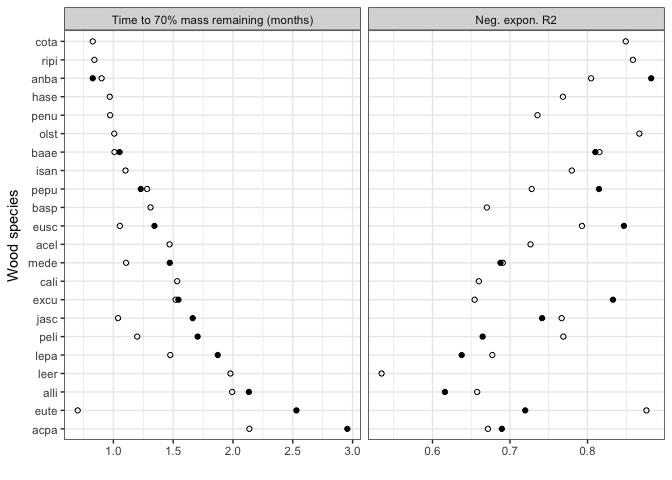
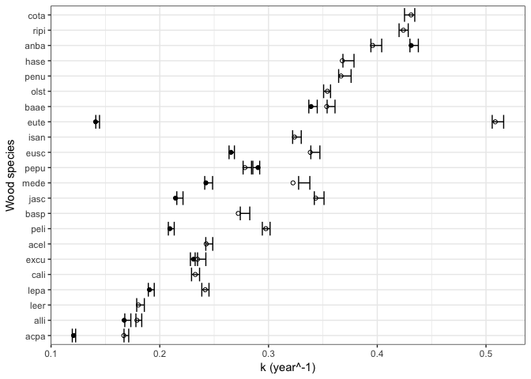

Does chemistry or community better predict mass loss?
================
10/23/2017

### Load microbial community data

### Load wood trait data



### Summarize stem-level data

``` r
# add 'codeStem' to microbial community
seqSamples$codeStem<-paste(seqSamples$code, seqSamples$Stem, sep="")
seqSamples[grepl("NA", seqSamples$codeStem),"codeStem"]<-NA

# bind everything together
pmr.byStem.df.w %>% # mass loss
  full_join(traits.codeStem) %>% #wood traits
  full_join(seqSamples) %>% #microbial data
  select(codeStem, code, seq_sampName, waterperc, density, barkthick, P, K, Ca, Mn, Fe, Zn, N, C, time7, time13, time25, time37) %>%
  filter(!is.na(codeStem))  %>%
  separate(codeStem, into=c("code1","Stem"), sep=4) %>%
  filter(Stem %in% 1:10) -> stem.data

#View(stem.data)
```

########################################## 

Wood traits as a predictor
==========================

First, look at just the small stem samples because we have the most trait information on the stem level for theses samples. Compare models using data on code level and codeStem level and with barkthickness and density as predictors to see if codeStem improves model fit...

    ## [1] 51  9

    ## [1] 79  9

    ##   response    r2.stem    r2.code
    ## 1    time7 0.09738165 0.03171432
    ## 2   time13 0.07007181 0.04307107
    ## 3   time25 0.03728149 0.03940721
    ## 4   time37 0.14794897 0.20843563

    ##   response      r2.stem    r2.code
    ## 1    time7 0.0141641846 0.03058141
    ## 2   time13 0.0005720156 0.01335815
    ## 3   time25 0.0102544419 0.01047655
    ## 4   time37 0.0976021785 0.03716909

 For models with **density + barkthickness**, it looks like stem-level data improves model fit a tiny bit for early percent mass remaining time points (after 7 and 13 months) but not later time points. For models with just **barkthickness**, fits are about the same... slightly better on the stem-level at the last time point

*Hyp (stem-level)* Stem-specific initial wood traits will predict variation in percent mass loss.
-------------------------------------------------------------------------------------------------

### time7

**less water content and C leads to more mass remaining after 7 months**

    ## 
    ## Call:
    ## lm(formula = curr.time ~ waterperc + C, data = datasets[["time7"]])
    ## 
    ## Residuals:
    ##      Min       1Q   Median       3Q      Max 
    ## -0.23820 -0.05588  0.01033  0.07087  0.19121 
    ## 
    ## Coefficients:
    ##              Estimate Std. Error t value Pr(>|t|)    
    ## (Intercept)  1.962933   0.493400   3.978  0.00022 ***
    ## waterperc   -0.003632   0.001795  -2.023  0.04831 *  
    ## C           -0.018543   0.009354  -1.982  0.05284 .  
    ## ---
    ## Signif. codes:  0 '***' 0.001 '**' 0.01 '*' 0.05 '.' 0.1 ' ' 1
    ## 
    ## Residual standard error: 0.09295 on 51 degrees of freedom
    ## Multiple R-squared:  0.1271, Adjusted R-squared:  0.0929 
    ## F-statistic: 3.714 on 2 and 51 DF,  p-value: 0.0312

### time 13

**larger size stems, less water content, more P and Mn, and less N leads to more mass remaining after 13 months**

    ## 
    ## Call:
    ## lm(formula = curr.time ~ size + waterperc + P + Mn + N, data = datasets[["time13"]])
    ## 
    ## Residuals:
    ##       Min        1Q    Median        3Q       Max 
    ## -0.277899 -0.092108  0.009127  0.079788  0.297114 
    ## 
    ## Coefficients:
    ##               Estimate Std. Error t value Pr(>|t|)    
    ## (Intercept)  1.4304321  0.1740140   8.220  1.2e-10 ***
    ## sizesmall   -0.1720630  0.0458801  -3.750 0.000484 ***
    ## waterperc   -0.0135897  0.0034603  -3.927 0.000280 ***
    ## P            0.0005436  0.0002667   2.038 0.047219 *  
    ## Mn           0.0006215  0.0002790   2.228 0.030735 *  
    ## N           -0.4242546  0.1421344  -2.985 0.004492 ** 
    ## ---
    ## Signif. codes:  0 '***' 0.001 '**' 0.01 '*' 0.05 '.' 0.1 ' ' 1
    ## 
    ## Residual standard error: 0.1415 on 47 degrees of freedom
    ## Multiple R-squared:  0.363,  Adjusted R-squared:  0.2952 
    ## F-statistic: 5.357 on 5 and 47 DF,  p-value: 0.0005615

### time 25

**larger size stems, less water content, more P leads to more mass remaining after 25 months**

    ## 
    ## Call:
    ## lm(formula = curr.time ~ size + waterperc + P, data = datasets[["time25"]])
    ## 
    ## Residuals:
    ##       Min        1Q    Median        3Q       Max 
    ## -0.258325 -0.059630 -0.005782  0.068751  0.261561 
    ## 
    ## Coefficients:
    ##               Estimate Std. Error t value Pr(>|t|)    
    ## (Intercept)  1.1953820  0.1176559  10.160 1.50e-13 ***
    ## sizesmall   -0.0721459  0.0348728  -2.069   0.0440 *  
    ## waterperc   -0.0128901  0.0023561  -5.471 1.59e-06 ***
    ## P            0.0005140  0.0002134   2.408   0.0199 *  
    ## ---
    ## Signif. codes:  0 '***' 0.001 '**' 0.01 '*' 0.05 '.' 0.1 ' ' 1
    ## 
    ## Residual standard error: 0.116 on 48 degrees of freedom
    ## Multiple R-squared:  0.4107, Adjusted R-squared:  0.3738 
    ## F-statistic: 11.15 on 3 and 48 DF,  p-value: 1.139e-05

### time 37

**larger size stems, less water content, less thick bark, more P, Mn, and C leads to more mass remaining after 37 months**

    ## 
    ## Call:
    ## lm(formula = curr.time ~ size + waterperc + barkthick_smspp + 
    ##     P + Mn + C, data = datasets[["time37"]])
    ## 
    ## Residuals:
    ##      Min       1Q   Median       3Q      Max 
    ## -0.29648 -0.06784  0.00447  0.08825  0.35934 
    ## 
    ## Coefficients:
    ##                   Estimate Std. Error t value Pr(>|t|)    
    ## (Intercept)     -0.2530728  0.7935814  -0.319   0.7513    
    ## sizesmall       -0.2107369  0.0436198  -4.831 1.68e-05 ***
    ## waterperc       -0.0251988  0.0033694  -7.479 2.29e-09 ***
    ## barkthick_smspp -0.0536175  0.0235288  -2.279   0.0276 *  
    ## P                0.0006537  0.0002506   2.609   0.0124 *  
    ## Mn               0.0006377  0.0002797   2.280   0.0275 *  
    ## C                0.0397853  0.0159293   2.498   0.0163 *  
    ## ---
    ## Signif. codes:  0 '***' 0.001 '**' 0.01 '*' 0.05 '.' 0.1 ' ' 1
    ## 
    ## Residual standard error: 0.1294 on 44 degrees of freedom
    ## Multiple R-squared:  0.6319, Adjusted R-squared:  0.5818 
    ## F-statistic: 12.59 on 6 and 44 DF,  p-value: 3.269e-08

########################################## 

Community as a predictor
========================

### First, filter community matrix to include only taxa that are present in a least 20% of all the samples. This step removes taxa that may not contribute much to our understanding of the relationship between species’ multivariate abundance and environment.

    ## [1] "Keep 150 of 6128 OTUs"

*Hyp (stem-level)* Stem-specific initial microbial communitiy compositions will predict variation in percent mass loss, particularly in the early stages of decay.
------------------------------------------------------------------------------------------------------------------------------------------------------------------

### time 7, 13, and 25

**none of the community components are significant predictors**

### time 37

**Comp01 is significant (whole community)**

    ##             RMSE        R2     Avg.Bias  Max.Bias    Skill  delta.RMSE
    ## Comp01 0.1668533 0.2925742 -0.001261747 0.3122426 25.96599 -13.9569840
    ## Comp02 0.1615472 0.3377994 -0.007472631 0.2888952 30.59988  -3.1801339
    ## Comp03 0.1682930 0.3025985 -0.012605013 0.2854822 24.68285   4.1757949
    ## Comp04 0.1708756 0.2921546 -0.014679983 0.2863511 22.35357   1.5345464
    ## Comp05 0.1725708 0.2854071 -0.014202926 0.2902932 20.80528   0.9920909
    ##            p
    ## Comp01 0.031
    ## Comp02 0.204
    ## Comp03 0.945
    ## Comp04 0.844
    ## Comp05 0.884

This is likely an underlying signiture of wood traits on the initial microbial community that is driving the relationship between the community and the mass remaining after 37 months. Check this out by plotting OTU trait-associated coefs (from boral) versus component coef estimate.

Investigate the biology underlying time37-associated coefs for Comp01

    ## [1] "Fungi"   "Protist"


########################################## 

Community+traits as a predictor
===============================

*Hyp1 (stem-level)* After accounting for variation in decay due to wood traits (no models with barkthick or density), stem-specific initial microbial communitiy compositions will predict variation in percent mass loss, particularly in the early stages of decay.
---------------------------------------------------------------------------------------------------------------------------------------------------------------------------------------------------------------------------------------------------------------------

### time 7, 13, 25, 37

**none of the community components are significant predictors**

There are two cases where there's a large % decrease in model RMSE from Component 1 to Component 2. This happens when using the whole community dataset to predict trait residuals at time13 and time37. In both cases the cross-validated RMSE is way higher than the model RMSE for all the components, suggesting that even the first community component doesn't perform well on the leave-one-out validation dataset. Also, the cross-validated R-squared values (correlation between the observed and predicted values from the "loo" validation dataset) show that the model fit decreases after Component 1. If there were a global maximum such that we saw an increase in R2 after adding more Components then maybe we could interpret Component 2, but there is no evidence of a better fitting model with more components based on the cross-validation results.

########################################## 

Diversity (and diversity of specific clades) as a predictor
===========================================================

**Note that the full community matrix was used for these analyses**

*Hyp-a (stem-level)* Greater microbial diversity (richness, Shannon diversity, ... add phylogenetic diversity) will lead to less mass remaining esp. at early time steps because of the selection effect for fast decayers and complementarity among taxa for decay.
--------------------------------------------------------------------------------------------------------------------------------------------------------------------------------------------------------------------------------------------------------------------

Hyp-Alt: Greater microbial diversity will lead to more mass remaining because taxa will be allocating more of their resources to combat one another.

### Richness, Shannon's H

**????**

*Hyp-b (stem-level)* Greater saprotroph and basidiomycete richness will lead to less mass remaining esp. at early time steps because the community does not need to wait for the arrival of key decayers to act on the wood substrate.
--------------------------------------------------------------------------------------------------------------------------------------------------------------------------------------------------------------------------------------

Hyp-Alt: Greater saprotroph and basidiomycete richness will lead to more mass remaining because decayers will be allocating more of their resources to combat one another.

### Saprotroph richness, Basidio richness

**????**

*Hyp-c (stem-level)* Greater pathogen and oomycete richness will lead to more mass remaining because the presence of these organisms will inhibit the establishment and activity of decayers.
---------------------------------------------------------------------------------------------------------------------------------------------------------------------------------------------

### Pathogen richness, oomycete richness

**????**

############################################## 

Diversity plus traits as a predictor
====================================

*Hyp (stem-level)* After accounting for variation in decay due to wood traits, initial microbial diversity (richness, Shannon diversity, ... add phylogenetic diversity) will predict variation in percent mass loss, esp. at early time points.
------------------------------------------------------------------------------------------------------------------------------------------------------------------------------------------------------------------------------------------------

### Richness, Shannon's H, Saprotroph richness, Basidio richness, Pathogen richness, Oomycete richness

**?????**

############################################## 

Relationship between wood traits and community
==============================================

*Hyp (stem-level)* Initial microbial communitiy compositions will covary with initial wood traits
-------------------------------------------------------------------------------------------------

############################################## 

Extra pieces
------------

1.  *code/testing\_time\_zero.Rmd* -- Including t=0 points to fit decay model affects the liklihood and the model selection criteria, but the curve fits are identical with this formulation. Excluding the t=0 fits has an effect of prefering simpler models, which is the same effect as increasing the penalty for model complexity.

2.  *code/initialDist\_vs\_decayDist\_btwCode.Rmd* -- No apparent relationship between species+size dissimilarities in initial microbial community composition (bray and jaccard) and decay trajectory params

3.  *code/boralOTUpairs\_vs\_decay.Rmd* -- No apparent relationship between frequency of boral-ID'd positively/negatively correlated OTU pairs and decay params

4.  *code/withinInitialDist\_vs\_decayR2.Rmd* -- No apparent relationship between initial microbial diversity WITHIN species+size and decay model R2

5.  *code/unexpectedTaxa.Rmd* -- Mycorrhizal fungi and animal-associated fungi that somehow made it into our OTU table

6.  *code/code\_level\_analyses.Rmd* -- Aggregated data to the code level, taking trait means, community means, and estimating the fit params for each code's decay trajectory in neg.exp and weibold models...

### **Code-level findings**

-   Traits explain ~ 60-70% of variation in decay over 37 months (r2, k, t70)

    1.  Greater water content and greater Zn and N leads to better-fitting decay models
    2.  Small size stems, greater water content, thinner bark, less Ca, more Zn, and more N lead to faster decay
    3.  Small stem sizes, less water content, thicker bark, more Ca, less Zn, and less N lead to longer wood “70%”-lives
-   Neither community components, overall diversity, nor clade-based diversity metrics are significant predictors of r2, k, t70

-   After accounting for variation in decay due to wood traits, neither the community components, overall diversity, nor clade-based diversity metrics are significant predictors of r2, k, t70
