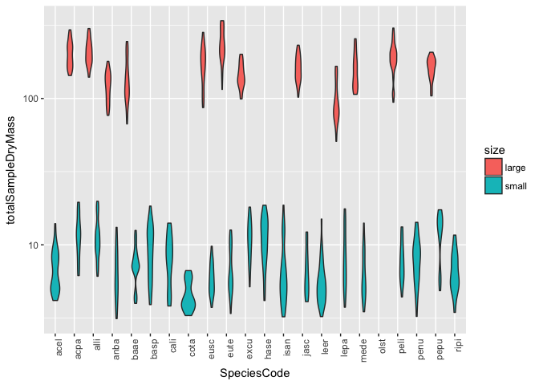
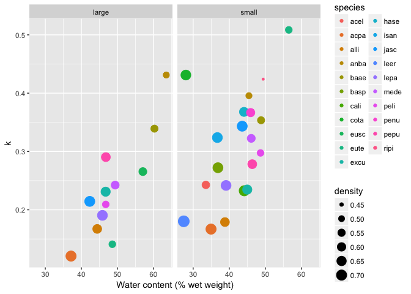

Does chemistry or community better predict mass loss?
================
Marissa Lee
10/23/2017

``` r
#chunk options
knitr::opts_chunk$set(echo = TRUE)

#libraries
devtools::install_github("cornwell-lab-unsw/litterfitter")
library(dplyr)
library(ggplot2)
library(readr)
library(vegan)
library(litterfitter)
library(magrittr)
library(tidyr)
source("code/load_fxns.R")
source("code/curve_fitting_fxns.R")
```

############ 

Load chemistry data

############ 

Load harvest data

``` r
#initial mass
initial_mass <- read_in_initial_mass()

initial_mass %>%
  mutate(SpeciesCode=tolower(Species))%>%
  ggplot(aes(y=totalSampleDryMass,x=SpeciesCode,fill=size))+
  geom_violin()+ 
  theme(axis.text.x=element_text(angle=90,hjust=1)) + 
  scale_y_log10()
```

    ## Warning: Removed 33 rows containing non-finite values (stat_ydensity).



``` r
#mass at harvests
harvest_data<-LoadHarvestFiles()
```

    ## Warning in read.samp3(): NAs introduced by coercion

``` r
harvest_data1<-CalcTotalDryMass(harvest_data)
harvest_data2<-CalcDensity(harvest_data1)
harvest_mass<-ReorgDataFrame(harvest_data2)
```

A first pass at plotting to look for outliers

``` r
#create a complete sample mass df for all time points
mass.data<-rbind(initial_mass, harvest_mass)
mass.data %>%
  ggplot(aes(x=time, y=totalSampleDryMass)) + geom_point(alpha=0.6)+theme_bw() 
```

    ## Warning: Removed 34 rows containing missing values (geom_point).


``` r
#funky outlier
max(mass.data$totalSampleDryMass, na.rm=TRUE)
```

    ## [1] 1242.641

``` r
mass.data[which.max(mass.data$totalSampleDryMass),]
```

    ## # A tibble: 1 x 9
    ##    unique Species  size  time totalSampleDryMass   density
    ##     <chr>   <chr> <chr> <dbl>              <dbl>     <dbl>
    ## 1 ALLI111    ALLI large    37           1242.641 0.7351301
    ## # ... with 3 more variables: fruiting <chr>, insects <chr>, drill <chr>

and another view. Might want to check out those two high mass value outliers from harvest 3.

``` r
mass.data %>%
  ggplot(aes(x=time, y=totalSampleDryMass,col=size)) + geom_point(position="jitter",alpha=0.6)+theme_bw()+scale_y_log10()
```

    ## Warning: Transformation introduced infinite values in continuous y-axis

    ## Warning: Removed 34 rows containing missing values (geom_point).

 Looking for outliers in the other direction, but I guess these are real 0's?

``` r
#funky outlier
min(mass.data$totalSampleDryMass, na.rm=TRUE)
```

    ## [1] 0

``` r
mass.data[which(mass.data$totalSampleDryMass==0),]
```

    ## # A tibble: 9 x 9
    ##    unique Species  size  time totalSampleDryMass density fruiting insects
    ##     <chr>   <chr> <chr> <dbl>              <dbl>   <dbl>    <chr>   <chr>
    ## 1  eute2b    eute small    37                  0     NaN             <NA>
    ## 2  acel2f    acel small    37                  0     NaN                3
    ## 3  olst1c    olst small    37                  0     NaN             <NA>
    ## 4  eusc3j    eusc small    37                  0     NaN                3
    ## 5  olst1e    olst small    37                  0     NaN             <NA>
    ## 6 ALLI311    ALLI large    37                  0     NaN             <NA>
    ## 7  hase2b    hase small    37                  0     NaN                4
    ## 8  baae1a    baae small    37                  0     NaN             <NA>
    ## 9  eute1e    eute small    37                  0     NaN                4
    ## # ... with 1 more variables: drill <chr>

``` r
#colnames(mass.data)
#unique(mass.data$unique)
```

Merge time zero with the other harvests to calculate proportion mass remaining at each time point

``` r
mass.data %>%
  filter(time==0) %>%
  rename(timeZeroDensity=density) %>%
  rename(timeZeroMass=totalSampleDryMass) %>%
  select(unique,timeZeroMass,timeZeroDensity)->time_zero

mass.data %>%
  left_join(time_zero,by="unique") %>%
  mutate(pmr=totalSampleDryMass/timeZeroMass) %>%
  filter(pmr<2) %>% #remove outlier noted above
  mutate(SpeciesCode=tolower(Species)) -> plotting_df
```

### Non-linear curve fits of decay trajectories

Using `litterfitter` to apply both negative exponenial and weibull to all species/size classes

``` r
#spdf <- fit_all_curves(plotting_df) #this recalculates all the curve fits, uncomment if the data changes
spdf <- read_csv("derived_data/mass_loss_parameters.csv")


ggplot(spdf,aes(x=t70,y=w.t70,col=size))+geom_point()+labs(x="Time to 30% mass loss (negative exponential)", y="weibull time to 30% mass loss")+geom_abline(slope=1,intercept=0,linetype="dashed")+theme_bw()
```


``` r
write_csv(spdf,"derived_data/mass_loss_parameters.csv")

spdf[which(-spdf$neg.exp.aic+spdf$w.aic < -2),]
```

Here is an example where the neg.exp and the weibull curves are almost identical

``` r
plotting_df %>%
  filter(SpeciesCode=="eute",size=="small")  ->one_example

plot_multiple_fits(time = one_example$time/12,
                   mass.remaining = one_example$pmr,
                   bty = 'n', model = c('neg.exp', 'weibull'),
                   xlab = 'Time', ylab = 'Proportion mass remaining',iters=1000)
```

    ## Number of successful fits:  998  out of 1000 
    ## Number of successful fits:  999  out of 1000

    ## Warning in multioptimFit(time, mass.remaining, model, iters = iters, upper
    ## = upper, : May not have found global best fit; increase iterations


and one where they are pretty different:

``` r
plotting_df %>%
  filter(SpeciesCode=="ripi",size=="small") -> another_example

plot_multiple_fits(time = another_example$time/12,
                   mass.remaining = another_example$pmr,
                   bty = 'n', model = c('neg.exp', 'weibull'),
                   xlab = 'Time', ylab = 'Proportion mass remaining',iters=1000)
```

    ## Number of successful fits:  991  out of 1000 
    ## Number of successful fits:  999  out of 1000

 \#\#\# Testing effects of t=0 points

replotting the last example without the t=0 points

``` r
plotting_df %>%
  filter(SpeciesCode=="ripi",size=="small",time>0) ->out

plot_multiple_fits(time = out$time/12,
                   mass.remaining = out$pmr,
                   bty = 'n', model = c('neg.exp', 'weibull'),
                   xlab = 'Time', ylab = 'Proportion mass remaining',iters=1000)
```

    ## Number of successful fits:  996  out of 1000 
    ## Number of successful fits:  1000  out of 1000


Checking that the fits are the same for weibull which they are

``` r
out%$%
fit_litter(time = time/12, 
        mass.remaining = pmr, model = c("weibull"), iters = 1000) ->plot_1
```

    ## Number of successful fits:  999  out of 1000

``` r
print(plot_1)
```

    ## $optimFit
    ## $optimFit$par
    ## [1] 2.225099 1.501404
    ## 
    ## $optimFit$value
    ## [1] 0.5348948
    ## 
    ## $optimFit$counts
    ## function gradient 
    ##       35       35 
    ## 
    ## $optimFit$convergence
    ## [1] 0
    ## 
    ## $optimFit$message
    ## [1] "CONVERGENCE: REL_REDUCTION_OF_F <= FACTR*EPSMCH"
    ## 
    ## 
    ## $logLik
    ## [1] 10.61798
    ## 
    ## $fitAIC
    ## [1] -17.23595
    ## 
    ## $fitAICc
    ## [1] -16.63595
    ## 
    ## $fitBIC
    ## [1] -14.96497
    ## 
    ## $time
    ##  [1] 0.5833333 0.5833333 0.5833333 0.5833333 0.5833333 0.5833333 1.0833333
    ##  [8] 1.0833333 1.0833333 1.0833333 1.0833333 1.0833333 2.0833333 2.0833333
    ## [15] 2.0833333 2.0833333 2.0833333 2.0833333 3.0833333 3.0833333 3.0833333
    ## [22] 3.0833333 3.0833333
    ## 
    ## $mass
    ##  [1] 0.8074037 0.7059619 0.7383556 0.9853129 0.9853245 0.9773359 0.4475656
    ##  [8] 0.4802992 0.6065266 0.8842247 0.9266620 0.8901663 0.2295541 0.2520352
    ## [15] 0.4086021 0.4715314 0.6029402 0.5922796 0.1444158 0.0307866 0.3935514
    ## [22] 0.1626236 0.1413729
    ## 
    ## $predicted
    ##  [1] 0.8746090 0.8746090 0.8746090 0.8746090 0.8746090 0.8746090 0.7122151
    ##  [8] 0.7122151 0.7122151 0.7122151 0.7122151 0.7122151 0.4041833 0.4041833
    ## [15] 0.4041833 0.4041833 0.4041833 0.4041833 0.1955488 0.1955488 0.1955488
    ## [22] 0.1955488 0.1955488
    ## 
    ## $model
    ## [1] "weibull"
    ## 
    ## $nparams
    ## [1] 2
    ## 
    ## attr(,"class")
    ## [1] "litfit"

``` r
plot(plot_1)
```


``` r
plotting_df %>%
  filter(SpeciesCode=="ripi",size=="small") ->out
out%$%
fit_litter(time = time/12, 
        mass.remaining = pmr, model = c("weibull"), iters = 1000) ->plot_2
```

    ## Number of successful fits:  1000  out of 1000

    ## Warning in multioptimFit(time, mass.remaining, model, iters = iters, upper
    ## = upper, : May not have found global best fit; increase iterations

``` r
print(plot_2)
```

    ## $optimFit
    ## $optimFit$par
    ## [1] 2.225099 1.501404
    ## 
    ## $optimFit$value
    ## [1] 0.5348948
    ## 
    ## $optimFit$counts
    ## function gradient 
    ##       23       23 
    ## 
    ## $optimFit$convergence
    ## [1] 0
    ## 
    ## $optimFit$message
    ## [1] "CONVERGENCE: REL_REDUCTION_OF_F <= FACTR*EPSMCH"
    ## 
    ## 
    ## $logLik
    ## [1] 55.02769
    ## 
    ## $fitAIC
    ## [1] -106.0554
    ## 
    ## $fitAICc
    ## [1] -105.8411
    ## 
    ## $fitBIC
    ## [1] -101.9003
    ## 
    ## $time
    ##  [1] 0.0000000 0.0000000 0.0000000 0.0000000 0.0000000 0.0000000 0.0000000
    ##  [8] 0.0000000 0.0000000 0.0000000 0.0000000 0.0000000 0.0000000 0.0000000
    ## [15] 0.0000000 0.0000000 0.0000000 0.0000000 0.0000000 0.0000000 0.0000000
    ## [22] 0.0000000 0.0000000 0.0000000 0.0000000 0.0000000 0.0000000 0.0000000
    ## [29] 0.0000000 0.0000000 0.0000000 0.0000000 0.0000000 0.0000000 0.0000000
    ## [36] 0.0000000 0.5833333 0.5833333 0.5833333 0.5833333 0.5833333 0.5833333
    ## [43] 1.0833333 1.0833333 1.0833333 1.0833333 1.0833333 1.0833333 2.0833333
    ## [50] 2.0833333 2.0833333 2.0833333 2.0833333 2.0833333 3.0833333 3.0833333
    ## [57] 3.0833333 3.0833333 3.0833333
    ## 
    ## $mass
    ##  [1] 1.0000000 1.0000000 1.0000000 1.0000000 1.0000000 1.0000000 1.0000000
    ##  [8] 1.0000000 1.0000000 1.0000000 1.0000000 1.0000000 1.0000000 1.0000000
    ## [15] 1.0000000 1.0000000 1.0000000 1.0000000 1.0000000 1.0000000 1.0000000
    ## [22] 1.0000000 1.0000000 1.0000000 1.0000000 1.0000000 1.0000000 1.0000000
    ## [29] 1.0000000 1.0000000 1.0000000 1.0000000 1.0000000 1.0000000 1.0000000
    ## [36] 1.0000000 0.8074037 0.7059619 0.7383556 0.9853129 0.9853245 0.9773359
    ## [43] 0.4475656 0.4802992 0.6065266 0.8842247 0.9266620 0.8901663 0.2295541
    ## [50] 0.2520352 0.4086021 0.4715314 0.6029402 0.5922796 0.1444158 0.0307866
    ## [57] 0.3935514 0.1626236 0.1413729
    ## 
    ## $predicted
    ##  [1] 1.0000000 1.0000000 1.0000000 1.0000000 1.0000000 1.0000000 1.0000000
    ##  [8] 1.0000000 1.0000000 1.0000000 1.0000000 1.0000000 1.0000000 1.0000000
    ## [15] 1.0000000 1.0000000 1.0000000 1.0000000 1.0000000 1.0000000 1.0000000
    ## [22] 1.0000000 1.0000000 1.0000000 1.0000000 1.0000000 1.0000000 1.0000000
    ## [29] 1.0000000 1.0000000 1.0000000 1.0000000 1.0000000 1.0000000 1.0000000
    ## [36] 1.0000000 0.8746090 0.8746090 0.8746090 0.8746090 0.8746090 0.8746090
    ## [43] 0.7122151 0.7122151 0.7122151 0.7122151 0.7122151 0.7122151 0.4041833
    ## [50] 0.4041833 0.4041833 0.4041833 0.4041833 0.4041833 0.1955488 0.1955488
    ## [57] 0.1955488 0.1955488 0.1955488
    ## 
    ## $model
    ## [1] "weibull"
    ## 
    ## $nparams
    ## [1] 2
    ## 
    ## attr(,"class")
    ## [1] "litfit"

``` r
plot(plot_2)
```


Conclusion: including t=0 points affects the liklihood and the model selection criteria, but the curve fits are identical with this formulation. Excluding the t=0 fits has an effect of prefering simpler models, which is the same effect as increasing the penalty for model complexity.
