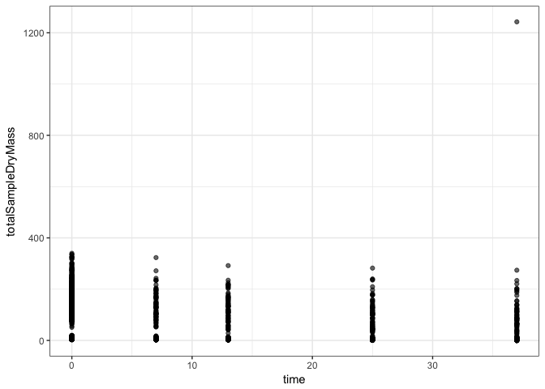

Does chemistry or community better predict mass loss?
================
Marissa Lee
10/18/2017

``` r
devtools::install_github("cornwell-lab-unsw/litterfitter")
source("code/read_initial.R")
source("code/functions.R")
library(dplyr)
library(ggplot2)
library(readr)
library(vegan)
library(litterfitter)
```

Load harvest data

``` r
knitr::opts_chunk$set(echo = TRUE)

#initial mass
initial_mass <- read_in_initial_mass()

initial_mass %>%
  mutate(SpeciesCode=tolower(Species))%>%
  ggplot(aes(y=totalSampleDryMass,x=SpeciesCode,fill=size))+
  geom_violin()+ 
  theme(axis.text.x=element_text(angle=90,hjust=1)) + 
  scale_y_log10()
```

    ## Warning: Removed 33 rows containing non-finite values (stat_ydensity).


``` r
#mass at harvests
harvest_data<-LoadHarvestFiles()
```

    ## Warning in read.samp3(): NAs introduced by coercion

``` r
harvest_data1<-CalcTotalDryMass(harvest_data)
harvest_data2<-CalcDensity(harvest_data1)
harvest_mass<-ReorgDataFrame(harvest_data2)
```

A first pass at plotting to look for outliers

``` r
#create a complete sample mass df for all time points
mass.data<-rbind(initial_mass, harvest_mass)
mass.data %>%
  ggplot(aes(x=time, y=totalSampleDryMass)) + geom_point(alpha=0.6)+theme_bw() 
```

    ## Warning: Removed 34 rows containing missing values (geom_point).



``` r
#funky outlier
max(mass.data$totalSampleDryMass, na.rm=TRUE)
```

    ## [1] 1242.641

``` r
mass.data[which.max(mass.data$totalSampleDryMass),]
```

    ## # A tibble: 1 x 9
    ##    unique Species  size  time totalSampleDryMass   density
    ##     <chr>   <chr> <chr> <dbl>              <dbl>     <dbl>
    ## 1 ALLI111    ALLI large    37           1242.641 0.7351301
    ## # ... with 3 more variables: fruiting <chr>, insects <chr>, drill <chr>

and another view. Might want to check out those two high mass value outliers from harvest 3.

``` r
mass.data %>%
  ggplot(aes(x=time, y=totalSampleDryMass,col=size)) + geom_point(position="jitter",alpha=0.6)+theme_bw()+scale_y_log10()
```

    ## Warning: Transformation introduced infinite values in continuous y-axis

    ## Warning: Removed 34 rows containing missing values (geom_point).

 Looking for outliers in the other direction, but I guess these are real 0's?

``` r
#funky outlier
min(mass.data$totalSampleDryMass, na.rm=TRUE)
```

    ## [1] 0

``` r
mass.data[which(mass.data$totalSampleDryMass==0),]
```

    ## # A tibble: 9 x 9
    ##    unique Species  size  time totalSampleDryMass density fruiting insects
    ##     <chr>   <chr> <chr> <dbl>              <dbl>   <dbl>    <chr>   <chr>
    ## 1  eute2b    eute small    37                  0     NaN             <NA>
    ## 2  acel2f    acel small    37                  0     NaN                3
    ## 3  olst1c    olst small    37                  0     NaN             <NA>
    ## 4  eusc3j    eusc small    37                  0     NaN                3
    ## 5  olst1e    olst small    37                  0     NaN             <NA>
    ## 6 ALLI311    ALLI large    37                  0     NaN             <NA>
    ## 7  hase2b    hase small    37                  0     NaN                4
    ## 8  baae1a    baae small    37                  0     NaN             <NA>
    ## 9  eute1e    eute small    37                  0     NaN                4
    ## # ... with 1 more variables: drill <chr>

``` r
#colnames(mass.data)
#unique(mass.data$unique)
```

Merge time zero with the other harvests to calculate proportion mass remaining at each time point

``` r
mass.data %>%
  filter(time==0) %>%
  rename(timeZeroDensity=density) %>%
  rename(timeZeroMass=totalSampleDryMass) %>%
  select(unique,timeZeroMass,timeZeroDensity)->time_zero

mass.data %>%
  left_join(time_zero,by="unique") %>%
  mutate(pmr=totalSampleDryMass/timeZeroMass) %>%
  filter(pmr<2) %>% #remove outlier noted above
  mutate(SpeciesCode=tolower(Species)) -> plotting_df

plotting_df%>%
  ggplot(aes(x=time, y=pmr,col=SpeciesCode,shape=size)) + 
  geom_point()+geom_smooth(method="lm",se=FALSE) ->gg1
gg1
```


Interactive plotting for fun

``` r
#library(plotly)
#ggplotly(gg1)
```

An example using litterFitter to remember how it works.

``` r
plotting_df %>%
  filter(SpeciesCode=="eute",size=="small") ->out

plot_multiple_fits(time = out$time/12,
                   mass.remaining = out$pmr,
                   bty = 'n', model = c('neg.exp', 'weibull'),
                   xlab = 'Time', ylab = 'Proportion mass remaining',iters=1000)
```

    ## Number of successful fits:  998  out of 1000 
    ## Number of successful fits:  1000  out of 1000


