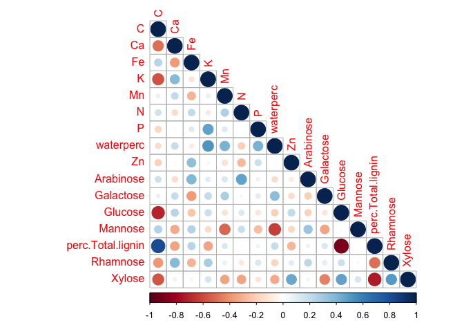
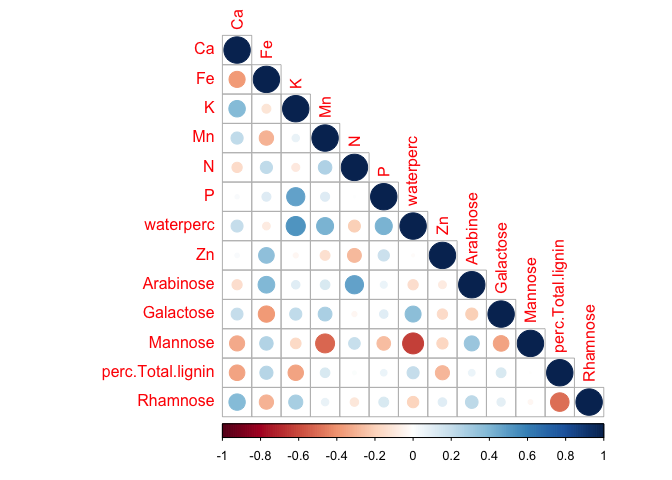
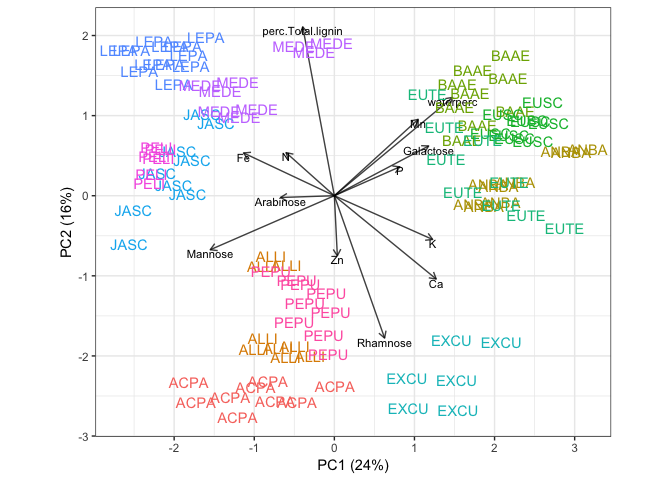
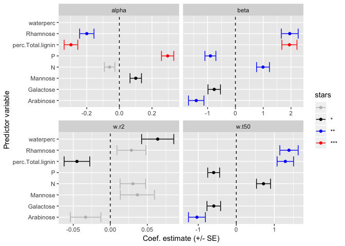
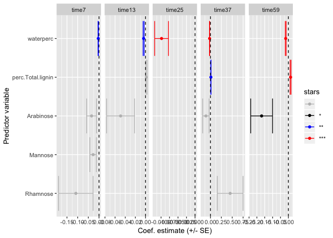
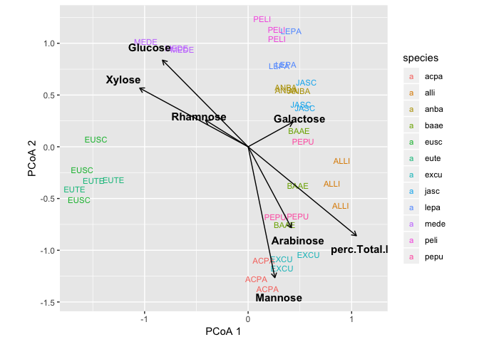

Community v chemistry – Recent analyses
================
10/23/2017

    ## calc_distances.R :
    ## calc_diversity.R :
    ## helper_fxns.R :
    ## load_decayData.R :
    ## load_microbeData.R :
    ## load_traitData.R :
    ## make_figs_decayPatterns.R :
    ## make_figs_endoComp_explainDecay.R :
    ## make_figs_endoDiv_explainDecay.R :
    ## make_figs_woodTraits_explainDecay.R :
    ## make_summaryTables.R :
    ## roleOf_traits_on_fungi.R :
    ## shape_analysis_dataframes.R :

## Repo outline

### Main analyses

1.  How do wood species and sizes vary in decay?

<!-- end list -->

  - script: *decayPatterns.Rmd*
  - summary: output/decayfits.pdf

<!-- end list -->

    ## quartz_off_screen 
    ##                 2

    ## quartz_off_screen 
    ##                 2

2.  Do wood traits explain decay?

<!-- end list -->

  - script: *woodtraits\_explainDecay.Rmd*
  - summary:
      - Fast decayers (alpha) have low density
      - Samples with S-shaped trajectories (beta) have low N and high
        density
      - Difficult to predict decayers (low r2) have low N, high density,
        and belong to the small size class
      - Low water content predicts more mass remaining across all time
        points
      - Low N and small size class predict more mass remaining at
        early-mid time points
      - High C predicts more mass remaining at late time points

<!-- end list -->

    ## quartz_off_screen 
    ##                 2

3.  Does endophyte composition explain decay?

<!-- end list -->

  - script: *endoComp\_explainDecay.Rmd*
  - summary: No. There is a relationship between composition and percent
    mass remaining after 37 months, but this is likely driven by the
    role of water content on the microbial community and decay.

<!-- end list -->

    ## [1] "WARNING 62"
    ## [1] "Saprotroph"  "Symbiotroph" "Pathotroph" 
    ## [1] "WARNING 78"
    ## [1] "Pathotroph-Symbiotroph"            "Pathotroph-Saprotroph-Symbiotroph"
    ## [1] "WARNING 102"
    ## [1] "Pathotroph"                        "Pathotroph-Saprotroph-Symbiotroph"
    ## [1] "WARNING 173"
    ## [1] "Saprotroph"                        "Pathotroph-Saprotroph-Symbiotroph"
    ## [1] "WARNING 178"
    ## [1] "Pathotroph-Saprotroph-Symbiotroph" "Symbiotroph"                      
    ## [1] "WARNING 250"
    ## [1] "Pathotroph-Symbiotroph"            "Pathotroph-Saprotroph-Symbiotroph"

    ## [1] "Keep 132 of 3021 OTUs"
    ## Cross-validating:
    ## 
      |                                                                       
      |                                                                 |   0%
      |                                                                       
      |=                                                                |   2%
      |                                                                       
      |==                                                               |   3%
      |                                                                       
      |===                                                              |   5%
      |                                                                       
      |====                                                             |   6%
      |                                                                       
      |=====                                                            |   8%
      |                                                                       
      |======                                                           |   9%
      |                                                                       
      |=======                                                          |  11%
      |                                                                       
      |========                                                         |  12%
      |                                                                       
      |=========                                                        |  14%
      |                                                                       
      |==========                                                       |  15%
      |                                                                       
      |===========                                                      |  17%
      |                                                                       
      |============                                                     |  18%
      |                                                                       
      |=============                                                    |  20%
      |                                                                       
      |==============                                                   |  22%
      |                                                                       
      |===============                                                  |  23%
      |                                                                       
      |================                                                 |  25%
      |                                                                       
      |=================                                                |  26%
      |                                                                       
      |==================                                               |  28%
      |                                                                       
      |===================                                              |  29%
      |                                                                       
      |====================                                             |  31%
      |                                                                       
      |=====================                                            |  32%
      |                                                                       
      |======================                                           |  34%
      |                                                                       
      |=======================                                          |  35%
      |                                                                       
      |========================                                         |  37%
      |                                                                       
      |=========================                                        |  38%
      |                                                                       
      |==========================                                       |  40%
      |                                                                       
      |===========================                                      |  42%
      |                                                                       
      |============================                                     |  43%
      |                                                                       
      |=============================                                    |  45%
      |                                                                       
      |==============================                                   |  46%
      |                                                                       
      |===============================                                  |  48%
      |                                                                       
      |================================                                 |  49%
      |                                                                       
      |=================================                                |  51%
      |                                                                       
      |==================================                               |  52%
      |                                                                       
      |===================================                              |  54%
      |                                                                       
      |====================================                             |  55%
      |                                                                       
      |=====================================                            |  57%
      |                                                                       
      |======================================                           |  58%
      |                                                                       
      |=======================================                          |  60%
      |                                                                       
      |========================================                         |  62%
      |                                                                       
      |=========================================                        |  63%
      |                                                                       
      |==========================================                       |  65%
      |                                                                       
      |===========================================                      |  66%
      |                                                                       
      |============================================                     |  68%
      |                                                                       
      |=============================================                    |  69%
      |                                                                       
      |==============================================                   |  71%
      |                                                                       
      |===============================================                  |  72%
      |                                                                       
      |================================================                 |  74%
      |                                                                       
      |=================================================                |  75%
      |                                                                       
      |==================================================               |  77%
      |                                                                       
      |===================================================              |  78%
      |                                                                       
      |====================================================             |  80%
      |                                                                       
      |=====================================================            |  82%
      |                                                                       
      |======================================================           |  83%
      |                                                                       
      |=======================================================          |  85%
      |                                                                       
      |========================================================         |  86%
      |                                                                       
      |=========================================================        |  88%
      |                                                                       
      |==========================================================       |  89%
      |                                                                       
      |===========================================================      |  91%
      |                                                                       
      |============================================================     |  92%
      |                                                                       
      |=============================================================    |  94%
      |                                                                       
      |==============================================================   |  95%
      |                                                                       
      |===============================================================  |  97%
      |                                                                       
      |================================================================ |  98%
      |                                                                       
      |=================================================================| 100%
    ## Cross-validating:
    ## 
      |                                                                       
      |                                                                 |   0%
      |                                                                       
      |=                                                                |   2%
      |                                                                       
      |==                                                               |   3%
      |                                                                       
      |===                                                              |   5%
      |                                                                       
      |====                                                             |   6%
      |                                                                       
      |=====                                                            |   8%
      |                                                                       
      |======                                                           |  10%
      |                                                                       
      |=======                                                          |  11%
      |                                                                       
      |========                                                         |  13%
      |                                                                       
      |=========                                                        |  14%
      |                                                                       
      |==========                                                       |  16%
      |                                                                       
      |===========                                                      |  17%
      |                                                                       
      |============                                                     |  19%
      |                                                                       
      |=============                                                    |  21%
      |                                                                       
      |==============                                                   |  22%
      |                                                                       
      |===============                                                  |  24%
      |                                                                       
      |=================                                                |  25%
      |                                                                       
      |==================                                               |  27%
      |                                                                       
      |===================                                              |  29%
      |                                                                       
      |====================                                             |  30%
      |                                                                       
      |=====================                                            |  32%
      |                                                                       
      |======================                                           |  33%
      |                                                                       
      |=======================                                          |  35%
      |                                                                       
      |========================                                         |  37%
      |                                                                       
      |=========================                                        |  38%
      |                                                                       
      |==========================                                       |  40%
      |                                                                       
      |===========================                                      |  41%
      |                                                                       
      |============================                                     |  43%
      |                                                                       
      |=============================                                    |  44%
      |                                                                       
      |==============================                                   |  46%
      |                                                                       
      |===============================                                  |  48%
      |                                                                       
      |================================                                 |  49%
      |                                                                       
      |=================================                                |  51%
      |                                                                       
      |==================================                               |  52%
      |                                                                       
      |===================================                              |  54%
      |                                                                       
      |====================================                             |  56%
      |                                                                       
      |=====================================                            |  57%
      |                                                                       
      |======================================                           |  59%
      |                                                                       
      |=======================================                          |  60%
      |                                                                       
      |========================================                         |  62%
      |                                                                       
      |=========================================                        |  63%
      |                                                                       
      |==========================================                       |  65%
      |                                                                       
      |===========================================                      |  67%
      |                                                                       
      |============================================                     |  68%
      |                                                                       
      |=============================================                    |  70%
      |                                                                       
      |==============================================                   |  71%
      |                                                                       
      |===============================================                  |  73%
      |                                                                       
      |================================================                 |  75%
      |                                                                       
      |==================================================               |  76%
      |                                                                       
      |===================================================              |  78%
      |                                                                       
      |====================================================             |  79%
      |                                                                       
      |=====================================================            |  81%
      |                                                                       
      |======================================================           |  83%
      |                                                                       
      |=======================================================          |  84%
      |                                                                       
      |========================================================         |  86%
      |                                                                       
      |=========================================================        |  87%
      |                                                                       
      |==========================================================       |  89%
      |                                                                       
      |===========================================================      |  90%
      |                                                                       
      |============================================================     |  92%
      |                                                                       
      |=============================================================    |  94%
      |                                                                       
      |==============================================================   |  95%
      |                                                                       
      |===============================================================  |  97%
      |                                                                       
      |================================================================ |  98%
      |                                                                       
      |=================================================================| 100%
    ## Cross-validating:
    ## 
      |                                                                       
      |                                                                 |   0%
      |                                                                       
      |=                                                                |   2%
      |                                                                       
      |==                                                               |   3%
      |                                                                       
      |===                                                              |   5%
      |                                                                       
      |====                                                             |   6%
      |                                                                       
      |=====                                                            |   8%
      |                                                                       
      |======                                                           |  10%
      |                                                                       
      |=======                                                          |  11%
      |                                                                       
      |========                                                         |  13%
      |                                                                       
      |=========                                                        |  14%
      |                                                                       
      |==========                                                       |  16%
      |                                                                       
      |===========                                                      |  17%
      |                                                                       
      |============                                                     |  19%
      |                                                                       
      |=============                                                    |  21%
      |                                                                       
      |==============                                                   |  22%
      |                                                                       
      |===============                                                  |  24%
      |                                                                       
      |=================                                                |  25%
      |                                                                       
      |==================                                               |  27%
      |                                                                       
      |===================                                              |  29%
      |                                                                       
      |====================                                             |  30%
      |                                                                       
      |=====================                                            |  32%
      |                                                                       
      |======================                                           |  33%
      |                                                                       
      |=======================                                          |  35%
      |                                                                       
      |========================                                         |  37%
      |                                                                       
      |=========================                                        |  38%
      |                                                                       
      |==========================                                       |  40%
      |                                                                       
      |===========================                                      |  41%
      |                                                                       
      |============================                                     |  43%
      |                                                                       
      |=============================                                    |  44%
      |                                                                       
      |==============================                                   |  46%
      |                                                                       
      |===============================                                  |  48%
      |                                                                       
      |================================                                 |  49%
      |                                                                       
      |=================================                                |  51%
      |                                                                       
      |==================================                               |  52%
      |                                                                       
      |===================================                              |  54%
      |                                                                       
      |====================================                             |  56%
      |                                                                       
      |=====================================                            |  57%
      |                                                                       
      |======================================                           |  59%
      |                                                                       
      |=======================================                          |  60%
      |                                                                       
      |========================================                         |  62%
      |                                                                       
      |=========================================                        |  63%
      |                                                                       
      |==========================================                       |  65%
      |                                                                       
      |===========================================                      |  67%
      |                                                                       
      |============================================                     |  68%
      |                                                                       
      |=============================================                    |  70%
      |                                                                       
      |==============================================                   |  71%
      |                                                                       
      |===============================================                  |  73%
      |                                                                       
      |================================================                 |  75%
      |                                                                       
      |==================================================               |  76%
      |                                                                       
      |===================================================              |  78%
      |                                                                       
      |====================================================             |  79%
      |                                                                       
      |=====================================================            |  81%
      |                                                                       
      |======================================================           |  83%
      |                                                                       
      |=======================================================          |  84%
      |                                                                       
      |========================================================         |  86%
      |                                                                       
      |=========================================================        |  87%
      |                                                                       
      |==========================================================       |  89%
      |                                                                       
      |===========================================================      |  90%
      |                                                                       
      |============================================================     |  92%
      |                                                                       
      |=============================================================    |  94%
      |                                                                       
      |==============================================================   |  95%
      |                                                                       
      |===============================================================  |  97%
      |                                                                       
      |================================================================ |  98%
      |                                                                       
      |=================================================================| 100%
    ## Cross-validating:
    ## 
      |                                                                       
      |                                                                 |   0%
      |                                                                       
      |=                                                                |   2%
      |                                                                       
      |==                                                               |   3%
      |                                                                       
      |===                                                              |   5%
      |                                                                       
      |====                                                             |   7%
      |                                                                       
      |=====                                                            |   8%
      |                                                                       
      |======                                                           |  10%
      |                                                                       
      |=======                                                          |  11%
      |                                                                       
      |=========                                                        |  13%
      |                                                                       
      |==========                                                       |  15%
      |                                                                       
      |===========                                                      |  16%
      |                                                                       
      |============                                                     |  18%
      |                                                                       
      |=============                                                    |  20%
      |                                                                       
      |==============                                                   |  21%
      |                                                                       
      |===============                                                  |  23%
      |                                                                       
      |================                                                 |  25%
      |                                                                       
      |=================                                                |  26%
      |                                                                       
      |==================                                               |  28%
      |                                                                       
      |===================                                              |  30%
      |                                                                       
      |====================                                             |  31%
      |                                                                       
      |=====================                                            |  33%
      |                                                                       
      |======================                                           |  34%
      |                                                                       
      |=======================                                          |  36%
      |                                                                       
      |=========================                                        |  38%
      |                                                                       
      |==========================                                       |  39%
      |                                                                       
      |===========================                                      |  41%
      |                                                                       
      |============================                                     |  43%
      |                                                                       
      |=============================                                    |  44%
      |                                                                       
      |==============================                                   |  46%
      |                                                                       
      |===============================                                  |  48%
      |                                                                       
      |================================                                 |  49%
      |                                                                       
      |=================================                                |  51%
      |                                                                       
      |==================================                               |  52%
      |                                                                       
      |===================================                              |  54%
      |                                                                       
      |====================================                             |  56%
      |                                                                       
      |=====================================                            |  57%
      |                                                                       
      |======================================                           |  59%
      |                                                                       
      |=======================================                          |  61%
      |                                                                       
      |========================================                         |  62%
      |                                                                       
      |==========================================                       |  64%
      |                                                                       
      |===========================================                      |  66%
      |                                                                       
      |============================================                     |  67%
      |                                                                       
      |=============================================                    |  69%
      |                                                                       
      |==============================================                   |  70%
      |                                                                       
      |===============================================                  |  72%
      |                                                                       
      |================================================                 |  74%
      |                                                                       
      |=================================================                |  75%
      |                                                                       
      |==================================================               |  77%
      |                                                                       
      |===================================================              |  79%
      |                                                                       
      |====================================================             |  80%
      |                                                                       
      |=====================================================            |  82%
      |                                                                       
      |======================================================           |  84%
      |                                                                       
      |=======================================================          |  85%
      |                                                                       
      |========================================================         |  87%
      |                                                                       
      |==========================================================       |  89%
      |                                                                       
      |===========================================================      |  90%
      |                                                                       
      |============================================================     |  92%
      |                                                                       
      |=============================================================    |  93%
      |                                                                       
      |==============================================================   |  95%
      |                                                                       
      |===============================================================  |  97%
      |                                                                       
      |================================================================ |  98%
      |                                                                       
      |=================================================================| 100%
    ## Cross-validating:
    ## 
      |                                                                       
      |                                                                 |   0%
      |                                                                       
      |=                                                                |   2%
      |                                                                       
      |==                                                               |   3%
      |                                                                       
      |===                                                              |   5%
      |                                                                       
      |====                                                             |   6%
      |                                                                       
      |=====                                                            |   8%
      |                                                                       
      |======                                                           |   9%
      |                                                                       
      |=======                                                          |  11%
      |                                                                       
      |========                                                         |  12%
      |                                                                       
      |=========                                                        |  14%
      |                                                                       
      |==========                                                       |  15%
      |                                                                       
      |===========                                                      |  17%
      |                                                                       
      |============                                                     |  18%
      |                                                                       
      |=============                                                    |  20%
      |                                                                       
      |==============                                                   |  22%
      |                                                                       
      |===============                                                  |  23%
      |                                                                       
      |================                                                 |  25%
      |                                                                       
      |=================                                                |  26%
      |                                                                       
      |==================                                               |  28%
      |                                                                       
      |===================                                              |  29%
      |                                                                       
      |====================                                             |  31%
      |                                                                       
      |=====================                                            |  32%
      |                                                                       
      |======================                                           |  34%
      |                                                                       
      |=======================                                          |  35%
      |                                                                       
      |========================                                         |  37%
      |                                                                       
      |=========================                                        |  38%
      |                                                                       
      |==========================                                       |  40%
      |                                                                       
      |===========================                                      |  42%
      |                                                                       
      |============================                                     |  43%
      |                                                                       
      |=============================                                    |  45%
      |                                                                       
      |==============================                                   |  46%
      |                                                                       
      |===============================                                  |  48%
      |                                                                       
      |================================                                 |  49%
      |                                                                       
      |=================================                                |  51%
      |                                                                       
      |==================================                               |  52%
      |                                                                       
      |===================================                              |  54%
      |                                                                       
      |====================================                             |  55%
      |                                                                       
      |=====================================                            |  57%
      |                                                                       
      |======================================                           |  58%
      |                                                                       
      |=======================================                          |  60%
      |                                                                       
      |========================================                         |  62%
      |                                                                       
      |=========================================                        |  63%
      |                                                                       
      |==========================================                       |  65%
      |                                                                       
      |===========================================                      |  66%
      |                                                                       
      |============================================                     |  68%
      |                                                                       
      |=============================================                    |  69%
      |                                                                       
      |==============================================                   |  71%
      |                                                                       
      |===============================================                  |  72%
      |                                                                       
      |================================================                 |  74%
      |                                                                       
      |=================================================                |  75%
      |                                                                       
      |==================================================               |  77%
      |                                                                       
      |===================================================              |  78%
      |                                                                       
      |====================================================             |  80%
      |                                                                       
      |=====================================================            |  82%
      |                                                                       
      |======================================================           |  83%
      |                                                                       
      |=======================================================          |  85%
      |                                                                       
      |========================================================         |  86%
      |                                                                       
      |=========================================================        |  88%
      |                                                                       
      |==========================================================       |  89%
      |                                                                       
      |===========================================================      |  91%
      |                                                                       
      |============================================================     |  92%
      |                                                                       
      |=============================================================    |  94%
      |                                                                       
      |==============================================================   |  95%
      |                                                                       
      |===============================================================  |  97%
      |                                                                       
      |================================================================ |  98%
      |                                                                       
      |=================================================================| 100%
    ## Cross-validating:
    ## 
      |                                                                       
      |                                                                 |   0%
      |                                                                       
      |=                                                                |   2%
      |                                                                       
      |==                                                               |   3%
      |                                                                       
      |===                                                              |   5%
      |                                                                       
      |====                                                             |   6%
      |                                                                       
      |=====                                                            |   8%
      |                                                                       
      |======                                                           |   9%
      |                                                                       
      |=======                                                          |  11%
      |                                                                       
      |========                                                         |  12%
      |                                                                       
      |=========                                                        |  14%
      |                                                                       
      |==========                                                       |  15%
      |                                                                       
      |===========                                                      |  17%
      |                                                                       
      |============                                                     |  18%
      |                                                                       
      |=============                                                    |  20%
      |                                                                       
      |==============                                                   |  22%
      |                                                                       
      |===============                                                  |  23%
      |                                                                       
      |================                                                 |  25%
      |                                                                       
      |=================                                                |  26%
      |                                                                       
      |==================                                               |  28%
      |                                                                       
      |===================                                              |  29%
      |                                                                       
      |====================                                             |  31%
      |                                                                       
      |=====================                                            |  32%
      |                                                                       
      |======================                                           |  34%
      |                                                                       
      |=======================                                          |  35%
      |                                                                       
      |========================                                         |  37%
      |                                                                       
      |=========================                                        |  38%
      |                                                                       
      |==========================                                       |  40%
      |                                                                       
      |===========================                                      |  42%
      |                                                                       
      |============================                                     |  43%
      |                                                                       
      |=============================                                    |  45%
      |                                                                       
      |==============================                                   |  46%
      |                                                                       
      |===============================                                  |  48%
      |                                                                       
      |================================                                 |  49%
      |                                                                       
      |=================================                                |  51%
      |                                                                       
      |==================================                               |  52%
      |                                                                       
      |===================================                              |  54%
      |                                                                       
      |====================================                             |  55%
      |                                                                       
      |=====================================                            |  57%
      |                                                                       
      |======================================                           |  58%
      |                                                                       
      |=======================================                          |  60%
      |                                                                       
      |========================================                         |  62%
      |                                                                       
      |=========================================                        |  63%
      |                                                                       
      |==========================================                       |  65%
      |                                                                       
      |===========================================                      |  66%
      |                                                                       
      |============================================                     |  68%
      |                                                                       
      |=============================================                    |  69%
      |                                                                       
      |==============================================                   |  71%
      |                                                                       
      |===============================================                  |  72%
      |                                                                       
      |================================================                 |  74%
      |                                                                       
      |=================================================                |  75%
      |                                                                       
      |==================================================               |  77%
      |                                                                       
      |===================================================              |  78%
      |                                                                       
      |====================================================             |  80%
      |                                                                       
      |=====================================================            |  82%
      |                                                                       
      |======================================================           |  83%
      |                                                                       
      |=======================================================          |  85%
      |                                                                       
      |========================================================         |  86%
      |                                                                       
      |=========================================================        |  88%
      |                                                                       
      |==========================================================       |  89%
      |                                                                       
      |===========================================================      |  91%
      |                                                                       
      |============================================================     |  92%
      |                                                                       
      |=============================================================    |  94%
      |                                                                       
      |==============================================================   |  95%
      |                                                                       
      |===============================================================  |  97%
      |                                                                       
      |================================================================ |  98%
      |                                                                       
      |=================================================================| 100%
    ## Cross-validating:
    ## 
      |                                                                       
      |                                                                 |   0%
      |                                                                       
      |=                                                                |   2%
      |                                                                       
      |==                                                               |   3%
      |                                                                       
      |===                                                              |   5%
      |                                                                       
      |====                                                             |   6%
      |                                                                       
      |=====                                                            |   8%
      |                                                                       
      |======                                                           |  10%
      |                                                                       
      |=======                                                          |  11%
      |                                                                       
      |========                                                         |  13%
      |                                                                       
      |=========                                                        |  14%
      |                                                                       
      |==========                                                       |  16%
      |                                                                       
      |===========                                                      |  17%
      |                                                                       
      |============                                                     |  19%
      |                                                                       
      |=============                                                    |  21%
      |                                                                       
      |==============                                                   |  22%
      |                                                                       
      |===============                                                  |  24%
      |                                                                       
      |=================                                                |  25%
      |                                                                       
      |==================                                               |  27%
      |                                                                       
      |===================                                              |  29%
      |                                                                       
      |====================                                             |  30%
      |                                                                       
      |=====================                                            |  32%
      |                                                                       
      |======================                                           |  33%
      |                                                                       
      |=======================                                          |  35%
      |                                                                       
      |========================                                         |  37%
      |                                                                       
      |=========================                                        |  38%
      |                                                                       
      |==========================                                       |  40%
      |                                                                       
      |===========================                                      |  41%
      |                                                                       
      |============================                                     |  43%
      |                                                                       
      |=============================                                    |  44%
      |                                                                       
      |==============================                                   |  46%
      |                                                                       
      |===============================                                  |  48%
      |                                                                       
      |================================                                 |  49%
      |                                                                       
      |=================================                                |  51%
      |                                                                       
      |==================================                               |  52%
      |                                                                       
      |===================================                              |  54%
      |                                                                       
      |====================================                             |  56%
      |                                                                       
      |=====================================                            |  57%
      |                                                                       
      |======================================                           |  59%
      |                                                                       
      |=======================================                          |  60%
      |                                                                       
      |========================================                         |  62%
      |                                                                       
      |=========================================                        |  63%
      |                                                                       
      |==========================================                       |  65%
      |                                                                       
      |===========================================                      |  67%
      |                                                                       
      |============================================                     |  68%
      |                                                                       
      |=============================================                    |  70%
      |                                                                       
      |==============================================                   |  71%
      |                                                                       
      |===============================================                  |  73%
      |                                                                       
      |================================================                 |  75%
      |                                                                       
      |==================================================               |  76%
      |                                                                       
      |===================================================              |  78%
      |                                                                       
      |====================================================             |  79%
      |                                                                       
      |=====================================================            |  81%
      |                                                                       
      |======================================================           |  83%
      |                                                                       
      |=======================================================          |  84%
      |                                                                       
      |========================================================         |  86%
      |                                                                       
      |=========================================================        |  87%
      |                                                                       
      |==========================================================       |  89%
      |                                                                       
      |===========================================================      |  90%
      |                                                                       
      |============================================================     |  92%
      |                                                                       
      |=============================================================    |  94%
      |                                                                       
      |==============================================================   |  95%
      |                                                                       
      |===============================================================  |  97%
      |                                                                       
      |================================================================ |  98%
      |                                                                       
      |=================================================================| 100%
    ## Cross-validating:
    ## 
      |                                                                       
      |                                                                 |   0%
      |                                                                       
      |=                                                                |   2%
      |                                                                       
      |==                                                               |   3%
      |                                                                       
      |===                                                              |   5%
      |                                                                       
      |====                                                             |   6%
      |                                                                       
      |=====                                                            |   8%
      |                                                                       
      |======                                                           |  10%
      |                                                                       
      |=======                                                          |  11%
      |                                                                       
      |========                                                         |  13%
      |                                                                       
      |=========                                                        |  14%
      |                                                                       
      |==========                                                       |  16%
      |                                                                       
      |===========                                                      |  17%
      |                                                                       
      |============                                                     |  19%
      |                                                                       
      |=============                                                    |  21%
      |                                                                       
      |==============                                                   |  22%
      |                                                                       
      |===============                                                  |  24%
      |                                                                       
      |=================                                                |  25%
      |                                                                       
      |==================                                               |  27%
      |                                                                       
      |===================                                              |  29%
      |                                                                       
      |====================                                             |  30%
      |                                                                       
      |=====================                                            |  32%
      |                                                                       
      |======================                                           |  33%
      |                                                                       
      |=======================                                          |  35%
      |                                                                       
      |========================                                         |  37%
      |                                                                       
      |=========================                                        |  38%
      |                                                                       
      |==========================                                       |  40%
      |                                                                       
      |===========================                                      |  41%
      |                                                                       
      |============================                                     |  43%
      |                                                                       
      |=============================                                    |  44%
      |                                                                       
      |==============================                                   |  46%
      |                                                                       
      |===============================                                  |  48%
      |                                                                       
      |================================                                 |  49%
      |                                                                       
      |=================================                                |  51%
      |                                                                       
      |==================================                               |  52%
      |                                                                       
      |===================================                              |  54%
      |                                                                       
      |====================================                             |  56%
      |                                                                       
      |=====================================                            |  57%
      |                                                                       
      |======================================                           |  59%
      |                                                                       
      |=======================================                          |  60%
      |                                                                       
      |========================================                         |  62%
      |                                                                       
      |=========================================                        |  63%
      |                                                                       
      |==========================================                       |  65%
      |                                                                       
      |===========================================                      |  67%
      |                                                                       
      |============================================                     |  68%
      |                                                                       
      |=============================================                    |  70%
      |                                                                       
      |==============================================                   |  71%
      |                                                                       
      |===============================================                  |  73%
      |                                                                       
      |================================================                 |  75%
      |                                                                       
      |==================================================               |  76%
      |                                                                       
      |===================================================              |  78%
      |                                                                       
      |====================================================             |  79%
      |                                                                       
      |=====================================================            |  81%
      |                                                                       
      |======================================================           |  83%
      |                                                                       
      |=======================================================          |  84%
      |                                                                       
      |========================================================         |  86%
      |                                                                       
      |=========================================================        |  87%
      |                                                                       
      |==========================================================       |  89%
      |                                                                       
      |===========================================================      |  90%
      |                                                                       
      |============================================================     |  92%
      |                                                                       
      |=============================================================    |  94%
      |                                                                       
      |==============================================================   |  95%
      |                                                                       
      |===============================================================  |  97%
      |                                                                       
      |================================================================ |  98%
      |                                                                       
      |=================================================================| 100%
    ## Cross-validating:
    ## 
      |                                                                       
      |                                                                 |   0%
      |                                                                       
      |=                                                                |   2%
      |                                                                       
      |==                                                               |   3%
      |                                                                       
      |===                                                              |   5%
      |                                                                       
      |====                                                             |   7%
      |                                                                       
      |=====                                                            |   8%
      |                                                                       
      |======                                                           |  10%
      |                                                                       
      |=======                                                          |  11%
      |                                                                       
      |=========                                                        |  13%
      |                                                                       
      |==========                                                       |  15%
      |                                                                       
      |===========                                                      |  16%
      |                                                                       
      |============                                                     |  18%
      |                                                                       
      |=============                                                    |  20%
      |                                                                       
      |==============                                                   |  21%
      |                                                                       
      |===============                                                  |  23%
      |                                                                       
      |================                                                 |  25%
      |                                                                       
      |=================                                                |  26%
      |                                                                       
      |==================                                               |  28%
      |                                                                       
      |===================                                              |  30%
      |                                                                       
      |====================                                             |  31%
      |                                                                       
      |=====================                                            |  33%
      |                                                                       
      |======================                                           |  34%
      |                                                                       
      |=======================                                          |  36%
      |                                                                       
      |=========================                                        |  38%
      |                                                                       
      |==========================                                       |  39%
      |                                                                       
      |===========================                                      |  41%
      |                                                                       
      |============================                                     |  43%
      |                                                                       
      |=============================                                    |  44%
      |                                                                       
      |==============================                                   |  46%
      |                                                                       
      |===============================                                  |  48%
      |                                                                       
      |================================                                 |  49%
      |                                                                       
      |=================================                                |  51%
      |                                                                       
      |==================================                               |  52%
      |                                                                       
      |===================================                              |  54%
      |                                                                       
      |====================================                             |  56%
      |                                                                       
      |=====================================                            |  57%
      |                                                                       
      |======================================                           |  59%
      |                                                                       
      |=======================================                          |  61%
      |                                                                       
      |========================================                         |  62%
      |                                                                       
      |==========================================                       |  64%
      |                                                                       
      |===========================================                      |  66%
      |                                                                       
      |============================================                     |  67%
      |                                                                       
      |=============================================                    |  69%
      |                                                                       
      |==============================================                   |  70%
      |                                                                       
      |===============================================                  |  72%
      |                                                                       
      |================================================                 |  74%
      |                                                                       
      |=================================================                |  75%
      |                                                                       
      |==================================================               |  77%
      |                                                                       
      |===================================================              |  79%
      |                                                                       
      |====================================================             |  80%
      |                                                                       
      |=====================================================            |  82%
      |                                                                       
      |======================================================           |  84%
      |                                                                       
      |=======================================================          |  85%
      |                                                                       
      |========================================================         |  87%
      |                                                                       
      |==========================================================       |  89%
      |                                                                       
      |===========================================================      |  90%
      |                                                                       
      |============================================================     |  92%
      |                                                                       
      |=============================================================    |  93%
      |                                                                       
      |==============================================================   |  95%
      |                                                                       
      |===============================================================  |  97%
      |                                                                       
      |================================================================ |  98%
      |                                                                       
      |=================================================================| 100%
    ## Cross-validating:
    ## 
      |                                                                       
      |                                                                 |   0%
      |                                                                       
      |=                                                                |   2%
      |                                                                       
      |==                                                               |   3%
      |                                                                       
      |===                                                              |   5%
      |                                                                       
      |====                                                             |   6%
      |                                                                       
      |=====                                                            |   8%
      |                                                                       
      |======                                                           |   9%
      |                                                                       
      |=======                                                          |  11%
      |                                                                       
      |========                                                         |  12%
      |                                                                       
      |=========                                                        |  14%
      |                                                                       
      |==========                                                       |  15%
      |                                                                       
      |===========                                                      |  17%
      |                                                                       
      |============                                                     |  18%
      |                                                                       
      |=============                                                    |  20%
      |                                                                       
      |==============                                                   |  22%
      |                                                                       
      |===============                                                  |  23%
      |                                                                       
      |================                                                 |  25%
      |                                                                       
      |=================                                                |  26%
      |                                                                       
      |==================                                               |  28%
      |                                                                       
      |===================                                              |  29%
      |                                                                       
      |====================                                             |  31%
      |                                                                       
      |=====================                                            |  32%
      |                                                                       
      |======================                                           |  34%
      |                                                                       
      |=======================                                          |  35%
      |                                                                       
      |========================                                         |  37%
      |                                                                       
      |=========================                                        |  38%
      |                                                                       
      |==========================                                       |  40%
      |                                                                       
      |===========================                                      |  42%
      |                                                                       
      |============================                                     |  43%
      |                                                                       
      |=============================                                    |  45%
      |                                                                       
      |==============================                                   |  46%
      |                                                                       
      |===============================                                  |  48%
      |                                                                       
      |================================                                 |  49%
      |                                                                       
      |=================================                                |  51%
      |                                                                       
      |==================================                               |  52%
      |                                                                       
      |===================================                              |  54%
      |                                                                       
      |====================================                             |  55%
      |                                                                       
      |=====================================                            |  57%
      |                                                                       
      |======================================                           |  58%
      |                                                                       
      |=======================================                          |  60%
      |                                                                       
      |========================================                         |  62%
      |                                                                       
      |=========================================                        |  63%
      |                                                                       
      |==========================================                       |  65%
      |                                                                       
      |===========================================                      |  66%
      |                                                                       
      |============================================                     |  68%
      |                                                                       
      |=============================================                    |  69%
      |                                                                       
      |==============================================                   |  71%
      |                                                                       
      |===============================================                  |  72%
      |                                                                       
      |================================================                 |  74%
      |                                                                       
      |=================================================                |  75%
      |                                                                       
      |==================================================               |  77%
      |                                                                       
      |===================================================              |  78%
      |                                                                       
      |====================================================             |  80%
      |                                                                       
      |=====================================================            |  82%
      |                                                                       
      |======================================================           |  83%
      |                                                                       
      |=======================================================          |  85%
      |                                                                       
      |========================================================         |  86%
      |                                                                       
      |=========================================================        |  88%
      |                                                                       
      |==========================================================       |  89%
      |                                                                       
      |===========================================================      |  91%
      |                                                                       
      |============================================================     |  92%
      |                                                                       
      |=============================================================    |  94%
      |                                                                       
      |==============================================================   |  95%
      |                                                                       
      |===============================================================  |  97%
      |                                                                       
      |================================================================ |  98%
      |                                                                       
      |=================================================================| 100%

    ## quartz_off_screen 
    ##                 2

    ## [1] "Keep 132 of 3021 OTUs"
    ## [1] "Keep 132 of 3021 OTUs"

    ## quartz_off_screen 
    ##                 2

    ## [1] "Keep 132 of 3021 OTUs"

    ## [1] "Keep 132 of 3021 OTUs"
    ## Cross-validating:
    ## 
      |                                                                       
      |                                                                 |   0%
      |                                                                       
      |==                                                               |   3%
      |                                                                       
      |====                                                             |   6%
      |                                                                       
      |======                                                           |   9%
      |                                                                       
      |========                                                         |  12%
      |                                                                       
      |==========                                                       |  15%
      |                                                                       
      |============                                                     |  18%
      |                                                                       
      |==============                                                   |  21%
      |                                                                       
      |================                                                 |  24%
      |                                                                       
      |==================                                               |  27%
      |                                                                       
      |====================                                             |  30%
      |                                                                       
      |======================                                           |  33%
      |                                                                       
      |========================                                         |  36%
      |                                                                       
      |==========================                                       |  39%
      |                                                                       
      |============================                                     |  42%
      |                                                                       
      |==============================                                   |  45%
      |                                                                       
      |================================                                 |  48%
      |                                                                       
      |=================================                                |  52%
      |                                                                       
      |===================================                              |  55%
      |                                                                       
      |=====================================                            |  58%
      |                                                                       
      |=======================================                          |  61%
      |                                                                       
      |=========================================                        |  64%
      |                                                                       
      |===========================================                      |  67%
      |                                                                       
      |=============================================                    |  70%
      |                                                                       
      |===============================================                  |  73%
      |                                                                       
      |=================================================                |  76%
      |                                                                       
      |===================================================              |  79%
      |                                                                       
      |=====================================================            |  82%
      |                                                                       
      |=======================================================          |  85%
      |                                                                       
      |=========================================================        |  88%
      |                                                                       
      |===========================================================      |  91%
      |                                                                       
      |=============================================================    |  94%
      |                                                                       
      |===============================================================  |  97%
      |                                                                       
      |=================================================================| 100%
    ## Cross-validating:
    ## 
      |                                                                       
      |                                                                 |   0%
      |                                                                       
      |==                                                               |   3%
      |                                                                       
      |====                                                             |   6%
      |                                                                       
      |======                                                           |   9%
      |                                                                       
      |========                                                         |  12%
      |                                                                       
      |==========                                                       |  15%
      |                                                                       
      |============                                                     |  18%
      |                                                                       
      |==============                                                   |  21%
      |                                                                       
      |================                                                 |  24%
      |                                                                       
      |==================                                               |  27%
      |                                                                       
      |====================                                             |  30%
      |                                                                       
      |======================                                           |  33%
      |                                                                       
      |========================                                         |  36%
      |                                                                       
      |==========================                                       |  39%
      |                                                                       
      |============================                                     |  42%
      |                                                                       
      |==============================                                   |  45%
      |                                                                       
      |================================                                 |  48%
      |                                                                       
      |=================================                                |  52%
      |                                                                       
      |===================================                              |  55%
      |                                                                       
      |=====================================                            |  58%
      |                                                                       
      |=======================================                          |  61%
      |                                                                       
      |=========================================                        |  64%
      |                                                                       
      |===========================================                      |  67%
      |                                                                       
      |=============================================                    |  70%
      |                                                                       
      |===============================================                  |  73%
      |                                                                       
      |=================================================                |  76%
      |                                                                       
      |===================================================              |  79%
      |                                                                       
      |=====================================================            |  82%
      |                                                                       
      |=======================================================          |  85%
      |                                                                       
      |=========================================================        |  88%
      |                                                                       
      |===========================================================      |  91%
      |                                                                       
      |=============================================================    |  94%
      |                                                                       
      |===============================================================  |  97%
      |                                                                       
      |=================================================================| 100%
    ## Cross-validating:
    ## 
      |                                                                       
      |                                                                 |   0%
      |                                                                       
      |==                                                               |   3%
      |                                                                       
      |====                                                             |   6%
      |                                                                       
      |======                                                           |   9%
      |                                                                       
      |========                                                         |  12%
      |                                                                       
      |==========                                                       |  15%
      |                                                                       
      |============                                                     |  18%
      |                                                                       
      |==============                                                   |  21%
      |                                                                       
      |================                                                 |  24%
      |                                                                       
      |==================                                               |  27%
      |                                                                       
      |====================                                             |  30%
      |                                                                       
      |======================                                           |  33%
      |                                                                       
      |========================                                         |  36%
      |                                                                       
      |==========================                                       |  39%
      |                                                                       
      |============================                                     |  42%
      |                                                                       
      |==============================                                   |  45%
      |                                                                       
      |================================                                 |  48%
      |                                                                       
      |=================================                                |  52%
      |                                                                       
      |===================================                              |  55%
      |                                                                       
      |=====================================                            |  58%
      |                                                                       
      |=======================================                          |  61%
      |                                                                       
      |=========================================                        |  64%
      |                                                                       
      |===========================================                      |  67%
      |                                                                       
      |=============================================                    |  70%
      |                                                                       
      |===============================================                  |  73%
      |                                                                       
      |=================================================                |  76%
      |                                                                       
      |===================================================              |  79%
      |                                                                       
      |=====================================================            |  82%
      |                                                                       
      |=======================================================          |  85%
      |                                                                       
      |=========================================================        |  88%
      |                                                                       
      |===========================================================      |  91%
      |                                                                       
      |=============================================================    |  94%
      |                                                                       
      |===============================================================  |  97%
      |                                                                       
      |=================================================================| 100%
    ## Cross-validating:
    ## 
      |                                                                       
      |                                                                 |   0%
      |                                                                       
      |==                                                               |   3%
      |                                                                       
      |====                                                             |   6%
      |                                                                       
      |======                                                           |   9%
      |                                                                       
      |========                                                         |  12%
      |                                                                       
      |==========                                                       |  15%
      |                                                                       
      |============                                                     |  18%
      |                                                                       
      |==============                                                   |  21%
      |                                                                       
      |================                                                 |  24%
      |                                                                       
      |==================                                               |  27%
      |                                                                       
      |====================                                             |  30%
      |                                                                       
      |======================                                           |  33%
      |                                                                       
      |========================                                         |  36%
      |                                                                       
      |==========================                                       |  39%
      |                                                                       
      |============================                                     |  42%
      |                                                                       
      |==============================                                   |  45%
      |                                                                       
      |================================                                 |  48%
      |                                                                       
      |=================================                                |  52%
      |                                                                       
      |===================================                              |  55%
      |                                                                       
      |=====================================                            |  58%
      |                                                                       
      |=======================================                          |  61%
      |                                                                       
      |=========================================                        |  64%
      |                                                                       
      |===========================================                      |  67%
      |                                                                       
      |=============================================                    |  70%
      |                                                                       
      |===============================================                  |  73%
      |                                                                       
      |=================================================                |  76%
      |                                                                       
      |===================================================              |  79%
      |                                                                       
      |=====================================================            |  82%
      |                                                                       
      |=======================================================          |  85%
      |                                                                       
      |=========================================================        |  88%
      |                                                                       
      |===========================================================      |  91%
      |                                                                       
      |=============================================================    |  94%
      |                                                                       
      |===============================================================  |  97%
      |                                                                       
      |=================================================================| 100%
    ## Cross-validating:
    ## 
      |                                                                       
      |                                                                 |   0%
      |                                                                       
      |==                                                               |   3%
      |                                                                       
      |====                                                             |   6%
      |                                                                       
      |======                                                           |   9%
      |                                                                       
      |========                                                         |  12%
      |                                                                       
      |==========                                                       |  15%
      |                                                                       
      |============                                                     |  18%
      |                                                                       
      |==============                                                   |  21%
      |                                                                       
      |================                                                 |  24%
      |                                                                       
      |==================                                               |  27%
      |                                                                       
      |====================                                             |  30%
      |                                                                       
      |======================                                           |  33%
      |                                                                       
      |========================                                         |  36%
      |                                                                       
      |==========================                                       |  39%
      |                                                                       
      |============================                                     |  42%
      |                                                                       
      |==============================                                   |  45%
      |                                                                       
      |================================                                 |  48%
      |                                                                       
      |=================================                                |  52%
      |                                                                       
      |===================================                              |  55%
      |                                                                       
      |=====================================                            |  58%
      |                                                                       
      |=======================================                          |  61%
      |                                                                       
      |=========================================                        |  64%
      |                                                                       
      |===========================================                      |  67%
      |                                                                       
      |=============================================                    |  70%
      |                                                                       
      |===============================================                  |  73%
      |                                                                       
      |=================================================                |  76%
      |                                                                       
      |===================================================              |  79%
      |                                                                       
      |=====================================================            |  82%
      |                                                                       
      |=======================================================          |  85%
      |                                                                       
      |=========================================================        |  88%
      |                                                                       
      |===========================================================      |  91%
      |                                                                       
      |=============================================================    |  94%
      |                                                                       
      |===============================================================  |  97%
      |                                                                       
      |=================================================================| 100%
    ## Cross-validating:
    ## 
      |                                                                       
      |                                                                 |   0%
      |                                                                       
      |==                                                               |   3%
      |                                                                       
      |====                                                             |   6%
      |                                                                       
      |======                                                           |   9%
      |                                                                       
      |========                                                         |  12%
      |                                                                       
      |==========                                                       |  15%
      |                                                                       
      |============                                                     |  18%
      |                                                                       
      |==============                                                   |  21%
      |                                                                       
      |================                                                 |  24%
      |                                                                       
      |==================                                               |  27%
      |                                                                       
      |====================                                             |  30%
      |                                                                       
      |======================                                           |  33%
      |                                                                       
      |========================                                         |  36%
      |                                                                       
      |==========================                                       |  39%
      |                                                                       
      |============================                                     |  42%
      |                                                                       
      |==============================                                   |  45%
      |                                                                       
      |================================                                 |  48%
      |                                                                       
      |=================================                                |  52%
      |                                                                       
      |===================================                              |  55%
      |                                                                       
      |=====================================                            |  58%
      |                                                                       
      |=======================================                          |  61%
      |                                                                       
      |=========================================                        |  64%
      |                                                                       
      |===========================================                      |  67%
      |                                                                       
      |=============================================                    |  70%
      |                                                                       
      |===============================================                  |  73%
      |                                                                       
      |=================================================                |  76%
      |                                                                       
      |===================================================              |  79%
      |                                                                       
      |=====================================================            |  82%
      |                                                                       
      |=======================================================          |  85%
      |                                                                       
      |=========================================================        |  88%
      |                                                                       
      |===========================================================      |  91%
      |                                                                       
      |=============================================================    |  94%
      |                                                                       
      |===============================================================  |  97%
      |                                                                       
      |=================================================================| 100%
    ## Cross-validating:
    ## 
      |                                                                       
      |                                                                 |   0%
      |                                                                       
      |==                                                               |   3%
      |                                                                       
      |====                                                             |   6%
      |                                                                       
      |======                                                           |   9%
      |                                                                       
      |========                                                         |  12%
      |                                                                       
      |==========                                                       |  15%
      |                                                                       
      |============                                                     |  18%
      |                                                                       
      |==============                                                   |  21%
      |                                                                       
      |================                                                 |  24%
      |                                                                       
      |==================                                               |  27%
      |                                                                       
      |====================                                             |  30%
      |                                                                       
      |======================                                           |  33%
      |                                                                       
      |========================                                         |  36%
      |                                                                       
      |==========================                                       |  39%
      |                                                                       
      |============================                                     |  42%
      |                                                                       
      |==============================                                   |  45%
      |                                                                       
      |================================                                 |  48%
      |                                                                       
      |=================================                                |  52%
      |                                                                       
      |===================================                              |  55%
      |                                                                       
      |=====================================                            |  58%
      |                                                                       
      |=======================================                          |  61%
      |                                                                       
      |=========================================                        |  64%
      |                                                                       
      |===========================================                      |  67%
      |                                                                       
      |=============================================                    |  70%
      |                                                                       
      |===============================================                  |  73%
      |                                                                       
      |=================================================                |  76%
      |                                                                       
      |===================================================              |  79%
      |                                                                       
      |=====================================================            |  82%
      |                                                                       
      |=======================================================          |  85%
      |                                                                       
      |=========================================================        |  88%
      |                                                                       
      |===========================================================      |  91%
      |                                                                       
      |=============================================================    |  94%
      |                                                                       
      |===============================================================  |  97%
      |                                                                       
      |=================================================================| 100%
    ## Cross-validating:
    ## 
      |                                                                       
      |                                                                 |   0%
      |                                                                       
      |==                                                               |   3%
      |                                                                       
      |====                                                             |   6%
      |                                                                       
      |======                                                           |   9%
      |                                                                       
      |========                                                         |  12%
      |                                                                       
      |==========                                                       |  15%
      |                                                                       
      |============                                                     |  18%
      |                                                                       
      |==============                                                   |  21%
      |                                                                       
      |================                                                 |  24%
      |                                                                       
      |==================                                               |  27%
      |                                                                       
      |====================                                             |  30%
      |                                                                       
      |======================                                           |  33%
      |                                                                       
      |========================                                         |  36%
      |                                                                       
      |==========================                                       |  39%
      |                                                                       
      |============================                                     |  42%
      |                                                                       
      |==============================                                   |  45%
      |                                                                       
      |================================                                 |  48%
      |                                                                       
      |=================================                                |  52%
      |                                                                       
      |===================================                              |  55%
      |                                                                       
      |=====================================                            |  58%
      |                                                                       
      |=======================================                          |  61%
      |                                                                       
      |=========================================                        |  64%
      |                                                                       
      |===========================================                      |  67%
      |                                                                       
      |=============================================                    |  70%
      |                                                                       
      |===============================================                  |  73%
      |                                                                       
      |=================================================                |  76%
      |                                                                       
      |===================================================              |  79%
      |                                                                       
      |=====================================================            |  82%
      |                                                                       
      |=======================================================          |  85%
      |                                                                       
      |=========================================================        |  88%
      |                                                                       
      |===========================================================      |  91%
      |                                                                       
      |=============================================================    |  94%
      |                                                                       
      |===============================================================  |  97%
      |                                                                       
      |=================================================================| 100%
    ## Cross-validating:
    ## 
      |                                                                       
      |                                                                 |   0%
      |                                                                       
      |==                                                               |   3%
      |                                                                       
      |====                                                             |   6%
      |                                                                       
      |======                                                           |   9%
      |                                                                       
      |========                                                         |  12%
      |                                                                       
      |==========                                                       |  15%
      |                                                                       
      |============                                                     |  18%
      |                                                                       
      |==============                                                   |  21%
      |                                                                       
      |================                                                 |  24%
      |                                                                       
      |==================                                               |  27%
      |                                                                       
      |====================                                             |  30%
      |                                                                       
      |======================                                           |  33%
      |                                                                       
      |========================                                         |  36%
      |                                                                       
      |==========================                                       |  39%
      |                                                                       
      |============================                                     |  42%
      |                                                                       
      |==============================                                   |  45%
      |                                                                       
      |================================                                 |  48%
      |                                                                       
      |=================================                                |  52%
      |                                                                       
      |===================================                              |  55%
      |                                                                       
      |=====================================                            |  58%
      |                                                                       
      |=======================================                          |  61%
      |                                                                       
      |=========================================                        |  64%
      |                                                                       
      |===========================================                      |  67%
      |                                                                       
      |=============================================                    |  70%
      |                                                                       
      |===============================================                  |  73%
      |                                                                       
      |=================================================                |  76%
      |                                                                       
      |===================================================              |  79%
      |                                                                       
      |=====================================================            |  82%
      |                                                                       
      |=======================================================          |  85%
      |                                                                       
      |=========================================================        |  88%
      |                                                                       
      |===========================================================      |  91%
      |                                                                       
      |=============================================================    |  94%
      |                                                                       
      |===============================================================  |  97%
      |                                                                       
      |=================================================================| 100%
    ## Cross-validating:
    ## 
      |                                                                       
      |                                                                 |   0%
      |                                                                       
      |==                                                               |   3%
      |                                                                       
      |====                                                             |   6%
      |                                                                       
      |======                                                           |   9%
      |                                                                       
      |========                                                         |  12%
      |                                                                       
      |==========                                                       |  15%
      |                                                                       
      |============                                                     |  18%
      |                                                                       
      |==============                                                   |  21%
      |                                                                       
      |================                                                 |  24%
      |                                                                       
      |==================                                               |  27%
      |                                                                       
      |====================                                             |  30%
      |                                                                       
      |======================                                           |  33%
      |                                                                       
      |========================                                         |  36%
      |                                                                       
      |==========================                                       |  39%
      |                                                                       
      |============================                                     |  42%
      |                                                                       
      |==============================                                   |  45%
      |                                                                       
      |================================                                 |  48%
      |                                                                       
      |=================================                                |  52%
      |                                                                       
      |===================================                              |  55%
      |                                                                       
      |=====================================                            |  58%
      |                                                                       
      |=======================================                          |  61%
      |                                                                       
      |=========================================                        |  64%
      |                                                                       
      |===========================================                      |  67%
      |                                                                       
      |=============================================                    |  70%
      |                                                                       
      |===============================================                  |  73%
      |                                                                       
      |=================================================                |  76%
      |                                                                       
      |===================================================              |  79%
      |                                                                       
      |=====================================================            |  82%
      |                                                                       
      |=======================================================          |  85%
      |                                                                       
      |=========================================================        |  88%
      |                                                                       
      |===========================================================      |  91%
      |                                                                       
      |=============================================================    |  94%
      |                                                                       
      |===============================================================  |  97%
      |                                                                       
      |=================================================================| 100%
    ## Cross-validating:
    ## 
      |                                                                       
      |                                                                 |   0%
      |                                                                       
      |==                                                               |   3%
      |                                                                       
      |====                                                             |   6%
      |                                                                       
      |======                                                           |   9%
      |                                                                       
      |========                                                         |  12%
      |                                                                       
      |==========                                                       |  15%
      |                                                                       
      |============                                                     |  18%
      |                                                                       
      |==============                                                   |  21%
      |                                                                       
      |================                                                 |  24%
      |                                                                       
      |==================                                               |  27%
      |                                                                       
      |====================                                             |  30%
      |                                                                       
      |======================                                           |  33%
      |                                                                       
      |========================                                         |  36%
      |                                                                       
      |==========================                                       |  39%
      |                                                                       
      |============================                                     |  42%
      |                                                                       
      |==============================                                   |  45%
      |                                                                       
      |================================                                 |  48%
      |                                                                       
      |=================================                                |  52%
      |                                                                       
      |===================================                              |  55%
      |                                                                       
      |=====================================                            |  58%
      |                                                                       
      |=======================================                          |  61%
      |                                                                       
      |=========================================                        |  64%
      |                                                                       
      |===========================================                      |  67%
      |                                                                       
      |=============================================                    |  70%
      |                                                                       
      |===============================================                  |  73%
      |                                                                       
      |=================================================                |  76%
      |                                                                       
      |===================================================              |  79%
      |                                                                       
      |=====================================================            |  82%
      |                                                                       
      |=======================================================          |  85%
      |                                                                       
      |=========================================================        |  88%
      |                                                                       
      |===========================================================      |  91%
      |                                                                       
      |=============================================================    |  94%
      |                                                                       
      |===============================================================  |  97%
      |                                                                       
      |=================================================================| 100%
    ## Cross-validating:
    ## 
      |                                                                       
      |                                                                 |   0%
      |                                                                       
      |==                                                               |   3%
      |                                                                       
      |====                                                             |   6%
      |                                                                       
      |======                                                           |   9%
      |                                                                       
      |========                                                         |  12%
      |                                                                       
      |==========                                                       |  15%
      |                                                                       
      |============                                                     |  18%
      |                                                                       
      |==============                                                   |  21%
      |                                                                       
      |================                                                 |  24%
      |                                                                       
      |==================                                               |  27%
      |                                                                       
      |====================                                             |  30%
      |                                                                       
      |======================                                           |  33%
      |                                                                       
      |========================                                         |  36%
      |                                                                       
      |==========================                                       |  39%
      |                                                                       
      |============================                                     |  42%
      |                                                                       
      |==============================                                   |  45%
      |                                                                       
      |================================                                 |  48%
      |                                                                       
      |=================================                                |  52%
      |                                                                       
      |===================================                              |  55%
      |                                                                       
      |=====================================                            |  58%
      |                                                                       
      |=======================================                          |  61%
      |                                                                       
      |=========================================                        |  64%
      |                                                                       
      |===========================================                      |  67%
      |                                                                       
      |=============================================                    |  70%
      |                                                                       
      |===============================================                  |  73%
      |                                                                       
      |=================================================                |  76%
      |                                                                       
      |===================================================              |  79%
      |                                                                       
      |=====================================================            |  82%
      |                                                                       
      |=======================================================          |  85%
      |                                                                       
      |=========================================================        |  88%
      |                                                                       
      |===========================================================      |  91%
      |                                                                       
      |=============================================================    |  94%
      |                                                                       
      |===============================================================  |  97%
      |                                                                       
      |=================================================================| 100%
    ## Cross-validating:
    ## 
      |                                                                       
      |                                                                 |   0%
      |                                                                       
      |==                                                               |   3%
      |                                                                       
      |====                                                             |   6%
      |                                                                       
      |======                                                           |   9%
      |                                                                       
      |========                                                         |  12%
      |                                                                       
      |==========                                                       |  15%
      |                                                                       
      |============                                                     |  18%
      |                                                                       
      |==============                                                   |  21%
      |                                                                       
      |================                                                 |  24%
      |                                                                       
      |==================                                               |  27%
      |                                                                       
      |====================                                             |  30%
      |                                                                       
      |======================                                           |  33%
      |                                                                       
      |========================                                         |  36%
      |                                                                       
      |==========================                                       |  39%
      |                                                                       
      |============================                                     |  42%
      |                                                                       
      |==============================                                   |  45%
      |                                                                       
      |================================                                 |  48%
      |                                                                       
      |=================================                                |  52%
      |                                                                       
      |===================================                              |  55%
      |                                                                       
      |=====================================                            |  58%
      |                                                                       
      |=======================================                          |  61%
      |                                                                       
      |=========================================                        |  64%
      |                                                                       
      |===========================================                      |  67%
      |                                                                       
      |=============================================                    |  70%
      |                                                                       
      |===============================================                  |  73%
      |                                                                       
      |=================================================                |  76%
      |                                                                       
      |===================================================              |  79%
      |                                                                       
      |=====================================================            |  82%
      |                                                                       
      |=======================================================          |  85%
      |                                                                       
      |=========================================================        |  88%
      |                                                                       
      |===========================================================      |  91%
      |                                                                       
      |=============================================================    |  94%
      |                                                                       
      |===============================================================  |  97%
      |                                                                       
      |=================================================================| 100%
    ## Cross-validating:
    ## 
      |                                                                       
      |                                                                 |   0%
      |                                                                       
      |==                                                               |   3%
      |                                                                       
      |====                                                             |   6%
      |                                                                       
      |======                                                           |   9%
      |                                                                       
      |========                                                         |  12%
      |                                                                       
      |==========                                                       |  15%
      |                                                                       
      |============                                                     |  18%
      |                                                                       
      |==============                                                   |  21%
      |                                                                       
      |================                                                 |  24%
      |                                                                       
      |==================                                               |  27%
      |                                                                       
      |====================                                             |  30%
      |                                                                       
      |======================                                           |  33%
      |                                                                       
      |========================                                         |  36%
      |                                                                       
      |==========================                                       |  39%
      |                                                                       
      |============================                                     |  42%
      |                                                                       
      |==============================                                   |  45%
      |                                                                       
      |================================                                 |  48%
      |                                                                       
      |=================================                                |  52%
      |                                                                       
      |===================================                              |  55%
      |                                                                       
      |=====================================                            |  58%
      |                                                                       
      |=======================================                          |  61%
      |                                                                       
      |=========================================                        |  64%
      |                                                                       
      |===========================================                      |  67%
      |                                                                       
      |=============================================                    |  70%
      |                                                                       
      |===============================================                  |  73%
      |                                                                       
      |=================================================                |  76%
      |                                                                       
      |===================================================              |  79%
      |                                                                       
      |=====================================================            |  82%
      |                                                                       
      |=======================================================          |  85%
      |                                                                       
      |=========================================================        |  88%
      |                                                                       
      |===========================================================      |  91%
      |                                                                       
      |=============================================================    |  94%
      |                                                                       
      |===============================================================  |  97%
      |                                                                       
      |=================================================================| 100%

    ## [1] "Keep 132 of 3021 OTUs"
    ## Cross-validating:
    ## 
      |                                                                       
      |                                                                 |   0%
      |                                                                       
      |=                                                                |   2%
      |                                                                       
      |==                                                               |   3%
      |                                                                       
      |===                                                              |   5%
      |                                                                       
      |====                                                             |   6%
      |                                                                       
      |=====                                                            |   8%
      |                                                                       
      |======                                                           |   9%
      |                                                                       
      |=======                                                          |  11%
      |                                                                       
      |========                                                         |  12%
      |                                                                       
      |=========                                                        |  14%
      |                                                                       
      |==========                                                       |  15%
      |                                                                       
      |===========                                                      |  17%
      |                                                                       
      |============                                                     |  18%
      |                                                                       
      |=============                                                    |  20%
      |                                                                       
      |==============                                                   |  22%
      |                                                                       
      |===============                                                  |  23%
      |                                                                       
      |================                                                 |  25%
      |                                                                       
      |=================                                                |  26%
      |                                                                       
      |==================                                               |  28%
      |                                                                       
      |===================                                              |  29%
      |                                                                       
      |====================                                             |  31%
      |                                                                       
      |=====================                                            |  32%
      |                                                                       
      |======================                                           |  34%
      |                                                                       
      |=======================                                          |  35%
      |                                                                       
      |========================                                         |  37%
      |                                                                       
      |=========================                                        |  38%
      |                                                                       
      |==========================                                       |  40%
      |                                                                       
      |===========================                                      |  42%
      |                                                                       
      |============================                                     |  43%
      |                                                                       
      |=============================                                    |  45%
      |                                                                       
      |==============================                                   |  46%
      |                                                                       
      |===============================                                  |  48%
      |                                                                       
      |================================                                 |  49%
      |                                                                       
      |=================================                                |  51%
      |                                                                       
      |==================================                               |  52%
      |                                                                       
      |===================================                              |  54%
      |                                                                       
      |====================================                             |  55%
      |                                                                       
      |=====================================                            |  57%
      |                                                                       
      |======================================                           |  58%
      |                                                                       
      |=======================================                          |  60%
      |                                                                       
      |========================================                         |  62%
      |                                                                       
      |=========================================                        |  63%
      |                                                                       
      |==========================================                       |  65%
      |                                                                       
      |===========================================                      |  66%
      |                                                                       
      |============================================                     |  68%
      |                                                                       
      |=============================================                    |  69%
      |                                                                       
      |==============================================                   |  71%
      |                                                                       
      |===============================================                  |  72%
      |                                                                       
      |================================================                 |  74%
      |                                                                       
      |=================================================                |  75%
      |                                                                       
      |==================================================               |  77%
      |                                                                       
      |===================================================              |  78%
      |                                                                       
      |====================================================             |  80%
      |                                                                       
      |=====================================================            |  82%
      |                                                                       
      |======================================================           |  83%
      |                                                                       
      |=======================================================          |  85%
      |                                                                       
      |========================================================         |  86%
      |                                                                       
      |=========================================================        |  88%
      |                                                                       
      |==========================================================       |  89%
      |                                                                       
      |===========================================================      |  91%
      |                                                                       
      |============================================================     |  92%
      |                                                                       
      |=============================================================    |  94%
      |                                                                       
      |==============================================================   |  95%
      |                                                                       
      |===============================================================  |  97%
      |                                                                       
      |================================================================ |  98%
      |                                                                       
      |=================================================================| 100%
    ## Cross-validating:
    ## 
      |                                                                       
      |                                                                 |   0%
      |                                                                       
      |=                                                                |   2%
      |                                                                       
      |==                                                               |   3%
      |                                                                       
      |===                                                              |   5%
      |                                                                       
      |====                                                             |   6%
      |                                                                       
      |=====                                                            |   8%
      |                                                                       
      |======                                                           |  10%
      |                                                                       
      |=======                                                          |  11%
      |                                                                       
      |========                                                         |  13%
      |                                                                       
      |=========                                                        |  14%
      |                                                                       
      |==========                                                       |  16%
      |                                                                       
      |===========                                                      |  17%
      |                                                                       
      |============                                                     |  19%
      |                                                                       
      |=============                                                    |  21%
      |                                                                       
      |==============                                                   |  22%
      |                                                                       
      |===============                                                  |  24%
      |                                                                       
      |=================                                                |  25%
      |                                                                       
      |==================                                               |  27%
      |                                                                       
      |===================                                              |  29%
      |                                                                       
      |====================                                             |  30%
      |                                                                       
      |=====================                                            |  32%
      |                                                                       
      |======================                                           |  33%
      |                                                                       
      |=======================                                          |  35%
      |                                                                       
      |========================                                         |  37%
      |                                                                       
      |=========================                                        |  38%
      |                                                                       
      |==========================                                       |  40%
      |                                                                       
      |===========================                                      |  41%
      |                                                                       
      |============================                                     |  43%
      |                                                                       
      |=============================                                    |  44%
      |                                                                       
      |==============================                                   |  46%
      |                                                                       
      |===============================                                  |  48%
      |                                                                       
      |================================                                 |  49%
      |                                                                       
      |=================================                                |  51%
      |                                                                       
      |==================================                               |  52%
      |                                                                       
      |===================================                              |  54%
      |                                                                       
      |====================================                             |  56%
      |                                                                       
      |=====================================                            |  57%
      |                                                                       
      |======================================                           |  59%
      |                                                                       
      |=======================================                          |  60%
      |                                                                       
      |========================================                         |  62%
      |                                                                       
      |=========================================                        |  63%
      |                                                                       
      |==========================================                       |  65%
      |                                                                       
      |===========================================                      |  67%
      |                                                                       
      |============================================                     |  68%
      |                                                                       
      |=============================================                    |  70%
      |                                                                       
      |==============================================                   |  71%
      |                                                                       
      |===============================================                  |  73%
      |                                                                       
      |================================================                 |  75%
      |                                                                       
      |==================================================               |  76%
      |                                                                       
      |===================================================              |  78%
      |                                                                       
      |====================================================             |  79%
      |                                                                       
      |=====================================================            |  81%
      |                                                                       
      |======================================================           |  83%
      |                                                                       
      |=======================================================          |  84%
      |                                                                       
      |========================================================         |  86%
      |                                                                       
      |=========================================================        |  87%
      |                                                                       
      |==========================================================       |  89%
      |                                                                       
      |===========================================================      |  90%
      |                                                                       
      |============================================================     |  92%
      |                                                                       
      |=============================================================    |  94%
      |                                                                       
      |==============================================================   |  95%
      |                                                                       
      |===============================================================  |  97%
      |                                                                       
      |================================================================ |  98%
      |                                                                       
      |=================================================================| 100%
    ## Cross-validating:
    ## 
      |                                                                       
      |                                                                 |   0%
      |                                                                       
      |=                                                                |   2%
      |                                                                       
      |==                                                               |   3%
      |                                                                       
      |===                                                              |   5%
      |                                                                       
      |====                                                             |   6%
      |                                                                       
      |=====                                                            |   8%
      |                                                                       
      |======                                                           |  10%
      |                                                                       
      |=======                                                          |  11%
      |                                                                       
      |========                                                         |  13%
      |                                                                       
      |=========                                                        |  14%
      |                                                                       
      |==========                                                       |  16%
      |                                                                       
      |===========                                                      |  17%
      |                                                                       
      |============                                                     |  19%
      |                                                                       
      |=============                                                    |  21%
      |                                                                       
      |==============                                                   |  22%
      |                                                                       
      |===============                                                  |  24%
      |                                                                       
      |=================                                                |  25%
      |                                                                       
      |==================                                               |  27%
      |                                                                       
      |===================                                              |  29%
      |                                                                       
      |====================                                             |  30%
      |                                                                       
      |=====================                                            |  32%
      |                                                                       
      |======================                                           |  33%
      |                                                                       
      |=======================                                          |  35%
      |                                                                       
      |========================                                         |  37%
      |                                                                       
      |=========================                                        |  38%
      |                                                                       
      |==========================                                       |  40%
      |                                                                       
      |===========================                                      |  41%
      |                                                                       
      |============================                                     |  43%
      |                                                                       
      |=============================                                    |  44%
      |                                                                       
      |==============================                                   |  46%
      |                                                                       
      |===============================                                  |  48%
      |                                                                       
      |================================                                 |  49%
      |                                                                       
      |=================================                                |  51%
      |                                                                       
      |==================================                               |  52%
      |                                                                       
      |===================================                              |  54%
      |                                                                       
      |====================================                             |  56%
      |                                                                       
      |=====================================                            |  57%
      |                                                                       
      |======================================                           |  59%
      |                                                                       
      |=======================================                          |  60%
      |                                                                       
      |========================================                         |  62%
      |                                                                       
      |=========================================                        |  63%
      |                                                                       
      |==========================================                       |  65%
      |                                                                       
      |===========================================                      |  67%
      |                                                                       
      |============================================                     |  68%
      |                                                                       
      |=============================================                    |  70%
      |                                                                       
      |==============================================                   |  71%
      |                                                                       
      |===============================================                  |  73%
      |                                                                       
      |================================================                 |  75%
      |                                                                       
      |==================================================               |  76%
      |                                                                       
      |===================================================              |  78%
      |                                                                       
      |====================================================             |  79%
      |                                                                       
      |=====================================================            |  81%
      |                                                                       
      |======================================================           |  83%
      |                                                                       
      |=======================================================          |  84%
      |                                                                       
      |========================================================         |  86%
      |                                                                       
      |=========================================================        |  87%
      |                                                                       
      |==========================================================       |  89%
      |                                                                       
      |===========================================================      |  90%
      |                                                                       
      |============================================================     |  92%
      |                                                                       
      |=============================================================    |  94%
      |                                                                       
      |==============================================================   |  95%
      |                                                                       
      |===============================================================  |  97%
      |                                                                       
      |================================================================ |  98%
      |                                                                       
      |=================================================================| 100%
    ## Cross-validating:
    ## 
      |                                                                       
      |                                                                 |   0%
      |                                                                       
      |=                                                                |   2%
      |                                                                       
      |==                                                               |   3%
      |                                                                       
      |===                                                              |   5%
      |                                                                       
      |====                                                             |   7%
      |                                                                       
      |=====                                                            |   8%
      |                                                                       
      |======                                                           |  10%
      |                                                                       
      |=======                                                          |  11%
      |                                                                       
      |=========                                                        |  13%
      |                                                                       
      |==========                                                       |  15%
      |                                                                       
      |===========                                                      |  16%
      |                                                                       
      |============                                                     |  18%
      |                                                                       
      |=============                                                    |  20%
      |                                                                       
      |==============                                                   |  21%
      |                                                                       
      |===============                                                  |  23%
      |                                                                       
      |================                                                 |  25%
      |                                                                       
      |=================                                                |  26%
      |                                                                       
      |==================                                               |  28%
      |                                                                       
      |===================                                              |  30%
      |                                                                       
      |====================                                             |  31%
      |                                                                       
      |=====================                                            |  33%
      |                                                                       
      |======================                                           |  34%
      |                                                                       
      |=======================                                          |  36%
      |                                                                       
      |=========================                                        |  38%
      |                                                                       
      |==========================                                       |  39%
      |                                                                       
      |===========================                                      |  41%
      |                                                                       
      |============================                                     |  43%
      |                                                                       
      |=============================                                    |  44%
      |                                                                       
      |==============================                                   |  46%
      |                                                                       
      |===============================                                  |  48%
      |                                                                       
      |================================                                 |  49%
      |                                                                       
      |=================================                                |  51%
      |                                                                       
      |==================================                               |  52%
      |                                                                       
      |===================================                              |  54%
      |                                                                       
      |====================================                             |  56%
      |                                                                       
      |=====================================                            |  57%
      |                                                                       
      |======================================                           |  59%
      |                                                                       
      |=======================================                          |  61%
      |                                                                       
      |========================================                         |  62%
      |                                                                       
      |==========================================                       |  64%
      |                                                                       
      |===========================================                      |  66%
      |                                                                       
      |============================================                     |  67%
      |                                                                       
      |=============================================                    |  69%
      |                                                                       
      |==============================================                   |  70%
      |                                                                       
      |===============================================                  |  72%
      |                                                                       
      |================================================                 |  74%
      |                                                                       
      |=================================================                |  75%
      |                                                                       
      |==================================================               |  77%
      |                                                                       
      |===================================================              |  79%
      |                                                                       
      |====================================================             |  80%
      |                                                                       
      |=====================================================            |  82%
      |                                                                       
      |======================================================           |  84%
      |                                                                       
      |=======================================================          |  85%
      |                                                                       
      |========================================================         |  87%
      |                                                                       
      |==========================================================       |  89%
      |                                                                       
      |===========================================================      |  90%
      |                                                                       
      |============================================================     |  92%
      |                                                                       
      |=============================================================    |  93%
      |                                                                       
      |==============================================================   |  95%
      |                                                                       
      |===============================================================  |  97%
      |                                                                       
      |================================================================ |  98%
      |                                                                       
      |=================================================================| 100%
    ## Cross-validating:
    ## 
      |                                                                       
      |                                                                 |   0%
      |                                                                       
      |=                                                                |   2%
      |                                                                       
      |==                                                               |   3%
      |                                                                       
      |===                                                              |   5%
      |                                                                       
      |====                                                             |   6%
      |                                                                       
      |=====                                                            |   8%
      |                                                                       
      |======                                                           |   9%
      |                                                                       
      |=======                                                          |  11%
      |                                                                       
      |========                                                         |  12%
      |                                                                       
      |=========                                                        |  14%
      |                                                                       
      |==========                                                       |  15%
      |                                                                       
      |===========                                                      |  17%
      |                                                                       
      |============                                                     |  18%
      |                                                                       
      |=============                                                    |  20%
      |                                                                       
      |==============                                                   |  22%
      |                                                                       
      |===============                                                  |  23%
      |                                                                       
      |================                                                 |  25%
      |                                                                       
      |=================                                                |  26%
      |                                                                       
      |==================                                               |  28%
      |                                                                       
      |===================                                              |  29%
      |                                                                       
      |====================                                             |  31%
      |                                                                       
      |=====================                                            |  32%
      |                                                                       
      |======================                                           |  34%
      |                                                                       
      |=======================                                          |  35%
      |                                                                       
      |========================                                         |  37%
      |                                                                       
      |=========================                                        |  38%
      |                                                                       
      |==========================                                       |  40%
      |                                                                       
      |===========================                                      |  42%
      |                                                                       
      |============================                                     |  43%
      |                                                                       
      |=============================                                    |  45%
      |                                                                       
      |==============================                                   |  46%
      |                                                                       
      |===============================                                  |  48%
      |                                                                       
      |================================                                 |  49%
      |                                                                       
      |=================================                                |  51%
      |                                                                       
      |==================================                               |  52%
      |                                                                       
      |===================================                              |  54%
      |                                                                       
      |====================================                             |  55%
      |                                                                       
      |=====================================                            |  57%
      |                                                                       
      |======================================                           |  58%
      |                                                                       
      |=======================================                          |  60%
      |                                                                       
      |========================================                         |  62%
      |                                                                       
      |=========================================                        |  63%
      |                                                                       
      |==========================================                       |  65%
      |                                                                       
      |===========================================                      |  66%
      |                                                                       
      |============================================                     |  68%
      |                                                                       
      |=============================================                    |  69%
      |                                                                       
      |==============================================                   |  71%
      |                                                                       
      |===============================================                  |  72%
      |                                                                       
      |================================================                 |  74%
      |                                                                       
      |=================================================                |  75%
      |                                                                       
      |==================================================               |  77%
      |                                                                       
      |===================================================              |  78%
      |                                                                       
      |====================================================             |  80%
      |                                                                       
      |=====================================================            |  82%
      |                                                                       
      |======================================================           |  83%
      |                                                                       
      |=======================================================          |  85%
      |                                                                       
      |========================================================         |  86%
      |                                                                       
      |=========================================================        |  88%
      |                                                                       
      |==========================================================       |  89%
      |                                                                       
      |===========================================================      |  91%
      |                                                                       
      |============================================================     |  92%
      |                                                                       
      |=============================================================    |  94%
      |                                                                       
      |==============================================================   |  95%
      |                                                                       
      |===============================================================  |  97%
      |                                                                       
      |================================================================ |  98%
      |                                                                       
      |=================================================================| 100%
    ## Cross-validating:
    ## 
      |                                                                       
      |                                                                 |   0%
      |                                                                       
      |=                                                                |   2%
      |                                                                       
      |==                                                               |   3%
      |                                                                       
      |===                                                              |   5%
      |                                                                       
      |====                                                             |   6%
      |                                                                       
      |=====                                                            |   8%
      |                                                                       
      |======                                                           |   9%
      |                                                                       
      |=======                                                          |  11%
      |                                                                       
      |========                                                         |  12%
      |                                                                       
      |=========                                                        |  14%
      |                                                                       
      |==========                                                       |  15%
      |                                                                       
      |===========                                                      |  17%
      |                                                                       
      |============                                                     |  18%
      |                                                                       
      |=============                                                    |  20%
      |                                                                       
      |==============                                                   |  22%
      |                                                                       
      |===============                                                  |  23%
      |                                                                       
      |================                                                 |  25%
      |                                                                       
      |=================                                                |  26%
      |                                                                       
      |==================                                               |  28%
      |                                                                       
      |===================                                              |  29%
      |                                                                       
      |====================                                             |  31%
      |                                                                       
      |=====================                                            |  32%
      |                                                                       
      |======================                                           |  34%
      |                                                                       
      |=======================                                          |  35%
      |                                                                       
      |========================                                         |  37%
      |                                                                       
      |=========================                                        |  38%
      |                                                                       
      |==========================                                       |  40%
      |                                                                       
      |===========================                                      |  42%
      |                                                                       
      |============================                                     |  43%
      |                                                                       
      |=============================                                    |  45%
      |                                                                       
      |==============================                                   |  46%
      |                                                                       
      |===============================                                  |  48%
      |                                                                       
      |================================                                 |  49%
      |                                                                       
      |=================================                                |  51%
      |                                                                       
      |==================================                               |  52%
      |                                                                       
      |===================================                              |  54%
      |                                                                       
      |====================================                             |  55%
      |                                                                       
      |=====================================                            |  57%
      |                                                                       
      |======================================                           |  58%
      |                                                                       
      |=======================================                          |  60%
      |                                                                       
      |========================================                         |  62%
      |                                                                       
      |=========================================                        |  63%
      |                                                                       
      |==========================================                       |  65%
      |                                                                       
      |===========================================                      |  66%
      |                                                                       
      |============================================                     |  68%
      |                                                                       
      |=============================================                    |  69%
      |                                                                       
      |==============================================                   |  71%
      |                                                                       
      |===============================================                  |  72%
      |                                                                       
      |================================================                 |  74%
      |                                                                       
      |=================================================                |  75%
      |                                                                       
      |==================================================               |  77%
      |                                                                       
      |===================================================              |  78%
      |                                                                       
      |====================================================             |  80%
      |                                                                       
      |=====================================================            |  82%
      |                                                                       
      |======================================================           |  83%
      |                                                                       
      |=======================================================          |  85%
      |                                                                       
      |========================================================         |  86%
      |                                                                       
      |=========================================================        |  88%
      |                                                                       
      |==========================================================       |  89%
      |                                                                       
      |===========================================================      |  91%
      |                                                                       
      |============================================================     |  92%
      |                                                                       
      |=============================================================    |  94%
      |                                                                       
      |==============================================================   |  95%
      |                                                                       
      |===============================================================  |  97%
      |                                                                       
      |================================================================ |  98%
      |                                                                       
      |=================================================================| 100%
    ## Cross-validating:
    ## 
      |                                                                       
      |                                                                 |   0%
      |                                                                       
      |=                                                                |   2%
      |                                                                       
      |==                                                               |   3%
      |                                                                       
      |===                                                              |   5%
      |                                                                       
      |====                                                             |   6%
      |                                                                       
      |=====                                                            |   8%
      |                                                                       
      |======                                                           |  10%
      |                                                                       
      |=======                                                          |  11%
      |                                                                       
      |========                                                         |  13%
      |                                                                       
      |=========                                                        |  14%
      |                                                                       
      |==========                                                       |  16%
      |                                                                       
      |===========                                                      |  17%
      |                                                                       
      |============                                                     |  19%
      |                                                                       
      |=============                                                    |  21%
      |                                                                       
      |==============                                                   |  22%
      |                                                                       
      |===============                                                  |  24%
      |                                                                       
      |=================                                                |  25%
      |                                                                       
      |==================                                               |  27%
      |                                                                       
      |===================                                              |  29%
      |                                                                       
      |====================                                             |  30%
      |                                                                       
      |=====================                                            |  32%
      |                                                                       
      |======================                                           |  33%
      |                                                                       
      |=======================                                          |  35%
      |                                                                       
      |========================                                         |  37%
      |                                                                       
      |=========================                                        |  38%
      |                                                                       
      |==========================                                       |  40%
      |                                                                       
      |===========================                                      |  41%
      |                                                                       
      |============================                                     |  43%
      |                                                                       
      |=============================                                    |  44%
      |                                                                       
      |==============================                                   |  46%
      |                                                                       
      |===============================                                  |  48%
      |                                                                       
      |================================                                 |  49%
      |                                                                       
      |=================================                                |  51%
      |                                                                       
      |==================================                               |  52%
      |                                                                       
      |===================================                              |  54%
      |                                                                       
      |====================================                             |  56%
      |                                                                       
      |=====================================                            |  57%
      |                                                                       
      |======================================                           |  59%
      |                                                                       
      |=======================================                          |  60%
      |                                                                       
      |========================================                         |  62%
      |                                                                       
      |=========================================                        |  63%
      |                                                                       
      |==========================================                       |  65%
      |                                                                       
      |===========================================                      |  67%
      |                                                                       
      |============================================                     |  68%
      |                                                                       
      |=============================================                    |  70%
      |                                                                       
      |==============================================                   |  71%
      |                                                                       
      |===============================================                  |  73%
      |                                                                       
      |================================================                 |  75%
      |                                                                       
      |==================================================               |  76%
      |                                                                       
      |===================================================              |  78%
      |                                                                       
      |====================================================             |  79%
      |                                                                       
      |=====================================================            |  81%
      |                                                                       
      |======================================================           |  83%
      |                                                                       
      |=======================================================          |  84%
      |                                                                       
      |========================================================         |  86%
      |                                                                       
      |=========================================================        |  87%
      |                                                                       
      |==========================================================       |  89%
      |                                                                       
      |===========================================================      |  90%
      |                                                                       
      |============================================================     |  92%
      |                                                                       
      |=============================================================    |  94%
      |                                                                       
      |==============================================================   |  95%
      |                                                                       
      |===============================================================  |  97%
      |                                                                       
      |================================================================ |  98%
      |                                                                       
      |=================================================================| 100%
    ## Cross-validating:
    ## 
      |                                                                       
      |                                                                 |   0%
      |                                                                       
      |=                                                                |   2%
      |                                                                       
      |==                                                               |   3%
      |                                                                       
      |===                                                              |   5%
      |                                                                       
      |====                                                             |   6%
      |                                                                       
      |=====                                                            |   8%
      |                                                                       
      |======                                                           |  10%
      |                                                                       
      |=======                                                          |  11%
      |                                                                       
      |========                                                         |  13%
      |                                                                       
      |=========                                                        |  14%
      |                                                                       
      |==========                                                       |  16%
      |                                                                       
      |===========                                                      |  17%
      |                                                                       
      |============                                                     |  19%
      |                                                                       
      |=============                                                    |  21%
      |                                                                       
      |==============                                                   |  22%
      |                                                                       
      |===============                                                  |  24%
      |                                                                       
      |=================                                                |  25%
      |                                                                       
      |==================                                               |  27%
      |                                                                       
      |===================                                              |  29%
      |                                                                       
      |====================                                             |  30%
      |                                                                       
      |=====================                                            |  32%
      |                                                                       
      |======================                                           |  33%
      |                                                                       
      |=======================                                          |  35%
      |                                                                       
      |========================                                         |  37%
      |                                                                       
      |=========================                                        |  38%
      |                                                                       
      |==========================                                       |  40%
      |                                                                       
      |===========================                                      |  41%
      |                                                                       
      |============================                                     |  43%
      |                                                                       
      |=============================                                    |  44%
      |                                                                       
      |==============================                                   |  46%
      |                                                                       
      |===============================                                  |  48%
      |                                                                       
      |================================                                 |  49%
      |                                                                       
      |=================================                                |  51%
      |                                                                       
      |==================================                               |  52%
      |                                                                       
      |===================================                              |  54%
      |                                                                       
      |====================================                             |  56%
      |                                                                       
      |=====================================                            |  57%
      |                                                                       
      |======================================                           |  59%
      |                                                                       
      |=======================================                          |  60%
      |                                                                       
      |========================================                         |  62%
      |                                                                       
      |=========================================                        |  63%
      |                                                                       
      |==========================================                       |  65%
      |                                                                       
      |===========================================                      |  67%
      |                                                                       
      |============================================                     |  68%
      |                                                                       
      |=============================================                    |  70%
      |                                                                       
      |==============================================                   |  71%
      |                                                                       
      |===============================================                  |  73%
      |                                                                       
      |================================================                 |  75%
      |                                                                       
      |==================================================               |  76%
      |                                                                       
      |===================================================              |  78%
      |                                                                       
      |====================================================             |  79%
      |                                                                       
      |=====================================================            |  81%
      |                                                                       
      |======================================================           |  83%
      |                                                                       
      |=======================================================          |  84%
      |                                                                       
      |========================================================         |  86%
      |                                                                       
      |=========================================================        |  87%
      |                                                                       
      |==========================================================       |  89%
      |                                                                       
      |===========================================================      |  90%
      |                                                                       
      |============================================================     |  92%
      |                                                                       
      |=============================================================    |  94%
      |                                                                       
      |==============================================================   |  95%
      |                                                                       
      |===============================================================  |  97%
      |                                                                       
      |================================================================ |  98%
      |                                                                       
      |=================================================================| 100%
    ## Cross-validating:
    ## 
      |                                                                       
      |                                                                 |   0%
      |                                                                       
      |=                                                                |   2%
      |                                                                       
      |==                                                               |   3%
      |                                                                       
      |===                                                              |   5%
      |                                                                       
      |====                                                             |   7%
      |                                                                       
      |=====                                                            |   8%
      |                                                                       
      |======                                                           |  10%
      |                                                                       
      |=======                                                          |  11%
      |                                                                       
      |=========                                                        |  13%
      |                                                                       
      |==========                                                       |  15%
      |                                                                       
      |===========                                                      |  16%
      |                                                                       
      |============                                                     |  18%
      |                                                                       
      |=============                                                    |  20%
      |                                                                       
      |==============                                                   |  21%
      |                                                                       
      |===============                                                  |  23%
      |                                                                       
      |================                                                 |  25%
      |                                                                       
      |=================                                                |  26%
      |                                                                       
      |==================                                               |  28%
      |                                                                       
      |===================                                              |  30%
      |                                                                       
      |====================                                             |  31%
      |                                                                       
      |=====================                                            |  33%
      |                                                                       
      |======================                                           |  34%
      |                                                                       
      |=======================                                          |  36%
      |                                                                       
      |=========================                                        |  38%
      |                                                                       
      |==========================                                       |  39%
      |                                                                       
      |===========================                                      |  41%
      |                                                                       
      |============================                                     |  43%
      |                                                                       
      |=============================                                    |  44%
      |                                                                       
      |==============================                                   |  46%
      |                                                                       
      |===============================                                  |  48%
      |                                                                       
      |================================                                 |  49%
      |                                                                       
      |=================================                                |  51%
      |                                                                       
      |==================================                               |  52%
      |                                                                       
      |===================================                              |  54%
      |                                                                       
      |====================================                             |  56%
      |                                                                       
      |=====================================                            |  57%
      |                                                                       
      |======================================                           |  59%
      |                                                                       
      |=======================================                          |  61%
      |                                                                       
      |========================================                         |  62%
      |                                                                       
      |==========================================                       |  64%
      |                                                                       
      |===========================================                      |  66%
      |                                                                       
      |============================================                     |  67%
      |                                                                       
      |=============================================                    |  69%
      |                                                                       
      |==============================================                   |  70%
      |                                                                       
      |===============================================                  |  72%
      |                                                                       
      |================================================                 |  74%
      |                                                                       
      |=================================================                |  75%
      |                                                                       
      |==================================================               |  77%
      |                                                                       
      |===================================================              |  79%
      |                                                                       
      |====================================================             |  80%
      |                                                                       
      |=====================================================            |  82%
      |                                                                       
      |======================================================           |  84%
      |                                                                       
      |=======================================================          |  85%
      |                                                                       
      |========================================================         |  87%
      |                                                                       
      |==========================================================       |  89%
      |                                                                       
      |===========================================================      |  90%
      |                                                                       
      |============================================================     |  92%
      |                                                                       
      |=============================================================    |  93%
      |                                                                       
      |==============================================================   |  95%
      |                                                                       
      |===============================================================  |  97%
      |                                                                       
      |================================================================ |  98%
      |                                                                       
      |=================================================================| 100%
    ## Cross-validating:
    ## 
      |                                                                       
      |                                                                 |   0%
      |                                                                       
      |=                                                                |   2%
      |                                                                       
      |==                                                               |   3%
      |                                                                       
      |===                                                              |   5%
      |                                                                       
      |====                                                             |   6%
      |                                                                       
      |=====                                                            |   8%
      |                                                                       
      |======                                                           |   9%
      |                                                                       
      |=======                                                          |  11%
      |                                                                       
      |========                                                         |  12%
      |                                                                       
      |=========                                                        |  14%
      |                                                                       
      |==========                                                       |  15%
      |                                                                       
      |===========                                                      |  17%
      |                                                                       
      |============                                                     |  18%
      |                                                                       
      |=============                                                    |  20%
      |                                                                       
      |==============                                                   |  22%
      |                                                                       
      |===============                                                  |  23%
      |                                                                       
      |================                                                 |  25%
      |                                                                       
      |=================                                                |  26%
      |                                                                       
      |==================                                               |  28%
      |                                                                       
      |===================                                              |  29%
      |                                                                       
      |====================                                             |  31%
      |                                                                       
      |=====================                                            |  32%
      |                                                                       
      |======================                                           |  34%
      |                                                                       
      |=======================                                          |  35%
      |                                                                       
      |========================                                         |  37%
      |                                                                       
      |=========================                                        |  38%
      |                                                                       
      |==========================                                       |  40%
      |                                                                       
      |===========================                                      |  42%
      |                                                                       
      |============================                                     |  43%
      |                                                                       
      |=============================                                    |  45%
      |                                                                       
      |==============================                                   |  46%
      |                                                                       
      |===============================                                  |  48%
      |                                                                       
      |================================                                 |  49%
      |                                                                       
      |=================================                                |  51%
      |                                                                       
      |==================================                               |  52%
      |                                                                       
      |===================================                              |  54%
      |                                                                       
      |====================================                             |  55%
      |                                                                       
      |=====================================                            |  57%
      |                                                                       
      |======================================                           |  58%
      |                                                                       
      |=======================================                          |  60%
      |                                                                       
      |========================================                         |  62%
      |                                                                       
      |=========================================                        |  63%
      |                                                                       
      |==========================================                       |  65%
      |                                                                       
      |===========================================                      |  66%
      |                                                                       
      |============================================                     |  68%
      |                                                                       
      |=============================================                    |  69%
      |                                                                       
      |==============================================                   |  71%
      |                                                                       
      |===============================================                  |  72%
      |                                                                       
      |================================================                 |  74%
      |                                                                       
      |=================================================                |  75%
      |                                                                       
      |==================================================               |  77%
      |                                                                       
      |===================================================              |  78%
      |                                                                       
      |====================================================             |  80%
      |                                                                       
      |=====================================================            |  82%
      |                                                                       
      |======================================================           |  83%
      |                                                                       
      |=======================================================          |  85%
      |                                                                       
      |========================================================         |  86%
      |                                                                       
      |=========================================================        |  88%
      |                                                                       
      |==========================================================       |  89%
      |                                                                       
      |===========================================================      |  91%
      |                                                                       
      |============================================================     |  92%
      |                                                                       
      |=============================================================    |  94%
      |                                                                       
      |==============================================================   |  95%
      |                                                                       
      |===============================================================  |  97%
      |                                                                       
      |================================================================ |  98%
      |                                                                       
      |=================================================================| 100%

    ## [1] "Keep 132 of 3021 OTUs"
    ## Cross-validating:
    ## 
      |                                                                       
      |                                                                 |   0%
      |                                                                       
      |==                                                               |   3%
      |                                                                       
      |====                                                             |   6%
      |                                                                       
      |======                                                           |   9%
      |                                                                       
      |========                                                         |  12%
      |                                                                       
      |==========                                                       |  15%
      |                                                                       
      |============                                                     |  18%
      |                                                                       
      |==============                                                   |  21%
      |                                                                       
      |================                                                 |  24%
      |                                                                       
      |==================                                               |  27%
      |                                                                       
      |====================                                             |  30%
      |                                                                       
      |======================                                           |  33%
      |                                                                       
      |========================                                         |  36%
      |                                                                       
      |==========================                                       |  39%
      |                                                                       
      |============================                                     |  42%
      |                                                                       
      |==============================                                   |  45%
      |                                                                       
      |================================                                 |  48%
      |                                                                       
      |=================================                                |  52%
      |                                                                       
      |===================================                              |  55%
      |                                                                       
      |=====================================                            |  58%
      |                                                                       
      |=======================================                          |  61%
      |                                                                       
      |=========================================                        |  64%
      |                                                                       
      |===========================================                      |  67%
      |                                                                       
      |=============================================                    |  70%
      |                                                                       
      |===============================================                  |  73%
      |                                                                       
      |=================================================                |  76%
      |                                                                       
      |===================================================              |  79%
      |                                                                       
      |=====================================================            |  82%
      |                                                                       
      |=======================================================          |  85%
      |                                                                       
      |=========================================================        |  88%
      |                                                                       
      |===========================================================      |  91%
      |                                                                       
      |=============================================================    |  94%
      |                                                                       
      |===============================================================  |  97%
      |                                                                       
      |=================================================================| 100%
    ## Cross-validating:
    ## 
      |                                                                       
      |                                                                 |   0%
      |                                                                       
      |==                                                               |   3%
      |                                                                       
      |====                                                             |   6%
      |                                                                       
      |======                                                           |   9%
      |                                                                       
      |========                                                         |  12%
      |                                                                       
      |==========                                                       |  15%
      |                                                                       
      |============                                                     |  18%
      |                                                                       
      |==============                                                   |  21%
      |                                                                       
      |================                                                 |  24%
      |                                                                       
      |==================                                               |  27%
      |                                                                       
      |====================                                             |  30%
      |                                                                       
      |======================                                           |  33%
      |                                                                       
      |========================                                         |  36%
      |                                                                       
      |==========================                                       |  39%
      |                                                                       
      |============================                                     |  42%
      |                                                                       
      |==============================                                   |  45%
      |                                                                       
      |================================                                 |  48%
      |                                                                       
      |=================================                                |  52%
      |                                                                       
      |===================================                              |  55%
      |                                                                       
      |=====================================                            |  58%
      |                                                                       
      |=======================================                          |  61%
      |                                                                       
      |=========================================                        |  64%
      |                                                                       
      |===========================================                      |  67%
      |                                                                       
      |=============================================                    |  70%
      |                                                                       
      |===============================================                  |  73%
      |                                                                       
      |=================================================                |  76%
      |                                                                       
      |===================================================              |  79%
      |                                                                       
      |=====================================================            |  82%
      |                                                                       
      |=======================================================          |  85%
      |                                                                       
      |=========================================================        |  88%
      |                                                                       
      |===========================================================      |  91%
      |                                                                       
      |=============================================================    |  94%
      |                                                                       
      |===============================================================  |  97%
      |                                                                       
      |=================================================================| 100%
    ## Cross-validating:
    ## 
      |                                                                       
      |                                                                 |   0%
      |                                                                       
      |==                                                               |   3%
      |                                                                       
      |====                                                             |   6%
      |                                                                       
      |======                                                           |   9%
      |                                                                       
      |========                                                         |  12%
      |                                                                       
      |==========                                                       |  15%
      |                                                                       
      |============                                                     |  18%
      |                                                                       
      |==============                                                   |  21%
      |                                                                       
      |================                                                 |  24%
      |                                                                       
      |==================                                               |  27%
      |                                                                       
      |====================                                             |  30%
      |                                                                       
      |======================                                           |  33%
      |                                                                       
      |========================                                         |  36%
      |                                                                       
      |==========================                                       |  39%
      |                                                                       
      |============================                                     |  42%
      |                                                                       
      |==============================                                   |  45%
      |                                                                       
      |================================                                 |  48%
      |                                                                       
      |=================================                                |  52%
      |                                                                       
      |===================================                              |  55%
      |                                                                       
      |=====================================                            |  58%
      |                                                                       
      |=======================================                          |  61%
      |                                                                       
      |=========================================                        |  64%
      |                                                                       
      |===========================================                      |  67%
      |                                                                       
      |=============================================                    |  70%
      |                                                                       
      |===============================================                  |  73%
      |                                                                       
      |=================================================                |  76%
      |                                                                       
      |===================================================              |  79%
      |                                                                       
      |=====================================================            |  82%
      |                                                                       
      |=======================================================          |  85%
      |                                                                       
      |=========================================================        |  88%
      |                                                                       
      |===========================================================      |  91%
      |                                                                       
      |=============================================================    |  94%
      |                                                                       
      |===============================================================  |  97%
      |                                                                       
      |=================================================================| 100%
    ## Cross-validating:
    ## 
      |                                                                       
      |                                                                 |   0%
      |                                                                       
      |==                                                               |   3%
      |                                                                       
      |====                                                             |   6%
      |                                                                       
      |======                                                           |   9%
      |                                                                       
      |========                                                         |  12%
      |                                                                       
      |==========                                                       |  15%
      |                                                                       
      |============                                                     |  18%
      |                                                                       
      |==============                                                   |  21%
      |                                                                       
      |================                                                 |  24%
      |                                                                       
      |==================                                               |  27%
      |                                                                       
      |====================                                             |  30%
      |                                                                       
      |======================                                           |  33%
      |                                                                       
      |========================                                         |  36%
      |                                                                       
      |==========================                                       |  39%
      |                                                                       
      |============================                                     |  42%
      |                                                                       
      |==============================                                   |  45%
      |                                                                       
      |================================                                 |  48%
      |                                                                       
      |=================================                                |  52%
      |                                                                       
      |===================================                              |  55%
      |                                                                       
      |=====================================                            |  58%
      |                                                                       
      |=======================================                          |  61%
      |                                                                       
      |=========================================                        |  64%
      |                                                                       
      |===========================================                      |  67%
      |                                                                       
      |=============================================                    |  70%
      |                                                                       
      |===============================================                  |  73%
      |                                                                       
      |=================================================                |  76%
      |                                                                       
      |===================================================              |  79%
      |                                                                       
      |=====================================================            |  82%
      |                                                                       
      |=======================================================          |  85%
      |                                                                       
      |=========================================================        |  88%
      |                                                                       
      |===========================================================      |  91%
      |                                                                       
      |=============================================================    |  94%
      |                                                                       
      |===============================================================  |  97%
      |                                                                       
      |=================================================================| 100%
    ## Cross-validating:
    ## 
      |                                                                       
      |                                                                 |   0%
      |                                                                       
      |==                                                               |   3%
      |                                                                       
      |====                                                             |   6%
      |                                                                       
      |======                                                           |   9%
      |                                                                       
      |========                                                         |  12%
      |                                                                       
      |==========                                                       |  15%
      |                                                                       
      |============                                                     |  18%
      |                                                                       
      |==============                                                   |  21%
      |                                                                       
      |================                                                 |  24%
      |                                                                       
      |==================                                               |  27%
      |                                                                       
      |====================                                             |  30%
      |                                                                       
      |======================                                           |  33%
      |                                                                       
      |========================                                         |  36%
      |                                                                       
      |==========================                                       |  39%
      |                                                                       
      |============================                                     |  42%
      |                                                                       
      |==============================                                   |  45%
      |                                                                       
      |================================                                 |  48%
      |                                                                       
      |=================================                                |  52%
      |                                                                       
      |===================================                              |  55%
      |                                                                       
      |=====================================                            |  58%
      |                                                                       
      |=======================================                          |  61%
      |                                                                       
      |=========================================                        |  64%
      |                                                                       
      |===========================================                      |  67%
      |                                                                       
      |=============================================                    |  70%
      |                                                                       
      |===============================================                  |  73%
      |                                                                       
      |=================================================                |  76%
      |                                                                       
      |===================================================              |  79%
      |                                                                       
      |=====================================================            |  82%
      |                                                                       
      |=======================================================          |  85%
      |                                                                       
      |=========================================================        |  88%
      |                                                                       
      |===========================================================      |  91%
      |                                                                       
      |=============================================================    |  94%
      |                                                                       
      |===============================================================  |  97%
      |                                                                       
      |=================================================================| 100%
    ## Cross-validating:
    ## 
      |                                                                       
      |                                                                 |   0%
      |                                                                       
      |==                                                               |   3%
      |                                                                       
      |====                                                             |   6%
      |                                                                       
      |======                                                           |   9%
      |                                                                       
      |========                                                         |  12%
      |                                                                       
      |==========                                                       |  15%
      |                                                                       
      |============                                                     |  18%
      |                                                                       
      |==============                                                   |  21%
      |                                                                       
      |================                                                 |  24%
      |                                                                       
      |==================                                               |  27%
      |                                                                       
      |====================                                             |  30%
      |                                                                       
      |======================                                           |  33%
      |                                                                       
      |========================                                         |  36%
      |                                                                       
      |==========================                                       |  39%
      |                                                                       
      |============================                                     |  42%
      |                                                                       
      |==============================                                   |  45%
      |                                                                       
      |================================                                 |  48%
      |                                                                       
      |=================================                                |  52%
      |                                                                       
      |===================================                              |  55%
      |                                                                       
      |=====================================                            |  58%
      |                                                                       
      |=======================================                          |  61%
      |                                                                       
      |=========================================                        |  64%
      |                                                                       
      |===========================================                      |  67%
      |                                                                       
      |=============================================                    |  70%
      |                                                                       
      |===============================================                  |  73%
      |                                                                       
      |=================================================                |  76%
      |                                                                       
      |===================================================              |  79%
      |                                                                       
      |=====================================================            |  82%
      |                                                                       
      |=======================================================          |  85%
      |                                                                       
      |=========================================================        |  88%
      |                                                                       
      |===========================================================      |  91%
      |                                                                       
      |=============================================================    |  94%
      |                                                                       
      |===============================================================  |  97%
      |                                                                       
      |=================================================================| 100%
    ## Cross-validating:
    ## 
      |                                                                       
      |                                                                 |   0%
      |                                                                       
      |==                                                               |   3%
      |                                                                       
      |====                                                             |   6%
      |                                                                       
      |======                                                           |   9%
      |                                                                       
      |========                                                         |  12%
      |                                                                       
      |==========                                                       |  15%
      |                                                                       
      |============                                                     |  18%
      |                                                                       
      |==============                                                   |  21%
      |                                                                       
      |================                                                 |  24%
      |                                                                       
      |==================                                               |  27%
      |                                                                       
      |====================                                             |  30%
      |                                                                       
      |======================                                           |  33%
      |                                                                       
      |========================                                         |  36%
      |                                                                       
      |==========================                                       |  39%
      |                                                                       
      |============================                                     |  42%
      |                                                                       
      |==============================                                   |  45%
      |                                                                       
      |================================                                 |  48%
      |                                                                       
      |=================================                                |  52%
      |                                                                       
      |===================================                              |  55%
      |                                                                       
      |=====================================                            |  58%
      |                                                                       
      |=======================================                          |  61%
      |                                                                       
      |=========================================                        |  64%
      |                                                                       
      |===========================================                      |  67%
      |                                                                       
      |=============================================                    |  70%
      |                                                                       
      |===============================================                  |  73%
      |                                                                       
      |=================================================                |  76%
      |                                                                       
      |===================================================              |  79%
      |                                                                       
      |=====================================================            |  82%
      |                                                                       
      |=======================================================          |  85%
      |                                                                       
      |=========================================================        |  88%
      |                                                                       
      |===========================================================      |  91%
      |                                                                       
      |=============================================================    |  94%
      |                                                                       
      |===============================================================  |  97%
      |                                                                       
      |=================================================================| 100%
    ## Cross-validating:
    ## 
      |                                                                       
      |                                                                 |   0%
      |                                                                       
      |==                                                               |   3%
      |                                                                       
      |====                                                             |   6%
      |                                                                       
      |======                                                           |   9%
      |                                                                       
      |========                                                         |  12%
      |                                                                       
      |==========                                                       |  15%
      |                                                                       
      |============                                                     |  18%
      |                                                                       
      |==============                                                   |  21%
      |                                                                       
      |================                                                 |  24%
      |                                                                       
      |==================                                               |  27%
      |                                                                       
      |====================                                             |  30%
      |                                                                       
      |======================                                           |  33%
      |                                                                       
      |========================                                         |  36%
      |                                                                       
      |==========================                                       |  39%
      |                                                                       
      |============================                                     |  42%
      |                                                                       
      |==============================                                   |  45%
      |                                                                       
      |================================                                 |  48%
      |                                                                       
      |=================================                                |  52%
      |                                                                       
      |===================================                              |  55%
      |                                                                       
      |=====================================                            |  58%
      |                                                                       
      |=======================================                          |  61%
      |                                                                       
      |=========================================                        |  64%
      |                                                                       
      |===========================================                      |  67%
      |                                                                       
      |=============================================                    |  70%
      |                                                                       
      |===============================================                  |  73%
      |                                                                       
      |=================================================                |  76%
      |                                                                       
      |===================================================              |  79%
      |                                                                       
      |=====================================================            |  82%
      |                                                                       
      |=======================================================          |  85%
      |                                                                       
      |=========================================================        |  88%
      |                                                                       
      |===========================================================      |  91%
      |                                                                       
      |=============================================================    |  94%
      |                                                                       
      |===============================================================  |  97%
      |                                                                       
      |=================================================================| 100%
    ## Cross-validating:
    ## 
      |                                                                       
      |                                                                 |   0%
      |                                                                       
      |==                                                               |   3%
      |                                                                       
      |====                                                             |   6%
      |                                                                       
      |======                                                           |   9%
      |                                                                       
      |========                                                         |  12%
      |                                                                       
      |==========                                                       |  15%
      |                                                                       
      |============                                                     |  18%
      |                                                                       
      |==============                                                   |  21%
      |                                                                       
      |================                                                 |  24%
      |                                                                       
      |==================                                               |  27%
      |                                                                       
      |====================                                             |  30%
      |                                                                       
      |======================                                           |  33%
      |                                                                       
      |========================                                         |  36%
      |                                                                       
      |==========================                                       |  39%
      |                                                                       
      |============================                                     |  42%
      |                                                                       
      |==============================                                   |  45%
      |                                                                       
      |================================                                 |  48%
      |                                                                       
      |=================================                                |  52%
      |                                                                       
      |===================================                              |  55%
      |                                                                       
      |=====================================                            |  58%
      |                                                                       
      |=======================================                          |  61%
      |                                                                       
      |=========================================                        |  64%
      |                                                                       
      |===========================================                      |  67%
      |                                                                       
      |=============================================                    |  70%
      |                                                                       
      |===============================================                  |  73%
      |                                                                       
      |=================================================                |  76%
      |                                                                       
      |===================================================              |  79%
      |                                                                       
      |=====================================================            |  82%
      |                                                                       
      |=======================================================          |  85%
      |                                                                       
      |=========================================================        |  88%
      |                                                                       
      |===========================================================      |  91%
      |                                                                       
      |=============================================================    |  94%
      |                                                                       
      |===============================================================  |  97%
      |                                                                       
      |=================================================================| 100%
    ## Cross-validating:
    ## 
      |                                                                       
      |                                                                 |   0%
      |                                                                       
      |==                                                               |   3%
      |                                                                       
      |====                                                             |   6%
      |                                                                       
      |======                                                           |   9%
      |                                                                       
      |========                                                         |  12%
      |                                                                       
      |==========                                                       |  15%
      |                                                                       
      |============                                                     |  18%
      |                                                                       
      |==============                                                   |  21%
      |                                                                       
      |================                                                 |  24%
      |                                                                       
      |==================                                               |  27%
      |                                                                       
      |====================                                             |  30%
      |                                                                       
      |======================                                           |  33%
      |                                                                       
      |========================                                         |  36%
      |                                                                       
      |==========================                                       |  39%
      |                                                                       
      |============================                                     |  42%
      |                                                                       
      |==============================                                   |  45%
      |                                                                       
      |================================                                 |  48%
      |                                                                       
      |=================================                                |  52%
      |                                                                       
      |===================================                              |  55%
      |                                                                       
      |=====================================                            |  58%
      |                                                                       
      |=======================================                          |  61%
      |                                                                       
      |=========================================                        |  64%
      |                                                                       
      |===========================================                      |  67%
      |                                                                       
      |=============================================                    |  70%
      |                                                                       
      |===============================================                  |  73%
      |                                                                       
      |=================================================                |  76%
      |                                                                       
      |===================================================              |  79%
      |                                                                       
      |=====================================================            |  82%
      |                                                                       
      |=======================================================          |  85%
      |                                                                       
      |=========================================================        |  88%
      |                                                                       
      |===========================================================      |  91%
      |                                                                       
      |=============================================================    |  94%
      |                                                                       
      |===============================================================  |  97%
      |                                                                       
      |=================================================================| 100%
    ## Cross-validating:
    ## 
      |                                                                       
      |                                                                 |   0%
      |                                                                       
      |==                                                               |   3%
      |                                                                       
      |====                                                             |   6%
      |                                                                       
      |======                                                           |   9%
      |                                                                       
      |========                                                         |  12%
      |                                                                       
      |==========                                                       |  15%
      |                                                                       
      |============                                                     |  18%
      |                                                                       
      |==============                                                   |  21%
      |                                                                       
      |================                                                 |  24%
      |                                                                       
      |==================                                               |  27%
      |                                                                       
      |====================                                             |  30%
      |                                                                       
      |======================                                           |  33%
      |                                                                       
      |========================                                         |  36%
      |                                                                       
      |==========================                                       |  39%
      |                                                                       
      |============================                                     |  42%
      |                                                                       
      |==============================                                   |  45%
      |                                                                       
      |================================                                 |  48%
      |                                                                       
      |=================================                                |  52%
      |                                                                       
      |===================================                              |  55%
      |                                                                       
      |=====================================                            |  58%
      |                                                                       
      |=======================================                          |  61%
      |                                                                       
      |=========================================                        |  64%
      |                                                                       
      |===========================================                      |  67%
      |                                                                       
      |=============================================                    |  70%
      |                                                                       
      |===============================================                  |  73%
      |                                                                       
      |=================================================                |  76%
      |                                                                       
      |===================================================              |  79%
      |                                                                       
      |=====================================================            |  82%
      |                                                                       
      |=======================================================          |  85%
      |                                                                       
      |=========================================================        |  88%
      |                                                                       
      |===========================================================      |  91%
      |                                                                       
      |=============================================================    |  94%
      |                                                                       
      |===============================================================  |  97%
      |                                                                       
      |=================================================================| 100%
    ## Cross-validating:
    ## 
      |                                                                       
      |                                                                 |   0%
      |                                                                       
      |==                                                               |   3%
      |                                                                       
      |====                                                             |   6%
      |                                                                       
      |======                                                           |   9%
      |                                                                       
      |========                                                         |  12%
      |                                                                       
      |==========                                                       |  15%
      |                                                                       
      |============                                                     |  18%
      |                                                                       
      |==============                                                   |  21%
      |                                                                       
      |================                                                 |  24%
      |                                                                       
      |==================                                               |  27%
      |                                                                       
      |====================                                             |  30%
      |                                                                       
      |======================                                           |  33%
      |                                                                       
      |========================                                         |  36%
      |                                                                       
      |==========================                                       |  39%
      |                                                                       
      |============================                                     |  42%
      |                                                                       
      |==============================                                   |  45%
      |                                                                       
      |================================                                 |  48%
      |                                                                       
      |=================================                                |  52%
      |                                                                       
      |===================================                              |  55%
      |                                                                       
      |=====================================                            |  58%
      |                                                                       
      |=======================================                          |  61%
      |                                                                       
      |=========================================                        |  64%
      |                                                                       
      |===========================================                      |  67%
      |                                                                       
      |=============================================                    |  70%
      |                                                                       
      |===============================================                  |  73%
      |                                                                       
      |=================================================                |  76%
      |                                                                       
      |===================================================              |  79%
      |                                                                       
      |=====================================================            |  82%
      |                                                                       
      |=======================================================          |  85%
      |                                                                       
      |=========================================================        |  88%
      |                                                                       
      |===========================================================      |  91%
      |                                                                       
      |=============================================================    |  94%
      |                                                                       
      |===============================================================  |  97%
      |                                                                       
      |=================================================================| 100%
    ## Cross-validating:
    ## 
      |                                                                       
      |                                                                 |   0%
      |                                                                       
      |==                                                               |   3%
      |                                                                       
      |====                                                             |   6%
      |                                                                       
      |======                                                           |   9%
      |                                                                       
      |========                                                         |  12%
      |                                                                       
      |==========                                                       |  15%
      |                                                                       
      |============                                                     |  18%
      |                                                                       
      |==============                                                   |  21%
      |                                                                       
      |================                                                 |  24%
      |                                                                       
      |==================                                               |  27%
      |                                                                       
      |====================                                             |  30%
      |                                                                       
      |======================                                           |  33%
      |                                                                       
      |========================                                         |  36%
      |                                                                       
      |==========================                                       |  39%
      |                                                                       
      |============================                                     |  42%
      |                                                                       
      |==============================                                   |  45%
      |                                                                       
      |================================                                 |  48%
      |                                                                       
      |=================================                                |  52%
      |                                                                       
      |===================================                              |  55%
      |                                                                       
      |=====================================                            |  58%
      |                                                                       
      |=======================================                          |  61%
      |                                                                       
      |=========================================                        |  64%
      |                                                                       
      |===========================================                      |  67%
      |                                                                       
      |=============================================                    |  70%
      |                                                                       
      |===============================================                  |  73%
      |                                                                       
      |=================================================                |  76%
      |                                                                       
      |===================================================              |  79%
      |                                                                       
      |=====================================================            |  82%
      |                                                                       
      |=======================================================          |  85%
      |                                                                       
      |=========================================================        |  88%
      |                                                                       
      |===========================================================      |  91%
      |                                                                       
      |=============================================================    |  94%
      |                                                                       
      |===============================================================  |  97%
      |                                                                       
      |=================================================================| 100%
    ## Cross-validating:
    ## 
      |                                                                       
      |                                                                 |   0%
      |                                                                       
      |==                                                               |   3%
      |                                                                       
      |====                                                             |   6%
      |                                                                       
      |======                                                           |   9%
      |                                                                       
      |========                                                         |  12%
      |                                                                       
      |==========                                                       |  15%
      |                                                                       
      |============                                                     |  18%
      |                                                                       
      |==============                                                   |  21%
      |                                                                       
      |================                                                 |  24%
      |                                                                       
      |==================                                               |  27%
      |                                                                       
      |====================                                             |  30%
      |                                                                       
      |======================                                           |  33%
      |                                                                       
      |========================                                         |  36%
      |                                                                       
      |==========================                                       |  39%
      |                                                                       
      |============================                                     |  42%
      |                                                                       
      |==============================                                   |  45%
      |                                                                       
      |================================                                 |  48%
      |                                                                       
      |=================================                                |  52%
      |                                                                       
      |===================================                              |  55%
      |                                                                       
      |=====================================                            |  58%
      |                                                                       
      |=======================================                          |  61%
      |                                                                       
      |=========================================                        |  64%
      |                                                                       
      |===========================================                      |  67%
      |                                                                       
      |=============================================                    |  70%
      |                                                                       
      |===============================================                  |  73%
      |                                                                       
      |=================================================                |  76%
      |                                                                       
      |===================================================              |  79%
      |                                                                       
      |=====================================================            |  82%
      |                                                                       
      |=======================================================          |  85%
      |                                                                       
      |=========================================================        |  88%
      |                                                                       
      |===========================================================      |  91%
      |                                                                       
      |=============================================================    |  94%
      |                                                                       
      |===============================================================  |  97%
      |                                                                       
      |=================================================================| 100%

    ## [1] "Keep 132 of 3021 OTUs"
    ## Cross-validating:
    ## 
      |                                                                       
      |                                                                 |   0%
      |                                                                       
      |=                                                                |   2%
      |                                                                       
      |==                                                               |   4%
      |                                                                       
      |====                                                             |   5%
      |                                                                       
      |=====                                                            |   7%
      |                                                                       
      |======                                                           |   9%
      |                                                                       
      |=======                                                          |  11%
      |                                                                       
      |========                                                         |  13%
      |                                                                       
      |=========                                                        |  15%
      |                                                                       
      |===========                                                      |  16%
      |                                                                       
      |============                                                     |  18%
      |                                                                       
      |=============                                                    |  20%
      |                                                                       
      |==============                                                   |  22%
      |                                                                       
      |===============                                                  |  24%
      |                                                                       
      |=================                                                |  25%
      |                                                                       
      |==================                                               |  27%
      |                                                                       
      |===================                                              |  29%
      |                                                                       
      |====================                                             |  31%
      |                                                                       
      |=====================                                            |  33%
      |                                                                       
      |======================                                           |  35%
      |                                                                       
      |========================                                         |  36%
      |                                                                       
      |=========================                                        |  38%
      |                                                                       
      |==========================                                       |  40%
      |                                                                       
      |===========================                                      |  42%
      |                                                                       
      |============================                                     |  44%
      |                                                                       
      |==============================                                   |  45%
      |                                                                       
      |===============================                                  |  47%
      |                                                                       
      |================================                                 |  49%
      |                                                                       
      |=================================                                |  51%
      |                                                                       
      |==================================                               |  53%
      |                                                                       
      |===================================                              |  55%
      |                                                                       
      |=====================================                            |  56%
      |                                                                       
      |======================================                           |  58%
      |                                                                       
      |=======================================                          |  60%
      |                                                                       
      |========================================                         |  62%
      |                                                                       
      |=========================================                        |  64%
      |                                                                       
      |===========================================                      |  65%
      |                                                                       
      |============================================                     |  67%
      |                                                                       
      |=============================================                    |  69%
      |                                                                       
      |==============================================                   |  71%
      |                                                                       
      |===============================================                  |  73%
      |                                                                       
      |================================================                 |  75%
      |                                                                       
      |==================================================               |  76%
      |                                                                       
      |===================================================              |  78%
      |                                                                       
      |====================================================             |  80%
      |                                                                       
      |=====================================================            |  82%
      |                                                                       
      |======================================================           |  84%
      |                                                                       
      |========================================================         |  85%
      |                                                                       
      |=========================================================        |  87%
      |                                                                       
      |==========================================================       |  89%
      |                                                                       
      |===========================================================      |  91%
      |                                                                       
      |============================================================     |  93%
      |                                                                       
      |=============================================================    |  95%
      |                                                                       
      |===============================================================  |  96%
      |                                                                       
      |================================================================ |  98%
      |                                                                       
      |=================================================================| 100%
    ## Cross-validating:
    ## 
      |                                                                       
      |                                                                 |   0%
      |                                                                       
      |=                                                                |   2%
      |                                                                       
      |==                                                               |   4%
      |                                                                       
      |====                                                             |   6%
      |                                                                       
      |=====                                                            |   7%
      |                                                                       
      |======                                                           |   9%
      |                                                                       
      |=======                                                          |  11%
      |                                                                       
      |========                                                         |  13%
      |                                                                       
      |==========                                                       |  15%
      |                                                                       
      |===========                                                      |  17%
      |                                                                       
      |============                                                     |  19%
      |                                                                       
      |=============                                                    |  20%
      |                                                                       
      |==============                                                   |  22%
      |                                                                       
      |================                                                 |  24%
      |                                                                       
      |=================                                                |  26%
      |                                                                       
      |==================                                               |  28%
      |                                                                       
      |===================                                              |  30%
      |                                                                       
      |====================                                             |  31%
      |                                                                       
      |======================                                           |  33%
      |                                                                       
      |=======================                                          |  35%
      |                                                                       
      |========================                                         |  37%
      |                                                                       
      |=========================                                        |  39%
      |                                                                       
      |==========================                                       |  41%
      |                                                                       
      |============================                                     |  43%
      |                                                                       
      |=============================                                    |  44%
      |                                                                       
      |==============================                                   |  46%
      |                                                                       
      |===============================                                  |  48%
      |                                                                       
      |================================                                 |  50%
      |                                                                       
      |==================================                               |  52%
      |                                                                       
      |===================================                              |  54%
      |                                                                       
      |====================================                             |  56%
      |                                                                       
      |=====================================                            |  57%
      |                                                                       
      |=======================================                          |  59%
      |                                                                       
      |========================================                         |  61%
      |                                                                       
      |=========================================                        |  63%
      |                                                                       
      |==========================================                       |  65%
      |                                                                       
      |===========================================                      |  67%
      |                                                                       
      |=============================================                    |  69%
      |                                                                       
      |==============================================                   |  70%
      |                                                                       
      |===============================================                  |  72%
      |                                                                       
      |================================================                 |  74%
      |                                                                       
      |=================================================                |  76%
      |                                                                       
      |===================================================              |  78%
      |                                                                       
      |====================================================             |  80%
      |                                                                       
      |=====================================================            |  81%
      |                                                                       
      |======================================================           |  83%
      |                                                                       
      |=======================================================          |  85%
      |                                                                       
      |=========================================================        |  87%
      |                                                                       
      |==========================================================       |  89%
      |                                                                       
      |===========================================================      |  91%
      |                                                                       
      |============================================================     |  93%
      |                                                                       
      |=============================================================    |  94%
      |                                                                       
      |===============================================================  |  96%
      |                                                                       
      |================================================================ |  98%
      |                                                                       
      |=================================================================| 100%
    ## Cross-validating:
    ## 
      |                                                                       
      |                                                                 |   0%
      |                                                                       
      |=                                                                |   2%
      |                                                                       
      |==                                                               |   4%
      |                                                                       
      |====                                                             |   6%
      |                                                                       
      |=====                                                            |   8%
      |                                                                       
      |======                                                           |  10%
      |                                                                       
      |========                                                         |  12%
      |                                                                       
      |=========                                                        |  13%
      |                                                                       
      |==========                                                       |  15%
      |                                                                       
      |===========                                                      |  17%
      |                                                                       
      |============                                                     |  19%
      |                                                                       
      |==============                                                   |  21%
      |                                                                       
      |===============                                                  |  23%
      |                                                                       
      |================                                                 |  25%
      |                                                                       
      |==================                                               |  27%
      |                                                                       
      |===================                                              |  29%
      |                                                                       
      |====================                                             |  31%
      |                                                                       
      |=====================                                            |  33%
      |                                                                       
      |======================                                           |  35%
      |                                                                       
      |========================                                         |  37%
      |                                                                       
      |=========================                                        |  38%
      |                                                                       
      |==========================                                       |  40%
      |                                                                       
      |============================                                     |  42%
      |                                                                       
      |=============================                                    |  44%
      |                                                                       
      |==============================                                   |  46%
      |                                                                       
      |===============================                                  |  48%
      |                                                                       
      |================================                                 |  50%
      |                                                                       
      |==================================                               |  52%
      |                                                                       
      |===================================                              |  54%
      |                                                                       
      |====================================                             |  56%
      |                                                                       
      |======================================                           |  58%
      |                                                                       
      |=======================================                          |  60%
      |                                                                       
      |========================================                         |  62%
      |                                                                       
      |=========================================                        |  63%
      |                                                                       
      |==========================================                       |  65%
      |                                                                       
      |============================================                     |  67%
      |                                                                       
      |=============================================                    |  69%
      |                                                                       
      |==============================================                   |  71%
      |                                                                       
      |================================================                 |  73%
      |                                                                       
      |=================================================                |  75%
      |                                                                       
      |==================================================               |  77%
      |                                                                       
      |===================================================              |  79%
      |                                                                       
      |====================================================             |  81%
      |                                                                       
      |======================================================           |  83%
      |                                                                       
      |=======================================================          |  85%
      |                                                                       
      |========================================================         |  87%
      |                                                                       
      |==========================================================       |  88%
      |                                                                       
      |===========================================================      |  90%
      |                                                                       
      |============================================================     |  92%
      |                                                                       
      |=============================================================    |  94%
      |                                                                       
      |==============================================================   |  96%
      |                                                                       
      |================================================================ |  98%
      |                                                                       
      |=================================================================| 100%
    ## Cross-validating:
    ## 
      |                                                                       
      |                                                                 |   0%
      |                                                                       
      |=                                                                |   2%
      |                                                                       
      |===                                                              |   4%
      |                                                                       
      |====                                                             |   6%
      |                                                                       
      |=====                                                            |   8%
      |                                                                       
      |======                                                           |  10%
      |                                                                       
      |========                                                         |  12%
      |                                                                       
      |=========                                                        |  14%
      |                                                                       
      |==========                                                       |  16%
      |                                                                       
      |===========                                                      |  18%
      |                                                                       
      |=============                                                    |  20%
      |                                                                       
      |==============                                                   |  22%
      |                                                                       
      |===============                                                  |  24%
      |                                                                       
      |=================                                                |  25%
      |                                                                       
      |==================                                               |  27%
      |                                                                       
      |===================                                              |  29%
      |                                                                       
      |====================                                             |  31%
      |                                                                       
      |======================                                           |  33%
      |                                                                       
      |=======================                                          |  35%
      |                                                                       
      |========================                                         |  37%
      |                                                                       
      |=========================                                        |  39%
      |                                                                       
      |===========================                                      |  41%
      |                                                                       
      |============================                                     |  43%
      |                                                                       
      |=============================                                    |  45%
      |                                                                       
      |===============================                                  |  47%
      |                                                                       
      |================================                                 |  49%
      |                                                                       
      |=================================                                |  51%
      |                                                                       
      |==================================                               |  53%
      |                                                                       
      |====================================                             |  55%
      |                                                                       
      |=====================================                            |  57%
      |                                                                       
      |======================================                           |  59%
      |                                                                       
      |========================================                         |  61%
      |                                                                       
      |=========================================                        |  63%
      |                                                                       
      |==========================================                       |  65%
      |                                                                       
      |===========================================                      |  67%
      |                                                                       
      |=============================================                    |  69%
      |                                                                       
      |==============================================                   |  71%
      |                                                                       
      |===============================================                  |  73%
      |                                                                       
      |================================================                 |  75%
      |                                                                       
      |==================================================               |  76%
      |                                                                       
      |===================================================              |  78%
      |                                                                       
      |====================================================             |  80%
      |                                                                       
      |======================================================           |  82%
      |                                                                       
      |=======================================================          |  84%
      |                                                                       
      |========================================================         |  86%
      |                                                                       
      |=========================================================        |  88%
      |                                                                       
      |===========================================================      |  90%
      |                                                                       
      |============================================================     |  92%
      |                                                                       
      |=============================================================    |  94%
      |                                                                       
      |==============================================================   |  96%
      |                                                                       
      |================================================================ |  98%
      |                                                                       
      |=================================================================| 100%
    ## Cross-validating:
    ## 
      |                                                                       
      |                                                                 |   0%
      |                                                                       
      |=                                                                |   2%
      |                                                                       
      |==                                                               |   4%
      |                                                                       
      |====                                                             |   6%
      |                                                                       
      |=====                                                            |   7%
      |                                                                       
      |======                                                           |   9%
      |                                                                       
      |=======                                                          |  11%
      |                                                                       
      |========                                                         |  13%
      |                                                                       
      |==========                                                       |  15%
      |                                                                       
      |===========                                                      |  17%
      |                                                                       
      |============                                                     |  19%
      |                                                                       
      |=============                                                    |  20%
      |                                                                       
      |==============                                                   |  22%
      |                                                                       
      |================                                                 |  24%
      |                                                                       
      |=================                                                |  26%
      |                                                                       
      |==================                                               |  28%
      |                                                                       
      |===================                                              |  30%
      |                                                                       
      |====================                                             |  31%
      |                                                                       
      |======================                                           |  33%
      |                                                                       
      |=======================                                          |  35%
      |                                                                       
      |========================                                         |  37%
      |                                                                       
      |=========================                                        |  39%
      |                                                                       
      |==========================                                       |  41%
      |                                                                       
      |============================                                     |  43%
      |                                                                       
      |=============================                                    |  44%
      |                                                                       
      |==============================                                   |  46%
      |                                                                       
      |===============================                                  |  48%
      |                                                                       
      |================================                                 |  50%
      |                                                                       
      |==================================                               |  52%
      |                                                                       
      |===================================                              |  54%
      |                                                                       
      |====================================                             |  56%
      |                                                                       
      |=====================================                            |  57%
      |                                                                       
      |=======================================                          |  59%
      |                                                                       
      |========================================                         |  61%
      |                                                                       
      |=========================================                        |  63%
      |                                                                       
      |==========================================                       |  65%
      |                                                                       
      |===========================================                      |  67%
      |                                                                       
      |=============================================                    |  69%
      |                                                                       
      |==============================================                   |  70%
      |                                                                       
      |===============================================                  |  72%
      |                                                                       
      |================================================                 |  74%
      |                                                                       
      |=================================================                |  76%
      |                                                                       
      |===================================================              |  78%
      |                                                                       
      |====================================================             |  80%
      |                                                                       
      |=====================================================            |  81%
      |                                                                       
      |======================================================           |  83%
      |                                                                       
      |=======================================================          |  85%
      |                                                                       
      |=========================================================        |  87%
      |                                                                       
      |==========================================================       |  89%
      |                                                                       
      |===========================================================      |  91%
      |                                                                       
      |============================================================     |  93%
      |                                                                       
      |=============================================================    |  94%
      |                                                                       
      |===============================================================  |  96%
      |                                                                       
      |================================================================ |  98%
      |                                                                       
      |=================================================================| 100%
    ## Cross-validating:
    ## 
      |                                                                       
      |                                                                 |   0%
      |                                                                       
      |=                                                                |   2%
      |                                                                       
      |==                                                               |   4%
      |                                                                       
      |====                                                             |   5%
      |                                                                       
      |=====                                                            |   7%
      |                                                                       
      |======                                                           |   9%
      |                                                                       
      |=======                                                          |  11%
      |                                                                       
      |========                                                         |  13%
      |                                                                       
      |=========                                                        |  15%
      |                                                                       
      |===========                                                      |  16%
      |                                                                       
      |============                                                     |  18%
      |                                                                       
      |=============                                                    |  20%
      |                                                                       
      |==============                                                   |  22%
      |                                                                       
      |===============                                                  |  24%
      |                                                                       
      |=================                                                |  25%
      |                                                                       
      |==================                                               |  27%
      |                                                                       
      |===================                                              |  29%
      |                                                                       
      |====================                                             |  31%
      |                                                                       
      |=====================                                            |  33%
      |                                                                       
      |======================                                           |  35%
      |                                                                       
      |========================                                         |  36%
      |                                                                       
      |=========================                                        |  38%
      |                                                                       
      |==========================                                       |  40%
      |                                                                       
      |===========================                                      |  42%
      |                                                                       
      |============================                                     |  44%
      |                                                                       
      |==============================                                   |  45%
      |                                                                       
      |===============================                                  |  47%
      |                                                                       
      |================================                                 |  49%
      |                                                                       
      |=================================                                |  51%
      |                                                                       
      |==================================                               |  53%
      |                                                                       
      |===================================                              |  55%
      |                                                                       
      |=====================================                            |  56%
      |                                                                       
      |======================================                           |  58%
      |                                                                       
      |=======================================                          |  60%
      |                                                                       
      |========================================                         |  62%
      |                                                                       
      |=========================================                        |  64%
      |                                                                       
      |===========================================                      |  65%
      |                                                                       
      |============================================                     |  67%
      |                                                                       
      |=============================================                    |  69%
      |                                                                       
      |==============================================                   |  71%
      |                                                                       
      |===============================================                  |  73%
      |                                                                       
      |================================================                 |  75%
      |                                                                       
      |==================================================               |  76%
      |                                                                       
      |===================================================              |  78%
      |                                                                       
      |====================================================             |  80%
      |                                                                       
      |=====================================================            |  82%
      |                                                                       
      |======================================================           |  84%
      |                                                                       
      |========================================================         |  85%
      |                                                                       
      |=========================================================        |  87%
      |                                                                       
      |==========================================================       |  89%
      |                                                                       
      |===========================================================      |  91%
      |                                                                       
      |============================================================     |  93%
      |                                                                       
      |=============================================================    |  95%
      |                                                                       
      |===============================================================  |  96%
      |                                                                       
      |================================================================ |  98%
      |                                                                       
      |=================================================================| 100%
    ## Cross-validating:
    ## 
      |                                                                       
      |                                                                 |   0%
      |                                                                       
      |=                                                                |   2%
      |                                                                       
      |==                                                               |   4%
      |                                                                       
      |====                                                             |   6%
      |                                                                       
      |=====                                                            |   7%
      |                                                                       
      |======                                                           |   9%
      |                                                                       
      |=======                                                          |  11%
      |                                                                       
      |========                                                         |  13%
      |                                                                       
      |==========                                                       |  15%
      |                                                                       
      |===========                                                      |  17%
      |                                                                       
      |============                                                     |  19%
      |                                                                       
      |=============                                                    |  20%
      |                                                                       
      |==============                                                   |  22%
      |                                                                       
      |================                                                 |  24%
      |                                                                       
      |=================                                                |  26%
      |                                                                       
      |==================                                               |  28%
      |                                                                       
      |===================                                              |  30%
      |                                                                       
      |====================                                             |  31%
      |                                                                       
      |======================                                           |  33%
      |                                                                       
      |=======================                                          |  35%
      |                                                                       
      |========================                                         |  37%
      |                                                                       
      |=========================                                        |  39%
      |                                                                       
      |==========================                                       |  41%
      |                                                                       
      |============================                                     |  43%
      |                                                                       
      |=============================                                    |  44%
      |                                                                       
      |==============================                                   |  46%
      |                                                                       
      |===============================                                  |  48%
      |                                                                       
      |================================                                 |  50%
      |                                                                       
      |==================================                               |  52%
      |                                                                       
      |===================================                              |  54%
      |                                                                       
      |====================================                             |  56%
      |                                                                       
      |=====================================                            |  57%
      |                                                                       
      |=======================================                          |  59%
      |                                                                       
      |========================================                         |  61%
      |                                                                       
      |=========================================                        |  63%
      |                                                                       
      |==========================================                       |  65%
      |                                                                       
      |===========================================                      |  67%
      |                                                                       
      |=============================================                    |  69%
      |                                                                       
      |==============================================                   |  70%
      |                                                                       
      |===============================================                  |  72%
      |                                                                       
      |================================================                 |  74%
      |                                                                       
      |=================================================                |  76%
      |                                                                       
      |===================================================              |  78%
      |                                                                       
      |====================================================             |  80%
      |                                                                       
      |=====================================================            |  81%
      |                                                                       
      |======================================================           |  83%
      |                                                                       
      |=======================================================          |  85%
      |                                                                       
      |=========================================================        |  87%
      |                                                                       
      |==========================================================       |  89%
      |                                                                       
      |===========================================================      |  91%
      |                                                                       
      |============================================================     |  93%
      |                                                                       
      |=============================================================    |  94%
      |                                                                       
      |===============================================================  |  96%
      |                                                                       
      |================================================================ |  98%
      |                                                                       
      |=================================================================| 100%
    ## Cross-validating:
    ## 
      |                                                                       
      |                                                                 |   0%
      |                                                                       
      |=                                                                |   2%
      |                                                                       
      |==                                                               |   4%
      |                                                                       
      |====                                                             |   6%
      |                                                                       
      |=====                                                            |   8%
      |                                                                       
      |======                                                           |  10%
      |                                                                       
      |========                                                         |  12%
      |                                                                       
      |=========                                                        |  13%
      |                                                                       
      |==========                                                       |  15%
      |                                                                       
      |===========                                                      |  17%
      |                                                                       
      |============                                                     |  19%
      |                                                                       
      |==============                                                   |  21%
      |                                                                       
      |===============                                                  |  23%
      |                                                                       
      |================                                                 |  25%
      |                                                                       
      |==================                                               |  27%
      |                                                                       
      |===================                                              |  29%
      |                                                                       
      |====================                                             |  31%
      |                                                                       
      |=====================                                            |  33%
      |                                                                       
      |======================                                           |  35%
      |                                                                       
      |========================                                         |  37%
      |                                                                       
      |=========================                                        |  38%
      |                                                                       
      |==========================                                       |  40%
      |                                                                       
      |============================                                     |  42%
      |                                                                       
      |=============================                                    |  44%
      |                                                                       
      |==============================                                   |  46%
      |                                                                       
      |===============================                                  |  48%
      |                                                                       
      |================================                                 |  50%
      |                                                                       
      |==================================                               |  52%
      |                                                                       
      |===================================                              |  54%
      |                                                                       
      |====================================                             |  56%
      |                                                                       
      |======================================                           |  58%
      |                                                                       
      |=======================================                          |  60%
      |                                                                       
      |========================================                         |  62%
      |                                                                       
      |=========================================                        |  63%
      |                                                                       
      |==========================================                       |  65%
      |                                                                       
      |============================================                     |  67%
      |                                                                       
      |=============================================                    |  69%
      |                                                                       
      |==============================================                   |  71%
      |                                                                       
      |================================================                 |  73%
      |                                                                       
      |=================================================                |  75%
      |                                                                       
      |==================================================               |  77%
      |                                                                       
      |===================================================              |  79%
      |                                                                       
      |====================================================             |  81%
      |                                                                       
      |======================================================           |  83%
      |                                                                       
      |=======================================================          |  85%
      |                                                                       
      |========================================================         |  87%
      |                                                                       
      |==========================================================       |  88%
      |                                                                       
      |===========================================================      |  90%
      |                                                                       
      |============================================================     |  92%
      |                                                                       
      |=============================================================    |  94%
      |                                                                       
      |==============================================================   |  96%
      |                                                                       
      |================================================================ |  98%
      |                                                                       
      |=================================================================| 100%
    ## Cross-validating:
    ## 
      |                                                                       
      |                                                                 |   0%
      |                                                                       
      |=                                                                |   2%
      |                                                                       
      |===                                                              |   4%
      |                                                                       
      |====                                                             |   6%
      |                                                                       
      |=====                                                            |   8%
      |                                                                       
      |======                                                           |  10%
      |                                                                       
      |========                                                         |  12%
      |                                                                       
      |=========                                                        |  14%
      |                                                                       
      |==========                                                       |  16%
      |                                                                       
      |===========                                                      |  18%
      |                                                                       
      |=============                                                    |  20%
      |                                                                       
      |==============                                                   |  22%
      |                                                                       
      |===============                                                  |  24%
      |                                                                       
      |=================                                                |  25%
      |                                                                       
      |==================                                               |  27%
      |                                                                       
      |===================                                              |  29%
      |                                                                       
      |====================                                             |  31%
      |                                                                       
      |======================                                           |  33%
      |                                                                       
      |=======================                                          |  35%
      |                                                                       
      |========================                                         |  37%
      |                                                                       
      |=========================                                        |  39%
      |                                                                       
      |===========================                                      |  41%
      |                                                                       
      |============================                                     |  43%
      |                                                                       
      |=============================                                    |  45%
      |                                                                       
      |===============================                                  |  47%
      |                                                                       
      |================================                                 |  49%
      |                                                                       
      |=================================                                |  51%
      |                                                                       
      |==================================                               |  53%
      |                                                                       
      |====================================                             |  55%
      |                                                                       
      |=====================================                            |  57%
      |                                                                       
      |======================================                           |  59%
      |                                                                       
      |========================================                         |  61%
      |                                                                       
      |=========================================                        |  63%
      |                                                                       
      |==========================================                       |  65%
      |                                                                       
      |===========================================                      |  67%
      |                                                                       
      |=============================================                    |  69%
      |                                                                       
      |==============================================                   |  71%
      |                                                                       
      |===============================================                  |  73%
      |                                                                       
      |================================================                 |  75%
      |                                                                       
      |==================================================               |  76%
      |                                                                       
      |===================================================              |  78%
      |                                                                       
      |====================================================             |  80%
      |                                                                       
      |======================================================           |  82%
      |                                                                       
      |=======================================================          |  84%
      |                                                                       
      |========================================================         |  86%
      |                                                                       
      |=========================================================        |  88%
      |                                                                       
      |===========================================================      |  90%
      |                                                                       
      |============================================================     |  92%
      |                                                                       
      |=============================================================    |  94%
      |                                                                       
      |==============================================================   |  96%
      |                                                                       
      |================================================================ |  98%
      |                                                                       
      |=================================================================| 100%
    ## Cross-validating:
    ## 
      |                                                                       
      |                                                                 |   0%
      |                                                                       
      |=                                                                |   2%
      |                                                                       
      |==                                                               |   4%
      |                                                                       
      |====                                                             |   6%
      |                                                                       
      |=====                                                            |   7%
      |                                                                       
      |======                                                           |   9%
      |                                                                       
      |=======                                                          |  11%
      |                                                                       
      |========                                                         |  13%
      |                                                                       
      |==========                                                       |  15%
      |                                                                       
      |===========                                                      |  17%
      |                                                                       
      |============                                                     |  19%
      |                                                                       
      |=============                                                    |  20%
      |                                                                       
      |==============                                                   |  22%
      |                                                                       
      |================                                                 |  24%
      |                                                                       
      |=================                                                |  26%
      |                                                                       
      |==================                                               |  28%
      |                                                                       
      |===================                                              |  30%
      |                                                                       
      |====================                                             |  31%
      |                                                                       
      |======================                                           |  33%
      |                                                                       
      |=======================                                          |  35%
      |                                                                       
      |========================                                         |  37%
      |                                                                       
      |=========================                                        |  39%
      |                                                                       
      |==========================                                       |  41%
      |                                                                       
      |============================                                     |  43%
      |                                                                       
      |=============================                                    |  44%
      |                                                                       
      |==============================                                   |  46%
      |                                                                       
      |===============================                                  |  48%
      |                                                                       
      |================================                                 |  50%
      |                                                                       
      |==================================                               |  52%
      |                                                                       
      |===================================                              |  54%
      |                                                                       
      |====================================                             |  56%
      |                                                                       
      |=====================================                            |  57%
      |                                                                       
      |=======================================                          |  59%
      |                                                                       
      |========================================                         |  61%
      |                                                                       
      |=========================================                        |  63%
      |                                                                       
      |==========================================                       |  65%
      |                                                                       
      |===========================================                      |  67%
      |                                                                       
      |=============================================                    |  69%
      |                                                                       
      |==============================================                   |  70%
      |                                                                       
      |===============================================                  |  72%
      |                                                                       
      |================================================                 |  74%
      |                                                                       
      |=================================================                |  76%
      |                                                                       
      |===================================================              |  78%
      |                                                                       
      |====================================================             |  80%
      |                                                                       
      |=====================================================            |  81%
      |                                                                       
      |======================================================           |  83%
      |                                                                       
      |=======================================================          |  85%
      |                                                                       
      |=========================================================        |  87%
      |                                                                       
      |==========================================================       |  89%
      |                                                                       
      |===========================================================      |  91%
      |                                                                       
      |============================================================     |  93%
      |                                                                       
      |=============================================================    |  94%
      |                                                                       
      |===============================================================  |  96%
      |                                                                       
      |================================================================ |  98%
      |                                                                       
      |=================================================================| 100%

4.  Does endophyte diversity explain decay? \*

<!-- end list -->

  - script: *endoDiv\_explainDecay.Rmd*
  - add bonferonni correction for multiple comparisons?
  - summary:
      - More saprotrophs leads to less mass remaining after 25 and 37
        months, but only in small stems
      - More pathotrophs leads to less mass remaining after 37 months,
        but only in small stems
      - Higher saprotroph richness leads to faster decay than would be
        expected based on wood traits alone
      - Higher saprotroph richness leads to trajectories that are less
        s-shaped than based on wood traits alone

<!-- end list -->

    ## quartz_off_screen 
    ##                 2

### Other pieces

  - How does including t=0 points affect the decay model fit? Including
    it affects the liklihood and the model selection criteria, but the
    curve fits are identical. Excluding t=0 leads to prefering simpler
    models, which is the same effect as increasing the penalty for model
    complexity – *code/testing\_time\_zero.Rmd*

  - Do endophyte community dissimilarities correlate with decay
    trajectory parameters? No relationships –
    *code/initialDist\_vs\_decayDist\_btwCode.Rmd*

  - Is there a relationship between the frequency of highly correlated
    (negative or positive) OTU pairs identified via boral and decay
    parameters? Nope – *code/boralOTUpairs\_vs\_decay.Rmd*

  - Is there a relationship between initial microbial diversity WITHIN
    species+size categories and decay model R2? Nope –
    *code/withinInitialDist\_vs\_decayR2.Rmd*

  - Exclude mycorrhizal fungi and animal-associated fungi that somehow
    made it into our OTU table –
*code/unexpectedTaxa.Rmd*

### Need to continue incorporating C fract analyses into “woodTraits\_explainDecay.Rmd”

Check out correlations among C fractions and other traits. Exclude two
samples for which there isn’t waterperc data. Remember that there is no
stem-level barkthick or density data for large stem samples.

    ## # A tibble: 6 x 2
    ## # Groups:   codeStem [2]
    ##   codeStem waterperc
    ##   <chr>        <dbl>
    ## 1 EXCU1           NA
    ## 2 EXCU1           NA
    ## 3 EXCU1           NA
    ## 4 PELI2           NA
    ## 5 PELI2           NA
    ## 6 PELI2           NA

<!-- -->

Kick out traits that are highly correlated - C and perc.Total.lignin are
highly positive correlated (0.81); keep perc.Total.lignin -
Glucose+Xylose and perc.Total.lignin are highly negatively correlated
(-.89, -.73); keep perc.Total.lignin.
<!-- -->

    ##                            Ca          Fe           K          Mn
    ## Ca                 1.00000000 -0.37163045  0.38965298  0.21161202
    ## Fe                -0.37163045  1.00000000 -0.11276180 -0.29567721
    ## K                  0.38965298 -0.11276180  1.00000000  0.07716652
    ## Mn                 0.21161202 -0.29567721  0.07716652  1.00000000
    ## N                 -0.15016580  0.21132037 -0.09043390  0.26060402
    ## P                  0.02429690  0.11439315  0.47401927  0.11702394
    ## waterperc          0.20591894 -0.08335528  0.52457151  0.41399635
    ## Zn                 0.02788469  0.35113035 -0.03510258 -0.13846165
    ## Arabinose         -0.14723532  0.39847230  0.10024338  0.13216918
    ## Galactose          0.20118046 -0.37988492  0.21034481  0.27165145
    ## Mannose           -0.32783880  0.25867502 -0.16083908 -0.51564381
    ## perc.Total.lignin -0.34797464  0.24656525 -0.34121201  0.13123235
    ## Rhamnose           0.38504789 -0.29178025  0.28473813  0.07825122
    ##                              N            P   waterperc          Zn
    ## Ca                -0.150165795  0.024296904  0.20591894  0.02788469
    ## Fe                 0.211320373  0.114393151 -0.08335528  0.35113035
    ## K                 -0.090433902  0.474019274  0.52457151 -0.03510258
    ## Mn                 0.260604016  0.117023941  0.41399635 -0.13846165
    ## N                  1.000000000  0.004265427 -0.20447055 -0.27537442
    ## P                  0.004265427  1.000000000  0.41740560  0.18054621
    ## waterperc         -0.204470555  0.417405604  1.00000000 -0.01070819
    ## Zn                -0.275374420  0.180546210 -0.01070819  1.00000000
    ## Arabinose          0.474404272  0.068998787 -0.14969528 -0.08662306
    ## Galactose         -0.036780018  0.101836257  0.36608470 -0.15221151
    ## Mannose            0.192540696 -0.265472124 -0.62916128 -0.17890014
    ## perc.Total.lignin  0.017848453  0.061037550  0.20787761 -0.28496927
    ## Rhamnose          -0.101529634  0.139988631 -0.18503010  0.10330512
    ##                     Arabinose   Galactose      Mannose perc.Total.lignin
    ## Ca                -0.14723532  0.20118046 -0.327838803      -0.347974643
    ## Fe                 0.39847230 -0.37988492  0.258675016       0.246565250
    ## K                  0.10024338  0.21034481 -0.160839076      -0.341212008
    ## Mn                 0.13216918  0.27165145 -0.515643812       0.131232353
    ## N                  0.47440427 -0.03678002  0.192540696       0.017848453
    ## P                  0.06899879  0.10183626 -0.265472124       0.061037550
    ## waterperc         -0.14969528  0.36608470 -0.629161277       0.207877607
    ## Zn                -0.08662306 -0.15221151 -0.178900138      -0.284969268
    ## Arabinose          1.00000000 -0.20792290  0.323212394       0.062066548
    ## Galactose         -0.20792290  1.00000000 -0.347743549       0.136275526
    ## Mannose            0.32321239 -0.34774355  1.000000000      -0.001126939
    ## perc.Total.lignin  0.06206655  0.13627553 -0.001126939       1.000000000
    ## Rhamnose           0.22858253  0.09625328 -0.031424576      -0.493992614
    ##                      Rhamnose
    ## Ca                 0.38504789
    ## Fe                -0.29178025
    ## K                  0.28473813
    ## Mn                 0.07825122
    ## N                 -0.10152963
    ## P                  0.13998863
    ## waterperc         -0.18503010
    ## Zn                 0.10330512
    ## Arabinose          0.22858253
    ## Galactose          0.09625328
    ## Mannose           -0.03142458
    ## perc.Total.lignin -0.49399261
    ## Rhamnose           1.00000000

Check out samples in trait space
<!-- -->

    ## Importance of components:
    ##                           PC1    PC2    PC3    PC4     PC5     PC6     PC7
    ## Standard deviation     1.7805 1.4407 1.3444 1.3014 1.03202 0.86715 0.80564
    ## Proportion of Variance 0.2439 0.1597 0.1390 0.1303 0.08193 0.05784 0.04993
    ## Cumulative Proportion  0.2439 0.4035 0.5425 0.6728 0.75476 0.81261 0.86253
    ##                            PC8     PC9    PC10   PC11    PC12    PC13
    ## Standard deviation     0.78341 0.68680 0.54076 0.4297 0.34861 0.32107
    ## Proportion of Variance 0.04721 0.03628 0.02249 0.0142 0.00935 0.00793
    ## Cumulative Proportion  0.90974 0.94603 0.96852 0.9827 0.99207 1.00000

Load new versions of trait data

Do wood C fractions explain decay?

(by code) Note that there are only 12 observations by code, so that
limits the number of traits we can include in the model. Not including
micronutrients

    ## Start:  AIC=-78.77
    ## k ~ waterperc + N + P + perc.Total.lignin + Rhamnose + Arabinose + 
    ##     Galactose + Mannose
    ## 
    ##                     Df Sum of Sq       RSS     AIC
    ## - Mannose            1 0.0000470 0.0038226 -80.621
    ## - Galactose          1 0.0002877 0.0040633 -79.888
    ## <none>                           0.0037756 -78.769
    ## - N                  1 0.0007851 0.0045607 -78.502
    ## - P                  1 0.0008942 0.0046698 -78.219
    ## - waterperc          1 0.0009634 0.0047390 -78.042
    ## - Rhamnose           1 0.0011490 0.0049246 -77.581
    ## - Arabinose          1 0.0014286 0.0052042 -76.918
    ## - perc.Total.lignin  1 0.0050354 0.0088110 -70.600
    ## 
    ## Step:  AIC=-80.62
    ## k ~ waterperc + N + P + perc.Total.lignin + Rhamnose + Arabinose + 
    ##     Galactose
    ## 
    ##                     Df Sum of Sq       RSS     AIC
    ## <none>                           0.0038226 -80.621
    ## - Galactose          1 0.0007534 0.0045760 -80.462
    ## - P                  1 0.0017863 0.0056089 -78.020
    ## - N                  1 0.0019644 0.0057870 -77.645
    ## - waterperc          1 0.0020535 0.0058761 -77.461
    ## - Rhamnose           1 0.0029073 0.0067299 -75.833
    ## - Arabinose          1 0.0045833 0.0084059 -73.165
    ## - perc.Total.lignin  1 0.0079062 0.0117288 -69.167
    ## Start:  AIC=-5.93
    ## t50 ~ waterperc + N + P + perc.Total.lignin + Rhamnose + Arabinose + 
    ##     Galactose + Mannose
    ## 
    ##                     Df Sum of Sq    RSS     AIC
    ## - Mannose            1    0.0095 1.6436 -7.8559
    ## - waterperc          1    0.0098 1.6439 -7.8540
    ## <none>                           1.6341 -5.9256
    ## - P                  1    0.6302 2.2644 -4.0114
    ## - Galactose          1    1.1127 2.7468 -1.6935
    ## - N                  1    1.8322 3.4663  1.0983
    ## - Rhamnose           1    1.9840 3.6181  1.6125
    ## - Arabinose          1    2.7265 4.3606  3.8525
    ## - perc.Total.lignin  1    4.1893 5.8235  7.3238
    ## 
    ## Step:  AIC=-7.86
    ## t50 ~ waterperc + N + P + perc.Total.lignin + Rhamnose + Arabinose + 
    ##     Galactose
    ## 
    ##                     Df Sum of Sq    RSS     AIC
    ## - waterperc          1    0.1031 1.7468 -9.1258
    ## <none>                           1.6436 -7.8559
    ## - P                  1    0.8378 2.4814 -4.9130
    ## - Galactose          1    1.6400 3.2837 -1.5514
    ## - N                  1    3.0543 4.6980  2.7467
    ## - Rhamnose           1    3.4933 5.1370  3.8187
    ## - perc.Total.lignin  1    5.6354 7.2790  8.0011
    ## - Arabinose          1    6.1324 7.7760  8.7937
    ## 
    ## Step:  AIC=-9.13
    ## t50 ~ N + P + perc.Total.lignin + Rhamnose + Arabinose + Galactose
    ## 
    ##                     Df Sum of Sq     RSS     AIC
    ## <none>                            1.7468 -9.1258
    ## - P                  1    4.6573  6.4041  4.4644
    ## - Galactose          1    4.9575  6.7042  5.0140
    ## - N                  1    5.8743  7.6211  6.5521
    ## - Arabinose          1    8.8494 10.5961 10.5070
    ## - perc.Total.lignin  1   10.5228 12.2696 12.2666
    ## - Rhamnose           1   11.9030 13.6498 13.5458
    ## Start:  AIC=-66.74
    ## ne.r2 ~ waterperc + N + P + perc.Total.lignin + Rhamnose + Arabinose + 
    ##     Galactose + Mannose
    ## 
    ##                     Df Sum of Sq      RSS     AIC
    ## - perc.Total.lignin  1 0.0000503 0.010337 -68.683
    ## - Galactose          1 0.0010486 0.011336 -67.577
    ## <none>                           0.010287 -66.741
    ## - Mannose            1 0.0030604 0.013347 -65.616
    ## - P                  1 0.0032424 0.013529 -65.454
    ## - Arabinose          1 0.0034517 0.013739 -65.269
    ## - Rhamnose           1 0.0039768 0.014264 -64.819
    ## - N                  1 0.0055304 0.015817 -63.579
    ## - waterperc          1 0.0061855 0.016472 -63.092
    ## 
    ## Step:  AIC=-68.68
    ## ne.r2 ~ waterperc + N + P + Rhamnose + Arabinose + Galactose + 
    ##     Mannose
    ## 
    ##             Df Sum of Sq      RSS     AIC
    ## <none>                   0.010337 -68.683
    ## - Galactose  1 0.0037623 0.014100 -66.958
    ## - Mannose    1 0.0049631 0.015300 -65.977
    ## - P          1 0.0085739 0.018911 -63.435
    ## - Arabinose  1 0.0096990 0.020036 -62.741
    ## - N          1 0.0139957 0.024333 -60.410
    ## - waterperc  1 0.0153794 0.025717 -59.746
    ## - Rhamnose   1 0.0226687 0.033006 -56.752
    ## Start:  AIC=-46.68
    ## alpha ~ waterperc + N + P + perc.Total.lignin + Rhamnose + Arabinose + 
    ##     Galactose + Mannose
    ## 
    ##                     Df Sum of Sq      RSS     AIC
    ## - Galactose          1  0.000439 0.055190 -48.582
    ## - N                  1  0.001375 0.056126 -48.381
    ## - Arabinose          1  0.003523 0.058275 -47.930
    ## - waterperc          1  0.003767 0.058519 -47.880
    ## <none>                           0.054752 -46.678
    ## - Rhamnose           1  0.014850 0.069602 -45.798
    ## - Mannose            1  0.045318 0.100069 -41.442
    ## - P                  1  0.116945 0.171697 -34.963
    ## - perc.Total.lignin  1  0.152705 0.207457 -32.693
    ## 
    ## Step:  AIC=-48.58
    ## alpha ~ waterperc + N + P + perc.Total.lignin + Rhamnose + Arabinose + 
    ##     Mannose
    ## 
    ##                     Df Sum of Sq     RSS     AIC
    ## - Arabinose          1   0.00556 0.06075 -49.431
    ## - waterperc          1   0.00654 0.06173 -49.238
    ## - N                  1   0.00773 0.06292 -49.010
    ## <none>                           0.05519 -48.582
    ## - Mannose            1   0.06626 0.12145 -41.118
    ## - Rhamnose           1   0.08137 0.13657 -39.710
    ## - P                  1   0.27854 0.33374 -28.988
    ## - perc.Total.lignin  1   0.43311 0.48831 -24.421
    ## 
    ## Step:  AIC=-49.43
    ## alpha ~ waterperc + N + P + perc.Total.lignin + Rhamnose + Mannose
    ## 
    ##                     Df Sum of Sq     RSS     AIC
    ## - waterperc          1   0.00331 0.06406 -50.794
    ## <none>                           0.06075 -49.431
    ## - N                  1   0.02827 0.08902 -46.846
    ## - Mannose            1   0.06854 0.12929 -42.367
    ## - Rhamnose           1   0.13555 0.19629 -37.357
    ## - P                  1   0.28858 0.34933 -30.440
    ## - perc.Total.lignin  1   0.51621 0.57696 -24.419
    ## 
    ## Step:  AIC=-50.79
    ## alpha ~ N + P + perc.Total.lignin + Rhamnose + Mannose
    ## 
    ##                     Df Sum of Sq     RSS     AIC
    ## <none>                           0.06406 -50.794
    ## - N                  1   0.03670 0.10076 -47.359
    ## - Mannose            1   0.08804 0.15210 -42.418
    ## - Rhamnose           1   0.22003 0.28409 -34.921
    ## - perc.Total.lignin  1   0.53510 0.59916 -25.966
    ## - P                  1   0.65372 0.71778 -23.798
    ## Start:  AIC=-6.9
    ## beta ~ waterperc + N + P + perc.Total.lignin + Rhamnose + Arabinose + 
    ##     Galactose + Mannose
    ## 
    ##                     Df Sum of Sq    RSS     AIC
    ## - waterperc          1    0.0847 1.5916 -8.2420
    ## - Mannose            1    0.1979 1.7048 -7.4177
    ## <none>                           1.5069 -6.8981
    ## - Galactose          1    0.7222 2.2291 -4.1998
    ## - P                  1    1.0249 2.5318 -2.6716
    ## - N                  1    1.5463 3.0532 -0.4246
    ## - Arabinose          1    1.8724 3.3793  0.7931
    ## - Rhamnose           1    2.0819 3.5888  1.5149
    ## - perc.Total.lignin  1    6.8721 8.3790 11.6898
    ## 
    ## Step:  AIC=-8.24
    ## beta ~ N + P + perc.Total.lignin + Rhamnose + Arabinose + Galactose + 
    ##     Mannose
    ## 
    ##                     Df Sum of Sq     RSS     AIC
    ## - Mannose            1    0.1324  1.7240 -9.2829
    ## <none>                            1.5916 -8.2420
    ## - Galactose          1    4.0932  5.6848  5.0347
    ## - N                  1    6.2814  7.8730  8.9423
    ## - P                  1    6.5380  8.1296  9.3273
    ## - Arabinose          1    7.3468  8.9384 10.4654
    ## - Rhamnose           1   14.4387 16.0303 17.4749
    ## - perc.Total.lignin  1   17.5813 19.1729 19.6231
    ## 
    ## Step:  AIC=-9.28
    ## beta ~ N + P + perc.Total.lignin + Rhamnose + Arabinose + Galactose
    ## 
    ##                     Df Sum of Sq     RSS     AIC
    ## <none>                            1.7240 -9.2829
    ## - Galactose          1    3.9669  5.6909  3.0476
    ## - N                  1    6.3223  8.0463  7.2037
    ## - P                  1    7.2027  8.9267  8.4497
    ## - Arabinose          1    8.8297 10.5538 10.4589
    ## - Rhamnose           1   14.4017 16.1258 15.5461
    ## - perc.Total.lignin  1   17.6036 19.3276 17.7195
    ## Start:  AIC=-11.2
    ## w.t50 ~ waterperc + N + P + perc.Total.lignin + Rhamnose + Arabinose + 
    ##     Galactose + Mannose
    ## 
    ##                     Df Sum of Sq    RSS      AIC
    ## - Mannose            1   0.03183 1.0848 -12.8424
    ## - waterperc          1   0.04077 1.0937 -12.7439
    ## <none>                           1.0529 -11.1998
    ## - P                  1   0.37440 1.4273  -9.5491
    ## - Galactose          1   0.42181 1.4748  -9.1569
    ## - N                  1   0.81998 1.8729  -6.2889
    ## - Rhamnose           1   1.01574 2.0687  -5.0959
    ## - Arabinose          1   1.12285 2.1758  -4.4901
    ## - perc.Total.lignin  1   2.91035 3.9633   2.7060
    ## 
    ## Step:  AIC=-12.84
    ## w.t50 ~ waterperc + N + P + perc.Total.lignin + Rhamnose + Arabinose + 
    ##     Galactose
    ## 
    ##                     Df Sum of Sq    RSS      AIC
    ## - waterperc          1    0.0093 1.0941 -14.7396
    ## <none>                           1.0848 -12.8424
    ## - P                  1    0.7975 1.8822  -8.2293
    ## - Galactose          1    0.9654 2.0501  -7.2040
    ## - N                  1    1.9397 3.0245  -2.5379
    ## - Rhamnose           1    2.4915 3.5763  -0.5271
    ## - Arabinose          1    3.5391 4.6239   2.5560
    ## - perc.Total.lignin  1    4.6071 5.6919   5.0497
    ## 
    ## Step:  AIC=-14.74
    ## w.t50 ~ N + P + perc.Total.lignin + Rhamnose + Arabinose + Galactose
    ## 
    ##                     Df Sum of Sq    RSS      AIC
    ## <none>                           1.0941 -14.7396
    ## - Galactose          1    2.3935 3.4876  -2.8284
    ## - P                  1    3.1513 4.2454  -0.4687
    ## - N                  1    3.2840 4.3781  -0.0994
    ## - Arabinose          1    4.7594 5.8535   3.3856
    ## - Rhamnose           1    7.2353 8.3294   7.6186
    ## - perc.Total.lignin  1    7.7495 8.8436   8.3374
    ## Start:  AIC=-69.31
    ## w.r2 ~ waterperc + N + P + perc.Total.lignin + Rhamnose + Arabinose + 
    ##     Galactose + Mannose
    ## 
    ##                     Df Sum of Sq       RSS     AIC
    ## - P                  1 0.0009926 0.0092947 -69.959
    ## - Galactose          1 0.0010579 0.0093600 -69.875
    ## - perc.Total.lignin  1 0.0013278 0.0096299 -69.533
    ## <none>                           0.0083021 -69.314
    ## - Rhamnose           1 0.0031517 0.0114538 -67.452
    ## - Arabinose          1 0.0044801 0.0127822 -66.135
    ## - N                  1 0.0053222 0.0136243 -65.370
    ## - Mannose            1 0.0055671 0.0138692 -65.156
    ## - waterperc          1 0.0067582 0.0150603 -64.167
    ## 
    ## Step:  AIC=-69.96
    ## w.r2 ~ waterperc + N + perc.Total.lignin + Rhamnose + Arabinose + 
    ##     Galactose + Mannose
    ## 
    ##                     Df Sum of Sq       RSS     AIC
    ## - Galactose          1 0.0001903 0.0094851 -71.715
    ## <none>                           0.0092947 -69.959
    ## - Rhamnose           1 0.0030660 0.0123607 -68.538
    ## - Arabinose          1 0.0037159 0.0130106 -67.923
    ## - Mannose            1 0.0048304 0.0141252 -66.936
    ## - N                  1 0.0049845 0.0142792 -66.806
    ## - perc.Total.lignin  1 0.0079199 0.0172147 -64.563
    ## - waterperc          1 0.0122778 0.0215725 -61.855
    ## 
    ## Step:  AIC=-71.72
    ## w.r2 ~ waterperc + N + perc.Total.lignin + Rhamnose + Arabinose + 
    ##     Mannose
    ## 
    ##                     Df Sum of Sq       RSS     AIC
    ## <none>                           0.0094851 -71.715
    ## - Rhamnose           1 0.0040002 0.0134853 -69.493
    ## - Mannose            1 0.0047766 0.0142617 -68.821
    ## - Arabinose          1 0.0049409 0.0144259 -68.684
    ## - N                  1 0.0059241 0.0154091 -67.892
    ## - perc.Total.lignin  1 0.0128666 0.0223517 -63.429
    ## - waterperc          1 0.0164669 0.0259520 -61.637

    ## [1] "(Intercept)"       "N"                 "P"                
    ## [4] "perc.Total.lignin" "Rhamnose"          "Mannose"          
    ## [7] "Arabinose"         "Galactose"         "waterperc"

<!-- -->

(by stem) – I want to update this so that the traits values are scaled
before running the
    models

    ##    codeStem   waterperc            N           P perc.Total.lignin
    ## 1     ACPA1 -1.77337526 -0.135446490 -0.87473526      -1.563613416
    ## 2     ACPA3 -1.38589667  0.245785646  0.87932501      -1.273252141
    ## 3     ACPA4 -1.56607665  0.083087159 -0.61592620      -1.449535065
    ## 4     ALLI1 -0.71489205 -0.398426408 -0.33010185      -0.570758095
    ## 5     ALLI2 -0.30010536 -0.533244291 -1.03150497      -0.706377252
    ## 6     ALLI3 -0.94901914 -0.522299120 -0.94243001      -0.790562240
    ## 7     ANBA1  1.95143514  0.797259562  1.98363715      -0.509432739
    ## 8     ANBA2  1.99614988 -0.039380429  0.26408722      -0.483129510
    ## 9     ANBA3  1.72123907  0.408410179  0.85437223      -0.281422573
    ## 10    BAAE1  1.49189520 -0.756510987  1.39486219       0.993881073
    ## 11    BAAE2  1.57773184 -0.641734600  1.23687707       0.190936534
    ## 12    BAAE3  1.00103277 -1.061792511  2.44801655       0.399237594
    ## 13    EUSC1  1.06686208 -0.395468254 -0.77875455       0.029893364
    ## 14    EUSC2  0.89769161 -0.239203753 -0.07094290       0.003516866
    ## 15    EUSC3  1.10083952 -0.604239994 -0.45823572       0.187786007
    ## 16    EUTE1  0.03635098  0.264865741  0.33636739       0.841190461
    ## 17    EUTE2  0.05367774 -0.382526329  1.78447535       0.030919116
    ## 18    EUTE3 -0.29988005 -0.164732218 -1.22123812       1.121514013
    ## 19    EXCU2 -0.38742849 -0.432593090 -0.14248646      -0.825950707
    ## 20    EXCU3 -0.20521005 -0.363889957  0.58147545      -0.912846612
    ## 21    JASC1 -0.67382472  2.103432596  0.27067991      -0.452137125
    ## 22    JASC2 -0.76747707  3.309620015 -0.05698407      -0.200607916
    ## 23    JASC3 -1.31753916  2.195800965  0.11518085      -0.171373965
    ## 24    LEPA1 -0.06829969 -0.145800030 -1.00174579       2.324795168
    ## 25    LEPA2 -0.04847655  0.042634399 -0.53154715       1.802320717
    ## 26    LEPA3 -0.76744187  0.004252347 -0.53926317       1.480014573
    ## 27    MEDE1  0.13111892  0.881345099 -0.47963433       0.532512174
    ## 28    MEDE2  0.05145584  0.928527660 -0.93040480       0.174524491
    ## 29    MEDE3 -0.34180513  0.781137621 -0.55320358       0.586803798
    ## 30    PELI1 -0.47340550 -0.779436683 -0.13889547       1.340438941
    ## 31    PELI3 -0.06486253 -0.833570907 -0.35610429       1.597389986
    ## 32    PEPU1 -0.37157746 -1.150685048  1.41626081      -1.024433849
    ## 33    PEPU2 -0.24192048 -1.278994991 -1.74333117      -1.241746880
    ## 34    PEPU3 -0.35896668 -1.186182900 -0.76814732      -1.180494792
    ##       Rhamnose    Arabinose   Galactose     Mannose
    ## 1   0.64457968 -1.223466541 -1.37977102  1.18663845
    ## 2   0.46992675 -0.974367041 -1.52047877  1.04320717
    ## 3   1.18794437 -0.500727145  0.32128516  0.62518050
    ## 4  -1.27013399  0.686881038 -0.93000875  0.13732545
    ## 5   0.22411891  0.162368709 -1.34208144  0.91581756
    ## 6   0.67692282  0.621974830 -1.26921493  0.06938432
    ## 7  -0.23515363  0.607941056  0.04238230 -0.98275955
    ## 8  -0.03462618  0.046590068  0.72079466 -0.93935272
    ## 9   0.05593460  0.002734522 -0.10963232 -1.07429135
    ## 10 -0.17046735  0.100970945  0.49968248 -0.66570095
    ## 11  0.12708950 -0.386702725 -0.20762522 -0.79969595
    ## 12 -0.44214970 -0.376177394 -0.29556756 -0.93935272
    ## 13 -0.51977323 -0.695445769  0.45194235 -0.99219582
    ## 14 -0.12518696 -0.458625821  1.07256403 -1.15544325
    ## 15 -0.20927912 -0.879639061  1.25221767 -1.37436467
    ## 16  1.05857183 -0.590192458  0.63536495 -1.07146047
    ## 17  1.38200319 -0.621768451  2.51356213 -1.14789424
    ## 18 -0.39686931 -1.381346507 -0.21013786 -1.47910724
    ## 19  1.75071495  1.114911167  1.61655023  1.54144212
    ## 20  2.30054826  0.955276979  1.23462920  1.52445684
    ## 21  0.10768362  2.188494930 -0.91995820  0.50062177
    ## 22  1.12325810  2.330586899 -0.75663670  1.02339101
    ## 23 -0.12518696  2.306027793 -0.52798661 -0.10801751
    ## 24 -0.49389872  0.521984186 -0.51165446 -0.31655904
    ## 25 -0.82379871  0.209732699  0.40420222  0.97715330
    ## 26 -1.88465358 -0.246364978 -0.04932900  1.47161374
    ## 27 -1.71646927 -0.616505786  2.25224774 -0.29579925
    ## 28 -2.33745749 -1.181365217  0.15293839  0.90638129
    ## 29 -1.14076144 -1.239254538 -0.08953122  0.58460455
    ## 30 -0.30630853  0.809676567 -0.94759722  1.37064567
    ## 31  0.07534048  0.881599662 -0.89231917  1.35177313
    ## 32  0.59283066 -0.325304961 -0.05812324 -0.71476954
    ## 33 -0.33218304 -0.937528382 -0.76794358 -0.45338492
    ## 34  0.78688948 -0.912969276 -0.38476622 -0.71948768

    ## Start:  AIC=-220.52
    ## curr.pmr ~ waterperc + N + Arabinose + Galactose + Mannose + 
    ##     perc.Total.lignin + Rhamnose
    ## 
    ##                     Df Sum of Sq      RSS     AIC
    ## - N                  1 0.0000795 0.032464 -222.44
    ## - perc.Total.lignin  1 0.0003067 0.032692 -222.20
    ## - Galactose          1 0.0003215 0.032706 -222.18
    ## - Arabinose          1 0.0012223 0.033607 -221.26
    ## - Rhamnose           1 0.0017757 0.034161 -220.70
    ## <none>                           0.032385 -220.52
    ## - Mannose            1 0.0037141 0.036099 -218.83
    ## - waterperc          1 0.0084989 0.040884 -214.59
    ## 
    ## Step:  AIC=-222.44
    ## curr.pmr ~ waterperc + Arabinose + Galactose + Mannose + perc.Total.lignin + 
    ##     Rhamnose
    ## 
    ##                     Df Sum of Sq      RSS     AIC
    ## - perc.Total.lignin  1 0.0002616 0.032726 -224.16
    ## - Galactose          1 0.0004149 0.032879 -224.00
    ## - Rhamnose           1 0.0017539 0.034218 -222.65
    ## <none>                           0.032464 -222.44
    ## - Arabinose          1 0.0024724 0.034937 -221.94
    ## - Mannose            1 0.0036358 0.036100 -220.83
    ## - waterperc          1 0.0087025 0.041167 -216.36
    ## 
    ## Step:  AIC=-224.16
    ## curr.pmr ~ waterperc + Arabinose + Galactose + Mannose + Rhamnose
    ## 
    ##             Df Sum of Sq      RSS     AIC
    ## - Galactose  1 0.0005754 0.033301 -225.57
    ## - Rhamnose   1 0.0015267 0.034253 -224.61
    ## <none>                   0.032726 -224.16
    ## - Arabinose  1 0.0029811 0.035707 -223.20
    ## - Mannose    1 0.0037980 0.036524 -222.43
    ## - waterperc  1 0.0092776 0.042003 -217.68
    ## 
    ## Step:  AIC=-225.57
    ## curr.pmr ~ waterperc + Arabinose + Mannose + Rhamnose
    ## 
    ##             Df Sum of Sq      RSS     AIC
    ## <none>                   0.033301 -225.57
    ## - Rhamnose   1 0.0020698 0.035371 -225.52
    ## - Arabinose  1 0.0026192 0.035920 -225.00
    ## - Mannose    1 0.0037463 0.037048 -223.94
    ## - waterperc  1 0.0120990 0.045400 -217.03
    ## Start:  AIC=-195.7
    ## curr.pmr ~ waterperc + N + Arabinose + Galactose + Mannose + 
    ##     perc.Total.lignin + Rhamnose
    ## 
    ##                     Df Sum of Sq      RSS     AIC
    ## - Mannose            1 0.0001405 0.054152 -197.61
    ## - Galactose          1 0.0001821 0.054193 -197.59
    ## - N                  1 0.0002286 0.054240 -197.56
    ## - Rhamnose           1 0.0016963 0.055708 -196.68
    ## <none>                           0.054011 -195.70
    ## - Arabinose          1 0.0036113 0.057623 -195.56
    ## - perc.Total.lignin  1 0.0068306 0.060842 -193.77
    ## - waterperc          1 0.0126897 0.066701 -190.73
    ## 
    ## Step:  AIC=-197.61
    ## curr.pmr ~ waterperc + N + Arabinose + Galactose + perc.Total.lignin + 
    ##     Rhamnose
    ## 
    ##                     Df Sum of Sq      RSS     AIC
    ## - N                  1 0.0001878 0.054340 -199.50
    ## - Galactose          1 0.0002131 0.054365 -199.48
    ## - Rhamnose           1 0.0017842 0.055936 -198.54
    ## <none>                           0.054152 -197.61
    ## - Arabinose          1 0.0045555 0.058707 -196.95
    ## - perc.Total.lignin  1 0.0067239 0.060876 -195.75
    ## - waterperc          1 0.0180139 0.072166 -190.13
    ## 
    ## Step:  AIC=-199.5
    ## curr.pmr ~ waterperc + Arabinose + Galactose + perc.Total.lignin + 
    ##     Rhamnose
    ## 
    ##                     Df Sum of Sq      RSS     AIC
    ## - Galactose          1 0.0003111 0.054651 -201.31
    ## - Rhamnose           1 0.0025614 0.056901 -199.98
    ## <none>                           0.054340 -199.50
    ## - perc.Total.lignin  1 0.0074136 0.061753 -197.28
    ## - Arabinose          1 0.0086003 0.062940 -196.65
    ## - waterperc          1 0.0181915 0.072531 -191.97
    ## 
    ## Step:  AIC=-201.31
    ## curr.pmr ~ waterperc + Arabinose + perc.Total.lignin + Rhamnose
    ## 
    ##                     Df Sum of Sq      RSS     AIC
    ## - Rhamnose           1 0.0023455 0.056996 -201.92
    ## <none>                           0.054651 -201.31
    ## - perc.Total.lignin  1 0.0071465 0.061797 -199.25
    ## - Arabinose          1 0.0082990 0.062950 -198.64
    ## - waterperc          1 0.0243412 0.078992 -191.15
    ## 
    ## Step:  AIC=-201.92
    ## curr.pmr ~ waterperc + Arabinose + perc.Total.lignin
    ## 
    ##                     Df Sum of Sq      RSS     AIC
    ## <none>                           0.056996 -201.92
    ## - perc.Total.lignin  1 0.0048332 0.061829 -201.24
    ## - Arabinose          1 0.0062254 0.063222 -200.50
    ## - waterperc          1 0.0246569 0.081653 -192.06
    ## Start:  AIC=-143.62
    ## curr.pmr ~ waterperc + N + Arabinose + Galactose + Mannose + 
    ##     perc.Total.lignin + Rhamnose
    ## 
    ##                     Df Sum of Sq     RSS     AIC
    ## - Mannose            1  0.000008 0.21819 -145.62
    ## - N                  1  0.000045 0.21823 -145.61
    ## - Arabinose          1  0.000287 0.21847 -145.58
    ## - Galactose          1  0.001328 0.21951 -145.43
    ## - perc.Total.lignin  1  0.012740 0.23093 -143.81
    ## <none>                           0.21819 -143.62
    ## - Rhamnose           1  0.017161 0.23535 -143.20
    ## - waterperc          1  0.081244 0.29943 -135.49
    ## 
    ## Step:  AIC=-145.62
    ## curr.pmr ~ waterperc + N + Arabinose + Galactose + perc.Total.lignin + 
    ##     Rhamnose
    ## 
    ##                     Df Sum of Sq     RSS     AIC
    ## - N                  1  0.000052 0.21825 -147.61
    ## - Arabinose          1  0.000293 0.21849 -147.58
    ## - Galactose          1  0.001327 0.21952 -147.43
    ## - perc.Total.lignin  1  0.012777 0.23097 -145.80
    ## <none>                           0.21819 -145.62
    ## - Rhamnose           1  0.017156 0.23535 -145.20
    ## - waterperc          1  0.132955 0.35115 -132.39
    ## 
    ## Step:  AIC=-147.61
    ## curr.pmr ~ waterperc + Arabinose + Galactose + perc.Total.lignin + 
    ##     Rhamnose
    ## 
    ##                     Df Sum of Sq     RSS     AIC
    ## - Arabinose          1  0.000741 0.21899 -149.50
    ## - Galactose          1  0.001434 0.21968 -149.40
    ## - perc.Total.lignin  1  0.012912 0.23116 -147.77
    ## <none>                           0.21825 -147.61
    ## - Rhamnose           1  0.018490 0.23674 -147.01
    ## - waterperc          1  0.139187 0.35743 -133.82
    ## 
    ## Step:  AIC=-149.5
    ## curr.pmr ~ waterperc + Galactose + perc.Total.lignin + Rhamnose
    ## 
    ##                     Df Sum of Sq     RSS     AIC
    ## - Galactose          1  0.001082 0.22007 -151.35
    ## - perc.Total.lignin  1  0.012182 0.23117 -149.77
    ## <none>                           0.21899 -149.50
    ## - Rhamnose           1  0.017902 0.23689 -148.99
    ## - waterperc          1  0.138617 0.35760 -135.81
    ## 
    ## Step:  AIC=-151.35
    ## curr.pmr ~ waterperc + perc.Total.lignin + Rhamnose
    ## 
    ##                     Df Sum of Sq     RSS     AIC
    ## - perc.Total.lignin  1  0.011139 0.23121 -151.77
    ## <none>                           0.22007 -151.35
    ## - Rhamnose           1  0.016896 0.23697 -150.98
    ## - waterperc          1  0.177273 0.39734 -134.44
    ## 
    ## Step:  AIC=-151.77
    ## curr.pmr ~ waterperc + Rhamnose
    ## 
    ##             Df Sum of Sq     RSS     AIC
    ## - Rhamnose   1  0.007855 0.23906 -152.70
    ## <none>                   0.23121 -151.77
    ## - waterperc  1  0.166902 0.39811 -136.38
    ## 
    ## Step:  AIC=-152.7
    ## curr.pmr ~ waterperc
    ## 
    ##             Df Sum of Sq     RSS     AIC
    ## <none>                   0.23906 -152.70
    ## - waterperc  1   0.18699 0.42605 -136.21
    ## Start:  AIC=-133.33
    ## curr.pmr ~ waterperc + N + Arabinose + Galactose + Mannose + 
    ##     perc.Total.lignin + Rhamnose
    ## 
    ##                     Df Sum of Sq     RSS     AIC
    ## - Galactose          1   0.00001 0.30092 -135.33
    ## - N                  1   0.00096 0.30188 -135.23
    ## - Arabinose          1   0.01184 0.31275 -134.10
    ## - Mannose            1   0.01311 0.31402 -133.97
    ## <none>                           0.30092 -133.33
    ## - Rhamnose           1   0.02212 0.32304 -133.06
    ## - perc.Total.lignin  1   0.11114 0.41205 -125.28
    ## - waterperc          1   0.37541 0.67633 -109.42
    ## 
    ## Step:  AIC=-135.33
    ## curr.pmr ~ waterperc + N + Arabinose + Mannose + perc.Total.lignin + 
    ##     Rhamnose
    ## 
    ##                     Df Sum of Sq     RSS     AIC
    ## - N                  1   0.00106 0.30198 -137.22
    ## - Mannose            1   0.01318 0.31410 -135.96
    ## - Arabinose          1   0.01337 0.31430 -135.94
    ## <none>                           0.30092 -135.33
    ## - Rhamnose           1   0.02568 0.32660 -134.71
    ## - perc.Total.lignin  1   0.12001 0.42093 -126.59
    ## - waterperc          1   0.40467 0.70559 -110.06
    ## 
    ## Step:  AIC=-137.22
    ## curr.pmr ~ waterperc + Arabinose + Mannose + perc.Total.lignin + 
    ##     Rhamnose
    ## 
    ##                     Df Sum of Sq     RSS     AIC
    ## - Mannose            1   0.01393 0.31591 -137.78
    ## - Arabinose          1   0.01398 0.31596 -137.77
    ## <none>                           0.30198 -137.22
    ## - Rhamnose           1   0.02511 0.32709 -136.66
    ## - perc.Total.lignin  1   0.11931 0.42129 -128.56
    ## - waterperc          1   0.42028 0.72226 -111.32
    ## 
    ## Step:  AIC=-137.78
    ## curr.pmr ~ waterperc + Arabinose + perc.Total.lignin + Rhamnose
    ## 
    ##                     Df Sum of Sq     RSS     AIC
    ## <none>                           0.31591 -137.78
    ## - Arabinose          1   0.02315 0.33906 -137.51
    ## - Rhamnose           1   0.02758 0.34349 -137.10
    ## - perc.Total.lignin  1   0.10914 0.42505 -130.28
    ## - waterperc          1   0.58059 0.89650 -106.40
    ## Start:  AIC=-136.14
    ## curr.pmr ~ waterperc + N + Arabinose + Galactose + Mannose + 
    ##     perc.Total.lignin + Rhamnose
    ## 
    ##                     Df Sum of Sq     RSS     AIC
    ## - Galactose          1  0.000278 0.32855 -138.12
    ## - N                  1  0.004247 0.33252 -137.72
    ## - Rhamnose           1  0.011950 0.34022 -136.96
    ## - Mannose            1  0.013640 0.34191 -136.80
    ## <none>                           0.32827 -136.14
    ## - Arabinose          1  0.048180 0.37645 -133.62
    ## - perc.Total.lignin  1  0.268014 0.59628 -118.45
    ## - waterperc          1  0.294350 0.62262 -117.02
    ## 
    ## Step:  AIC=-138.12
    ## curr.pmr ~ waterperc + N + Arabinose + Mannose + perc.Total.lignin + 
    ##     Rhamnose
    ## 
    ##                     Df Sum of Sq     RSS     AIC
    ## - N                  1   0.00511 0.33366 -139.61
    ## - Mannose            1   0.01364 0.34218 -138.77
    ## - Rhamnose           1   0.01515 0.34370 -138.63
    ## <none>                           0.32855 -138.12
    ## - Arabinose          1   0.05570 0.38425 -134.95
    ## - perc.Total.lignin  1   0.28425 0.61279 -119.55
    ## - waterperc          1   0.33329 0.66183 -117.00
    ## 
    ## Step:  AIC=-139.61
    ## curr.pmr ~ waterperc + Arabinose + Mannose + perc.Total.lignin + 
    ##     Rhamnose
    ## 
    ##                     Df Sum of Sq     RSS     AIC
    ## - Rhamnose           1   0.01109 0.34474 -140.53
    ## - Mannose            1   0.01625 0.34991 -140.04
    ## <none>                           0.33366 -139.61
    ## - Arabinose          1   0.05601 0.38967 -136.49
    ## - perc.Total.lignin  1   0.27920 0.61286 -121.54
    ## - waterperc          1   0.37758 0.71124 -116.63
    ## 
    ## Step:  AIC=-140.53
    ## curr.pmr ~ waterperc + Arabinose + Mannose + perc.Total.lignin
    ## 
    ##                     Df Sum of Sq     RSS     AIC
    ## - Mannose            1   0.01922 0.36396 -140.74
    ## <none>                           0.34474 -140.53
    ## - Arabinose          1   0.04577 0.39052 -138.41
    ## - perc.Total.lignin  1   0.29614 0.64088 -122.07
    ## - waterperc          1   0.38922 0.73397 -117.59
    ## 
    ## Step:  AIC=-140.74
    ## curr.pmr ~ waterperc + Arabinose + perc.Total.lignin
    ## 
    ##                     Df Sum of Sq     RSS     AIC
    ## <none>                           0.36396 -140.74
    ## - Arabinose          1   0.07540 0.43936 -136.53
    ## - perc.Total.lignin  1   0.28156 0.64552 -123.83
    ## - waterperc          1   0.45720 0.82116 -115.89

    ##    respvar              term          est          se   t.value
    ## 1    time7       (Intercept)  1.227781776 0.072304164 16.980789
    ## 2    time7         waterperc -0.003276200 0.001009316 -3.245960
    ## 3    time7         Arabinose -0.034857029 0.023079962 -1.510272
    ## 4    time7           Mannose -0.027482673 0.015215688 -1.806206
    ## 5    time7          Rhamnose -0.108446088 0.080774931 -1.342571
    ## 6   time13       (Intercept)  1.079403078 0.066401789 16.255633
    ## 7   time13         waterperc -0.003725408 0.001051789 -3.541974
    ## 8   time13         Arabinose -0.049089617 0.027582261 -1.779753
    ## 9   time13 perc.Total.lignin  0.001833034 0.001168902  1.568168
    ## 10  time25       (Intercept)  1.186650477 0.101568110 11.683298
    ## 11  time25         waterperc -0.009848795 0.002033158 -4.844087
    ## 12  time37       (Intercept)  1.047815154 0.218950683  4.785622
    ## 13  time37         waterperc -0.018789338 0.002667315 -7.044289
    ## 14  time37         Arabinose -0.103976682 0.073915592 -1.406695
    ## 15  time37 perc.Total.lignin  0.010490433 0.003434720  3.054232
    ## 16  time37          Rhamnose  0.453503188 0.295359003  1.535430
    ## 17  time59       (Intercept)  0.886780668 0.170515944  5.200573
    ## 18  time59         waterperc -0.016993936 0.002815595 -6.035647
    ## 19  time59         Arabinose -0.170056548 0.069381328 -2.451042
    ## 20  time59 perc.Total.lignin  0.014122310 0.002981614  4.736466
    ##            pval stars             printvec r.squared
    ## 1  1.315004e-16   ***  1.228 +/- 0.072 ***      0.36
    ## 2  2.950002e-03    **  -0.003 +/- 0.001 **      0.36
    ## 3  1.417942e-01          -0.035 +/- 0.023       0.36
    ## 4  8.127530e-02          -0.027 +/- 0.015       0.36
    ## 5  1.898265e-01          -0.108 +/- 0.081       0.36
    ## 6  4.149531e-16   ***  1.079 +/- 0.066 ***      0.33
    ## 7  1.364946e-03    **  -0.004 +/- 0.001 **      0.33
    ## 8  8.559889e-02          -0.049 +/- 0.028       0.33
    ## 9  1.276902e-01           0.002 +/- 0.001       0.33
    ## 10 1.085406e-12   ***  1.187 +/- 0.102 ***      0.44
    ## 11 3.617183e-05   ***  -0.01 +/- 0.002 ***      0.44
    ## 12 5.419049e-05   ***  1.048 +/- 0.219 ***      0.67
    ## 13 1.423622e-07   *** -0.019 +/- 0.003 ***      0.67
    ## 14 1.709245e-01          -0.104 +/- 0.074       0.67
    ## 15 5.028300e-03    **    0.01 +/- 0.003 **      0.67
    ## 16 1.363147e-01           0.454 +/- 0.295       0.67
    ## 17 1.452546e-05   ***  0.887 +/- 0.171 ***      0.63
    ## 18 1.444459e-06   *** -0.017 +/- 0.003 ***      0.63
    ## 19 2.050969e-02     *    -0.17 +/- 0.069 *      0.63
    ## 20 5.274534e-05   ***  0.014 +/- 0.003 ***      0.63

<!-- -->

Visualize the relationship between wood C fractions and endophyte
communities

    ## [1] "WARNING 62"
    ## [1] "Saprotroph"  "Symbiotroph" "Pathotroph" 
    ## [1] "WARNING 78"
    ## [1] "Pathotroph-Symbiotroph"            "Pathotroph-Saprotroph-Symbiotroph"
    ## [1] "WARNING 102"
    ## [1] "Pathotroph"                        "Pathotroph-Saprotroph-Symbiotroph"
    ## [1] "WARNING 173"
    ## [1] "Saprotroph"                        "Pathotroph-Saprotroph-Symbiotroph"
    ## [1] "WARNING 178"
    ## [1] "Pathotroph-Saprotroph-Symbiotroph" "Symbiotroph"                      
    ## [1] "WARNING 250"
    ## [1] "Pathotroph-Symbiotroph"            "Pathotroph-Saprotroph-Symbiotroph"

    ## [1]   36 3021

    ## [1] 36  8

    ##              MDS1        MDS2
    ## EUTE1 -1.30037726 -0.31682911
    ## EUTE2 -1.49294679 -0.32410667
    ## EUTE3 -1.67672224 -0.41192522
    ## LEPA1  0.36521396  0.79292398
    ## LEPA2  0.30064229  0.78344094
    ## LEPA3  0.41604753  1.11891968
    ## EUSC1 -1.63172236 -0.51231968
    ## EUSC2 -1.60213246 -0.22495109
    ## EUSC3 -1.46849466  0.07266616
    ## ANBA1  0.49425437  0.53945856
    ## ANBA2  0.36461296  0.57756996
    ## ANBA3  0.36717321  0.54819298
    ## PELI1  0.13678192  1.23356413
    ## PELI2  0.27499346  1.13278971
    ## PELI3  0.27921116  1.04459932
    ## JASC1  0.54969825  0.37442624
    ## JASC2  0.50898808  0.40927482
    ## JASC3  0.56212499  0.62569534
    ## BAAE1  0.48066769 -0.37586579
    ## BAAE2  0.49323959  0.15868315
    ## BAAE3  0.35303357 -0.75195726
    ## PEPU1  0.53191266  0.05260235
    ## PEPU2  0.48052820 -0.67392984
    ## PEPU3  0.26307816 -0.68032877
    ## ACPA1  0.18843031 -1.37067394
    ## ACPA3  0.15091313 -1.09727659
    ## ACPA4  0.07946496 -1.27935708
    ## ALLI1  0.90603140 -0.13293830
    ## ALLI2  0.89376608 -0.56670322
    ## ALLI3  0.81032779 -0.35601925
    ## EXCU1  0.58305978 -1.04383352
    ## EXCU2  0.32221432 -1.08078986
    ## EXCU3  0.32830871 -1.17384168
    ## MEDE1 -0.68941833  0.95525384
    ## MEDE2 -0.63518717  0.93883396
    ## MEDE3 -0.98771726  1.01475175

<!-- -->

Does adding C fraction data explain more variation in endophyte
composition? How much? Doubles the unique info (with the caveat that I
didn’t include micronutrients)

X1 = original trait set: waterperc, C, N, and P X2 = C fractions:
perc.Total.lignin, Rhamnose, Arabinose, Galactose, Mannose

    ##    codeStem   waterperc            N           P            C
    ## 1     ACPA1 -1.77337526 -0.135446490 -0.87473526 -1.439248918
    ## 2     ACPA3 -1.38589667  0.245785646  0.87932501 -0.965892615
    ## 3     ACPA4 -1.56607665  0.083087159 -0.61592620 -1.287935587
    ## 4     ALLI1 -0.71489205 -0.398426408 -0.33010185 -0.805875420
    ## 5     ALLI2 -0.30010536 -0.533244291 -1.03150497 -0.704107163
    ## 6     ALLI3 -0.94901914 -0.522299120 -0.94243001 -0.841360405
    ## 7     ANBA1  1.95143514  0.797259562  1.98363715 -1.493480686
    ## 8     ANBA2  1.99614988 -0.039380429  0.26408722 -1.338150188
    ## 9     ANBA3  1.72123907  0.408410179  0.85437223 -0.932416214
    ## 10    BAAE1  1.49189520 -0.756510987  1.39486219  0.285455236
    ## 11    BAAE2  1.57773184 -0.641734600  1.23687707 -0.245480476
    ## 12    BAAE3  1.00103277 -1.061792511  2.44801655 -0.272261596
    ## 13    EUSC1  1.06686208 -0.395468254 -0.77875455 -0.650544922
    ## 14    EUSC2  0.89769161 -0.239203753 -0.07094290 -0.591626457
    ## 15    EUSC3  1.10083952 -0.604239994 -0.45823572 -0.139695050
    ## 16    EUTE1  0.03635098  0.264865741  0.33636739  1.060099144
    ## 17    EUTE2  0.05367774 -0.382526329  1.78447535 -0.134338826
    ## 18    EUTE3 -0.29988005 -0.164732218 -1.22123812  1.169232210
    ## 19    EXCU2 -0.38742849 -0.432593090 -0.14248646 -0.716158667
    ## 20    EXCU3 -0.20521005 -0.363889957  0.58147545 -0.096175729
    ## 21    JASC1 -0.67382472  2.103432596  0.27067991 -0.009806616
    ## 22    JASC2 -0.76747707  3.309620015 -0.05698407  0.829781508
    ## 23    JASC3 -1.31753916  2.195800965  0.11518085  0.442124791
    ## 24    LEPA1 -0.06829969 -0.145800030 -1.00174579  1.653970489
    ## 25    LEPA2 -0.04847655  0.042634399 -0.53154715  1.996768830
    ## 26    LEPA3 -0.76744187  0.004252347 -0.53926317  1.591704384
    ## 27    MEDE1  0.13111892  0.881345099 -0.47963433  1.102279409
    ## 28    MEDE2  0.05145584  0.928527660 -0.93040480  0.461541103
    ## 29    MEDE3 -0.34180513  0.781137621 -0.55320358  0.592099065
    ## 30    PELI1 -0.47340550 -0.779436683 -0.13889547  1.651961905
    ## 31    PELI3 -0.06486253 -0.833570907 -0.35610429  1.423652853
    ## 32    PEPU1 -0.37157746 -1.150685048  1.41626081 -0.538064216
    ## 33    PEPU2 -0.24192048 -1.278994991 -1.74333117 -0.407506254
    ## 34    PEPU3 -0.35896668 -1.186182900 -0.76814732 -0.650544922
    ##    perc.Total.lignin    Rhamnose    Arabinose   Galactose     Mannose
    ## 1       -1.563613416  0.64457968 -1.223466541 -1.37977102  1.18663845
    ## 2       -1.273252141  0.46992675 -0.974367041 -1.52047877  1.04320717
    ## 3       -1.449535065  1.18794437 -0.500727145  0.32128516  0.62518050
    ## 4       -0.570758095 -1.27013399  0.686881038 -0.93000875  0.13732545
    ## 5       -0.706377252  0.22411891  0.162368709 -1.34208144  0.91581756
    ## 6       -0.790562240  0.67692282  0.621974830 -1.26921493  0.06938432
    ## 7       -0.509432739 -0.23515363  0.607941056  0.04238230 -0.98275955
    ## 8       -0.483129510 -0.03462618  0.046590068  0.72079466 -0.93935272
    ## 9       -0.281422573  0.05593460  0.002734522 -0.10963232 -1.07429135
    ## 10       0.993881073 -0.17046735  0.100970945  0.49968248 -0.66570095
    ## 11       0.190936534  0.12708950 -0.386702725 -0.20762522 -0.79969595
    ## 12       0.399237594 -0.44214970 -0.376177394 -0.29556756 -0.93935272
    ## 13       0.029893364 -0.51977323 -0.695445769  0.45194235 -0.99219582
    ## 14       0.003516866 -0.12518696 -0.458625821  1.07256403 -1.15544325
    ## 15       0.187786007 -0.20927912 -0.879639061  1.25221767 -1.37436467
    ## 16       0.841190461  1.05857183 -0.590192458  0.63536495 -1.07146047
    ## 17       0.030919116  1.38200319 -0.621768451  2.51356213 -1.14789424
    ## 18       1.121514013 -0.39686931 -1.381346507 -0.21013786 -1.47910724
    ## 19      -0.825950707  1.75071495  1.114911167  1.61655023  1.54144212
    ## 20      -0.912846612  2.30054826  0.955276979  1.23462920  1.52445684
    ## 21      -0.452137125  0.10768362  2.188494930 -0.91995820  0.50062177
    ## 22      -0.200607916  1.12325810  2.330586899 -0.75663670  1.02339101
    ## 23      -0.171373965 -0.12518696  2.306027793 -0.52798661 -0.10801751
    ## 24       2.324795168 -0.49389872  0.521984186 -0.51165446 -0.31655904
    ## 25       1.802320717 -0.82379871  0.209732699  0.40420222  0.97715330
    ## 26       1.480014573 -1.88465358 -0.246364978 -0.04932900  1.47161374
    ## 27       0.532512174 -1.71646927 -0.616505786  2.25224774 -0.29579925
    ## 28       0.174524491 -2.33745749 -1.181365217  0.15293839  0.90638129
    ## 29       0.586803798 -1.14076144 -1.239254538 -0.08953122  0.58460455
    ## 30       1.340438941 -0.30630853  0.809676567 -0.94759722  1.37064567
    ## 31       1.597389986  0.07534048  0.881599662 -0.89231917  1.35177313
    ## 32      -1.024433849  0.59283066 -0.325304961 -0.05812324 -0.71476954
    ## 33      -1.241746880 -0.33218304 -0.937528382 -0.76794358 -0.45338492
    ## 34      -1.180494792  0.78688948 -0.912969276 -0.38476622 -0.71948768

    ##  [1] "codeStem"          "waterperc"         "N"                
    ##  [4] "P"                 "C"                 "perc.Total.lignin"
    ##  [7] "Rhamnose"          "Arabinose"         "Galactose"        
    ## [10] "Mannose"

    ## [1]   34 3021

    ## [1] 34 10

    ## 
    ## Start: mat.otu.t ~ 1 
    ## 
    ##                     Df    AIC      F Pr(>F)   
    ## + C                  1 87.378 3.0934  0.005 **
    ## + perc.Total.lignin  1 87.821 2.6393  0.005 **
    ## + Arabinose          1 88.834 1.6217  0.005 **
    ## + Mannose            1 88.713 1.7417  0.020 * 
    ## + N                  1 88.762 1.6934  0.025 * 
    ## + waterperc          1 88.915 1.5419  0.050 * 
    ## + Galactose          1 89.046 1.4128  0.055 . 
    ## + P                  1 89.092 1.3677  0.085 . 
    ## + Rhamnose           1 89.004 1.4547  0.095 . 
    ## ---
    ## Signif. codes:  0 '***' 0.001 '**' 0.01 '*' 0.05 '.' 0.1 ' ' 1
    ## 
    ## Step: mat.otu.t ~ C 
    ## 
    ##     Df    AIC      F Pr(>F)   
    ## - C  1 88.515 3.0934  0.005 **
    ## ---
    ## Signif. codes:  0 '***' 0.001 '**' 0.01 '*' 0.05 '.' 0.1 ' ' 1
    ## 
    ##                     Df    AIC      F Pr(>F)   
    ## + perc.Total.lignin  1 87.330 1.9243  0.005 **
    ## + N                  1 87.532 1.7293  0.015 * 
    ## + Arabinose          1 87.660 1.6064  0.035 * 
    ## + Mannose            1 87.686 1.5814  0.035 * 
    ## + waterperc          1 87.691 1.5767  0.040 * 
    ## + Galactose          1 87.814 1.4594  0.060 . 
    ## + Rhamnose           1 87.953 1.3266  0.085 . 
    ## + P                  1 87.944 1.3349  0.105   
    ## ---
    ## Signif. codes:  0 '***' 0.001 '**' 0.01 '*' 0.05 '.' 0.1 ' ' 1
    ## 
    ## Step: mat.otu.t ~ C + perc.Total.lignin 
    ## 
    ##                     Df    AIC      F Pr(>F)   
    ## - perc.Total.lignin  1 87.378 1.9243  0.010 **
    ## - C                  1 87.821 2.3559  0.005 **
    ## ---
    ## Signif. codes:  0 '***' 0.001 '**' 0.01 '*' 0.05 '.' 0.1 ' ' 1
    ## 
    ##             Df    AIC      F Pr(>F)   
    ## + N          1 87.303 1.8436  0.005 **
    ## + Mannose    1 87.194 1.9452  0.010 **
    ## + Arabinose  1 87.503 1.6561  0.040 * 
    ## + waterperc  1 87.597 1.5685  0.045 * 
    ## + Galactose  1 87.650 1.5194  0.070 . 
    ## + Rhamnose   1 87.887 1.3004  0.120   
    ## + P          1 87.975 1.2198  0.225   
    ## ---
    ## Signif. codes:  0 '***' 0.001 '**' 0.01 '*' 0.05 '.' 0.1 ' ' 1
    ## 
    ## Step: mat.otu.t ~ C + perc.Total.lignin + N 
    ## 
    ##                     Df    AIC      F Pr(>F)   
    ## - perc.Total.lignin  1 87.532 2.0332  0.015 * 
    ## - N                  1 87.330 1.8436  0.010 **
    ## - C                  1 87.923 2.4038  0.005 **
    ## ---
    ## Signif. codes:  0 '***' 0.001 '**' 0.01 '*' 0.05 '.' 0.1 ' ' 1
    ## 
    ##             Df    AIC      F Pr(>F)   
    ## + Mannose    1 87.088 1.9520  0.010 **
    ## + Arabinose  1 87.399 1.6695  0.015 * 
    ## + Galactose  1 87.495 1.5833  0.030 * 
    ## + waterperc  1 87.456 1.6188  0.035 * 
    ## + Rhamnose   1 87.729 1.3739  0.105   
    ## + P          1 87.836 1.2784  0.185   
    ## ---
    ## Signif. codes:  0 '***' 0.001 '**' 0.01 '*' 0.05 '.' 0.1 ' ' 1
    ## 
    ## Step: mat.otu.t ~ C + perc.Total.lignin + N + Mannose 
    ## 
    ##                     Df    AIC      F Pr(>F)   
    ## - N                  1 87.194 1.8535  0.015 * 
    ## - Mannose            1 87.303 1.9520  0.005 **
    ## - perc.Total.lignin  1 87.878 2.4803  0.005 **
    ## - C                  1 88.006 2.5986  0.005 **
    ## ---
    ## Signif. codes:  0 '***' 0.001 '**' 0.01 '*' 0.05 '.' 0.1 ' ' 1
    ## 
    ##             Df    AIC      F Pr(>F)   
    ## + Arabinose  1 87.011 1.7634  0.010 **
    ## + Rhamnose   1 87.400 1.4247  0.080 . 
    ## + Galactose  1 87.529 1.3133  0.145   
    ## + P          1 87.615 1.2393  0.215   
    ## + waterperc  1 87.677 1.1861  0.220   
    ## ---
    ## Signif. codes:  0 '***' 0.001 '**' 0.01 '*' 0.05 '.' 0.1 ' ' 1
    ## 
    ## Step: mat.otu.t ~ C + perc.Total.lignin + N + Mannose + Arabinose 
    ## 
    ##                     Df    AIC      F Pr(>F)   
    ## - Arabinose          1 87.088 1.7634  0.025 * 
    ## - N                  1 87.398 2.0361  0.005 **
    ## - Mannose            1 87.399 2.0375  0.005 **
    ## - perc.Total.lignin  1 88.018 2.5892  0.005 **
    ## - C                  1 88.159 2.7160  0.005 **
    ## ---
    ## Signif. codes:  0 '***' 0.001 '**' 0.01 '*' 0.05 '.' 0.1 ' ' 1
    ## 
    ##             Df    AIC      F Pr(>F)  
    ## + Rhamnose   1 87.215 1.4648  0.050 *
    ## + P          1 87.326 1.3718  0.090 .
    ## + Galactose  1 87.422 1.2923  0.180  
    ## + waterperc  1 87.511 1.2181  0.215  
    ## ---
    ## Signif. codes:  0 '***' 0.001 '**' 0.01 '*' 0.05 '.' 0.1 ' ' 1
    ## 
    ## Step: mat.otu.t ~ C + perc.Total.lignin + N + Mannose + Arabinose +      Rhamnose 
    ## 
    ##                     Df    AIC      F Pr(>F)   
    ## - Rhamnose           1 87.011 1.4648  0.080 . 
    ## - Arabinose          1 87.400 1.7924  0.020 * 
    ## - Mannose            1 87.676 2.0265  0.005 **
    ## - N                  1 87.867 2.1905  0.005 **
    ## - perc.Total.lignin  1 88.260 2.5293  0.005 **
    ## - C                  1 88.534 2.7683  0.005 **
    ## ---
    ## Signif. codes:  0 '***' 0.001 '**' 0.01 '*' 0.05 '.' 0.1 ' ' 1
    ## 
    ##             Df    AIC      F Pr(>F)
    ## + P          1 87.566 1.2923  0.175
    ## + Galactose  1 87.637 1.2354  0.225
    ## + waterperc  1 87.647 1.2273  0.240

    ##                          term Df      AIC        F  pval
    ## + C                         C  1 87.37781 3.093445 0.005
    ## + perc.Total.lignin      perc  1 87.33021 1.924283 0.005
    ## + N                         N  1 87.30252 1.843572 0.005
    ## + Mannose             Mannose  1 87.08773 1.951967 0.010
    ## + Arabinose         Arabinose  1 87.01124 1.763354 0.010
    ## + Rhamnose           Rhamnose  1 87.21495 1.464816 0.050

<!-- -->

    ##      waterperc            N           P            C
    ## 1  -1.77337526 -0.135446490 -0.87473526 -1.439248918
    ## 2  -1.38589667  0.245785646  0.87932501 -0.965892615
    ## 3  -1.56607665  0.083087159 -0.61592620 -1.287935587
    ## 4  -0.71489205 -0.398426408 -0.33010185 -0.805875420
    ## 5  -0.30010536 -0.533244291 -1.03150497 -0.704107163
    ## 6  -0.94901914 -0.522299120 -0.94243001 -0.841360405
    ## 7   1.95143514  0.797259562  1.98363715 -1.493480686
    ## 8   1.99614988 -0.039380429  0.26408722 -1.338150188
    ## 9   1.72123907  0.408410179  0.85437223 -0.932416214
    ## 10  1.49189520 -0.756510987  1.39486219  0.285455236
    ## 11  1.57773184 -0.641734600  1.23687707 -0.245480476
    ## 12  1.00103277 -1.061792511  2.44801655 -0.272261596
    ## 13  1.06686208 -0.395468254 -0.77875455 -0.650544922
    ## 14  0.89769161 -0.239203753 -0.07094290 -0.591626457
    ## 15  1.10083952 -0.604239994 -0.45823572 -0.139695050
    ## 16  0.03635098  0.264865741  0.33636739  1.060099144
    ## 17  0.05367774 -0.382526329  1.78447535 -0.134338826
    ## 18 -0.29988005 -0.164732218 -1.22123812  1.169232210
    ## 19 -0.38742849 -0.432593090 -0.14248646 -0.716158667
    ## 20 -0.20521005 -0.363889957  0.58147545 -0.096175729
    ## 21 -0.67382472  2.103432596  0.27067991 -0.009806616
    ## 22 -0.76747707  3.309620015 -0.05698407  0.829781508
    ## 23 -1.31753916  2.195800965  0.11518085  0.442124791
    ## 24 -0.06829969 -0.145800030 -1.00174579  1.653970489
    ## 25 -0.04847655  0.042634399 -0.53154715  1.996768830
    ## 26 -0.76744187  0.004252347 -0.53926317  1.591704384
    ## 27  0.13111892  0.881345099 -0.47963433  1.102279409
    ## 28  0.05145584  0.928527660 -0.93040480  0.461541103
    ## 29 -0.34180513  0.781137621 -0.55320358  0.592099065
    ## 30 -0.47340550 -0.779436683 -0.13889547  1.651961905
    ## 31 -0.06486253 -0.833570907 -0.35610429  1.423652853
    ## 32 -0.37157746 -1.150685048  1.41626081 -0.538064216
    ## 33 -0.24192048 -1.278994991 -1.74333117 -0.407506254
    ## 34 -0.35896668 -1.186182900 -0.76814732 -0.650544922

    ##    perc.Total.lignin    Rhamnose    Arabinose   Galactose     Mannose
    ## 1       -1.563613416  0.64457968 -1.223466541 -1.37977102  1.18663845
    ## 2       -1.273252141  0.46992675 -0.974367041 -1.52047877  1.04320717
    ## 3       -1.449535065  1.18794437 -0.500727145  0.32128516  0.62518050
    ## 4       -0.570758095 -1.27013399  0.686881038 -0.93000875  0.13732545
    ## 5       -0.706377252  0.22411891  0.162368709 -1.34208144  0.91581756
    ## 6       -0.790562240  0.67692282  0.621974830 -1.26921493  0.06938432
    ## 7       -0.509432739 -0.23515363  0.607941056  0.04238230 -0.98275955
    ## 8       -0.483129510 -0.03462618  0.046590068  0.72079466 -0.93935272
    ## 9       -0.281422573  0.05593460  0.002734522 -0.10963232 -1.07429135
    ## 10       0.993881073 -0.17046735  0.100970945  0.49968248 -0.66570095
    ## 11       0.190936534  0.12708950 -0.386702725 -0.20762522 -0.79969595
    ## 12       0.399237594 -0.44214970 -0.376177394 -0.29556756 -0.93935272
    ## 13       0.029893364 -0.51977323 -0.695445769  0.45194235 -0.99219582
    ## 14       0.003516866 -0.12518696 -0.458625821  1.07256403 -1.15544325
    ## 15       0.187786007 -0.20927912 -0.879639061  1.25221767 -1.37436467
    ## 16       0.841190461  1.05857183 -0.590192458  0.63536495 -1.07146047
    ## 17       0.030919116  1.38200319 -0.621768451  2.51356213 -1.14789424
    ## 18       1.121514013 -0.39686931 -1.381346507 -0.21013786 -1.47910724
    ## 19      -0.825950707  1.75071495  1.114911167  1.61655023  1.54144212
    ## 20      -0.912846612  2.30054826  0.955276979  1.23462920  1.52445684
    ## 21      -0.452137125  0.10768362  2.188494930 -0.91995820  0.50062177
    ## 22      -0.200607916  1.12325810  2.330586899 -0.75663670  1.02339101
    ## 23      -0.171373965 -0.12518696  2.306027793 -0.52798661 -0.10801751
    ## 24       2.324795168 -0.49389872  0.521984186 -0.51165446 -0.31655904
    ## 25       1.802320717 -0.82379871  0.209732699  0.40420222  0.97715330
    ## 26       1.480014573 -1.88465358 -0.246364978 -0.04932900  1.47161374
    ## 27       0.532512174 -1.71646927 -0.616505786  2.25224774 -0.29579925
    ## 28       0.174524491 -2.33745749 -1.181365217  0.15293839  0.90638129
    ## 29       0.586803798 -1.14076144 -1.239254538 -0.08953122  0.58460455
    ## 30       1.340438941 -0.30630853  0.809676567 -0.94759722  1.37064567
    ## 31       1.597389986  0.07534048  0.881599662 -0.89231917  1.35177313
    ## 32      -1.024433849  0.59283066 -0.325304961 -0.05812324 -0.71476954
    ## 33      -1.241746880 -0.33218304 -0.937528382 -0.76794358 -0.45338492
    ## 34      -1.180494792  0.78688948 -0.912969276 -0.38476622 -0.71948768
