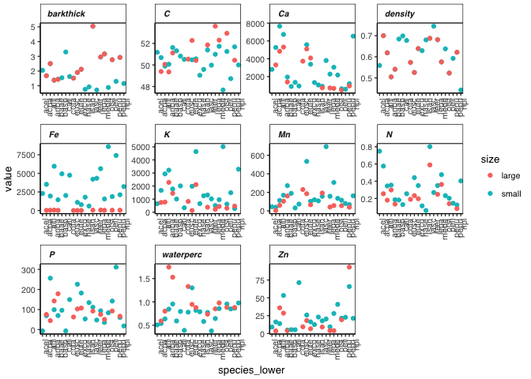
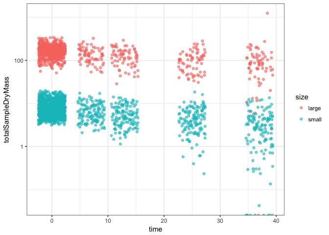
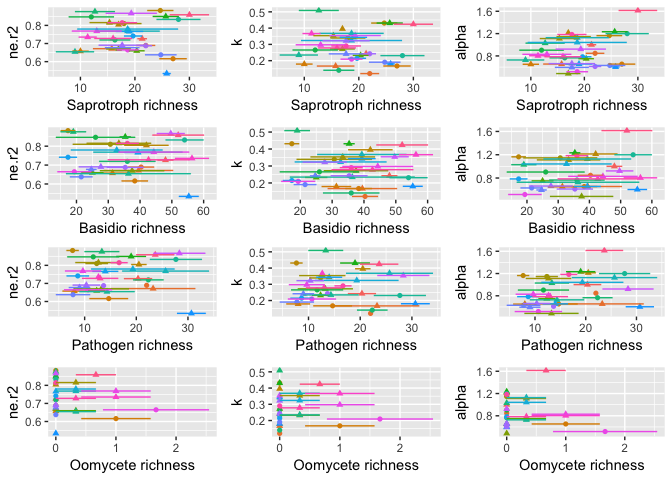
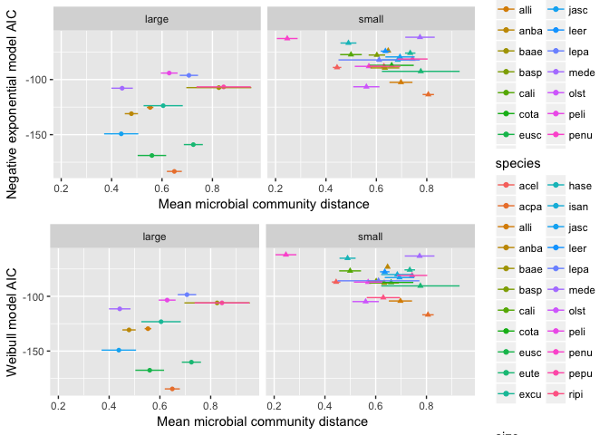
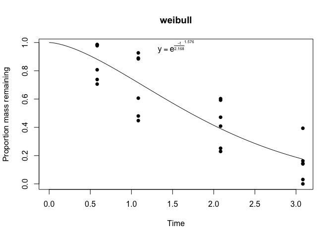
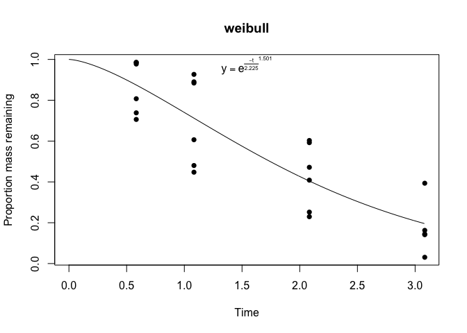
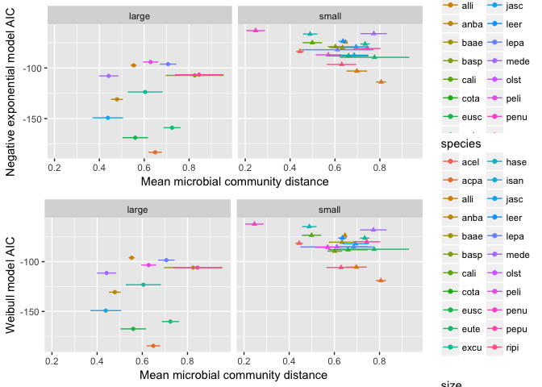

Does chemistry or community better predict mass loss?
================
Marissa Lee
10/23/2017

``` r
#chunk options
knitr::opts_chunk$set(echo = TRUE)

#libraries
devtools::install_github("cornwell-lab-unsw/litterfitter")
library(dplyr)
library(ggplot2)
library(readr)
library(vegan)
library(knitr)
library(litterfitter)
library(magrittr)
library(tidyr)
source("code/load_fxns.R")
source("code/curve_fitting_fxns.R")
source("code/distance_fxns.R")
library(gridExtra)
```

### Load microbial community data

``` r
fung.otu<-load_matotu()
comm.otu<-add_oomycetes(fung.otu)
```

    ## Warning: Column `seqSamp` joining factors with different levels, coercing
    ## to character vector

``` r
#plot_sampleEffortCurves(comm.otu)
```

### Load wood trait data

``` r
traits.mean<-mergeTraitData()
```

    ## Warning: Column `SampleCode` joining character vector and factor, coercing
    ## into character vector

``` r
traits.long<-as.data.frame(gather(traits.mean, key=trait, value=value, -(1:3)))

ggplot(traits.long, aes(x=species_lower, y=value, color=size)) + 
  geom_point() + 
  facet_wrap(~trait, scales="free") +
  mytheme + theme(axis.text.x = element_text(angle = 90, hjust = 1))
```

    ## Warning: Removed 9 rows containing missing values (geom_point).



``` r
# #the Fe values for large stems are not 0, they are just small values
# subset(traits.long, trait=="Fe") %>%
#   ggplot(aes(x=species_lower, y=value, color=size)) + 
#   geom_point() +
#   facet_wrap(~size, scales="free")
```

### Load mass loss data

``` r
#initial mass
initial_mass <- read_in_initial_mass()
```

    ## Parsed with column specification:
    ## cols(
    ##   `random order num` = col_integer(),
    ##   Species = col_character(),
    ##   Stem = col_integer(),
    ##   ID = col_integer(),
    ##   unique = col_character(),
    ##   `Diameter (cm)` = col_double(),
    ##   `Fresh mass (g)` = col_double(),
    ##   `Dry mass (g)` = col_double(),
    ##   notes = col_character()
    ## )

    ## Parsed with column specification:
    ## cols(
    ##   `random order num` = col_character(),
    ##   Species = col_character(),
    ##   Stem = col_integer(),
    ##   ID = col_character(),
    ##   unique = col_character(),
    ##   `Diameter.wbark (mm)` = col_double(),
    ##   `Fresh mass (g)` = col_double(),
    ##   `Diameter.nobark (mm)` = col_double(),
    ##   `Volume (g)` = col_double(),
    ##   `Dry mass wood (g)` = col_double(),
    ##   `Dry mass bark (g)` = col_double(),
    ##   `Dry mass total (g)` = col_double(),
    ##   Notes = col_character()
    ## )

    ## Joining, by = "Species"
    ## Joining, by = "Species"

``` r
# initial_mass %>%
#   mutate(SpeciesCode=tolower(Species))%>%
#   ggplot(aes(y=totalSampleDryMass,x=SpeciesCode,fill=size))+
#   geom_violin()+ 
#   theme(axis.text.x=element_text(angle=90,hjust=1)) + 
#   scale_y_log10()

#mass at harvest
harvest_mass<-LoadHarvestFiles()

#create a complete sample mass df for all time points
mass.data<-bind_rows(initial_mass, harvest_mass)

#check for missing data
mass.data %>%
  filter(is.na(totalSampleDryMass)) %>%
  knitr::kable()
```

| unique     | Species    | size    |     time|  totalSampleDryMass|  density| fruiting      | insects | drill | notes                                                       |
|:-----------|:-----------|:--------|--------:|-------------------:|--------:|:--------------|:--------|:------|:------------------------------------------------------------|
| olst1e     | olst       | small   |        0|                  NA|       NA| NA            | NA      | NA    | NA                                                          |
| olst1j     | olst       | small   |        0|                  NA|       NA| NA            | NA      | NA    | NA                                                          |
| olst1i     | olst       | small   |        0|                  NA|       NA| NA            | NA      | NA    | NA                                                          |
| olst2j     | olst       | small   |        0|                  NA|       NA| NA            | NA      | NA    | NA                                                          |
| olst2b     | olst       | small   |        0|                  NA|       NA| NA            | NA      | NA    | NA                                                          |
| olst2d     | olst       | small   |        0|                  NA|       NA| NA            | NA      | NA    | NA                                                          |
| olst4h     | olst       | small   |        0|                  NA|       NA| NA            | NA      | NA    | NA                                                          |
| olst1c     | olst       | small   |        0|                  NA|       NA| NA            | NA      | NA    | NA                                                          |
| olst3a     | olst       | small   |        0|                  NA|       NA| NA            | NA      | NA    | NA                                                          |
| olst3b     | olst       | small   |        0|                  NA|       NA| NA            | NA      | NA    | NA                                                          |
| olst4e     | olst       | small   |        0|                  NA|       NA| NA            | NA      | NA    | NA                                                          |
| olst1a     | olst       | small   |        0|                  NA|       NA| NA            | NA      | NA    | NA                                                          |
| olst4f     | olst       | small   |        0|                  NA|       NA| NA            | NA      | NA    | NA                                                          |
| olst2i     | olst       | small   |        0|                  NA|       NA| NA            | NA      | NA    | NA                                                          |
| olst2e     | olst       | small   |        0|                  NA|       NA| NA            | NA      | NA    | NA                                                          |
| olst4i     | olst       | small   |        0|                  NA|       NA| NA            | NA      | NA    | NA                                                          |
| olst2g     | olst       | small   |        0|                  NA|       NA| NA            | NA      | NA    | NA                                                          |
| olst1d     | olst       | small   |        0|                  NA|       NA| NA            | NA      | NA    | NA                                                          |
| olst2h     | olst       | small   |        0|                  NA|       NA| NA            | NA      | NA    | NA                                                          |
| olst2c     | olst       | small   |        0|                  NA|       NA| NA            | NA      | NA    | NA                                                          |
| olst4c     | olst       | small   |        0|                  NA|       NA| NA            | NA      | NA    | NA                                                          |
| olst2f     | olst       | small   |        0|                  NA|       NA| NA            | NA      | NA    | NA                                                          |
| olst2a     | olst       | small   |        0|                  NA|       NA| NA            | NA      | NA    | NA                                                          |
| olst4b     | olst       | small   |        0|                  NA|       NA| NA            | NA      | NA    | NA                                                          |
| olst1b     | olst       | small   |        0|                  NA|       NA| NA            | NA      | NA    | NA                                                          |
| olst1k     | olst       | small   |        0|                  NA|       NA| NA            | NA      | NA    | NA                                                          |
| olst1g     | olst       | small   |        0|                  NA|       NA| NA            | NA      | NA    | NA                                                          |
| olst1h     | olst       | small   |        0|                  NA|       NA| NA            | NA      | NA    | NA                                                          |
| olst4g     | olst       | small   |        0|                  NA|       NA| NA            | NA      | NA    | NA                                                          |
| olst4a     | olst       | small   |        0|                  NA|       NA| NA            | NA      | NA    | NA                                                          |
| olst3c     | olst       | small   |        0|                  NA|       NA| NA            | NA      | NA    | NA                                                          |
| olst1f     | olst       | small   |        0|                  NA|       NA| NA            | NA      | NA    | NA                                                          |
| olst4d     | olst       | small   |        0|                  NA|       NA| NA            | NA      | NA    | NA                                                          |
| ripi1j     | ripi       | small   |       37|                  NA|       NA|               | 4       | yes   | completely rotted, no sample -- completely rotted/no sample |
| eute2b     | eute       | small   |       37|                  NA|       NA|               | NA      | yes   | all wwe -- all wet weight excess                            |
| acel2f     | acel       | small   |       37|                  NA|       NA|               | 3       | yes   | all wwe -- all wet weight excess                            |
| olst1c     | olst       | small   |       37|                  NA|       NA|               | NA      | yes   | all wwe -- all wet weight excess                            |
| eusc3j     | eusc       | small   |       37|                  NA|       NA|               | 3       | yes   | all wwe -- all wet weight excess                            |
| ALLI311    | ALLI       | large   |       37|                  NA|       NA|               | NA      | no    | missing from plot -- missing                                |
| hase2b     | hase       | small   |       37|                  NA|       NA|               | 4       | no    | completely rotted, no sample -- completely rotted/no sample |
| anba3g     | anba       | small   |       37|                  NA|       NA| orange hyphae | 3       | no    | all wwe -- all wet weight excess                            |
| anba3f     | anba       | small   |       37|                  NA|       NA|               | 3       | no    | all wwe -- all wet weight excess                            |
| baae1a     | baae       | small   |       37|                  NA|       NA|               | NA      | no    | missing from plot -- missing from plot                      |
| eute1e     | eute       | small   |       37|                  NA|       NA|               | 4       | no    | missing/rotted -- missing/rotted                            |
| eute1l     | eute       | small   |       37|                  NA|       NA|               | 4       | no    | all wwe -- completely rotted                                |
| cota1d     | cota       | small   |       37|                  NA|       NA|               | NA      | yes   | -- most crumbled                                            |
| Identify o | utliers in | mass lo |  ss data|                    |         |               |         |       |                                                             |

``` r
mass.data %>% 
  ggplot(aes(x=time, y=totalSampleDryMass)) + geom_point(alpha=0.6)+theme_bw() 
```

    ## Warning: Removed 46 rows containing missing values (geom_point).


``` r
mass.data[which.max(mass.data$totalSampleDryMass),]
```

    ## # A tibble: 1 x 10
    ##   unique Species  size  time totalSampleDryMass density fruiting insects
    ##    <chr>   <chr> <chr> <dbl>              <dbl>   <dbl>    <chr>   <chr>
    ## 1 EUTE15    EUTE large     0           339.8099      NA     <NA>    <NA>
    ## # ... with 2 more variables: drill <chr>, notes <chr>

``` r
outlier.uniques<-as.character(mass.data[which.max(mass.data$totalSampleDryMass),"unique"])
outlier.uniques
```

    ## [1] "EUTE15"

...another view...might want to check out those two high mass value outliers from harvest 3

``` r
mass.data %>%
  ggplot(aes(x=time, y=totalSampleDryMass,col=size)) +
  geom_point(position="jitter",alpha=0.6)+theme_bw()+scale_y_log10()
```

    ## Warning: Removed 46 rows containing missing values (geom_point).



``` r
#Might want to check out those two high mass value outliers from harvest 3
filter(mass.data, size=="small", time==25) %>%
  arrange(-totalSampleDryMass)->tmp
tmp[1:2,]
```

    ## # A tibble: 2 x 10
    ##   unique Species  size  time totalSampleDryMass density fruiting insects
    ##    <chr>   <chr> <chr> <dbl>              <dbl>   <dbl>    <chr>   <chr>
    ## 1 alli3l    alli small    25              18.37    0.65   hyphae        
    ## 2 hase1k    hase small    25              16.04    0.60                 
    ## # ... with 2 more variables: drill <chr>, notes <chr>

``` r
outlier.uniques<-c(outlier.uniques, tmp$unique[1:2])
```

Are these real 0's?

``` r
mass.data[which(mass.data$totalSampleDryMass==0),]
```

    ## # A tibble: 0 x 10
    ## # ... with 10 variables: unique <chr>, Species <chr>, size <chr>,
    ## #   time <dbl>, totalSampleDryMass <dbl>, density <dbl>, fruiting <chr>,
    ## #   insects <chr>, drill <chr>, notes <chr>

Remove outliers from mass.data and merge time zero with the other harvests to calculate proportion mass remaining at each time point

``` r
mass.data<-mass.data[!mass.data$unique %in% outlier.uniques,]

#Merge time zero with the other harvests to calculate proportion mass remaining at each time point
mass.data %>%
  filter(time==0) %>%
  rename(timeZeroDensity=density) %>%
  rename(timeZeroMass=totalSampleDryMass) %>%
  select(unique,timeZeroMass,timeZeroDensity)->time_zero

mass.data %>%
  left_join(time_zero,by="unique") %>%
  mutate(pmr=totalSampleDryMass/timeZeroMass) %>%
  mutate(SpeciesCode=tolower(Species)) -> plotting_df
  write_csv(plotting_df,"derived_data/plotting_df.csv")
  
  
  # here are the matching failures which are currently due to the time zero adjustment for moisture
  plotting_df %>%
    filter(is.na(pmr)) %>%
    knitr::kable()
```

| unique  | Species | size  |  time|  totalSampleDryMass|  density| fruiting                | insects        | drill | notes                                                       |  timeZeroMass|  timeZeroDensity|  pmr| SpeciesCode |
|:--------|:--------|:------|-----:|-------------------:|--------:|:------------------------|:---------------|:------|:------------------------------------------------------------|-------------:|----------------:|----:|:------------|
| olst1e  | olst    | small |     0|                  NA|       NA| NA                      | NA             | NA    | NA                                                          |            NA|               NA|   NA| olst        |
| olst1j  | olst    | small |     0|                  NA|       NA| NA                      | NA             | NA    | NA                                                          |            NA|               NA|   NA| olst        |
| olst1i  | olst    | small |     0|                  NA|       NA| NA                      | NA             | NA    | NA                                                          |            NA|               NA|   NA| olst        |
| olst2j  | olst    | small |     0|                  NA|       NA| NA                      | NA             | NA    | NA                                                          |            NA|               NA|   NA| olst        |
| olst2b  | olst    | small |     0|                  NA|       NA| NA                      | NA             | NA    | NA                                                          |            NA|               NA|   NA| olst        |
| olst2d  | olst    | small |     0|                  NA|       NA| NA                      | NA             | NA    | NA                                                          |            NA|               NA|   NA| olst        |
| olst4h  | olst    | small |     0|                  NA|       NA| NA                      | NA             | NA    | NA                                                          |            NA|               NA|   NA| olst        |
| olst1c  | olst    | small |     0|                  NA|       NA| NA                      | NA             | NA    | NA                                                          |            NA|               NA|   NA| olst        |
| olst3a  | olst    | small |     0|                  NA|       NA| NA                      | NA             | NA    | NA                                                          |            NA|               NA|   NA| olst        |
| olst3b  | olst    | small |     0|                  NA|       NA| NA                      | NA             | NA    | NA                                                          |            NA|               NA|   NA| olst        |
| olst4e  | olst    | small |     0|                  NA|       NA| NA                      | NA             | NA    | NA                                                          |            NA|               NA|   NA| olst        |
| olst1a  | olst    | small |     0|                  NA|       NA| NA                      | NA             | NA    | NA                                                          |            NA|               NA|   NA| olst        |
| olst4f  | olst    | small |     0|                  NA|       NA| NA                      | NA             | NA    | NA                                                          |            NA|               NA|   NA| olst        |
| olst2i  | olst    | small |     0|                  NA|       NA| NA                      | NA             | NA    | NA                                                          |            NA|               NA|   NA| olst        |
| olst2e  | olst    | small |     0|                  NA|       NA| NA                      | NA             | NA    | NA                                                          |            NA|               NA|   NA| olst        |
| olst4i  | olst    | small |     0|                  NA|       NA| NA                      | NA             | NA    | NA                                                          |            NA|               NA|   NA| olst        |
| olst2g  | olst    | small |     0|                  NA|       NA| NA                      | NA             | NA    | NA                                                          |            NA|               NA|   NA| olst        |
| olst1d  | olst    | small |     0|                  NA|       NA| NA                      | NA             | NA    | NA                                                          |            NA|               NA|   NA| olst        |
| olst2h  | olst    | small |     0|                  NA|       NA| NA                      | NA             | NA    | NA                                                          |            NA|               NA|   NA| olst        |
| olst2c  | olst    | small |     0|                  NA|       NA| NA                      | NA             | NA    | NA                                                          |            NA|               NA|   NA| olst        |
| olst4c  | olst    | small |     0|                  NA|       NA| NA                      | NA             | NA    | NA                                                          |            NA|               NA|   NA| olst        |
| olst2f  | olst    | small |     0|                  NA|       NA| NA                      | NA             | NA    | NA                                                          |            NA|               NA|   NA| olst        |
| olst2a  | olst    | small |     0|                  NA|       NA| NA                      | NA             | NA    | NA                                                          |            NA|               NA|   NA| olst        |
| olst4b  | olst    | small |     0|                  NA|       NA| NA                      | NA             | NA    | NA                                                          |            NA|               NA|   NA| olst        |
| olst1b  | olst    | small |     0|                  NA|       NA| NA                      | NA             | NA    | NA                                                          |            NA|               NA|   NA| olst        |
| olst1k  | olst    | small |     0|                  NA|       NA| NA                      | NA             | NA    | NA                                                          |            NA|               NA|   NA| olst        |
| olst1g  | olst    | small |     0|                  NA|       NA| NA                      | NA             | NA    | NA                                                          |            NA|               NA|   NA| olst        |
| olst1h  | olst    | small |     0|                  NA|       NA| NA                      | NA             | NA    | NA                                                          |            NA|               NA|   NA| olst        |
| olst4g  | olst    | small |     0|                  NA|       NA| NA                      | NA             | NA    | NA                                                          |            NA|               NA|   NA| olst        |
| olst4a  | olst    | small |     0|                  NA|       NA| NA                      | NA             | NA    | NA                                                          |            NA|               NA|   NA| olst        |
| olst3c  | olst    | small |     0|                  NA|       NA| NA                      | NA             | NA    | NA                                                          |            NA|               NA|   NA| olst        |
| olst1f  | olst    | small |     0|                  NA|       NA| NA                      | NA             | NA    | NA                                                          |            NA|               NA|   NA| olst        |
| olst4d  | olst    | small |     0|                  NA|       NA| NA                      | NA             | NA    | NA                                                          |            NA|               NA|   NA| olst        |
| olst1j  | olst    | small |     7|               10.41|     0.57| NA                      |                | yes   |                                                             |            NA|               NA|   NA| olst        |
| olst1i  | olst    | small |     7|               10.20|     0.60| NA                      | 1 lg, 5mm diam | yes   |                                                             |            NA|               NA|   NA| olst        |
| olst1a  | olst    | small |     7|                3.15|     0.63| NA                      |                | yes   |                                                             |            NA|               NA|   NA| olst        |
| olst4f  | olst    | small |     7|                5.55|     0.61| NA                      |                | no    |                                                             |            NA|               NA|   NA| olst        |
| olst2i  | olst    | small |     7|                5.91|     0.61| NA                      |                | no    |                                                             |            NA|               NA|   NA| olst        |
| olst2f  | olst    | small |     7|               11.06|     0.59| NA                      |                | no    |                                                             |            NA|               NA|   NA| olst        |
| olst4h  | olst    | small |    13|                2.13|     0.56|                         |                | yes   |                                                             |            NA|               NA|   NA| olst        |
| olst4e  | olst    | small |    13|                2.99|     0.55|                         |                | yes   |                                                             |            NA|               NA|   NA| olst        |
| olst4c  | olst    | small |    13|                4.60|     0.63|                         |                | yes   |                                                             |            NA|               NA|   NA| olst        |
| olst4b  | olst    | small |    13|                7.37|     0.52|                         |                | no    |                                                             |            NA|               NA|   NA| olst        |
| olst1k  | olst    | small |    13|                6.40|     0.49|                         |                | no    |                                                             |            NA|               NA|   NA| olst        |
| olst1h  | olst    | small |    13|                8.64|     0.45|                         |                | no    |                                                             |            NA|               NA|   NA| olst        |
| olst2d  | olst    | small |    25|                3.94|     0.09| hyphae                  |                | yes   | 2 pieces                                                    |            NA|               NA|   NA| olst        |
| olst3a  | olst    | small |    25|                2.93|     0.52| fuzzy brown hyphae      |                | yes   |                                                             |            NA|               NA|   NA| olst        |
| olst2e  | olst    | small |    25|                5.31|     0.51| fuzzy brown hyphae      |                | yes   | bark flaking off                                            |            NA|               NA|   NA| olst        |
| olst2g  | olst    | small |    25|                2.75|     0.38|                         |                | no    | thin bark almost all gone                                   |            NA|               NA|   NA| olst        |
| olst2c  | olst    | small |    25|                4.65|     0.32| hyphae                  |                | no    | broken, rotted                                              |            NA|               NA|   NA| olst        |
| olst1b  | olst    | small |    25|                4.28|     0.49|                         |                | no    |                                                             |            NA|               NA|   NA| olst        |
| olst2b  | olst    | small |    37|                4.85|     0.65| brown mycellium at ends | NA             | yes   | -- bark all off                                             |            NA|               NA|   NA| olst        |
| ripi1j  | ripi    | small |    37|                  NA|       NA|                         | 4              | yes   | completely rotted, no sample -- completely rotted/no sample |      4.963313|               NA|   NA| ripi        |
| eute2b  | eute    | small |    37|                  NA|       NA|                         | NA             | yes   | all wwe -- all wet weight excess                            |      4.961757|               NA|   NA| eute        |
| acel2f  | acel    | small |    37|                  NA|       NA|                         | 3              | yes   | all wwe -- all wet weight excess                            |      4.593875|               NA|   NA| acel        |
| olst1c  | olst    | small |    37|                  NA|       NA|                         | NA             | yes   | all wwe -- all wet weight excess                            |            NA|               NA|   NA| olst        |
| eusc3j  | eusc    | small |    37|                  NA|       NA|                         | 3              | yes   | all wwe -- all wet weight excess                            |      7.501345|               NA|   NA| eusc        |
| olst3b  | olst    | small |    37|                1.53|     0.65| brown mycellium at ends | 1              | no    | --                                                          |            NA|               NA|   NA| olst        |
| olst1e  | olst    | small |    37|                0.77|       NA|                         | NA             | yes   | all crumbled once handled --                                |            NA|               NA|   NA| olst        |
| ALLI311 | ALLI    | large |    37|                  NA|       NA|                         | NA             | no    | missing from plot -- missing                                |    189.120160|               NA|   NA| alli        |
| hase2b  | hase    | small |    37|                  NA|       NA|                         | 4              | no    | completely rotted, no sample -- completely rotted/no sample |      7.463783|               NA|   NA| hase        |
| anba3g  | anba    | small |    37|                  NA|       NA| orange hyphae           | 3              | no    | all wwe -- all wet weight excess                            |      4.570550|               NA|   NA| anba        |
| anba3f  | anba    | small |    37|                  NA|       NA|                         | 3              | no    | all wwe -- all wet weight excess                            |      4.477830|               NA|   NA| anba        |
| baae1a  | baae    | small |    37|                  NA|       NA|                         | NA             | no    | missing from plot -- missing from plot                      |     10.880365|               NA|   NA| baae        |
| eute1e  | eute    | small |    37|                  NA|       NA|                         | 4              | no    | missing/rotted -- missing/rotted                            |      9.579975|               NA|   NA| eute        |
| eute1l  | eute    | small |    37|                  NA|       NA|                         | 4              | no    | all wwe -- completely rotted                                |      7.401324|               NA|   NA| eute        |
| olst4g  | olst    | small |    37|                3.32|     0.50|                         | 0              | no    | -- intact, no rot                                           |            NA|               NA|   NA| olst        |
| olst4a  | olst    | small |    37|                2.58|     0.41|                         | 1              | no    | -- looks intact/slightly soft                               |            NA|               NA|   NA| olst        |
| cota1d  | cota    | small |    37|                  NA|       NA|                         | NA             | yes   | -- most crumbled                                            |      3.284180|               NA|   NA| cota        |

### Non-linear curve fits of decay trajectories

Using `litterfitter` to apply both negative exponenial and weibull to all species/size classes

``` r
#spdf <- fit_all_curves(plotting_df) #this recalculates all the curve fits, uncomment if the data changes
#write_csv(spdf,"derived_data/mass_loss_parameters.csv")
spdf <- read_csv("derived_data/mass_loss_parameters.csv")

ggplot(spdf,aes(x=t70,y=w.t70,col=size))+
  geom_point()+
  labs(x="Time to 30% mass loss (negative exponential)", 
       y="Time to 30% mass loss (Weibull)")+
  geom_abline(slope=1,intercept=0,linetype="dashed")+theme_bw()
```



### Plot beta diversity of microbial community vs distance in decay params

``` r
#calculate pairwise community distances
sampTab<-CreateSeqSampTab(mass.data) #1. creat sample tab for community sequences samples
```

    ## Joining, by = "code"

    ## Warning: Column `code` joining factor and character vector, coercing into
    ## character vector

``` r
comm.dist<-Calc_commDists(sampTab, comm.otu) #2. calc the distances
```

    ## Warning: Column `sampID1`/`sampID` joining factors with different levels,
    ## coercing to character vector

    ## Warning: Column `sampID2`/`sampID` joining factors with different levels,
    ## coercing to character vector

``` r
summ.comm_dist<-SummarizeCommDist_byCodePair(comm.dist) #3. summarize the distances by codePair

#calculate pairwise decay parameter distances
spdf<-mutate(spdf, minAIC = pmin(neg.exp.aic, w.aic) ) #1. find the min AIC for each species+size
spdf<-AddCodeID(sampTab) #2. add code to spdf using sampTab
```

    ## Joining, by = c("species", "size")

``` r
aic.dist<-Calc_decayParamDiffs(valueCol="minAIC", spdf, sampTab) #3. calc decay param diffs, e.g. minAIC
```

    ## Warning: Column `code1`/`code` joining factor and character vector,
    ## coercing into character vector

    ## Warning: Column `code2`/`code` joining factor and character vector,
    ## coercing into character vector

``` r
k.dist<-Calc_decayParamDiffs(valueCol="k", spdf, sampTab)
```

    ## Warning: Column `code1`/`code` joining factor and character vector,
    ## coercing into character vector

    ## Warning: Column `code2`/`code` joining factor and character vector,
    ## coercing into character vector

``` r
alpha.dist<-Calc_decayParamDiffs(valueCol="alpha", spdf, sampTab)
```

    ## Warning: Column `code1`/`code` joining factor and character vector,
    ## coercing into character vector

    ## Warning: Column `code2`/`code` joining factor and character vector,
    ## coercing into character vector

``` r
#merge community and decay param distances into the same dataframe
comm_decay.dist.aic<-MergeCommNDecaydists_byCodePair(decayparam.dist=aic.dist, summ.comm_dist)
```

    ## Joining, by = "codePair"

``` r
comm_decay.dist.k<-MergeCommNDecaydists_byCodePair(decayparam.dist=k.dist, summ.comm_dist)
```

    ## Joining, by = "codePair"

``` r
comm_decay.dist.alpha<-MergeCommNDecaydists_byCodePair(decayparam.dist=alpha.dist, summ.comm_dist)
```

    ## Joining, by = "codePair"

``` r
# delta minAIC
p.aic<-ggplot(comm_decay.dist.aic, aes(x=mean_comm_dist, y=decayparam_dist, color=size)) + 
  geom_point() + 
  geom_errorbarh(aes(xmin=lower_comm_dist, xmax=upper_comm_dist)) +
  xlab('Mean microbial community distance') + ylab("Delta decay model AIC")

# delta k
p.k<-ggplot(comm_decay.dist.k, aes(x=mean_comm_dist, y=decayparam_dist, color=size)) + 
  geom_point() + 
  geom_errorbarh(aes(xmin=lower_comm_dist, xmax=upper_comm_dist)) +
  xlab('Mean microbial community distance') + ylab("Delta decay model k")

# delta alpha
p.alpha<-ggplot(comm_decay.dist.alpha, aes(x=mean_comm_dist, y=decayparam_dist, color=size)) + 
  geom_point() + 
  geom_errorbarh(aes(xmin=lower_comm_dist, xmax=upper_comm_dist)) +
  xlab('Mean microbial community distance') + ylab("Delta decay model alpha")

#pdf('output/commDist_decayparamDist_byCode.pdf', width=4, height=9)
grid.arrange(p.aic, p.k, p.alpha)
```

    ## Warning: Removed 5 rows containing missing values (geom_errorbarh).

    ## Warning: Removed 5 rows containing missing values (geom_errorbarh).

    ## Warning: Removed 5 rows containing missing values (geom_errorbarh).



``` r
#dev.off()
```

Not a lot of information in mean inital community distance about species+size decay trajectories

### Plot beta diversity of wood traits vs distance in decay params

``` r
#calculate pairwise wood trait distances
traits.dist<-Calc_woodTraitDist(traits.mean)

#calculate pairwise decay parameter distances
spdf<-mutate(spdf, minAIC = pmin(neg.exp.aic, w.aic) ) #1. find the min AIC for each species+size
spdf<-AddCodeID(sampTab) #2. add code to spdf using sampTab
```

    ## Joining, by = c("species", "size", "code")

``` r
aic.dist<-Calc_decayParamDiffs(valueCol="minAIC", spdf, sampTab) #3. calc decay param diffs, e.g. minAIC
```

    ## Warning: Column `code1`/`code` joining factor and character vector,
    ## coercing into character vector

    ## Warning: Column `code2`/`code` joining factor and character vector,
    ## coercing into character vector

``` r
k.dist<-Calc_decayParamDiffs(valueCol="k", spdf, sampTab)
```

    ## Warning: Column `code1`/`code` joining factor and character vector,
    ## coercing into character vector

    ## Warning: Column `code2`/`code` joining factor and character vector,
    ## coercing into character vector

``` r
alpha.dist<-Calc_decayParamDiffs(valueCol="alpha", spdf, sampTab)
```

    ## Warning: Column `code1`/`code` joining factor and character vector,
    ## coercing into character vector

    ## Warning: Column `code2`/`code` joining factor and character vector,
    ## coercing into character vector

``` r
#merge wood trait and decay param distances into the same dataframe
wood_decay.dist.aic<-MergeWoodNDecaydists_byCodePair(decayparam.dist=aic.dist, traits.dist)
```

    ## Joining, by = "codePair"

``` r
wood_decay.dist.k<-MergeWoodNDecaydists_byCodePair(decayparam.dist=k.dist, traits.dist)
```

    ## Joining, by = "codePair"

``` r
wood_decay.dist.alpha<-MergeWoodNDecaydists_byCodePair(decayparam.dist=alpha.dist, traits.dist)
```

    ## Joining, by = "codePair"

``` r
# delta minAIC
p.aic<-ggplot(wood_decay.dist.aic, aes(x=woodTraitDist, y=decayparam_dist, color=size)) + 
  geom_point() + 
  xlab('Wood trait distance') + ylab("Delta decay model AIC")

# delta k
p.k<-ggplot(wood_decay.dist.k, aes(x=woodTraitDist, y=decayparam_dist, color=size)) + 
  geom_point() + 
  xlab('Wood trait distance') + ylab("Delta decay model k")

# delta alpha
p.alpha<-ggplot(wood_decay.dist.alpha, aes(x=woodTraitDist, y=decayparam_dist, color=size)) + 
  geom_point() + 
  xlab('Wood trait distance') + ylab("Delta decay model alpha")

#pdf('output/woodTraitDist_decayparamDist_byCode.pdf', width=4, height=9)
grid.arrange(p.aic, p.k, p.alpha)
```



``` r
#dev.off()
```

Seems like there is more information in inital wood trait distance about species+size decay trajectories than there is in the initial mean communities distances

### Look at 3-way relationship between species+size distances: wood trait, microbial community, and k

``` r
comm_wood_decay.dist.k<-left_join(comm_decay.dist.k, wood_decay.dist.k)
```

    ## Joining, by = c("codePair", "size", "decayparam_dist")

``` r
#what is up with the missing data in woodTraitDist?
select(comm_wood_decay.dist.k, size, mean_comm_dist, woodTraitDist, decayparam_dist) %>%
  filter(complete.cases(size, comm_wood_decay.dist.k, mean_comm_dist, woodTraitDist, decayparam_dist)) -> df.k

p1<-ggplot(df.k, aes(x=mean_comm_dist, y=decayparam_dist, color=size)) + 
  geom_point() + xlab("Mean microbial community distance") + ylab("Decay rate (k) distance")

p2<-ggplot(df.k, aes(x=woodTraitDist, y=decayparam_dist, color=size)) + 
  geom_point() +  xlab("Wood trait distance") + ylab("Decay rate (k) distance")

p3<-ggplot(df.k, aes(x=mean_comm_dist, y=woodTraitDist, color=size)) + 
  geom_point() +  xlab("Mean microbial community distance") + ylab("Wood trait distance")

#pdf('output/triDist_k_byCode.pdf', width=6, height=6)
grid.arrange(p1,p2,p3, ncol=2)
```



``` r
#dev.off()

cor(df.k[,-1])
```

    ##                 mean_comm_dist woodTraitDist decayparam_dist
    ## mean_comm_dist      1.00000000    0.07362931      0.09170396
    ## woodTraitDist       0.07362931    1.00000000      0.26622256
    ## decayparam_dist     0.09170396    0.26622256      1.00000000

Another view that emphasizes the relationship between wood trait distance and decay rate distances between species+size classes. Mean microbial community distance is not correlated with either variable.

### Plot with species+size beta diversity of microbial community vs AIC of neg.exponential

``` r
#calculate pairwise community distances
sampTab<-CreateSeqSampTab(mass.data) #1. creat sample tab for community sequences samples
```

    ## Joining, by = "code"

    ## Warning: Column `code` joining factor and character vector, coercing into
    ## character vector

``` r
comm.dist<-Calc_commDists(sampTab, comm.otu) #2. calc the distances
```

    ## Warning: Column `sampID1`/`sampID` joining factors with different levels,
    ## coercing to character vector

    ## Warning: Column `sampID2`/`sampID` joining factors with different levels,
    ## coercing to character vector

``` r
filter(comm.dist, code1==code2) %>% #3. isolate just the distances within species+size
  select(sampID1, sampID2, code1, size, dist) %>%
  rename("code"="code1") %>% #rename the cols
  group_by(code) %>%
  summarize(mean=mean(dist), #calculate the mean community dist within code classes
            se=sd(dist)/sqrt(length(dist)),
            upper=mean+se,
            lower=mean-se) -> comm.dist.wth

#combine with decay trajectory params
spdf.sub<-select(spdf, code, neg.exp.aic, w.aic)
comm.dist.wth<-left_join(comm.dist.wth, spdf.sub)
```

    ## Joining, by = "code"

``` r
#add back the size and species columns
comm.dist.wth$size<-"large"
comm.dist.wth[tolower(comm.dist.wth$code) == comm.dist.wth$code, "size"]<-"small"
comm.dist.wth$species<-tolower(comm.dist.wth$code)

p.negexp.aic<-ggplot(comm.dist.wth, aes(x=mean, y=neg.exp.aic, color=species, shape=size)) + 
  geom_point() +
  geom_errorbarh(aes(xmin=lower, xmax=upper)) +
  xlab("Mean microbial community distance") + 
  ylab("Negative exponential model AIC") +
  facet_grid(~size)

p.w.aic<-ggplot(comm.dist.wth, aes(x=mean, y=w.aic, color=species, shape=size)) + 
  geom_point() +
  geom_errorbarh(aes(xmin=lower, xmax=upper)) +
  xlab("Mean microbial community distance") + 
  ylab("Weibull model AIC") +
  facet_grid(~size)

#pdf('output/commDist_decayparam_withinCode.pdf', width=8, height=6)
grid.arrange(p.negexp.aic, p.w.aic)
```

    ## Warning: Removed 1 rows containing missing values (geom_point).

    ## Warning: Removed 2 rows containing missing values (geom_errorbarh).

    ## Warning: Removed 1 rows containing missing values (geom_point).

    ## Warning: Removed 2 rows containing missing values (geom_errorbarh).



``` r
#dev.off()
```

Expected to see a positive relationship between AIC and within species+size class microbial community distance. In other words, expected that samples with similar initial microbial communities would have better-fitting decay models.

The large size samples show no pattern The small size samples show (maybe) the opposite pattern
