Does chemistry or community better predict mass loss?
================
10/23/2017

### Load microbial community data

### Load wood trait data

### Load decay data

Check for missing stem-level data

    ## # A tibble: 2 x 15
    ## # Groups:   codeStem [2]
    ##   codeStem barkthick      C       Ca density        Fe       K      Mn
    ##      <chr>     <dbl>  <dbl>    <dbl>   <dbl>     <dbl>   <dbl>   <dbl>
    ## 1    acpa2        NA 50.659 3397.019      NA  3859.762 1400.18  38.376
    ## 2    lepa4        NA 48.377 2870.988      NA 14424.700  748.14 246.435
    ## # ... with 7 more variables: N <dbl>, P <dbl>, waterperc <dbl>, Zn <dbl>,
    ## #   species <chr>, size <chr>, code <chr>

    ## # A tibble: 2 x 7
    ## # Groups:   code [2]
    ##    code species  size seq_sampName  drop seq.stem codeStem
    ##   <chr>   <chr> <chr>        <chr> <chr>    <chr>    <chr>
    ## 1  acpa    acpa small        acpa2  acpa        2     <NA>
    ## 2  lepa    lepa small        lepa4  lepa        4     <NA>

    ## # A tibble: 0 x 9
    ## # Groups:   codeStem [0]
    ## # ... with 9 variables: codeStem <chr>, time0 <dbl>, time7 <dbl>,
    ## #   time13 <dbl>, time25 <dbl>, time37 <dbl>, code <chr>, species <chr>,
    ## #   size <chr>

For some reason there are 2 unique codeStem ids that are found in the trait data (xrf sample names) and the sequence data, but not in the stemSamples data (deployment sample names). These codeStem ids are not found in the percent mass loss data. Because the main goal is to analyze decay responses, I'm going to continue to leave these codeStems out of the stemSamples dataframe. Is it possible that stem id numbers got switched? Something to follow-up on.

Figure 1. Wood species x decay params 

    ## quartz_off_screen 
    ##                 2

Figure 2. Time x percent mass remaining by wood species 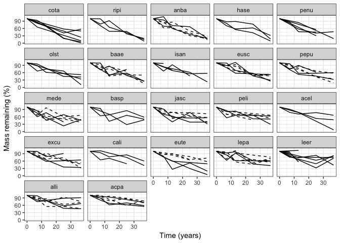

    ## quartz_off_screen 
    ##                 2

########################################## 

Wood traits as a predictor
==========================

We expect initial wood traits will explain varitation in species+size decay rate (k and t70), species+size lagginess (alpha), and stem-level percent mass remaining at 7, 13, 25, and 37 months of decay. Specifically, we expect samples with (a) high water percent, (b) low density and total C, (c) high macro and micro nutrients, and (d) thicker bark (potential mech: limiting microbial colonization) to have faster decay and less lagginess.

*Hyp (species+size-level)* Species+size-level initial wood traits will predict variation decay rates and lagginess.
-------------------------------------------------------------------------------------------------------------------

*Hyp (stem-level)* Stem-level initial wood traits will predict variation in percent mass loss at each time step.
----------------------------------------------------------------------------------------------------------------

First, we need to decide what trait data (and samples) to include in this analysis since we don't have full coverage of stem-level trait data. Density and bark thickness were only measured on small sized stems. If there is not be very much within-species variation in these traits that contribute to variation in percent mass loss than we can justify including species-level estimates of these traits in the stem-level model.

Plot the small-sized stem-level measures of density and barkthick 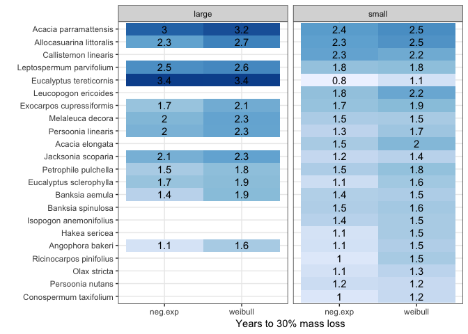

    ## quartz_off_screen 
    ##                 2

Compare model fits (r2) using stem and species-level data to identify how much information about percent mass remaining is lost by using species-level estimates...For density, it looks like stem-level data improves model fit a tiny bit for early percent mass remaining time points (after 7 and 13 months) but not later time points. For barkthickness, fits are about the same.

    ## $time7
    ## Cox test
    ## 
    ## Model 1: time7 ~ density_stem
    ## Model 2: time7 ~ density_code
    ##                 Estimate Std. Error z value Pr(>|z|)  
    ## fitted(M1) ~ M2  0.49786    0.57478  0.8662  0.38639  
    ## fitted(M2) ~ M1 -0.79541    0.44222 -1.7987  0.07207 .
    ## ---
    ## Signif. codes:  0 '***' 0.001 '**' 0.01 '*' 0.05 '.' 0.1 ' ' 1
    ## 
    ## $time13
    ## Cox test
    ## 
    ## Model 1: time13 ~ density_stem
    ## Model 2: time13 ~ density_code
    ##                 Estimate Std. Error z value Pr(>|z|)  
    ## fitted(M1) ~ M2  0.54058    0.52400  1.0316  0.30224  
    ## fitted(M2) ~ M1 -0.76988    0.35492 -2.1691  0.03007 *
    ## ---
    ## Signif. codes:  0 '***' 0.001 '**' 0.01 '*' 0.05 '.' 0.1 ' ' 1
    ## 
    ## $time25
    ## Cox test
    ## 
    ## Model 1: time25 ~ density_stem
    ## Model 2: time25 ~ density_code
    ##                  Estimate Std. Error z value Pr(>|z|)
    ## fitted(M1) ~ M2 -0.304694    0.48973 -0.6222   0.5338
    ## fitted(M2) ~ M1  0.000482    0.52877  0.0009   0.9993
    ## 
    ## $time37
    ## Cox test
    ## 
    ## Model 1: time37 ~ density_stem
    ## Model 2: time37 ~ density_code
    ##                 Estimate Std. Error z value Pr(>|z|)
    ## fitted(M1) ~ M2 -0.22964    0.59171 -0.3881   0.6979
    ## fitted(M2) ~ M1 -0.18086    0.59676 -0.3031   0.7618

    ## $time7
    ## Cox test
    ## 
    ## Model 1: time7 ~ barkthick_stem
    ## Model 2: time7 ~ barkthick_code
    ##                  Estimate Std. Error z value Pr(>|z|)
    ## fitted(M1) ~ M2 -0.106235    0.31972 -0.3323   0.7397
    ## fitted(M2) ~ M1 -0.034044    0.34070 -0.0999   0.9204
    ## 
    ## $time13
    ## Cox test
    ## 
    ## Model 1: time13 ~ barkthick_stem
    ## Model 2: time13 ~ barkthick_code
    ##                  Estimate Std. Error z value Pr(>|z|)
    ## fitted(M1) ~ M2 -0.021347   0.059079 -0.3613   0.7179
    ## fitted(M2) ~ M1  0.013126   0.098203  0.1337   0.8937
    ## 
    ## $time25
    ## Cox test
    ## 
    ## Model 1: time25 ~ barkthick_stem
    ## Model 2: time25 ~ barkthick_code
    ##                 Estimate Std. Error z value Pr(>|z|)
    ## fitted(M1) ~ M2 -0.22358    0.22716 -0.9842   0.3250
    ## fitted(M2) ~ M1  0.11241    0.34481  0.3260   0.7444
    ## 
    ## $time37
    ## Cox test
    ## 
    ## Model 1: time37 ~ barkthick_stem
    ## Model 2: time37 ~ barkthick_code
    ##                 Estimate Std. Error z value Pr(>|z|)
    ## fitted(M1) ~ M2 -0.76726    0.83993 -0.9135   0.3610
    ## fitted(M2) ~ M1 -0.25388    0.89980 -0.2821   0.7778

    ##   respvars density_code_r2 density_stem_r2 barkthick_code_r2
    ## 1    time7            0.05            0.08              0.02
    ## 2   time13            0.03            0.07              0.00
    ## 3   time25            0.05            0.05              0.02
    ## 4   time37            0.07            0.07              0.11
    ##   barkthick_stem_r2
    ## 1              0.01
    ## 2              0.00
    ## 3              0.01
    ## 4              0.09

Stem-level density estimates provide additional information about mass loss beyond code-level density at time7 and time 13, but are not useful for later times points. Stem-level bark thickness estimates are not useful (beyond code-level bark thickness) at any time point.

Compile a "stem-level" dataframe with (a) stem-level percent mass remaining values, (b) stem-level traits including waterperc and chemistry along, and (c) small species-level density and bark thickness data.

########################################## 

Community as a predictor
========================

Filter community matrix to include only taxa that are present in a least 20% of all the samples. This step removes taxa that may not contribute much to our understanding of the relationship between species’ multivariate abundance and environment.

    ## [1] "Keep 150 of 6128 OTUs"

*Hyp (species+size-level)* Species+size-level (average) initial microbial community composition will predict variation in decay model fit (r2), rate (t70, k), and lagginess (alpha).
-------------------------------------------------------------------------------------------------------------------------------------------------------------------------------------

*Hyp (stem-level)* Stem-level initial microbial communitiy compositions will predict variation in percent mass loss, particularly in the early stages of decay.
---------------------------------------------------------------------------------------------------------------------------------------------------------------

Comp01 (of the non-trimmed community) is a significant predictor of percent mass remaining at 37 months.

Plot the distribution of WA-PLS scores 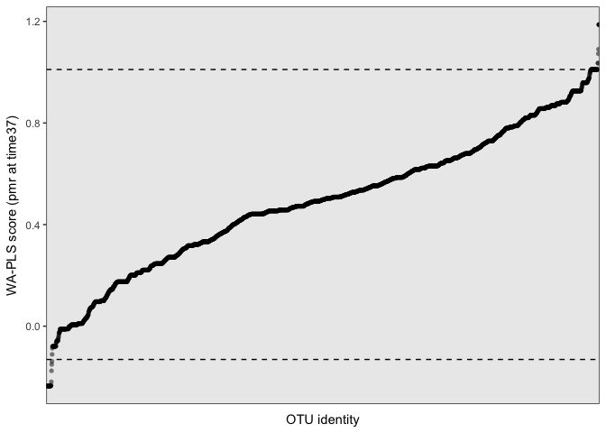

Who is in the top and bottom 1%?

    ##        quant kingdom        phylum                    species Trophic.Mode
    ## 1  bottom 1%   Fungi Basidiomycota         Hyphodontia_radula   Saprotroph
    ## 2  bottom 1%   Fungi    Ascomycota     Neosetophoma_samarorum   Saprotroph
    ## 3  bottom 1%   Fungi    Ascomycota         Hormonema_viticola   Saprotroph
    ## 4  bottom 1%   Fungi    Ascomycota  Neophysalospora_eucalypti unclassified
    ## 5  bottom 1%   Fungi Basidiomycota      Bensingtonia_ingoldii   Saprotroph
    ## 6  bottom 1%   Fungi Basidiomycota   Pisolithus_croceorrhizus  Symbiotroph
    ## 7  bottom 1%   Fungi    Ascomycota  Mycosphaerella_excentrica   Pathotroph
    ## 8  bottom 1%   Fungi Basidiomycota      Mycetinis_scorodonius   Saprotroph
    ## 9  bottom 1%   Fungi Basidiomycota            Odontia_fibrosa   Saprotroph
    ## 10 bottom 1%   Fungi    Ascomycota     Acremonium_cavaraeanum unclassified
    ## 11 bottom 1%   Fungi    Ascomycota    Phaeomoniella_prunicola   Saprotroph
    ## 12    top 1%   Fungi    Ascomycota Debaryomyces_vindobonensis unclassified
    ## 13    top 1%   Fungi Basidiomycota       Septobasidium_burtii   Pathotroph
    ##                   Guild
    ## 1  Undefined Saprotroph
    ## 2  Undefined Saprotroph
    ## 3  Undefined Saprotroph
    ## 4          unclassified
    ## 5  Undefined Saprotroph
    ## 6       Ectomycorrhizal
    ## 7        Plant Pathogen
    ## 8  Undefined Saprotroph
    ## 9  Undefined Saprotroph
    ## 10         unclassified
    ## 11 Undefined Saprotroph
    ## 12         unclassified
    ## 13      Animal Pathogen

Many of the bottom 1% OTUs are classified as saprotrophs. That makes sense since low WA-PLS scores indicate an association with high mass loss (i.e. less mass remaining) at time37.

But saprotrophs are also found at many points along the gradient... 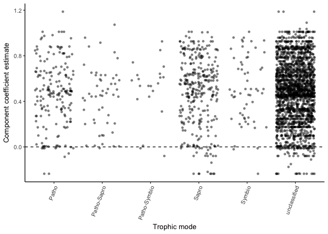

    ## quartz_off_screen 
    ##                 2

Is this because there is an underlying signature of wood traits on the initial microbial community that is driving the relationship between the community and the mass remaining after 37 months? The next analysis ("Community+traits" as predictor) will test this formally. Just out of curiousity, I'd like to pull in OTU "niche" info from the boral analysis to see if there's a relationship between OTU WA-PLS scores and wood trait coeffient estimates.

Reminder of which wood traits were included in the best model to explain pmr at time37...

    ##            X          term              time7              time13
    ## 1          1   (Intercept)  0.361 +/- 0.156 * 1.287 +/- 0.149 ***
    ## 2          2     sizesmall  -0.069 +/- 0.038  -0.152 +/- 0.044 **
    ## 3          3     waterperc               <NA>  -0.01 +/- 0.003 **
    ## 4          4 density_smspp 0.804 +/- 0.265 **                <NA>
    ## 5          5             N -0.257 +/- 0.111 *  -0.316 +/- 0.121 *
    ## 6          6             P               <NA>       0.001 +/- 0 *
    ## 7          7            Mn           0 +/- 0                 <NA>
    ## 8          8          <NA>               <NA>                <NA>
    ## 9      Fstat         Fstat               2.73                6.13
    ## 10     numdf         numdf                  7                   4
    ## 11     dendf         dendf                 47                  49
    ## 12 r.squared     r.squared               0.29                0.33
    ##                  time25               time37
    ## 1    1.117 +/- 0.13 ***  1.376 +/- 0.135 ***
    ## 2   -0.108 +/- 0.039 **                 <NA>
    ## 3  -0.012 +/- 0.003 *** -0.018 +/- 0.003 ***
    ## 4                  <NA>                 <NA>
    ## 5                  <NA>                 <NA>
    ## 6        0.001 +/- 0 **        0.001 +/- 0 *
    ## 7                  <NA>                 <NA>
    ## 8                  <NA>                 <NA>
    ## 9                  8.48                13.95
    ## 10                    3                    4
    ## 11                   48                   46
    ## 12                 0.35                 0.55

More water leads to less mass remaining; more P leads to more mass remaining

Plot OTU wood trait estimates (from boral) versus signif WA-PLS score. 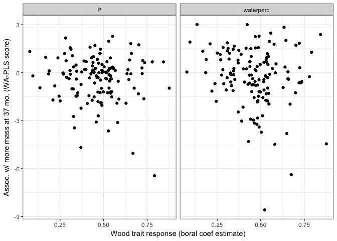 There's a weak negative relationship between an OTU's WA-PLS score and waterperc coefficient (slope=-2.3, p=.03), suggesting that OTUs that "prefer" high-water niche space are associated with less mass remaining at time37.

########################################## 

Community+traits as a predictor
===============================

*Hyp (species+size-level)* After accounting for variation in decay due to wood traits, average initial microbial communitiy compositions will predict variation in decay model fit (r2), rate (t70, k), and lagginess (alpha).
------------------------------------------------------------------------------------------------------------------------------------------------------------------------------------------------------------------------------

Community data doesn't improve our understanding of decay rates (k, t70) or variation in decay rate (ne.r2) beyond what is known from the trait data.

*Hyp (stem-level)* After accounting for variation in decay due to wood traits (no models with density, includes small-species level bark thickness), stem-specific initial microbial communitiy compositions will predict variation in percent mass loss, particularly in the early stages of decay.
----------------------------------------------------------------------------------------------------------------------------------------------------------------------------------------------------------------------------------------------------------------------------------------------------

Community data doesn't improve our understanding of mass loss (pmr after 7, 13, 25, and 37 months) beyond what is known from the trait data.

########################################## 

Diversity (and diversity of specific clades) as a predictor
===========================================================

**Note that the full community matrix was used for these analyses**

*Hyp-a (species+size-level)* Greater microbial diversity (richness, Shannon diversity, ... add phylogenetic diversity) will lead to better-fitting decay models (ne.r2), faster decay (k), and less lagginess (alpha) because of the selection effect for fast decayers and complementarity among taxa for decay.
-----------------------------------------------------------------------------------------------------------------------------------------------------------------------------------------------------------------------------------------------------------------------------------------------------------------

Hyp-Alt: Greater microbial diversity will lead to worse-fitting decay models (ne.r2), slower decay (k), and more lagginess (alpha) because taxa will be allocating more of their resources to combat one another. \#\# *Hyp-b (species+size-level)* Greater saprotroph and basidiomycete richness will lead to better-fitting decay models (ne.r2), faster decay (k), and less lagginess (alpha) because the community does not need to wait for the arrival of key decayers to act on the wood substrate.
Hyp-Alt: Greater saprotroph and basidiomycete richness will lead to worse-fitting decay models (ne.r2), slower decay (k), and more lagginess (alpha) because decayers will be allocating more of their resources to combat one another. \#\# *Hyp-c (species+size-level)* Greater pathogen and oomycete richness will lead to worse-fitting decay models (ne.r2), slower decay (k), and more lagginess (alpha) because the presence of these organisms will inhibit the establishment and activity of decayers.

    ##             term     source respvar               coef signif
    ## 1           mean  ShannonsH     t70  0.821 +/- 0.326 *   TRUE
    ## 2 sizesmall:mean  ShannonsH     t70 -0.811 +/- 0.377 *   TRUE
    ## 3           mean Patho.rich     t70  0.046 +/- 0.022 *   TRUE

Only 2 models were informative: (a) Shannon's H and t70, (b) Pathogen OTU richness and t70. For large-stem samples, high Shannon's H and many pathogen OTUs increase the time to 70% mass remaining (ie, slower mass loss). This pattern is not observed for small-stem samples even though there is an overlapping range of diversity values.

Plot the relationship between (a) Shannon's H and t70 

Plot the relationship between (b) Pathogen OTU richness and t70

``` r
tmp <- rich.decayfits[['Patho.rich']]
ggplot(tmp, aes(x = mean, y = t70)) +
  geom_point() +
  geom_smooth(method = "lm") +
  facet_grid(~size)+
  xlab("Pathogen OTU richness") + ylab("Years to 70% mass remaining")
```

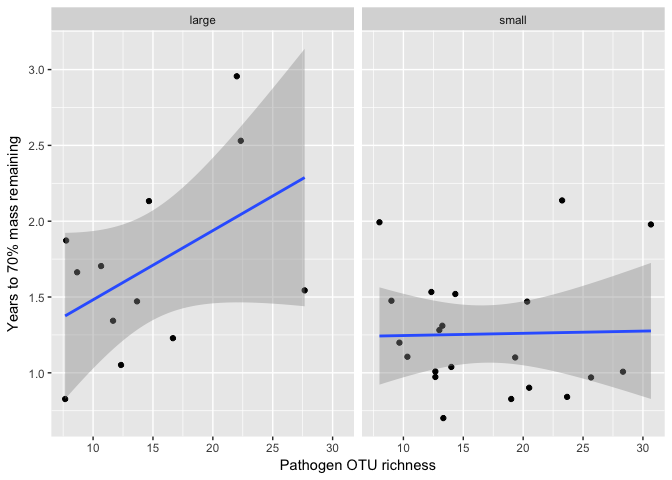

``` r
rm(rich.df, H.df, sapro.df, basidio.df, path.df, oomy.df, 
   richList, richNames, rhs, lhs, richType.list, pretty.list, summ, summ.df,
   rich.decayfits, resp.list, i, k)
```

*Hyp-a (stem-level)* Greater microbial diversity (richness, Shannon diversity, ... add phylogenetic diversity) will lead to less mass remaining esp. at early time steps because of the selection effect for fast decayers and complementarity among taxa for decay.
--------------------------------------------------------------------------------------------------------------------------------------------------------------------------------------------------------------------------------------------------------------------

Hyp-Alt: Greater microbial diversity will lead to more mass remaining because taxa will be allocating more of their resources to combat one another. \#\# *Hyp-b (stem-level)* Greater saprotroph and basidiomycete richness will lead to less mass remaining esp. at early time steps because the community does not need to wait for the arrival of key decayers to act on the wood substrate.
Hyp-Alt: Greater saprotroph and basidiomycete richness will lead to more mass remaining because decayers will be allocating more of their resources to combat one another. \#\# *Hyp-c (stem-level)* Greater pathogen and oomycete richness will lead to more mass remaining because the presence of these organisms will inhibit the establishment and activity of decayers.

A couple of models were informative, particularly for the last time point (time37). Saprotroph OTU richness is associated with percent mass remaining at time25 and time37. Pathogen OTU richness and Shannon's H are associated with pmr at time 37. In all cases, there is a negative interaction between stem size and diversity.

Plot the relationship between saprotroph OTU richness and pmr at time25 and time37 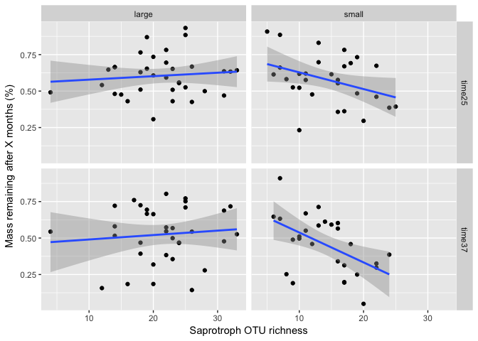 More saprotrophs leads to less mass remaining - but only in small stems.

Plot the relationship between pathogen OTU richness and pmr at time37 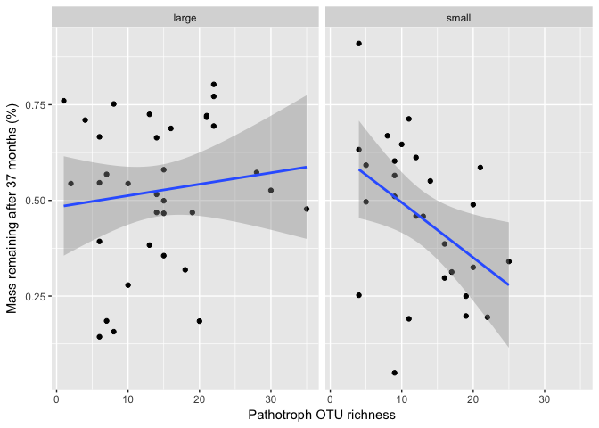 More pathotrophs leads to less mass remaining - but only in small stems.

Plot the relationship between Shannon's H and pmr at time37 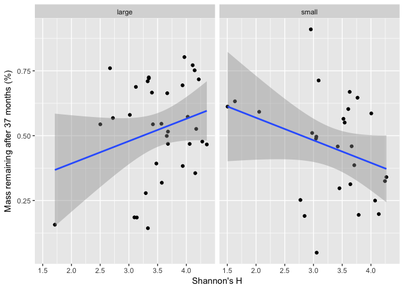 Higher Shannon's H leads to less mass remaining in small stems, more mass remaining in large stems... but there are some points that look like they're overly influential in the regressions.

############################################## 

Diversity plus traits as a predictor
====================================

*Hyp (species+size-level)* After accounting for variation in decay due to wood traits, average initial microbial diversity (richness, Shannon diversity, ... add phylogenetic diversity) will predict variation in decay model fit (r2), rate (k), and lagginess (alpha).
-------------------------------------------------------------------------------------------------------------------------------------------------------------------------------------------------------------------------------------------------------------------------

    ## [1] term    source  respvar coef    signif 
    ## <0 rows> (or 0-length row.names)

Diversity metrics don't provide additional information beyond wood trait data.

*Hyp (stem-level)* After accounting for variation in decay due to wood traits, initial microbial diversity (richness, Shannon diversity, ... add phylogenetic diversity) will predict variation in percent mass loss, esp. at early time points.
------------------------------------------------------------------------------------------------------------------------------------------------------------------------------------------------------------------------------------------------

    ##                 term     source respvar               coef signif
    ## 1 sizesmall:sub_rich   Richness  time25 -0.001 +/- 0.001 *   TRUE
    ## 2 sizesmall:sub_rich Patho.rich  time37 -0.011 +/- 0.006 *   TRUE

Overall and pathotroph OTU richness provide additional information beyond wood trait data for percent mass remaining after 25 and 37 months, respectively.

Plot the relationship between OTU richness and residuals of pmr at time25 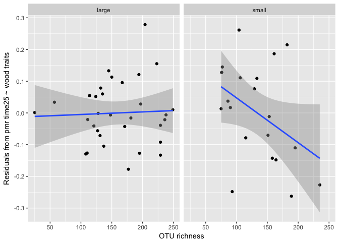 In small stems, more fungal and oomycete OTUs leads to less mass remaining after 25 months than would be expected based on wood traits alone.

Plot the relationship between Pathotroph OTU richness and residuals of pmr at time37 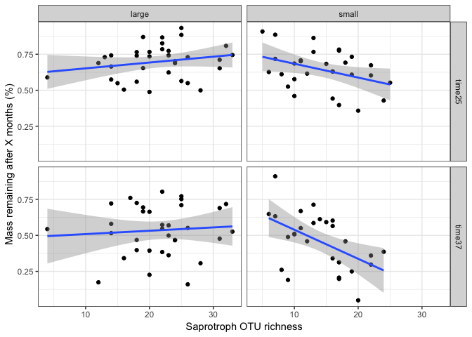 In small stems, more pathotrophs leads to less mass remaining after 37 months than would be expected based on wood traits alone.

############################################## 

Relationship between wood traits and community
==============================================

*Hyp (species+size-level)* Initial microbial communitiy compositions will covary with initial wood traits
---------------------------------------------------------------------------------------------------------

Full community anova-like table

    ##                    term    df Fval  pval
    ## 1                  size  1.00 1.40 0.019
    ## 2             barkthick  1.00 1.60 0.004
    ## 3             waterperc  1.00 1.41 0.019
    ## 4              Residual 29.00   NA    NA
    ## 5                  <NA>    NA   NA    NA
    ## 6   Constrained inertia  1.91   NA    NA
    ## 7 Unconstrained inertia 11.16   NA    NA

Trimmed community anova-like table

    ##                    term    df Fval  pval
    ## 1                  size  1.00 1.67 0.014
    ## 2             waterperc  1.00 1.58 0.023
    ## 3             barkthick  1.00 1.54 0.033
    ## 4              Residual 29.00   NA    NA
    ## 5                  <NA>    NA   NA    NA
    ## 6   Constrained inertia  1.79   NA    NA
    ## 7 Unconstrained inertia  9.22   NA    NA

*Hyp (stem-level)* Average initial microbial communitiy compositions will covary with initial wood traits
---------------------------------------------------------------------------------------------------------

Full community anova-like table

    ##                     term    df Fval  pval
    ## 1        barkthick_smspp  1.00 2.33 0.001
    ## 2              waterperc  1.00 1.99 0.001
    ## 3                   size  1.00 2.13 0.001
    ## 4                     Ca  1.00 1.91 0.001
    ## 5          density_smspp  1.00 1.97 0.001
    ## 6                      C  1.00 1.96 0.001
    ## 7                      N  1.00 2.02 0.001
    ## 8                     Mn  1.00 1.62 0.004
    ## 9                      K  1.00 1.60 0.009
    ## 10              Residual 47.00   NA    NA
    ## 11                  <NA>    NA   NA    NA
    ## 12   Constrained inertia  7.55   NA    NA
    ## 13 Unconstrained inertia 17.37   NA    NA

Trimmed community anova-like table

    ##                     term    df Fval  pval
    ## 1              waterperc  1.00 2.37 0.001
    ## 2                   size  1.00 2.60 0.001
    ## 3                      C  1.00 2.70 0.001
    ## 4        barkthick_smspp  1.00 2.64 0.001
    ## 5                      N  1.00 2.02 0.002
    ## 6                      K  1.00 1.59 0.027
    ## 7                     Ca  1.00 1.93 0.003
    ## 8          density_smspp  1.00 1.68 0.014
    ## 9                     Mn  1.00 1.61 0.024
    ## 10              Residual 47.00   NA    NA
    ## 11                  <NA>    NA   NA    NA
    ## 12   Constrained inertia  7.18   NA    NA
    ## 13 Unconstrained inertia 14.86   NA    NA

############################################## 

Extra pieces
------------

1.  *code/testing\_time\_zero.Rmd* -- Including t=0 points to fit decay model affects the liklihood and the model selection criteria, but the curve fits are identical with this formulation. Excluding the t=0 fits has an effect of prefering simpler models, which is the same effect as increasing the penalty for model complexity.

2.  *code/initialDist\_vs\_decayDist\_btwCode.Rmd* -- No apparent relationship between species+size dissimilarities in initial microbial community composition (bray and jaccard) and decay trajectory params

3.  *code/boralOTUpairs\_vs\_decay.Rmd* -- No apparent relationship between frequency of boral-ID'd positively/negatively correlated OTU pairs and decay params

4.  *code/withinInitialDist\_vs\_decayR2.Rmd* -- No apparent relationship between initial microbial diversity WITHIN species+size and decay model R2

5.  *code/unexpectedTaxa.Rmd* -- Mycorrhizal fungi and animal-associated fungi that somehow made it into our OTU table
