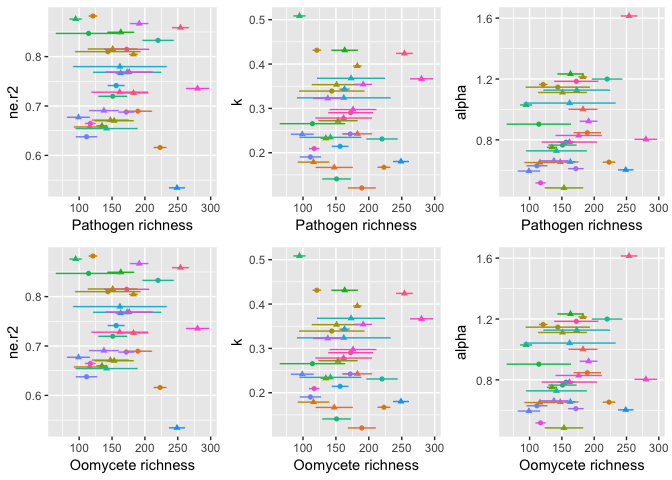
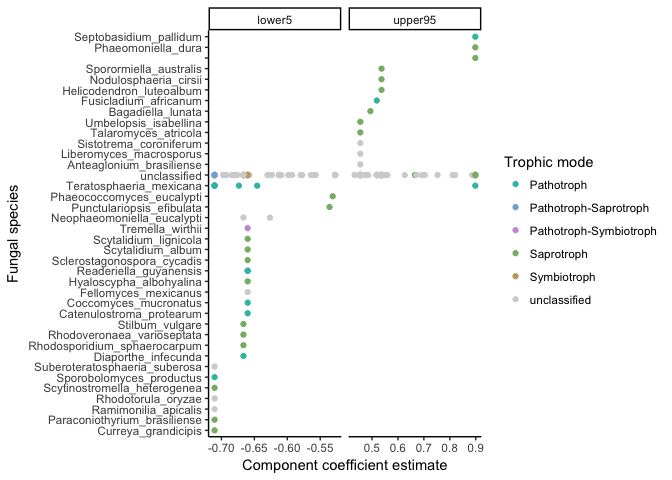

Does chemistry or community better predict mass loss?
================
Marissa Lee
10/23/2017

``` r
#chunk options
knitr::opts_chunk$set(echo = TRUE, message=FALSE, warning=FALSE)

#libraries
devtools::install_github("cornwell-lab-unsw/litterfitter")
library(dplyr)
library(ggplot2)
library(readr)
library(vegan)
library(knitr)
library(litterfitter)
library(magrittr)
library(tidyr)
library(gridExtra)
library(rioja)

#fxns
source("code/load_fxns.R")
source("code/curve_fitting_fxns.R")
source("code/distance_fxns.R")
source("code/otuIDs_fxns.R")
```

LOAD DATA
---------

### MICROBIAL COMMUNITY DATA

``` r
#stem sample meta data
#stemSamples<-load_stemSamples() #uncomment if the data changes
#write_csv(stemSamples, "derived_data/stemSamples.csv")
stemSamples<-read_csv("derived_data/stemSamples.csv")

#OTU table
#fung.otu<-load_matotu() #uncomment if the data changes
#comm.otu<-add_oomycetes(fung.otu) #add the oomycetes #uncomment if the data changes
#write.csv(comm.otu, "derived_data/comm_otu.csv")
comm.otu<-read.csv("derived_data/comm_otu.csv", row.names=1)

#create sequence sample meta data table
#seqSamples<-load_seqSamples(comm.otu, stemSamples) #uncomment if the data changes
#write_csv(seqSamples, "derived_data/seqSamples.csv")
seqSamples<-read_csv("derived_data/seqSamples.csv")

#taxon lookup info
#taxAndFunguild<-load_TaxAndFunguild(comm.otu) #uncomment if the data changes
#write_csv(taxAndFunguild, "derived_data/taxaAndFunguild.csv")
taxAndFunguild<-read_csv("derived_data/taxaAndFunguild.csv")

#plot_sampleEffortCurves(comm.otu)
```

### LOAD WOOD TRAIT DATA

``` r
#traits.mean<-mergeTraitData() #uncomment if the data changes
#write_csv(traits.mean, "derived_data/traits_mean.csv") 
traits.mean<-read_csv("derived_data/traits_mean.csv")
#missing data
#traits.long<-as.data.frame(gather(traits.mean, key=trait, value=value, -(1:3)))
#filter(traits.long, is.na(value))


### LOAD MASS LOSS DATA and CALCULATE % MASS REMAINING AT EACH TIMEPOINT
#initial_mass <- read_in_initial_mass() #uncomment if the data changes
#harvest_mass<-LoadHarvestFiles()
#mass.data<-bind_rows(initial_mass, harvest_mass)
#missing data
#mass.data %>% filter(is.na(totalSampleDryMass))
#plotting_df<-Calc_massRemaining(mass.data)
#matching failures
# plotting_df %>%
#   filter(is.na(pmr)) %>%
#   select(unique, species, size, time, totalSampleDryMass, notes) %>%
#   spread(key=time, value=totalSampleDryMass)
#remove NAs
#plotting_df %>% filter(!is.na(pmr)) -> plotting_df
#write_csv(plotting_df,"derived_data/plotting_df.csv")
plotting_df<-read_csv("derived_data/plotting_df.csv")

### CALCULATE DECAY TRAJECTORY FITS
#spdf <- fit_all_curves(plotting_df) #this recalculates all the curve fits, uncomment if the data changes
#indx<-select(stemSamples, code, species, size)
#spdf<-left_join(spdf, indx) #add code
#write_csv(spdf,"derived_data/mass_loss_parameters.csv")
spdf <- read_csv("derived_data/mass_loss_parameters.csv")
# ggplot(spdf,aes(x=t70,y=w.t70,col=size))+
#   geom_point()+
#   labs(x="Time to 30% mass loss (negative exponential)", 
#        y="Time to 30% mass loss (Weibull)")+
#   geom_abline(slope=1,intercept=0,linetype="dashed")+theme_bw()
```

Wood traits as a preditor
-------------------------

*Hyp:* Variation in wood traits will lead to differences in decay model fit (r2), rate (k), and lagginess (alpha). Specifically, we expect samples with (a) high waterperc, (b) low density and C, (c) high P, K, Ca, Mn, Fe, Zn, and N, and (d) thicker bark (potential mech: limiting microbial colonization) to have better-fiting decay models (r2), faster decay rates (k), and less lagginess (alpha).

*Result:* - r2... greater water content and greater Zn and N leads to better-fitting decay models. Note: This result changed when I changed waterperc to g water/g wet weight. When waterperc was in terms of g/g dry weight, the best model that greater water content and less C leads to better-fitting decay models

``` r
summary(mod.select.r) # waterperc, Zn, N
```

    ## 
    ## Call:
    ## lm(formula = ne.r2 ~ waterperc + barkthick + Ca + Zn + N + C, 
    ##     data = spdf.traits)
    ## 
    ## Residuals:
    ##      Min       1Q   Median       3Q      Max 
    ## -0.11753 -0.02941  0.00184  0.02233  0.12797 
    ## 
    ## Coefficients:
    ##               Estimate Std. Error t value Pr(>|t|)    
    ## (Intercept)  1.278e+00  6.457e-01   1.979   0.0590 .  
    ## waterperc    7.405e-03  1.509e-03   4.906 4.75e-05 ***
    ## barkthick   -3.098e-02  1.587e-02  -1.953   0.0622 .  
    ## Ca          -1.189e-05  6.783e-06  -1.753   0.0919 .  
    ## Zn           1.504e-03  5.664e-04   2.654   0.0136 *  
    ## N            2.092e-01  8.436e-02   2.480   0.0202 *  
    ## C           -1.698e-02  1.291e-02  -1.315   0.2006    
    ## ---
    ## Signif. codes:  0 '***' 0.001 '**' 0.01 '*' 0.05 '.' 0.1 ' ' 1
    ## 
    ## Residual standard error: 0.06306 on 25 degrees of freedom
    ## Multiple R-squared:  0.559,  Adjusted R-squared:  0.4532 
    ## F-statistic: 5.282 on 6 and 25 DF,  p-value: 0.001234

``` r
#ggplot(spdf.traits, aes(x=waterperc, y=ne.r2, color=species, shape=size)) + geom_point()
```

-   k... small size stems, greater water content, thinner bark, less Ca, more Zn, and more N lead to faster decay

NOTE from Will: Density explains the same part of the variation in decay rates that initial water content does, only less well. (In other words, although, density gets dropped from the best model by the model selection procedure, if we remove initial water from consideration entirely, density is included in the model as the best predictor.)

So my current interpretation is that wood water rentention--related to fiber saturation point and partially captured by the density measurement--has a strong effect on long-term decomposition rates, possibly by maintaining fungal activity further into dry periods. There is also a very likely interaction between this water retention capacity with the fungal community (see results in Setting the Stage paper, Lee et al. in review).

``` r
summary(mod.select.k) # size, waterperc, barkthick, Ca, Zn, N
```

    ## 
    ## Call:
    ## lm(formula = k ~ size + waterperc + barkthick + Ca + Zn + N + 
    ##     C, data = spdf.traits)
    ## 
    ## Residuals:
    ##       Min        1Q    Median        3Q       Max 
    ## -0.092617 -0.034671  0.007271  0.029023  0.123640 
    ## 
    ## Coefficients:
    ##               Estimate Std. Error t value Pr(>|t|)    
    ## (Intercept)  6.021e-01  5.754e-01   1.046 0.305851    
    ## sizesmall    9.050e-02  2.405e-02   3.763 0.000958 ***
    ## waterperc    8.990e-03  1.378e-03   6.524 9.53e-07 ***
    ## barkthick   -3.862e-02  1.406e-02  -2.748 0.011198 *  
    ## Ca          -1.869e-05  5.920e-06  -3.157 0.004263 ** 
    ## Zn           1.811e-03  4.922e-04   3.680 0.001177 ** 
    ## N            2.334e-01  7.674e-02   3.041 0.005628 ** 
    ## C           -1.475e-02  1.135e-02  -1.300 0.206001    
    ## ---
    ## Signif. codes:  0 '***' 0.001 '**' 0.01 '*' 0.05 '.' 0.1 ' ' 1
    ## 
    ## Residual standard error: 0.05446 on 24 degrees of freedom
    ## Multiple R-squared:  0.7486, Adjusted R-squared:  0.6752 
    ## F-statistic: 10.21 on 7 and 24 DF,  p-value: 6.942e-06

``` r
ggplot(spdf.traits, aes(x=waterperc, y=k)) + geom_point(aes(color=species)) + facet_grid(~size) +
  labs(y="k (year^-1)",x="Initial water content (% wet weight)")+geom_smooth(method="lm",se=FALSE)+theme_bw()
```


``` r
ggplot(spdf.traits, aes(x=density, y=k)) + geom_point(aes(color=species)) + facet_grid(~size) +
  labs(y="k (year^-1)",x="Initial density (g/cm^3)")+geom_smooth(method="lm",se=FALSE)+theme_bw()
```


``` r
#ggplot(spdf.traits, aes(x=waterperc, y=density, color=species, size=k)) + geom_point() + facet_grid(~size)
```

-   t70... small stem sizes, less water content, thicker bark, more Ca, less Zn, and less N lead to longer wood "70%"-lives. Note: This result changed when I changed waterperc to g water/g wet weight. When waterperc was in terms of g/g dry weight, the best model indicated that large size stems, less water content, more Ca, and less Zn lead to longer wood "70%"-lives

``` r
summary(mod.select.t70) # size, waterperc, barkthick, Ca, Zn
```

    ## 
    ## Call:
    ## lm(formula = t70 ~ size + waterperc + barkthick + Ca + Zn + N, 
    ##     data = spdf.traits)
    ## 
    ## Residuals:
    ##      Min       1Q   Median       3Q      Max 
    ## -0.55548 -0.15857 -0.00642  0.07054  0.58357 
    ## 
    ## Coefficients:
    ##               Estimate Std. Error t value Pr(>|t|)    
    ## (Intercept)  3.799e+00  4.125e-01   9.209 1.65e-09 ***
    ## sizesmall   -6.284e-01  1.314e-01  -4.783 6.54e-05 ***
    ## waterperc   -4.956e-02  7.653e-03  -6.476 8.79e-07 ***
    ## barkthick    1.752e-01  7.308e-02   2.397 0.024301 *  
    ## Ca           1.234e-04  3.203e-05   3.851 0.000725 ***
    ## Zn          -9.272e-03  2.698e-03  -3.436 0.002070 ** 
    ## N           -9.985e-01  4.258e-01  -2.345 0.027272 *  
    ## ---
    ## Signif. codes:  0 '***' 0.001 '**' 0.01 '*' 0.05 '.' 0.1 ' ' 1
    ## 
    ## Residual standard error: 0.3026 on 25 degrees of freedom
    ## Multiple R-squared:  0.735,  Adjusted R-squared:  0.6714 
    ## F-statistic: 11.56 on 6 and 25 DF,  p-value: 3.442e-06

``` r
#ggplot(spdf.traits, aes(x=waterperc, y=t70, color=species, size=density)) + geom_point() + facet_grid(~size)
```

-   alpha--- note: don't interpret yet

``` r
summary(mod.select.alpha) # density, Zn, C
```

    ## 
    ## Call:
    ## lm(formula = alpha ~ density + barkthick + P + K + Ca + Fe + 
    ##     Zn + N + C, data = spdf.traits)
    ## 
    ## Residuals:
    ##      Min       1Q   Median       3Q      Max 
    ## -0.28961 -0.10507  0.01239  0.05847  0.37028 
    ## 
    ## Coefficients:
    ##               Estimate Std. Error t value Pr(>|t|)  
    ## (Intercept)  6.978e+00  2.515e+00   2.774   0.0111 *
    ## density     -1.550e+00  5.595e-01  -2.770   0.0112 *
    ## barkthick   -8.276e-02  5.373e-02  -1.540   0.1377  
    ## P           -7.629e-04  5.649e-04  -1.350   0.1906  
    ## K            6.411e-05  4.567e-05   1.404   0.1743  
    ## Ca          -4.290e-05  2.474e-05  -1.735   0.0968 .
    ## Fe          -3.027e-05  2.051e-05  -1.475   0.1543  
    ## Zn           4.064e-03  1.897e-03   2.143   0.0435 *
    ## N            3.470e-01  2.794e-01   1.242   0.2274  
    ## C           -9.831e-02  4.674e-02  -2.103   0.0471 *
    ## ---
    ## Signif. codes:  0 '***' 0.001 '**' 0.01 '*' 0.05 '.' 0.1 ' ' 1
    ## 
    ## Residual standard error: 0.1989 on 22 degrees of freedom
    ## Multiple R-squared:  0.6067, Adjusted R-squared:  0.4458 
    ## F-statistic: 3.771 on 9 and 22 DF,  p-value: 0.005306

Community as a predictor
------------------------

But first check the OTU table for unexpected taxa.... - Arbuscular mycorrhizal fungi

``` r
GlomOTUs<-taxAndFunguild[taxAndFunguild$phylum=="Glomeromycota","OTUId"]
HowManyOfThese(otuIDs=GlomOTUs, taxAndFunguild, comm.otu)
```

    ## $otu
    ##       ITSall_OTUa_148 ITSall_OTUa_3684 ITSall_OTUb_476
    ## MEDE3              19                0               0
    ## pepu3               0                0             143
    ## penu                0               19               0
    ## 
    ## $tax
    ## # A tibble: 3 x 4
    ##              OTUId        phylum           genus      species
    ##              <chr>         <chr>           <chr>        <chr>
    ## 1  ITSall_OTUa_148 Glomeromycota    unclassified unclassified
    ## 2 ITSall_OTUa_3684 Glomeromycota    unclassified unclassified
    ## 3  ITSall_OTUb_476 Glomeromycota Claroideoglomus unclassified

``` r
#am.otus<-taxAndFunguild[taxAndFunguild$Guild=="Arbuscular Mycorrhizal","OTUId"] #same as above
#HowManyOfThese(otuIDs=am.otus, taxAndFunguild, comm.otu)
```

-   Ericoid mycorrhizal fungi

``` r
ericoid.otus<-taxAndFunguild[taxAndFunguild$Guild=="Ericoid Mycorrhizal","OTUId"]
HowManyOfThese(otuIDs=ericoid.otus, taxAndFunguild, comm.otu)
```

    ## $otu
    ##       ITSall_OTUb_8077 ITSall_OTUc_1349 ITSall_OTUd_6564
    ## EUTE1                0               17                0
    ## LEPA1                0               17                0
    ## ANBA3                0                0               64
    ## PELI2                0               19                0
    ## PELI3                0              208                0
    ## BAAE1                0               32                0
    ## BAAE2                0               78                0
    ## PEPU1                0              222                0
    ## MEDE1               10                0                0
    ## MEDE3               74                0                0
    ## 
    ## $tax
    ## # A tibble: 3 x 4
    ##              OTUId     phylum        genus                    species
    ##              <chr>      <chr>        <chr>                      <chr>
    ## 1 ITSall_OTUb_8077 Ascomycota Oidiodendron Oidiodendron_periconioides
    ## 2 ITSall_OTUc_1349 Ascomycota Oidiodendron       Oidiodendron_griseum
    ## 3 ITSall_OTUd_6564 Ascomycota Oidiodendron               unclassified

``` r
#.. orchidmyc.otus<-taxAndFunguild[taxAndFunguild$Guild=="Orchid Mycorrhizal","OTUId"]
#HowManyOfThese(otuIDs=orchidmyc.otus, taxAndFunguild, comm.otu) #none
```

-   Lichenized fungi

``` r
lichenized.otus<-taxAndFunguild[grepl('Lichen', taxAndFunguild$Guild),"OTUId"]
HowManyOfThese(otuIDs=lichenized.otus, taxAndFunguild, comm.otu)
```

    ## $otu
    ##       ITSall_OTUa_401 ITSall_OTUa_6598 ITSall_OTUa_4710 ITSall_OTUb_2612
    ## EUTE2               0                0               13                0
    ## EUTE3               0                0                0              203
    ## LEPA2               0                0                0               31
    ## LEPA4              15                0                0                0
    ## EUSC1              14                0                0              498
    ## EUSC2               0                0                0               84
    ## ANBA2               0                0                0               52
    ## ANBA3               0                0                0               39
    ## PELI1               0                0                0                0
    ## PELI2               0                0                0                0
    ## PELI3               0                0                0                0
    ## JASC2               0                0                0                0
    ## BAAE1               0                0                0              121
    ## BAAE3              86                0                0               39
    ## PEPU1              24                0                0                0
    ## PEPU2               0                0                0               28
    ## PEPU3              35                0                0               27
    ## ACPA1               0                0                0              123
    ## ACPA3               0                0                0              191
    ## ACPA4              40                0                0               12
    ## ALLI1               0                0                0               24
    ## ALLI2               0                0                0               53
    ## ALLI3               0                0                0               10
    ## EXCU1               0                0               18               91
    ## EXCU2              10                0              210               44
    ## EXCU3             284                0              145               36
    ## MEDE3               0                0                0               17
    ## acpa4               0                0               56               65
    ## alli2               0                0                0             1838
    ## alli3               0                0                0              137
    ## anba2               0                0                0                0
    ## anba3              17                0                0              802
    ## baae1               0                0                0               53
    ## excu2              14                0             1622              228
    ## jasc3               0                0               32             1081
    ## mede1               0                0                0                0
    ## mede2              21                0               64               13
    ## peli2               0                0                0              106
    ## pepu1              22                0                0              298
    ## baspA              33                0              169               82
    ## olstB              22                0             1101               61
    ## isanB              15                0                0                0
    ## leerA               9                0               42              311
    ## cotaB               9                0                0              149
    ## olstA              32                0              904              349
    ## leerB              43                0               25              630
    ## leerC              35                0              129              322
    ## cotaA               0                0                0                0
    ## baspB               0                0                0               63
    ## haseA               0                0                0               74
    ## ripiB             106                0                9              196
    ## baspC              26                0                0               55
    ## isanA              50                0               16               38
    ## ripiA              21                0                0               33
    ## penuA               0                0                0              510
    ## leerD              37                0               14               42
    ## haseB               0                0               32               39
    ## acelB               0                0                0              666
    ## penuB               0                0                0              311
    ## leerE              12                0               70              458
    ## caliB               0                0                0               20
    ## acelA               9               17                0              685
    ## eute2               0                0                0               16
    ## alli1               0                0                0               68
    ## excu3               0                0              157                0
    ## lepa4              54                0                0               52
    ## acpa1               0                0                0             2206
    ## pepu2               9                0                0               79
    ## eute1             152                0               20                0
    ## baae3              35                0                0              388
    ## hase               11                0                0                0
    ## olst                0                0             1282              594
    ## leer                0                0              159              184
    ## pepu3               0                0                0                0
    ## isan                0                0               77                0
    ## cali               21                0                0               32
    ## ripi              113                0                0               13
    ## cota              117                0               34              114
    ## penu               27                0                0              899
    ## mede3              15               14              130                0
    ## excu1               0                0                0              663
    ## acel                0                0                0              127
    ## acpa2               0                0             1861               22
    ## jasc2              42                0                0              472
    ## peli3               0                0                0               26
    ## lepa2              95                0                0                0
    ## basp               47                0                0              216
    ## jasc1               0                0                0              201
    ##       ITSall_OTUc_24 ITSall_OTUd_7054 ITSall_OTUd_5372 ITSall_OTUd_5115
    ## EUTE2              0                0                0                0
    ## EUTE3              0                0                0                0
    ## LEPA2              0                0                0                0
    ## LEPA4              0                0                0                0
    ## EUSC1              0                0                0                0
    ## EUSC2              0                0                0                0
    ## ANBA2              0                0                0                0
    ## ANBA3              0                0                0                0
    ## PELI1              0                0                0                0
    ## PELI2              0                0                0                0
    ## PELI3              0                0                0                0
    ## JASC2              0                0               16                0
    ## BAAE1              0                0                0                0
    ## BAAE3              0                0                0                0
    ## PEPU1              0                0                0                0
    ## PEPU2              0                0                0                0
    ## PEPU3              0                0                0                0
    ## ACPA1              0                0                0                0
    ## ACPA3              0               55                0                0
    ## ACPA4              0                0                0                0
    ## ALLI1              0                0                0                0
    ## ALLI2              0                0                0                0
    ## ALLI3              0                0                0               11
    ## EXCU1              0                0                0                0
    ## EXCU2              0                0                0                0
    ## EXCU3              0                0                0                0
    ## MEDE3              0                0                0                0
    ## acpa4              0                0                0                0
    ## alli2              0                0                0                0
    ## alli3              0                0                0                0
    ## anba2              0                0                0                0
    ## anba3              0                0                0                0
    ## baae1              0                0                0                0
    ## excu2              0                0                0                0
    ## jasc3              0                0                0                0
    ## mede1              0                0                0                0
    ## mede2              0                0                0                0
    ## peli2              0                0                0                0
    ## pepu1              0                0                0                0
    ## baspA              0               56                0                0
    ## olstB              0                0                0                0
    ## isanB              0                0                0                0
    ## leerA              0                0                0                0
    ## cotaB              0                0                0                0
    ## olstA              0                0                0                0
    ## leerB              0                0                0                0
    ## leerC              0                0                0                0
    ## cotaA              0                0                0                0
    ## baspB              0                0                0                0
    ## haseA              0               13                0                0
    ## ripiB              0                0                0                0
    ## baspC              0                0                0                0
    ## isanA              0                0                0                0
    ## ripiA              0                0                0                0
    ## penuA              0                0                0                0
    ## leerD              0                0                0                0
    ## haseB              0                0                0                0
    ## acelB              0                0                0                0
    ## penuB              0                0                0                0
    ## leerE              0                0                0                0
    ## caliB             31                0                0                0
    ## acelA              0                0                0                0
    ## eute2              0                0                0                0
    ## alli1              0                0                0                0
    ## excu3              0                0                0                0
    ## lepa4              0                0                0                0
    ## acpa1              0                0                0                0
    ## pepu2              0                0                0                0
    ## eute1              0                0                0                0
    ## baae3              0                0                0                0
    ## hase               0                0                0                0
    ## olst               0                0                0                0
    ## leer               0                0                0                0
    ## pepu3              0                0                0                0
    ## isan               0                0                0                0
    ## cali               0                0                0                0
    ## ripi               0                0                0                0
    ## cota               0                0                0                0
    ## penu               0                0                0                0
    ## mede3              0                0                0                0
    ## excu1              0                0                0                0
    ## acel               0                0                0                0
    ## acpa2              0                0                0                0
    ## jasc2              0                0                0                0
    ## peli3              0                0                0                0
    ## lepa2              0                0                0                0
    ## basp              43               37                0                0
    ## jasc1              0                0                0                0
    ##       ITSall_OTUd_5072 ITSall_OTUd_5304 ITSall_OTUd_6076 ITSall_OTUd_5997
    ## EUTE2                0                0                0                0
    ## EUTE3                0                0                0                0
    ## LEPA2                0                0                0                0
    ## LEPA4                0                0                0                0
    ## EUSC1                0                0                0                0
    ## EUSC2                0                0                0                0
    ## ANBA2                0                0                0                0
    ## ANBA3                0                0                0                0
    ## PELI1                0                0               16                0
    ## PELI2                0                0                0                0
    ## PELI3                0                0                0                0
    ## JASC2                0                0                0                0
    ## BAAE1                0                0                0                0
    ## BAAE3                0                0                0                0
    ## PEPU1                0                0                0                0
    ## PEPU2                0                0                0                0
    ## PEPU3                0                0                0                0
    ## ACPA1                0                0                0                0
    ## ACPA3                0                0                0                0
    ## ACPA4                0                0                0                0
    ## ALLI1                0                0               20                0
    ## ALLI2                0                0                0                0
    ## ALLI3                0                0                0                0
    ## EXCU1                0                0                0                0
    ## EXCU2                0                0                0                0
    ## EXCU3                0                0                0                0
    ## MEDE3                0                0                0                0
    ## acpa4                0               16                0                0
    ## alli2                0                0                0                0
    ## alli3                0                0                0                0
    ## anba2                0                0                0                0
    ## anba3                0                0                0                0
    ## baae1                0                0                0                0
    ## excu2                0                0                0                0
    ## jasc3                0                0                0                0
    ## mede1                0                0                0                0
    ## mede2                0                0                0                0
    ## peli2                0                0                0                0
    ## pepu1                0                0                0                9
    ## baspA                0                0                0                0
    ## olstB                0                0                0                0
    ## isanB                0                0                0                0
    ## leerA                0                0                0                0
    ## cotaB                0                0                0                0
    ## olstA                0                0                0                0
    ## leerB                0                0                0                0
    ## leerC                0                0                0                0
    ## cotaA                0                0                0                0
    ## baspB                0                0                0                0
    ## haseA                0                0                0                0
    ## ripiB                0                0                0                0
    ## baspC                0                0                0                0
    ## isanA                0                0                0                0
    ## ripiA                0                0                0                0
    ## penuA                0                0                0                0
    ## leerD                0                0                0                0
    ## haseB                0                0                0                0
    ## acelB                0                0                0                0
    ## penuB                0                0                0                0
    ## leerE                0                0                0                0
    ## caliB                0                0                0                0
    ## acelA                0                0                0                0
    ## eute2                0                0                0                0
    ## alli1                0                0                0                0
    ## excu3                0                0                0                0
    ## lepa4                0                0                0                0
    ## acpa1                0                0                0                0
    ## pepu2                0                0                0                0
    ## eute1                0                0                0                0
    ## baae3                0                0                0                0
    ## hase                 0                0                0                0
    ## olst                10                0                0                0
    ## leer                 0                0                0                0
    ## pepu3                0                0                0                0
    ## isan                 0                0                0                0
    ## cali                 0                0                0                0
    ## ripi                 0                0                0                0
    ## cota                 0                0                0                0
    ## penu                 0                0                0                0
    ## mede3                0                0                0                0
    ## excu1                0                0                0                0
    ## acel                 0                0                0                0
    ## acpa2                0                0                0                0
    ## jasc2                0                0                0                0
    ## peli3                0                0                0                0
    ## lepa2                0                0                0                0
    ## basp                 0                0                0                0
    ## jasc1                0                0                0                0
    ##       ITSall_OTUd_5677 ITSall_OTUd_5683 ITSall_OTUd_8138 ITSall_OTUd_1781
    ## EUTE2                0                0                0                0
    ## EUTE3                0                0                0                0
    ## LEPA2                0                0                0                0
    ## LEPA4                0                0                0                0
    ## EUSC1                0                0                0                0
    ## EUSC2                0                0                0                0
    ## ANBA2                0                0                0                0
    ## ANBA3                0                0                0                0
    ## PELI1                0                0                0                0
    ## PELI2                0                0                0                0
    ## PELI3                0                0                0                0
    ## JASC2                0                0                0                0
    ## BAAE1                0                0                0                0
    ## BAAE3                0                0               19                0
    ## PEPU1                0                0                0                0
    ## PEPU2                0                0                0                0
    ## PEPU3                0                0               13                0
    ## ACPA1                0                0                0                0
    ## ACPA3                0                0                0                0
    ## ACPA4                0                0                0                0
    ## ALLI1                0                0                0                0
    ## ALLI2                0                0                0                0
    ## ALLI3                0                0                0                0
    ## EXCU1                0                0                0                0
    ## EXCU2                0                0                0                0
    ## EXCU3                0                0                0                0
    ## MEDE3                0                0                0                0
    ## acpa4                0                0                0                0
    ## alli2                0                0                0                0
    ## alli3                0                0                0                0
    ## anba2                0                0                0                0
    ## anba3                0                0                0                0
    ## baae1                0                0                0                0
    ## excu2                0                0                0                0
    ## jasc3                0               67                0                0
    ## mede1                0                0                0                0
    ## mede2                0                0                0                0
    ## peli2                0                0                0                0
    ## pepu1                0                0               34                0
    ## baspA                0                0                0                0
    ## olstB                0                0                0                0
    ## isanB                0                0                0                0
    ## leerA                0                0                0                0
    ## cotaB                0                0                0                0
    ## olstA                0                0                0                0
    ## leerB                0                0                0                0
    ## leerC                0                0                0                0
    ## cotaA                0                0                0                0
    ## baspB                0                0                0                0
    ## haseA                0                0                0                0
    ## ripiB                0                0                0                0
    ## baspC                0                0                0                0
    ## isanA                0                0                0                0
    ## ripiA                0                0                0                0
    ## penuA                0                0                0                0
    ## leerD                0                0                0                0
    ## haseB               15                0                0                0
    ## acelB                0                0                0                0
    ## penuB                0                0                0                0
    ## leerE                0                0               33                0
    ## caliB                0                0                0                0
    ## acelA                0                0                0                0
    ## eute2                0                0                0                0
    ## alli1                0                0                0                0
    ## excu3                0                0                0                0
    ## lepa4                0                0                0                0
    ## acpa1                0                0                0                0
    ## pepu2              118                0                0                0
    ## eute1                0                0                0                0
    ## baae3                0                0                0                0
    ## hase                 0                0                0                0
    ## olst                 0                0                0                0
    ## leer                 0               15                0                0
    ## pepu3                0                0                0                0
    ## isan                 0                0                0                0
    ## cali                 0                0                0                0
    ## ripi                 0                0                0                0
    ## cota                 0                0                0                0
    ## penu                 0                0                0                0
    ## mede3                0                0                0                0
    ## excu1                0                0                0                0
    ## acel                 0                0                0                0
    ## acpa2                0                0                0                0
    ## jasc2                0                0                0                0
    ## peli3                0                0                0              125
    ## lepa2                0                0                0                0
    ## basp                 0                0                0                0
    ## jasc1                0                0                0                0
    ##       ITSall_OTUd_1656 ITSall_OTUd_1567 ITSall_OTUd_2604 ITSall_OTUd_2523
    ## EUTE2                0                0                0                0
    ## EUTE3                0                0                0                0
    ## LEPA2                0                0                0                0
    ## LEPA4                0                0                0                0
    ## EUSC1                0                0                0                0
    ## EUSC2                0                0                0                0
    ## ANBA2                0                0                0                0
    ## ANBA3                0                0                0                0
    ## PELI1                0                0                0                0
    ## PELI2                0                0                0                0
    ## PELI3                0                0                0                0
    ## JASC2                0                0                0                0
    ## BAAE1                0                0                0                0
    ## BAAE3                0                0                0               58
    ## PEPU1                0                0                0                0
    ## PEPU2                0                0                0                0
    ## PEPU3                0                0                0                0
    ## ACPA1                0                0                0                0
    ## ACPA3                0                0                0                0
    ## ACPA4                0                0               37                0
    ## ALLI1                0                0                0                0
    ## ALLI2                0                0                0                0
    ## ALLI3               10                0                0                0
    ## EXCU1                0                0                0                0
    ## EXCU2                0                0                0                0
    ## EXCU3                0                0                0                0
    ## MEDE3                0                0                0                0
    ## acpa4                0                0                0                0
    ## alli2                0                0               38                0
    ## alli3                0                0                0                0
    ## anba2                0                0                0                0
    ## anba3                0                0                0                0
    ## baae1                0                0                0                0
    ## excu2              141                0                0                0
    ## jasc3                0                0                0                0
    ## mede1                0                0                0                0
    ## mede2                0                0                0                0
    ## peli2                0                0                0                0
    ## pepu1                0                0                0                0
    ## baspA                0                0                0                0
    ## olstB                0                0                0                0
    ## isanB                0                0                0                0
    ## leerA                0                0                0                0
    ## cotaB                0                0                0                0
    ## olstA                0                0                0                0
    ## leerB                0             1272                0                0
    ## leerC                0                0                0                0
    ## cotaA                0                0                0                0
    ## baspB                0                0                0                0
    ## haseA               28                0                0                0
    ## ripiB                0                0                0                0
    ## baspC                0                0                0                0
    ## isanA                0                0                0                0
    ## ripiA                0                0                0                0
    ## penuA                0                0                0                0
    ## leerD                0                0                0                0
    ## haseB                0                0                0                0
    ## acelB                0                0                0                0
    ## penuB                0                0                0                0
    ## leerE                0                0                0                0
    ## caliB                0                0                0                0
    ## acelA                0                0                0                0
    ## eute2                0                0                0                0
    ## alli1                0                0                0                0
    ## excu3                0                0                0                0
    ## lepa4                0                0                0                0
    ## acpa1                0                0                0                0
    ## pepu2                0                0                0                0
    ## eute1                0                0                0                0
    ## baae3                0                0                0                0
    ## hase                 0                0                0                0
    ## olst                 0                0                0                0
    ## leer                 0                0                0                0
    ## pepu3                0                0                0                0
    ## isan                 0                0                0                0
    ## cali                 0                0                0                0
    ## ripi                 0                0                0                0
    ## cota                 0                0                0                0
    ## penu                 0                0                0                0
    ## mede3                0                0                0                0
    ## excu1                0                0                0                0
    ## acel                 0                0                0                0
    ## acpa2                0                0                0                0
    ## jasc2                0                0                0                0
    ## peli3                0                0                0                0
    ## lepa2                0                0                0                0
    ## basp                 0                0                0                0
    ## jasc1               27                0                0                0
    ##       ITSall_OTUd_2128 ITSall_OTUd_2282 ITSall_OTUd_610 ITSall_OTUd_305
    ## EUTE2                0                0               0               0
    ## EUTE3                0                0               0               0
    ## LEPA2                0                0               0               0
    ## LEPA4                0                0               0               0
    ## EUSC1                0                0               0               0
    ## EUSC2                0                0               0               0
    ## ANBA2                0                0               0               0
    ## ANBA3                0                0               0               0
    ## PELI1                0                0               0               0
    ## PELI2                0                0               0               0
    ## PELI3                0                0               0               0
    ## JASC2                0                0               0               0
    ## BAAE1                0                0               0               0
    ## BAAE3                0                0             105               0
    ## PEPU1                0                0               0               0
    ## PEPU2                0                0              52               0
    ## PEPU3                0                0             527               0
    ## ACPA1                0                0               0               0
    ## ACPA3                0                0               0               0
    ## ACPA4                0               57               9               0
    ## ALLI1                0                0               0               0
    ## ALLI2                0                0               0               0
    ## ALLI3                0                0              52               0
    ## EXCU1                0                0               0               0
    ## EXCU2                0                0               0               0
    ## EXCU3                0                0               0               0
    ## MEDE3                0                0               0               0
    ## acpa4                0                0               0               0
    ## alli2                0                0               0               0
    ## alli3                0                0               0               0
    ## anba2                0                0               0               0
    ## anba3                0                0               0               0
    ## baae1                0                0               0               0
    ## excu2                0                0              36               0
    ## jasc3                0                0               0               0
    ## mede1                0                0               0               0
    ## mede2                0                0               0               0
    ## peli2                0                0               0               0
    ## pepu1                0                0             188               0
    ## baspA                0               27               0               0
    ## olstB                0                0              19               0
    ## isanB                0                0               0               0
    ## leerA                0                0              14               0
    ## cotaB                0                0               0               0
    ## olstA                0                0             230               0
    ## leerB                0                0             106               0
    ## leerC                0                0              68               0
    ## cotaA                0                0               0               0
    ## baspB                0                0             126               0
    ## haseA                0                0               0               0
    ## ripiB               69                0              57               0
    ## baspC                0                0               0               0
    ## isanA                0                0               0               0
    ## ripiA               26                0              11               0
    ## penuA                0                0               0               0
    ## leerD                0                0               0               0
    ## haseB                0                0               0               0
    ## acelB                0                0             444               0
    ## penuB                0                0               0               0
    ## leerE                0                0              27               0
    ## caliB                0                0               0               0
    ## acelA                0                0             127               0
    ## eute2                0                0               0               0
    ## alli1                0                0               0               0
    ## excu3                0                0               0               0
    ## lepa4                0                0               0               0
    ## acpa1                0                0               0               0
    ## pepu2                0                0               0               0
    ## eute1                0                0               0               0
    ## baae3                0                0              25               0
    ## hase                 0                0               0               0
    ## olst                 0                0             241               0
    ## leer                 0                0               0               0
    ## pepu3                0                0              23               0
    ## isan                 0                0               0               0
    ## cali                 0                0               0              15
    ## ripi                 0                0              32               0
    ## cota                 0                0               0               0
    ## penu                 0                0               0               0
    ## mede3                0                0               0               0
    ## excu1                0                0               0               0
    ## acel                 0                0               0               0
    ## acpa2                0                0              19               0
    ## jasc2                0                0               0               0
    ## peli3                0                0               0               0
    ## lepa2                0                0               0               0
    ## basp                 0                0               0               0
    ## jasc1                0                0               0               0
    ##       ITSall_OTUd_278 ITSall_OTUd_188 ITSall_OTUd_1043 ITSall_OTUd_1023
    ## EUTE2               0               0                0                0
    ## EUTE3               0               0                0                0
    ## LEPA2               0              18                0                0
    ## LEPA4               0               0                0                0
    ## EUSC1               0              14                0                0
    ## EUSC2               0               0                0                0
    ## ANBA2               0               0                0                0
    ## ANBA3             105               0                0                0
    ## PELI1               0               0               17                0
    ## PELI2               0               0               17                0
    ## PELI3               0               0              272                0
    ## JASC2               0               0                0                0
    ## BAAE1               0              43                0                0
    ## BAAE3               0               0                0                9
    ## PEPU1               0               0                0                0
    ## PEPU2               0              31                0               89
    ## PEPU3               0              11                0                0
    ## ACPA1               0             210                0                0
    ## ACPA3               0               0                0                0
    ## ACPA4               0               0                0                0
    ## ALLI1               0               0               13                0
    ## ALLI2               0               0               53                0
    ## ALLI3               0               0                0                0
    ## EXCU1               0              55                0                0
    ## EXCU2               0             118               90                0
    ## EXCU3               0              52                0                0
    ## MEDE3               0               0                0                0
    ## acpa4               0              14                0                0
    ## alli2               0               0                0                0
    ## alli3               0               0                0                0
    ## anba2               0               0                0                0
    ## anba3               0               0                0                0
    ## baae1               0             119                0                0
    ## excu2               0             342                0               15
    ## jasc3               0              82                0                0
    ## mede1               0              49                0                0
    ## mede2               0               0                0                0
    ## peli2               0               0                0                0
    ## pepu1               0             161                0              104
    ## baspA               0               0                0                0
    ## olstB               0             104                0                0
    ## isanB               0               0                0                0
    ## leerA               0             191                0                0
    ## cotaB               0              39                0                0
    ## olstA               0             104                0                0
    ## leerB               0             412                0                0
    ## leerC               0             132                0                0
    ## cotaA               0              54                0                0
    ## baspB               0               0                0                0
    ## haseA               0               0                0                0
    ## ripiB              41             134                0                0
    ## baspC               0               0                0                0
    ## isanA               0              47                0                0
    ## ripiA            1860              27                0                0
    ## penuA               0              26                0                0
    ## leerD               0              81                0                0
    ## haseB               0              18                0                0
    ## acelB               0               0                0              102
    ## penuB               0               0                0                0
    ## leerE               0             483                0                0
    ## caliB               0               0                0                0
    ## acelA               0               0                0               78
    ## eute2               0               0                0                0
    ## alli1               0               0                0                0
    ## excu3               0             163                0                0
    ## lepa4               0              48                0                0
    ## acpa1               0               0                0                0
    ## pepu2               0              18                0                0
    ## eute1               0               0                0                0
    ## baae3              53              48                0                0
    ## hase                0               0                0                0
    ## olst                0             113                0                0
    ## leer                0             291                0               10
    ## pepu3               0               0                0                0
    ## isan                0               0                0                0
    ## cali                0               0                0                0
    ## ripi               10              16                0                0
    ## cota                0             122                0                0
    ## penu                0               0                0                0
    ## mede3               0               0                0                0
    ## excu1               0             150                0                0
    ## acel                0               0                0                0
    ## acpa2               0               0                0                0
    ## jasc2               0             116                0                0
    ## peli3               0               0                0                0
    ## lepa2               0               0                0                0
    ## basp                0               0                0                0
    ## jasc1               0              44               10                0
    ##       ITSall_OTUd_1076 ITSall_OTUd_1065 ITSall_OTUd_1273 ITSall_OTUd_1258
    ## EUTE2                0                0                0                0
    ## EUTE3                0                0                0                0
    ## LEPA2                0                0                0                0
    ## LEPA4                0                0                0                0
    ## EUSC1                0                0              163                0
    ## EUSC2                0                0                0                0
    ## ANBA2                0                0                0                0
    ## ANBA3                0                0                0                0
    ## PELI1                0                0                0                0
    ## PELI2                0                0                0                0
    ## PELI3                0                0                0                0
    ## JASC2                0                0                0                0
    ## BAAE1                0                0                0                0
    ## BAAE3                0                0                0              205
    ## PEPU1                0                0                0                0
    ## PEPU2                0                0                0                0
    ## PEPU3               15               31                0                9
    ## ACPA1                0               31                0                0
    ## ACPA3                0                0                0                0
    ## ACPA4                0               10                0                0
    ## ALLI1                0                0                0                0
    ## ALLI2                0                0                0                0
    ## ALLI3                0                0                0                0
    ## EXCU1                0               16                0                0
    ## EXCU2                0                0                0                0
    ## EXCU3                0                0                0                0
    ## MEDE3                0                0                0                0
    ## acpa4                0                0                0                0
    ## alli2                0                0                0                0
    ## alli3                0                0                0                0
    ## anba2                0                0                0                0
    ## anba3                0                0                0                0
    ## baae1                0               17                0                0
    ## excu2                0                0                0                0
    ## jasc3                0                0                0                0
    ## mede1                0                0                0                0
    ## mede2                0                0                0                0
    ## peli2                0                0                0                0
    ## pepu1              153              308                0                0
    ## baspA                0                0                0                0
    ## olstB                0                0                0                0
    ## isanB                0                0                0                0
    ## leerA                0                0                0                0
    ## cotaB               15                0                0                0
    ## olstA                0                0                0                0
    ## leerB                0               34                0                0
    ## leerC                0                0                0                0
    ## cotaA                0                0                0                0
    ## baspB                0                0                0                0
    ## haseA                0                0                0                0
    ## ripiB                0                0                0                0
    ## baspC                0                0                0                0
    ## isanA                0                0                0                0
    ## ripiA                0                0                0                0
    ## penuA                0                0                0                0
    ## leerD                0                0                0                0
    ## haseB                0                0                0                0
    ## acelB                0                0                0                0
    ## penuB                0                0                0                0
    ## leerE                0                0                0                0
    ## caliB                0                0                0                0
    ## acelA                0                0                0                0
    ## eute2                0                0                0                0
    ## alli1                0                0                0                0
    ## excu3                0                0                0                0
    ## lepa4               14                0               36                0
    ## acpa1                0                0                0                0
    ## pepu2                0                0                0                0
    ## eute1                0                0                0                0
    ## baae3               79                0                0                0
    ## hase                 0                0                0                0
    ## olst                 0                0                0                0
    ## leer                 0                0                0                0
    ## pepu3              122                0                0                0
    ## isan                 0                0                0                0
    ## cali                 0                0                0                0
    ## ripi                 0                0                0                0
    ## cota                19                0                0                0
    ## penu                 0                0                0                0
    ## mede3                0                0                0                0
    ## excu1                0                0                0                0
    ## acel                25                0                0                0
    ## acpa2                0                0                0                0
    ## jasc2                0                0                0                0
    ## peli3                0                0                0                0
    ## lepa2                0                0                0                0
    ## basp                 0                0                0               20
    ## jasc1                0                0                0                0
    ##       ITSall_OTUd_1231 ITSall_OTUd_703 ITSall_OTUd_742 ITSall_OTUd_936
    ## EUTE2                0               0               0               0
    ## EUTE3                0               0               0               0
    ## LEPA2                0               0               0               0
    ## LEPA4                0               0               0               0
    ## EUSC1                0               0               0              17
    ## EUSC2                0               0               0               0
    ## ANBA2                0               0               0               0
    ## ANBA3                0               0               0               0
    ## PELI1                0               0               0               0
    ## PELI2                0               0               0               0
    ## PELI3                0               0               0               0
    ## JASC2                0               0               0               0
    ## BAAE1                0               0               0               0
    ## BAAE3                0               0               0              71
    ## PEPU1                0               0               0               0
    ## PEPU2                0               0               0              12
    ## PEPU3                0               0               0               0
    ## ACPA1                0               0               0               0
    ## ACPA3                0               0               0               0
    ## ACPA4                0               0               0               0
    ## ALLI1                0               0               0               0
    ## ALLI2                0               0              16               0
    ## ALLI3                0               0               0               0
    ## EXCU1                0               0               0               0
    ## EXCU2                0               0               0               0
    ## EXCU3                0               0               0               0
    ## MEDE3                0               0               0               0
    ## acpa4                0               0               0               0
    ## alli2                0               0               0               0
    ## alli3                0               0               0               0
    ## anba2                0               0               0               0
    ## anba3                0               0               0               0
    ## baae1                0               0               0               0
    ## excu2                0              11               0               0
    ## jasc3                0               0               0               0
    ## mede1                0               0               0               0
    ## mede2                0               0               0               0
    ## peli2                0               0               0               0
    ## pepu1              242               0               0               0
    ## baspA                0               0               0               0
    ## olstB                0              34               0               0
    ## isanB                0               0               0               0
    ## leerA                0               0               0             224
    ## cotaB                0               0               0               0
    ## olstA                0               0               0               0
    ## leerB                0               0               0               0
    ## leerC                0               0               0               0
    ## cotaA                0               0               0               0
    ## baspB                0               0               0               0
    ## haseA                0               0               0               0
    ## ripiB                0               0               0              21
    ## baspC                0               0               0               0
    ## isanA                0               0               0               0
    ## ripiA                0               0               0              22
    ## penuA                0               0               0               0
    ## leerD                0               0               0               0
    ## haseB                0               0               0               0
    ## acelB                0               0               0              10
    ## penuB                0               0               0               0
    ## leerE                0               0               0               0
    ## caliB                0               0               0               0
    ## acelA                0               0               0             111
    ## eute2                0               0               0               0
    ## alli1                0               0               0               0
    ## excu3                0               0               0               0
    ## lepa4                0               0               0               0
    ## acpa1               90               0               0               0
    ## pepu2                0               0               0               0
    ## eute1                0               0               0               0
    ## baae3                0               0               0               0
    ## hase                 0               0               0               0
    ## olst                 0             431               0               0
    ## leer                 0               0               0               0
    ## pepu3                0               0             496               0
    ## isan                 0               0               0               0
    ## cali                 0               0               0               0
    ## ripi                 0               0               0               0
    ## cota                 0               0               0               0
    ## penu                 0               0               0               0
    ## mede3                0               0               0               0
    ## excu1                0               0               0               0
    ## acel                 0               0               0               0
    ## acpa2                0               0               0               0
    ## jasc2                0               0               0               0
    ## peli3                0               0               0               0
    ## lepa2                0               0               0               0
    ## basp                 0               0               0               0
    ## jasc1                0               0               0               0
    ##       ITSall_OTUd_992 ITSall_OTUd_3864 ITSall_OTUd_3852 ITSall_OTUd_3959
    ## EUTE2               0                0                0                0
    ## EUTE3               0                0                0                0
    ## LEPA2               0                0                0                0
    ## LEPA4               0                0                0                0
    ## EUSC1              26                0                0                0
    ## EUSC2               0                0                0                0
    ## ANBA2               0                0                0                0
    ## ANBA3               0                0                0                0
    ## PELI1               0                0                0                0
    ## PELI2               0                0                0                0
    ## PELI3               0                0                0                0
    ## JASC2               0                0                0                0
    ## BAAE1              31                0               11                0
    ## BAAE3               0               37                0               50
    ## PEPU1               0                0                0                0
    ## PEPU2               0                0                0                0
    ## PEPU3               0                0                0                0
    ## ACPA1               0                0                0                0
    ## ACPA3               0                0                0                0
    ## ACPA4               0                0                0                0
    ## ALLI1               0                0                0                0
    ## ALLI2               0                0                0                0
    ## ALLI3               0                0                0                0
    ## EXCU1               0                0                0                0
    ## EXCU2               0                0                0                0
    ## EXCU3               0                0                0                0
    ## MEDE3               0                0                0                0
    ## acpa4               0                0                0                0
    ## alli2               0                0                0                0
    ## alli3               0                0                0                0
    ## anba2               0                0               17                0
    ## anba3              41                0                0                0
    ## baae1               0                0                0                0
    ## excu2               0                0                0                0
    ## jasc3              39                0                0                0
    ## mede1               0                0                0                0
    ## mede2               0                0                0                0
    ## peli2               0                0                0                0
    ## pepu1               0                0                0                0
    ## baspA               0                0                0                0
    ## olstB               0                0                0                0
    ## isanB               0                0                0                0
    ## leerA              36                0                0                0
    ## cotaB               0                0                0                0
    ## olstA               0                0                0                0
    ## leerB               0                0                0                0
    ## leerC               0                0                0                0
    ## cotaA               0                0                0                0
    ## baspB               0                0                0                0
    ## haseA               0                0                0                0
    ## ripiB              23                0                0                0
    ## baspC               0                0                0                0
    ## isanA               0                0                0                0
    ## ripiA              40                0                0                0
    ## penuA              11                0                0                0
    ## leerD               0                0                0               51
    ## haseB               0                0                0                0
    ## acelB              86                0                0                0
    ## penuB              24                0                0                0
    ## leerE               0                0                0                0
    ## caliB               0                0                0                0
    ## acelA              64                0                0                0
    ## eute2               0                0                0                0
    ## alli1               0                0                0                0
    ## excu3               0                0                0                0
    ## lepa4               0                0                0                0
    ## acpa1              84                0                0                0
    ## pepu2               0                0                0                0
    ## eute1               0                0                0                0
    ## baae3               0                0                0                0
    ## hase                0                0                0                0
    ## olst                0                0                0                0
    ## leer              114                0                0                0
    ## pepu3               0                0                0                0
    ## isan                0                0                0                0
    ## cali                0                0                0                0
    ## ripi                0                0                0                0
    ## cota                0                0                0                0
    ## penu               91                0                0                0
    ## mede3               0                0                0                0
    ## excu1               0                0                0                0
    ## acel               10                0                0                0
    ## acpa2               0                0                0                0
    ## jasc2               0                0                0                0
    ## peli3               0                0                0                0
    ## lepa2               0                0                0                0
    ## basp                0                0                0                0
    ## jasc1               0                0                0                0
    ##       ITSall_OTUd_4845 ITSall_OTUd_4614 ITSall_OTUd_3077 ITSall_OTUd_2824
    ## EUTE2                0                0                0                0
    ## EUTE3                0                0                0                0
    ## LEPA2                0                0                0                0
    ## LEPA4                0                0                0                0
    ## EUSC1                0                0                0               30
    ## EUSC2                0                0                0                0
    ## ANBA2                0                0                0                0
    ## ANBA3                0                0                0                0
    ## PELI1                0                0                0                0
    ## PELI2                0                0                0                0
    ## PELI3                9                0                0                0
    ## JASC2                0                0                0                0
    ## BAAE1                0                0                0                0
    ## BAAE3                0                0                0                0
    ## PEPU1                0                0                0                0
    ## PEPU2                0                0                0                0
    ## PEPU3                0                0                0                0
    ## ACPA1                0                0                0                0
    ## ACPA3                0                0                0                0
    ## ACPA4                0                0                0                0
    ## ALLI1                0                0                0                0
    ## ALLI2                0                0                0                0
    ## ALLI3                0                0                0                0
    ## EXCU1                0                0                0                0
    ## EXCU2                0                0                0                0
    ## EXCU3                0                0                0                0
    ## MEDE3                0                0                0                0
    ## acpa4                0                0                0                0
    ## alli2                0                0                0                0
    ## alli3                0                0                0                0
    ## anba2                0                0                0                0
    ## anba3                0                0                0                0
    ## baae1                0                0               32                0
    ## excu2                0                0                0                0
    ## jasc3                0                0                0                0
    ## mede1                0                0                0                0
    ## mede2                0                0                0                0
    ## peli2                0                0                0                0
    ## pepu1                0                0                0                0
    ## baspA                0                0                0                0
    ## olstB                0                0                0                0
    ## isanB                0                0                0                0
    ## leerA                0                0                0                0
    ## cotaB                0                0                0                0
    ## olstA                0                0                0                0
    ## leerB                0                0                0                0
    ## leerC                0                0                0                0
    ## cotaA                0                0                0                0
    ## baspB                0                0                0                0
    ## haseA                0                0                0                0
    ## ripiB                0                0                0                0
    ## baspC                0                0                0                0
    ## isanA                0                0                0                0
    ## ripiA                0                0                0                0
    ## penuA                0                0                0                0
    ## leerD                0                0                0                0
    ## haseB                0                0                0                0
    ## acelB                0                0                0                0
    ## penuB                0                0                0                0
    ## leerE                0               15                0                0
    ## caliB                0                0                0                0
    ## acelA                0                0                0                0
    ## eute2                0                0                0                0
    ## alli1                0                0                0                0
    ## excu3                0                0                0                0
    ## lepa4                0                0                0                0
    ## acpa1                0                0                0                0
    ## pepu2                0                0                0                0
    ## eute1                0                0                0                0
    ## baae3                0                0                0                0
    ## hase                 0                0                0                0
    ## olst                 0                0                0                0
    ## leer                 0                0                0                0
    ## pepu3                0                0                0                0
    ## isan                 0                0                0                0
    ## cali                 0                0                0                0
    ## ripi                 0                0                0                0
    ## cota                 0                0                0                0
    ## penu                 0                0                0                0
    ## mede3                0                0                0                0
    ## excu1                0                0                0                0
    ## acel                 0                0                0                0
    ## acpa2                0                0                0                0
    ## jasc2                0                0                0                0
    ## peli3                0                0                0                0
    ## lepa2                0                0                0                0
    ## basp                 0                0                0                0
    ## jasc1                0                0                0                0
    ##       ITSall_OTUd_3520 ITSall_OTUd_3499 ITSall_OTUd_3751 ITSall_OTUd_3349
    ## EUTE2                0                0                0                0
    ## EUTE3                0                0                0                0
    ## LEPA2                0                0                0                0
    ## LEPA4                0                0                0                0
    ## EUSC1                0                0                0                0
    ## EUSC2                0                0                0                0
    ## ANBA2                0                0                0                0
    ## ANBA3                0                0                0                0
    ## PELI1                0                0                0                0
    ## PELI2                0                0                0                0
    ## PELI3                0                0                0                0
    ## JASC2                0                0                0                0
    ## BAAE1                0                0                0                0
    ## BAAE3                0               12                0                0
    ## PEPU1                0                0                0                0
    ## PEPU2                0                0                0                0
    ## PEPU3               48                0                0                0
    ## ACPA1                0                0               42                0
    ## ACPA3                0                0                0                0
    ## ACPA4                0                0                0                0
    ## ALLI1                0                0                0                0
    ## ALLI2                0                0                0               63
    ## ALLI3                0                0                0                0
    ## EXCU1                0                0                0                0
    ## EXCU2                0                0                0                0
    ## EXCU3                0                0                0                0
    ## MEDE3                0                0                0                0
    ## acpa4                0                0                0                0
    ## alli2                0                0                0                0
    ## alli3                0                0                0                0
    ## anba2                0                0                0                0
    ## anba3                0                0                0                0
    ## baae1                0                0                0                0
    ## excu2                0                0                0                0
    ## jasc3                0                0                0                0
    ## mede1                0                0                0                0
    ## mede2                0                0                0                0
    ## peli2                0                0                0                0
    ## pepu1                0                0                0                0
    ## baspA                0                0                0                0
    ## olstB                0                0                0                0
    ## isanB                0                0                0                0
    ## leerA                0                0                0                0
    ## cotaB                0                0                0                0
    ## olstA                0                0                0                0
    ## leerB                0                0                0                0
    ## leerC                0               10                0                0
    ## cotaA                0                0                0                0
    ## baspB                0                0                0                0
    ## haseA                0                0                0                0
    ## ripiB                0                0                0                0
    ## baspC                0                0                0                0
    ## isanA                0                0                0                0
    ## ripiA                0                0                0                0
    ## penuA                0                0                0                0
    ## leerD                0                0                0                0
    ## haseB                0                0                0                0
    ## acelB                0                0                0                0
    ## penuB                0                0                0                0
    ## leerE                0                0                0                0
    ## caliB                0                0                0                0
    ## acelA                0                0                0                0
    ## eute2                0                0                0                0
    ## alli1                0                0                0                0
    ## excu3                0                0                0                0
    ## lepa4                0                0                0                0
    ## acpa1                0                0                0                0
    ## pepu2                0                0                0                0
    ## eute1                0                0                0                0
    ## baae3                0                0                0                0
    ## hase                 0                0                0                0
    ## olst                 0                0                0                0
    ## leer                 0                0                0                0
    ## pepu3                0                0                0                0
    ## isan                 0                0                0                0
    ## cali                 0                0                0                0
    ## ripi                 0                0                0                0
    ## cota                 0                0                0                0
    ## penu                 0                0                0                0
    ## mede3                0                0                0                0
    ## excu1                0                0                0                0
    ## acel                 0                0                0                0
    ## acpa2                0                0                0                0
    ## jasc2                0                0                0                0
    ## peli3                0                0                0                0
    ## lepa2                0                0                0                0
    ## basp                 0                0                0                0
    ## jasc1                0                0                0                0
    ##       ITSall_OTUd_3314 ITSall_OTUd_3429
    ## EUTE2                0                0
    ## EUTE3                0                0
    ## LEPA2                0                0
    ## LEPA4                0                0
    ## EUSC1                0                0
    ## EUSC2                0                0
    ## ANBA2                0                0
    ## ANBA3                0                0
    ## PELI1                0                0
    ## PELI2                0                0
    ## PELI3                0                0
    ## JASC2                0                0
    ## BAAE1                0                0
    ## BAAE3                0                0
    ## PEPU1                0                0
    ## PEPU2                0                0
    ## PEPU3                0                0
    ## ACPA1               37                0
    ## ACPA3                0               31
    ## ACPA4                0                0
    ## ALLI1                0                0
    ## ALLI2               12                0
    ## ALLI3                0                0
    ## EXCU1                0                0
    ## EXCU2                0                0
    ## EXCU3                0                0
    ## MEDE3                0                0
    ## acpa4                0                0
    ## alli2               41                0
    ## alli3               11                0
    ## anba2                0                0
    ## anba3                0                0
    ## baae1                0                0
    ## excu2                0                0
    ## jasc3                0                0
    ## mede1                0                0
    ## mede2                0                0
    ## peli2                0                0
    ## pepu1               64                0
    ## baspA                0                0
    ## olstB                0                0
    ## isanB                0                0
    ## leerA                0                0
    ## cotaB                0                0
    ## olstA                0                0
    ## leerB                0                0
    ## leerC                9                0
    ## cotaA                0                0
    ## baspB                0                0
    ## haseA               44                0
    ## ripiB                0                0
    ## baspC                0                0
    ## isanA                0                0
    ## ripiA                0                0
    ## penuA                0                0
    ## leerD                0                0
    ## haseB                0                0
    ## acelB                0                0
    ## penuB                0                0
    ## leerE                0                0
    ## caliB                0                0
    ## acelA                0                0
    ## eute2                0                0
    ## alli1                0                0
    ## excu3                0                0
    ## lepa4                0                0
    ## acpa1              135                0
    ## pepu2                0                0
    ## eute1                0                0
    ## baae3                0                0
    ## hase                 0                0
    ## olst                 0                0
    ## leer                 0                0
    ## pepu3                0                0
    ## isan                 0                0
    ## cali                 0                0
    ## ripi                 0                0
    ## cota                 0                0
    ## penu                 0                0
    ## mede3                0                0
    ## excu1                0                0
    ## acel                 0                0
    ## acpa2                0                0
    ## jasc2                0                0
    ## peli3                0                0
    ## lepa2                0                0
    ## basp                 0                0
    ## jasc1                0                0
    ## 
    ## $tax
    ## # A tibble: 50 x 4
    ##               OTUId     phylum            genus                    species
    ##               <chr>      <chr>            <chr>                      <chr>
    ##  1  ITSall_OTUa_401 Ascomycota Leptosphaerulina Leptosphaerulina_australis
    ##  2 ITSall_OTUa_6598 Ascomycota         Cladonia               unclassified
    ##  3 ITSall_OTUa_4710 Ascomycota   Trimmatostroma      Trimmatostroma_cordae
    ##  4 ITSall_OTUb_2612 Ascomycota          Micarea               unclassified
    ##  5   ITSall_OTUc_24 Ascomycota        Dirinaria               unclassified
    ##  6 ITSall_OTUd_7054 Ascomycota          Micarea               unclassified
    ##  7 ITSall_OTUd_5372 Ascomycota         Lecanora               unclassified
    ##  8 ITSall_OTUd_5115 Ascomycota          Micarea               unclassified
    ##  9 ITSall_OTUd_5072 Ascomycota       Parmotrema     Parmotrema_reticulatum
    ## 10 ITSall_OTUd_5304 Ascomycota          Micarea               unclassified
    ## # ... with 40 more rows

-   Animal-associated fungi

``` r
animal.otus<-taxAndFunguild[grepl('Animal', taxAndFunguild$Guild),"OTUId"]
HowManyOfThese(otuIDs=animal.otus, taxAndFunguild, comm.otu)
```

    ## $otu
    ##       ITSall_OTUa_6818 ITSall_OTUa_7031 ITSall_OTUa_6805 ITSall_OTUa_6977
    ## EUTE1               77                0                0                0
    ## EUTE2                0                0                0                0
    ## EUTE3                0                0                0                0
    ## LEPA1                0                0                0                0
    ## LEPA2                0                0                0                0
    ## EUSC1                0                0                0                0
    ## EUSC2                0                0                0                0
    ## EUSC3                0                0                0                0
    ## ANBA1                0                0                0                0
    ## ANBA2                0                0                0                0
    ## PELI1                0                0                0                0
    ## PELI2                0                0                0                0
    ## JASC1                0                0                0                0
    ## JASC2                0                0                0                0
    ## JASC3                0                0                0                0
    ## BAAE1                0                0                0                0
    ## BAAE2                0                0                0                0
    ## BAAE3                0                0                0                0
    ## PEPU1                0                0                0               10
    ## PEPU2                0                0                0               48
    ## ACPA1                0                0                0                0
    ## ACPA3                0                0                0                0
    ## ACPA4                0                0                0                0
    ## ALLI1                0                0                0               14
    ## ALLI2                0                0                0               40
    ## ALLI3                0                0                0                0
    ## EXCU1               23                0                0               49
    ## EXCU2             1076                0                0                0
    ## EXCU3              491                0                0                0
    ## MEDE1                0                0                0                0
    ## MEDE2                0                0                0                0
    ## MEDE3                0                0                0                0
    ## alli2                0                0                0                0
    ## alli3                0                0                0                0
    ## anba2                0                0                0                0
    ## anba3                0                0                0                0
    ## baae1                0                0                0                0
    ## excu2                0                0                0                0
    ## jasc3                0                0                0                0
    ## lepa3                0                0                0                0
    ## mede1                0                0                0                0
    ## mede2                0                0                0                0
    ## peli2                0                0                0                0
    ## pepu1                0                0                0                0
    ## baspA                0                0                0                0
    ## olstB                0              123                0               34
    ## leerA                0                0                0               81
    ## cotaB                0                0                0                0
    ## olstA                0               31                0                0
    ## leerB                0                0                0               18
    ## leerC                0                0                0               14
    ## cotaA                0                0                0               30
    ## haseA                0                0                0                0
    ## ripiB                0                0                0                0
    ## baspC                0                0                0                0
    ## isanA                0                0                0                0
    ## ripiA                0                0                0                0
    ## penuA                0                0                0                0
    ## caliA                0                0                0                0
    ## leerD                0                0                0               79
    ## haseB                0                0                0                0
    ## acelB                0                0                0                0
    ## leerE               87                0                0              122
    ## caliB                0                0                0               49
    ## eute2                0                0                0                0
    ## alli1                0                0                0                0
    ## excu3               20                0                0                0
    ## lepa4                0                0                0                0
    ## acpa1                0                0                0                0
    ## pepu2                0                0                0               46
    ## eute1                0                0                0                0
    ## baae3                0                0                0                0
    ## hase                 0                0                0                0
    ## olst                 0               67                0               20
    ## leer                 0                0                0               55
    ## isan                 0                0                0                0
    ## cali                 0                0                0                0
    ## ripi               669                0                9               24
    ## cota                 0                0                0               26
    ## penu                 0                0                0                0
    ## mede3               31                0                0                0
    ## excu1                0                0                0                0
    ## acel                 0                0                0                0
    ## acpa2                0                0                0                0
    ## jasc2                0                0                0                0
    ## peli3                0                0                0                0
    ## acpa3                0                0                0                0
    ## lepa2                0                0                0                0
    ## basp                 0                0                0                0
    ## jasc1                0                0                0                0
    ##       ITSall_OTUa_7555 ITSall_OTUa_7658 ITSall_OTUa_7179 ITSall_OTUa_7442
    ## EUTE1                0                0                0                0
    ## EUTE2                0               44                0                0
    ## EUTE3                0               61                0                0
    ## LEPA1                0                0                0                0
    ## LEPA2                0                0                0                0
    ## EUSC1                0              104                0                0
    ## EUSC2                0               92                0                0
    ## EUSC3                0             1138                0                0
    ## ANBA1                0                0                0                0
    ## ANBA2                0                0                0                0
    ## PELI1                0                0                0                0
    ## PELI2                0                0                0                0
    ## JASC1                0                0                0                0
    ## JASC2                0                0                0                0
    ## JASC3                0                0                0                0
    ## BAAE1                0                0                0                0
    ## BAAE2                0                0                0                0
    ## BAAE3                0                0                0                0
    ## PEPU1                0                0                0                0
    ## PEPU2                0                0                0                0
    ## ACPA1                0                0                0                0
    ## ACPA3                0                0                0                0
    ## ACPA4                0                0                0                0
    ## ALLI1                0                0                0                0
    ## ALLI2                0                0                0                0
    ## ALLI3                0                0                0                0
    ## EXCU1                0                0                0                0
    ## EXCU2                0               11                0                0
    ## EXCU3                0                0                0              143
    ## MEDE1                0                0                0                0
    ## MEDE2                0                0                0                0
    ## MEDE3                0                0                0                0
    ## alli2                0                0                0                0
    ## alli3                0                0                0                0
    ## anba2                0              340                0                0
    ## anba3                0               28                0                0
    ## baae1                0              127                0                0
    ## excu2                0                0                0                0
    ## jasc3                0                0                0                0
    ## lepa3                0                0                0                0
    ## mede1                0                0                0                0
    ## mede2                0                0                0                0
    ## peli2                0                0                0                0
    ## pepu1                0                0                0                0
    ## baspA                0               49                0                0
    ## olstB               30                0                0                0
    ## leerA                0                0                0                0
    ## cotaB                0                0                0                0
    ## olstA                0                0                0                0
    ## leerB                0                0                0                0
    ## leerC                0                0                0                0
    ## cotaA                0                0                9                0
    ## haseA                0               84                0                0
    ## ripiB                0                0                0                0
    ## baspC                0              110                0                0
    ## isanA                0                0                0                0
    ## ripiA                0                0                0                0
    ## penuA                0                0                0                0
    ## caliA                0                0               39                0
    ## leerD                0                0                0                0
    ## haseB                0                0                0                0
    ## acelB                0                0                0                0
    ## leerE                0                0                0                0
    ## caliB                0                0                0                0
    ## eute2                0               22                0                0
    ## alli1                0               82                0                0
    ## excu3                0                0                0                0
    ## lepa4                0                0                0                0
    ## acpa1                0                0                0                0
    ## pepu2                0                0                0                0
    ## eute1                0                0                0                0
    ## baae3                0               51                0                0
    ## hase                 0                0                0                0
    ## olst                 0                0                0                0
    ## leer                 0                0                0                0
    ## isan                 0                0                0                0
    ## cali                 0               37                0                0
    ## ripi                 0                0                0                0
    ## cota                 0                0                0                0
    ## penu                 0                0                0                0
    ## mede3                0                0                0                0
    ## excu1                0                0                0                0
    ## acel                 0                0                0                0
    ## acpa2                0                0                0                0
    ## jasc2                0               41                0                0
    ## peli3                0               51                0                0
    ## acpa3                0                0                0                0
    ## lepa2                0                0                0                0
    ## basp                 0               25                0                0
    ## jasc1                0                0                0                0
    ##       ITSall_OTUa_9675 ITSall_OTUa_10161 ITSall_OTUa_10307
    ## EUTE1                0                 0                 0
    ## EUTE2                0                 0                 0
    ## EUTE3                0                 0                 0
    ## LEPA1                0                 0                 0
    ## LEPA2                0                 0                 0
    ## EUSC1                0                 0                 0
    ## EUSC2                0                 0                 0
    ## EUSC3                0                 0                 0
    ## ANBA1                0                 0                 0
    ## ANBA2                0                 0                 0
    ## PELI1                0                 0                 0
    ## PELI2                0                 0                 0
    ## JASC1                0                 0                 0
    ## JASC2                0                 0                 0
    ## JASC3                0                 0                 0
    ## BAAE1                0                 0                 0
    ## BAAE2                0                 0                 0
    ## BAAE3                0                 0                 0
    ## PEPU1                0                 0                 0
    ## PEPU2                0                 0                 0
    ## ACPA1                0                 0                 0
    ## ACPA3                0                 0                 0
    ## ACPA4                0                 0                 0
    ## ALLI1                0                 0                 0
    ## ALLI2                0                 0                 0
    ## ALLI3                0                 0                17
    ## EXCU1                0                 0                49
    ## EXCU2                0                 0                 0
    ## EXCU3                0                 0                 0
    ## MEDE1               25                 0                 0
    ## MEDE2                0                 0                 0
    ## MEDE3                0                 0                 0
    ## alli2                0                 0                10
    ## alli3                0                 0                 0
    ## anba2                0                 0                40
    ## anba3                0                 0                 0
    ## baae1                0                 0                 0
    ## excu2                0                 0                28
    ## jasc3                0                 0               322
    ## lepa3                0                 0                 0
    ## mede1                0                 0                 0
    ## mede2                0                 0                 9
    ## peli2                0                 0                 0
    ## pepu1                0                 0                 0
    ## baspA                0                 0                 0
    ## olstB                0                 0                 0
    ## leerA                0                 0                 0
    ## cotaB                0                 0                 0
    ## olstA                0                 0                 0
    ## leerB                0                 0                 0
    ## leerC                0                 0                25
    ## cotaA                0                 0                 0
    ## haseA                0                 0                 0
    ## ripiB                0                 0                 0
    ## baspC                0                 0                 0
    ## isanA                0                 0                 0
    ## ripiA                0                 0                 0
    ## penuA                0                 0                 0
    ## caliA                0                 0                 0
    ## leerD                0                 0                 0
    ## haseB                0                 0                 0
    ## acelB                0                 0                26
    ## leerE                0                 0                 0
    ## caliB                0                 0                 0
    ## eute2                0                 0                 0
    ## alli1                0                 0                 0
    ## excu3                0                 0                 0
    ## lepa4                0                 0              1132
    ## acpa1                0                 0                 0
    ## pepu2                0                 0                 0
    ## eute1                0                 0                 0
    ## baae3                0                 0                 0
    ## hase                 0                 0                 0
    ## olst                 0                 0                 0
    ## leer                 0                 0                31
    ## isan                 0                 0                 0
    ## cali                 0                 0                 0
    ## ripi                 0                 0                18
    ## cota                 0                 0               139
    ## penu                 0                 0                 0
    ## mede3                0                 0                 0
    ## excu1                0                 0                 0
    ## acel                 0                 0                 0
    ## acpa2                0                22                 0
    ## jasc2                0                 0               243
    ## peli3                0                 0                 0
    ## acpa3                0                 0                 0
    ## lepa2                0                 0                 0
    ## basp                 0                 0                 0
    ## jasc1                0                 0                40
    ##       ITSall_OTUa_8267 ITSall_OTUa_8503 ITSall_OTUa_2064 ITSall_OTUa_2562
    ## EUTE1                0                0                0                0
    ## EUTE2                0                0                0                0
    ## EUTE3                0                0                0                0
    ## LEPA1                0                0                0                0
    ## LEPA2                0                0                0                0
    ## EUSC1                0                0                0                0
    ## EUSC2                0                0                0                0
    ## EUSC3                0                0                0                0
    ## ANBA1                0                0                0                0
    ## ANBA2                0                0                0                0
    ## PELI1                0                0                0                0
    ## PELI2                0                0                0                0
    ## JASC1                0                0                0                0
    ## JASC2                0                0                0                0
    ## JASC3                0                0                0                0
    ## BAAE1                0                0                0                0
    ## BAAE2                0                0                0                0
    ## BAAE3                0                0               15                0
    ## PEPU1                0                0               13                0
    ## PEPU2                0                0                0                0
    ## ACPA1                0                0                0                0
    ## ACPA3                0                0                0                0
    ## ACPA4                0                0                0                0
    ## ALLI1                0                0                0                0
    ## ALLI2                0                0                0                0
    ## ALLI3                0                0                0                0
    ## EXCU1                0                0                0                0
    ## EXCU2                0                0               15              116
    ## EXCU3                0               12                0                0
    ## MEDE1               63                0                0                0
    ## MEDE2               15                0                0                0
    ## MEDE3               88                0                0                0
    ## alli2                0                0                0                0
    ## alli3                0                0                0                0
    ## anba2                0                0                0                0
    ## anba3                0                0                0                0
    ## baae1                0                0                0                0
    ## excu2                0                0                0                0
    ## jasc3                0                0                0                0
    ## lepa3                0                0                0                0
    ## mede1                0                0                0                0
    ## mede2                0                0                0                0
    ## peli2                0                0                0                0
    ## pepu1                0                0                0                0
    ## baspA                0                0                0                0
    ## olstB                0                0                0                0
    ## leerA                0                0                0                0
    ## cotaB                0                0                0                0
    ## olstA                0                0                0                0
    ## leerB                0                0                0                0
    ## leerC                0                0                0                0
    ## cotaA                0                0                0                0
    ## haseA                0                0                0                0
    ## ripiB                0                0                0                0
    ## baspC                0                0                0                0
    ## isanA                0                0                0                0
    ## ripiA                0                0                0                0
    ## penuA                0                0                0                0
    ## caliA                0                0                0                0
    ## leerD                0                0                0                0
    ## haseB                0                0                0                0
    ## acelB                0                0                0                0
    ## leerE                0                0                0                0
    ## caliB                0                0                0                0
    ## eute2                0                0                0                0
    ## alli1                0                0                0                0
    ## excu3                0                0                0                0
    ## lepa4                0                0                0                0
    ## acpa1                0                0                0                0
    ## pepu2                0                0                0                0
    ## eute1                0                0                0                0
    ## baae3                0                0                0                0
    ## hase                 0                0                0                0
    ## olst                 0                0                0                0
    ## leer                 0                0                0                0
    ## isan                 0                0                0                0
    ## cali                 0                0                0                0
    ## ripi                 0                0               35                0
    ## cota                 0                0                0                0
    ## penu                 0                0                0                0
    ## mede3                0                0                0                0
    ## excu1                0                0                0                0
    ## acel                 0                0                0                0
    ## acpa2                0                0                0                0
    ## jasc2                0                0                0                0
    ## peli3                0                0               68                0
    ## acpa3                0                0                0                0
    ## lepa2                0                0                0                0
    ## basp                 0                0                0                0
    ## jasc1                0                0                0                0
    ##       ITSall_OTUa_2457 ITSall_OTUa_776 ITSall_OTUa_241 ITSall_OTUa_961
    ## EUTE1                0               0               0               0
    ## EUTE2                0               0               0               0
    ## EUTE3                0               0               0               0
    ## LEPA1                0               0               0               0
    ## LEPA2                0               0               0               0
    ## EUSC1                0               0               0               0
    ## EUSC2                0               0               0               0
    ## EUSC3                0               0               0               0
    ## ANBA1                0               0               0               0
    ## ANBA2                0               0               0               0
    ## PELI1                0               0               0               0
    ## PELI2                0               0               0               0
    ## JASC1                0               0               0               0
    ## JASC2                0              40               0               0
    ## JASC3                0               0               0               0
    ## BAAE1               11               0               0               0
    ## BAAE2                0               0               0              34
    ## BAAE3                0               0               0               0
    ## PEPU1                0               0               0               0
    ## PEPU2                0               0               0               0
    ## ACPA1                0               0               0               0
    ## ACPA3                0               0               0               0
    ## ACPA4                0               0               0               0
    ## ALLI1                0               0               0               0
    ## ALLI2                0               0               0               0
    ## ALLI3                0               0               0               0
    ## EXCU1                0               0               0               0
    ## EXCU2                0               0               0               0
    ## EXCU3                0               0               0               0
    ## MEDE1                0               0               0               0
    ## MEDE2                0               0               0               0
    ## MEDE3                0               0               0               0
    ## alli2                0               0               0               0
    ## alli3                0               0               0               0
    ## anba2                0               0               0               0
    ## anba3                0               0               0               0
    ## baae1                0               0               0               0
    ## excu2                0               0               0               0
    ## jasc3                0               0               0               0
    ## lepa3                0               0               0              10
    ## mede1                0               0               0               0
    ## mede2                0               0               0               0
    ## peli2                0               0               0               0
    ## pepu1                0               0               0               0
    ## baspA                0               0               0               0
    ## olstB                0               0              90               0
    ## leerA                0               0               0               0
    ## cotaB                0               0               0               0
    ## olstA                0               0               0               0
    ## leerB                0               0               0               0
    ## leerC                0               0               0               0
    ## cotaA                0               0               0              15
    ## haseA                0               0               0               0
    ## ripiB                0               0               0               0
    ## baspC                0               0               0               0
    ## isanA                0               0               0               0
    ## ripiA                0               0               0              11
    ## penuA                0               0               0               0
    ## caliA                0               0               0              19
    ## leerD                0               0              41               0
    ## haseB                0               0               0               0
    ## acelB                0               0               0               0
    ## leerE                0               0               0               0
    ## caliB                0               0               0               0
    ## eute2                0               0               0               0
    ## alli1                0               0               0               0
    ## excu3                0               0               0               0
    ## lepa4                0               0               0               0
    ## acpa1                0               0               0               0
    ## pepu2                0               0               0               0
    ## eute1                0               0               0               0
    ## baae3                0               0               0              25
    ## hase                 0               0               0              13
    ## olst                 0               0              49               0
    ## leer                 0               0               0               0
    ## isan                 0               0               0              44
    ## cali                 0               0               0               9
    ## ripi                24               0               0              41
    ## cota                 0               0               0             112
    ## penu                 0               0               0              58
    ## mede3                0               0               0               0
    ## excu1                0               0               0               0
    ## acel                 0               0               0               0
    ## acpa2                0               0               0               0
    ## jasc2                0               0               0               0
    ## peli3                0               0               0               0
    ## acpa3                0               0               0               0
    ## lepa2                0               0               0               0
    ## basp                 0               0               0               0
    ## jasc1                0               0               0               0
    ##       ITSall_OTUa_4247 ITSall_OTUa_4139 ITSall_OTUa_3499 ITSall_OTUa_3542
    ## EUTE1                0                0                0                0
    ## EUTE2                0                0                0                0
    ## EUTE3                0                0                0                0
    ## LEPA1                0                0                0                0
    ## LEPA2                0                0                0                0
    ## EUSC1                0                0                0                0
    ## EUSC2                0                0                0                0
    ## EUSC3                0                0                0                0
    ## ANBA1                0                0                0                0
    ## ANBA2                0                0                0                0
    ## PELI1                0                0                0                0
    ## PELI2                0                0                0                0
    ## JASC1                0                0                9                0
    ## JASC2                0               14                0                0
    ## JASC3                0                0                0                0
    ## BAAE1                0                0                0                0
    ## BAAE2                0                0                0                0
    ## BAAE3                0                0                0                0
    ## PEPU1                0                0                0                0
    ## PEPU2                0                0                0                0
    ## ACPA1                0                0                0                0
    ## ACPA3                0                0               17                0
    ## ACPA4                0                0                0                0
    ## ALLI1                0                0                0                0
    ## ALLI2                0                0                0                0
    ## ALLI3                0                0                0                0
    ## EXCU1                0                0                0                0
    ## EXCU2                0                0                0                0
    ## EXCU3                0                0                0                0
    ## MEDE1                0                0                0                0
    ## MEDE2                0                0                0               12
    ## MEDE3                0                0                0                0
    ## alli2                0                0                0                0
    ## alli3                0                0                0              205
    ## anba2                0                0                0                0
    ## anba3                0                0                0                0
    ## baae1                0                0                0                0
    ## excu2                0                0                0                0
    ## jasc3                0                0                0                0
    ## lepa3                0                0                0                0
    ## mede1                0                0                0                0
    ## mede2                0                0                0                0
    ## peli2                0                0                0                0
    ## pepu1                0                0                0                0
    ## baspA                0                0                0                0
    ## olstB                0                0                0                0
    ## leerA                0                0                0                0
    ## cotaB                0                0                0                0
    ## olstA               11                0                0                0
    ## leerB                0                0                0                0
    ## leerC                0                0                0                0
    ## cotaA                0                0                0                0
    ## haseA                0                0                0                0
    ## ripiB                0                0                0                0
    ## baspC                0                0                0                0
    ## isanA                0                0                0                0
    ## ripiA                0                0                0                0
    ## penuA                0                0                0                0
    ## caliA                0                0                0                0
    ## leerD                0                0                0                0
    ## haseB                0                0                0                0
    ## acelB                0                0                0                0
    ## leerE                0                0                0                0
    ## caliB                0                0                0                0
    ## eute2                0                0                0                0
    ## alli1                0                0                0                0
    ## excu3                0                0                0                0
    ## lepa4                0                0                0                0
    ## acpa1                0                0                0                0
    ## pepu2                0                0                0                0
    ## eute1                0                0                0               11
    ## baae3                0                0                0                0
    ## hase                 0                0                0                0
    ## olst                 0                0                0                0
    ## leer                 0                0                0                0
    ## isan                 0                0                0                0
    ## cali                 0                0                0                0
    ## ripi                 0                0                0               20
    ## cota                 0                0                0                0
    ## penu                 0                0                0                0
    ## mede3                0                0                0                0
    ## excu1                0                0                0                0
    ## acel                 0                0                0                0
    ## acpa2                0                0                0                0
    ## jasc2                0                0                0                0
    ## peli3                0                0                0                0
    ## acpa3                0                0                0                0
    ## lepa2                0                0                0                0
    ## basp                 0                0                0                0
    ## jasc1                0                0                0                0
    ##       ITSall_OTUa_3531 ITSall_OTUa_3668 ITSall_OTUb_5935 ITSall_OTUb_5930
    ## EUTE1                0                0                0                0
    ## EUTE2                0                0                0                0
    ## EUTE3                0                0                0                0
    ## LEPA1                0                0                0                0
    ## LEPA2                0                0                0                0
    ## EUSC1                0                0                0                0
    ## EUSC2                0                0                0                0
    ## EUSC3                0                0                0                0
    ## ANBA1                0                0                0                0
    ## ANBA2                0                0                0                0
    ## PELI1                0                0                0                0
    ## PELI2                0                0                0                9
    ## JASC1                0                0                0                0
    ## JASC2                0                0                0                0
    ## JASC3                0                0                0                0
    ## BAAE1                0                0                0                0
    ## BAAE2                0                0                0                0
    ## BAAE3                0                0                0                0
    ## PEPU1                0                0                0                0
    ## PEPU2                0               10                0                0
    ## ACPA1                0                0                0                0
    ## ACPA3                0                0                0                0
    ## ACPA4                0               26                0                0
    ## ALLI1                0                0                0                0
    ## ALLI2                0                0                0                0
    ## ALLI3                0                0                0                0
    ## EXCU1                0                0                0                0
    ## EXCU2                0                0                0                0
    ## EXCU3                0                0                0                0
    ## MEDE1                0               32                0                0
    ## MEDE2                0                0                0                0
    ## MEDE3                0                0                0                0
    ## alli2                0                0                0                0
    ## alli3                0                0                0                0
    ## anba2                0                0                0                0
    ## anba3                0                0                0                0
    ## baae1                0                0                0                0
    ## excu2                0                0                0                0
    ## jasc3                0                0                0                0
    ## lepa3                0                0                0                0
    ## mede1                0                0                0                0
    ## mede2                0                0                0                0
    ## peli2                0                0                0                0
    ## pepu1                0                0                0                0
    ## baspA                0                0                0                0
    ## olstB                0                0               11                0
    ## leerA                0                0                0                0
    ## cotaB                0               15                0                0
    ## olstA                0                0                0                0
    ## leerB                0                0                0                0
    ## leerC                0               15                0                0
    ## cotaA                0                0                0                0
    ## haseA                0                0                0                0
    ## ripiB                0                0                0                0
    ## baspC                0                0                0                0
    ## isanA                0                0                0                0
    ## ripiA                0               10                0                0
    ## penuA                0                0                0                0
    ## caliA                0                0                0                0
    ## leerD                0                0                0                0
    ## haseB                0                0                0                0
    ## acelB                0                0                0                0
    ## leerE                0                0                0                0
    ## caliB                0                0                0                0
    ## eute2                0                0                0                0
    ## alli1                0                0                0                0
    ## excu3                0                0                0                0
    ## lepa4                0                0                0                0
    ## acpa1                0                0                0                0
    ## pepu2                0                0                0                0
    ## eute1                0               20                0                0
    ## baae3                0                0                0                0
    ## hase                 0                0                0                0
    ## olst                 0               36                0                0
    ## leer                 0                0                0                0
    ## isan                 0                0                0                0
    ## cali                 0                0                0                0
    ## ripi                12                0                0                0
    ## cota                 0                0                0                0
    ## penu                 0                0                0                0
    ## mede3                0                0                0                0
    ## excu1                0                0                0                0
    ## acel                 0                0                0                0
    ## acpa2                0               21                0                0
    ## jasc2                0                0                0                0
    ## peli3                0              178                0                0
    ## acpa3                0               13                0                0
    ## lepa2                0                0                0                0
    ## basp                 0                0                0                0
    ## jasc1                0                0                0                0
    ##       ITSall_OTUb_6074 ITSall_OTUb_8056 ITSall_OTUb_2484 ITSall_OTUb_3103
    ## EUTE1                0                0                0                0
    ## EUTE2                0                0                0                0
    ## EUTE3                0                0              128                0
    ## LEPA1                0                0                0               31
    ## LEPA2                0                0                0                0
    ## EUSC1                0                0               45                0
    ## EUSC2                0                0               95                0
    ## EUSC3                0                0                0                0
    ## ANBA1                0                0                0               75
    ## ANBA2                0                0                0                0
    ## PELI1                0                0                0                0
    ## PELI2                0                0                0                0
    ## JASC1                0                0                0                0
    ## JASC2                0                0                0                0
    ## JASC3                0                0                0                0
    ## BAAE1                0                0                0                0
    ## BAAE2                0                0                0                0
    ## BAAE3                0                0                0                0
    ## PEPU1                0                0                0                0
    ## PEPU2                0                0                0                0
    ## ACPA1                0                0                0                0
    ## ACPA3                0                0               54                0
    ## ACPA4                0                0                0                0
    ## ALLI1                0                0                0                0
    ## ALLI2                0                0                0                0
    ## ALLI3                0                0                0                0
    ## EXCU1                0               11                0                0
    ## EXCU2                0                0                0                0
    ## EXCU3                0                0                0                0
    ## MEDE1                0                0                0                0
    ## MEDE2                0                0                0                0
    ## MEDE3                0                0                0                0
    ## alli2                0                0                0                0
    ## alli3                0                0                0                0
    ## anba2                0                0                0                0
    ## anba3                0                0                0                0
    ## baae1                0               18                0                0
    ## excu2                0                0                0                0
    ## jasc3                0                0                0                0
    ## lepa3                0                0                0                0
    ## mede1                0                0                0                0
    ## mede2                0                0                0                0
    ## peli2                0                0                0                0
    ## pepu1                0                0                0                0
    ## baspA                0                0                0                0
    ## olstB               48                0                0                0
    ## leerA                0                0                0                0
    ## cotaB                0                0                0                0
    ## olstA                0                0                0                0
    ## leerB                0                0                0                0
    ## leerC                0                0                0                0
    ## cotaA                0                0                0                0
    ## haseA                0                0                0                0
    ## ripiB                0                0                0                0
    ## baspC                0                0                0                0
    ## isanA                0                0                0                0
    ## ripiA                0                0                0                0
    ## penuA                0                0                0                0
    ## caliA                0                0                0                0
    ## leerD                0                0                0                0
    ## haseB                0                0                0                0
    ## acelB                0                0                0                0
    ## leerE                0                0                0                0
    ## caliB                0                0                0                0
    ## eute2                0                0              368                0
    ## alli1                0                0                0                0
    ## excu3                0                0                0                0
    ## lepa4                0                0                0                0
    ## acpa1                0                0                0                0
    ## pepu2                0                0                0                0
    ## eute1                0                0                0                0
    ## baae3                0                0                0                0
    ## hase                 0                0                0                0
    ## olst                 0                0                0                0
    ## leer                 0                0                0                0
    ## isan                 0                0                0                0
    ## cali                 0                0                0                0
    ## ripi                 0                0                0                0
    ## cota                 0                0                0                0
    ## penu                 0                0                0                0
    ## mede3                0                0                0                0
    ## excu1                0                0                0                0
    ## acel                 0                0                0                0
    ## acpa2                0               27                0                0
    ## jasc2                0                0                0                0
    ## peli3                0                0                0                0
    ## acpa3                0                0                0                0
    ## lepa2                0                0                0                0
    ## basp                 0                0                0                0
    ## jasc1                0                0                0                0
    ##       ITSall_OTUc_1751 ITSall_OTUc_2288 ITSall_OTUc_2530 ITSall_OTUc_146
    ## EUTE1                0                0                0               0
    ## EUTE2                0                0                0              34
    ## EUTE3                0                0                0               0
    ## LEPA1                0                0                0               0
    ## LEPA2                0                0                0               0
    ## EUSC1                0                0                0               0
    ## EUSC2                0                0                0               0
    ## EUSC3                0                0                0               0
    ## ANBA1                0                0                0               0
    ## ANBA2                0                0                0               0
    ## PELI1                0                0                0               0
    ## PELI2                0                0                0               0
    ## JASC1                0                0                0               0
    ## JASC2                0                0                0               0
    ## JASC3                0                0                0               0
    ## BAAE1                0                0                0               0
    ## BAAE2                0                0                0               0
    ## BAAE3                0                0                0               0
    ## PEPU1                0                0                0               0
    ## PEPU2                0                0                0               0
    ## ACPA1                0                0                0               0
    ## ACPA3                0                0                0               0
    ## ACPA4                0                0                0               0
    ## ALLI1                0               14                0               0
    ## ALLI2                0                0               12               0
    ## ALLI3                0                0                0               0
    ## EXCU1                0                0                0               0
    ## EXCU2                0                0                0               0
    ## EXCU3                0                0                0               0
    ## MEDE1                0                0                0               0
    ## MEDE2                0               66                0               0
    ## MEDE3                0                0                0               0
    ## alli2                0                0                0               0
    ## alli3                0                0                0               0
    ## anba2                0                0                0               0
    ## anba3                0                0                0               0
    ## baae1                0                0                0               0
    ## excu2                0               21                0               0
    ## jasc3                0               10                0               0
    ## lepa3                0                0                0               0
    ## mede1                0             1344                0               0
    ## mede2                0              180                0               0
    ## peli2                0               52                0               0
    ## pepu1                0                0                0               0
    ## baspA                0               17                0               0
    ## olstB                0                0                0               0
    ## leerA                0                0                0               0
    ## cotaB                0                0                0               0
    ## olstA                0                0                0               0
    ## leerB                0                0                0               0
    ## leerC                0                0                0               0
    ## cotaA                0                0                0               0
    ## haseA                0                0                0               0
    ## ripiB                0               10                0               0
    ## baspC                0                0                0               0
    ## isanA                0                0                0               0
    ## ripiA                0                0                0               0
    ## penuA                0                0                0               0
    ## caliA                0                0                0               0
    ## leerD                0                0                0               0
    ## haseB                0                0                0               0
    ## acelB                0                0                0               0
    ## leerE                0                0                0               0
    ## caliB                0                0                0               0
    ## eute2               10                0                0               0
    ## alli1                0                0                0               0
    ## excu3                0                0                0               0
    ## lepa4                0                0                0               0
    ## acpa1                0                0                0               0
    ## pepu2                0                0                0               0
    ## eute1                0                0                0               0
    ## baae3                0                0                0               0
    ## hase                 0                0                0               0
    ## olst                 0                0                0               0
    ## leer                 0                0                0               0
    ## isan                 0                0                0               0
    ## cali                 0                0                0               0
    ## ripi                 0                0                0               0
    ## cota                 0                0                0               0
    ## penu                 0                0                0               0
    ## mede3                0               14                0               0
    ## excu1                0                0                0               0
    ## acel                 0                0                0               0
    ## acpa2                0                0                0               0
    ## jasc2                0               55                0               0
    ## peli3                0                0                0               0
    ## acpa3                0                0                0               0
    ## lepa2                0                0                0               0
    ## basp                 0                0                0               0
    ## jasc1                0                0                0               0
    ##       ITSall_OTUc_170 ITSall_OTUc_1037 ITSall_OTUd_1657 ITSall_OTUd_6540
    ## EUTE1               0                0                0                0
    ## EUTE2               0                0                0                0
    ## EUTE3               0                0                0                0
    ## LEPA1               0                0                0                0
    ## LEPA2               0                0                0                0
    ## EUSC1               0                0                0                0
    ## EUSC2               0                0                0                0
    ## EUSC3               0                0                0                0
    ## ANBA1               0                0                0                0
    ## ANBA2               0                0                0                0
    ## PELI1               0                0                0                0
    ## PELI2               0                0                0                0
    ## JASC1               0                0                0                0
    ## JASC2               0                0                0                0
    ## JASC3               0                0                0                0
    ## BAAE1               0                0                0                0
    ## BAAE2               0                0                0                0
    ## BAAE3               0                0                0                0
    ## PEPU1               0                0                0                0
    ## PEPU2               0                0                0                0
    ## ACPA1               0                0                0                0
    ## ACPA3               0                0                0                0
    ## ACPA4               0                0                0                0
    ## ALLI1               0               39                0                0
    ## ALLI2               0               53                0                0
    ## ALLI3               0                0                0                0
    ## EXCU1               0                0                0                0
    ## EXCU2               0                0                0                0
    ## EXCU3               0                0                0                0
    ## MEDE1               0                0                0                0
    ## MEDE2               0                0               48                0
    ## MEDE3               0                0                0                0
    ## alli2               0                0                0                0
    ## alli3               0                0                0                0
    ## anba2               0                0                0                0
    ## anba3              12                0                0                0
    ## baae1              91                0                0                0
    ## excu2               0                0                0                0
    ## jasc3               0                0                0                0
    ## lepa3               0                0                0                0
    ## mede1               0                0                0                0
    ## mede2               0                0                0                0
    ## peli2               0                0                0                0
    ## pepu1               0                0                0                0
    ## baspA               0                0                0                0
    ## olstB               0                0                0                0
    ## leerA               0                0                0                0
    ## cotaB               0                0                0                0
    ## olstA               0                0                0                0
    ## leerB               0                0                0                0
    ## leerC               0                0                0                0
    ## cotaA               0                0                0                0
    ## haseA               0                0                0                0
    ## ripiB               0                0                0                0
    ## baspC               0                0               44                0
    ## isanA               0                0                0                0
    ## ripiA               0                0                0                0
    ## penuA               0                0                0                0
    ## caliA               0                0                0                0
    ## leerD               0                0                0                0
    ## haseB               0                0                0                0
    ## acelB               0                0                0                0
    ## leerE               0                0                0                0
    ## caliB               0                0                0                0
    ## eute2               0                0                0                0
    ## alli1               0                0                0                0
    ## excu3               0                0                0                0
    ## lepa4               0                0                0                0
    ## acpa1               0                0                0                0
    ## pepu2               0                0                0                0
    ## eute1               0                0               54                0
    ## baae3               0                0                0                0
    ## hase                0                0                0                0
    ## olst                0                0                0                0
    ## leer                0                0                0                0
    ## isan                0                0                0                0
    ## cali                0                0                0                0
    ## ripi                0                0                0               36
    ## cota                0                0                0                0
    ## penu                0                0                0                0
    ## mede3               0                0                0                0
    ## excu1               0                0                0                0
    ## acel                0                0                0                0
    ## acpa2               0                0                0                0
    ## jasc2               0                0                0                0
    ## peli3               0                0                0                0
    ## acpa3               0                0                0                0
    ## lepa2               0                0                0                0
    ## basp                0                0               32                0
    ## jasc1               0                0                0                0
    ##       ITSall_OTUd_5365 ITSall_OTUd_5095 ITSall_OTUd_5107 ITSall_OTUd_5339
    ## EUTE1                0                0                0                0
    ## EUTE2                0                0                0                0
    ## EUTE3                0                0                0                0
    ## LEPA1                0                0                0                0
    ## LEPA2                0                0                0                0
    ## EUSC1                0                0                0                0
    ## EUSC2                0                0                0                0
    ## EUSC3                0                0                0                0
    ## ANBA1                0                0                0                0
    ## ANBA2                0                0                0                0
    ## PELI1               18                0                0                0
    ## PELI2                0               13                0                0
    ## JASC1                0                0                0                0
    ## JASC2                0                0                0                0
    ## JASC3                0                0                0                0
    ## BAAE1                0                0                0                0
    ## BAAE2                0                0                0                0
    ## BAAE3                0                0                0                0
    ## PEPU1                0                0                0                0
    ## PEPU2                0                0               11                0
    ## ACPA1                0                0                0                0
    ## ACPA3                0                0                0                0
    ## ACPA4                0                0                0                0
    ## ALLI1                0                0                0                0
    ## ALLI2                0                0                0                0
    ## ALLI3                0                0                0                0
    ## EXCU1                0                0                0                0
    ## EXCU2                0                0                0                0
    ## EXCU3                0                0                0                0
    ## MEDE1                0                0                0                0
    ## MEDE2                0                0                0                0
    ## MEDE3                0                0                0                0
    ## alli2                0                0                0                0
    ## alli3                0                0                0                0
    ## anba2                0                0                0                0
    ## anba3                0                0                0                0
    ## baae1                0                0                0                0
    ## excu2                0                0                0                0
    ## jasc3                0                0                0                0
    ## lepa3                0                0                0                0
    ## mede1                0                0                0                0
    ## mede2                0                0                0                0
    ## peli2                0                0                0                0
    ## pepu1                0                0                0                0
    ## baspA                0                0                0                0
    ## olstB                0                0                0                0
    ## leerA                0                0                0                0
    ## cotaB                0                0                0                0
    ## olstA                0                0                0                0
    ## leerB                0                0                0                0
    ## leerC                0                0                0                0
    ## cotaA                0                0                0                0
    ## haseA                0                0                0                0
    ## ripiB                0                0                0                0
    ## baspC                0                0                0                0
    ## isanA                0                0                0                0
    ## ripiA                0                0                0                0
    ## penuA                0                0                0                0
    ## caliA                0                0                0                0
    ## leerD                0                0                0                0
    ## haseB                0                0                0                0
    ## acelB                0                0                0                0
    ## leerE                0                0                0                0
    ## caliB                0                0                0                0
    ## eute2                0                0                0                0
    ## alli1                0                0                0                0
    ## excu3                0                0                0                0
    ## lepa4                0                0                0                0
    ## acpa1                0                0                0                0
    ## pepu2                0                0                0                0
    ## eute1                0                0                0                0
    ## baae3                0                0                0                0
    ## hase                 0                0                0                0
    ## olst                 0                0                0               10
    ## leer                 0                0                0                0
    ## isan                 0                0                0                0
    ## cali                 0                0                0                0
    ## ripi                 0                0                0                0
    ## cota                 0                0                0                0
    ## penu                 0                0                0                0
    ## mede3                0                0                0                0
    ## excu1                0                0                0                0
    ## acel                 0                0                0                0
    ## acpa2                0                0                0                0
    ## jasc2                0                0                0                0
    ## peli3                0                0                0                0
    ## acpa3                0                0                0                0
    ## lepa2                0                0                0                0
    ## basp                 0                0                0                0
    ## jasc1                0                0                0                0
    ##       ITSall_OTUd_8474 ITSall_OTUd_8495 ITSall_OTUd_8156 ITSall_OTUd_1783
    ## EUTE1                0                0                0                0
    ## EUTE2                0                0                0               14
    ## EUTE3                0                0                0               11
    ## LEPA1                0                0                0               17
    ## LEPA2                0                0                0               28
    ## EUSC1                0                0                0                0
    ## EUSC2                0                0                0               11
    ## EUSC3                0                0                0                0
    ## ANBA1                0                0                0                0
    ## ANBA2                0                0                0               11
    ## PELI1                0                0                0                0
    ## PELI2                0                0                0                0
    ## JASC1                0                0                0                0
    ## JASC2                0                0                0                0
    ## JASC3                0                0                0                0
    ## BAAE1                0                0                0                0
    ## BAAE2                0                0                0                0
    ## BAAE3                0                0                0                0
    ## PEPU1                0                0                0                0
    ## PEPU2                0                0                0                0
    ## ACPA1                0                0                0                0
    ## ACPA3                0                0                0                0
    ## ACPA4                0                0                0                0
    ## ALLI1                0                0                0                0
    ## ALLI2                0                0                0                0
    ## ALLI3                0                0                0                0
    ## EXCU1                0                0                0                0
    ## EXCU2                0                0                0                0
    ## EXCU3                0                0                0                0
    ## MEDE1                0                0                0                0
    ## MEDE2                0                0                0                0
    ## MEDE3                0                0                0                0
    ## alli2                0                0                0                0
    ## alli3                0                0                0                0
    ## anba2                0                0                0                0
    ## anba3                0                0                0                0
    ## baae1                0                0                0                0
    ## excu2                0                0               12                0
    ## jasc3                0                0                0                0
    ## lepa3                0                0                0                0
    ## mede1                0                0                0                0
    ## mede2                0                0                0                0
    ## peli2                0                0                0                0
    ## pepu1                0                0                0                0
    ## baspA                0                0                0                0
    ## olstB                0                0                0                0
    ## leerA                0                0                0                0
    ## cotaB                0                0                0                0
    ## olstA                0                0                0                0
    ## leerB                0                0                0                0
    ## leerC                0                0                0                0
    ## cotaA                0                0                0                0
    ## haseA                0                0                0                0
    ## ripiB                0                0                0                0
    ## baspC                0                0                0                0
    ## isanA                0                0                0                0
    ## ripiA                0                0                0                0
    ## penuA                0                0                0                0
    ## caliA                0                0                0                0
    ## leerD                0                0                0                0
    ## haseB                0                0                0                0
    ## acelB                0                0                0                0
    ## leerE                0                0                0                0
    ## caliB                0                0                0                0
    ## eute2                0                0                0                0
    ## alli1                0                0                0                0
    ## excu3                0                0                0                0
    ## lepa4                0                0                0                0
    ## acpa1                0                0                0                0
    ## pepu2                0                0                0                0
    ## eute1                0                0                0                0
    ## baae3                0                0                0                0
    ## hase                 0                0                0                0
    ## olst                 0                0                0                0
    ## leer                 0                0                0                0
    ## isan                 0                0                0                0
    ## cali                 0                0                0                0
    ## ripi                 0                0                0                0
    ## cota                 0                0                0                0
    ## penu                 0                0                0                0
    ## mede3                0                0                0                0
    ## excu1                0                0                0                0
    ## acel                 0                0                0                0
    ## acpa2               64                0                0                0
    ## jasc2                0                0                0                0
    ## peli3                0                0                0                0
    ## acpa3                0               80                0                0
    ## lepa2                0                0                0                0
    ## basp                 0                0                0                0
    ## jasc1                0                0                0                0
    ##       ITSall_OTUd_1713 ITSall_OTUd_1938 ITSall_OTUd_1520 ITSall_OTUd_2420
    ## EUTE1                0                0                0                0
    ## EUTE2                0                0                0                0
    ## EUTE3                0                0                0                0
    ## LEPA1                0                0                0                0
    ## LEPA2                0                0                0                0
    ## EUSC1                0                0                0                0
    ## EUSC2                0                0                0                0
    ## EUSC3                0                0                0                0
    ## ANBA1                0                0                0                0
    ## ANBA2                0                0                0                0
    ## PELI1                0                0                0                0
    ## PELI2                0                0                0                0
    ## JASC1                0                0                0                0
    ## JASC2                0                0                0                0
    ## JASC3                0                0                0                0
    ## BAAE1                0                0                0                0
    ## BAAE2                0                0                0                0
    ## BAAE3                0                0                0                0
    ## PEPU1                0                0                0                0
    ## PEPU2                0                0                0                0
    ## ACPA1                0               46                0                0
    ## ACPA3                0                0                0                0
    ## ACPA4                0                0                0                0
    ## ALLI1                0                0               28                0
    ## ALLI2                0                0                0                0
    ## ALLI3                0                0                0                0
    ## EXCU1                0               32                0                0
    ## EXCU2                0               40                0                0
    ## EXCU3                0               14                0                0
    ## MEDE1                0                0                0                0
    ## MEDE2                0                0                0                0
    ## MEDE3                0                0                0                0
    ## alli2                0                0                0                0
    ## alli3                0                0                0                0
    ## anba2                0                0                0                0
    ## anba3               22                0                0                0
    ## baae1                0                0                0                0
    ## excu2                0                0                0                0
    ## jasc3                0                0                0                0
    ## lepa3                0                0                0                0
    ## mede1                0                0                0               55
    ## mede2                0                0                0                0
    ## peli2                0                0                0                0
    ## pepu1                0                0                0                0
    ## baspA                0                0                0                0
    ## olstB                0                0                0                0
    ## leerA                0                0                0                0
    ## cotaB                0                0                0                0
    ## olstA                0                0                0                0
    ## leerB                0                0               20                0
    ## leerC                0                0                0                0
    ## cotaA                0                0                0                0
    ## haseA                0                0               29                0
    ## ripiB                0                0                0                0
    ## baspC                0                0                0                0
    ## isanA                0                0                0                0
    ## ripiA                0                0                0                0
    ## penuA                0                0                0                0
    ## caliA                0                0                0                0
    ## leerD               17                0                0                0
    ## haseB                0                0                0                0
    ## acelB                0                0                0                0
    ## leerE                0                0               10                0
    ## caliB               11                0                0                0
    ## eute2                0                0                0                0
    ## alli1                0                0                0                0
    ## excu3                0                0                0                0
    ## lepa4              128                0                0                0
    ## acpa1                0                0                0                0
    ## pepu2                0                0                0                0
    ## eute1                0                0                0                0
    ## baae3                0                0                0                0
    ## hase                 0                0                0                0
    ## olst                 0                0                0                0
    ## leer                 0                0                0                0
    ## isan                 0                0                0                0
    ## cali               117                0                0                0
    ## ripi                 0                0               13                0
    ## cota                 0                0                0                0
    ## penu                 0                0                0                0
    ## mede3                0                0                0                0
    ## excu1                0                0                0                0
    ## acel                 0                0                0                0
    ## acpa2                0                0                0                0
    ## jasc2                0                0                0                0
    ## peli3                0                0                0                0
    ## acpa3                0                0                0                0
    ## lepa2               11                0               30                0
    ## basp                 0                0                0                0
    ## jasc1                0                0                0                0
    ##       ITSall_OTUd_2455 ITSall_OTUd_2424 ITSall_OTUd_2426 ITSall_OTUd_2430
    ## EUTE1                0                0                0                0
    ## EUTE2                0                0                0                0
    ## EUTE3                0                0                0                0
    ## LEPA1                0                0                0                0
    ## LEPA2                0                0                0                0
    ## EUSC1                0                0                0                0
    ## EUSC2                0                0                0                0
    ## EUSC3                0                0                0                0
    ## ANBA1                0                0                0                0
    ## ANBA2                0                0                0                0
    ## PELI1                0                0                0                0
    ## PELI2                0                0               24                0
    ## JASC1                0                0                0                0
    ## JASC2                0                0                0                0
    ## JASC3                0                0                0                0
    ## BAAE1                0                0                0                0
    ## BAAE2                0                0                0                0
    ## BAAE3               36                0                0                0
    ## PEPU1                0                0                0                0
    ## PEPU2                0                0               24               40
    ## ACPA1                0                0                0                0
    ## ACPA3                0                0                0                0
    ## ACPA4                0                0                0                0
    ## ALLI1                0                0                0                0
    ## ALLI2                0                0                0                0
    ## ALLI3                0                0                0                0
    ## EXCU1                0                0                0                0
    ## EXCU2                0                0                0                0
    ## EXCU3                0                0                0               29
    ## MEDE1                0                0                0                0
    ## MEDE2                0                0                0                0
    ## MEDE3                0                0                0                0
    ## alli2                0               56                0                0
    ## alli3                0                0                0                0
    ## anba2                0                0                0                0
    ## anba3                0                0                0                0
    ## baae1                0                0                0                0
    ## excu2                0                0                0                0
    ## jasc3                0                0                0                0
    ## lepa3                0                0                0                0
    ## mede1                0                0                0                0
    ## mede2                0                0                0                0
    ## peli2                0                0                0                0
    ## pepu1                0                0                0                0
    ## baspA                0                0                0                0
    ## olstB                0                0                0                0
    ## leerA                0                0                0                0
    ## cotaB                0                0                0                0
    ## olstA                0                0                0                0
    ## leerB                0                0                0                0
    ## leerC                9                0                0                0
    ## cotaA                0                0                0                0
    ## haseA                0                0                0                0
    ## ripiB                0                0                0                0
    ## baspC                0                0                0                0
    ## isanA                0                0               17                0
    ## ripiA               15                0                0                0
    ## penuA                0                0                0                0
    ## caliA                0                0                0                0
    ## leerD                0                0                0                0
    ## haseB                0                0                0                0
    ## acelB                0                0                0                0
    ## leerE                0                0                0                0
    ## caliB                0                0               10                0
    ## eute2                0                0                0                0
    ## alli1                0                0                0                0
    ## excu3                0                0                0                0
    ## lepa4                0                0                0                0
    ## acpa1                0                0                0                0
    ## pepu2                0                0                0                0
    ## eute1                0                0                0                0
    ## baae3                0                0                0                0
    ## hase                 0                0                0                0
    ## olst                 0                0                0                0
    ## leer                 0                0                0                0
    ## isan                 0                0                0                0
    ## cali                 0                0                0                0
    ## ripi                 0                0                0                0
    ## cota                 0                0                0                0
    ## penu                 0                0                0                0
    ## mede3                0                0                0                0
    ## excu1                0                0                0                0
    ## acel                 0                0                0                0
    ## acpa2                0                0                0                0
    ## jasc2                0                0                0                0
    ## peli3                0                0                0                0
    ## acpa3                0                0                0                0
    ## lepa2                0                0                0                0
    ## basp                 0                0                0                0
    ## jasc1                0                0                0                0
    ##       ITSall_OTUd_2346 ITSall_OTUd_2602 ITSall_OTUd_2462 ITSall_OTUd_2514
    ## EUTE1                0                0                0                0
    ## EUTE2                0                0                0                0
    ## EUTE3                0                0                0                0
    ## LEPA1                0                0                0                0
    ## LEPA2                0                0                0                0
    ## EUSC1                0                0                0                0
    ## EUSC2                0                0                0                0
    ## EUSC3                0                0                0                0
    ## ANBA1                0                0                0                0
    ## ANBA2                0                0               22                0
    ## PELI1                0                0                0                0
    ## PELI2                0                0                0                0
    ## JASC1                0                0                0                0
    ## JASC2               34                0                0                0
    ## JASC3               12                0                0                0
    ## BAAE1                0                0                0                0
    ## BAAE2               13                0                0                0
    ## BAAE3                0                0                0                0
    ## PEPU1                0                0                0                0
    ## PEPU2                0                0                0                0
    ## ACPA1                0                0                0                0
    ## ACPA3                0                0                0                0
    ## ACPA4                0                0                0                0
    ## ALLI1                0                0                0                0
    ## ALLI2                0                0                0                0
    ## ALLI3                0                0                0                0
    ## EXCU1                0                0               41                0
    ## EXCU2                0                0                0                0
    ## EXCU3                0                0                0                0
    ## MEDE1                0                0                0                0
    ## MEDE2                0                0                0                0
    ## MEDE3                0                0                0                0
    ## alli2                0                0                0                0
    ## alli3                0                0                0                0
    ## anba2                0                0                0                0
    ## anba3                0                0                0               16
    ## baae1                0                0                0                0
    ## excu2                0                0                0                0
    ## jasc3                0                0                0                0
    ## lepa3                0                0                0                0
    ## mede1                0                0                0                0
    ## mede2                0                0                0                0
    ## peli2                0                0                0                0
    ## pepu1                0                0                0                0
    ## baspA                0                0                0                0
    ## olstB                0                0                0                0
    ## leerA                0                0                0                0
    ## cotaB                0                0                0                0
    ## olstA                0                0                0                0
    ## leerB                0                0                0                0
    ## leerC                0                0                0                0
    ## cotaA                0                0                0                0
    ## haseA                0                0                0                0
    ## ripiB                0               45                0                0
    ## baspC                0                0                0                0
    ## isanA                0                0                0                0
    ## ripiA                0                9                0                0
    ## penuA                0                0                0               17
    ## caliA                0                0                0                0
    ## leerD                0                0                0                0
    ## haseB                0                0                0                0
    ## acelB                0                0                0                0
    ## leerE                0                0                0                0
    ## caliB                0                0                0                0
    ## eute2                0                0                0                0
    ## alli1                0                0                0                0
    ## excu3                0                0                0                0
    ## lepa4                0                0                0                0
    ## acpa1                0                0                0                0
    ## pepu2                0                0                0               23
    ## eute1                0                0                0                0
    ## baae3                0                0               14                0
    ## hase                 0                0                0                0
    ## olst                 0                0                0                0
    ## leer                 0                0               18               11
    ## isan                 0                0                0                0
    ## cali                 0                0                0                0
    ## ripi                 0                9                0                0
    ## cota                 0                0                0                0
    ## penu                 0                0                0                0
    ## mede3                0                0                0                0
    ## excu1                0                0                0                0
    ## acel                 0                0                0                0
    ## acpa2                0                0                0                0
    ## jasc2                0                0                0                0
    ## peli3                0                0                0                0
    ## acpa3                0                0                0                0
    ## lepa2                0                0                0                0
    ## basp                 0                0                0                0
    ## jasc1                0                0                0                0
    ##       ITSall_OTUd_2110 ITSall_OTUd_2006 ITSall_OTUd_2039 ITSall_OTUd_439
    ## EUTE1                0                0                0               0
    ## EUTE2                0                0                0               0
    ## EUTE3                0                0                0               0
    ## LEPA1                0               46                0               0
    ## LEPA2                0                0                0               0
    ## EUSC1                0                0                0               0
    ## EUSC2              100                0                0               0
    ## EUSC3                0                0                0               0
    ## ANBA1                0               72                0               0
    ## ANBA2                0                0                0               0
    ## PELI1                0                0                0               0
    ## PELI2                0                0                0               0
    ## JASC1                0                0                0               0
    ## JASC2                0                0                0               0
    ## JASC3                0                0                0               0
    ## BAAE1                0                0                0               0
    ## BAAE2                0                0                0               0
    ## BAAE3                0                0                0               0
    ## PEPU1                0                0                0               0
    ## PEPU2                0                0                0               0
    ## ACPA1                0                0                0               0
    ## ACPA3                0                0                0               0
    ## ACPA4                0                0                0               0
    ## ALLI1                0                0                0               0
    ## ALLI2                0                0                0               0
    ## ALLI3                0                0                0               0
    ## EXCU1                0                0                0               0
    ## EXCU2                0                0                0               0
    ## EXCU3                0                0                0               0
    ## MEDE1                0                0                0               0
    ## MEDE2                0                0                0               0
    ## MEDE3                0                0                0               0
    ## alli2                0                0                0               0
    ## alli3                0                0                0               0
    ## anba2                0                0                0               0
    ## anba3                0                0                0               0
    ## baae1                0                0                0               0
    ## excu2                0                0                0               0
    ## jasc3                0                0                0               0
    ## lepa3                0                0                0               0
    ## mede1                0                0                0               0
    ## mede2                0                0                0               0
    ## peli2                0                0                0               0
    ## pepu1                0                0                0               0
    ## baspA                0                0                0               0
    ## olstB                0                0                0               0
    ## leerA                0                0                0               0
    ## cotaB                0                0                0               0
    ## olstA                0                0                0               0
    ## leerB                0                0                0               0
    ## leerC                0                0                0               0
    ## cotaA                0                0                0               0
    ## haseA                0                0                0               0
    ## ripiB                0                0                0               0
    ## baspC                0                0                0               0
    ## isanA                0                0                0               0
    ## ripiA                0                0                0               0
    ## penuA                0                0                0               0
    ## caliA                0                0                0               0
    ## leerD                0                0                0               0
    ## haseB                0                0                0               0
    ## acelB                0                0                0               0
    ## leerE                0                0                0               0
    ## caliB                0                0                0               0
    ## eute2                0                0                0               0
    ## alli1                0                0                0               0
    ## excu3                0                0                0               0
    ## lepa4                0                0                0               0
    ## acpa1                0                0                0               0
    ## pepu2                0                0                0               0
    ## eute1                0                0                0               0
    ## baae3                0                0                0               0
    ## hase                 0                0                0               0
    ## olst                 0                0                0               0
    ## leer                 0                0                0              14
    ## isan                 0                0              121               0
    ## cali                 0                0                0               0
    ## ripi                 0                0                0               0
    ## cota                 0                0                0               0
    ## penu                 0                0                0              18
    ## mede3                0                0                0               0
    ## excu1                0                0                0               0
    ## acel                 0                0                0               0
    ## acpa2                0                0                0            1069
    ## jasc2                0                0                0               0
    ## peli3                0                0                0               0
    ## acpa3                0                0                0               0
    ## lepa2                0                0                0               0
    ## basp                 0                0                0              22
    ## jasc1                0                0                0               0
    ##       ITSall_OTUd_571 ITSall_OTUd_1134 ITSall_OTUd_1101 ITSall_OTUd_1109
    ## EUTE1               0                0                0                0
    ## EUTE2               0                0                0                0
    ## EUTE3               0                0                0                0
    ## LEPA1               0                0                0                0
    ## LEPA2              20                0                0                0
    ## EUSC1               0                0                0                0
    ## EUSC2               0                0                0                0
    ## EUSC3               0                0                0                0
    ## ANBA1              36                0                0                0
    ## ANBA2               0                0                0                0
    ## PELI1              12                0                0                0
    ## PELI2              22                0                0                0
    ## JASC1               0               20                0                0
    ## JASC2              12                0                0                0
    ## JASC3              17                0                0                0
    ## BAAE1               0                0                0                0
    ## BAAE2               0                0                0                0
    ## BAAE3               0               21                0                0
    ## PEPU1              40                0                0                0
    ## PEPU2               0                0                0                0
    ## ACPA1               0                0               80                0
    ## ACPA3               0                0                0                0
    ## ACPA4               0                0                0                0
    ## ALLI1              39                0                0               73
    ## ALLI2               0               16                0               21
    ## ALLI3              33                0                0                0
    ## EXCU1               0               18                0                0
    ## EXCU2               0               73                0                0
    ## EXCU3              14               50                0                0
    ## MEDE1               0                0                0                0
    ## MEDE2               0                0                0                0
    ## MEDE3               0                0                0                0
    ## alli2              16                0                0               72
    ## alli3               0                0                0                0
    ## anba2               0                0                0                0
    ## anba3               0                0                0                0
    ## baae1               0                0                0                0
    ## excu2               0                0                0                0
    ## jasc3             596                0                0                0
    ## lepa3              13                0                0                0
    ## mede1               0                0                0                0
    ## mede2               0                0                0                0
    ## peli2               0                0                0                0
    ## pepu1               0                0                0                0
    ## baspA               0                0                0                0
    ## olstB               0                0                0                0
    ## leerA              45                0                0               33
    ## cotaB               0                0                0                0
    ## olstA               0                0                0                0
    ## leerB              58                0                0               27
    ## leerC               0                0                0                0
    ## cotaA               0                0                0                0
    ## haseA               0                0                0                0
    ## ripiB               0                0                0                0
    ## baspC               0                0                0                0
    ## isanA               0                0                0                0
    ## ripiA              15                0                0                0
    ## penuA               0                0                0                0
    ## caliA              47                0                0                0
    ## leerD              29                0                0                0
    ## haseB               0                0                0                0
    ## acelB               0                0                0                0
    ## leerE               0               98                0                0
    ## caliB              19                0                0                0
    ## eute2               0                0                0                0
    ## alli1               0                0                0               46
    ## excu3               0                0                0                0
    ## lepa4              34                0                0               26
    ## acpa1               0                0                0                0
    ## pepu2               0                0                0                0
    ## eute1               0                0                0                0
    ## baae3               0                0                0                0
    ## hase                0                0                0                0
    ## olst                0                0                0                0
    ## leer               36                0                0               29
    ## isan                0                0                0                0
    ## cali                0                0                0                0
    ## ripi                0               19                0                0
    ## cota                0               43                0                0
    ## penu                0                0                0                0
    ## mede3               0                0                0                0
    ## excu1               0                0                0                0
    ## acel                0                0                0                0
    ## acpa2               0                0              179                0
    ## jasc2               0                0                0                0
    ## peli3               0                0                0                0
    ## acpa3               0                0                0                0
    ## lepa2               0                0                0                0
    ## basp                0                0                0                0
    ## jasc1              41                0                0                0
    ##       ITSall_OTUd_1135 ITSall_OTUd_1154 ITSall_OTUd_1051 ITSall_OTUd_1232
    ## EUTE1                0                0                0                0
    ## EUTE2                0                0                0                0
    ## EUTE3                0                0                0                0
    ## LEPA1                0                0                0                0
    ## LEPA2                0                0                0                0
    ## EUSC1                0                0                0                0
    ## EUSC2                0                0                0                0
    ## EUSC3                0                0                0                0
    ## ANBA1                0                0                0                0
    ## ANBA2                0                0                0                0
    ## PELI1                0                0                0                0
    ## PELI2                0                0                0                0
    ## JASC1                0                0                0                0
    ## JASC2                0                0                0                0
    ## JASC3                0                0                0                0
    ## BAAE1                0                0                0                0
    ## BAAE2                0                0                0                0
    ## BAAE3                0                0                0                0
    ## PEPU1                0                0                0                0
    ## PEPU2                0                0                0               44
    ## ACPA1                0                0                0                0
    ## ACPA3              440                0                0                0
    ## ACPA4                0                0                0                0
    ## ALLI1                0                0                0                0
    ## ALLI2                0                0                0                0
    ## ALLI3                0                0                0                0
    ## EXCU1                0                0                0               38
    ## EXCU2               80               48                0               34
    ## EXCU3               17              149                0               73
    ## MEDE1                0                0                0                0
    ## MEDE2                0                0                0                0
    ## MEDE3                0                0                0                0
    ## alli2                0                0                0                0
    ## alli3                0                0                0                0
    ## anba2                0                0                0                0
    ## anba3                0                0              260                0
    ## baae1                0                0                0                0
    ## excu2               63               68                0                0
    ## jasc3                0                0                0                0
    ## lepa3                0                0                0                0
    ## mede1                0                0                0                0
    ## mede2                0                0                0                0
    ## peli2                0                0                0                0
    ## pepu1               21                0                0               18
    ## baspA                0                0                0                0
    ## olstB                0                0                0                0
    ## leerA                0                0                0                0
    ## cotaB                0                0                0                0
    ## olstA                0                0                0                0
    ## leerB                0                0                0                0
    ## leerC                0                0                0                0
    ## cotaA                0                0                0               29
    ## haseA                0                0                0                0
    ## ripiB                0                0                0                0
    ## baspC                0                0                0                0
    ## isanA                0                0                0                0
    ## ripiA                0                0                0                0
    ## penuA                0                0                0                0
    ## caliA                0                0                0                0
    ## leerD                0                0                0               11
    ## haseB                0                0                0                0
    ## acelB                0                0                0                0
    ## leerE                0                0                0                0
    ## caliB                0                0                0                0
    ## eute2                0                0                0                0
    ## alli1                0                0                0                0
    ## excu3                0                0                0                0
    ## lepa4                0                0                0                0
    ## acpa1               15                0                0                0
    ## pepu2                0                0                0                0
    ## eute1                0                0                0                0
    ## baae3                0                0                0                0
    ## hase                 0                0                0                0
    ## olst                 0                0                0                0
    ## leer                 0                0                0                9
    ## isan                 0                0                0                0
    ## cali                 0                0                0                0
    ## ripi                 0                0                0               90
    ## cota                 0                0                0                0
    ## penu                 0                0                0                0
    ## mede3                0                0                0                0
    ## excu1               35                0                0                0
    ## acel                 0                0                0                0
    ## acpa2               39                0                0               14
    ## jasc2                0                0                0                0
    ## peli3                0                0                0                0
    ## acpa3                0                0                0                0
    ## lepa2                0                0                0                0
    ## basp                 0                0                0                0
    ## jasc1                0                0                0                0
    ##       ITSall_OTUd_687 ITSall_OTUd_888 ITSall_OTUd_4088 ITSall_OTUd_4147
    ## EUTE1               0               0                0                0
    ## EUTE2               0               0                0                0
    ## EUTE3               0               0                0                0
    ## LEPA1               0               0                0                0
    ## LEPA2               0               0                0                0
    ## EUSC1               0               0                0                0
    ## EUSC2               0               0                0                0
    ## EUSC3               0               0                0                0
    ## ANBA1               0               0                0                0
    ## ANBA2               0               0                0                0
    ## PELI1               0               0                0                0
    ## PELI2               0               0                0                0
    ## JASC1               0               0                0                0
    ## JASC2               0               0                0                0
    ## JASC3               0               0                0                0
    ## BAAE1               0               0                0                0
    ## BAAE2               0               0                0                0
    ## BAAE3               0               0                0                0
    ## PEPU1               0               0                0                0
    ## PEPU2               0               0                0               19
    ## ACPA1               0              46                0                0
    ## ACPA3               0              24                0                0
    ## ACPA4               0               0                0                0
    ## ALLI1               0               0                0                0
    ## ALLI2               0               0                0                0
    ## ALLI3               0               0                0                0
    ## EXCU1              29               0                0                0
    ## EXCU2             468               0                0                0
    ## EXCU3             426               0                0                0
    ## MEDE1               0               0                0                0
    ## MEDE2               0               0                0                0
    ## MEDE3               0               0                0                0
    ## alli2               0               0                0                0
    ## alli3               0               0                0                0
    ## anba2               0               0                0                0
    ## anba3               0               0                0                0
    ## baae1               0               0                0                0
    ## excu2               0               0                0                0
    ## jasc3               0               0               25                0
    ## lepa3               0               0                0                0
    ## mede1               0               0                0                0
    ## mede2               0               0                0                0
    ## peli2               0               0                0                0
    ## pepu1               0               0                0                0
    ## baspA               0               0                0                0
    ## olstB               0               0                0                0
    ## leerA               0               0                0                0
    ## cotaB               0               0                0                0
    ## olstA               0               0                0                0
    ## leerB               0               0                0                0
    ## leerC               0               0                0                0
    ## cotaA               0               0                0                0
    ## haseA               0               0                0                0
    ## ripiB               0               0                0                0
    ## baspC               0               0                0                0
    ## isanA              74               0                0                0
    ## ripiA               0               0                0                0
    ## penuA               0               0                0                0
    ## caliA               0               0                0                0
    ## leerD              15               0                0                0
    ## haseB               0               0                0                0
    ## acelB               0               0                0                0
    ## leerE               0               0                0                0
    ## caliB               0               0                0                0
    ## eute2               0               0                0                0
    ## alli1               0               0                0                0
    ## excu3               0               0                0                0
    ## lepa4               0               0                0                0
    ## acpa1               0               0                0                0
    ## pepu2               0               0                0                0
    ## eute1               0               0                0                0
    ## baae3               0               0                0                0
    ## hase                0               0                0                0
    ## olst                0               0                0                0
    ## leer                0              13                0                0
    ## isan              554               0                0                0
    ## cali                0               0                0                0
    ## ripi                0               0                0                0
    ## cota                0               0                0                0
    ## penu                0               0                0                0
    ## mede3               0               0                0                0
    ## excu1               0               0                0                0
    ## acel                0              10                0                0
    ## acpa2               0             441                0                0
    ## jasc2               0               0                0                0
    ## peli3               0               0                0                0
    ## acpa3               0               0                0                0
    ## lepa2               0               0                0                0
    ## basp                0               0                0                0
    ## jasc1               0               0                0                0
    ##       ITSall_OTUd_4123 ITSall_OTUd_3869 ITSall_OTUd_4007 ITSall_OTUd_3991
    ## EUTE1                0                0                0                0
    ## EUTE2                0                0                0                0
    ## EUTE3                0                0                0                0
    ## LEPA1                0                0                0                0
    ## LEPA2                0                0                0                0
    ## EUSC1                0                0                0                0
    ## EUSC2                0                0                0                0
    ## EUSC3                0                0                0                0
    ## ANBA1                0                0                0                0
    ## ANBA2                0                0                0                0
    ## PELI1                0                0                0                0
    ## PELI2                0                0                0                0
    ## JASC1                0                0                0                0
    ## JASC2                0                0                0                0
    ## JASC3                0                0                0                0
    ## BAAE1                0                0                0                0
    ## BAAE2                0                0                0                0
    ## BAAE3                0                0                0                0
    ## PEPU1                0                0                0                0
    ## PEPU2                0                0                0                0
    ## ACPA1                0                0                0                0
    ## ACPA3                0               49                0                0
    ## ACPA4                0                0                0                0
    ## ALLI1                0                0                0                0
    ## ALLI2                0                0               11                0
    ## ALLI3                0                0                0                0
    ## EXCU1                0                0               12                0
    ## EXCU2                0                0                0                0
    ## EXCU3                0                0                9                0
    ## MEDE1                0                0                0                0
    ## MEDE2                0                0                0                0
    ## MEDE3                0                0                0                0
    ## alli2                0                0                0                0
    ## alli3                0                0                0                0
    ## anba2                0                0                0                0
    ## anba3                0                0                0                0
    ## baae1                0                0                0                0
    ## excu2                0                0                0                0
    ## jasc3                0                0                0                0
    ## lepa3                0                0                0                0
    ## mede1                0                0                0                0
    ## mede2                0                0                0                0
    ## peli2                0                0                0                0
    ## pepu1                0                0                0                0
    ## baspA                0                0                0                0
    ## olstB                0                0                0                0
    ## leerA                0                0                0                0
    ## cotaB                0                0                0                0
    ## olstA                0                0                0                0
    ## leerB                0                0                0                0
    ## leerC                0                0                0                0
    ## cotaA                0                0                0                0
    ## haseA                0                0                0                0
    ## ripiB                0                0                0                0
    ## baspC                0                0                0                0
    ## isanA                0                0                0                0
    ## ripiA                0                0                0                0
    ## penuA                0                0                0                0
    ## caliA                0                0                0                0
    ## leerD                0                0                0                0
    ## haseB               29                0                0                0
    ## acelB                0                0                0                0
    ## leerE                0                0                0                0
    ## caliB                0                0                0                0
    ## eute2                0                0                0                0
    ## alli1                0                0                0                0
    ## excu3                0                0                0                0
    ## lepa4                0                0                0                0
    ## acpa1                0                0                0                0
    ## pepu2                0                0                0                0
    ## eute1                0                0                0                0
    ## baae3                0                0                0                0
    ## hase                 0                0                0                0
    ## olst                 0                0                0                0
    ## leer                 0                0                0                0
    ## isan                 0                0                0                0
    ## cali                 0                0                0                0
    ## ripi                 0                0                0                0
    ## cota                 0                0                0                0
    ## penu                 0                0                0                0
    ## mede3                0                0                0                0
    ## excu1                0                0                0                0
    ## acel                 0                0                0                0
    ## acpa2                0                0                0               21
    ## jasc2                0                0                0                0
    ## peli3                0                0                0                0
    ## acpa3                0                0                0                0
    ## lepa2                0                0                0                0
    ## basp                 0                0                0                0
    ## jasc1                0                0                0                0
    ##       ITSall_OTUd_3992 ITSall_OTUd_5018 ITSall_OTUd_4427 ITSall_OTUd_4454
    ## EUTE1                0                0                0                0
    ## EUTE2                0                0                0                0
    ## EUTE3                0                0                0                0
    ## LEPA1                0                0                0                0
    ## LEPA2                0                0                0                0
    ## EUSC1                0                0                0                0
    ## EUSC2                0                0                0                0
    ## EUSC3                0                0                0                0
    ## ANBA1                0                0                0                0
    ## ANBA2                0                0                0                0
    ## PELI1                0                0                0                0
    ## PELI2                0                0                0                0
    ## JASC1                0                0                0                0
    ## JASC2                0                0                0                0
    ## JASC3                0                0                0                0
    ## BAAE1                0                0                0                0
    ## BAAE2                0                0                0                0
    ## BAAE3                0                0                0                0
    ## PEPU1                0                0                0                0
    ## PEPU2                0                0                0                0
    ## ACPA1                0                0                0                0
    ## ACPA3                0                0                0                0
    ## ACPA4                0                0                0                0
    ## ALLI1                0                0                0                0
    ## ALLI2                0                0                0                0
    ## ALLI3                0                0                0                0
    ## EXCU1                0                0                0               21
    ## EXCU2                0                0                0                0
    ## EXCU3                0                0                0                0
    ## MEDE1                0                0                0                0
    ## MEDE2                0                0                0                0
    ## MEDE3                0                0                0                0
    ## alli2                0                0                0                0
    ## alli3                0                0                0                0
    ## anba2                0                0                0                0
    ## anba3                0                0                0                0
    ## baae1                0                0                0                0
    ## excu2                0                0                0                0
    ## jasc3                0                0                0                0
    ## lepa3                0                0                0                0
    ## mede1                0                0                0                0
    ## mede2                0                0                0                0
    ## peli2                0                0                0                0
    ## pepu1                0                0                0                0
    ## baspA                0                0                0                0
    ## olstB                0                0                0                0
    ## leerA                0                0               13                0
    ## cotaB                0                0                0                0
    ## olstA                0                0                0                0
    ## leerB                0                0                0                0
    ## leerC                0                0                0                0
    ## cotaA                0                0                0                0
    ## haseA                0                0                0                0
    ## ripiB                0                0                0                0
    ## baspC                0                0                0                0
    ## isanA                0                0                0                0
    ## ripiA                0                0                0                0
    ## penuA                0                0                0                0
    ## caliA                0                0                0                0
    ## leerD                0                0                0                0
    ## haseB                0                0                0                0
    ## acelB                0                0                0                0
    ## leerE                0                0                0                0
    ## caliB                0                0                0                0
    ## eute2                0                0                0                0
    ## alli1                0                0                0                0
    ## excu3                0                0                0                0
    ## lepa4                0                0                0                0
    ## acpa1                0                0                0                0
    ## pepu2                0                0                0                0
    ## eute1                0                0                0                0
    ## baae3                0                0                0                0
    ## hase                 0                0                0                0
    ## olst                 0                0                0                0
    ## leer                 0                0                0                0
    ## isan                 0                0                0                0
    ## cali                 0                0                0                0
    ## ripi                 0                0               18                0
    ## cota                 0                0                0                0
    ## penu                 0                0                0                0
    ## mede3                0               28                0                0
    ## excu1                0                0                0                0
    ## acel                 0                0                0                0
    ## acpa2               18                0                0                0
    ## jasc2                0                0                0                0
    ## peli3                0                0                0                0
    ## acpa3                0                0                0                0
    ## lepa2                0                0                0                0
    ## basp                 0                0                0                0
    ## jasc1                0                0                0                0
    ##       ITSall_OTUd_4446 ITSall_OTUd_3023 ITSall_OTUd_3084 ITSall_OTUd_2980
    ## EUTE1                0                0                0                0
    ## EUTE2                0                0                0                0
    ## EUTE3                0                0                0                0
    ## LEPA1                0                0                0                0
    ## LEPA2                0                0                0               29
    ## EUSC1                0                0                0                0
    ## EUSC2                0                0                0                0
    ## EUSC3                0                0                0                0
    ## ANBA1                0                0                0                0
    ## ANBA2                0                0                0                0
    ## PELI1                0                0                0               10
    ## PELI2                0                0                0                0
    ## JASC1                0                0                0                0
    ## JASC2                0                0                0                0
    ## JASC3                0                0                0                0
    ## BAAE1                0                0                0                0
    ## BAAE2                0                0                0                0
    ## BAAE3               13                0                0                0
    ## PEPU1                0                0                0                0
    ## PEPU2                0                0                0                0
    ## ACPA1                0               47                0                0
    ## ACPA3                0                0                0                0
    ## ACPA4                0                0                0                0
    ## ALLI1                0                0                0                0
    ## ALLI2                0                0                0                0
    ## ALLI3                0                0                0                0
    ## EXCU1                0                0                0                0
    ## EXCU2                0               16                0                0
    ## EXCU3                0               34                0                0
    ## MEDE1                0                0                0                0
    ## MEDE2                0                0                0                0
    ## MEDE3                0                0                0                0
    ## alli2                0                0                0                0
    ## alli3                0                0                0                0
    ## anba2                0                0                0                0
    ## anba3                0                0                0                0
    ## baae1                0                0                0                0
    ## excu2                0                0                0                0
    ## jasc3                0                0                0                0
    ## lepa3                0                0                0                0
    ## mede1                0                0                0                0
    ## mede2                0                0                0                0
    ## peli2                0                0                0                0
    ## pepu1                0                0                0                0
    ## baspA                0                0                0                0
    ## olstB                0                0                0                0
    ## leerA                0                0                0                0
    ## cotaB                0                0                0                0
    ## olstA                0                0                0                0
    ## leerB                0                0                0                0
    ## leerC                0                0                0                0
    ## cotaA                0                0                0                0
    ## haseA                0                0               11                0
    ## ripiB                0                0                0                0
    ## baspC                0                0                0                0
    ## isanA                0                0                0                0
    ## ripiA                0                0                0                0
    ## penuA                0                0                0                0
    ## caliA                0                0                0                0
    ## leerD                0                0                0                0
    ## haseB                0                0               34                0
    ## acelB                0                0                0                0
    ## leerE                0                0                0                0
    ## caliB                0                0                0                0
    ## eute2                0                0                0                0
    ## alli1                0                0                0                0
    ## excu3                0                0                0                0
    ## lepa4                0                0                0                0
    ## acpa1                0                0                0                0
    ## pepu2                0                0                0                0
    ## eute1                0                0                0                0
    ## baae3                0                0                0                0
    ## hase                 0                0                0                0
    ## olst                 0                0                0                0
    ## leer                 0                0                0                0
    ## isan                 0                0                0                0
    ## cali                 0                0                0                0
    ## ripi                 0                0                0                0
    ## cota                 0                0                0                0
    ## penu                 0                0                0                0
    ## mede3                0                0                0                0
    ## excu1                0                0                0                0
    ## acel                 0                0                0                0
    ## acpa2                0                0                0                0
    ## jasc2                0                0                0                0
    ## peli3                0                0                0                0
    ## acpa3                0                0                0                0
    ## lepa2                0                0                0                0
    ## basp                 0                0                0                0
    ## jasc1                0                0                0                0
    ##       ITSall_OTUd_3184 ITSall_OTUd_3190 ITSall_OTUd_3097 ITSall_OTUd_2716
    ## EUTE1                0                0                0                0
    ## EUTE2                0                0                0                0
    ## EUTE3                0                0                0                0
    ## LEPA1                0                0                0                0
    ## LEPA2                0                0                0                0
    ## EUSC1                0                0                0                0
    ## EUSC2                0                0                0                0
    ## EUSC3                0                0                0                0
    ## ANBA1                0                0                0               39
    ## ANBA2                0               17                0                0
    ## PELI1                0                0                0                0
    ## PELI2                0                0                0                0
    ## JASC1                0                0                0                0
    ## JASC2                0                0                0                0
    ## JASC3                0                0                0                0
    ## BAAE1                0                0                0                0
    ## BAAE2                0                0                0                0
    ## BAAE3                0                0                0               13
    ## PEPU1                0                0                0                0
    ## PEPU2                0                0                0                0
    ## ACPA1                0                0                0                0
    ## ACPA3                0                0                0                0
    ## ACPA4                0                0                0                0
    ## ALLI1                0                0                0               11
    ## ALLI2                0                0                0                0
    ## ALLI3                0                0                0                0
    ## EXCU1                0                0                0                0
    ## EXCU2                0                0                0                0
    ## EXCU3                0                0                0                0
    ## MEDE1                0                0                0                0
    ## MEDE2                0                0                0                0
    ## MEDE3                0                0                0                0
    ## alli2                0                0                0                0
    ## alli3                0                0                0                0
    ## anba2                0                0               55                0
    ## anba3                0                0                0                0
    ## baae1                0                0                0                0
    ## excu2                0                0                0                0
    ## jasc3                0                0                0                0
    ## lepa3                0                0                0                0
    ## mede1                0                0                0                0
    ## mede2                0                0                0                0
    ## peli2                0                0                0                0
    ## pepu1                0                0                0                0
    ## baspA                0                0                0                0
    ## olstB                0                0                0                0
    ## leerA                0                0                0                0
    ## cotaB                0                0                0                0
    ## olstA                0                0                0                0
    ## leerB                0                0                0               26
    ## leerC                0                0                0                0
    ## cotaA                0                0                0                0
    ## haseA                0                0                0                0
    ## ripiB                0                0                0                0
    ## baspC                0                0                0                0
    ## isanA                0                0                0                0
    ## ripiA                0                0                0                0
    ## penuA                0                0                0                0
    ## caliA                0                0                0               14
    ## leerD                0                0                0                0
    ## haseB                0                0                0                0
    ## acelB                0                0                0                0
    ## leerE                0                0                0                0
    ## caliB                0                0                0                0
    ## eute2                0                0                0                0
    ## alli1                0                0                0                0
    ## excu3                0                0                0                0
    ## lepa4                0                0                0                0
    ## acpa1               36                0                0                0
    ## pepu2                0                0                0                0
    ## eute1                0                0                0                0
    ## baae3                0                0                0                0
    ## hase                 0                0                0                0
    ## olst                 0                0                0                0
    ## leer                 0                0                0                0
    ## isan                 0                0                0                0
    ## cali                 0                0                0                0
    ## ripi                 0                0                0                0
    ## cota                 0                0                0                0
    ## penu                 0                0                0                0
    ## mede3                0                0                0                0
    ## excu1                0                0                0                0
    ## acel                 0                0                0                0
    ## acpa2                0                0                0                0
    ## jasc2                0                0                0                0
    ## peli3                0                0                0                0
    ## acpa3                0                0                0                0
    ## lepa2                0                0                0                0
    ## basp                 0                0                0                0
    ## jasc1                0                0                0                0
    ##       ITSall_OTUd_2709 ITSall_OTUd_2868 ITSall_OTUd_2911 ITSall_OTUd_3590
    ## EUTE1                0                0                0                0
    ## EUTE2                0                0               26                0
    ## EUTE3                0                0                0                0
    ## LEPA1                0                0                0                0
    ## LEPA2                0                0                0                0
    ## EUSC1                0                0                0                0
    ## EUSC2                0                0                0                0
    ## EUSC3                0                0                0                0
    ## ANBA1                0                0                0                0
    ## ANBA2                0                0                0                0
    ## PELI1                0                0                0                0
    ## PELI2                0                0                0                0
    ## JASC1                0                0                0                0
    ## JASC2                0                0                0                0
    ## JASC3                0                0               11                0
    ## BAAE1                0                0                0                0
    ## BAAE2                0                0                0                0
    ## BAAE3                0                0                0                0
    ## PEPU1                0                0                0                0
    ## PEPU2                0                0                0                0
    ## ACPA1                0                0                0                0
    ## ACPA3                0                0                0                0
    ## ACPA4                0                0                0                0
    ## ALLI1                0                0                0                0
    ## ALLI2                0                0                0                0
    ## ALLI3                0                0                0                0
    ## EXCU1                0                0                0                0
    ## EXCU2                0                0                0                0
    ## EXCU3                0                0                0                0
    ## MEDE1                0                0                0                0
    ## MEDE2                0                0                0                0
    ## MEDE3                0                0                0                0
    ## alli2                0               39                0                0
    ## alli3               89                0                0                0
    ## anba2                0                0                0                0
    ## anba3                0                0                0                0
    ## baae1                0                0                0                0
    ## excu2                0                0                0                0
    ## jasc3                0                0                0                0
    ## lepa3                0                0                0                0
    ## mede1                0                0                0                0
    ## mede2                0                0                0                0
    ## peli2                0                0                0                0
    ## pepu1                0                0                0                0
    ## baspA                0                0                0                0
    ## olstB                0                0                0                0
    ## leerA                0                0                0                0
    ## cotaB                0                0                0                0
    ## olstA                0                0                0                0
    ## leerB                0                0                0                0
    ## leerC                0                0                0                0
    ## cotaA                0                0                0                0
    ## haseA                0                0                0                0
    ## ripiB                0                0                0                0
    ## baspC                0                0                0                0
    ## isanA                0                0                0                0
    ## ripiA                0                0                0                0
    ## penuA                0                0                0                0
    ## caliA                0                0                0                0
    ## leerD                0                0                0                0
    ## haseB                0                0                0                0
    ## acelB                0                0                0                0
    ## leerE                0                0                0                0
    ## caliB                0                0                0                0
    ## eute2                0                0                0                0
    ## alli1                0                0                0                0
    ## excu3                0                0                0                0
    ## lepa4                0                0                0                0
    ## acpa1                0                0                0                0
    ## pepu2                0                0                0                0
    ## eute1                0                0                0                0
    ## baae3                0                0                0               25
    ## hase                 0                0                0                0
    ## olst                 0                0                0                0
    ## leer                 0                0                0                0
    ## isan                 0                0                0                0
    ## cali                 0                0                0                0
    ## ripi                 0                0                0                0
    ## cota                 0                0                0                0
    ## penu                 0                0                0                0
    ## mede3                0                0                0                0
    ## excu1                0                0                0                0
    ## acel                 0                0                0                0
    ## acpa2                0                0                0                0
    ## jasc2                0                0                0                0
    ## peli3                0                0                0                0
    ## acpa3                0                0                0                0
    ## lepa2                0                0                0                0
    ## basp                 0                0                0                0
    ## jasc1                0                0                0                0
    ##       ITSall_OTUd_3523 ITSall_OTUd_3686 ITSall_OTUd_3613 ITSall_OTUd_3333
    ## EUTE1                0                0                0                0
    ## EUTE2                0                0                0                0
    ## EUTE3                0                0                0                0
    ## LEPA1                0                0                0                0
    ## LEPA2                0                0                0                0
    ## EUSC1                0                0                0                0
    ## EUSC2                0                0                0                0
    ## EUSC3                0                0                0                0
    ## ANBA1                0                0                0                0
    ## ANBA2                0                0                0                0
    ## PELI1                0                0                0                0
    ## PELI2                0                0                0                0
    ## JASC1                0                0                0                0
    ## JASC2                0                0                0                0
    ## JASC3                0                0                0                0
    ## BAAE1                0                0                0                0
    ## BAAE2                0                0                0                0
    ## BAAE3                0                0                0                0
    ## PEPU1                0                0                0                0
    ## PEPU2                0                0                0                0
    ## ACPA1                0                0                0                0
    ## ACPA3                0                0                0                0
    ## ACPA4                0                0                0                0
    ## ALLI1                0                0                0                0
    ## ALLI2               10                0                0                0
    ## ALLI3                0                0                0                0
    ## EXCU1                0                0                0                0
    ## EXCU2                0                0                0                0
    ## EXCU3               20                0                0                0
    ## MEDE1                0                0                0                0
    ## MEDE2                0                0                0                0
    ## MEDE3                0                0                0                0
    ## alli2                0                0                0                0
    ## alli3                0                0                0                0
    ## anba2                0                0                0               34
    ## anba3                0                0                0                0
    ## baae1                0                0                0                0
    ## excu2                0                0                0                0
    ## jasc3                0                0                0                0
    ## lepa3                0                0                0                0
    ## mede1                0                0                0                0
    ## mede2                0                0                0                0
    ## peli2                0                0                0                0
    ## pepu1                0                0                0                0
    ## baspA                0                0                0                0
    ## olstB                0                0                0                0
    ## leerA                0                0                0                0
    ## cotaB                0                0                0                0
    ## olstA                0                0                0                0
    ## leerB                0                0                0                0
    ## leerC                0                0                0                0
    ## cotaA                0                0                0                0
    ## haseA                0               14                0                0
    ## ripiB                0                0                0                0
    ## baspC                0                0                0                0
    ## isanA                0                0                0                0
    ## ripiA                0                0                0                0
    ## penuA                0                0                0                0
    ## caliA                0                0                0                0
    ## leerD                0                0                0                0
    ## haseB                0                0                0                0
    ## acelB                0                0                0                0
    ## leerE                0                0                0                0
    ## caliB                0                0                0                0
    ## eute2                0                0                0                0
    ## alli1                0                0                0                0
    ## excu3                0                0                0                0
    ## lepa4                0                0                0                0
    ## acpa1                0                0               25                0
    ## pepu2                0                0                0                0
    ## eute1                0                0                0                0
    ## baae3                0                0                0                0
    ## hase                 0                0                0                0
    ## olst                 0                0                0                0
    ## leer                 0                0                0                0
    ## isan                 0                0                0                0
    ## cali                 0                0                0                0
    ## ripi                 0                0                0                0
    ## cota                 0                0                0                0
    ## penu                 0                0                0                0
    ## mede3                0                0                0                0
    ## excu1                0                0                0                0
    ## acel                 0                0                0                0
    ## acpa2                0                0                0                0
    ## jasc2                0                0                0                0
    ## peli3                0                0                0                0
    ## acpa3                0                0                0                0
    ## lepa2                0                0                0                0
    ## basp                 0                0                0                0
    ## jasc1                0                0                0                0
    ##       ITSall_OTUd_3400 ITSall_OTUd_3436
    ## EUTE1                0                0
    ## EUTE2                0                0
    ## EUTE3                0                0
    ## LEPA1                0                0
    ## LEPA2                0                0
    ## EUSC1                0                0
    ## EUSC2                0                0
    ## EUSC3                0                0
    ## ANBA1                0                0
    ## ANBA2                0                0
    ## PELI1                0                0
    ## PELI2                0                0
    ## JASC1                0                0
    ## JASC2                0                0
    ## JASC3                0                0
    ## BAAE1                0                0
    ## BAAE2                0                0
    ## BAAE3                0                0
    ## PEPU1                0                0
    ## PEPU2                0                0
    ## ACPA1                0                0
    ## ACPA3                0                0
    ## ACPA4                0                0
    ## ALLI1                0                0
    ## ALLI2                0                0
    ## ALLI3                0                0
    ## EXCU1                0                0
    ## EXCU2                0                0
    ## EXCU3                0               32
    ## MEDE1                0                0
    ## MEDE2                0                0
    ## MEDE3                0                0
    ## alli2                0                0
    ## alli3                0                0
    ## anba2                0                0
    ## anba3                0                0
    ## baae1                0                0
    ## excu2                0                0
    ## jasc3                0                0
    ## lepa3                0                0
    ## mede1                0                0
    ## mede2                0                0
    ## peli2                0                0
    ## pepu1                0                0
    ## baspA                0                0
    ## olstB                9                0
    ## leerA                0                0
    ## cotaB                0                0
    ## olstA                0                0
    ## leerB                0                0
    ## leerC                0                0
    ## cotaA                0                0
    ## haseA                0                0
    ## ripiB                0                0
    ## baspC                0                0
    ## isanA                0                0
    ## ripiA                0                0
    ## penuA                0                0
    ## caliA                0                0
    ## leerD                0                0
    ## haseB                0                0
    ## acelB                0                0
    ## leerE                0                0
    ## caliB                0                0
    ## eute2                0                0
    ## alli1                0                0
    ## excu3                0                0
    ## lepa4                0                0
    ## acpa1                0                0
    ## pepu2                0                0
    ## eute1                0                0
    ## baae3                0                0
    ## hase                 0                0
    ## olst                 0                0
    ## leer                 0                0
    ## isan                 0                0
    ## cali                 0                0
    ## ripi                 0                0
    ## cota                 0                0
    ## penu                 0                0
    ## mede3                0                0
    ## excu1                0                0
    ## acel                 0                0
    ## acpa2                0                0
    ## jasc2                0                0
    ## peli3                0                0
    ## acpa3                0                0
    ## lepa2                0                0
    ## basp                 0                0
    ## jasc1                0                0
    ## 
    ## $tax
    ## # A tibble: 101 x 4
    ##                OTUId        phylum         genus
    ##                <chr>         <chr>         <chr>
    ##  1  ITSall_OTUa_6818 Basidiomycota Septobasidium
    ##  2  ITSall_OTUa_7031 Basidiomycota  Cryptococcus
    ##  3  ITSall_OTUa_6805 Basidiomycota  Cryptococcus
    ##  4  ITSall_OTUa_6977 Basidiomycota Septobasidium
    ##  5  ITSall_OTUa_7555 Basidiomycota  Cryptococcus
    ##  6  ITSall_OTUa_7658 Basidiomycota  Cryptococcus
    ##  7  ITSall_OTUa_7179 Basidiomycota  Trichosporon
    ##  8  ITSall_OTUa_7442 Basidiomycota  Cryptococcus
    ##  9  ITSall_OTUa_9675 Basidiomycota  Cryptococcus
    ## 10 ITSall_OTUa_10161 Basidiomycota  Cryptococcus
    ## # ... with 91 more rows, and 1 more variables: species <chr>

*Hyp:* Average initial microbial communitiy compositions will predict variation in decay model fit (r2), rate (k), and lagginess (alpha).

### Result:

-r2... none of the community components are significant predictors

``` r
rand.t.test(fit.r2.cv)
```

    ##             RMSE           R2    Avg.Bias  Max.Bias     Skill  delta.RMSE
    ## Comp01 0.1013107 1.494708e-05 0.002024841 0.2609272 -40.32548 18.45905577
    ## Comp02 0.1104027 4.293834e-03 0.003308000 0.2568255 -66.64251  8.97443525
    ## Comp03 0.1114560 1.027904e-02 0.003371373 0.2497766 -69.83735  0.95404167
    ## Comp04 0.1119467 1.116217e-02 0.002666967 0.2514263 -71.33590  0.44020287
    ## Comp05 0.1120426 1.133987e-02 0.002626418 0.2509619 -71.62965  0.08568655
    ##            p
    ## Comp01 0.920
    ## Comp02 1.000
    ## Comp03 0.701
    ## Comp04 0.788
    ## Comp05 0.703

-k... none of the community components are significant predictors

``` r
rand.t.test(fit.k.cv)
```

    ##              RMSE         R2    Avg.Bias  Max.Bias       Skill  delta.RMSE
    ## Comp01 0.09353450 0.05958082 0.001951813 0.2601135  -0.1449817  0.07246458
    ## Comp02 0.09959658 0.02582616 0.003520065 0.2696231 -13.5466706  6.48111904
    ## Comp03 0.10066062 0.01731354 0.003984269 0.2727955 -15.9857851  1.06835125
    ## Comp04 0.10059285 0.01921425 0.003727121 0.2728401 -15.8296569 -0.06732756
    ## Comp05 0.10067798 0.01871320 0.003714864 0.2731036 -16.0257809  0.08462470
    ##            p
    ## Comp01 0.512
    ## Comp02 0.999
    ## Comp03 0.882
    ## Comp04 0.396
    ## Comp05 0.721

-t70... none of the community components are significant predictors

``` r
rand.t.test(fit.t70.cv)
```

    ##             RMSE         R2     Avg.Bias Max.Bias      Skill delta.RMSE
    ## Comp01 0.5177469 0.07292880  0.001366029 1.280885  -0.374932 0.18729060
    ## Comp02 0.5561297 0.03410409 -0.004221057 1.345871 -15.809047 7.41343680
    ## Comp03 0.5635152 0.02574998 -0.006493032 1.393380 -18.905395 1.32801513
    ## Comp04 0.5636628 0.02712522 -0.005167941 1.382455 -18.967696 0.02619417
    ## Comp05 0.5637798 0.02665069 -0.004978126 1.383710 -19.017097 0.02076028
    ##            p
    ## Comp01 0.522
    ## Comp02 1.000
    ## Comp03 0.870
    ## Comp04 0.545
    ## Comp05 0.514

-alpha --- note: don't interpret yet

``` r
rand.t.test(fit.alpha.cv)
```

    ##             RMSE         R2     Avg.Bias  Max.Bias     Skill delta.RMSE
    ## Comp01 0.2727951 0.02525264 -0.001168419 0.7257063 -10.84578 5.28332258
    ## Comp02 0.2801004 0.02756209  0.003844952 0.7085096 -16.86204 2.67793965
    ## Comp03 0.2845994 0.01564889  0.007017112 0.7064607 -20.64626 1.60620079
    ## Comp04 0.2866664 0.01260590  0.005775351 0.7015749 -22.40512 0.72629298
    ## Comp05 0.2869146 0.01259244  0.006101055 0.7009235 -22.61720 0.08659388
    ##            p
    ## Comp01 0.702
    ## Comp02 0.831
    ## Comp03 0.945
    ## Comp04 0.906
    ## Comp05 0.604

Community+traits as a predictor
-------------------------------

``` r
#run rioja::WAPLS on wood trait residuals

#make sure that the residuals and community dataframes are aligned
trait.residuals$code<-as.character(trait.residuals$code)
trait.residuals[!trait.residuals$code %in% row.names(meanOTUabund.trim),"code"] # no missing from meanOTUabund.trim
```

    ## character(0)

``` r
row.names(meanOTUabund.trim)[!row.names(meanOTUabund.trim) %in% trait.residuals$code] #missing olst from trait.residuals
```

    ## [1] "olst"

``` r
trait.residuals.trim<-trait.residuals[trait.residuals$code %in% row.names(meanOTUabund.trim),] #trim
meanOTUabund.trim2<-meanOTUabund.trim[row.names(meanOTUabund.trim) %in% trait.residuals.trim$code,] #trim
ord<-match(row.names(meanOTUabund.trim2), trait.residuals.trim$code)
trait.residuals.trim.o<-trait.residuals.trim[ord,]
sum(trait.residuals.trim.o$code != row.names(meanOTUabund.trim2)) #this needs to by 0
```

    ## [1] 0

``` r
#get rid of empty OTU cols
sum(colSums(meanOTUabund.trim2)!=0)
```

    ## [1] 3744

``` r
meanOTUabund.trim2<-meanOTUabund.trim2[,colSums(meanOTUabund.trim2)!=0]

#fit models
fit.tr.r2 <- WAPLS(meanOTUabund.trim2, trait.residuals.trim.o$r2.resid)
fit.tr.k <- WAPLS(meanOTUabund.trim2, trait.residuals.trim.o$k.resid)
fit.tr.t70 <- WAPLS(meanOTUabund.trim2, trait.residuals.trim.o$t70.resid)
fit.tr.alpha <- WAPLS(meanOTUabund.trim2, trait.residuals.trim.o$alpha.resid)

#cross-validate models using the leave-one-out method
fit.tr.r2.cv <- crossval(fit.tr.r2, cv.method="loo")
```

    ## Cross-validating:
    ## 
      |                                                                       
      |                                                                 |   0%
      |                                                                       
      |==                                                               |   3%
      |                                                                       
      |====                                                             |   6%
      |                                                                       
      |======                                                           |   9%
      |                                                                       
      |========                                                         |  12%
      |                                                                       
      |==========                                                       |  16%
      |                                                                       
      |============                                                     |  19%
      |                                                                       
      |==============                                                   |  22%
      |                                                                       
      |================                                                 |  25%
      |                                                                       
      |==================                                               |  28%
      |                                                                       
      |====================                                             |  31%
      |                                                                       
      |======================                                           |  34%
      |                                                                       
      |========================                                         |  38%
      |                                                                       
      |==========================                                       |  41%
      |                                                                       
      |============================                                     |  44%
      |                                                                       
      |==============================                                   |  47%
      |                                                                       
      |================================                                 |  50%
      |                                                                       
      |===================================                              |  53%
      |                                                                       
      |=====================================                            |  56%
      |                                                                       
      |=======================================                          |  59%
      |                                                                       
      |=========================================                        |  62%
      |                                                                       
      |===========================================                      |  66%
      |                                                                       
      |=============================================                    |  69%
      |                                                                       
      |===============================================                  |  72%
      |                                                                       
      |=================================================                |  75%
      |                                                                       
      |===================================================              |  78%
      |                                                                       
      |=====================================================            |  81%
      |                                                                       
      |=======================================================          |  84%
      |                                                                       
      |=========================================================        |  88%
      |                                                                       
      |===========================================================      |  91%
      |                                                                       
      |=============================================================    |  94%
      |                                                                       
      |===============================================================  |  97%
      |                                                                       
      |=================================================================| 100%

``` r
fit.tr.k.cv <- crossval(fit.tr.k, cv.method="loo")
```

    ## Cross-validating:
    ## 
      |                                                                       
      |                                                                 |   0%
      |                                                                       
      |==                                                               |   3%
      |                                                                       
      |====                                                             |   6%
      |                                                                       
      |======                                                           |   9%
      |                                                                       
      |========                                                         |  12%
      |                                                                       
      |==========                                                       |  16%
      |                                                                       
      |============                                                     |  19%
      |                                                                       
      |==============                                                   |  22%
      |                                                                       
      |================                                                 |  25%
      |                                                                       
      |==================                                               |  28%
      |                                                                       
      |====================                                             |  31%
      |                                                                       
      |======================                                           |  34%
      |                                                                       
      |========================                                         |  38%
      |                                                                       
      |==========================                                       |  41%
      |                                                                       
      |============================                                     |  44%
      |                                                                       
      |==============================                                   |  47%
      |                                                                       
      |================================                                 |  50%
      |                                                                       
      |===================================                              |  53%
      |                                                                       
      |=====================================                            |  56%
      |                                                                       
      |=======================================                          |  59%
      |                                                                       
      |=========================================                        |  62%
      |                                                                       
      |===========================================                      |  66%
      |                                                                       
      |=============================================                    |  69%
      |                                                                       
      |===============================================                  |  72%
      |                                                                       
      |=================================================                |  75%
      |                                                                       
      |===================================================              |  78%
      |                                                                       
      |=====================================================            |  81%
      |                                                                       
      |=======================================================          |  84%
      |                                                                       
      |=========================================================        |  88%
      |                                                                       
      |===========================================================      |  91%
      |                                                                       
      |=============================================================    |  94%
      |                                                                       
      |===============================================================  |  97%
      |                                                                       
      |=================================================================| 100%

``` r
fit.tr.t70.cv <- crossval(fit.tr.t70, cv.method="loo")
```

    ## Cross-validating:
    ## 
      |                                                                       
      |                                                                 |   0%
      |                                                                       
      |==                                                               |   3%
      |                                                                       
      |====                                                             |   6%
      |                                                                       
      |======                                                           |   9%
      |                                                                       
      |========                                                         |  12%
      |                                                                       
      |==========                                                       |  16%
      |                                                                       
      |============                                                     |  19%
      |                                                                       
      |==============                                                   |  22%
      |                                                                       
      |================                                                 |  25%
      |                                                                       
      |==================                                               |  28%
      |                                                                       
      |====================                                             |  31%
      |                                                                       
      |======================                                           |  34%
      |                                                                       
      |========================                                         |  38%
      |                                                                       
      |==========================                                       |  41%
      |                                                                       
      |============================                                     |  44%
      |                                                                       
      |==============================                                   |  47%
      |                                                                       
      |================================                                 |  50%
      |                                                                       
      |===================================                              |  53%
      |                                                                       
      |=====================================                            |  56%
      |                                                                       
      |=======================================                          |  59%
      |                                                                       
      |=========================================                        |  62%
      |                                                                       
      |===========================================                      |  66%
      |                                                                       
      |=============================================                    |  69%
      |                                                                       
      |===============================================                  |  72%
      |                                                                       
      |=================================================                |  75%
      |                                                                       
      |===================================================              |  78%
      |                                                                       
      |=====================================================            |  81%
      |                                                                       
      |=======================================================          |  84%
      |                                                                       
      |=========================================================        |  88%
      |                                                                       
      |===========================================================      |  91%
      |                                                                       
      |=============================================================    |  94%
      |                                                                       
      |===============================================================  |  97%
      |                                                                       
      |=================================================================| 100%

``` r
fit.tr.alpha.cv <- crossval(fit.tr.alpha, cv.method="loo")
```

    ## Cross-validating:
    ## 
      |                                                                       
      |                                                                 |   0%
      |                                                                       
      |==                                                               |   3%
      |                                                                       
      |====                                                             |   6%
      |                                                                       
      |======                                                           |   9%
      |                                                                       
      |========                                                         |  12%
      |                                                                       
      |==========                                                       |  16%
      |                                                                       
      |============                                                     |  19%
      |                                                                       
      |==============                                                   |  22%
      |                                                                       
      |================                                                 |  25%
      |                                                                       
      |==================                                               |  28%
      |                                                                       
      |====================                                             |  31%
      |                                                                       
      |======================                                           |  34%
      |                                                                       
      |========================                                         |  38%
      |                                                                       
      |==========================                                       |  41%
      |                                                                       
      |============================                                     |  44%
      |                                                                       
      |==============================                                   |  47%
      |                                                                       
      |================================                                 |  50%
      |                                                                       
      |===================================                              |  53%
      |                                                                       
      |=====================================                            |  56%
      |                                                                       
      |=======================================                          |  59%
      |                                                                       
      |=========================================                        |  62%
      |                                                                       
      |===========================================                      |  66%
      |                                                                       
      |=============================================                    |  69%
      |                                                                       
      |===============================================                  |  72%
      |                                                                       
      |=================================================                |  75%
      |                                                                       
      |===================================================              |  78%
      |                                                                       
      |=====================================================            |  81%
      |                                                                       
      |=======================================================          |  84%
      |                                                                       
      |=========================================================        |  88%
      |                                                                       
      |===========================================================      |  91%
      |                                                                       
      |=============================================================    |  94%
      |                                                                       
      |===============================================================  |  97%
      |                                                                       
      |=================================================================| 100%

``` r
#rand.t.test(fit.alpha.cv) #perform randomization t-test to test the significance of a cross-validated model
#screeplot(fit.r2.cv)
```

*Result:* -r2...none of the community components are significant predictors. Note: This result changed when I changed waterperc to g water/g wet weight. When waterperc was in terms of g/g dry weight, Comp05 was marginally significant

``` r
rand.t.test(fit.tr.r2.cv)
```

    ##              RMSE        R2     Avg.Bias  Max.Bias      Skill delta.RMSE
    ## Comp01 0.07316014 0.1429569 -0.005347692 0.1618938  -72.28957 31.2591204
    ## Comp02 0.07945880 0.1883225 -0.004975824 0.1735680 -103.23289  8.6094227
    ## Comp03 0.07976155 0.2104281 -0.005255877 0.1731221 -104.78449  0.3810032
    ## Comp04 0.07959619 0.2088527 -0.004842101 0.1713720 -103.93626 -0.2073162
    ## Comp05 0.07947046 0.2110715 -0.004777034 0.1709423 -103.29250 -0.1579594
    ##            p
    ## Comp01 0.999
    ## Comp02 0.988
    ## Comp03 0.635
    ## Comp04 0.360
    ## Comp05 0.194

-k... none of the community components are significant predictors

``` r
rand.t.test(fit.tr.k.cv)
```

    ##              RMSE          R2    Avg.Bias  Max.Bias     Skill  delta.RMSE
    ## Comp01 0.05191325 0.001028608 0.003303599 0.1355113 -21.13298 10.06043001
    ## Comp02 0.05067798 0.013536731 0.002851440 0.1225496 -15.43686 -2.37949637
    ## Comp03 0.05092933 0.011624399 0.002815508 0.1227497 -16.58479  0.49598106
    ## Comp04 0.05088217 0.011202260 0.002606935 0.1222940 -16.36896 -0.09260487
    ## Comp05 0.05080847 0.011411770 0.002600391 0.1220352 -16.03213 -0.14482990
    ##            p
    ## Comp01 0.911
    ## Comp02 0.219
    ## Comp03 0.792
    ## Comp04 0.302
    ## Comp05 0.152

-t70... none of the community components are significant predictors. Note: This result changed when I changed waterperc to g water/g wet weight. When waterperc was in terms of g/g dry weight, Comp05 was a significant predictor

``` r
rand.t.test(fit.tr.t70.cv) 
```

    ##             RMSE         R2    Avg.Bias  Max.Bias     Skill  delta.RMSE
    ## Comp01 0.2752412 0.03752747 0.007269499 0.6434662 -5.866109  2.89125760
    ## Comp02 0.2749304 0.05477065 0.016445707 0.6775652 -5.627133 -0.11293078
    ## Comp03 0.2766449 0.05067283 0.018458392 0.6756985 -6.948652  0.62361403
    ## Comp04 0.2761444 0.05152058 0.018574458 0.6725779 -6.562016 -0.18092128
    ## Comp05 0.2759834 0.05155263 0.018441009 0.6738231 -6.437833 -0.05828514
    ##            p
    ## Comp01 0.618
    ## Comp02 0.479
    ## Comp03 0.798
    ## Comp04 0.207
    ## Comp05 0.241

-alpha --- note: don't interpret yet

``` r
rand.t.test(fit.tr.alpha.cv)
```

    ##             RMSE          R2    Avg.Bias  Max.Bias     Skill delta.RMSE
    ## Comp01 0.1898628 0.003951823 -0.01449037 0.3991946 -32.51782 15.1163855
    ## Comp02 0.2027442 0.011228156 -0.01338738 0.4271724 -51.10947  6.7846166
    ## Comp03 0.2061391 0.017990710 -0.01584032 0.4289071 -56.21240  1.6744701
    ## Comp04 0.2067854 0.020289417 -0.01554990 0.4267151 -57.19334  0.3134854
    ## Comp05 0.2063872 0.020076149 -0.01537752 0.4273147 -56.58859 -0.1925460
    ##            p
    ## Comp01 0.919
    ## Comp02 0.965
    ## Comp03 0.904
    ## Comp04 0.847
    ## Comp05 0.152

*Note: no longer warrented based on analyses with waterperc represented as g water / g wet weight...* Investigate the biology underlying t70-associated coefs for Comp05

``` r
coef.comp5<-fit.tr.t70.cv$coefficients[,'Comp05']
coef.comp5.df<-data.frame(OTUId=names(coef.comp5), coefComp5=coef.comp5)

#create df of OTU taxon and guild info matched with coef value
coef.comp5.df %>%
  left_join(taxAndFunguild) -> coef.comp5.ann
```

By trophic mode (note that apparently empty cateogies have at least 1 data point, the violin plot just doesn't show it)

``` r
ggplot(coef.comp5.ann, aes(x=Trophic.Mode, y=coefComp5)) + geom_violin() + coord_flip()
```

 By guild (note that apparently empty cateogies have at least 1 data point, the violin plot just doesn't show it)

``` r
ggplot(coef.comp5.ann, aes(x=Guild, y=coefComp5)) + geom_violin() + coord_flip()
```

 By phylum

``` r
ggplot(coef.comp5.ann, aes(x=phylum, y=coefComp5)) + geom_violin() + coord_flip()
```



1.  Diversity (and diversity of specific clades) as a predictor

*Hyp:* Greater microbial diversity (richness, Shannon diversity, phylogenetic diversity) will lead to better-fitting decay models (ne.r2), faster decay (k), and less lagginess (alpha) because of the selection effect for fast decayers and complementarity among taxa for decay.
Hyp-Alt: Greater microbial diversity will lead to worse-fitting decay models (ne.r2), slower decay (k), and more lagginess (alpha) because taxa will be allocating more of their resources to combat one another.

*Hyp:* Greater saprotroph and basidiomycete richness will lead to better-fitting decay models (ne.r2), faster decay (k), and less lagginess (alpha) because the community does not need to wait for the arrival of key decayers to act on the wood substrate.
Hyp-Alt: Greater saprotroph and basidiomycete richness will lead to worse-fitting decay models (ne.r2), slower decay (k), and more lagginess (alpha) because decayers will be allocating more of their resources to combat one another. **No significant relationships**

``` r
# summarize the presence of ... in each sample
sapro.df<-Calc_richOTUtype(colNam="Trophic.Mode", grepTerm="Sapro", taxAndFunguild, comm.otu)  
basidio.df<-Calc_richOTUtype(colNam="phylum", grepTerm="Basid", taxAndFunguild, comm.otu)

# create a merged df wtih spdf
saprorich.spdf<-Create_rich_spdf_DF(otutype.df=sapro.df, spdf)
basidrich.spdf<-Create_rich_spdf_DF(otutype.df=basidio.df, spdf)

# fit models
mod.sapro.r2<-lm(ne.r2~size+mean, data=saprorich.spdf)
mod.sapro.k<-lm(k~size+mean, data=saprorich.spdf)
mod.sapro.t70<-lm(t70~size+mean, data=saprorich.spdf)
mod.sapro.alpha<-lm(alpha~size+mean, data=saprorich.spdf)
mod.basid.r2<-lm(ne.r2~size+mean, data=basidrich.spdf)
mod.basid.k<-lm(k~size+mean, data=basidrich.spdf)
mod.basid.t70<-lm(t70~size+mean, data=basidrich.spdf)
mod.basid.alpha<-lm(alpha~size+mean, data=basidrich.spdf)

# evaluate models
summary(mod.sapro.r2)
```

    ## 
    ## Call:
    ## lm(formula = ne.r2 ~ size + mean, data = saprorich.spdf)
    ## 
    ## Residuals:
    ##      Min       1Q   Median       3Q      Max 
    ## -0.20146 -0.07071 -0.00394  0.07046  0.13458 
    ## 
    ## Coefficients:
    ##               Estimate Std. Error t value Pr(>|t|)    
    ## (Intercept)  7.553e-01  6.277e-02  12.032 5.22e-13 ***
    ## sizesmall   -3.727e-03  3.263e-02  -0.114    0.910    
    ## mean        -6.339e-05  3.629e-04  -0.175    0.863    
    ## ---
    ## Signif. codes:  0 '***' 0.001 '**' 0.01 '*' 0.05 '.' 0.1 ' ' 1
    ## 
    ## Residual standard error: 0.08963 on 30 degrees of freedom
    ##   (1 observation deleted due to missingness)
    ## Multiple R-squared:  0.001612,   Adjusted R-squared:  -0.06495 
    ## F-statistic: 0.02422 on 2 and 30 DF,  p-value: 0.9761

``` r
summary(mod.sapro.k)
```

    ## 
    ## Call:
    ## lm(formula = k ~ size + mean, data = saprorich.spdf)
    ## 
    ## Residuals:
    ##       Min        1Q    Median        3Q       Max 
    ## -0.144459 -0.066842 -0.002603  0.054204  0.194414 
    ## 
    ## Coefficients:
    ##               Estimate Std. Error t value Pr(>|t|)    
    ## (Intercept)  0.2450387  0.0635404   3.856 0.000566 ***
    ## sizesmall    0.0739558  0.0330253   2.239 0.032698 *  
    ## mean        -0.0000517  0.0003674  -0.141 0.889036    
    ## ---
    ## Signif. codes:  0 '***' 0.001 '**' 0.01 '*' 0.05 '.' 0.1 ' ' 1
    ## 
    ## Residual standard error: 0.09072 on 30 degrees of freedom
    ##   (1 observation deleted due to missingness)
    ## Multiple R-squared:  0.1435, Adjusted R-squared:  0.08637 
    ## F-statistic: 2.513 on 2 and 30 DF,  p-value: 0.09797

``` r
summary(mod.sapro.t70)
```

    ## 
    ## Call:
    ## lm(formula = t70 ~ size + mean, data = saprorich.spdf)
    ## 
    ## Residuals:
    ##     Min      1Q  Median      3Q     Max 
    ## -0.8442 -0.3241 -0.1319  0.2610  1.2428 
    ## 
    ## Coefficients:
    ##               Estimate Std. Error t value Pr(>|t|)    
    ## (Intercept)  1.5978639  0.3461056   4.617 6.86e-05 ***
    ## sizesmall   -0.4437990  0.1798894  -2.467   0.0196 *  
    ## mean         0.0006085  0.0020012   0.304   0.7632    
    ## ---
    ## Signif. codes:  0 '***' 0.001 '**' 0.01 '*' 0.05 '.' 0.1 ' ' 1
    ## 
    ## Residual standard error: 0.4942 on 30 degrees of freedom
    ##   (1 observation deleted due to missingness)
    ## Multiple R-squared:  0.1687, Adjusted R-squared:  0.1133 
    ## F-statistic: 3.044 on 2 and 30 DF,  p-value: 0.06258

``` r
summary(mod.sapro.alpha)
```

    ## 
    ## Call:
    ## lm(formula = alpha ~ size + mean, data = saprorich.spdf)
    ## 
    ## Residuals:
    ##      Min       1Q   Median       3Q      Max 
    ## -0.40959 -0.17508 -0.07703  0.23693  0.59348 
    ## 
    ## Coefficients:
    ##              Estimate Std. Error t value Pr(>|t|)   
    ## (Intercept)  0.612096   0.183280   3.340  0.00225 **
    ## sizesmall   -0.002206   0.095260  -0.023  0.98167   
    ## mean         0.001618   0.001060   1.527  0.13732   
    ## ---
    ## Signif. codes:  0 '***' 0.001 '**' 0.01 '*' 0.05 '.' 0.1 ' ' 1
    ## 
    ## Residual standard error: 0.2617 on 30 degrees of freedom
    ##   (1 observation deleted due to missingness)
    ## Multiple R-squared:  0.07268,    Adjusted R-squared:  0.01086 
    ## F-statistic: 1.176 on 2 and 30 DF,  p-value: 0.3224

``` r
summary(mod.basid.r2)
```

    ## 
    ## Call:
    ## lm(formula = ne.r2 ~ size + mean, data = basidrich.spdf)
    ## 
    ## Residuals:
    ##      Min       1Q   Median       3Q      Max 
    ## -0.20146 -0.07071 -0.00394  0.07046  0.13458 
    ## 
    ## Coefficients:
    ##               Estimate Std. Error t value Pr(>|t|)    
    ## (Intercept)  7.553e-01  6.277e-02  12.032 5.22e-13 ***
    ## sizesmall   -3.727e-03  3.263e-02  -0.114    0.910    
    ## mean        -6.339e-05  3.629e-04  -0.175    0.863    
    ## ---
    ## Signif. codes:  0 '***' 0.001 '**' 0.01 '*' 0.05 '.' 0.1 ' ' 1
    ## 
    ## Residual standard error: 0.08963 on 30 degrees of freedom
    ##   (1 observation deleted due to missingness)
    ## Multiple R-squared:  0.001612,   Adjusted R-squared:  -0.06495 
    ## F-statistic: 0.02422 on 2 and 30 DF,  p-value: 0.9761

``` r
summary(mod.basid.k)
```

    ## 
    ## Call:
    ## lm(formula = k ~ size + mean, data = basidrich.spdf)
    ## 
    ## Residuals:
    ##       Min        1Q    Median        3Q       Max 
    ## -0.144459 -0.066842 -0.002603  0.054204  0.194414 
    ## 
    ## Coefficients:
    ##               Estimate Std. Error t value Pr(>|t|)    
    ## (Intercept)  0.2450387  0.0635404   3.856 0.000566 ***
    ## sizesmall    0.0739558  0.0330253   2.239 0.032698 *  
    ## mean        -0.0000517  0.0003674  -0.141 0.889036    
    ## ---
    ## Signif. codes:  0 '***' 0.001 '**' 0.01 '*' 0.05 '.' 0.1 ' ' 1
    ## 
    ## Residual standard error: 0.09072 on 30 degrees of freedom
    ##   (1 observation deleted due to missingness)
    ## Multiple R-squared:  0.1435, Adjusted R-squared:  0.08637 
    ## F-statistic: 2.513 on 2 and 30 DF,  p-value: 0.09797

``` r
summary(mod.basid.t70)
```

    ## 
    ## Call:
    ## lm(formula = t70 ~ size + mean, data = basidrich.spdf)
    ## 
    ## Residuals:
    ##     Min      1Q  Median      3Q     Max 
    ## -0.8442 -0.3241 -0.1319  0.2610  1.2428 
    ## 
    ## Coefficients:
    ##               Estimate Std. Error t value Pr(>|t|)    
    ## (Intercept)  1.5978639  0.3461056   4.617 6.86e-05 ***
    ## sizesmall   -0.4437990  0.1798894  -2.467   0.0196 *  
    ## mean         0.0006085  0.0020012   0.304   0.7632    
    ## ---
    ## Signif. codes:  0 '***' 0.001 '**' 0.01 '*' 0.05 '.' 0.1 ' ' 1
    ## 
    ## Residual standard error: 0.4942 on 30 degrees of freedom
    ##   (1 observation deleted due to missingness)
    ## Multiple R-squared:  0.1687, Adjusted R-squared:  0.1133 
    ## F-statistic: 3.044 on 2 and 30 DF,  p-value: 0.06258

``` r
summary(mod.basid.alpha)
```

    ## 
    ## Call:
    ## lm(formula = alpha ~ size + mean, data = basidrich.spdf)
    ## 
    ## Residuals:
    ##      Min       1Q   Median       3Q      Max 
    ## -0.40959 -0.17508 -0.07703  0.23693  0.59348 
    ## 
    ## Coefficients:
    ##              Estimate Std. Error t value Pr(>|t|)   
    ## (Intercept)  0.612096   0.183280   3.340  0.00225 **
    ## sizesmall   -0.002206   0.095260  -0.023  0.98167   
    ## mean         0.001618   0.001060   1.527  0.13732   
    ## ---
    ## Signif. codes:  0 '***' 0.001 '**' 0.01 '*' 0.05 '.' 0.1 ' ' 1
    ## 
    ## Residual standard error: 0.2617 on 30 degrees of freedom
    ##   (1 observation deleted due to missingness)
    ## Multiple R-squared:  0.07268,    Adjusted R-squared:  0.01086 
    ## F-statistic: 1.176 on 2 and 30 DF,  p-value: 0.3224

``` r
# create plots
sapList<-Plot_richOTUtype(rich.spdf=saprorich.spdf, 
                        valueCol_vec=c("ne.r2", "k","alpha"), 
                        otutypeNam="Saprotroph")
basidList<-Plot_richOTUtype(rich.spdf = basidrich.spdf, 
                        valueCol_vec=c("ne.r2", "k","alpha"), 
                        otutypeNam="Basidio")

#plot
grid.arrange(sapList[['ne.r2']] + guides(color=FALSE, shape=FALSE), 
             sapList[['k']] + guides(color=FALSE, shape=FALSE), 
             sapList[['alpha']] + guides(color=FALSE, shape=FALSE),
             
             basidList[['ne.r2']] + guides(color=FALSE, shape=FALSE), 
             basidList[['k']] + guides(color=FALSE, shape=FALSE), 
             basidList[['alpha']] + guides(color=FALSE, shape=FALSE),
             
             ncol=3)
```



*Hyp:* Greater pathogen and oomycete richness will lead to worse-fitting decay models (ne.r2), slower decay (k), and more lagginess (alpha) because the presence of these organisms will inhibit the establishment and activity of decayers. **Maybe there's some indicaiton that oomycete presence increases the likelihood of slower (k) and more laggy (alpha) decay**

``` r
# summarize the presence of ... in each sample
path.df<-Calc_richOTUtype(colNam="Trophic.Mode", grepTerm="Patho", taxAndFunguild, comm.otu)
oomy.df<-Calc_richOTUtype(colNam="kingdom", grepTerm="Protist", taxAndFunguild, comm.otu)

# create a merged df wtih spdf
pathrich.spdf<-Create_rich_spdf_DF(otutype.df=path.df, spdf)
oomyrich.spdf<-Create_rich_spdf_DF(otutype.df=oomy.df, spdf)

# # fit models
# mod.sapro.r2<-lm(ne.r2~size+mean, data=saprorich.spdf)
# mod.sapro.k<-lm(k~size+mean, data=saprorich.spdf)
# mod.sapro.t70<-lm(t70~size+mean, data=saprorich.spdf)
# mod.sapro.alpha<-lm(alpha~size+mean, data=saprorich.spdf)
# mod.basid.r2<-lm(ne.r2~size+mean, data=basidrich.spdf)
# mod.basid.k<-lm(k~size+mean, data=basidrich.spdf)
# mod.basid.t70<-lm(t70~size+mean, data=basidrich.spdf)
# mod.basid.alpha<-lm(alpha~size+mean, data=basidrich.spdf)
# 
# # evaluate models
# summary(mod.sapro.r2)
# summary(mod.sapro.k)
# summary(mod.sapro.t70)
# summary(mod.sapro.alpha)
# summary(mod.basid.r2)
# summary(mod.basid.k)
# summary(mod.basid.t70)
# summary(mod.basid.alpha)

# create plots
pathList<-Plot_richOTUtype(rich.spdf=pathrich.spdf, 
                        valueCol_vec=c("ne.r2", "k","alpha"), 
                        otutypeNam="Pathogen")
ooList<-Plot_richOTUtype(rich.spdf=oomyrich.spdf, 
                        valueCol_vec=c("ne.r2", "k","alpha"), 
                        otutypeNam="Oomycete")

# plot
grid.arrange(pathList[['ne.r2']] + guides(color=FALSE, shape=FALSE), 
             pathList[['k']] + guides(color=FALSE, shape=FALSE), 
             pathList[['alpha']] + guides(color=FALSE, shape=FALSE),
             
             ooList[['ne.r2']] + guides(color=FALSE, shape=FALSE), 
             ooList[['k']] + guides(color=FALSE, shape=FALSE), 
             ooList[['alpha']] + guides(color=FALSE, shape=FALSE),
             
             ncol=3)
```


1.  Diversity plus traits as a predictor

############################################## 

Extra pieces
============

1.  *code/testing\_time\_zero.Rmd* -- Including t=0 points to fit decay model affects the liklihood and the model selection criteria, but the curve fits are identical with this formulation. Excluding the t=0 fits has an effect of prefering simpler models, which is the same effect as increasing the penalty for model complexity.

2.  *code/initialDist\_vs\_decayDist\_btwCode.Rmd* -- No apparent relationship between species+size dissimilarities in initial microbial community composition (bray and jaccard) and decay trajectory params

3.  *code/boralOTUpairs\_vs\_decay.Rmd* -- No apparent relationship between frequency of boral-ID'd positively/negatively correlated OTU pairs and decay params

4.  *code/withinInitialDist\_vs\_decayR2.Rmd* -- No apparent relationship between initial microbial diversity WITHIN species+size and decay model R2
