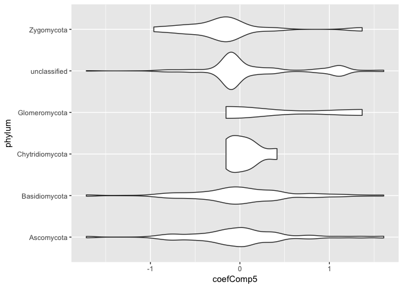
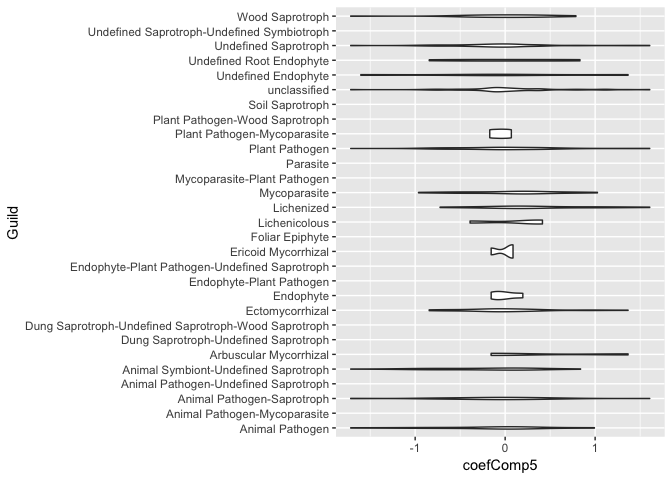
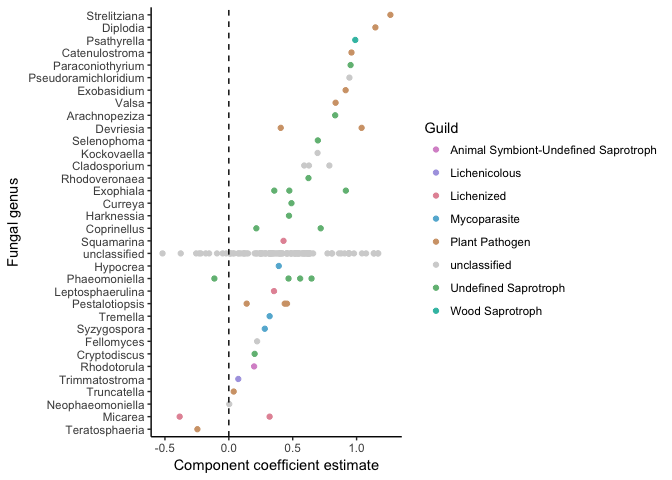

Does chemistry or community better predict mass loss?
================
Marissa Lee
10/23/2017

``` r
#chunk options
knitr::opts_chunk$set(echo = TRUE, message=FALSE, warning=FALSE)

#libraries
devtools::install_github("cornwell-lab-unsw/litterfitter")
library(dplyr)
library(ggplot2)
library(readr)
library(vegan)
library(knitr)
library(litterfitter)
library(magrittr)
library(tidyr)
library(gridExtra)
library(rioja)

#fxns
source("code/load_fxns.R")
source("code/curve_fitting_fxns.R")
source("code/distance_fxns.R")
source("code/otuIDs_fxns.R")
```

LOAD DATA
---------

### MICROBIAL COMMUNITY DATA

``` r
#stem sample meta data
#stemSamples<-load_stemSamples() #uncomment if the data changes
#write_csv(stemSamples, "derived_data/stemSamples.csv")
stemSamples<-read_csv("derived_data/stemSamples.csv")

#OTU table
#fung.otu<-load_matotu() #uncomment if the data changes
#comm.otu<-add_oomycetes(fung.otu) #add the oomycetes #uncomment if the data changes
#write.csv(comm.otu, "derived_data/comm_otu.csv")
comm.otu<-read.csv("derived_data/comm_otu.csv", row.names=1)

#create sequence sample meta data table
#seqSamples<-load_seqSamples(comm.otu, stemSamples) #uncomment if the data changes
#write_csv(seqSamples, "derived_data/seqSamples.csv")
seqSamples<-read_csv("derived_data/seqSamples.csv")

#taxon lookup info
#taxAndFunguild<-load_TaxAndFunguild(comm.otu) #uncomment if the data changes
#write_csv(taxAndFunguild, "derived_data/taxaAndFunguild.csv")
taxAndFunguild<-read_csv("derived_data/taxaAndFunguild.csv")

#plot_sampleEffortCurves(comm.otu)
```

### LOAD WOOD TRAIT DATA

``` r
#traits.mean<-mergeTraitData() #uncomment if the data changes
#write_csv(traits.mean, "derived_data/traits_mean.csv") 
traits.mean<-read_csv("derived_data/traits_mean.csv")
#missing data
#traits.long<-as.data.frame(gather(traits.mean, key=trait, value=value, -(1:3)))
#filter(traits.long, is.na(value))


### LOAD MASS LOSS DATA and CALCULATE % MASS REMAINING AT EACH TIMEPOINT
#initial_mass <- read_in_initial_mass() #uncomment if the data changes
#harvest_mass<-LoadHarvestFiles()
#mass.data<-bind_rows(initial_mass, harvest_mass)
#missing data
#mass.data %>% filter(is.na(totalSampleDryMass))
#plotting_df<-Calc_massRemaining(mass.data)
#matching failures
# plotting_df %>%
#   filter(is.na(pmr)) %>%
#   select(unique, species, size, time, totalSampleDryMass, notes) %>%
#   spread(key=time, value=totalSampleDryMass)
#remove NAs
#plotting_df %>% filter(!is.na(pmr)) -> plotting_df
#write_csv(plotting_df,"derived_data/plotting_df.csv")
plotting_df<-read_csv("derived_data/plotting_df.csv")

### CALCULATE DECAY TRAJECTORY FITS
#spdf <- fit_all_curves(plotting_df) #this recalculates all the curve fits, uncomment if the data changes
#indx<-select(stemSamples, code, species, size)
#spdf<-left_join(spdf, indx) #add code
#write_csv(spdf,"derived_data/mass_loss_parameters.csv")
spdf <- read_csv("derived_data/mass_loss_parameters.csv")
# ggplot(spdf,aes(x=t70,y=w.t70,col=size))+
#   geom_point()+
#   labs(x="Time to 30% mass loss (negative exponential)", 
#        y="Time to 30% mass loss (Weibull)")+
#   geom_abline(slope=1,intercept=0,linetype="dashed")+theme_bw()
```

Wood traits as a preditor
-------------------------

*Hyp:* Variation in wood traits will lead to differences in decay model fit (r2), rate (k), and lagginess (alpha). Specifically, we expect samples with (a) high waterperc, (b) low density and C, (c) high P, K, Ca, Mn, Fe, Zn, and N, and (d) thicker bark (potential mech: limiting microbial colonization) to have better-fiting decay models (r2), faster decay rates (k), and less lagginess (alpha).

### Result:

-   r2... greater water content and less C leads to better-fitting decay models

``` r
summary(mod.select.r) # waterperc, C
```

    ## 
    ## Call:
    ## lm(formula = ne.r2 ~ waterperc + density + Ca + Zn + N + C, data = spdf.traits)
    ## 
    ## Residuals:
    ##       Min        1Q    Median        3Q       Max 
    ## -0.114210 -0.028023  0.002322  0.020871  0.130728 
    ## 
    ## Coefficients:
    ##               Estimate Std. Error t value Pr(>|t|)   
    ## (Intercept)  2.281e+00  6.639e-01   3.435  0.00208 **
    ## waterperc    1.259e-03  5.255e-04   2.396  0.02436 * 
    ## density     -3.890e-01  2.168e-01  -1.795  0.08482 . 
    ## Ca          -1.076e-05  6.639e-06  -1.620  0.11778   
    ## Zn           1.018e-03  5.644e-04   1.804  0.08322 . 
    ## N            1.075e-01  6.944e-02   1.548  0.13429   
    ## C           -2.826e-02  1.194e-02  -2.367  0.02597 * 
    ## ---
    ## Signif. codes:  0 '***' 0.001 '**' 0.01 '*' 0.05 '.' 0.1 ' ' 1
    ## 
    ## Residual standard error: 0.06322 on 25 degrees of freedom
    ## Multiple R-squared:  0.5567, Adjusted R-squared:  0.4503 
    ## F-statistic: 5.233 on 6 and 25 DF,  p-value: 0.001308

``` r
#ggplot(spdf.traits, aes(x=waterperc, y=ne.r2, color=species, shape=size)) + geom_point()
```

-   k... small size stems, greater water content, thinner bark, less Ca, more Zn, and more N lead to faster decay

NOTE from Will: Density explains the same part of the variation in decay rates that initial water content does, only less well. (In other words, although, density gets dropped from the best model by the model selection procedure, if we remove initial water from consideration entirely, density is included in the model as the best predictor.)

So my current interpretation is that wood water rentention--related to fiber saturation point and partially captured by the density measurement--has a strong effect on long-term decomposition rates, possibly by maintaining fungal activity further into dry periods. There is also a very likely interaction between this water retention capacity with the fungal community (see results in Setting the Stage paper, Lee et al. in review).

``` r
summary(mod.select.k) # size, waterperc, barkthick, Ca, Zn, N
```

    ## 
    ## Call:
    ## lm(formula = k ~ size + waterperc + barkthick + Ca + Zn + N, 
    ##     data = spdf.traits)
    ## 
    ## Residuals:
    ##       Min        1Q    Median        3Q       Max 
    ## -0.096623 -0.031284  0.000335  0.026856  0.095457 
    ## 
    ## Coefficients:
    ##               Estimate Std. Error t value Pr(>|t|)    
    ## (Intercept)  2.820e-02  5.248e-02   0.537 0.595799    
    ## sizesmall    1.063e-01  2.397e-02   4.434 0.000162 ***
    ## waterperc    2.473e-03  3.735e-04   6.621 6.16e-07 ***
    ## barkthick   -3.267e-02  1.293e-02  -2.528 0.018169 *  
    ## Ca          -1.522e-05  5.661e-06  -2.688 0.012609 *  
    ## Zn           1.776e-03  4.799e-04   3.702 0.001060 ** 
    ## N            1.780e-01  7.479e-02   2.380 0.025245 *  
    ## ---
    ## Signif. codes:  0 '***' 0.001 '**' 0.01 '*' 0.05 '.' 0.1 ' ' 1
    ## 
    ## Residual standard error: 0.05403 on 25 degrees of freedom
    ## Multiple R-squared:  0.7422, Adjusted R-squared:  0.6804 
    ## F-statistic:    12 on 6 and 25 DF,  p-value: 2.478e-06

``` r
ggplot(spdf.traits, aes(x=waterperc, y=k)) + geom_point(aes(color=species)) + facet_grid(~size) +
  labs(y="k year^-1",x="Water content (%DM)")+geom_smooth(method="lm",se=FALSE)+theme_bw()
```


``` r
ggplot(spdf.traits, aes(x=density, y=k)) + geom_point(aes(color=species)) + facet_grid(~size) +
  labs(y="k year^-1",x="Initial density (g/cm^3)")+geom_smooth(method="lm",se=FALSE)+theme_bw()
```


``` r
#ggplot(spdf.traits, aes(x=waterperc, y=density, color=species, size=k)) + geom_point() + facet_grid(~size)
```

-   t70... large size stems, less water content, more Ca, and less Zn lead to longer wood "70%"-lives

``` r
summary(mod.select.t70) # size, waterperc, barkthick, Ca, Zn
```

    ## 
    ## Call:
    ## lm(formula = t70 ~ size + waterperc + density + Ca + Zn + N + 
    ##     C, data = spdf.traits)
    ## 
    ## Residuals:
    ##      Min       1Q   Median       3Q      Max 
    ## -0.57355 -0.15506  0.00525  0.10205  0.62523 
    ## 
    ## Coefficients:
    ##               Estimate Std. Error t value Pr(>|t|)    
    ## (Intercept) -2.829e+00  3.470e+00  -0.815 0.422926    
    ## sizesmall   -6.515e-01  1.355e-01  -4.810 6.74e-05 ***
    ## waterperc   -1.095e-02  2.801e-03  -3.911 0.000660 ***
    ## density      1.535e+00  1.064e+00   1.442 0.162176    
    ## Ca           1.203e-04  3.159e-05   3.809 0.000853 ***
    ## Zn          -6.681e-03  2.654e-03  -2.517 0.018911 *  
    ## N           -4.845e-01  3.370e-01  -1.438 0.163472    
    ## C            9.076e-02  6.046e-02   1.501 0.146382    
    ## ---
    ## Signif. codes:  0 '***' 0.001 '**' 0.01 '*' 0.05 '.' 0.1 ' ' 1
    ## 
    ## Residual standard error: 0.2973 on 24 degrees of freedom
    ## Multiple R-squared:  0.7544, Adjusted R-squared:  0.6828 
    ## F-statistic: 10.53 on 7 and 24 DF,  p-value: 5.323e-06

``` r
#ggplot(spdf.traits, aes(x=waterperc, y=t70, color=species, size=density)) + geom_point() + facet_grid(~size)
```

-   alpha--- note: don't interpret yet

``` r
summary(mod.select.alpha) # density, Zn, C
```

    ## 
    ## Call:
    ## lm(formula = alpha ~ density + barkthick + P + K + Ca + Fe + 
    ##     Zn + N + C, data = spdf.traits)
    ## 
    ## Residuals:
    ##      Min       1Q   Median       3Q      Max 
    ## -0.28961 -0.10507  0.01239  0.05847  0.37028 
    ## 
    ## Coefficients:
    ##               Estimate Std. Error t value Pr(>|t|)  
    ## (Intercept)  6.978e+00  2.515e+00   2.774   0.0111 *
    ## density     -1.550e+00  5.595e-01  -2.770   0.0112 *
    ## barkthick   -8.276e-02  5.373e-02  -1.540   0.1377  
    ## P           -7.629e-04  5.649e-04  -1.350   0.1906  
    ## K            6.411e-05  4.567e-05   1.404   0.1743  
    ## Ca          -4.290e-05  2.474e-05  -1.735   0.0968 .
    ## Fe          -3.027e-05  2.051e-05  -1.475   0.1543  
    ## Zn           4.064e-03  1.897e-03   2.143   0.0435 *
    ## N            3.470e-01  2.794e-01   1.242   0.2274  
    ## C           -9.831e-02  4.674e-02  -2.103   0.0471 *
    ## ---
    ## Signif. codes:  0 '***' 0.001 '**' 0.01 '*' 0.05 '.' 0.1 ' ' 1
    ## 
    ## Residual standard error: 0.1989 on 22 degrees of freedom
    ## Multiple R-squared:  0.6067, Adjusted R-squared:  0.4458 
    ## F-statistic: 3.771 on 9 and 22 DF,  p-value: 0.005306

Community as a predictor
------------------------

*Hyp:* Average initial microbial communitiy compositions will predict variation in decay model fit (r2), rate (k), and lagginess (alpha).

### Result:

-r2... none of the community components are significant predictors

``` r
rand.t.test(fit.r2.cv)
```

    ##             RMSE           R2    Avg.Bias  Max.Bias     Skill  delta.RMSE
    ## Comp01 0.1013107 1.494708e-05 0.002024841 0.2609272 -40.32548 18.45905577
    ## Comp02 0.1104027 4.293834e-03 0.003308000 0.2568255 -66.64251  8.97443525
    ## Comp03 0.1114560 1.027904e-02 0.003371373 0.2497766 -69.83735  0.95404167
    ## Comp04 0.1119467 1.116217e-02 0.002666967 0.2514263 -71.33590  0.44020287
    ## Comp05 0.1120426 1.133987e-02 0.002626418 0.2509619 -71.62965  0.08568655
    ##            p
    ## Comp01 0.883
    ## Comp02 1.000
    ## Comp03 0.711
    ## Comp04 0.817
    ## Comp05 0.710

-k... none of the community components are significant predictors

``` r
rand.t.test(fit.k.cv)
```

    ##              RMSE         R2    Avg.Bias  Max.Bias       Skill  delta.RMSE
    ## Comp01 0.09353450 0.05958082 0.001951813 0.2601135  -0.1449817  0.07246458
    ## Comp02 0.09959658 0.02582616 0.003520065 0.2696231 -13.5466706  6.48111904
    ## Comp03 0.10066062 0.01731354 0.003984269 0.2727955 -15.9857851  1.06835125
    ## Comp04 0.10059285 0.01921425 0.003727121 0.2728401 -15.8296569 -0.06732756
    ## Comp05 0.10067798 0.01871320 0.003714864 0.2731036 -16.0257809  0.08462470
    ##            p
    ## Comp01 0.513
    ## Comp02 0.997
    ## Comp03 0.892
    ## Comp04 0.435
    ## Comp05 0.673

-t70... none of the community components are significant predictors

``` r
rand.t.test(fit.t70.cv)
```

    ##             RMSE         R2     Avg.Bias Max.Bias      Skill delta.RMSE
    ## Comp01 0.5177469 0.07292880  0.001366029 1.280885  -0.374932 0.18729060
    ## Comp02 0.5561297 0.03410409 -0.004221057 1.345871 -15.809047 7.41343680
    ## Comp03 0.5635152 0.02574998 -0.006493032 1.393380 -18.905395 1.32801513
    ## Comp04 0.5636628 0.02712522 -0.005167941 1.382455 -18.967696 0.02619417
    ## Comp05 0.5637798 0.02665069 -0.004978126 1.383710 -19.017097 0.02076028
    ##            p
    ## Comp01 0.501
    ## Comp02 1.000
    ## Comp03 0.878
    ## Comp04 0.548
    ## Comp05 0.511

-alpha --- note: don't interpret yet

``` r
rand.t.test(fit.alpha.cv)
```

    ##             RMSE         R2     Avg.Bias  Max.Bias     Skill delta.RMSE
    ## Comp01 0.2727951 0.02525264 -0.001168419 0.7257063 -10.84578 5.28332258
    ## Comp02 0.2801004 0.02756209  0.003844952 0.7085096 -16.86204 2.67793965
    ## Comp03 0.2845994 0.01564889  0.007017112 0.7064607 -20.64626 1.60620079
    ## Comp04 0.2866664 0.01260590  0.005775351 0.7015749 -22.40512 0.72629298
    ## Comp05 0.2869146 0.01259244  0.006101055 0.7009235 -22.61720 0.08659388
    ##            p
    ## Comp01 0.696
    ## Comp02 0.865
    ## Comp03 0.940
    ## Comp04 0.894
    ## Comp05 0.601

Community+traits as a predictor
-------------------------------

``` r
#run rioja::WAPLS on wood trait residuals

#make sure that the residuals and community dataframes are aligned
trait.residuals$code<-as.character(trait.residuals$code)
trait.residuals[!trait.residuals$code %in% row.names(meanOTUabund.trim),"code"] # no missing from meanOTUabund.trim
```

    ## character(0)

``` r
row.names(meanOTUabund.trim)[!row.names(meanOTUabund.trim) %in% trait.residuals$code] #missing olst from trait.residuals
```

    ## [1] "olst"

``` r
trait.residuals.trim<-trait.residuals[trait.residuals$code %in% row.names(meanOTUabund.trim),] #trim
meanOTUabund.trim2<-meanOTUabund.trim[row.names(meanOTUabund.trim) %in% trait.residuals.trim$code,] #trim
ord<-match(row.names(meanOTUabund.trim2), trait.residuals.trim$code)
trait.residuals.trim.o<-trait.residuals.trim[ord,]
sum(trait.residuals.trim.o$code != row.names(meanOTUabund.trim2)) #this needs to by 0
```

    ## [1] 0

``` r
#get rid of empty OTU cols
sum(colSums(meanOTUabund.trim2)!=0)
```

    ## [1] 3744

``` r
meanOTUabund.trim2<-meanOTUabund.trim2[,colSums(meanOTUabund.trim2)!=0]

#fit models
fit.tr.r2 <- WAPLS(meanOTUabund.trim2, trait.residuals.trim.o$r2.resid)
fit.tr.k <- WAPLS(meanOTUabund.trim2, trait.residuals.trim.o$k.resid)
fit.tr.t70 <- WAPLS(meanOTUabund.trim2, trait.residuals.trim.o$t70.resid)
fit.tr.alpha <- WAPLS(meanOTUabund.trim2, trait.residuals.trim.o$alpha.resid)

#cross-validate models using the leave-one-out method
fit.tr.r2.cv <- crossval(fit.tr.r2, cv.method="loo")
```

    ## Cross-validating:
    ## 
      |                                                                       
      |                                                                 |   0%
      |                                                                       
      |==                                                               |   3%
      |                                                                       
      |====                                                             |   6%
      |                                                                       
      |======                                                           |   9%
      |                                                                       
      |========                                                         |  12%
      |                                                                       
      |==========                                                       |  16%
      |                                                                       
      |============                                                     |  19%
      |                                                                       
      |==============                                                   |  22%
      |                                                                       
      |================                                                 |  25%
      |                                                                       
      |==================                                               |  28%
      |                                                                       
      |====================                                             |  31%
      |                                                                       
      |======================                                           |  34%
      |                                                                       
      |========================                                         |  38%
      |                                                                       
      |==========================                                       |  41%
      |                                                                       
      |============================                                     |  44%
      |                                                                       
      |==============================                                   |  47%
      |                                                                       
      |================================                                 |  50%
      |                                                                       
      |===================================                              |  53%
      |                                                                       
      |=====================================                            |  56%
      |                                                                       
      |=======================================                          |  59%
      |                                                                       
      |=========================================                        |  62%
      |                                                                       
      |===========================================                      |  66%
      |                                                                       
      |=============================================                    |  69%
      |                                                                       
      |===============================================                  |  72%
      |                                                                       
      |=================================================                |  75%
      |                                                                       
      |===================================================              |  78%
      |                                                                       
      |=====================================================            |  81%
      |                                                                       
      |=======================================================          |  84%
      |                                                                       
      |=========================================================        |  88%
      |                                                                       
      |===========================================================      |  91%
      |                                                                       
      |=============================================================    |  94%
      |                                                                       
      |===============================================================  |  97%
      |                                                                       
      |=================================================================| 100%

``` r
fit.tr.k.cv <- crossval(fit.tr.k, cv.method="loo")
```

    ## Cross-validating:
    ## 
      |                                                                       
      |                                                                 |   0%
      |                                                                       
      |==                                                               |   3%
      |                                                                       
      |====                                                             |   6%
      |                                                                       
      |======                                                           |   9%
      |                                                                       
      |========                                                         |  12%
      |                                                                       
      |==========                                                       |  16%
      |                                                                       
      |============                                                     |  19%
      |                                                                       
      |==============                                                   |  22%
      |                                                                       
      |================                                                 |  25%
      |                                                                       
      |==================                                               |  28%
      |                                                                       
      |====================                                             |  31%
      |                                                                       
      |======================                                           |  34%
      |                                                                       
      |========================                                         |  38%
      |                                                                       
      |==========================                                       |  41%
      |                                                                       
      |============================                                     |  44%
      |                                                                       
      |==============================                                   |  47%
      |                                                                       
      |================================                                 |  50%
      |                                                                       
      |===================================                              |  53%
      |                                                                       
      |=====================================                            |  56%
      |                                                                       
      |=======================================                          |  59%
      |                                                                       
      |=========================================                        |  62%
      |                                                                       
      |===========================================                      |  66%
      |                                                                       
      |=============================================                    |  69%
      |                                                                       
      |===============================================                  |  72%
      |                                                                       
      |=================================================                |  75%
      |                                                                       
      |===================================================              |  78%
      |                                                                       
      |=====================================================            |  81%
      |                                                                       
      |=======================================================          |  84%
      |                                                                       
      |=========================================================        |  88%
      |                                                                       
      |===========================================================      |  91%
      |                                                                       
      |=============================================================    |  94%
      |                                                                       
      |===============================================================  |  97%
      |                                                                       
      |=================================================================| 100%

``` r
fit.tr.t70.cv <- crossval(fit.tr.t70, cv.method="loo")
```

    ## Cross-validating:
    ## 
      |                                                                       
      |                                                                 |   0%
      |                                                                       
      |==                                                               |   3%
      |                                                                       
      |====                                                             |   6%
      |                                                                       
      |======                                                           |   9%
      |                                                                       
      |========                                                         |  12%
      |                                                                       
      |==========                                                       |  16%
      |                                                                       
      |============                                                     |  19%
      |                                                                       
      |==============                                                   |  22%
      |                                                                       
      |================                                                 |  25%
      |                                                                       
      |==================                                               |  28%
      |                                                                       
      |====================                                             |  31%
      |                                                                       
      |======================                                           |  34%
      |                                                                       
      |========================                                         |  38%
      |                                                                       
      |==========================                                       |  41%
      |                                                                       
      |============================                                     |  44%
      |                                                                       
      |==============================                                   |  47%
      |                                                                       
      |================================                                 |  50%
      |                                                                       
      |===================================                              |  53%
      |                                                                       
      |=====================================                            |  56%
      |                                                                       
      |=======================================                          |  59%
      |                                                                       
      |=========================================                        |  62%
      |                                                                       
      |===========================================                      |  66%
      |                                                                       
      |=============================================                    |  69%
      |                                                                       
      |===============================================                  |  72%
      |                                                                       
      |=================================================                |  75%
      |                                                                       
      |===================================================              |  78%
      |                                                                       
      |=====================================================            |  81%
      |                                                                       
      |=======================================================          |  84%
      |                                                                       
      |=========================================================        |  88%
      |                                                                       
      |===========================================================      |  91%
      |                                                                       
      |=============================================================    |  94%
      |                                                                       
      |===============================================================  |  97%
      |                                                                       
      |=================================================================| 100%

``` r
fit.tr.alpha.cv <- crossval(fit.tr.alpha, cv.method="loo")
```

    ## Cross-validating:
    ## 
      |                                                                       
      |                                                                 |   0%
      |                                                                       
      |==                                                               |   3%
      |                                                                       
      |====                                                             |   6%
      |                                                                       
      |======                                                           |   9%
      |                                                                       
      |========                                                         |  12%
      |                                                                       
      |==========                                                       |  16%
      |                                                                       
      |============                                                     |  19%
      |                                                                       
      |==============                                                   |  22%
      |                                                                       
      |================                                                 |  25%
      |                                                                       
      |==================                                               |  28%
      |                                                                       
      |====================                                             |  31%
      |                                                                       
      |======================                                           |  34%
      |                                                                       
      |========================                                         |  38%
      |                                                                       
      |==========================                                       |  41%
      |                                                                       
      |============================                                     |  44%
      |                                                                       
      |==============================                                   |  47%
      |                                                                       
      |================================                                 |  50%
      |                                                                       
      |===================================                              |  53%
      |                                                                       
      |=====================================                            |  56%
      |                                                                       
      |=======================================                          |  59%
      |                                                                       
      |=========================================                        |  62%
      |                                                                       
      |===========================================                      |  66%
      |                                                                       
      |=============================================                    |  69%
      |                                                                       
      |===============================================                  |  72%
      |                                                                       
      |=================================================                |  75%
      |                                                                       
      |===================================================              |  78%
      |                                                                       
      |=====================================================            |  81%
      |                                                                       
      |=======================================================          |  84%
      |                                                                       
      |=========================================================        |  88%
      |                                                                       
      |===========================================================      |  91%
      |                                                                       
      |=============================================================    |  94%
      |                                                                       
      |===============================================================  |  97%
      |                                                                       
      |=================================================================| 100%

``` r
#rand.t.test(fit.alpha.cv) #perform randomization t-test to test the significance of a cross-validated model
#screeplot(fit.r2.cv)
```

### Result:

-r2... Comp05 is marginally significant

``` r
rand.t.test(fit.tr.r2.cv)
```

    ##              RMSE         R2     Avg.Bias  Max.Bias     Skill delta.RMSE
    ## Comp01 0.06952334 0.04633832 -0.005169470 0.1580775 -54.77500 24.4085990
    ## Comp02 0.07597962 0.10030564 -0.005194202 0.1720167 -84.85607  9.2864852
    ## Comp03 0.07717158 0.13269801 -0.005592800 0.1730916 -90.70155  1.5687835
    ## Comp04 0.07694803 0.12796669 -0.005192814 0.1716292 -89.59834 -0.2896689
    ## Comp05 0.07673100 0.12846683 -0.005084413 0.1710718 -88.53032 -0.2820507
    ##            p
    ## Comp01 0.993
    ## Comp02 0.998
    ## Comp03 0.941
    ## Comp04 0.259
    ## Comp05 0.054

-k... none of the community components are significant predictors

``` r
rand.t.test(fit.tr.k.cv)
```

    ##              RMSE           R2      Avg.Bias   Max.Bias     Skill
    ## Comp01 0.05514237 0.0055276764  2.318954e-04 0.09780228 -33.31336
    ## Comp02 0.05398518 0.0014710249  4.879796e-05 0.09659541 -27.77680
    ## Comp03 0.05433608 0.0001857182 -1.118391e-04 0.09656452 -29.44326
    ## Comp04 0.05424379 0.0001516607 -1.291504e-04 0.09673385 -29.00391
    ## Comp05 0.05419195 0.0001758077 -9.152507e-05 0.09664655 -28.75748
    ##         delta.RMSE     p
    ## Comp01 15.46140470 0.988
    ## Comp02 -2.09854138 0.212
    ## Comp03  0.64998516 0.855
    ## Comp04 -0.16985185 0.255
    ## Comp05 -0.09555685 0.255

-t70... Comp05 is a significant predictor

``` r
rand.t.test(fit.tr.t70.cv) 
```

    ##             RMSE         R2   Avg.Bias  Max.Bias     Skill delta.RMSE
    ## Comp01 0.2814481 0.01103431 0.00979211 0.6844031 -19.45536  9.2956355
    ## Comp02 0.2823397 0.02016488 0.02064949 0.7181450 -20.21339  0.3167839
    ## Comp03 0.2835892 0.01783057 0.02080697 0.7217659 -21.27976  0.4425549
    ## Comp04 0.2831097 0.01858274 0.02099462 0.7177034 -20.87005 -0.1690574
    ## Comp05 0.2825731 0.01927497 0.02080095 0.7183378 -20.41223 -0.1895623
    ##            p
    ## Comp01 0.842
    ## Comp02 0.560
    ## Comp03 0.756
    ## Comp04 0.273
    ## Comp05 0.049

-alpha --- note: don't interpret yet

``` r
rand.t.test(fit.tr.alpha.cv)
```

    ##             RMSE          R2    Avg.Bias  Max.Bias     Skill delta.RMSE
    ## Comp01 0.1898628 0.003951823 -0.01449037 0.3991946 -32.51782 15.1163855
    ## Comp02 0.2027442 0.011228156 -0.01338738 0.4271724 -51.10947  6.7846166
    ## Comp03 0.2061391 0.017990710 -0.01584032 0.4289071 -56.21240  1.6744701
    ## Comp04 0.2067854 0.020289417 -0.01554990 0.4267151 -57.19334  0.3134854
    ## Comp05 0.2063872 0.020076149 -0.01537752 0.4273147 -56.58859 -0.1925460
    ##            p
    ## Comp01 0.913
    ## Comp02 0.972
    ## Comp03 0.909
    ## Comp04 0.850
    ## Comp05 0.135

Investigate the biology underlying t70-associated coefs for Comp05

``` r
coef.comp5<-fit.tr.t70.cv$coefficients[,'Comp05']
coef.comp5.df<-data.frame(OTUId=names(coef.comp5), coefComp5=coef.comp5)

#create df of OTU taxon and guild info matched with coef value
coef.comp5.df %>%
  left_join(taxAndFunguild) -> coef.comp5.ann
```

By trophic mode (note that apparently empty cateogies have at least 1 data point, the violin plot just doesn't show it)

``` r
ggplot(coef.comp5.ann, aes(x=Trophic.Mode, y=coefComp5)) + geom_violin() + coord_flip()
```

 By guild (note that apparently empty cateogies have at least 1 data point, the violin plot just doesn't show it)

``` r
ggplot(coef.comp5.ann, aes(x=Guild, y=coefComp5)) + geom_violin() + coord_flip()
```

 By phylum

``` r
ggplot(coef.comp5.ann, aes(x=phylum, y=coefComp5)) + geom_violin() + coord_flip()
```



Diversity (and diversity of specific clades) as a predictor
-----------------------------------------------------------

Plot richness of key players vs decay param distances BETWEEN species+size

``` r
# summarize the presence of ... in each sample
sapro.df<-Calc_richOTUtype(colNam="Trophic.Mode", grepTerm="Sapro", taxAndFunguild, comm.otu)  
sapList<-Plot_richOTUtype(otutype.df=sapro.df, 
                        valueCol_vec=c("ne.r2", "k","alpha"), 
                        otutypeNam="Saprotroph", spdf)

basidio.df<-Calc_richOTUtype(colNam="phylum", grepTerm="Basid", taxAndFunguild, comm.otu)
basidList<-Plot_richOTUtype(otutype.df=basidio.df, 
                        valueCol_vec=c("ne.r2", "k","alpha"), 
                        otutypeNam="Basidio", spdf)

path.df<-Calc_richOTUtype(colNam="Trophic.Mode", grepTerm="Patho", taxAndFunguild, comm.otu)
pathList<-Plot_richOTUtype(otutype.df=path.df, 
                        valueCol_vec=c("ne.r2", "k","alpha"), 
                        otutypeNam="Pathogen", spdf)

oomy.df<-Calc_richOTUtype(colNam="kingdom", grepTerm="Protist", taxAndFunguild, comm.otu)
ooList<-Plot_richOTUtype(otutype.df=oomy.df, 
                        valueCol_vec=c("ne.r2", "k","alpha"), 
                        otutypeNam="Oomycete", spdf)

#plot
grid.arrange(sapList[['ne.r2']] + guides(color=FALSE, shape=FALSE), 
             sapList[['k']] + guides(color=FALSE, shape=FALSE), 
             sapList[['alpha']] + guides(color=FALSE, shape=FALSE),
             
             basidList[['ne.r2']] + guides(color=FALSE, shape=FALSE), 
             basidList[['k']] + guides(color=FALSE, shape=FALSE), 
             basidList[['alpha']] + guides(color=FALSE, shape=FALSE),
             
             pathList[['ne.r2']] + guides(color=FALSE, shape=FALSE), 
             pathList[['k']] + guides(color=FALSE, shape=FALSE), 
             pathList[['alpha']] + guides(color=FALSE, shape=FALSE),
             
             ooList[['ne.r2']] + guides(color=FALSE, shape=FALSE), 
             ooList[['k']] + guides(color=FALSE, shape=FALSE), 
             ooList[['alpha']] + guides(color=FALSE, shape=FALSE),
             
             ncol=3)
```


*Hyp:* Greater saprotroph and basidiomycete richness will lead to better-fitting decay models (ne.r2), faster decay (k), and less lagginess (alpha) because the community does not need to wait for the arrival of key decayers to act on the wood substrate.
Hyp-Alt: Greater saprotroph and basidiomycete richness will lead to worse-fitting decay models (ne.r2), slower decay (k), and more lagginess (alpha) because decayers will be allocating more of their resources to combat one another. **No apparent pattern**

*Hyp:* Greater pathogen and oomycete richness will lead to worse-fitting decay models (ne.r2), slower decay (k), and more lagginess (alpha) because the presence of these organisms will inhibit the establishment and activity of decayers. **Maybe there's some indicaiton that oomycete presence increases the likelihood of slower (k) and more laggy (alpha) decay**

### Left off here

1.  Diversity plus traits as a predictor

############################################## 

Extra pieces
============

1.  *code/testing\_time\_zero.Rmd* -- Including t=0 points to fit decay model affects the liklihood and the model selection criteria, but the curve fits are identical with this formulation. Excluding the t=0 fits has an effect of prefering simpler models, which is the same effect as increasing the penalty for model complexity.

2.  *code/initialDist\_vs\_decayDist\_btwCode.Rmd* -- No apparent relationship between species+size dissimilarities in initial microbial community composition (bray and jaccard) and decay trajectory params

3.  *code/boralOTUpairs\_vs\_decay.Rmd* -- No apparent relationship between frequency of boral-ID'd positively/negatively correlated OTU pairs and decay params

4.  *code/withinInitialDist\_vs\_decayR2.Rmd* -- No apparent relationship between initial microbial diversity WITHIN species+size and decay model R2
