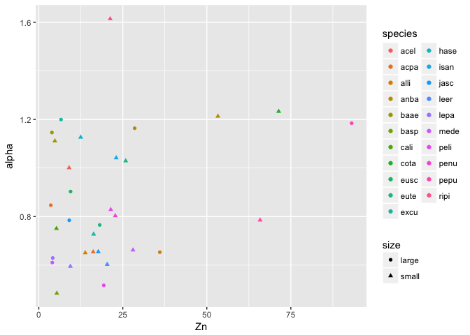

Does chemistry or community better predict mass loss?
================
Marissa Lee
10/23/2017

``` r
#chunk options
knitr::opts_chunk$set(echo = TRUE, message=FALSE, warning=FALSE)

#libraries
devtools::install_github("cornwell-lab-unsw/litterfitter")
library(dplyr)
library(ggplot2)
library(readr)
library(vegan)
library(knitr)
library(litterfitter)
library(magrittr)
library(tidyr)
library(gridExtra)

#fxns
source("code/load_fxns.R")
source("code/curve_fitting_fxns.R")
source("code/distance_fxns.R")
source("code/otuIDs_fxns.R")


### LOAD MICROBIAL COMMUNITY DATA

#stem sample meta data
#stemSamples<-load_stemSamples() #uncomment if the data changes
#write_csv(stemSamples, "derived_data/stemSamples.csv")
stemSamples<-read_csv("derived_data/stemSamples.csv")

#OTU table
#fung.otu<-load_matotu() #uncomment if the data changes
#comm.otu<-add_oomycetes(fung.otu) #add the oomycetes #uncomment if the data changes
#write.csv(comm.otu, "derived_data/comm_otu.csv")
comm.otu<-read.csv("derived_data/comm_otu.csv", row.names=1)

#create sequence sample meta data table
#seqSamples<-load_seqSamples(comm.otu, stemSamples) #uncomment if the data changes
#write_csv(seqSamples, "derived_data/seqSamples.csv")
seqSamples<-read_csv("derived_data/seqSamples.csv")

#taxon lookup info
#taxAndFunguild<-load_TaxAndFunguild(comm.otu) #uncomment if the data changes
#write_csv(taxAndFunguild, "derived_data/taxaAndFunguild.csv")
taxAndFunguild<-read_csv("derived_data/taxaAndFunguild.csv")

#plot_sampleEffortCurves(comm.otu)


### LOAD WOOD TRAIT DATA
#traits.mean<-mergeTraitData() #uncomment if the data changes
#write_csv(traits.mean, "derived_data/traits_mean.csv") 
traits.mean<-read_csv("derived_data/traits_mean.csv")
#missing data
#traits.long<-as.data.frame(gather(traits.mean, key=trait, value=value, -(1:3)))
#filter(traits.long, is.na(value))


### LOAD MASS LOSS DATA and CALCULATE % MASS REMAINING AT EACH TIMEPOINT
#initial_mass <- read_in_initial_mass() #uncomment if the data changes
#harvest_mass<-LoadHarvestFiles()
#mass.data<-bind_rows(initial_mass, harvest_mass)
#missing data
#mass.data %>% filter(is.na(totalSampleDryMass))
#plotting_df<-Calc_massRemaining(mass.data)
#matching failures
# plotting_df %>%
#   filter(is.na(pmr)) %>%
#   select(unique, species, size, time, totalSampleDryMass, notes) %>%
#   spread(key=time, value=totalSampleDryMass)
#remove NAs
#plotting_df %>% filter(!is.na(pmr)) -> plotting_df
#write_csv(plotting_df,"derived_data/plotting_df.csv")
plotting_df<-read_csv("derived_data/plotting_df.csv")
```

    ## Warning in rbind(names(probs), probs_f): number of columns of result is not
    ## a multiple of vector length (arg 1)

    ## Warning: 810 parsing failures.
    ## row # A tibble: 5 x 5 col     row   col               expected            actual expected   <int> <chr>                  <chr>             <chr> actual 1  1317   pmr no trailing characters .6870983172138487 file 2  1318   pmr no trailing characters .6407933359183388 row 3  1319   pmr no trailing characters .7706187163172571 col 4  1320   pmr no trailing characters .7300713441051903 expected 5  1321   pmr no trailing characters .6224821689919369 actual # ... with 1 more variables: file <chr>
    ## ... ................. ... ...................................................... ........ ...................................................... ...... ...................................................... .... ...................................................... ... ...................................................... ... ...................................................... ........ ...................................................... ...... .......................................
    ## See problems(...) for more details.

``` r
### CALCULATE DECAY TRAJECTORY FITS
#spdf <- fit_all_curves(plotting_df) #this recalculates all the curve fits, uncomment if the data changes
#indx<-select(stemSamples, code, species, size)
#spdf<-left_join(spdf, indx) #add code
#write_csv(spdf,"derived_data/mass_loss_parameters.csv")
spdf <- read_csv("derived_data/mass_loss_parameters.csv")
# ggplot(spdf,aes(x=t70,y=w.t70,col=size))+
#   geom_point()+
#   labs(x="Time to 30% mass loss (negative exponential)", 
#        y="Time to 30% mass loss (Weibull)")+
#   geom_abline(slope=1,intercept=0,linetype="dashed")+theme_bw()
```

1.  Wood traits as a preditor *Hyp:* Variation in wood traits will lead to differences in decay model fit (r2), rate (k), and lagginess (alpha). Specifically, we expect samples with (a) high waterperc, (b) low density and C, (c) high P, K, Ca, Mn, Fe, Zn, and N, and (d) thicker bark (potential mech: limiting microbial colonization) to have better-fiting decay models (r2), faster decay rates (k), and less lagginess (alpha).

``` r
#scale traits
traits.mean %>%
  select(waterperc, density, barkthick, P, K, Ca, Mn, Fe, Zn, N, C, code) ->pred

#merge into 1 df
spdf %>%
  select(code, species, size, ne.r2, k, w.t70,t70,alpha) %>%
  left_join(pred) %>% #  bind_cols(pred) %>%
  filter(!is.na(P)) %>%
  filter(!is.na(waterperc)) -> spdf.traits

#fit full models
mod.full.r<-lm(ne.r2 ~ size + waterperc + density + barkthick + P + K + Ca + Mn + Fe + Zn + N + C, data=spdf.traits)
mod.full.k<-lm(k ~ size + waterperc + density + barkthick + P + K + Ca + Mn + Fe + Zn + N + C, data=spdf.traits)
mod.full.alpha<-lm(alpha ~ size + waterperc + density + barkthick + P + K + Ca + Mn + Fe + Zn + N + C, data=spdf.traits)
summary(mod.full.alpha)
```

    ## 
    ## Call:
    ## lm(formula = alpha ~ size + waterperc + density + barkthick + 
    ##     P + K + Ca + Mn + Fe + Zn + N + C, data = spdf.traits)
    ## 
    ## Residuals:
    ##      Min       1Q   Median       3Q      Max 
    ## -0.28453 -0.13317  0.00524  0.07988  0.34851 
    ## 
    ## Coefficients:
    ##               Estimate Std. Error t value Pr(>|t|)  
    ## (Intercept)  6.619e+00  2.960e+00   2.236   0.0375 *
    ## sizesmall   -5.491e-02  1.380e-01  -0.398   0.6952  
    ## waterperc    5.006e-02  2.319e-01   0.216   0.8314  
    ## density     -1.388e+00  8.392e-01  -1.654   0.1147  
    ## barkthick   -9.332e-02  6.050e-02  -1.542   0.1395  
    ## P           -8.177e-04  6.205e-04  -1.318   0.2032  
    ## K            7.161e-05  5.608e-05   1.277   0.2170  
    ## Ca          -4.407e-05  2.892e-05  -1.524   0.1440  
    ## Mn          -6.519e-05  3.205e-04  -0.203   0.8410  
    ## Fe          -1.987e-05  2.790e-05  -0.712   0.4850  
    ## Zn           4.232e-03  2.053e-03   2.061   0.0532 .
    ## N            3.953e-01  3.074e-01   1.286   0.2139  
    ## C           -9.347e-02  5.192e-02  -1.800   0.0877 .
    ## ---
    ## Signif. codes:  0 '***' 0.001 '**' 0.01 '*' 0.05 '.' 0.1 ' ' 1
    ## 
    ## Residual standard error: 0.2118 on 19 degrees of freedom
    ## Multiple R-squared:  0.6149, Adjusted R-squared:  0.3717 
    ## F-statistic: 2.528 on 12 and 19 DF,  p-value: 0.03437

``` r
#do stepwise model selection
#mod.select.r<-step(mod.full.r, direction="backward")
mod.select.k<-step(mod.full.k, direction="backward")
```

    ## Start:  AIC=-174.4
    ## k ~ size + waterperc + density + barkthick + P + K + Ca + Mn + 
    ##     Fe + Zn + N + C
    ## 
    ##             Df Sum of Sq      RSS     AIC
    ## - P          1 0.0001557 0.061156 -176.32
    ## - Fe         1 0.0006691 0.061670 -176.05
    ## - K          1 0.0011613 0.062162 -175.80
    ## - Mn         1 0.0032944 0.064295 -174.72
    ## <none>                   0.061001 -174.40
    ## - barkthick  1 0.0043101 0.065311 -174.22
    ## - C          1 0.0053204 0.066321 -173.73
    ## - density    1 0.0053518 0.066352 -173.71
    ## - size       1 0.0109245 0.071925 -171.13
    ## - N          1 0.0121126 0.073113 -170.61
    ## - Ca         1 0.0248714 0.085872 -165.46
    ## - Zn         1 0.0254153 0.086416 -165.26
    ## - waterperc  1 0.0272244 0.088225 -164.59
    ## 
    ## Step:  AIC=-176.32
    ## k ~ size + waterperc + density + barkthick + K + Ca + Mn + Fe + 
    ##     Zn + N + C
    ## 
    ##             Df Sum of Sq      RSS     AIC
    ## - Fe         1 0.0008980 0.062054 -177.85
    ## - K          1 0.0014116 0.062568 -177.59
    ## - Mn         1 0.0034274 0.064584 -176.58
    ## <none>                   0.061156 -176.32
    ## - barkthick  1 0.0041797 0.065336 -176.21
    ## - density    1 0.0053563 0.066513 -175.63
    ## - C          1 0.0058365 0.066993 -175.41
    ## - size       1 0.0107843 0.071941 -173.12
    ## - N          1 0.0119611 0.073118 -172.61
    ## - Zn         1 0.0253242 0.086481 -167.23
    ## - Ca         1 0.0254152 0.086572 -167.20
    ## - waterperc  1 0.0285572 0.089714 -166.06
    ## 
    ## Step:  AIC=-177.86
    ## k ~ size + waterperc + density + barkthick + K + Ca + Mn + Zn + 
    ##     N + C
    ## 
    ##             Df Sum of Sq      RSS     AIC
    ## - K          1 0.0012688 0.063323 -179.21
    ## - Mn         1 0.0034572 0.065512 -178.12
    ## <none>                   0.062054 -177.85
    ## - barkthick  1 0.0045812 0.066636 -177.58
    ## - density    1 0.0054514 0.067506 -177.16
    ## - C          1 0.0068037 0.068858 -176.53
    ## - N          1 0.0134845 0.075539 -173.56
    ## - size       1 0.0182378 0.080292 -171.61
    ## - Ca         1 0.0266860 0.088740 -168.41
    ## - Zn         1 0.0269578 0.089012 -168.31
    ## - waterperc  1 0.0277678 0.089822 -168.02
    ## 
    ## Step:  AIC=-179.21
    ## k ~ size + waterperc + density + barkthick + Ca + Mn + Zn + N + 
    ##     C
    ## 
    ##             Df Sum of Sq      RSS     AIC
    ## - Mn         1  0.002625 0.065948 -179.91
    ## <none>                   0.063323 -179.21
    ## - barkthick  1  0.004159 0.067483 -179.17
    ## - density    1  0.005041 0.068364 -178.76
    ## - C          1  0.007929 0.071252 -177.43
    ## - N          1  0.012888 0.076211 -175.28
    ## - Zn         1  0.025691 0.089014 -170.31
    ## - Ca         1  0.029482 0.092806 -168.98
    ## - size       1  0.031708 0.095032 -168.22
    ## - waterperc  1  0.035517 0.098841 -166.96
    ## 
    ## Step:  AIC=-179.91
    ## k ~ size + waterperc + density + barkthick + Ca + Zn + N + C
    ## 
    ##             Df Sum of Sq      RSS     AIC
    ## - density    1  0.003453 0.069401 -180.28
    ## <none>                   0.065948 -179.91
    ## - C          1  0.006103 0.072051 -179.08
    ## - barkthick  1  0.006630 0.072578 -178.84
    ## - N          1  0.014835 0.080783 -175.41
    ## - Zn         1  0.026584 0.092532 -171.07
    ## - Ca         1  0.027118 0.093066 -170.89
    ## - size       1  0.042551 0.108499 -165.98
    ## - waterperc  1  0.046353 0.112301 -164.87
    ## 
    ## Step:  AIC=-180.27
    ## k ~ size + waterperc + barkthick + Ca + Zn + N + C
    ## 
    ##             Df Sum of Sq      RSS     AIC
    ## - C          1  0.003586 0.072987 -180.66
    ## <none>                   0.069401 -180.28
    ## - barkthick  1  0.011225 0.080626 -177.48
    ## - N          1  0.017233 0.086634 -175.18
    ## - Ca         1  0.024003 0.093404 -172.77
    ## - Zn         1  0.035048 0.104450 -169.19
    ## - size       1  0.050148 0.119549 -164.87
    ## - waterperc  1  0.128052 0.197454 -148.82
    ## 
    ## Step:  AIC=-180.66
    ## k ~ size + waterperc + barkthick + Ca + Zn + N
    ## 
    ##             Df Sum of Sq      RSS     AIC
    ## <none>                   0.072987 -180.66
    ## - N          1  0.016540 0.089527 -176.13
    ## - barkthick  1  0.018655 0.091642 -175.38
    ## - Ca         1  0.021091 0.094079 -174.54
    ## - Zn         1  0.040013 0.113000 -168.68
    ## - size       1  0.057392 0.130379 -164.10
    ## - waterperc  1  0.127973 0.200961 -150.25

``` r
#mod.select.alpha<-step(mod.full.alpha, direction="backward")
summary(mod.select.k)
```

    ## 
    ## Call:
    ## lm(formula = k ~ size + waterperc + barkthick + Ca + Zn + N, 
    ##     data = spdf.traits)
    ## 
    ## Residuals:
    ##       Min        1Q    Median        3Q       Max 
    ## -0.096623 -0.031284  0.000335  0.026856  0.095457 
    ## 
    ## Coefficients:
    ##               Estimate Std. Error t value Pr(>|t|)    
    ## (Intercept)  2.820e-02  5.248e-02   0.537 0.595799    
    ## sizesmall    1.063e-01  2.397e-02   4.434 0.000162 ***
    ## waterperc    2.473e-01  3.735e-02   6.621 6.16e-07 ***
    ## barkthick   -3.267e-02  1.293e-02  -2.528 0.018169 *  
    ## Ca          -1.522e-05  5.661e-06  -2.688 0.012609 *  
    ## Zn           1.776e-03  4.799e-04   3.702 0.001060 ** 
    ## N            1.780e-01  7.479e-02   2.380 0.025245 *  
    ## ---
    ## Signif. codes:  0 '***' 0.001 '**' 0.01 '*' 0.05 '.' 0.1 ' ' 1
    ## 
    ## Residual standard error: 0.05403 on 25 degrees of freedom
    ## Multiple R-squared:  0.7422, Adjusted R-squared:  0.6804 
    ## F-statistic:    12 on 6 and 25 DF,  p-value: 2.478e-06

*Results:* - r2

``` r
#summary(mod.select.r) # density
#ggplot(spdf.traits, aes(x=density, y=ne.r2, color=species, shape=size)) + geom_point()
```

-   k

``` r
summary(mod.select.k) # size, density
```

    ## 
    ## Call:
    ## lm(formula = k ~ size + waterperc + barkthick + Ca + Zn + N, 
    ##     data = spdf.traits)
    ## 
    ## Residuals:
    ##       Min        1Q    Median        3Q       Max 
    ## -0.096623 -0.031284  0.000335  0.026856  0.095457 
    ## 
    ## Coefficients:
    ##               Estimate Std. Error t value Pr(>|t|)    
    ## (Intercept)  2.820e-02  5.248e-02   0.537 0.595799    
    ## sizesmall    1.063e-01  2.397e-02   4.434 0.000162 ***
    ## waterperc    2.473e-01  3.735e-02   6.621 6.16e-07 ***
    ## barkthick   -3.267e-02  1.293e-02  -2.528 0.018169 *  
    ## Ca          -1.522e-05  5.661e-06  -2.688 0.012609 *  
    ## Zn           1.776e-03  4.799e-04   3.702 0.001060 ** 
    ## N            1.780e-01  7.479e-02   2.380 0.025245 *  
    ## ---
    ## Signif. codes:  0 '***' 0.001 '**' 0.01 '*' 0.05 '.' 0.1 ' ' 1
    ## 
    ## Residual standard error: 0.05403 on 25 degrees of freedom
    ## Multiple R-squared:  0.7422, Adjusted R-squared:  0.6804 
    ## F-statistic:    12 on 6 and 25 DF,  p-value: 2.478e-06

``` r
ggplot(spdf.traits, aes(x=waterperc, y=k, color=species, size=density)) + geom_point() + facet_grid(~size)
```

 - alpha

``` r
#summary(mod.select.alpha) # waterperc, barkthick, K, Zn
ggplot(spdf.traits, aes(x=waterperc, y=alpha, color=species, shape=size)) + geom_point()
```


``` r
ggplot(spdf.traits, aes(x=barkthick, y=alpha, color=species, shape=size)) + geom_point()
```


``` r
ggplot(spdf.traits, aes(x=K, y=alpha, color=species, shape=size)) + geom_point()
```


``` r
ggplot(spdf.traits, aes(x=Zn, y=alpha, color=species, shape=size)) + geom_point()
```


