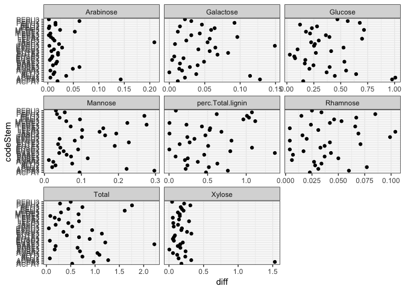
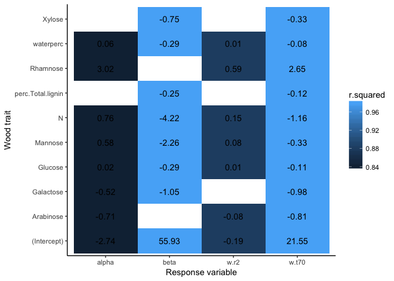

Community v chemistry -- Recent analyses
================
10/23/2017

Repo outline
------------

### Main analyses

1.  How do wood species and sizes vary in decay?

-   script: *decayPatterns.Rmd*
-   summary: output/decayfits.pdf

1.  Do wood traits explain decay?

-   script: *woodtraits\_explainDecay.Rmd*
-   summary:
    -   Fast decayers (alpha) have low density
    -   Samples with S-shaped trajectories (beta) have low N and high density
    -   Difficult to predict decayers (low r2) have low N, high density, and belong to the small size class
    -   Low water content predicts more mass remaining across all time points
    -   Low N and small size class predict more mass remaining at early-mid time points
    -   High C predicts more mass remaining at late time points

1.  Does endophyte composition explain decay?

-   script: *endoComp\_explainDecay.Rmd*
-   summary: No. There is a relationship between composition and percent mass remaining after 37 months, but this is likely driven by the role of water content (and P?) on the microbial community and decay.

1.  Does endophyte diversity explain decay? \*

-   script: *endoDiv\_explainDecay.Rmd*
-   summary:
    -   More saprotrophs leads to less mass remaining after 25 and 37 months, but only in small stems
    -   More pathotrophs leads to less mass remaining after 37 months, but only in small stems
    -   Higher saprotroph richness leads to faster decay than would be expected based on wood traits alone
    -   Higher saprotroph richness leads to trajectories that are less s-shaped than based on wood traits alone

### Other pieces

-   How does including t=0 points affect the decay model fit? Including it affects the liklihood and the model selection criteria, but the curve fits are identical. Excluding t=0 leads to prefering simpler models, which is the same effect as increasing the penalty for model complexity -- *code/testing\_time\_zero.Rmd*

-   Do endophyte community dissimilarities correlate with decay trajectory parameters? No relationships -- *code/initialDist\_vs\_decayDist\_btwCode.Rmd*

-   Is there a relationship between the frequency of highly correlated (negative or positive) OTU pairs identified via boral and decay parameters? Nope -- *code/boralOTUpairs\_vs\_decay.Rmd*

-   Is there a relationship between initial microbial diversity WITHIN species+size categories and decay model R2? Nope -- *code/withinInitialDist\_vs\_decayR2.Rmd*

-   Exclude mycorrhizal fungi and animal-associated fungi that somehow made it into our OTU table -- *code/unexpectedTaxa.Rmd*

Recent findings
---------------

Load libraries, functions, data

Load new data

I think there is a typo and JASC2 was entered twice instead of JASC3. My original datasheet that I sent included JASC3. It would be good to double check this with Shawn's lab.

    ## # A tibble: 4 x 2
    ##   codeStem labID
    ##      <chr> <int>
    ## 1    JASC2    45
    ## 2    JASC2    46
    ## 3    JASC2    47
    ## 4    JASC2    48

Look for analytical reps that are way different 

Maybe go back and investigate the JASC/Arabinose and ACPA/Xylose outliers. For now, just average the analytical reps and merge with traits.stem (see code/load\_traitData\_fxns.R)

Check out correlations among C fractions and other traits. Exclude two samples for which there isn't waterperc data. Remember that there is no stem-level barkthick or density data for large stem samples.

    ## # A tibble: 6 x 2
    ## # Groups:   codeStem [2]
    ##   codeStem waterperc
    ##      <chr>     <dbl>
    ## 1    EXCU1        NA
    ## 2    EXCU1        NA
    ## 3    EXCU1        NA
    ## 4    PELI2        NA
    ## 5    PELI2        NA
    ## 6    PELI2        NA

Check out samples in trait space

    ## Importance of components:
    ##                           PC1    PC2    PC3    PC4    PC5     PC6     PC7
    ## Standard deviation     2.0825 1.8691 1.3722 1.3403 1.1163 1.04082 0.86578
    ## Proportion of Variance 0.2551 0.2055 0.1108 0.1057 0.0733 0.06372 0.04409
    ## Cumulative Proportion  0.2551 0.4606 0.5714 0.6770 0.7503 0.81406 0.85816
    ##                            PC8     PC9    PC10    PC11    PC12    PC13
    ## Standard deviation     0.80472 0.74371 0.59276 0.53220 0.41493 0.36832
    ## Proportion of Variance 0.03809 0.03254 0.02067 0.01666 0.01013 0.00798
    ## Cumulative Proportion  0.89625 0.92878 0.94945 0.96611 0.97624 0.98422
    ##                           PC14    PC15    PC16      PC17
    ## Standard deviation     0.34375 0.29017 0.25665 0.0001746
    ## Proportion of Variance 0.00695 0.00495 0.00387 0.0000000
    ## Cumulative Proportion  0.99117 0.99613 1.00000 1.0000000

Load new versions of trait data

Do wood C fractions explain decay?

(by code)

    ## Start:  AIC=-102.84
    ## k ~ waterperc + N + Arabinose + Galactose + Glucose + Mannose + 
    ##     perc.Total.lignin + Rhamnose + Xylose
    ## 
    ##                     Df Sum of Sq       RSS      AIC
    ## - Arabinose          1 0.0000371 0.0004670 -103.848
    ## <none>                           0.0004299 -102.842
    ## - Rhamnose           1 0.0002823 0.0007122  -98.785
    ## - Galactose          1 0.0003895 0.0008194  -97.102
    ## - Glucose            1 0.0008303 0.0012602  -91.937
    ## - perc.Total.lignin  1 0.0009212 0.0013511  -91.101
    ## - N                  1 0.0017330 0.0021629  -85.455
    ## - Mannose            1 0.0025456 0.0029755  -81.627
    ## - Xylose             1 0.0036778 0.0041077  -77.757
    ## - waterperc          1 0.0168446 0.0172745  -60.521
    ## 
    ## Step:  AIC=-103.85
    ## k ~ waterperc + N + Galactose + Glucose + Mannose + perc.Total.lignin + 
    ##     Rhamnose + Xylose
    ## 
    ##                     Df Sum of Sq       RSS      AIC
    ## <none>                           0.0004670 -103.848
    ## - Rhamnose           1 0.0002469 0.0007139 -100.756
    ## - Galactose          1 0.0006336 0.0011007  -95.561
    ## - Glucose            1 0.0008920 0.0013591  -93.030
    ## - perc.Total.lignin  1 0.0008979 0.0013650  -92.979
    ## - Mannose            1 0.0034137 0.0038807  -80.440
    ## - N                  1 0.0035230 0.0039901  -80.106
    ## - Xylose             1 0.0037329 0.0041999  -79.491
    ## - waterperc          1 0.0252689 0.0257359  -57.737
    ## Start:  AIC=-46.55
    ## t70 ~ waterperc + N + Arabinose + Galactose + Glucose + Mannose + 
    ##     perc.Total.lignin + Rhamnose + Xylose
    ## 
    ##                     Df Sum of Sq     RSS     AIC
    ## <none>                           0.04685 -46.548
    ## - Rhamnose           1   0.02224 0.06909 -43.886
    ## - N                  1   0.02933 0.07618 -42.715
    ## - perc.Total.lignin  1   0.11666 0.16351 -33.550
    ## - Arabinose          1   0.13312 0.17998 -32.398
    ## - Glucose            1   0.14382 0.19067 -31.705
    ## - Mannose            1   0.22871 0.27556 -27.286
    ## - Galactose          1   0.37599 0.42284 -22.148
    ## - Xylose             1   0.50570 0.55255 -18.937
    ## - waterperc          1   1.17663 1.22348  -9.398
    ## Start:  AIC=-63.92
    ## ne.r2 ~ waterperc + N + Arabinose + Galactose + Glucose + Mannose + 
    ##     perc.Total.lignin + Rhamnose + Xylose
    ## 
    ##                     Df  Sum of Sq      RSS     AIC
    ## - Arabinose          1 0.00000013 0.011013 -65.923
    ## - Xylose             1 0.00002210 0.011035 -65.900
    ## - N                  1 0.00002317 0.011036 -65.898
    ## - perc.Total.lignin  1 0.00005071 0.011063 -65.868
    ## - Galactose          1 0.00041905 0.011432 -65.475
    ## - Mannose            1 0.00049569 0.011508 -65.395
    ## - Glucose            1 0.00091184 0.011924 -64.969
    ## - Rhamnose           1 0.00123257 0.012245 -64.650
    ## - waterperc          1 0.00196764 0.012980 -63.951
    ## <none>                            0.011012 -63.924
    ## 
    ## Step:  AIC=-65.92
    ## ne.r2 ~ waterperc + N + Galactose + Glucose + Mannose + perc.Total.lignin + 
    ##     Rhamnose + Xylose
    ## 
    ##                     Df  Sum of Sq      RSS     AIC
    ## - Xylose             1 0.00002270 0.011035 -67.899
    ## - perc.Total.lignin  1 0.00005144 0.011064 -67.868
    ## - N                  1 0.00006745 0.011080 -67.850
    ## - Galactose          1 0.00051714 0.011530 -67.373
    ## - Mannose            1 0.00078755 0.011800 -67.095
    ## - Glucose            1 0.00092476 0.011937 -66.956
    ## - Rhamnose           1 0.00153095 0.012544 -66.361
    ## <none>                            0.011013 -65.923
    ## - waterperc          1 0.00315939 0.014172 -64.897
    ## 
    ## Step:  AIC=-67.9
    ## ne.r2 ~ waterperc + N + Galactose + Glucose + Mannose + perc.Total.lignin + 
    ##     Rhamnose
    ## 
    ##                     Df Sum of Sq      RSS     AIC
    ## - N                  1 0.0002516 0.011287 -69.628
    ## - perc.Total.lignin  1 0.0005962 0.011631 -69.267
    ## - Mannose            1 0.0009178 0.011953 -68.940
    ## - Galactose          1 0.0014642 0.012500 -68.404
    ## <none>                           0.011035 -67.899
    ## - Rhamnose           1 0.0025979 0.013633 -67.362
    ## - Glucose            1 0.0033282 0.014363 -66.736
    ## - waterperc          1 0.0049090 0.015944 -65.483
    ## 
    ## Step:  AIC=-69.63
    ## ne.r2 ~ waterperc + Galactose + Glucose + Mannose + perc.Total.lignin + 
    ##     Rhamnose
    ## 
    ##                     Df Sum of Sq      RSS     AIC
    ## - perc.Total.lignin  1 0.0009966 0.012284 -70.613
    ## - Mannose            1 0.0011173 0.012404 -70.495
    ## - Galactose          1 0.0015755 0.012863 -70.060
    ## <none>                           0.011287 -69.628
    ## - Rhamnose           1 0.0029590 0.014246 -68.834
    ## - Glucose            1 0.0047421 0.016029 -67.419
    ## - waterperc          1 0.0048607 0.016148 -67.331
    ## 
    ## Step:  AIC=-70.61
    ## ne.r2 ~ waterperc + Galactose + Glucose + Mannose + Rhamnose
    ## 
    ##             Df Sum of Sq      RSS     AIC
    ## - Mannose    1 0.0007265 0.013010 -71.923
    ## <none>                   0.012284 -70.613
    ## - Galactose  1 0.0023489 0.014632 -70.513
    ## - Rhamnose   1 0.0028378 0.015121 -70.119
    ## - waterperc  1 0.0039379 0.016221 -69.276
    ## - Glucose    1 0.0161949 0.028478 -62.522
    ## 
    ## Step:  AIC=-71.92
    ## ne.r2 ~ waterperc + Galactose + Glucose + Rhamnose
    ## 
    ##             Df Sum of Sq      RSS     AIC
    ## - Galactose  1 0.0020686 0.015079 -72.153
    ## <none>                   0.013010 -71.923
    ## - Rhamnose   1 0.0027075 0.015718 -71.655
    ## - waterperc  1 0.0036353 0.016645 -70.966
    ## - Glucose    1 0.0156822 0.028692 -64.432
    ## 
    ## Step:  AIC=-72.15
    ## ne.r2 ~ waterperc + Glucose + Rhamnose
    ## 
    ##             Df Sum of Sq      RSS     AIC
    ## <none>                   0.015079 -72.153
    ## - Rhamnose   1 0.0046203 0.019699 -70.945
    ## - waterperc  1 0.0082465 0.023325 -68.918
    ## - Glucose    1 0.0143374 0.029416 -66.133
    ## Start:  AIC=-32.28
    ## alpha ~ waterperc + N + Arabinose + Galactose + Glucose + Mannose + 
    ##     perc.Total.lignin + Rhamnose + Xylose
    ## 
    ##                     Df Sum of Sq     RSS     AIC
    ## - Xylose             1   0.00166 0.15549 -34.153
    ## - perc.Total.lignin  1   0.00376 0.15759 -33.992
    ## - Glucose            1   0.01343 0.16726 -33.277
    ## - N                  1   0.01942 0.17325 -32.855
    ## <none>                           0.15383 -32.282
    ## - Arabinose          1   0.06685 0.22069 -29.951
    ## - Galactose          1   0.08017 0.23400 -29.248
    ## - Rhamnose           1   0.08610 0.23994 -28.947
    ## - Mannose            1   0.24629 0.40012 -22.811
    ## - waterperc          1   0.37726 0.53109 -19.413
    ## 
    ## Step:  AIC=-34.15
    ## alpha ~ waterperc + N + Arabinose + Galactose + Glucose + Mannose + 
    ##     perc.Total.lignin + Rhamnose
    ## 
    ##                     Df Sum of Sq     RSS     AIC
    ## - perc.Total.lignin  1   0.00279 0.15828 -35.939
    ## - Glucose            1   0.01621 0.17170 -34.963
    ## - N                  1   0.02096 0.17645 -34.636
    ## <none>                           0.15549 -34.153
    ## - Arabinose          1   0.06586 0.22135 -31.915
    ## - Rhamnose           1   0.11444 0.26993 -29.534
    ## - Galactose          1   0.12590 0.28139 -29.035
    ## - Mannose            1   0.26483 0.42032 -24.220
    ## - waterperc          1   0.51871 0.67420 -18.550
    ## 
    ## Step:  AIC=-35.94
    ## alpha ~ waterperc + N + Arabinose + Galactose + Glucose + Mannose + 
    ##     Rhamnose
    ## 
    ##             Df Sum of Sq     RSS     AIC
    ## <none>                   0.15828 -35.939
    ## - N          1   0.03447 0.19275 -35.575
    ## - Glucose    1   0.05528 0.21356 -34.345
    ## - Arabinose  1   0.08183 0.24011 -32.939
    ## - Galactose  1   0.12979 0.28807 -30.753
    ## - Rhamnose   1   0.15943 0.31772 -29.578
    ## - Mannose    1   0.26307 0.42135 -26.190
    ## - waterperc  1   0.51598 0.67426 -20.548
    ## Start:  AIC=-18.2
    ## beta ~ waterperc + N + Arabinose + Galactose + Glucose + Mannose + 
    ##     perc.Total.lignin + Rhamnose + Xylose
    ## 
    ##                     Df Sum of Sq    RSS      AIC
    ## - Rhamnose           1    0.0050 0.5022 -20.0844
    ## - Arabinose          1    0.0727 0.5699 -18.5673
    ## <none>                           0.4972 -18.2049
    ## - N                  1    0.2840 0.7812 -14.7823
    ## - perc.Total.lignin  1    0.3472 0.8443 -13.8493
    ## - Galactose          1    0.5724 1.0696 -11.0119
    ## - Glucose            1    0.5988 1.0959 -10.7196
    ## - Xylose             1    1.9025 2.3997  -1.3148
    ## - Mannose            1    2.9250 3.4222   2.9444
    ## - waterperc          1    7.4977 7.9949  13.1267
    ## 
    ## Step:  AIC=-20.08
    ## beta ~ waterperc + N + Arabinose + Galactose + Glucose + Mannose + 
    ##     perc.Total.lignin + Xylose
    ## 
    ##                     Df Sum of Sq     RSS      AIC
    ## - Arabinose          1    0.0703  0.5725 -20.5127
    ## <none>                            0.5022 -20.0844
    ## - N                  1    0.4334  0.9356 -14.6180
    ## - Galactose          1    0.5718  1.0740 -12.9621
    ## - perc.Total.lignin  1    1.0675  1.5697  -8.4081
    ## - Glucose            1    1.3129  1.8151  -6.6654
    ## - Xylose             1    3.2070  3.7092   1.9108
    ## - Mannose            1    4.0812  4.5834   4.4505
    ## - waterperc          1   14.6350 15.1372  18.7870
    ## 
    ## Step:  AIC=-20.51
    ## beta ~ waterperc + N + Galactose + Glucose + Mannose + perc.Total.lignin + 
    ##     Xylose
    ## 
    ##                     Df Sum of Sq     RSS      AIC
    ## <none>                            0.5725 -20.5127
    ## - Galactose          1    0.5178  1.0902 -14.7823
    ## - perc.Total.lignin  1    1.0548  1.6273  -9.9759
    ## - N                  1    1.5337  2.1061  -6.8806
    ## - Glucose            1    1.6924  2.2649  -6.0086
    ## - Xylose             1    3.1948  3.7673   0.0975
    ## - Mannose            1    6.0705  6.6429   6.9037
    ## - waterperc          1   20.1819 20.7543  20.5742
    ## Start:  AIC=-39.96
    ## w.t70 ~ waterperc + N + Arabinose + Galactose + Glucose + Mannose + 
    ##     perc.Total.lignin + Rhamnose + Xylose
    ## 
    ##                     Df Sum of Sq     RSS     AIC
    ## <none>                           0.08114 -39.958
    ## - N                  1   0.04100 0.12214 -37.050
    ## - Rhamnose           1   0.04482 0.12597 -36.680
    ## - Glucose            1   0.06231 0.14345 -35.120
    ## - perc.Total.lignin  1   0.07008 0.15122 -34.487
    ## - Mannose            1   0.07318 0.15432 -34.243
    ## - Arabinose          1   0.09190 0.17304 -32.870
    ## - Galactose          1   0.33867 0.41981 -22.234
    ## - Xylose             1   0.40284 0.48398 -20.527
    ## - waterperc          1   0.64404 0.72518 -15.675
    ## Start:  AIC=-70.95
    ## w.r2 ~ waterperc + N + Arabinose + Galactose + Glucose + Mannose + 
    ##     perc.Total.lignin + Rhamnose + Xylose
    ## 
    ##                     Df Sum of Sq       RSS     AIC
    ## - Galactose          1 0.0000001 0.0061335 -72.947
    ## - Xylose             1 0.0000041 0.0061375 -72.939
    ## - perc.Total.lignin  1 0.0000966 0.0062301 -72.759
    ## - N                  1 0.0003116 0.0064451 -72.352
    ## - Arabinose          1 0.0005983 0.0067317 -71.830
    ## <none>                           0.0061334 -70.947
    ## - Glucose            1 0.0013240 0.0074575 -70.601
    ## - Rhamnose           1 0.0034081 0.0095415 -67.644
    ## - Mannose            1 0.0039885 0.0101219 -66.936
    ## - waterperc          1 0.0077906 0.0139241 -63.109
    ## 
    ## Step:  AIC=-72.95
    ## w.r2 ~ waterperc + N + Arabinose + Glucose + Mannose + perc.Total.lignin + 
    ##     Rhamnose + Xylose
    ## 
    ##                     Df Sum of Sq       RSS     AIC
    ## - Xylose             1 0.0000062 0.0061397 -74.935
    ## - perc.Total.lignin  1 0.0001232 0.0062567 -74.708
    ## - N                  1 0.0003154 0.0064489 -74.345
    ## - Arabinose          1 0.0007567 0.0068902 -73.551
    ## <none>                           0.0061335 -72.947
    ## - Glucose            1 0.0018358 0.0079693 -71.805
    ## - Rhamnose           1 0.0034084 0.0095419 -69.644
    ## - Mannose            1 0.0040316 0.0101651 -68.884
    ## - waterperc          1 0.0079080 0.0140415 -65.008
    ## 
    ## Step:  AIC=-74.93
    ## w.r2 ~ waterperc + N + Arabinose + Glucose + Mannose + perc.Total.lignin + 
    ##     Rhamnose
    ## 
    ##                     Df Sum of Sq       RSS     AIC
    ## - perc.Total.lignin  1 0.0005625 0.0067022 -75.883
    ## - N                  1 0.0009779 0.0071176 -75.161
    ## <none>                           0.0061397 -74.935
    ## - Arabinose          1 0.0014158 0.0075556 -74.445
    ## - Glucose            1 0.0033454 0.0094851 -71.715
    ## - Mannose            1 0.0053745 0.0115142 -69.389
    ## - Rhamnose           1 0.0073441 0.0134838 -67.494
    ## - waterperc          1 0.0184572 0.0245969 -60.281
    ## 
    ## Step:  AIC=-75.88
    ## w.r2 ~ waterperc + N + Arabinose + Glucose + Mannose + Rhamnose
    ## 
    ##             Df Sum of Sq       RSS     AIC
    ## <none>                   0.0067022 -75.883
    ## - N          1 0.0023808 0.0090830 -74.235
    ## - Arabinose  1 0.0023871 0.0090893 -74.227
    ## - Mannose    1 0.0051500 0.0118521 -71.042
    ## - Rhamnose   1 0.0114841 0.0181863 -65.904
    ## - Glucose    1 0.0156495 0.0223517 -63.429
    ## - waterperc  1 0.0179226 0.0246248 -62.267

-   alpha: Codes that decay quickly have more Rhamnose
-   beta: Codes with s-shaped trajectories have low N, Mannose, and Glactose
-   w.r2: Codes with better model fits have more Rhamnose
-   w.t70: Codes with longer "half lives" have more Rhamnose and less N

(by stem)

    ## Start:  AIC=-220.78
    ## curr.pmr ~ waterperc + N + Arabinose + Galactose + Glucose + 
    ##     Mannose + perc.Total.lignin + Rhamnose + Xylose
    ## 
    ##                     Df Sum of Sq      RSS     AIC
    ## - Xylose             1 0.0000132 0.028586 -222.76
    ## - Galactose          1 0.0001273 0.028700 -222.62
    ## - N                  1 0.0002789 0.028852 -222.45
    ## <none>                           0.028573 -220.78
    ## - perc.Total.lignin  1 0.0025333 0.031106 -219.89
    ## - Arabinose          1 0.0027662 0.031339 -219.63
    ## - Glucose            1 0.0033831 0.031956 -218.97
    ## - Mannose            1 0.0048047 0.033378 -217.49
    ## - Rhamnose           1 0.0050493 0.033622 -217.24
    ## - waterperc          1 0.0097326 0.038306 -212.81
    ## 
    ## Step:  AIC=-222.76
    ## curr.pmr ~ waterperc + N + Arabinose + Galactose + Glucose + 
    ##     Mannose + perc.Total.lignin + Rhamnose
    ## 
    ##                     Df Sum of Sq      RSS     AIC
    ## - Galactose          1 0.0001251 0.028711 -224.61
    ## - N                  1 0.0005304 0.029117 -224.13
    ## <none>                           0.028586 -222.76
    ## - Arabinose          1 0.0030407 0.031627 -221.32
    ## - Glucose            1 0.0037985 0.032385 -220.52
    ## - perc.Total.lignin  1 0.0040892 0.032675 -220.22
    ## - Mannose            1 0.0047915 0.033378 -219.49
    ## - Rhamnose           1 0.0050363 0.033623 -219.24
    ## - waterperc          1 0.0103079 0.038894 -214.29
    ## 
    ## Step:  AIC=-224.61
    ## curr.pmr ~ waterperc + N + Arabinose + Glucose + Mannose + perc.Total.lignin + 
    ##     Rhamnose
    ## 
    ##                     Df Sum of Sq      RSS     AIC
    ## - N                  1 0.0004719 0.029183 -226.06
    ## <none>                           0.028711 -224.61
    ## - Arabinose          1 0.0029185 0.031630 -223.32
    ## - Glucose            1 0.0039949 0.032706 -222.18
    ## - perc.Total.lignin  1 0.0044856 0.033197 -221.68
    ## - Mannose            1 0.0048126 0.033524 -221.34
    ## - Rhamnose           1 0.0062826 0.034994 -219.88
    ## - waterperc          1 0.0125698 0.041281 -214.27
    ## 
    ## Step:  AIC=-226.06
    ## curr.pmr ~ waterperc + Arabinose + Glucose + Mannose + perc.Total.lignin + 
    ##     Rhamnose
    ## 
    ##                     Df Sum of Sq      RSS     AIC
    ## <none>                           0.029183 -226.06
    ## - Arabinose          1 0.0027564 0.031940 -224.99
    ## - Glucose            1 0.0036958 0.032879 -224.00
    ## - perc.Total.lignin  1 0.0041080 0.033291 -223.58
    ## - Mannose            1 0.0049307 0.034114 -222.75
    ## - Rhamnose           1 0.0060134 0.035197 -221.69
    ## - waterperc          1 0.0132455 0.042429 -215.33
    ## Start:  AIC=-202.47
    ## curr.pmr ~ waterperc + N + Arabinose + Galactose + Glucose + 
    ##     Mannose + perc.Total.lignin + Rhamnose + Xylose
    ## 
    ##                     Df Sum of Sq      RSS     AIC
    ## - N                  1 0.0000005 0.038968 -204.47
    ## - Mannose            1 0.0009104 0.039878 -203.71
    ## - Rhamnose           1 0.0011319 0.040100 -203.53
    ## - Galactose          1 0.0011826 0.040150 -203.48
    ## <none>                           0.038968 -202.47
    ## - Xylose             1 0.0031666 0.042134 -201.89
    ## - Arabinose          1 0.0060837 0.045051 -199.68
    ## - perc.Total.lignin  1 0.0088305 0.047798 -197.73
    ## - Glucose            1 0.0148960 0.053864 -193.79
    ## - waterperc          1 0.0190147 0.057982 -191.36
    ## 
    ## Step:  AIC=-204.47
    ## curr.pmr ~ waterperc + Arabinose + Galactose + Glucose + Mannose + 
    ##     perc.Total.lignin + Rhamnose + Xylose
    ## 
    ##                     Df Sum of Sq      RSS     AIC
    ## - Mannose            1 0.0009166 0.039885 -205.70
    ## - Rhamnose           1 0.0011401 0.040108 -205.52
    ## - Galactose          1 0.0012109 0.040179 -205.46
    ## <none>                           0.038968 -204.47
    ## - Xylose             1 0.0049199 0.043888 -202.55
    ## - perc.Total.lignin  1 0.0089793 0.047948 -199.63
    ## - Arabinose          1 0.0109500 0.049918 -198.30
    ## - Glucose            1 0.0152657 0.054234 -195.56
    ## - waterperc          1 0.0211827 0.060151 -192.14
    ## 
    ## Step:  AIC=-205.7
    ## curr.pmr ~ waterperc + Arabinose + Galactose + Glucose + perc.Total.lignin + 
    ##     Rhamnose + Xylose
    ## 
    ##                     Df Sum of Sq      RSS     AIC
    ## - Rhamnose           1 0.0008968 0.040782 -206.97
    ## - Galactose          1 0.0013190 0.041204 -206.63
    ## <none>                           0.039885 -205.70
    ## - Xylose             1 0.0046981 0.044583 -204.03
    ## - perc.Total.lignin  1 0.0084206 0.048306 -201.38
    ## - Arabinose          1 0.0137410 0.053626 -197.93
    ## - Glucose            1 0.0144509 0.054336 -197.50
    ## - waterperc          1 0.0262909 0.066176 -190.99
    ## 
    ## Step:  AIC=-206.97
    ## curr.pmr ~ waterperc + Arabinose + Galactose + Glucose + perc.Total.lignin + 
    ##     Xylose
    ## 
    ##                     Df Sum of Sq      RSS     AIC
    ## - Galactose          1 0.0017810 0.042563 -207.56
    ## <none>                           0.040782 -206.97
    ## - Xylose             1 0.0046581 0.045440 -205.40
    ## - perc.Total.lignin  1 0.0080716 0.048853 -203.01
    ## - Glucose            1 0.0154876 0.056269 -198.35
    ## - Arabinose          1 0.0157520 0.056534 -198.19
    ## - waterperc          1 0.0253954 0.066177 -192.99
    ## 
    ## Step:  AIC=-207.56
    ## curr.pmr ~ waterperc + Arabinose + Glucose + perc.Total.lignin + 
    ##     Xylose
    ## 
    ##                     Df Sum of Sq      RSS     AIC
    ## <none>                           0.042563 -207.56
    ## - Xylose             1 0.0029947 0.045557 -207.31
    ## - perc.Total.lignin  1 0.0063388 0.048902 -204.98
    ## - Glucose            1 0.0137066 0.056269 -200.35
    ## - Arabinose          1 0.0142071 0.056770 -200.05
    ## - waterperc          1 0.0308727 0.073435 -191.56
    ## Start:  AIC=-169.16
    ## curr.pmr ~ waterperc + N + Arabinose + Galactose + Glucose + 
    ##     Mannose + perc.Total.lignin + Rhamnose + Xylose
    ## 
    ##                     Df Sum of Sq      RSS     AIC
    ## - perc.Total.lignin  1  0.000476 0.087144 -170.99
    ## - Mannose            1  0.002776 0.089444 -170.16
    ## <none>                           0.086668 -169.16
    ## - Glucose            1  0.011967 0.098635 -167.03
    ## - Arabinose          1  0.015306 0.101974 -165.96
    ## - Galactose          1  0.044010 0.130678 -158.02
    ## - Rhamnose           1  0.048267 0.134936 -157.00
    ## - N                  1  0.064758 0.151427 -153.31
    ## - Xylose             1  0.074220 0.160888 -151.37
    ## - waterperc          1  0.078274 0.164942 -150.57
    ## 
    ## Step:  AIC=-170.99
    ## curr.pmr ~ waterperc + N + Arabinose + Galactose + Glucose + 
    ##     Mannose + Rhamnose + Xylose
    ## 
    ##             Df Sum of Sq      RSS     AIC
    ## - Mannose    1  0.002374 0.089519 -172.13
    ## <none>                   0.087144 -170.99
    ## - Arabinose  1  0.014945 0.102090 -167.92
    ## - Galactose  1  0.047508 0.134652 -159.06
    ## - Glucose    1  0.052655 0.139799 -157.87
    ## - N          1  0.064964 0.152108 -155.16
    ## - Rhamnose   1  0.068105 0.155250 -154.51
    ## - waterperc  1  0.094663 0.181808 -149.46
    ## - Xylose     1  0.142791 0.229935 -141.94
    ## 
    ## Step:  AIC=-172.13
    ## curr.pmr ~ waterperc + N + Arabinose + Galactose + Glucose + 
    ##     Rhamnose + Xylose
    ## 
    ##             Df Sum of Sq      RSS     AIC
    ## <none>                   0.089519 -172.13
    ## - Arabinose  1  0.019552 0.109071 -167.81
    ## - Galactose  1  0.046469 0.135988 -160.75
    ## - Glucose    1  0.050347 0.139865 -159.85
    ## - N          1  0.065057 0.154576 -156.65
    ## - Rhamnose   1  0.066618 0.156137 -156.33
    ## - Xylose     1  0.140423 0.229942 -143.94
    ## - waterperc  1  0.180730 0.270249 -138.77
    ## Start:  AIC=-131.17
    ## curr.pmr ~ waterperc + N + Arabinose + Galactose + Glucose + 
    ##     Mannose + perc.Total.lignin + Rhamnose + Xylose
    ## 
    ##                     Df Sum of Sq     RSS     AIC
    ## - perc.Total.lignin  1   0.00002 0.28413 -133.17
    ## - N                  1   0.00216 0.28627 -132.93
    ## - Glucose            1   0.00296 0.28708 -132.84
    ## - Galactose          1   0.00580 0.28991 -132.53
    ## - Arabinose          1   0.00615 0.29026 -132.49
    ## - Rhamnose           1   0.01143 0.29555 -131.91
    ## - Xylose             1   0.01680 0.30091 -131.33
    ## - Mannose            1   0.01752 0.30163 -131.26
    ## <none>                           0.28411 -131.17
    ## - waterperc          1   0.35206 0.63617 -107.38
    ## 
    ## Step:  AIC=-133.17
    ## curr.pmr ~ waterperc + N + Arabinose + Galactose + Glucose + 
    ##     Mannose + Rhamnose + Xylose
    ## 
    ##             Df Sum of Sq     RSS     AIC
    ## - N          1   0.00215 0.28628 -134.93
    ## - Galactose  1   0.00613 0.29026 -134.49
    ## - Arabinose  1   0.00619 0.29032 -134.48
    ## - Mannose    1   0.01811 0.30224 -133.19
    ## <none>                   0.28413 -133.17
    ## - Glucose    1   0.01838 0.30251 -133.16
    ## - Rhamnose   1   0.01863 0.30276 -133.14
    ## - Xylose     1   0.02876 0.31289 -132.08
    ## - waterperc  1   0.41727 0.70140 -106.25
    ## 
    ## Step:  AIC=-134.93
    ## curr.pmr ~ waterperc + Arabinose + Galactose + Glucose + Mannose + 
    ##     Rhamnose + Xylose
    ## 
    ##             Df Sum of Sq     RSS     AIC
    ## - Galactose  1   0.00485 0.29113 -136.39
    ## - Rhamnose   1   0.01743 0.30371 -135.04
    ## - Mannose    1   0.01768 0.30396 -135.01
    ## <none>                   0.28628 -134.93
    ## - Arabinose  1   0.02171 0.30799 -134.59
    ## - Xylose     1   0.03451 0.32079 -133.29
    ## - Glucose    1   0.04707 0.33334 -132.06
    ## - waterperc  1   0.42138 0.70766 -107.97
    ## 
    ## Step:  AIC=-136.39
    ## curr.pmr ~ waterperc + Arabinose + Glucose + Mannose + Rhamnose + 
    ##     Xylose
    ## 
    ##             Df Sum of Sq     RSS     AIC
    ## - Rhamnose   1   0.01258 0.30371 -137.04
    ## - Mannose    1   0.01651 0.30764 -136.63
    ## - Arabinose  1   0.01753 0.30866 -136.52
    ## <none>                   0.29113 -136.39
    ## - Xylose     1   0.03189 0.32302 -135.06
    ## - Glucose    1   0.05097 0.34211 -133.23
    ## - waterperc  1   0.45159 0.74272 -108.42
    ## 
    ## Step:  AIC=-137.04
    ## curr.pmr ~ waterperc + Arabinose + Glucose + Mannose + Xylose
    ## 
    ##             Df Sum of Sq     RSS     AIC
    ## - Arabinose  1   0.01094 0.31465 -137.91
    ## <none>                   0.30371 -137.04
    ## - Xylose     1   0.02008 0.32379 -136.99
    ## - Mannose    1   0.02061 0.32432 -136.94
    ## - Glucose    1   0.05558 0.35929 -133.66
    ## - waterperc  1   0.46124 0.76495 -109.48
    ## 
    ## Step:  AIC=-137.9
    ## curr.pmr ~ waterperc + Glucose + Mannose + Xylose
    ## 
    ##             Df Sum of Sq     RSS     AIC
    ## <none>                   0.31465 -137.91
    ## - Xylose     1   0.02249 0.33714 -137.70
    ## - Mannose    1   0.02799 0.34264 -137.18
    ## - Glucose    1   0.04707 0.36172 -135.44
    ## - waterperc  1   0.45851 0.77317 -111.14
    ## Start:  AIC=-133.92
    ## curr.pmr ~ waterperc + N + Arabinose + Galactose + Glucose + 
    ##     Mannose + perc.Total.lignin + Rhamnose + Xylose
    ## 
    ##                     Df Sum of Sq     RSS     AIC
    ## - Rhamnose           1  0.000225 0.31132 -135.89
    ## - Xylose             1  0.002105 0.31320 -135.69
    ## - Galactose          1  0.002363 0.31346 -135.67
    ## - perc.Total.lignin  1  0.005242 0.31633 -135.37
    ## - Glucose            1  0.009064 0.32016 -134.97
    ## - N                  1  0.015193 0.32629 -134.34
    ## - Mannose            1  0.017079 0.32817 -134.15
    ## <none>                           0.31109 -133.92
    ## - Arabinose          1  0.064086 0.37518 -129.74
    ## - waterperc          1  0.274249 0.58534 -115.06
    ## 
    ## Step:  AIC=-135.89
    ## curr.pmr ~ waterperc + N + Arabinose + Galactose + Glucose + 
    ##     Mannose + perc.Total.lignin + Xylose
    ## 
    ##                     Df Sum of Sq     RSS     AIC
    ## - Xylose             1  0.002048 0.31337 -137.68
    ## - Galactose          1  0.002930 0.31425 -137.59
    ## - perc.Total.lignin  1  0.005970 0.31729 -137.27
    ## - N                  1  0.015208 0.32653 -136.32
    ## - Glucose            1  0.016056 0.32737 -136.23
    ## - Mannose            1  0.018504 0.32982 -135.99
    ## <none>                           0.31132 -135.89
    ## - Arabinose          1  0.064439 0.37576 -131.69
    ## - waterperc          1  0.304666 0.61598 -115.37
    ## 
    ## Step:  AIC=-137.68
    ## curr.pmr ~ waterperc + N + Arabinose + Galactose + Glucose + 
    ##     Mannose + perc.Total.lignin
    ## 
    ##                     Df Sum of Sq     RSS     AIC
    ## - Galactose          1   0.00115 0.31452 -139.56
    ## - perc.Total.lignin  1   0.00440 0.31777 -139.22
    ## - N                  1   0.01408 0.32745 -138.23
    ## - Mannose            1   0.01908 0.33245 -137.73
    ## <none>                           0.31337 -137.68
    ## - Glucose            1   0.02685 0.34022 -136.96
    ## - Arabinose          1   0.06263 0.37600 -133.66
    ## - waterperc          1   0.33994 0.65331 -115.43
    ## 
    ## Step:  AIC=-139.56
    ## curr.pmr ~ waterperc + N + Arabinose + Glucose + Mannose + perc.Total.lignin
    ## 
    ##                     Df Sum of Sq     RSS     AIC
    ## - perc.Total.lignin  1   0.00393 0.31845 -141.15
    ## - N                  1   0.01625 0.33077 -139.89
    ## - Mannose            1   0.01963 0.33415 -139.56
    ## <none>                           0.31452 -139.56
    ## - Glucose            1   0.02918 0.34370 -138.63
    ## - Arabinose          1   0.06958 0.38410 -134.96
    ## - waterperc          1   0.36281 0.67733 -116.24
    ## 
    ## Step:  AIC=-141.15
    ## curr.pmr ~ waterperc + N + Arabinose + Glucose + Mannose
    ## 
    ##             Df Sum of Sq     RSS     AIC
    ## - Mannose    1   0.01919 0.33763 -141.22
    ## <none>                   0.31845 -141.15
    ## - N          1   0.03853 0.35697 -139.38
    ## - Arabinose  1   0.12065 0.43910 -132.54
    ## - Glucose    1   0.31874 0.63718 -120.26
    ## - waterperc  1   0.35902 0.67747 -118.23
    ## 
    ## Step:  AIC=-141.22
    ## curr.pmr ~ waterperc + N + Arabinose + Glucose
    ## 
    ##             Df Sum of Sq     RSS     AIC
    ## <none>                   0.33763 -141.22
    ## - N          1   0.04150 0.37913 -139.39
    ## - Arabinose  1   0.16197 0.49960 -130.28
    ## - Glucose    1   0.30345 0.64109 -122.06
    ## - waterperc  1   0.41929 0.75692 -116.58

-   Glucose and waterperc are important for explaining pmr at each time point. Stems with low glucose and waterperc tend to have more mass remaining.
-   High Rhamnose and low N are associated with more mass remaining after 25 months
