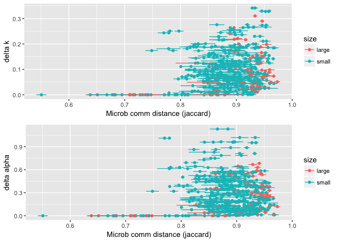

Does chemistry or community better predict mass loss?
================
Marissa Lee
10/23/2017

``` r
#chunk options
knitr::opts_chunk$set(echo = TRUE, message=FALSE, warning=FALSE)

#libraries
devtools::install_github("cornwell-lab-unsw/litterfitter")
library(dplyr)
library(ggplot2)
library(readr)
library(vegan)
library(knitr)
library(litterfitter)
library(magrittr)
library(tidyr)
library(gridExtra)

#fxns
source("code/load_fxns.R")
source("code/curve_fitting_fxns.R")
source("code/distance_fxns.R")
source("code/otuIDs_fxns.R")
```

Load microbial community data

``` r
stemSamples<-load_stemSamples() #load stem sample meta data
write.csv(stemSamples, "derived_data/stemSamples.csv")

fung.otu<-load_matotu() #load the fungal OTU table
comm.otu<-add_oomycetes(fung.otu) #add the oomycetes
write.csv(comm.otu, "derived_data/comm_otu.csv")

seqSamples<-load_seqSamples(comm.otu, stemSamples) #create sequence sample meta data table
write.csv(seqSamples, "derived_data/seqSamples.csv")

#plot_sampleEffortCurves(comm.otu)

#load taxon lookup info
taxAndFunguild<-load_TaxAndFunguild(comm.otu)
```

Load wood trait data

``` r
traits.mean<-mergeTraitData()
write.csv(traits.mean, "derived_data/traits_mean.csv")

#missing data
traits.long<-as.data.frame(gather(traits.mean, key=trait, value=value, -(1:3)))
filter(traits.long, is.na(value))
```

    ##   code species_lower  size     trait value
    ## 1 olst          olst small waterperc   NaN
    ## 2 eusc          eusc small         P    NA
    ## 3 eusc          eusc small         K    NA
    ## 4 eusc          eusc small        Ca    NA
    ## 5 eusc          eusc small        Mn    NA
    ## 6 eusc          eusc small        Fe    NA
    ## 7 eusc          eusc small        Zn    NA
    ## 8 eusc          eusc small         N    NA
    ## 9 eusc          eusc small         C    NA

``` r
# ggplot(traits.long, aes(x=species_lower, y=value, color=size)) + 
#   geom_point() + 
#   facet_wrap(~trait, scales="free") +
#   mytheme + theme(axis.text.x = element_text(angle = 90, hjust = 1))

# #the Fe values for large stems are not 0, they are just small values
# subset(traits.long, trait=="Fe") %>%
#   ggplot(aes(x=species_lower, y=value, color=size)) + 
#   geom_point() +
#   facet_wrap(~size, scales="free")
```

Load mass loss data

``` r
initial_mass <- read_in_initial_mass()
harvest_mass<-LoadHarvestFiles()
mass.data<-bind_rows(initial_mass, harvest_mass)

#look for outliers

# mass.data %>% ggplot(aes(x=time, y=totalSampleDryMass)) + geom_point(alpha=0.6)+theme_bw() 
#looks good

# mass.data %>% ggplot(aes(x=time, y=totalSampleDryMass,col=size)) + geom_point(position="jitter",alpha=0.6)+theme_bw()+scale_y_log10()
# two high values in size==small and harvest 3 are likely real, they have been checked

#mass.data[which(mass.data$totalSampleDryMass==0),]
#no longer any samples with 0 totalSampleDryMass in the dataset

#check for missing data
mass.data %>%
  filter(is.na(totalSampleDryMass)) %>%
  knitr::kable()
```

| unique  | species | size  |  time|  totalSampleDryMass| density | fruiting | insects | drill |  bark\_density|  xylem\_density|  total\_density| notes                                  |
|:--------|:--------|:------|-----:|-------------------:|:--------|:---------|:--------|:------|--------------:|---------------:|---------------:|:---------------------------------------|
| ALLI311 | ALLI    | large |    37|                  NA| NA      |          | NA      | no    |             NA|              NA|              NA| missing from plot -- missing           |
| baae1a  | baae    | small |    37|                  NA| NA      |          | NA      | no    |             NA|              NA|              NA| missing from plot -- missing from plot |

Merge time zero with the other harvests to calculate proportion mass remaining at each time point... Matching failures, all due to missing time 0 data

``` r
#Merge time zero with the other harvests to calculate proportion mass remaining at each time point
mass.data %>%
  filter(time==0) %>%
  rename(timeZeroDensity=density) %>%
  rename(timeZeroMass=totalSampleDryMass) %>%
  select(unique,timeZeroMass,timeZeroDensity)->time_zero

mass.data %>%
  left_join(time_zero,by="unique") %>%
  mutate(pmr=totalSampleDryMass/timeZeroMass) %>%
  mutate(SpeciesCode=tolower(species)) -> plotting_df
  write_csv(plotting_df,"derived_data/plotting_df.csv")
  
  
# here are the matching failures which are currently due to the time zero adjustment for moisture
plotting_df %>%
  filter(is.na(pmr)) %>%
  select(unique, species, size, time, totalSampleDryMass, notes) %>%
  spread(key=time, value=totalSampleDryMass) %>%
  knitr::kable()
```

| unique  | species | size  | notes                                  |   37|
|:--------|:--------|:------|:---------------------------------------|----:|
| ALLI311 | ALLI    | large | missing from plot -- missing           |   NA|
| baae1a  | baae    | small | missing from plot -- missing from plot |   NA|

``` r
#remove NA rows
plotting_df %>%
  filter(!is.na(pmr)) -> plotting_df
```

Non-linear curve fits of decay trajectories Using `litterfitter` to apply both negative exponenial and weibull to all species/size classes

``` r
#spdf <- fit_all_curves(plotting_df) #this recalculates all the curve fits, uncomment if the data changes
#write_csv(spdf,"derived_data/mass_loss_parameters.csv")
spdf <- read_csv("derived_data/mass_loss_parameters.csv")
indx<-select(stemSamples, code, species, size)
spdf<-left_join(spdf, indx) #add code

# ggplot(spdf,aes(x=t70,y=w.t70,col=size))+
#   geom_point()+
#   labs(x="Time to 30% mass loss (negative exponential)", 
#        y="Time to 30% mass loss (Weibull)")+
#   geom_abline(slope=1,intercept=0,linetype="dashed")+theme_bw()
```

### Try out rioja...

Our data doesn't fit the tutorial because we have &gt;1 'site' (where site = species+size) for the community data

``` r
library(rioja)

data(IK)
spec <- IK$spec
SumSST <- IK$env$SumSST
core <- IK$core

dim(spec)
```

    ## [1] 61 22

``` r
length(SumSST)
```

    ## [1] 61

``` r
fit <- WAPLS(spec, SumSST)
fit
```

    ## 
    ## Method : Weighted Averaging Partial Least Squares
    ## Call   : WAPLS(y = spec, x = SumSST) 
    ## 
    ## No. samples        : 61 
    ## No. species        : 22 
    ## No. components     : 5 
    ## Cross val.         : none 
    ## 
    ## 
    ## Performance:
    ##           RMSE      R2  Avg.Bias  Max.Bias    Skill
    ## Comp01  2.0342  0.9161   -0.0272    4.3510  91.6025
    ## Comp02  1.6956  0.9417   -0.0041    3.7135  94.1653
    ## Comp03  1.5807  0.9493   -0.0080    3.7599  94.9296
    ## Comp04  1.5077  0.9539   -0.0101    3.6533  95.3869
    ## Comp05  1.4672  0.9563   -0.0071    3.6361  95.6318

``` r
# cross-validate model
fit.cv <- crossval(fit, cv.method="loo")
```

    ## Cross-validating:
    ## 
      |                                                                       
      |                                                                 |   0%
      |                                                                       
      |=                                                                |   2%
      |                                                                       
      |==                                                               |   3%
      |                                                                       
      |===                                                              |   5%
      |                                                                       
      |====                                                             |   7%
      |                                                                       
      |=====                                                            |   8%
      |                                                                       
      |======                                                           |  10%
      |                                                                       
      |=======                                                          |  11%
      |                                                                       
      |=========                                                        |  13%
      |                                                                       
      |==========                                                       |  15%
      |                                                                       
      |===========                                                      |  16%
      |                                                                       
      |============                                                     |  18%
      |                                                                       
      |=============                                                    |  20%
      |                                                                       
      |==============                                                   |  21%
      |                                                                       
      |===============                                                  |  23%
      |                                                                       
      |================                                                 |  25%
      |                                                                       
      |=================                                                |  26%
      |                                                                       
      |==================                                               |  28%
      |                                                                       
      |===================                                              |  30%
      |                                                                       
      |====================                                             |  31%
      |                                                                       
      |=====================                                            |  33%
      |                                                                       
      |======================                                           |  34%
      |                                                                       
      |=======================                                          |  36%
      |                                                                       
      |=========================                                        |  38%
      |                                                                       
      |==========================                                       |  39%
      |                                                                       
      |===========================                                      |  41%
      |                                                                       
      |============================                                     |  43%
      |                                                                       
      |=============================                                    |  44%
      |                                                                       
      |==============================                                   |  46%
      |                                                                       
      |===============================                                  |  48%
      |                                                                       
      |================================                                 |  49%
      |                                                                       
      |=================================                                |  51%
      |                                                                       
      |==================================                               |  52%
      |                                                                       
      |===================================                              |  54%
      |                                                                       
      |====================================                             |  56%
      |                                                                       
      |=====================================                            |  57%
      |                                                                       
      |======================================                           |  59%
      |                                                                       
      |=======================================                          |  61%
      |                                                                       
      |========================================                         |  62%
      |                                                                       
      |==========================================                       |  64%
      |                                                                       
      |===========================================                      |  66%
      |                                                                       
      |============================================                     |  67%
      |                                                                       
      |=============================================                    |  69%
      |                                                                       
      |==============================================                   |  70%
      |                                                                       
      |===============================================                  |  72%
      |                                                                       
      |================================================                 |  74%
      |                                                                       
      |=================================================                |  75%
      |                                                                       
      |==================================================               |  77%
      |                                                                       
      |===================================================              |  79%
      |                                                                       
      |====================================================             |  80%
      |                                                                       
      |=====================================================            |  82%
      |                                                                       
      |======================================================           |  84%
      |                                                                       
      |=======================================================          |  85%
      |                                                                       
      |========================================================         |  87%
      |                                                                       
      |==========================================================       |  89%
      |                                                                       
      |===========================================================      |  90%
      |                                                                       
      |============================================================     |  92%
      |                                                                       
      |=============================================================    |  93%
      |                                                                       
      |==============================================================   |  95%
      |                                                                       
      |===============================================================  |  97%
      |                                                                       
      |================================================================ |  98%
      |                                                                       
      |=================================================================| 100%

``` r
fit.cv
```

    ## 
    ## Method : Weighted Averaging Partial Least Squares
    ## Call   : WAPLS(y = spec, x = SumSST) 
    ## 
    ## No. samples        : 61 
    ## No. species        : 22 
    ## No. components     : 5 
    ## Cross val.         : loo 
    ## 
    ## 
    ## Performance:
    ##                RMSE      R2  Avg.Bias  Max.Bias    Skill
    ## Comp01       2.0342  0.9161   -0.0272    4.3510  91.6025
    ## Comp02       1.6956  0.9417   -0.0041    3.7135  94.1653
    ## Comp03       1.5807  0.9493   -0.0080    3.7599  94.9296
    ## Comp04       1.5077  0.9539   -0.0101    3.6533  95.3869
    ## Comp05       1.4672  0.9563   -0.0071    3.6361  95.6318
    ## Comp01_XVal  2.2238  0.8997   -0.0381    4.8343  89.9642
    ## Comp02_XVal  1.8982  0.9269   -0.0293    4.5447  92.6879
    ## Comp03_XVal  1.8724  0.9289   -0.0246    4.5932  92.8859
    ## Comp04_XVal  1.9432  0.9235   -0.0214    4.4836  92.3373
    ## Comp05_XVal  2.0327  0.9164   -0.0041    4.4701  91.6149

``` r
# How many components to use?
rand.t.test(fit.cv)
```

    ##            RMSE        R2     Avg.Bias Max.Bias    Skill delta.RMSE     p
    ## Comp01 2.223843 0.8997053 -0.038122418 4.834263 89.96416 -68.320601 0.001
    ## Comp02 1.898230 0.9268972 -0.029250935 4.544696 92.68788 -14.641893 0.030
    ## Comp03 1.872352 0.9289024 -0.024634606 4.593223 92.88589  -1.363257 0.373
    ## Comp04 1.943207 0.9234816 -0.021386351 4.483557 92.33726   3.784256 0.862
    ## Comp05 2.032738 0.9164191 -0.004121857 4.470094 91.61489   4.607386 0.979

``` r
screeplot(fit.cv)
```


``` r
#predict the core
pred <- predict(fit, core, npls=2)

#plot predictions - depths are in rownames
depth <- as.numeric(rownames(core))
plot(depth, pred$fit[, 2], type="b", ylab="Predicted SumSST", las=1)
```



``` r
# predictions with sample specific errors
## Not run: 
pred <- predict(fit, core, npls=2, sse=TRUE, nboot=1000)
```

    ## Bootstrapping for SSE:
    ## 
      |                                                                       
      |                                                                 |   0%
      |                                                                       
      |                                                                 |   1%
      |                                                                       
      |=                                                                |   1%
      |                                                                       
      |=                                                                |   2%
      |                                                                       
      |==                                                               |   2%
      |                                                                       
      |==                                                               |   3%
      |                                                                       
      |==                                                               |   4%
      |                                                                       
      |===                                                              |   4%
      |                                                                       
      |===                                                              |   5%
      |                                                                       
      |====                                                             |   5%
      |                                                                       
      |====                                                             |   6%
      |                                                                       
      |====                                                             |   7%
      |                                                                       
      |=====                                                            |   7%
      |                                                                       
      |=====                                                            |   8%
      |                                                                       
      |======                                                           |   8%
      |                                                                       
      |======                                                           |   9%
      |                                                                       
      |======                                                           |  10%
      |                                                                       
      |=======                                                          |  10%
      |                                                                       
      |=======                                                          |  11%
      |                                                                       
      |=======                                                          |  12%
      |                                                                       
      |========                                                         |  12%
      |                                                                       
      |========                                                         |  13%
      |                                                                       
      |=========                                                        |  13%
      |                                                                       
      |=========                                                        |  14%
      |                                                                       
      |=========                                                        |  15%
      |                                                                       
      |==========                                                       |  15%
      |                                                                       
      |==========                                                       |  16%
      |                                                                       
      |===========                                                      |  16%
      |                                                                       
      |===========                                                      |  17%
      |                                                                       
      |===========                                                      |  18%
      |                                                                       
      |============                                                     |  18%
      |                                                                       
      |============                                                     |  19%
      |                                                                       
      |=============                                                    |  19%
      |                                                                       
      |=============                                                    |  20%
      |                                                                       
      |=============                                                    |  21%
      |                                                                       
      |==============                                                   |  21%
      |                                                                       
      |==============                                                   |  22%
      |                                                                       
      |===============                                                  |  22%
      |                                                                       
      |===============                                                  |  23%
      |                                                                       
      |===============                                                  |  24%
      |                                                                       
      |================                                                 |  24%
      |                                                                       
      |================                                                 |  25%
      |                                                                       
      |=================                                                |  25%
      |                                                                       
      |=================                                                |  26%
      |                                                                       
      |=================                                                |  27%
      |                                                                       
      |==================                                               |  27%
      |                                                                       
      |==================                                               |  28%
      |                                                                       
      |===================                                              |  28%
      |                                                                       
      |===================                                              |  29%
      |                                                                       
      |===================                                              |  30%
      |                                                                       
      |====================                                             |  30%
      |                                                                       
      |====================                                             |  31%
      |                                                                       
      |====================                                             |  32%
      |                                                                       
      |=====================                                            |  32%
      |                                                                       
      |=====================                                            |  33%
      |                                                                       
      |======================                                           |  33%
      |                                                                       
      |======================                                           |  34%
      |                                                                       
      |======================                                           |  35%
      |                                                                       
      |=======================                                          |  35%
      |                                                                       
      |=======================                                          |  36%
      |                                                                       
      |========================                                         |  36%
      |                                                                       
      |========================                                         |  37%
      |                                                                       
      |========================                                         |  38%
      |                                                                       
      |=========================                                        |  38%
      |                                                                       
      |=========================                                        |  39%
      |                                                                       
      |==========================                                       |  39%
      |                                                                       
      |==========================                                       |  40%
      |                                                                       
      |==========================                                       |  41%
      |                                                                       
      |===========================                                      |  41%
      |                                                                       
      |===========================                                      |  42%
      |                                                                       
      |============================                                     |  42%
      |                                                                       
      |============================                                     |  43%
      |                                                                       
      |============================                                     |  44%
      |                                                                       
      |=============================                                    |  44%
      |                                                                       
      |=============================                                    |  45%
      |                                                                       
      |==============================                                   |  45%
      |                                                                       
      |==============================                                   |  46%
      |                                                                       
      |==============================                                   |  47%
      |                                                                       
      |===============================                                  |  47%
      |                                                                       
      |===============================                                  |  48%
      |                                                                       
      |================================                                 |  48%
      |                                                                       
      |================================                                 |  49%
      |                                                                       
      |================================                                 |  50%
      |                                                                       
      |=================================                                |  50%
      |                                                                       
      |=================================                                |  51%
      |                                                                       
      |=================================                                |  52%
      |                                                                       
      |==================================                               |  52%
      |                                                                       
      |==================================                               |  53%
      |                                                                       
      |===================================                              |  53%
      |                                                                       
      |===================================                              |  54%
      |                                                                       
      |===================================                              |  55%
      |                                                                       
      |====================================                             |  55%
      |                                                                       
      |====================================                             |  56%
      |                                                                       
      |=====================================                            |  56%
      |                                                                       
      |=====================================                            |  57%
      |                                                                       
      |=====================================                            |  58%
      |                                                                       
      |======================================                           |  58%
      |                                                                       
      |======================================                           |  59%
      |                                                                       
      |=======================================                          |  59%
      |                                                                       
      |=======================================                          |  60%
      |                                                                       
      |=======================================                          |  61%
      |                                                                       
      |========================================                         |  61%
      |                                                                       
      |========================================                         |  62%
      |                                                                       
      |=========================================                        |  62%
      |                                                                       
      |=========================================                        |  63%
      |                                                                       
      |=========================================                        |  64%
      |                                                                       
      |==========================================                       |  64%
      |                                                                       
      |==========================================                       |  65%
      |                                                                       
      |===========================================                      |  65%
      |                                                                       
      |===========================================                      |  66%
      |                                                                       
      |===========================================                      |  67%
      |                                                                       
      |============================================                     |  67%
      |                                                                       
      |============================================                     |  68%
      |                                                                       
      |=============================================                    |  68%
      |                                                                       
      |=============================================                    |  69%
      |                                                                       
      |=============================================                    |  70%
      |                                                                       
      |==============================================                   |  70%
      |                                                                       
      |==============================================                   |  71%
      |                                                                       
      |==============================================                   |  72%
      |                                                                       
      |===============================================                  |  72%
      |                                                                       
      |===============================================                  |  73%
      |                                                                       
      |================================================                 |  73%
      |                                                                       
      |================================================                 |  74%
      |                                                                       
      |================================================                 |  75%
      |                                                                       
      |=================================================                |  75%
      |                                                                       
      |=================================================                |  76%
      |                                                                       
      |==================================================               |  76%
      |                                                                       
      |==================================================               |  77%
      |                                                                       
      |==================================================               |  78%
      |                                                                       
      |===================================================              |  78%
      |                                                                       
      |===================================================              |  79%
      |                                                                       
      |====================================================             |  79%
      |                                                                       
      |====================================================             |  80%
      |                                                                       
      |====================================================             |  81%
      |                                                                       
      |=====================================================            |  81%
      |                                                                       
      |=====================================================            |  82%
      |                                                                       
      |======================================================           |  82%
      |                                                                       
      |======================================================           |  83%
      |                                                                       
      |======================================================           |  84%
      |                                                                       
      |=======================================================          |  84%
      |                                                                       
      |=======================================================          |  85%
      |                                                                       
      |========================================================         |  85%
      |                                                                       
      |========================================================         |  86%
      |                                                                       
      |========================================================         |  87%
      |                                                                       
      |=========================================================        |  87%
      |                                                                       
      |=========================================================        |  88%
      |                                                                       
      |==========================================================       |  88%
      |                                                                       
      |==========================================================       |  89%
      |                                                                       
      |==========================================================       |  90%
      |                                                                       
      |===========================================================      |  90%
      |                                                                       
      |===========================================================      |  91%
      |                                                                       
      |===========================================================      |  92%
      |                                                                       
      |============================================================     |  92%
      |                                                                       
      |============================================================     |  93%
      |                                                                       
      |=============================================================    |  93%
      |                                                                       
      |=============================================================    |  94%
      |                                                                       
      |=============================================================    |  95%
      |                                                                       
      |==============================================================   |  95%
      |                                                                       
      |==============================================================   |  96%
      |                                                                       
      |===============================================================  |  96%
      |                                                                       
      |===============================================================  |  97%
      |                                                                       
      |===============================================================  |  98%
      |                                                                       
      |================================================================ |  98%
      |                                                                       
      |================================================================ |  99%
      |                                                                       
      |=================================================================|  99%
      |                                                                       
      |=================================================================| 100%

``` r
pred
```

    ## $fit
    ##        Comp01   Comp02   Comp03   Comp04   Comp05
    ## 0    26.78117 27.50267 26.80464 26.66463 26.55504
    ## 10   26.77837 27.48634 26.73384 26.59153 26.42024
    ## 20   26.52282 27.18974 26.68634 26.71219 27.13506
    ## 30   26.15825 26.77552 26.65750 27.24597 27.98245
    ## 40   26.14461 26.70910 26.44604 26.20876 26.31273
    ## 50   26.12850 26.70861 26.49125 26.32658 26.58580
    ## 60   25.87182 26.34495 26.14529 25.95815 26.33049
    ## 70   26.00850 26.56813 26.50372 26.68609 27.26150
    ## 80   26.26466 26.91566 26.83726 27.02950 27.80388
    ## 90   25.64232 26.10081 26.23855 26.92838 28.06304
    ## 100  26.09793 26.77005 27.04452 28.07576 29.60997
    ## 110  25.59963 26.07028 26.19927 27.58743 28.93216
    ## 120  25.80343 26.39794 26.59310 27.60523 28.85912
    ## 130  25.74047 26.23833 26.33551 27.34205 28.71149
    ## 140  25.74024 26.17401 25.92995 26.31271 26.77818
    ## 150  25.96067 26.47148 26.21548 25.98740 26.05205
    ## 160  25.83166 26.27752 25.96036 25.49608 25.41950
    ## 170  26.16484 26.77187 26.67776 26.81090 27.14472
    ## 180  25.97464 26.50793 26.40061 26.72299 27.32843
    ## 190  26.46027 27.22310 27.28499 28.42575 29.71404
    ## 200  26.39448 27.11637 27.14814 28.02109 28.79860
    ## 210  26.47913 27.29425 27.26914 27.94139 28.73402
    ## 220  26.71430 27.55458 27.55632 28.76589 29.84401
    ## 230  26.74288 27.51521 27.13257 27.69562 28.30796
    ## 240  26.79038 27.61923 27.44147 28.00558 28.07806
    ## 250  26.05970 26.62050 26.39939 26.86158 27.25837
    ## 260  26.37014 27.03014 26.79377 27.07583 26.99720
    ## 270  26.34664 27.04314 26.97463 27.84326 27.78365
    ## 280  26.14412 26.77072 26.66539 27.39996 27.80129
    ## 290  26.36302 26.95629 26.40833 26.52226 26.73350
    ## 300  26.24859 26.85405 26.60564 26.46418 27.15834
    ## 310  25.83478 26.30470 26.08493 26.29262 27.43984
    ## 320  25.99296 26.55896 26.53787 27.14087 28.16197
    ## 330  25.38198 25.65623 25.39210 25.25599 25.48839
    ## 340  26.03421 26.60550 26.59850 26.60208 27.14461
    ## 350  26.25781 26.89035 26.72082 26.74226 27.17320
    ## 360  26.25042 26.87221 26.66115 26.91304 27.61743
    ## 370  26.64786 27.50017 27.67568 28.55492 29.67283
    ## 380  26.67308 27.52204 27.60187 28.78772 30.27366
    ## 390  26.23706 26.90543 26.89289 27.51871 28.59241
    ## 400  25.50448 25.86401 25.63540 26.14455 27.00007
    ## 410  26.69774 27.61933 27.83990 29.21358 31.02554
    ## 420  26.57004 27.38973 27.38436 28.33279 29.54978
    ## 430  26.54720 27.36225 27.51094 28.93554 30.67787
    ## 440  26.20876 26.87752 26.86202 28.09014 29.56224
    ## 450  26.79348 27.55825 27.04329 27.12381 26.88712
    ## 460  26.72094 27.43593 26.85360 26.53421 25.81059
    ## 470  26.22041 26.82986 26.59529 26.65592 26.48486
    ## 480  25.41950 25.75944 25.48327 25.89824 26.12530
    ## 490  26.74907 27.54739 27.23181 27.78251 27.91083
    ## 500  26.75355 27.54724 27.19088 27.80198 28.23139
    ## 510  26.21582 26.85539 26.70454 27.41093 28.40886
    ## 520  25.75537 26.24390 26.07987 26.94359 27.94975
    ## 530  25.81597 26.27871 26.04691 26.01003 26.91954
    ## 540  25.55364 25.95136 25.88799 25.65782 26.25934
    ## 550  24.97841 25.14224 24.99376 24.99400 24.84638
    ## 560  25.30453 25.53990 25.06774 25.57203 25.61592
    ## 570  25.34477 25.60631 25.13554 25.52134 25.45126
    ## 580  25.35531 25.66104 25.39141 25.90047 25.83850
    ## 590  26.51984 27.24947 27.09320 27.04966 27.63572
    ## 600  26.10133 26.66741 26.41653 26.93084 27.62950
    ## 610  26.12522 26.73817 26.72815 27.59648 28.54687
    ## 620  26.09084 26.66136 26.53147 26.71936 27.21383
    ## 630  25.79888 26.24160 25.89059 26.36882 26.88158
    ## 640  26.35150 26.98661 26.58161 26.80854 26.91546
    ## 650  26.29893 26.91206 26.53814 26.80538 27.08780
    ## 660  26.06453 26.61202 26.34599 26.24376 26.50015
    ## 670  24.51132 25.22708 25.09017 25.65222 26.26937
    ## 680  25.27238 26.09717 26.41737 27.49072 28.50347
    ## 690  26.62665 27.42619 27.39044 27.28354 28.10887
    ## 700  26.26620 26.86893 26.58547 26.58605 26.71560
    ## 710  26.45078 27.31765 27.37072 27.74891 28.29680
    ## 720  26.03472 26.71063 27.15991 28.23281 29.41323
    ## 730  26.06413 26.76812 26.85790 27.81241 28.88175
    ## 740  26.12348 26.68988 26.32821 26.60721 26.57972
    ## 750  25.98283 26.58050 26.41324 27.01719 27.50195
    ## 760  26.31953 26.92669 26.49001 26.35132 26.19553
    ## 770  26.66863 27.49908 27.46561 28.06825 29.05239
    ## 780  27.03407 28.00599 27.99383 28.99676 29.74810
    ## 790  26.96861 27.83302 27.45475 27.98349 28.52783
    ## 800  26.81975 27.60675 27.14707 27.19499 27.56892
    ## 810  26.44039 27.13071 26.86543 27.14532 27.45478
    ## 820  25.49531 25.87561 25.50486 25.54755 25.53217
    ## 830  25.83012 26.28821 26.09843 25.92053 26.15682
    ## 840  26.09881 26.64943 26.42132 26.20876 26.61859
    ## 850  26.25086 26.88085 26.62654 27.13197 28.36332
    ## 860  25.60322 26.03309 25.94890 26.37968 27.12587
    ## 870  26.15962 26.80818 26.84345 27.40369 28.31315
    ## 880  25.77586 26.26442 26.26640 27.24981 28.51863
    ## 890  24.15751 24.12329 24.25466 25.38347 27.02193
    ## 900  24.41673 24.61320 24.75665 26.33962 28.35365
    ## 910  24.96332 25.16890 25.27444 25.88884 27.00926
    ## 920  25.43630 25.91586 26.40476 28.23191 30.69133
    ## 930  26.20058 26.92622 27.27994 28.77826 30.45434
    ## 940  26.41312 27.15564 27.22807 27.98199 29.07072
    ## 950  26.29578 26.91752 26.66006 27.23891 28.24878
    ## 960  26.10632 26.68057 26.47318 26.96620 27.68595
    ## 970  26.17554 26.76105 26.49299 26.49368 26.97129
    ## 980  25.80513 26.30920 26.25789 27.30057 28.61997
    ## 990  25.73468 26.17197 25.93433 26.69263 27.67055
    ## 1000 25.84942 26.34912 26.24495 27.00154 28.02538
    ## 1010 24.83355 24.90397 24.59001 25.34127 26.15739
    ## 1020 24.09225 23.96673 23.96153 24.93489 26.47424
    ## 1030 24.48485 24.43795 24.04766 24.59867 25.27788
    ## 1040 24.19237 24.06971 23.63795 24.43474 25.42447
    ## 1050 25.61900 26.02674 25.89751 26.53081 27.74046
    ## 1060 25.15548 25.39543 25.24340 26.40056 27.77679
    ## 1070 24.82225 24.92975 24.69255 24.74926 25.21685
    ## 1080 25.97002 26.46571 26.16253 26.55513 27.26448
    ## 1090 25.66224 26.07333 25.86296 26.04551 26.39564
    ## 
    ## $fit.boot
    ##        Comp01   Comp02   Comp03   Comp04   Comp05
    ## 0    26.78648 27.48397 26.74698 26.73993 26.65781
    ## 10   26.78345 27.46749 26.67960 26.71347 26.60729
    ## 20   26.52984 27.18151 26.67656 26.78594 27.07670
    ## 30   26.16585 26.77429 26.67953 27.18994 27.67442
    ## 40   26.14908 26.69977 26.41093 26.20826 26.16640
    ## 50   26.13539 26.70440 26.47164 26.32856 26.42262
    ## 60   25.87860 26.34480 26.14055 25.95791 26.10227
    ## 70   26.01395 26.56741 26.52667 26.66606 27.00878
    ## 80   26.27005 26.91217 26.83758 27.00685 27.47710
    ## 90   25.64668 26.10372 26.26418 26.85543 27.59248
    ## 100  26.10308 26.77463 27.10745 27.97476 29.02823
    ## 110  25.61019 26.09093 26.31372 27.54998 28.54410
    ## 120  25.81128 26.40956 26.65727 27.52187 28.38879
    ## 130  25.74849 26.24917 26.39668 27.29983 28.26823
    ## 140  25.74872 26.17889 25.95326 26.31999 26.62864
    ## 150  25.96557 26.46588 26.20364 26.01685 25.97880
    ## 160  25.83581 26.27130 25.92980 25.57999 25.49010
    ## 170  26.17128 26.77441 26.70033 26.80088 26.98511
    ## 180  25.98058 26.51234 26.44866 26.72611 27.08467
    ## 190  26.46600 27.22483 27.35489 28.37562 29.26138
    ## 200  26.39687 27.11042 27.18325 27.91213 28.40031
    ## 210  26.48093 27.28191 27.27371 27.85395 28.37262
    ## 220  26.71863 27.55039 27.59736 28.68193 29.45064
    ## 230  26.74639 27.50246 27.11868 27.71753 28.19010
    ## 240  26.78641 27.59240 27.38323 27.89158 27.95713
    ## 250  26.06318 26.61369 26.40410 26.82668 27.09413
    ## 260  26.37095 27.01537 26.77005 27.01440 26.91505
    ## 270  26.34631 27.02668 26.96296 27.65884 27.53554
    ## 280  26.14788 26.76318 26.67893 27.28665 27.50837
    ## 290  26.36991 26.95240 26.40677 26.64896 26.82810
    ## 300  26.25289 26.84641 26.58946 26.52034 26.93095
    ## 310  25.84118 26.30622 26.10664 26.37832 27.11956
    ## 320  25.99875 26.55962 26.55810 27.11531 27.82087
    ## 330  25.38518 25.65193 25.37953 25.29578 25.38466
    ## 340  26.03775 26.60062 26.58702 26.58881 26.90052
    ## 350  26.26087 26.88365 26.71415 26.77127 27.03245
    ## 360  26.25642 26.87054 26.68162 26.93094 27.39158
    ## 370  26.64862 27.48891 27.67145 28.44585 29.22654
    ## 380  26.67527 27.51279 27.63158 28.69791 29.77763
    ## 390  26.23893 26.89438 26.88740 27.45727 28.19597
    ## 400  25.51046 25.85865 25.63527 26.11817 26.72647
    ## 410  26.70059 27.61326 27.89058 29.10582 30.40159
    ## 420  26.57404 27.38322 27.40550 28.26737 29.15165
    ## 430  26.55215 27.36183 27.57344 28.84154 30.12259
    ## 440  26.21546 26.87673 26.90828 28.03273 29.12529
    ## 450  26.79218 27.52752 26.95110 27.09527 26.92101
    ## 460  26.72129 27.41257 26.78019 26.61842 26.10977
    ## 470  26.22318 26.81781 26.56691 26.62939 26.45328
    ## 480  25.42736 25.75250 25.47028 25.79691 25.88381
    ## 490  26.74843 27.52102 27.17282 27.71559 27.82415
    ## 500  26.75611 27.52568 27.13739 27.75815 28.10909
    ## 510  26.21898 26.84788 26.71257 27.42860 28.15838
    ## 520  25.76389 26.24569 26.10785 26.92928 27.67884
    ## 530  25.82528 26.27852 26.02962 26.03858 26.61573
    ## 540  25.56130 25.95387 25.87014 25.65599 25.96322
    ## 550  24.98270 25.14131 24.95840 24.94093 24.70537
    ## 560  25.31228 25.53796 25.07251 25.54451 25.53116
    ## 570  25.35138 25.59862 25.10566 25.50885 25.45388
    ## 580  25.36383 25.66409 25.41794 25.83792 25.71808
    ## 590  26.52380 27.23997 27.07283 27.06071 27.41993
    ## 600  26.10469 26.65654 26.41104 26.91534 27.39751
    ## 610  26.12847 26.73596 26.77001 27.53011 28.18220
    ## 620  26.08753 26.64111 26.48335 26.69974 27.02132
    ## 630  25.80529 26.24134 25.91625 26.40551 26.75256
    ## 640  26.35461 26.97366 26.56848 26.84932 26.90342
    ## 650  26.30215 26.89993 26.52418 26.81624 26.98540
    ## 660  26.06728 26.60075 26.30039 26.29922 26.50111
    ## 670  24.51852 25.23126 25.11724 25.62745 26.06209
    ## 680  25.27220 26.09248 26.43920 27.33310 28.07388
    ## 690  26.62772 27.41475 27.38375 27.25505 27.71178
    ## 700  26.26627 26.85218 26.54768 26.57909 26.61438
    ## 710  26.44820 27.29907 27.35735 27.64617 27.97635
    ## 720  26.03275 26.70447 27.19124 28.03013 28.82668
    ## 730  26.06292 26.75642 26.86230 27.71220 28.47529
    ## 740  26.12642 26.67376 26.29031 26.57612 26.53631
    ## 750  25.98544 26.57066 26.41904 26.94646 27.25293
    ## 760  26.31884 26.90282 26.41562 26.37177 26.26128
    ## 770  26.67216 27.48992 27.46543 28.00781 28.72594
    ## 780  27.03535 27.98817 27.97800 28.85532 29.37540
    ## 790  26.97285 27.81760 27.42934 27.99612 28.41912
    ## 800  26.82341 27.58987 27.11531 27.27372 27.54996
    ## 810  26.44300 27.11584 26.85184 27.09062 27.21426
    ## 820  25.50148 25.86971 25.49901 25.52616 25.36556
    ## 830  25.83389 26.28237 26.07288 25.95995 26.03793
    ## 840  26.10216 26.63886 26.37422 26.28485 26.55716
    ## 850  26.25691 26.87493 26.64079 27.18753 28.06587
    ## 860  25.60956 26.03193 25.96904 26.32608 26.80729
    ## 870  26.16524 26.80379 26.84699 27.31304 27.95328
    ## 880  25.78300 26.26877 26.31156 27.22814 28.13341
    ## 890  24.16813 24.13951 24.31406 25.29122 26.40308
    ## 900  24.42932 24.62912 24.83184 26.20871 27.62209
    ## 910  24.97284 25.18464 25.32226 25.84752 26.57699
    ## 920  25.44429 25.93024 26.49216 28.09162 29.85004
    ## 930  26.20426 26.92785 27.34478 28.61011 29.77518
    ## 940  26.41821 27.15506 27.26390 27.94027 28.67887
    ## 950  26.30278 26.92091 26.71259 27.29977 27.99959
    ## 960  26.11398 26.68020 26.49919 26.93573 27.38298
    ## 970  26.18165 26.75351 26.46864 26.50895 26.80205
    ## 980  25.81381 26.31429 26.31802 27.23879 28.14773
    ## 990  25.74182 26.17000 25.96467 26.65851 27.29351
    ## 1000 25.85678 26.35338 26.29231 26.97571 27.65792
    ## 1010 24.84331 24.91518 24.64800 25.34455 25.87380
    ## 1020 24.10213 23.98015 23.99128 24.88538 25.93301
    ## 1030 24.49722 24.45122 24.08525 24.62894 25.07343
    ## 1040 24.20566 24.07276 23.65112 24.40756 25.14103
    ## 1050 25.62636 26.02964 25.91827 26.54964 27.42015
    ## 1060 25.16183 25.39393 25.24854 26.35293 27.36260
    ## 1070 24.82999 24.93336 24.69424 24.77458 25.05115
    ## 1080 25.97554 26.46134 26.16692 26.59058 27.05317
    ## 1090 25.66586 26.06502 25.84879 26.00741 26.17215
    ## 
    ## $v1.boot
    ##         Comp01    Comp02    Comp03    Comp04    Comp05
    ## 0    0.3194740 0.2171979 0.2563021 0.3141535 0.4558840
    ## 10   0.3211767 0.2209615 0.2954027 0.4081812 0.6022613
    ## 20   0.2923118 0.2085100 0.2183416 0.3122747 0.4941082
    ## 30   0.2605372 0.1927299 0.2511079 0.3685488 0.4522549
    ## 40   0.2640216 0.2021526 0.2595856 0.3890368 0.5854745
    ## 50   0.2574471 0.2044332 0.2600965 0.3883505 0.5438779
    ## 60   0.2501806 0.2192286 0.3372707 0.5152154 0.7170772
    ## 70   0.2535128 0.2041724 0.3008449 0.4496072 0.5965858
    ## 80   0.2705894 0.2053986 0.2584496 0.4199559 0.5991737
    ## 90   0.2254098 0.1991826 0.3162802 0.5980725 0.9645111
    ## 100  0.2470887 0.1983248 0.3286413 0.5711907 0.8301277
    ## 110  0.2283806 0.2379284 0.4781239 0.7493962 1.1081004
    ## 120  0.2347256 0.2124132 0.3637764 0.6069935 0.9615534
    ## 130  0.2304046 0.2034213 0.3228760 0.5690615 0.9458709
    ## 140  0.2515487 0.2391598 0.3388234 0.5364015 0.9065189
    ## 150  0.2528625 0.2045410 0.2641668 0.3690355 0.5107453
    ## 160  0.2565417 0.2288324 0.3572392 0.5216480 0.7284309
    ## 170  0.2685640 0.2154761 0.2927463 0.3817797 0.4834381
    ## 180  0.2733130 0.2499128 0.4248784 0.6443044 0.9217850
    ## 190  0.2834726 0.2230307 0.4743605 0.8147945 1.1882093
    ## 200  0.2888936 0.2215916 0.4212091 0.6547756 0.9351314
    ## 210  0.3109890 0.2287003 0.3169104 0.5131397 0.7591631
    ## 220  0.3071991 0.2120891 0.3447459 0.5691200 0.9243566
    ## 230  0.3189262 0.2278443 0.2835848 0.4680811 0.7860099
    ## 240  0.3417357 0.2637715 0.3994859 0.6765586 0.9504706
    ## 250  0.2678552 0.2212572 0.2983775 0.4410174 0.7249296
    ## 260  0.2930581 0.2365074 0.3753387 0.6130761 0.8818843
    ## 270  0.2897367 0.2630564 0.5600932 0.9703953 1.4284208
    ## 280  0.2595294 0.2313347 0.4390670 0.7669217 1.1677543
    ## 290  0.2892510 0.2477872 0.3486925 0.5712494 0.8781594
    ## 300  0.2776350 0.2172606 0.3039964 0.5021639 0.7576871
    ## 310  0.2433492 0.2361634 0.4488533 0.7913661 1.1224960
    ## 320  0.2434432 0.1923337 0.2490940 0.4610771 0.7209896
    ## 330  0.2511729 0.2331548 0.3238282 0.5004708 0.7953943
    ## 340  0.2593539 0.2057064 0.2539844 0.4393426 0.6661818
    ## 350  0.2816397 0.2292753 0.3297970 0.5255783 0.7680167
    ## 360  0.2801478 0.2208985 0.3074560 0.4547757 0.6681025
    ## 370  0.3213342 0.2645691 0.3197270 0.5541788 0.8809113
    ## 380  0.3157606 0.2306659 0.3229021 0.5605026 0.9162867
    ## 390  0.2766084 0.2283771 0.3071758 0.5439031 0.8555183
    ## 400  0.2327871 0.2031883 0.2803000 0.4930606 0.7735973
    ## 410  0.3326099 0.2588194 0.4338614 0.7672647 1.2059497
    ## 420  0.3102643 0.2247881 0.2836483 0.5108339 0.8933906
    ## 430  0.2952186 0.2119778 0.3634815 0.6497350 1.0594449
    ## 440  0.2666686 0.2068364 0.3130547 0.5600409 0.9169802
    ## 450  0.3395084 0.2456187 0.3679158 0.5243521 0.7433820
    ## 460  0.3326462 0.2541550 0.4222678 0.6162493 0.7889876
    ## 470  0.2699738 0.1979542 0.2077025 0.2989772 0.5136861
    ## 480  0.2177744 0.2014944 0.2839428 0.4612292 0.6888673
    ## 490  0.3360896 0.2438213 0.3258466 0.4604815 0.6738151
    ## 500  0.3378443 0.2523809 0.3274853 0.4645527 0.7207340
    ## 510  0.2774551 0.2326849 0.3290600 0.5941494 0.9468491
    ## 520  0.2351504 0.2268095 0.3021240 0.5107706 0.8103931
    ## 530  0.2301531 0.2034340 0.2555088 0.3657411 0.4904528
    ## 540  0.2109107 0.2040381 0.2748411 0.4386014 0.6109965
    ## 550  0.2231140 0.2240433 0.3411962 0.5905702 0.9001519
    ## 560  0.2528837 0.2653147 0.3461951 0.4474855 0.6035386
    ## 570  0.2288611 0.2198268 0.2906639 0.4378222 0.6326186
    ## 580  0.2287030 0.2262661 0.2996837 0.3763502 0.5093665
    ## 590  0.3032536 0.2279030 0.2679740 0.3897470 0.5183744
    ## 600  0.2709061 0.2089016 0.2748618 0.5044833 0.8562860
    ## 610  0.2678716 0.2028988 0.3514729 0.5627993 0.8623040
    ## 620  0.2847403 0.2376400 0.3722561 0.6959975 1.1209617
    ## 630  0.2586222 0.2420967 0.3117039 0.4506361 0.7246388
    ## 640  0.2833945 0.2096028 0.2649967 0.4156102 0.6728986
    ## 650  0.2778429 0.2036418 0.2522134 0.3960504 0.6687321
    ## 660  0.2767399 0.2595366 0.4226124 0.6756568 0.9378546
    ## 670  0.2585543 0.2191198 0.2683024 0.4072176 0.6579022
    ## 680  0.2864528 0.2669511 0.3857271 0.6885455 1.1171308
    ## 690  0.3223328 0.2511007 0.4089387 0.7650339 1.2469399
    ## 700  0.2769659 0.1916266 0.2738727 0.4704832 0.8054895
    ## 710  0.3302291 0.2433979 0.3548648 0.6297873 0.9943591
    ## 720  0.2720111 0.2419263 0.4057080 0.7647322 1.2501181
    ## 730  0.2949799 0.2478104 0.3848321 0.7351093 1.2162304
    ## 740  0.2718837 0.2228937 0.3085312 0.4671476 0.7153296
    ## 750  0.2665636 0.1934207 0.2733123 0.4222043 0.6726775
    ## 760  0.3033724 0.2405451 0.3814430 0.6037179 0.9412597
    ## 770  0.3266053 0.2602741 0.3311677 0.5729775 0.9316396
    ## 780  0.3672100 0.3198382 0.5466449 0.9228332 1.3401677
    ## 790  0.3455552 0.2593552 0.3514185 0.5595052 0.8651368
    ## 800  0.3328566 0.2417140 0.3245377 0.5000254 0.7869739
    ## 810  0.2898743 0.2134480 0.3327699 0.5689860 0.8521618
    ## 820  0.2370701 0.2320058 0.4466824 0.7957274 1.1525611
    ## 830  0.2364970 0.2081039 0.3071189 0.4856583 0.6825617
    ## 840  0.2616402 0.2256219 0.3176262 0.4127253 0.5824232
    ## 850  0.2756298 0.2160890 0.3274122 0.6359930 1.0349464
    ## 860  0.2330912 0.1988462 0.3055262 0.5177841 0.7227844
    ## 870  0.2669745 0.2190509 0.2972809 0.5098451 0.7625932
    ## 880  0.2266547 0.1828178 0.3206316 0.6341577 0.9944193
    ## 890  0.2090016 0.1915130 0.3903946 0.6895595 0.9921909
    ## 900  0.1777413 0.1962506 0.4915305 0.8418759 1.1876282
    ## 910  0.2070557 0.2017777 0.3213643 0.5628452 0.7900379
    ## 920  0.2003300 0.2202070 0.4651638 0.8450307 1.2520391
    ## 930  0.2611034 0.2106717 0.4205789 0.6921786 1.0013667
    ## 940  0.2794907 0.2147735 0.3059994 0.5143582 0.7057792
    ## 950  0.2824251 0.2408101 0.3752535 0.6234857 0.9388754
    ## 960  0.2540605 0.2037270 0.3231922 0.5233120 0.6702947
    ## 970  0.2614710 0.1976207 0.1972257 0.2771766 0.4072284
    ## 980  0.2366445 0.1988217 0.3581951 0.5869227 0.8018986
    ## 990  0.2462044 0.2148586 0.3871348 0.6961283 1.0712522
    ## 1000 0.2421262 0.2126926 0.3603232 0.5943515 0.8702328
    ## 1010 0.2948336 0.3459354 0.5194093 0.7458185 1.0872865
    ## 1020 0.2294554 0.2106664 0.3613326 0.6787603 1.0554518
    ## 1030 0.2650768 0.2953439 0.3765300 0.5705956 0.9038406
    ## 1040 0.2090116 0.2347610 0.3693131 0.6337282 0.9833557
    ## 1050 0.2194631 0.1879086 0.2598380 0.5396662 0.9447153
    ## 1060 0.2013870 0.1889122 0.3426933 0.6266179 1.0275510
    ## 1070 0.2121463 0.2097259 0.2731658 0.4257739 0.5933845
    ## 1080 0.2523656 0.2072333 0.3094953 0.5364581 0.8425223
    ## 1090 0.2342136 0.1966431 0.2587171 0.4234867 0.6730462
    ## 
    ## $v2.boot
    ## [1] 2.224951 1.896675 1.868593 1.920238 1.971501
    ## 
    ## $SEP.boot
    ##        Comp01   Comp02   Comp03   Comp04   Comp05
    ## 0    2.247771 1.909071 1.886089 1.945766 2.023524
    ## 10   2.248013 1.909502 1.891799 1.963142 2.061440
    ## 20   2.244071 1.908102 1.881306 1.945464 2.032477
    ## 30   2.240154 1.906442 1.885390 1.955285 2.022709
    ## 40   2.240562 1.907417 1.886538 1.959251 2.056599
    ## 50   2.239796 1.907660 1.886608 1.959114 2.045146
    ## 60   2.238973 1.909303 1.898787 1.988155 2.097860
    ## 70   2.239348 1.907633 1.892656 1.972171 2.059789
    ## 80   2.241345 1.907764 1.886382 1.965624 2.060540
    ## 90   2.236340 1.907105 1.895171 2.011219 2.194789
    ## 100  2.238629 1.907016 1.897273 2.003390 2.139142
    ## 110  2.236642 1.911540 1.928793 2.061288 2.261571
    ## 120  2.237299 1.908532 1.903674 2.013890 2.193491
    ## 130  2.236849 1.907552 1.896283 2.002784 2.186662
    ## 140  2.239126 1.911694 1.899063 1.993750 2.169930
    ## 150  2.239274 1.907672 1.887173 1.955377 2.036585
    ## 160  2.239693 1.910429 1.902435 1.989832 2.101768
    ## 170  2.241101 1.908875 1.891386 1.957822 2.029909
    ## 180  2.241676 1.913069 1.916288 2.025448 2.176351
    ## 190  2.242937 1.909743 1.927863 2.085954 2.301882
    ## 200  2.243628 1.909575 1.915478 2.028804 2.182038
    ## 210  2.246580 1.910413 1.895276 1.987618 2.112616
    ## 220  2.246059 1.908496 1.900129 2.002801 2.177442
    ## 230  2.247693 1.910311 1.889989 1.976465 2.122411
    ## 240  2.251043 1.914928 1.910819 2.035938 2.188655
    ## 250  2.241017 1.909537 1.892266 1.970231 2.100557
    ## 260  2.244168 1.911364 1.905917 2.015732 2.159754
    ## 270  2.243737 1.914830 1.950729 2.151506 2.434585
    ## 280  2.240037 1.910731 1.919484 2.067724 2.291390
    ## 290  2.243674 1.912792 1.900849 2.003407 2.158236
    ## 300  2.242207 1.909078 1.893160 1.984813 2.112086
    ## 310  2.238220 1.911321 1.921746 2.076914 2.268659
    ## 320  2.238230 1.906402 1.885123 1.974818 2.099201
    ## 330  2.239084 1.910952 1.896445 1.984385 2.125905
    ## 340  2.240016 1.907797 1.885775 1.969857 2.081013
    ## 350  2.242706 1.910482 1.897474 1.990866 2.115814
    ## 360  2.242519 1.909495 1.893718 1.973356 2.081629
    ## 370  2.248036 1.915038 1.895749 1.998606 2.159357
    ## 380  2.247246 1.910650 1.896287 2.000369 2.174028
    ## 390  2.242080 1.910375 1.893673 1.995781 2.149123
    ## 400  2.237096 1.907527 1.889499 1.982529 2.117846
    ## 410  2.249675 1.914253 1.918300 2.067851 2.311089
    ## 420  2.246480 1.909949 1.889999 1.987024 2.164478
    ## 430  2.244452 1.908484 1.903617 2.027182 2.238133
    ## 440  2.240875 1.907919 1.894635 2.000240 2.174321
    ## 450  2.250705 1.912512 1.904469 1.990542 2.106997
    ## 460  2.249681 1.913627 1.915711 2.016699 2.123516
    ## 470  2.241271 1.906977 1.880101 1.943373 2.037325
    ## 480  2.235584 1.907348 1.890043 1.974853 2.088386
    ## 490  2.250192 1.912282 1.896791 1.974679 2.083469
    ## 500  2.250455 1.913393 1.897073 1.975632 2.099113
    ## 510  2.242184 1.910894 1.897346 2.010056 2.187085
    ## 520  2.237343 1.910188 1.892860 1.987008 2.131562
    ## 530  2.236824 1.907554 1.885981 1.954758 2.031591
    ## 540  2.234926 1.907618 1.888697 1.969691 2.064009
    ## 550  2.236110 1.909861 1.899488 2.009001 2.167277
    ## 560  2.239276 1.915142 1.900392 1.971689 2.061814
    ## 570  2.236691 1.909371 1.891065 1.969518 2.070513
    ## 580  2.236675 1.910123 1.892472 1.956771 2.036240
    ## 590  2.245523 1.910318 1.887710 1.959392 2.038512
    ## 600  2.241383 1.908144 1.888700 1.985401 2.149429
    ## 610  2.241019 1.907497 1.901361 2.001014 2.151833
    ## 620  2.243097 1.911504 1.905312 2.042480 2.267901
    ## 630  2.239932 1.912063 1.894413 1.972406 2.100457
    ## 640  2.242927 1.908221 1.887290 1.964700 2.083173
    ## 650  2.242232 1.907576 1.885537 1.960655 2.081831
    ## 660  2.242096 1.914350 1.915787 2.035639 2.183206
    ## 670  2.239924 1.909290 1.887757 1.962941 2.078378
    ## 680  2.243315 1.915369 1.907990 2.039953 2.266010
    ## 690  2.248179 1.913224 1.912817 2.067024 2.332740
    ## 700  2.242124 1.906331 1.888557 1.977035 2.129702
    ## 710  2.249324 1.912229 1.901991 2.020877 2.208069
    ## 720  2.241517 1.912042 1.912129 2.066913 2.334441
    ## 730  2.244420 1.912795 1.907809 2.056137 2.316470
    ## 740  2.241502 1.909727 1.893893 1.976244 2.097264
    ## 750  2.240863 1.906512 1.888475 1.966105 2.083102
    ## 760  2.245539 1.911868 1.907128 2.012905 2.184671
    ## 770  2.248795 1.914450 1.897712 2.003900 2.180544
    ## 780  2.255050 1.923453 1.946910 2.130477 2.383877
    ## 790  2.251626 1.914325 1.901351 2.000090 2.152970
    ## 800  2.249712 1.912015 1.896566 1.984273 2.122768
    ## 810  2.243755 1.908648 1.897992 2.002763 2.147789
    ## 820  2.237546 1.910812 1.921240 2.078580 2.283685
    ## 830  2.237485 1.908057 1.893664 1.980701 2.086315
    ## 840  2.240282 1.910047 1.895396 1.964091 2.055732
    ## 850  2.241959 1.908945 1.897060 2.022820 2.226641
    ## 860  2.237128 1.907070 1.893406 1.988822 2.099818
    ## 870  2.240912 1.909282 1.892093 1.986770 2.113851
    ## 880  2.236466 1.905465 1.895902 2.022244 2.208096
    ## 890  2.234746 1.906319 1.908939 2.040295 2.207093
    ## 900  2.232040 1.906801 1.932160 2.096680 2.301582
    ## 910  2.234565 1.907378 1.896026 2.001027 2.123906
    ## 920  2.233952 1.909415 1.925621 2.097949 2.335470
    ## 930  2.240220 1.908339 1.915340 2.041182 2.211233
    ## 940  2.242437 1.908796 1.893482 1.987933 2.094025
    ## 950  2.242805 1.911901 1.905900 2.018922 2.183645
    ## 960  2.239410 1.907585 1.896337 1.990268 2.082334
    ## 970  2.240263 1.906942 1.878972 1.940139 2.013120
    ## 980  2.237501 1.907067 1.902615 2.007932 2.128347
    ## 990  2.238532 1.908806 1.908275 2.042525 2.243747
    ## 1000 2.238087 1.908563 1.903017 2.010116 2.155023
    ## 1010 2.244401 1.927964 1.939440 2.059990 2.251446
    ## 1020 2.236752 1.908338 1.903208 2.036671 2.236246
    ## 1030 2.240686 1.919532 1.906152 2.003220 2.168812
    ## 1040 2.234747 1.911148 1.904739 2.022109 2.203136
    ## 1050 2.235749 1.905960 1.886572 1.994631 2.186162
    ## 1060 2.234047 1.906060 1.899757 2.019892 2.223214
    ## 1070 2.235043 1.908235 1.888454 1.966875 2.058865
    ## 1080 2.239218 1.907963 1.894050 1.993765 2.143983
    ## 1090 2.237245 1.906841 1.886418 1.966381 2.083221

``` r
########

#1. identify how many times that a community was sampled for each 'code'
seqSamples %>%
  group_by(code) %>%
  summarize(num=length(seq_sampName)) -> numSitesSampled

#2. randomly sample a community from each 'code'
CODE<-unique(seqSamples$code)
uniqCODEseqs.list<-list()
for(i in 1:length(CODE)){
  allSeqs<-seqSamples[seqSamples$code==CODE[i],"seq_sampName"]
  selectNum<-sample(1:length(allSeqs),1,replace=T)
  uniqCODEseqs.list[[i]]<-allSeqs[selectNum]
}
uniqCODEseqs.vec<-unlist(uniqCODEseqs.list)

#3. filter to the selected sequences in that randomly-chosen set of communities
curr.comm.otu<-comm.otu[row.names(comm.otu) %in% uniqCODEseqs.vec,]
tmp<-data.frame(row.names(curr.comm.otu))
new.row.names<-separate(tmp, row.names.curr.comm.otu., into=c("code","drop"), 4)[1]
row.names(curr.comm.otu)<-new.row.names$code

#4. get rid of empty OTU cols
curr.comm.otu.trim<-curr.comm.otu[,colSums(curr.comm.otu)!=0]
curr.spdf<-spdf[spdf$code %in% row.names(curr.comm.otu.trim),]

#5. fit model
fit <- WAPLS(curr.comm.otu.trim, curr.spdf$k)
fit
```

    ## 
    ## Method : Weighted Averaging Partial Least Squares
    ## Call   : WAPLS(y = curr.comm.otu.trim, x = curr.spdf$k) 
    ## 
    ## No. samples        : 33 
    ## No. species        : 2285 
    ## No. components     : 5 
    ## Cross val.         : none 
    ## 
    ## 
    ## Performance:
    ##           RMSE      R2  Avg.Bias  Max.Bias    Skill
    ## Comp01  0.0297  0.8996     6e-04    0.0492  89.9097
    ## Comp02  0.0136  0.9789     2e-04    0.0159  97.8865
    ## Comp03  0.0046  0.9976    -4e-04    0.0042  99.7597
    ## Comp04  0.0019  0.9996    -2e-04    0.0025  99.9604
    ## Comp05  0.0006  1.0000     0e+00    0.0006  99.9963

``` r
# cross-validate model
fit.cv <- crossval(fit, cv.method="loo")
```

    ## Cross-validating:
    ## 
      |                                                                       
      |                                                                 |   0%
      |                                                                       
      |==                                                               |   3%
      |                                                                       
      |====                                                             |   6%
      |                                                                       
      |======                                                           |   9%
      |                                                                       
      |========                                                         |  12%
      |                                                                       
      |==========                                                       |  15%
      |                                                                       
      |============                                                     |  18%
      |                                                                       
      |==============                                                   |  21%
      |                                                                       
      |================                                                 |  24%
      |                                                                       
      |==================                                               |  27%
      |                                                                       
      |====================                                             |  30%
      |                                                                       
      |======================                                           |  33%
      |                                                                       
      |========================                                         |  36%
      |                                                                       
      |==========================                                       |  39%
      |                                                                       
      |============================                                     |  42%
      |                                                                       
      |==============================                                   |  45%
      |                                                                       
      |================================                                 |  48%
      |                                                                       
      |=================================                                |  52%
      |                                                                       
      |===================================                              |  55%
      |                                                                       
      |=====================================                            |  58%
      |                                                                       
      |=======================================                          |  61%
      |                                                                       
      |=========================================                        |  64%
      |                                                                       
      |===========================================                      |  67%
      |                                                                       
      |=============================================                    |  70%
      |                                                                       
      |===============================================                  |  73%
      |                                                                       
      |=================================================                |  76%
      |                                                                       
      |===================================================              |  79%
      |                                                                       
      |=====================================================            |  82%
      |                                                                       
      |=======================================================          |  85%
      |                                                                       
      |=========================================================        |  88%
      |                                                                       
      |===========================================================      |  91%
      |                                                                       
      |=============================================================    |  94%
      |                                                                       
      |===============================================================  |  97%
      |                                                                       
      |=================================================================| 100%

``` r
fit.cv
```

    ## 
    ## Method : Weighted Averaging Partial Least Squares
    ## Call   : WAPLS(y = curr.comm.otu.trim, x = curr.spdf$k) 
    ## 
    ## No. samples        : 33 
    ## No. species        : 2285 
    ## No. components     : 5 
    ## Cross val.         : loo 
    ## 
    ## 
    ## Performance:
    ##                RMSE      R2  Avg.Bias  Max.Bias     Skill
    ## Comp01       0.0297  0.8996     6e-04    0.0492   89.9097
    ## Comp02       0.0136  0.9789     2e-04    0.0159   97.8865
    ## Comp03       0.0046  0.9976    -4e-04    0.0042   99.7597
    ## Comp04       0.0019  0.9996    -2e-04    0.0025   99.9604
    ## Comp05       0.0006  1.0000     0e+00    0.0006   99.9963
    ## Comp01_XVal  0.0974  0.0161     1e-04    0.2216   -8.5769
    ## Comp02_XVal  0.0973  0.0176    -9e-04    0.2402   -8.3335
    ## Comp03_XVal  0.0981  0.0130    -8e-04    0.2370  -10.1125
    ## Comp04_XVal  0.0989  0.0088    -5e-04    0.2398  -12.0277
    ## Comp05_XVal  0.0987  0.0095    -2e-04    0.2376  -11.5949

``` r
# How many components to use?
rand.t.test(fit.cv)
```

    ##              RMSE          R2      Avg.Bias  Max.Bias      Skill
    ## Comp01 0.09739259 0.016096019  0.0001216246 0.2216452  -8.576876
    ## Comp02 0.09728336 0.017557099 -0.0009040480 0.2402338  -8.333473
    ## Comp03 0.09807889 0.013029781 -0.0007501948 0.2369884 -10.112509
    ## Comp04 0.09892815 0.008756818 -0.0004909202 0.2397876 -12.027674
    ## Comp05 0.09873686 0.009518564 -0.0002379177 0.2376371 -11.594852
    ##        delta.RMSE     p
    ## Comp01  4.2002282 0.682
    ## Comp02 -0.1121507 0.463
    ## Comp03  0.8177491 0.724
    ## Comp04  0.8658913 0.988
    ## Comp05 -0.1933633 0.202

``` r
screeplot(fit.cv)
```


### Correlation BETWEEN species+size dissimilarities in (a) initial microbial community composition, (b) initial wood traits, and (b) decay trajectory params

``` r
# community composition (bray) vs delta k
pList<-Make_commDistvDist_Fig(distType="bray", valueCol_vec=c("ne.r2", "k","alpha"), 
                              seqSamples, stemSamples, comm.otu, spdf)
p.commVdecay.k<-pList[['k']] + guides(color=FALSE)

# wood trait vs delta k
pList<-Make_woodTraitDistvDist_Fig(valueCol_vec=c("ne.r2","k","alpha"), seqSamples, stemSamples, traits.mean, spdf)
p.traitVdecay.k<-pList[['k']] + guides(color=FALSE)

# wood trait vs community composition (bray)
traits.dist<-Calc_woodTraitDist(traits.mean)
comm.dist<-Calc_commDists(seqSamples, comm.otu, distType="bray")
summ.comm_dist<-SummarizeCommDist_byCodePair(comm.dist)
trait_comm.dist<-MergeCommNWoodTraitdists_byCodePair(traits.dist, summ.comm_dist)
p.commVtrait<-ggplot(trait_comm.dist, aes(x=mean_comm_dist, y=woodTraitDist, color=size)) + geom_point() + 
  guides(color=FALSE) + xlab("Microb comm distance (bray)")

# decay param == k
grid.arrange(p.commVdecay.k, p.traitVdecay.k, p.commVtrait, ncol=2)
```

 *Check out code/initialDist\_vs\_decayDist\_btwCode.Rmd for full set of plots.*

H1. Greater average distances between species+size initial microbial communitiy compositions will lead to greater differences in decay model fit (r2), rate (k -- shown here), and lagginess (alpha).
**There's not a lot of explanatory power because all microbial compositions are really different between species+size**

H2. Greater average distances between species+size initial wood traits will lead to greater differences in decay model fit (r2), rate (k -- shown here), and lagginess (alpha).
**Looks like there's some evidence to support this hypothesis**

H3. Greater average distances between species+size initial wood traits will correspond with greater distances between species+size initial microbial community compositions.
**All microbial compositions are really different between species+size. Variation in these composition differences do not appear to correspond to wood trait distances**

### Plot richness of key players vs decay param distances BETWEEN species+size

``` r
# summarize the presence of ... in each sample
sapro.df<-Calc_richOTUtype(colNam="Trophic.Mode", grepTerm="Sapro", taxAndFunguild, comm.otu)  
sapList<-Plot_richOTUtype(otutype.df=sapro.df, 
                        valueCol_vec=c("ne.r2", "k","alpha"), 
                        otutypeNam="Saprotroph", spdf)

basidio.df<-Calc_richOTUtype(colNam="phylum", grepTerm="Basid", taxAndFunguild, comm.otu)
basidList<-Plot_richOTUtype(otutype.df=basidio.df, 
                        valueCol_vec=c("ne.r2", "k","alpha"), 
                        otutypeNam="Basidio", spdf)

path.df<-Calc_richOTUtype(colNam="Trophic.Mode", grepTerm="Patho", taxAndFunguild, comm.otu)
pathList<-Plot_richOTUtype(otutype.df=path.df, 
                        valueCol_vec=c("ne.r2", "k","alpha"), 
                        otutypeNam="Pathogen", spdf)

oomy.df<-Calc_richOTUtype(colNam="kingdom", grepTerm="Protist", taxAndFunguild, comm.otu)
ooList<-Plot_richOTUtype(otutype.df=oomy.df, 
                        valueCol_vec=c("ne.r2", "k","alpha"), 
                        otutypeNam="Oomycete", spdf)

#plot
grid.arrange(sapList[['ne.r2']] + guides(color=FALSE, shape=FALSE), 
             sapList[['k']] + guides(color=FALSE, shape=FALSE), 
             sapList[['alpha']] + guides(color=FALSE, shape=FALSE),
             
             basidList[['ne.r2']] + guides(color=FALSE, shape=FALSE), 
             basidList[['k']] + guides(color=FALSE, shape=FALSE), 
             basidList[['alpha']] + guides(color=FALSE, shape=FALSE),
             
             pathList[['ne.r2']] + guides(color=FALSE, shape=FALSE), 
             pathList[['k']] + guides(color=FALSE, shape=FALSE), 
             pathList[['alpha']] + guides(color=FALSE, shape=FALSE),
             
             ooList[['ne.r2']] + guides(color=FALSE, shape=FALSE), 
             ooList[['k']] + guides(color=FALSE, shape=FALSE), 
             ooList[['alpha']] + guides(color=FALSE, shape=FALSE),
             
             ncol=3)
```


H1a. Greater saprotroph and basidiomycete richness will lead to better-fitting decay models (ne.r2), faster decay (k), and less lagginess (alpha) because the community does not need to wait for the arrival of key decayers to act on the wood substrate.
H1b. Greater saprotroph and basidiomycete richness will lead to worse-fitting decay models (ne.r2), slower decay (k), and more lagginess (alpha) because decayers will be allocating more of their resources to combat one another. **No apparent pattern**

H2. Greater pathogen and oomycete richness will lead to worse-fitting decay models (ne.r2), slower decay (k), and more lagginess (alpha) because the presence of these organisms will inhibit the establishment and activity of decayers. **Maybe there's some indicaiton that oomycete presence increases the likelihood of slower (k) and more laggy (alpha) decay**

### Plot frequency of positive/negative taxa 'interactions' vs decay param distances BETWEEN species+size

``` r
#identify the negative and positive residually-correlated OTU pairs in a given community
#this takes forever.... just read in the derived-data file unless input data changes
#IDcorrelatedOTUsinEachSampl(taxaAndFunguild, comm.otu)
pairsPresent.df<-read.csv(file="derived_data/pairsPresent.csv", row.names=1)


#merge the pairsPresent dataframes with the decay params data and plot
posList<-Plot_signifCor(sign='pos', 
                        valueCol_vec=c("ne.r2", "k", "alpha"), 
                        pairsPresent.df, spdf, seqSamples)
negList<-Plot_signifCor(sign='neg', 
                        valueCol_vec=c("ne.r2", "k", "alpha"), 
                        pairsPresent.df, spdf, seqSamples)

grid.arrange(posList[['ne.r2']] + guides(color=FALSE, shape=FALSE), 
             posList[['k']] + guides(color=FALSE, shape=FALSE), 
             posList[['alpha']] + guides(color=FALSE, shape=FALSE),
             
             negList[['ne.r2']] + guides(color=FALSE, shape=FALSE), 
             negList[['k']] + guides(color=FALSE, shape=FALSE), 
             negList[['alpha']] + guides(color=FALSE, shape=FALSE),
             
             ncol=3)
```


H1. A higher frequency of postively-correlated OTUs (after controlling for wood trait environmental influences) in a sample community will lead to worse-fitting decay models (ne.r2), slower decay (k), and more lagginess (alpha). This could be because these OTUs facilitate each other thereby making it more difficult for later-colonizing OTUs that specialize in decay to establish. \[Alternatively, a high frequency of positively-correlated taxa may indicate that these samples are dominated by co-occurring taxa that are in combat with one another...\] **No pattern apparent**

H2. A higher frequency of negatively-correlated OTUs (after controlling for wood trait environmental influences) in a sample community will lead to better-fitting decay models (ne.r2), faster decay (k), and less lagginess (alpha). This could be because the occurance of negatively-correlated OTUs in the same sample indicates that there are negative biotic interactions among members of the initial community, thereby making it easier for later-colonizing OTUs that specialize in decay to establish. **No pattern apparent**

### Plot microbial beta diversity WITHIN species+size vs R2 of neg.exponential

``` r
#calculate pairwise community distances WITHIN code
comm.dist<-Calc_commDists(seqSamples, comm.otu, distType="bray") #2. calc the distances
filter(comm.dist, code1==code2) %>% #3. isolate just the distances within species+size
  select(sampID1, sampID2, code1, size, dist) %>%
  rename("code"="code1") %>% #rename the cols
  group_by(code) %>%
  summarize(mean=mean(dist), #calculate the mean community dist within code classes
            se=sd(dist)/sqrt(length(dist)),
            upper=mean+se,
            lower=mean-se) -> comm.dist.wth

#combine with decay trajectory params
comm.dist.wth<-left_join(comm.dist.wth, spdf)

p.ne.r2<-ggplot(comm.dist.wth, aes(x=mean, y=ne.r2, color=species, shape=size)) + 
  geom_point() +
  geom_errorbarh(aes(xmin=lower, xmax=upper)) +
  xlab("Microbial community distance within Code") + 
  ylab("Negative exponential R2") 

p.w.r2<-ggplot(comm.dist.wth, aes(x=mean, y=w.r2, color=species, shape=size)) + 
  geom_point() +
  geom_errorbarh(aes(xmin=lower, xmax=upper)) +
  xlab("Microbial community distance within Code") + 
  ylab("Weibull model R2") 

p.k<-ggplot(comm.dist.wth, aes(x=mean, y=k, color=species, shape=size)) + 
  geom_point() +
  geom_errorbarh(aes(xmin=lower, xmax=upper)) +
  xlab("Microbial community distance within Code") + 
  ylab("k") 
p.k
```


``` r
#pdf('output/commDist_decayparam_withinCode.pdf', width=8, height=6)
grid.arrange(p.ne.r2 + guides(color=FALSE, shape=FALSE), 
             p.w.r2 + guides(color=FALSE, shape=FALSE))
```


``` r
#dev.off()
```

H1. Expect that samples with similar initial microbial communities will have better-fitting decay models. **No pattern apparent**
