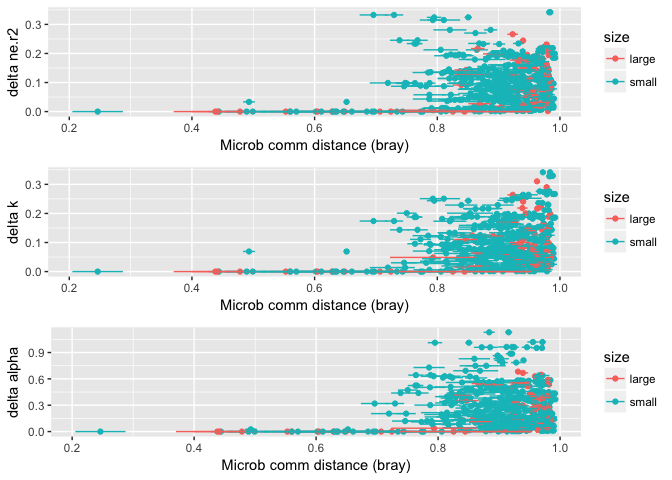
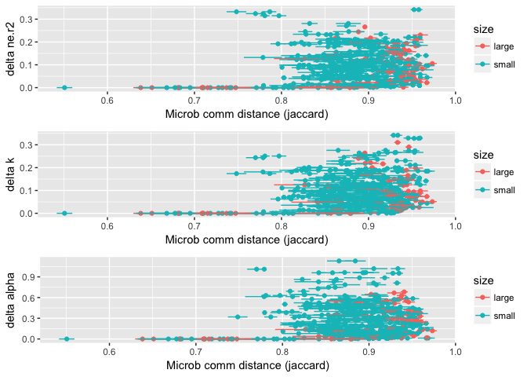
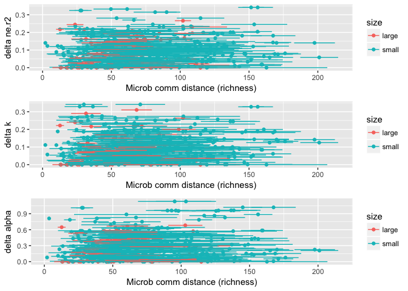
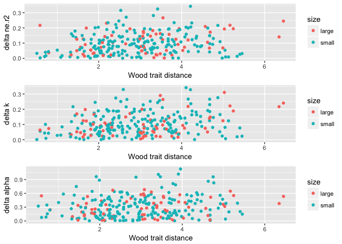

Initial community and wood distances versus decay parameter distances
================
Marissa Lee
10/26/2017

### Plot microbial community distances vs decay param distances between species+size

Community composition, bray

``` r
pList<-Make_commDistvDist_Fig(distType="bray", valueCol_vec=c("ne.r2","k","alpha"), seqSamples, stemSamples, comm.otu, spdf)
grid.arrange(pList[['ne.r2']], pList[['k']], pList[['alpha']])
```



Community composition, jaccard

``` r
pList<-Make_commDistvDist_Fig(distType="jaccard", valueCol_vec=c("ne.r2","k","alpha"), seqSamples, stemSamples, comm.otu, spdf)
grid.arrange(pList[['ne.r2']], pList[['k']], pList[['alpha']])
```



Richness

``` r
pList<-Make_commDistvDist_Fig(distType="richness", valueCol_vec=c("ne.r2","k","alpha"), seqSamples, stemSamples, comm.otu, spdf)
grid.arrange(pList[['ne.r2']], pList[['k']], pList[['alpha']])
```



Not a lot of information in initial mean microbial composition distance (bray or jaccard) about differences in species+size decay trajectories (communities are all really dissimilar). Likewise, richness is not useful.

### Plot wood trait distances vs decay param distances between species+size

``` r
pList<-Make_woodTraitDistvDist_Fig(valueCol_vec=c("ne.r2","k","alpha"), seqSamples, stemSamples, traits.mean, spdf)
grid.arrange(pList[['ne.r2']], pList[['k']], pList[['alpha']])
```



Seems like there is more information in inital wood trait distance about species+size decay trajectories than there is in the initial community composition/richness
