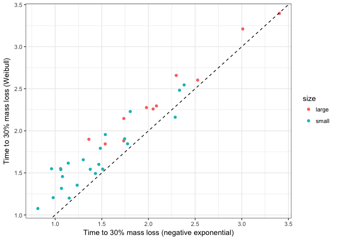
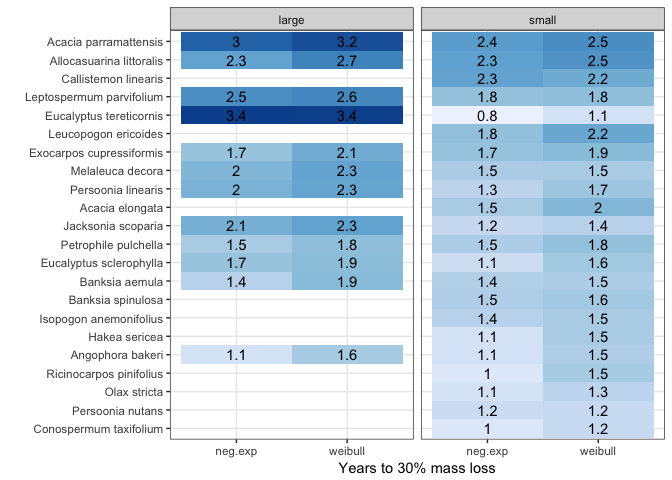
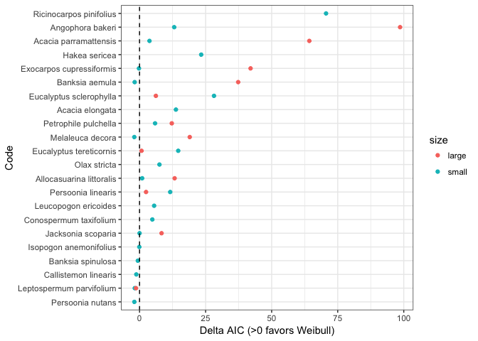
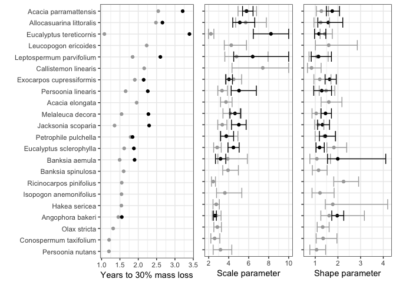
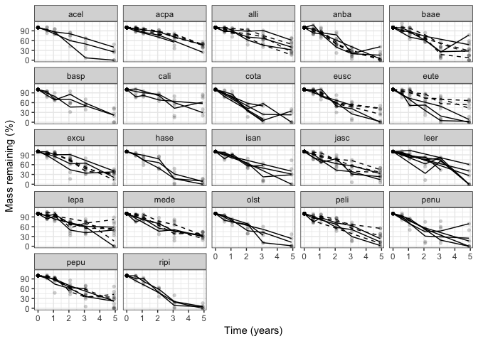

How do wood species and sizes vary in decay?
================
Marissa Lee
12/2/2018

``` r
#chunk options

knitr::opts_chunk$set(echo = FALSE, message=FALSE, warning=FALSE)
```

Load libraries, functions, data

Plot percent mass remaining (pmr) for each sample over time 

Calculate decay trajectory fits for each code (species+size)

For the weibull model, alpha = shape, beta = scale.

Compare the negative exp. vs weibull models by plotting time to 70% mass remaining (t70) for each species+size 

Another view... Figure S2. Comparison of negative exp and weibull models using t70 

Figure S3. Comparison of negative exp and weibull models using AIC 

Figure 1. Wood species x decay params (weibull model) 

Figure 2. Time x percent mass remaining

    ## [1]  0  7 13 25 37 59


