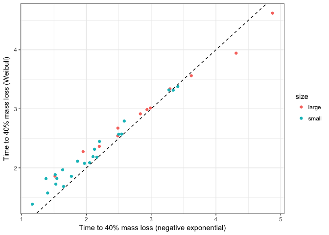

How do wood species and sizes vary in decay?
================
Marissa Lee
12/2/2018

Load libraries, functions, data

    ## calc_distances.R :
    ## calc_diversity.R :
    ## helper_fxns.R :
    ## load_decayData.R :
    ## load_microbeData.R :
    ## load_traitData.R :
    ## make_figs_decayPatterns.R :
    ## make_figs_woodTraits_explainDecay.R :
    ## make_summaryTables.R :
    ## shape_analysis_dataframes.R :

Plot percent mass remaining (pmr) for each sample over time 

Compare the negative exp. vs weibull models by plotting time to 70% mass remaining (t70) for each species+size 

Another view... Figure S2. Comparison of negative exp and weibull models using t70

Figure S3. Comparison of negative exp and weibull models using AIC

Figure 1. Wood species x decay params (weibull model)

    ## quartz_off_screen 
    ##                 2

Figure 2. Time x percent mass remaining

