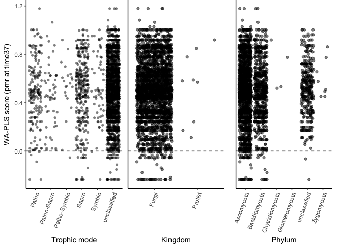
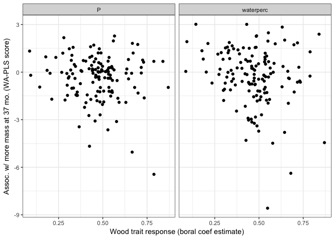
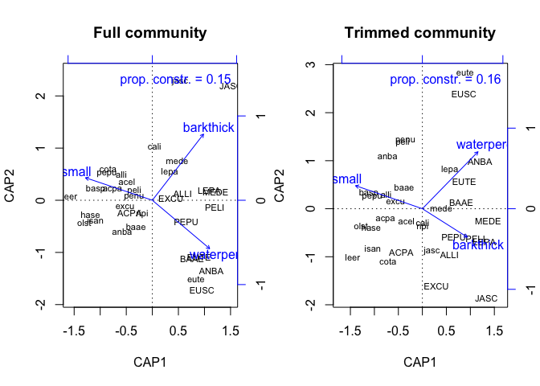
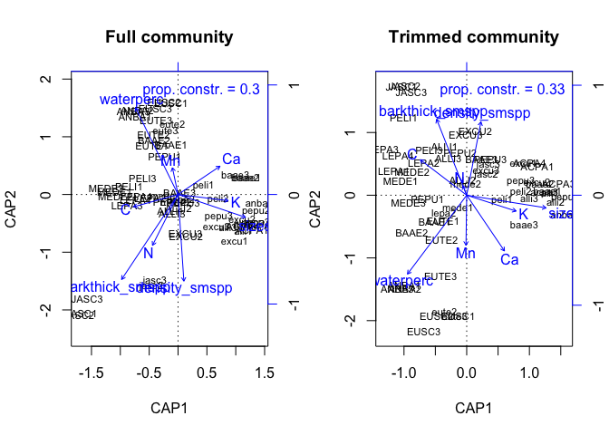

Does endophyte composition explain decay?
================
Marissa Lee
12/2/2018

Load libraries, functions, data

Figure S1. Sample-effort curves

Filter community matrix to include only taxa that are present in a least 20% of all the samples. This step removes taxa that may not contribute much to our understanding of the relationship between species’ multivariate abundance and environment.

    ## [1] "Keep 150 of 6128 OTUs"

*Hyp (species+size-level)* Species+size-level (average) initial microbial community composition will predict variation in decay model fit (r2), rate (t70, k), and lagginess (alpha).
-------------------------------------------------------------------------------------------------------------------------------------------------------------------------------------

None of the components are significant.

*Hyp (stem-level)* Stem-level initial microbial communitiy compositions will predict variation in percent mass loss, particularly in the early stages of decay.
---------------------------------------------------------------------------------------------------------------------------------------------------------------

Comp01 (of the non-trimmed community) is a significant predictor of percent mass remaining at 37 months.

Plot the distribution of WA-PLS scores 

Who is in the top and bottom 1%?

    ##        quant kingdom        phylum                    species Trophic.Mode
    ## 1  bottom 1%   Fungi    Ascomycota         Hormonema_viticola   Saprotroph
    ## 2  bottom 1%   Fungi Basidiomycota         Hyphodontia_radula   Saprotroph
    ## 3  bottom 1%   Fungi    Ascomycota     Neosetophoma_samarorum   Saprotroph
    ## 4  bottom 1%   Fungi    Ascomycota  Neophysalospora_eucalypti unclassified
    ## 5  bottom 1%   Fungi Basidiomycota      Bensingtonia_ingoldii   Saprotroph
    ## 6  bottom 1%   Fungi Basidiomycota   Pisolithus_croceorrhizus  Symbiotroph
    ## 7  bottom 1%   Fungi    Ascomycota  Mycosphaerella_excentrica   Pathotroph
    ## 8  bottom 1%   Fungi Basidiomycota      Mycetinis_scorodonius   Saprotroph
    ## 9  bottom 1%   Fungi Basidiomycota            Odontia_fibrosa   Saprotroph
    ## 10 bottom 1%   Fungi    Ascomycota     Acremonium_cavaraeanum unclassified
    ## 11 bottom 1%   Fungi    Ascomycota    Phaeomoniella_prunicola   Saprotroph
    ## 12    top 1%   Fungi    Ascomycota Debaryomyces_vindobonensis unclassified
    ## 13    top 1%   Fungi Basidiomycota       Septobasidium_burtii   Pathotroph
    ##                   Guild
    ## 1  Undefined Saprotroph
    ## 2  Undefined Saprotroph
    ## 3  Undefined Saprotroph
    ## 4          unclassified
    ## 5  Undefined Saprotroph
    ## 6       Ectomycorrhizal
    ## 7        Plant Pathogen
    ## 8  Undefined Saprotroph
    ## 9  Undefined Saprotroph
    ## 10         unclassified
    ## 11 Undefined Saprotroph
    ## 12         unclassified
    ## 13      Animal Pathogen

Many of the bottom 1% OTUs are classified as saprotrophs. That makes sense since low WA-PLS scores indicate an association with high mass loss (i.e. less mass remaining) at time37.

But saprotrophs are also found at many points along the gradient... 

Is this because there is an underlying signature of wood traits on the initial microbial community that is driving the relationship between the community and the mass remaining after 37 months? The next analysis ("Community+traits" as predictor) will test this formally. Just out of curiousity, I'd like to pull in OTU "niche" info from the boral analysis to see if there's a relationship between OTU WA-PLS scores and wood trait coeffient estimates.

Reminder of which wood traits were included in the best model to explain pmr at time37...

    ##            X            term      time13     time25       time37
    ## 1          1     (Intercept)     1.3 ***    1.2 ***      1.4 ***
    ## 2          2 barkthick_smspp        <NA>       <NA>         <NA>
    ## 3          3               C        <NA>       <NA>         <NA>
    ## 4          4              Fe        <NA>  -1.6e-05  -4.1e-05 ***
    ## 5          5               K        <NA>       <NA>    -3.7e-05 
    ## 6          6               N   -0.19 ***       <NA>         <NA>
    ## 7          7               P   0.00027 * 0.00056 **   0.00057 **
    ## 8          8       sizesmall   -0.11 ***  -0.099 **         <NA>
    ## 9          9       waterperc -0.0063 *** -0.011 ***   -0.017 ***
    ## 10        10              Zn   -0.00052   -0.00081          <NA>
    ## 11        11            <NA>        <NA>       <NA>         <NA>
    ## 12     Fstat           Fstat        12.9       9.91        15.32
    ## 13     numdf           numdf           5          5            4
    ## 14     dendf           dendf          48         46           46
    ## 15 r.squared       r.squared        0.57       0.52         0.57
    ##         time59      time7
    ## 1       -1.5 *    1.1 ***
    ## 2     -0.055 *       <NA>
    ## 3    0.055 ***       <NA>
    ## 4  -2.9e-05 **   8.3e-06 
    ## 5         <NA>  1.4e-05 *
    ## 6         <NA>   -0.098 *
    ## 7         <NA>       <NA>
    ## 8         <NA> -0.088 ***
    ## 9   -0.017 ***  -0.003 **
    ## 10        <NA>       <NA>
    ## 11        <NA>       <NA>
    ## 12       11.91       6.42
    ## 13           4          5
    ## 14          49         49
    ## 15        0.49        0.4

More water leads to less mass remaining; more P leads to more mass remaining

Plot OTU wood trait estimates (from boral) versus signif WA-PLS score.  There's a weak negative relationship between an OTU's WA-PLS score and waterperc coefficient (slope=-2.3, p=.03), suggesting that OTUs that "prefer" high-water niche space are associated with less mass remaining at time37.

########################################## 

Community+traits as a predictor
===============================

*Hyp (species+size-level)* After accounting for variation in decay due to wood traits, average initial microbial communitiy compositions will predict variation in decay model fit (r2), rate (t70, k), and lagginess (alpha).
------------------------------------------------------------------------------------------------------------------------------------------------------------------------------------------------------------------------------

Community data doesn't improve our understanding of decay rates (k, t70) or variation in decay rate (ne.r2) beyond what is known from the trait data.

*Hyp (stem-level)* After accounting for variation in decay due to wood traits (no models with density, includes small-species level bark thickness), stem-specific initial microbial communitiy compositions will predict variation in percent mass loss, particularly in the early stages of decay.
----------------------------------------------------------------------------------------------------------------------------------------------------------------------------------------------------------------------------------------------------------------------------------------------------

Community data doesn't improve our understanding of mass loss (pmr after 7, 13, 25, 37, and 59 months) beyond what is known from the trait data.

Relationship between wood traits and community
==============================================

*Hyp (species+size-level)* Initial microbial communitiy compositions will covary with initial wood traits
---------------------------------------------------------------------------------------------------------

Use ordistep to find the best combination of traits to constrain variation in the endophyte community 

Full community anova-like table

    ##                    term    df Fval  pval
    ## 1                  size  1.00 1.40 0.022
    ## 2             barkthick  1.00 1.60 0.007
    ## 3             waterperc  1.00 1.41 0.010
    ## 4              Residual 29.00   NA    NA
    ## 5                  <NA>    NA   NA    NA
    ## 6   Constrained inertia  1.91   NA    NA
    ## 7 Unconstrained inertia 11.16   NA    NA

Trimmed community anova-like table

    ##                    term    df Fval  pval
    ## 1                  size  1.00 1.67 0.015
    ## 2             waterperc  1.00 1.58 0.029
    ## 3             barkthick  1.00 1.54 0.043
    ## 4              Residual 29.00   NA    NA
    ## 5                  <NA>    NA   NA    NA
    ## 6   Constrained inertia  1.79   NA    NA
    ## 7 Unconstrained inertia  9.22   NA    NA

*Hyp (stem-level)* Average initial microbial communitiy compositions will covary with initial wood traits
---------------------------------------------------------------------------------------------------------

Full community anova-like table

    ##                     term    df Fval  pval
    ## 1        barkthick_smspp  1.00 2.33 0.001
    ## 2              waterperc  1.00 1.99 0.001
    ## 3                   size  1.00 2.13 0.001
    ## 4                     Ca  1.00 1.91 0.001
    ## 5          density_smspp  1.00 1.97 0.001
    ## 6                      C  1.00 1.96 0.001
    ## 7                      N  1.00 2.02 0.001
    ## 8                     Mn  1.00 1.62 0.004
    ## 9                      K  1.00 1.60 0.003
    ## 10              Residual 47.00   NA    NA
    ## 11                  <NA>    NA   NA    NA
    ## 12   Constrained inertia  7.55   NA    NA
    ## 13 Unconstrained inertia 17.37   NA    NA

Trimmed community anova-like table

    ##                     term    df Fval  pval
    ## 1              waterperc  1.00 2.37 0.001
    ## 2                   size  1.00 2.60 0.001
    ## 3                      C  1.00 2.70 0.001
    ## 4        barkthick_smspp  1.00 2.64 0.001
    ## 5                      N  1.00 2.02 0.001
    ## 6                      K  1.00 1.59 0.019
    ## 7                     Ca  1.00 1.93 0.005
    ## 8          density_smspp  1.00 1.68 0.010
    ## 9                     Mn  1.00 1.61 0.021
    ## 10              Residual 47.00   NA    NA
    ## 11                  <NA>    NA   NA    NA
    ## 12   Constrained inertia  7.18   NA    NA
    ## 13 Unconstrained inertia 14.86   NA    NA
