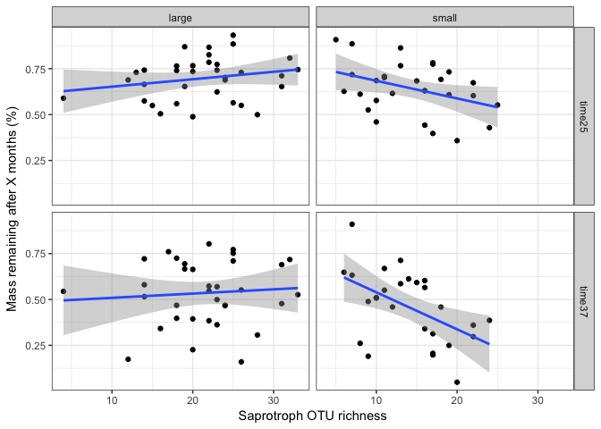
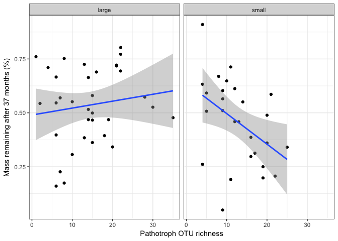
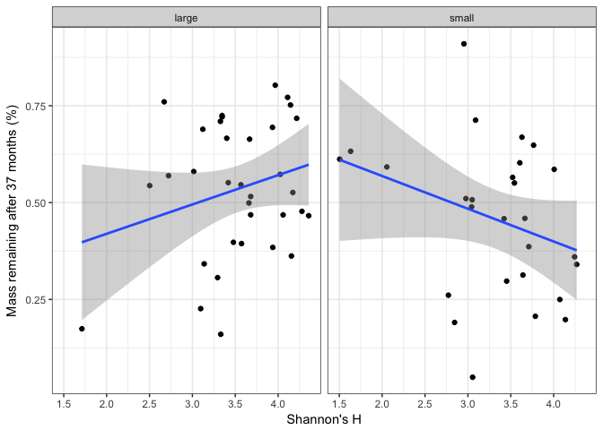
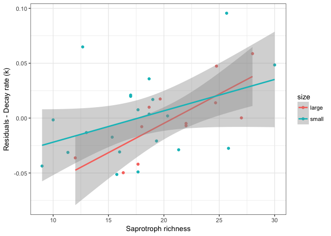
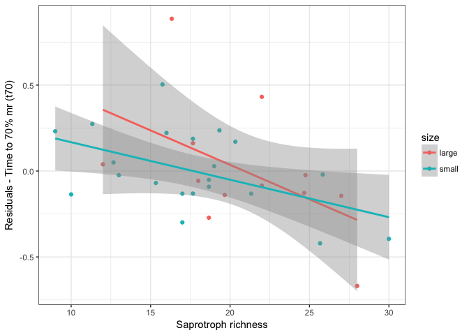
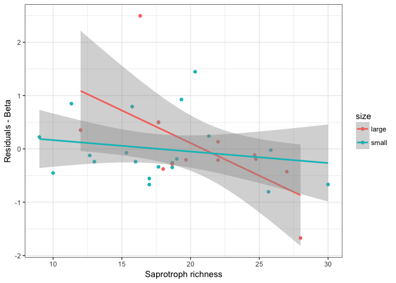
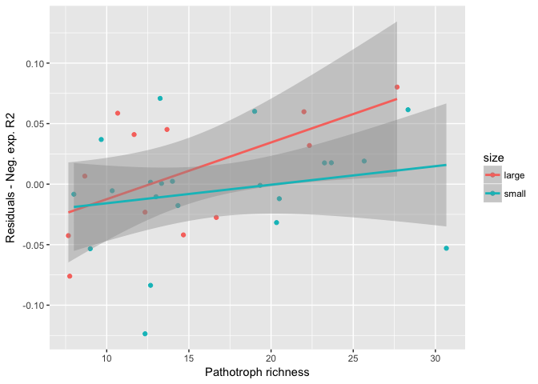
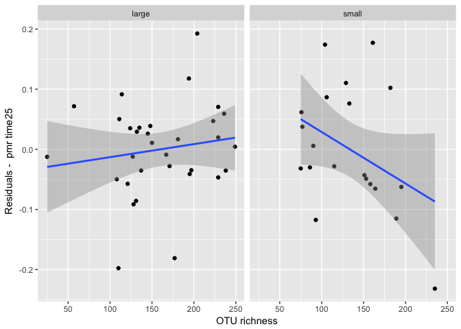
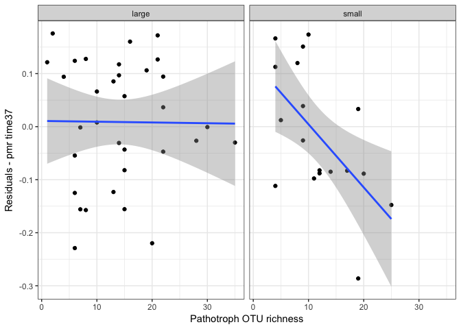

Does endophyte diversity explain decay?
================
Marissa Lee
12/2/2018

Load libraries, functions, data

Diversity (and diversity of specific clades) as a predictor
===========================================================

**Note that the full community matrix was used for these analyses**

*Hyp-a (species+size-level)* Greater microbial diversity (richness, Shannon diversity, ... add phylogenetic diversity) will lead to better-fitting decay models (ne.r2), faster decay (k), and less lagginess (alpha) because of the selection effect for fast decayers and complementarity among taxa for decay.
-----------------------------------------------------------------------------------------------------------------------------------------------------------------------------------------------------------------------------------------------------------------------------------------------------------------

Hyp-Alt: Greater microbial diversity will lead to worse-fitting decay models (ne.r2), slower decay (k), and more lagginess (alpha) because taxa will be allocating more of their resources to combat one another. \#\# *Hyp-b (species+size-level)* Greater saprotroph and basidiomycete richness will lead to better-fitting decay models (ne.r2), faster decay (k), and less lagginess (alpha) because the community does not need to wait for the arrival of key decayers to act on the wood substrate.
Hyp-Alt: Greater saprotroph and basidiomycete richness will lead to worse-fitting decay models (ne.r2), slower decay (k), and more lagginess (alpha) because decayers will be allocating more of their resources to combat one another. \#\# *Hyp-c (species+size-level)* Greater pathogen and oomycete richness will lead to worse-fitting decay models (ne.r2), slower decay (k), and more lagginess (alpha) because the presence of these organisms will inhibit the establishment and activity of decayers.

    ##        term     source respvar     coef signif
    ## 1 sizesmall Patho.rich   alpha  -0.56 *   TRUE
    ## 2 sizesmall  Oomy.rich     t70  -0.52 *   TRUE
    ## 3 sizesmall  Oomy.rich   w.t70 -0.58 **   TRUE

The only term that is significant in these models is size class. Small stems had significantly fewer pathotroph taxa and oomycete taxa.

*Hyp-a (stem-level)* Greater microbial diversity (richness, Shannon diversity, ... add phylogenetic diversity) will lead to less mass remaining esp. at early time steps because of the selection effect for fast decayers and complementarity among taxa for decay.
--------------------------------------------------------------------------------------------------------------------------------------------------------------------------------------------------------------------------------------------------------------------

Hyp-Alt: Greater microbial diversity will lead to more mass remaining because taxa will be allocating more of their resources to combat one another. \#\# *Hyp-b (stem-level)* Greater saprotroph and basidiomycete richness will lead to less mass remaining esp. at early time steps because the community does not need to wait for the arrival of key decayers to act on the wood substrate.
Hyp-Alt: Greater saprotroph and basidiomycete richness will lead to more mass remaining because decayers will be allocating more of their resources to combat one another. \#\# *Hyp-c (stem-level)* Greater pathogen and oomycete richness will lead to more mass remaining because the presence of these organisms will inhibit the establishment and activity of decayers.

    ##                  term     source respvar       coef signif
    ## 1           sizesmall  Oomy.rich  time13 -0.078 ***   TRUE
    ## 2  sizesmall:sub_rich   Richness  time25  -0.0014 *   TRUE
    ## 3            sub_rich   Richness  time25  0.00087 *   TRUE
    ## 4            sub_rich  ShannonsH  time25    0.081 *   TRUE
    ## 5  sizesmall:sub_rich Sapro.rich  time25   -0.014 *   TRUE
    ## 6            sub_rich  Oomy.rich  time25      0.1 *   TRUE
    ## 7  sizesmall:sub_rich   Richness  time37  -0.0018 *   TRUE
    ## 8  sizesmall:sub_rich  ShannonsH  time37    -0.16 *   TRUE
    ## 9  sizesmall:sub_rich Sapro.rich  time37   -0.022 *   TRUE
    ## 10 sizesmall:sub_rich Patho.rich  time37   -0.017 *   TRUE
    ## 11          sizesmall  Oomy.rich   time7  -0.046 **   TRUE

Saprotroph OTU richness is associated with percent mass remaining at time25 and time37. Pathogen OTU richness and Shannon's H are associated with pmr at time 37. In all cases, there is a negative interaction between stem size and diversity.

Plot the relationship between saprotroph OTU richness and pmr at time25 and time37 

More saprotrophs leads to less mass remaining - but only in small stems.

Plot the relationship between pathogen OTU richness and pmr at time37 

More pathotrophs leads to less mass remaining - but only in small stems.

Plot the relationship between Shannon's H and pmr at time37 

Higher Shannon's H leads to less mass remaining in small stems, more mass remaining in large stems... but these are pretty weak relationships.

############################################## 

Diversity plus traits as a predictor
====================================

*Hyp (species+size-level)* After accounting for variation in decay due to wood traits, average initial microbial diversity (richness, Shannon diversity, ... add phylogenetic diversity) will predict variation in decay model fit (r2), rate (k), and lagginess (alpha).
-------------------------------------------------------------------------------------------------------------------------------------------------------------------------------------------------------------------------------------------------------------------------

    ##   term     source respvar     coef signif
    ## 1 mean Sapro.rich    beta -0.12 **   TRUE
    ## 2 mean Sapro.rich       k 0.0053 *   TRUE
    ## 3 mean Patho.rich   ne.r2 0.0047 *   TRUE
    ## 4 mean Sapro.rich     t70  -0.04 *   TRUE

Beyond wood trait data, saprotroph richness improves models for k and t70. In addition, pathotroph richness improves the model for ne.r2.

Plot the relationship between Saprotroph richness and k 

Higher saprotroph richness leads to faster decay than would be expected based on wood traits alone.

Plot the relationship between Saprotroph richness and t70 

Higher saprotroph richness leads to shorter times to 70% mass remaining than would be expected based on wood traits alone.

Plot the relationship between Saprotroph richness and beta 

Higher saprotroph richness leads to shorter times to 70% mass remaining than would be expected based on wood traits alone.

Plot the relationship between Pathotroph richness and ne.r2 

Higher pathotroph richness leads to better-fitting decay models than would be expected based on wood traits alone.

*Hyp (stem-level)* After accounting for variation in decay due to wood traits, initial microbial diversity (richness, Shannon diversity, ... add phylogenetic diversity) will predict variation in percent mass loss, esp. at early time points.
------------------------------------------------------------------------------------------------------------------------------------------------------------------------------------------------------------------------------------------------

    ##                 term     source respvar      coef signif
    ## 1 sizesmall:sub_rich   Richness  time13 0.00075 *   TRUE
    ## 2 sizesmall:sub_rich   Richness  time25 -0.0011 *   TRUE
    ## 3           sub_rich  Oomy.rich  time25   0.076 *   TRUE
    ## 4 sizesmall:sub_rich Patho.rich  time37  -0.012 *   TRUE
    ## 5          sizesmall Sapro.rich  time59   -0.25 *   TRUE
    ## 6 sizesmall:sub_rich Sapro.rich  time59   0.013 *   TRUE
    ## 7 sizesmall:sub_rich  Oomy.rich   time7   -0.09 *   TRUE

Overall OTU richness improves model estimates for percent mass remaining at 25 months. Pathotroph richness improves model estmates for pmr at 37 months.

Plot the relationship between OTU richness and residuals of pmr at time25 

In small stems, more fungal OTUs leads to less mass remaining after 25 months than would be expected based on wood traits alone. This relationship looks heavily influenced by 1 outlier w/ high OTU richness

Plot the relationship between Pathotroph OTU richness and residuals of pmr at time37 

In small stems, more pathotrophs leads to less mass remaining after 37 months than would be expected based on wood traits alone.
