Do wood traits explain decay?
================
Marissa Lee
12/2/2018

Load libraries and functions

    ## calc_distances.R :
    ## calc_diversity.R :
    ## helper_fxns.R :
    ## load_decayData.R :
    ## load_microbeData.R :
    ## load_traitData.R :
    ## make_figs_decayPatterns.R :
    ## make_figs_endoComp_explainDecay.R :
    ## make_figs_endoDiv_explainDecay.R :
    ## make_figs_woodTraits_explainDecay.R :
    ## make_summaryTables.R :
    ## roleOf_traits_on_fungi.R :
    ## shape_analysis_dataframes.R :

Load decay data and wood trait data

Initalize lists to store results

# Slice 1: Exclude C fraction data

We expect initial wood traits will explain varitation in species+size
decay rate (k and t70), species+size lagginess (alpha), and stem-level
percent mass remaining at 7, 13, 25, and 37 months of decay.
Specifically, we expect samples with (a) high water percent, (b) low
density and total C, (c) high macro and micro nutrients, and (d) thicker
bark (potential mech: limiting microbial colonization) to have faster
decay and less
lagginess.

## *Hyp (species+size-level)* Species+size-level initial wood traits will predict variation decay rates and lagginess.

Compile “code-level” trait data. Check out correlations among traits and
produce bivariate plots.

Use model selection to determine which traits to include and summarize
the final models.
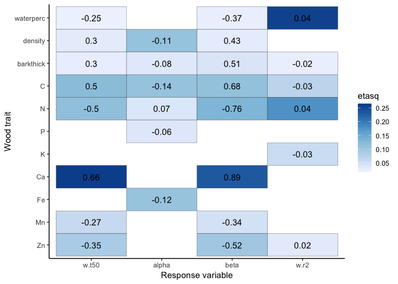<!-- -->

    ##   respvar r.squared
    ## 1   w.t50      0.71
    ## 2   alpha      0.47
    ## 3    beta      0.71
    ## 4    w.r2      0.52

  - Model fits: The best fitting models used traits to explain k, t50,
    beta, w.t50 (all with R2 \> 0.70). The worst fitting model used
    traits to explain ne.r2 with R2 = 0.46.

  - Water content was the most influential trait on time to 50% mass
    loss; more water was associated with short wait times. The role of
    water mainly appeared to influence the shape parameter; more water
    led to less s-shaped decay trajectories.
    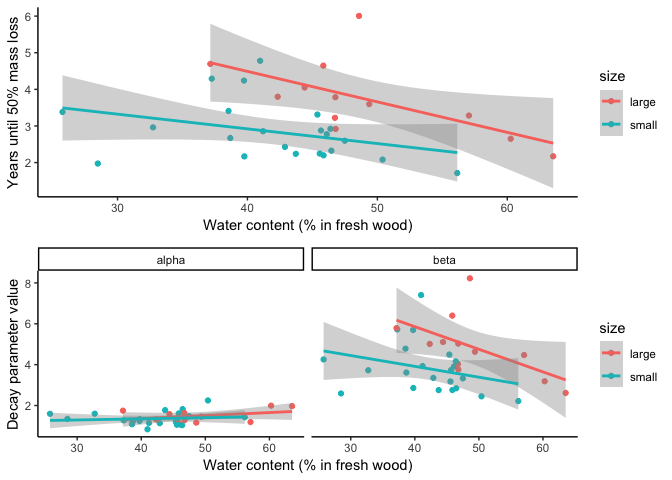<!-- -->

  - Ca concentration had a large influence on the shape parameter; more
    Ca led to more S-shaped decay trajectories. The model also suggests
    that more N led to less S-shaped trajectories (albeit N accounted
    for a smaller proportion of total variance explained than Ca)
    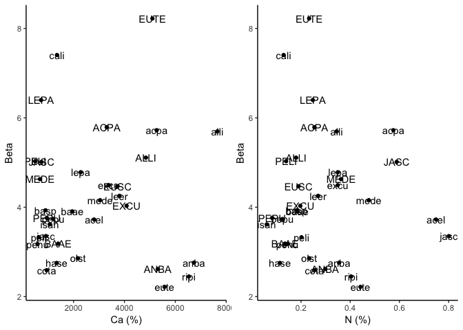<!-- -->

  - The largest influence on alpha was diameter size; large sized stems
    tended to decay at a faster rate, but see EUSC and EUTE. Also note
    the influence of the shape parameter in the decay model means that
    large stems take more time to lose 50% mass (opposite of what you’d
    expect)
    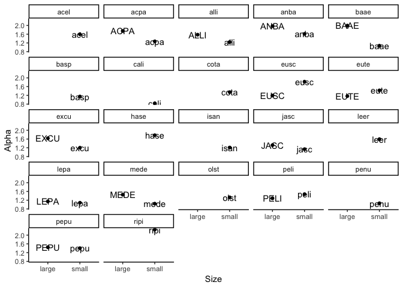<!-- -->

Save the
plots

## *Hyp (stem-level)* Stem-level initial wood traits will predict variation in percent mass loss at each time step.

First, we need to decide what trait data (and samples) to include in
this analysis since we don’t have full coverage of stem-level trait
data. Density and bark thickness were only measured on small sized
stems. If there is not be very much within-species variation in these
traits that contribute to variation in percent mass loss than we can
justify including species-level estimates of these traits in the
stem-level model.

Plot the small-sized stem-level measures of density and barkthick

    ## quartz_off_screen 
    ##                 2

A few species have a relatively large amount of within-species variation
in density (i.e. alli) and barkthickness (i.e. leer and cota).

Compare model fits (r2) using stem and species-level data to identify
how much information about percent mass remaining is lost by using
species-level estimates.

    ##                       mod       pval source      meas
    ## time7.1   fitted(M1) ~ M2 0.22763856  time7   density
    ## time7.2   fitted(M2) ~ M1 0.01454204  time7   density
    ## time13.1  fitted(M1) ~ M2 0.52899319 time13   density
    ## time13.2  fitted(M2) ~ M1 0.18583285 time13   density
    ## time25.1  fitted(M1) ~ M2 0.60081755 time25   density
    ## time25.2  fitted(M2) ~ M1 0.76919241 time25   density
    ## time37.1  fitted(M1) ~ M2 0.69863046 time37   density
    ## time37.2  fitted(M2) ~ M1 0.75422808 time37   density
    ## time59.1  fitted(M1) ~ M2 0.25212110 time59   density
    ## time59.2  fitted(M2) ~ M1 0.01881453 time59   density
    ## time7.11  fitted(M1) ~ M2 0.70557781  time7 barkthick
    ## time7.21  fitted(M2) ~ M1 0.90907489  time7 barkthick
    ## time13.11 fitted(M1) ~ M2 0.04423876 time13 barkthick
    ## time13.21 fitted(M2) ~ M1 0.51560418 time13 barkthick
    ## time25.11 fitted(M1) ~ M2 0.11620024 time25 barkthick
    ## time25.21 fitted(M2) ~ M1 0.61127201 time25 barkthick
    ## time37.11 fitted(M1) ~ M2 0.38828743 time37 barkthick
    ## time37.21 fitted(M2) ~ M1 0.75244608 time37 barkthick
    ## time59.11 fitted(M1) ~ M2 0.19239411 time59 barkthick
    ## time59.21 fitted(M2) ~ M1 0.89110070 time59 barkthick

Remember M1 = stem and M2 = code - For density – Stem-level data (M1)
improves estimates of pmr after 7 and 59 months - For barkthickness –
Stem-level data (relative to code-level data) does not improve estimates
of pmr at any time point.

Compile “stem-level” trait data using (a) stem-level traits including
waterperc and chemistry and (b) small species-level density and bark
thickness data. Check out correlations among traits and produce
bivariate plots.

Use model selection to determine which traits to include and summarize
the final models.
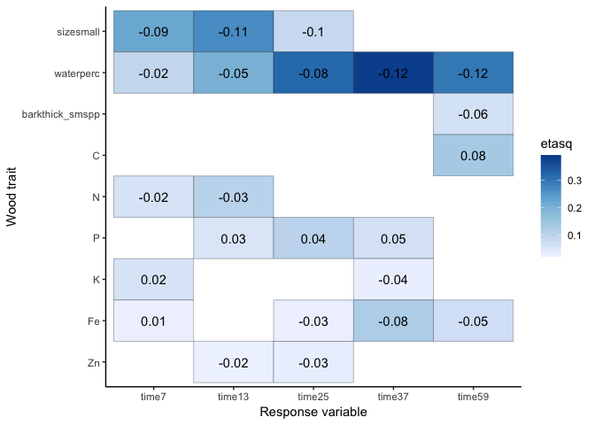<!-- -->

  - Model fits: Models at mid time points tend to fit better, all models
    had R2 ~ 50%
  - Water content was the most influential trait, especially for
    explaining mass loss at mid to late decay stages (25-59 months);
    More water led to lower percent mass remaining
  - Size was also influential, especially for explaining mass loss at
    earlier decay stages (7 and 13 months); large stems had greater
    percent mass remaining during early time points
    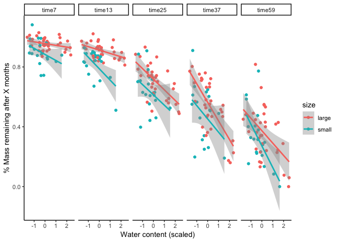<!-- -->

Save the
plots

# Slice 2: Include C fraction data (and exclude small stems)

## *Hyp (species+size-level)* Species+size-level initial C fractions will predict variation decay rates and lagginess.

Compile “code-level” C fraction trait data. Check out correlations among
traits and produce bivariate plots.

    ## [1] 0

Use model selection to determine which Cfracts to include and summarize
the final models.
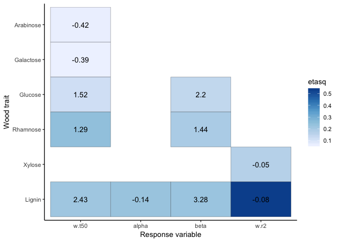<!-- -->

    ##   respvar r.squared
    ## 1   w.t50      0.52
    ## 2   alpha      0.23
    ## 3    beta      0.39
    ## 4    w.r2      0.66

  - Model fits: Over 50% of variance in decay R2 and time to 50% mass
    loss was explained by C fractions. Less more explanatory power for
    beta than alpha.

  - Lignin was the most influential trait, especially for model fit;
    less lignin led to better fitting models. More lignin led to longer
    wait times, slower decay rates (alpha), and more S-shaped decay
    (beta).
    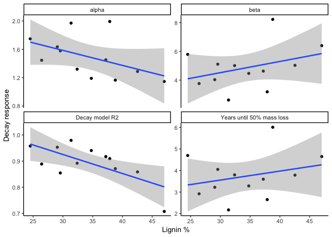<!-- -->

  - Rhamnose and Glucose were important in explaining variance in wait
    times and the shape parameter beta. More rhamanose and glucose led
    to longer wait times and more s-shaped decay trajectories.
    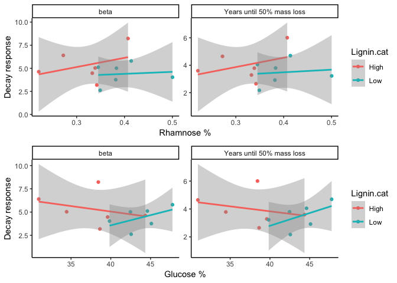<!-- -->

Save the plots

Investigate what happens if I just include waterperc, lignin, and
rhamnose, and glucose; use model selection to determine which to include
and summarize the final models.

    ## Start:  AIC=-14.43
    ## w.t50 ~ waterperc + Lignin + Rhamnose + Glucose + Ca
    ## 
    ##             Df Sum of Sq    RSS      AIC
    ## <none>                   1.3261 -14.4321
    ## - Rhamnose   1    0.4483 1.7744 -12.9376
    ## - Glucose    1    0.9369 2.2630 -10.0184
    ## - Ca         1    2.1545 3.4806  -4.8524
    ## - Lignin     1    2.2597 3.5858  -4.4950
    ## - waterperc  1    5.8149 7.1410   3.7713
    ## Start:  AIC=-26.36
    ## alpha ~ waterperc + Lignin + Rhamnose + Glucose + Ca
    ## 
    ##             Df Sum of Sq     RSS     AIC
    ## - Lignin     1  0.003401 0.49425 -28.276
    ## - Rhamnose   1  0.009235 0.50008 -28.135
    ## - Glucose    1  0.010113 0.50096 -28.114
    ## - Ca         1  0.013381 0.50423 -28.036
    ## <none>                   0.49084 -26.358
    ## - waterperc  1  0.234963 0.72581 -23.665
    ## 
    ## Step:  AIC=-28.28
    ## alpha ~ waterperc + Rhamnose + Glucose + Ca
    ## 
    ##             Df Sum of Sq     RSS     AIC
    ## - Ca         1  0.014862 0.50911 -29.920
    ## - Rhamnose   1  0.060176 0.55442 -28.897
    ## <none>                   0.49425 -28.276
    ## - Glucose    1  0.245839 0.74008 -25.431
    ## - waterperc  1  0.253498 0.74774 -25.307
    ## 
    ## Step:  AIC=-29.92
    ## alpha ~ waterperc + Rhamnose + Glucose
    ## 
    ##             Df Sum of Sq     RSS     AIC
    ## - Rhamnose   1  0.045374 0.55448 -30.895
    ## <none>                   0.50911 -29.920
    ## - Glucose    1  0.231351 0.74046 -27.425
    ## - waterperc  1  0.250957 0.76006 -27.111
    ## 
    ## Step:  AIC=-30.9
    ## alpha ~ waterperc + Glucose
    ## 
    ##             Df Sum of Sq     RSS     AIC
    ## <none>                   0.55448 -30.895
    ## - waterperc  1   0.21798 0.77246 -28.917
    ## - Glucose    1   0.27443 0.82891 -28.071
    ## Start:  AIC=-3.02
    ## beta ~ waterperc + Lignin + Rhamnose + Glucose + Ca
    ## 
    ##             Df Sum of Sq     RSS     AIC
    ## <none>                    3.4322 -3.0203
    ## - Rhamnose   1    0.7857  4.2179 -2.5468
    ## - Glucose    1    1.5230  4.9553 -0.6135
    ## - Ca         1    4.2426  7.6748  4.6365
    ## - Lignin     1    4.4330  7.8653  4.9306
    ## - waterperc  1   11.1830 14.6152 12.3659
    ## Start:  AIC=-71.57
    ## w.r2 ~ waterperc + Lignin + Rhamnose + Glucose + Ca
    ## 
    ##             Df Sum of Sq      RSS     AIC
    ## - Ca         1 0.0004831 0.011828 -73.067
    ## - Lignin     1 0.0009816 0.012326 -72.571
    ## <none>                   0.011345 -71.567
    ## - Rhamnose   1 0.0057164 0.017061 -68.670
    ## - Glucose    1 0.0062077 0.017552 -68.330
    ## - waterperc  1 0.0145289 0.025873 -63.673
    ## 
    ## Step:  AIC=-73.07
    ## w.r2 ~ waterperc + Lignin + Rhamnose + Glucose
    ## 
    ##             Df Sum of Sq      RSS     AIC
    ## - Lignin     1 0.0008606 0.012688 -74.224
    ## <none>                   0.011828 -73.067
    ## - Rhamnose   1 0.0052911 0.017119 -70.630
    ## - Glucose    1 0.0057865 0.017614 -70.288
    ## - waterperc  1 0.0153322 0.027160 -65.091
    ## 
    ## Step:  AIC=-74.22
    ## w.r2 ~ waterperc + Rhamnose + Glucose
    ## 
    ##             Df Sum of Sq      RSS     AIC
    ## <none>                   0.012688 -74.224
    ## - Rhamnose   1 0.0079358 0.020624 -70.394
    ## - waterperc  1 0.0145803 0.027269 -67.043
    ## - Glucose    1 0.0246509 0.037339 -63.271

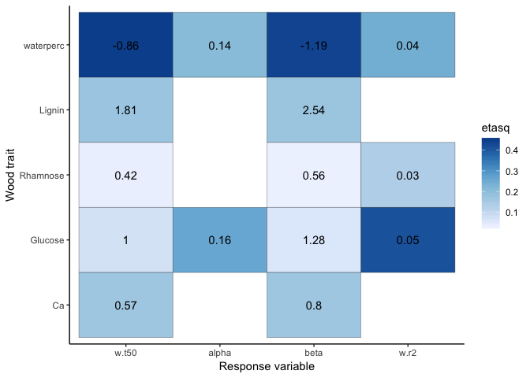<!-- -->

    ##   respvar r.squared
    ## 1   w.t50      0.89
    ## 2   alpha      0.43
    ## 3    beta      0.86
    ## 4    w.r2      0.77

  - Contribution of water content and lignin to explaining variation in
    wait time and the shape parameter beta
    <!-- -->

## *Hyp (stem-level)* Stem-level initial C fractions will predict variation in percent mass loss at each time step.

Compile “stem-level” C fraction trait data. Check out correlations among
traits and produce bivariate plots.

    ## [1] 0

Use model selection to determine which Cfracts to include and summarize
the final models.
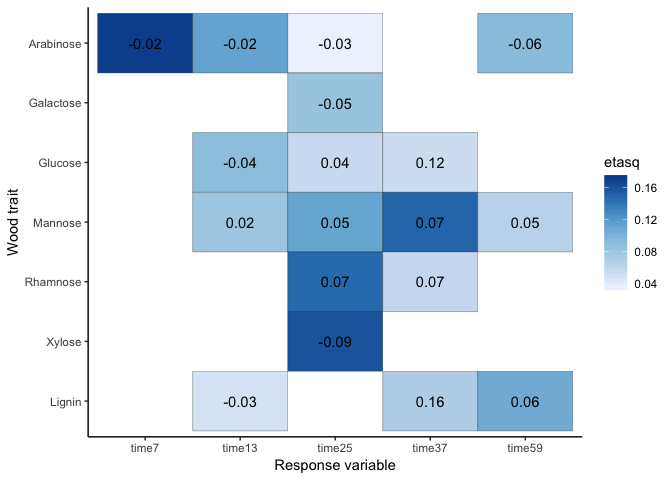<!-- -->

    ##   respvar r.squared
    ## 1   time7      0.17
    ## 2  time13      0.24
    ## 3  time25      0.45
    ## 4  time37      0.25
    ## 5  time59      0.22

  - Model fits: Relatively poor model fits. Maximum R2 is 0.45 and that
    is for time25. Minimum R2 is .17 which is for time7

  - Arabinose is the only influential fraction for time7; more arabinose
    led to less mass remaining. Looking at the plot, this is could be
    driven by the high arabinose low mass remaining point…
    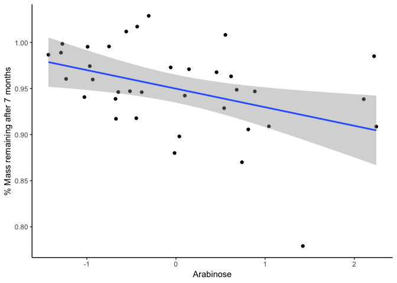<!-- -->

  - Xylose is the most influential fraction for time25; more xylose led
    to less mass remaining. Rhamnose was also influential at this time
    point; more rhamnose led to more mass remaining.
    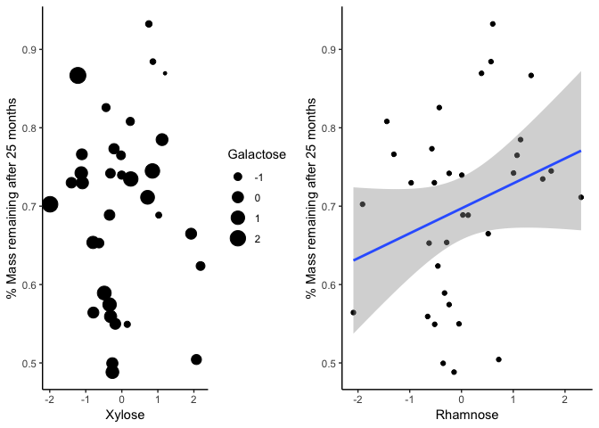<!-- -->

  - Mannose was the most influential fraction for time 37; more mannose
    led to more mass remaining.
    <!-- -->

  - Lignin was the most influential fraction for time59 (and was
    generally more informative at the last two time points); more lignin
    led to more mass remaining.

Save the plots

Investigate what happens if I just include waterperc, lignin, arabinose,
and rhamnose; use model selection to determine which to include and
summarize the final models.

    ## Start:  AIC=-219.7
    ## curr.pmr ~ Lignin + Arabinose + Rhamnose + waterperc + Ca + N
    ## 
    ##             Df Sum of Sq      RSS     AIC
    ## - N          1 0.0000492 0.035235 -221.65
    ## - Lignin     1 0.0003370 0.035523 -221.37
    ## - Ca         1 0.0012293 0.036415 -220.53
    ## <none>                   0.035186 -219.70
    ## - Arabinose  1 0.0023016 0.037487 -219.54
    ## - Rhamnose   1 0.0027264 0.037912 -219.16
    ## - waterperc  1 0.0082994 0.043485 -214.50
    ## 
    ## Step:  AIC=-221.65
    ## curr.pmr ~ Lignin + Arabinose + Rhamnose + waterperc + Ca
    ## 
    ##             Df Sum of Sq      RSS     AIC
    ## - Lignin     1 0.0003092 0.035544 -223.35
    ## - Ca         1 0.0012064 0.036441 -222.51
    ## <none>                   0.035235 -221.65
    ## - Rhamnose   1 0.0027812 0.038016 -221.07
    ## - Arabinose  1 0.0038814 0.039116 -220.10
    ## - waterperc  1 0.0083448 0.043579 -216.42
    ## 
    ## Step:  AIC=-223.35
    ## curr.pmr ~ Arabinose + Rhamnose + waterperc + Ca
    ## 
    ##             Df Sum of Sq      RSS     AIC
    ## - Ca         1 0.0015036 0.037048 -223.94
    ## <none>                   0.035544 -223.35
    ## - Rhamnose   1 0.0024855 0.038029 -223.06
    ## - Arabinose  1 0.0044062 0.039950 -221.38
    ## - waterperc  1 0.0097713 0.045315 -217.10
    ## 
    ## Step:  AIC=-223.95
    ## curr.pmr ~ Arabinose + Rhamnose + waterperc
    ## 
    ##             Df Sum of Sq      RSS     AIC
    ## - Rhamnose   1 0.0013473 0.038395 -224.73
    ## <none>                   0.037048 -223.94
    ## - Arabinose  1 0.0061713 0.043219 -220.71
    ## - waterperc  1 0.0084497 0.045497 -218.96
    ## 
    ## Step:  AIC=-224.73
    ## curr.pmr ~ Arabinose + waterperc
    ## 
    ##             Df Sum of Sq      RSS     AIC
    ## <none>                   0.038395 -224.73
    ## - waterperc  1 0.0076655 0.046060 -220.54
    ## - Arabinose  1 0.0081249 0.046520 -220.20
    ## Start:  AIC=-198.46
    ## curr.pmr ~ Lignin + Arabinose + Rhamnose + waterperc + Ca + N
    ## 
    ##             Df Sum of Sq      RSS     AIC
    ## - N          1 0.0003543 0.053134 -200.24
    ## - Rhamnose   1 0.0007414 0.053521 -200.00
    ## - Ca         1 0.0015849 0.054365 -199.48
    ## - Arabinose  1 0.0032870 0.056067 -198.47
    ## <none>                   0.052780 -198.46
    ## - Lignin     1 0.0075209 0.060301 -196.06
    ## - waterperc  1 0.0260210 0.078801 -187.23
    ## 
    ## Step:  AIC=-200.24
    ## curr.pmr ~ Lignin + Arabinose + Rhamnose + waterperc + Ca
    ## 
    ##             Df Sum of Sq      RSS     AIC
    ## - Rhamnose   1 0.0012619 0.054396 -201.46
    ## - Ca         1 0.0015164 0.054651 -201.31
    ## <none>                   0.053134 -200.24
    ## - Arabinose  1 0.0067077 0.059842 -198.31
    ## - Lignin     1 0.0081984 0.061333 -197.50
    ## - waterperc  1 0.0257784 0.078913 -189.19
    ## 
    ## Step:  AIC=-201.46
    ## curr.pmr ~ Lignin + Arabinose + waterperc + Ca
    ## 
    ##             Df Sum of Sq      RSS     AIC
    ## - Ca         1 0.0026000 0.056996 -201.92
    ## <none>                   0.054396 -201.46
    ## - Arabinose  1 0.0054572 0.059853 -200.31
    ## - Lignin     1 0.0069504 0.061347 -199.50
    ## - waterperc  1 0.0272313 0.081627 -190.07
    ## 
    ## Step:  AIC=-201.92
    ## curr.pmr ~ Lignin + Arabinose + waterperc
    ## 
    ##             Df Sum of Sq      RSS     AIC
    ## <none>                   0.056996 -201.92
    ## - Lignin     1 0.0048332 0.061829 -201.24
    ## - Arabinose  1 0.0062254 0.063222 -200.50
    ## - waterperc  1 0.0246569 0.081653 -192.06
    ## Start:  AIC=-145.83
    ## curr.pmr ~ Lignin + Arabinose + Rhamnose + waterperc + Ca + N
    ## 
    ##             Df Sum of Sq     RSS     AIC
    ## - Arabinose  1  0.000004 0.21680 -147.82
    ## - N          1  0.000227 0.21702 -147.79
    ## - Ca         1  0.002725 0.21952 -147.43
    ## - Rhamnose   1  0.011554 0.22835 -146.16
    ## - Lignin     1  0.013007 0.22980 -145.96
    ## <none>                   0.21680 -145.82
    ## - waterperc  1  0.169671 0.38647 -129.33
    ## 
    ## Step:  AIC=-147.82
    ## curr.pmr ~ Lignin + Rhamnose + waterperc + Ca + N
    ## 
    ##             Df Sum of Sq     RSS     AIC
    ## - N          1  0.000298 0.21710 -149.78
    ## - Ca         1  0.002788 0.21959 -149.42
    ## - Rhamnose   1  0.013130 0.22993 -147.94
    ## - Lignin     1  0.013203 0.23000 -147.93
    ## <none>                   0.21680 -147.82
    ## - waterperc  1  0.170321 0.38712 -131.27
    ## 
    ## Step:  AIC=-149.78
    ## curr.pmr ~ Lignin + Rhamnose + waterperc + Ca
    ## 
    ##             Df Sum of Sq     RSS     AIC
    ## - Ca         1  0.002972 0.22007 -151.35
    ## - Lignin     1  0.012996 0.23009 -149.92
    ## - Rhamnose   1  0.013088 0.23019 -149.91
    ## <none>                   0.21710 -149.78
    ## - waterperc  1  0.174187 0.39128 -132.93
    ## 
    ## Step:  AIC=-151.35
    ## curr.pmr ~ Lignin + Rhamnose + waterperc
    ## 
    ##             Df Sum of Sq     RSS     AIC
    ## - Lignin     1  0.011139 0.23121 -151.77
    ## <none>                   0.22007 -151.35
    ## - Rhamnose   1  0.016896 0.23697 -150.98
    ## - waterperc  1  0.177273 0.39734 -134.44
    ## 
    ## Step:  AIC=-151.77
    ## curr.pmr ~ Rhamnose + waterperc
    ## 
    ##             Df Sum of Sq     RSS     AIC
    ## - Rhamnose   1  0.007855 0.23906 -152.70
    ## <none>                   0.23121 -151.77
    ## - waterperc  1  0.166902 0.39811 -136.38
    ## 
    ## Step:  AIC=-152.7
    ## curr.pmr ~ waterperc
    ## 
    ##             Df Sum of Sq     RSS     AIC
    ## <none>                   0.23906 -152.70
    ## - waterperc  1   0.18699 0.42605 -136.21
    ## Start:  AIC=-139.11
    ## curr.pmr ~ Lignin + Arabinose + Rhamnose + waterperc + Ca + N
    ## 
    ##             Df Sum of Sq     RSS     AIC
    ## - N          1   0.00262 0.27005 -140.80
    ## - Rhamnose   1   0.01082 0.27824 -139.84
    ## <none>                   0.26743 -139.11
    ## - Arabinose  1   0.02144 0.28887 -138.64
    ## - Ca         1   0.04668 0.31410 -135.96
    ## - Lignin     1   0.15107 0.41850 -126.78
    ## - waterperc  1   0.59587 0.86330 -103.61
    ## 
    ## Step:  AIC=-140.8
    ## curr.pmr ~ Lignin + Arabinose + Rhamnose + waterperc + Ca
    ## 
    ##             Df Sum of Sq     RSS     AIC
    ## - Rhamnose   1   0.00862 0.27866 -141.79
    ## <none>                   0.27005 -140.80
    ## - Arabinose  1   0.02034 0.29039 -140.47
    ## - Ca         1   0.04586 0.31591 -137.78
    ## - Lignin     1   0.14865 0.41869 -128.76
    ## - waterperc  1   0.60909 0.87913 -105.03
    ## 
    ## Step:  AIC=-141.79
    ## curr.pmr ~ Lignin + Arabinose + waterperc + Ca
    ## 
    ##             Df Sum of Sq     RSS     AIC
    ## - Arabinose  1   0.01408 0.29274 -142.21
    ## <none>                   0.27866 -141.79
    ## - Ca         1   0.06483 0.34349 -137.10
    ## - Lignin     1   0.14159 0.42026 -130.64
    ## - waterperc  1   0.64474 0.92341 -105.45
    ## 
    ## Step:  AIC=-142.21
    ## curr.pmr ~ Lignin + waterperc + Ca
    ## 
    ##             Df Sum of Sq     RSS     AIC
    ## <none>                   0.29274 -142.21
    ## - Ca         1   0.06131 0.35405 -138.13
    ## - Lignin     1   0.13135 0.42410 -132.35
    ## - waterperc  1   0.63225 0.92499 -107.40
    ## Start:  AIC=-137.66
    ## curr.pmr ~ Lignin + Arabinose + Rhamnose + waterperc + Ca + N
    ## 
    ##             Df Sum of Sq     RSS     AIC
    ## - N          1   0.00775 0.34091 -138.90
    ## - Ca         1   0.00902 0.34218 -138.77
    ## - Rhamnose   1   0.01048 0.34364 -138.63
    ## <none>                   0.33316 -137.66
    ## - Arabinose  1   0.07348 0.40665 -133.08
    ## - Lignin     1   0.28763 0.62080 -119.12
    ## - waterperc  1   0.41803 0.75119 -112.83
    ## 
    ## Step:  AIC=-138.9
    ## curr.pmr ~ Lignin + Arabinose + Rhamnose + waterperc + Ca
    ## 
    ##             Df Sum of Sq     RSS     AIC
    ## - Rhamnose   1   0.00630 0.34721 -140.29
    ## - Ca         1   0.00900 0.34991 -140.04
    ## <none>                   0.34091 -138.90
    ## - Arabinose  1   0.07068 0.41159 -134.68
    ## - Lignin     1   0.28032 0.62123 -121.09
    ## - waterperc  1   0.46260 0.80351 -112.60
    ## 
    ## Step:  AIC=-140.29
    ## curr.pmr ~ Lignin + Arabinose + waterperc + Ca
    ## 
    ##             Df Sum of Sq     RSS     AIC
    ## - Ca         1   0.01675 0.36396 -140.74
    ## <none>                   0.34721 -140.29
    ## - Arabinose  1   0.06480 0.41201 -136.65
    ## - Lignin     1   0.29504 0.64225 -122.00
    ## - waterperc  1   0.47366 0.82088 -113.90
    ## 
    ## Step:  AIC=-140.74
    ## curr.pmr ~ Lignin + Arabinose + waterperc
    ## 
    ##             Df Sum of Sq     RSS     AIC
    ## <none>                   0.36396 -140.74
    ## - Arabinose  1   0.07540 0.43936 -136.53
    ## - Lignin     1   0.28156 0.64552 -123.83
    ## - waterperc  1   0.45720 0.82116 -115.89

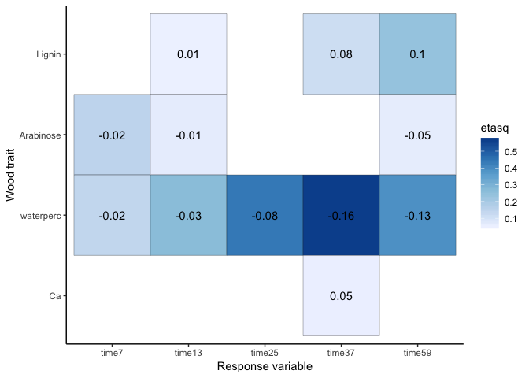<!-- -->

    ##   respvar r.squared
    ## 1   time7      0.27
    ## 2  time13      0.33
    ## 3  time25      0.44
    ## 4  time37      0.69
    ## 5  time59      0.63

  - Contribution of water content and arabinose at time7

<!-- end list -->

    ##  [1] "codeStem"  "code"      "species"   "curr.pmr"  "size"     
    ##  [6] "Lignin"    "Arabinose" "Rhamnose"  "waterperc" "Ca"       
    ## [11] "N"         "source"

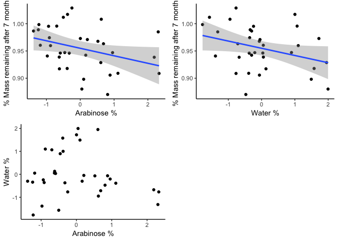<!-- -->

  - Contribution of water content and lignin at time 37 and 59
    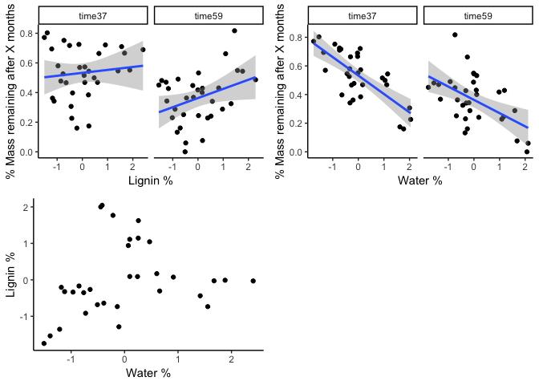<!-- -->

# Print results

Save bivariate predictor plots

    ## [1] "traits.code" "traits.stem" "cfract.code" "cfract.stem"

Save best model summaries

    ## [1] "traits.code" "traits.stem" "cfract.code" "cfract.stem"

    ##   respvar r.squared
    ## 1   w.t50      0.71
    ## 2   alpha      0.47
    ## 3    beta      0.71
    ## 4    w.r2      0.52

    ##   respvar r.squared
    ## 1   time7      0.40
    ## 2  time13      0.57
    ## 3  time25      0.52
    ## 4  time37      0.57
    ## 5  time59      0.49

    ##   respvar r.squared
    ## 1   w.t50      0.52
    ## 2   alpha      0.23
    ## 3    beta      0.39
    ## 4    w.r2      0.66

    ##   respvar r.squared
    ## 1   time7      0.17
    ## 2  time13      0.24
    ## 3  time25      0.45
    ## 4  time37      0.25
    ## 5  time59      0.22

Save plots to explore model results

    ## [1] "traits.code" "traits.stem" "cfract.code" "cfract.stem"

traits.code

    ## [1] "plots.water" "plots.beta"  "plots.size"

    ## quartz_off_screen 
    ##                 2

    ## quartz_off_screen 
    ##                 2

    ## quartz_off_screen 
    ##                 2

traits.stem

    ## [1] "plots"

    ## quartz_off_screen 
    ##                 2

cfract.code

    ## [1] "plots.l"    "plots.rhgl"

    ## quartz_off_screen 
    ##                 2

    ## quartz_off_screen 
    ##                 2

cfract.stem

    ## [1] "plots.early" "plots.mid"   "plots.man"   "plots.l"

    ## quartz_off_screen 
    ##                 2

    ## quartz_off_screen 
    ##                 2

    ## quartz_off_screen 
    ##                 2

    ## quartz_off_screen 
    ##                 2

Save model residuals

    ## [1] "traits.code" "traits.stem" "cfract.code" "cfract.stem"
