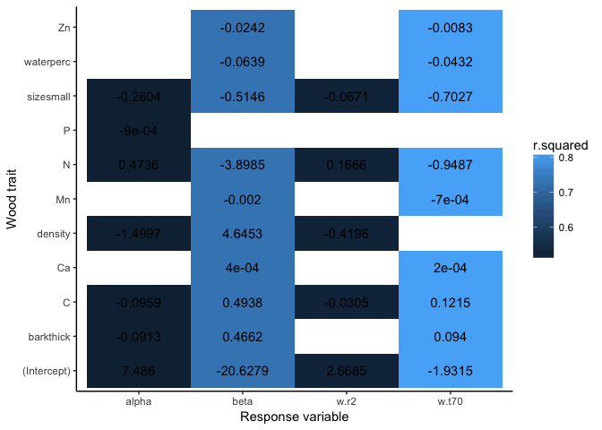
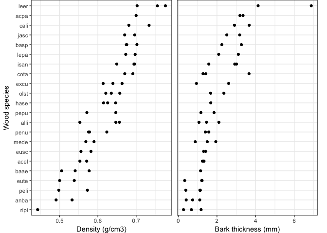
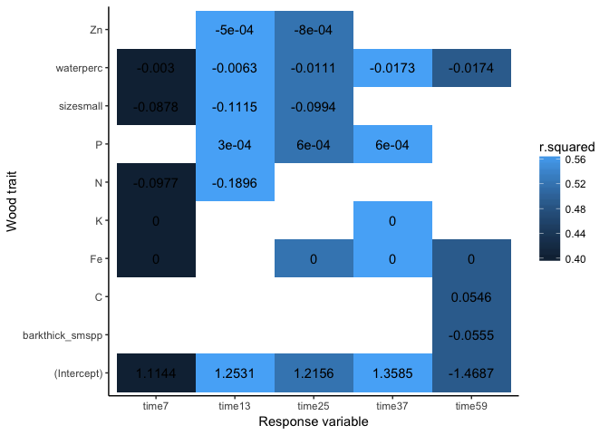

Do wood traits explain decay?
================
Marissa Lee
12/2/2018

Load libraries, functions, data

We expect initial wood traits will explain varitation in species+size decay rate (k and t70), species+size lagginess (alpha), and stem-level percent mass remaining at 7, 13, 25, and 37 months of decay. Specifically, we expect samples with (a) high water percent, (b) low density and total C, (c) high macro and micro nutrients, and (d) thicker bark (potential mech: limiting microbial colonization) to have faster decay and less lagginess.

*Hyp (species+size-level)* Species+size-level initial wood traits will predict variation decay rates and lagginess.
-------------------------------------------------------------------------------------------------------------------

Variation in w.t70 and beta (shape param) were best explained by traits (high r2); whereas traits explained much less variation in alpha (scale) and w.r2.

-   alpha: Samples that decay fast have low density. Other fast-decay attributes include: thin bark, low C, high N, and belonging to the large size class.
-   beta: Samples with a stronger S-shaped decay trajectory have low N and high density. Other attributes include: thick bark, high C, and belonging to the large size class.
-   w.r2: Samples with tightly-fitting decay models have high N, low density, and belong to the large size class.
-   w.t70: Samples with long wait times to 70% mass remaining have low N and belong to the large size class. Other attributes include: thick bark, high C, and low water content.

*Hyp (stem-level)* Stem-level initial wood traits will predict variation in percent mass loss at each time step.
----------------------------------------------------------------------------------------------------------------

First, we need to decide what trait data (and samples) to include in this analysis since we don't have full coverage of stem-level trait data. Density and bark thickness were only measured on small sized stems. If there is not be very much within-species variation in these traits that contribute to variation in percent mass loss than we can justify including species-level estimates of these traits in the stem-level model.

Plot the small-sized stem-level measures of density and barkthick 

A few species have a relatively large amount of within-species variation in density (i.e. alli) and barkthickness (i.e. leer and cota).

Compare model fits (r2) using stem and species-level data to identify how much information about percent mass remaining is lost by using species-level estimates.

-   For density -- Stem-level data (relative to code-level data) improves estimates of pmr after 7 and 59 months.
-   For barkthickness -- Stem-level data (relative to code-level data) does not improve estimates of pmr at any time point.

Compile a "stem-level" dataframe with (a) stem-level percent mass remaining values, (b) stem-level traits including waterperc and chemistry along, and (c) small species-level density and bark thickness data. Use model selection to determine which traits to include. 

The explanatory power of wood traits were lowest for the first decay time point (7 months). Samples had more mass remaining...

-   All time points: Low water content
-   Early-to-mid time points: Low N and belonged to the small size class
-   Mid time points: High P and low Zn
-   Late time point: High C and thin bark
